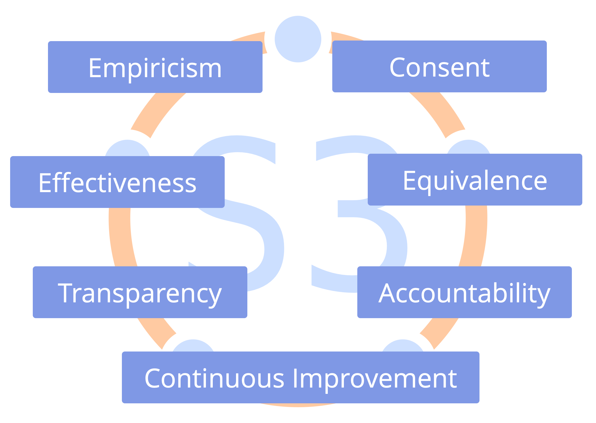
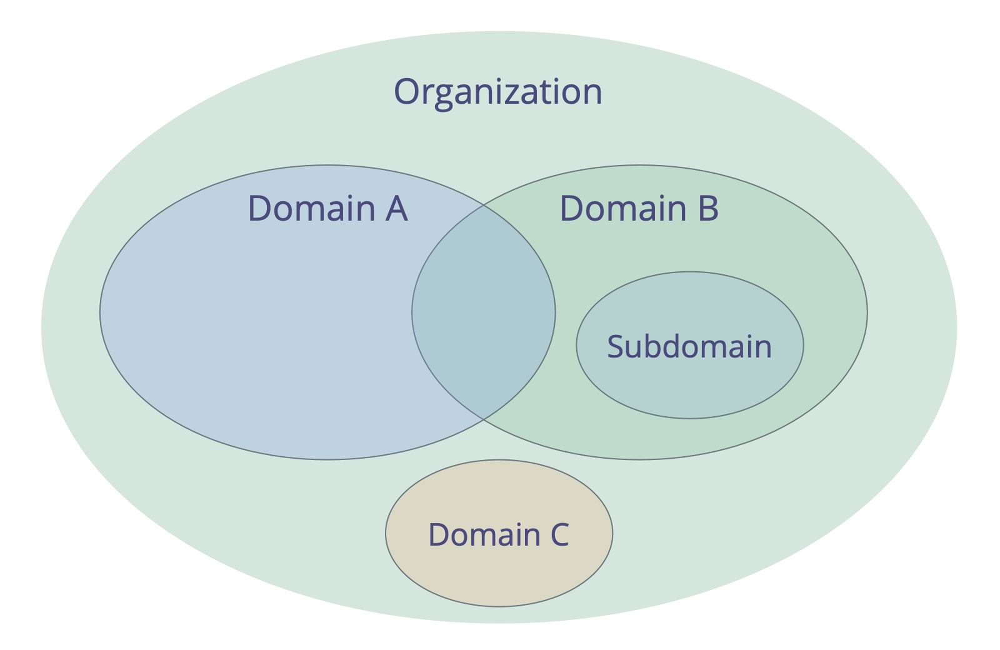
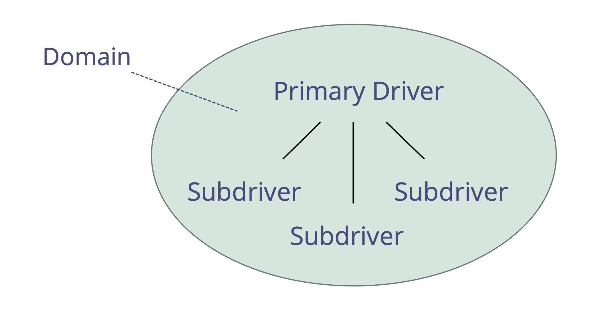
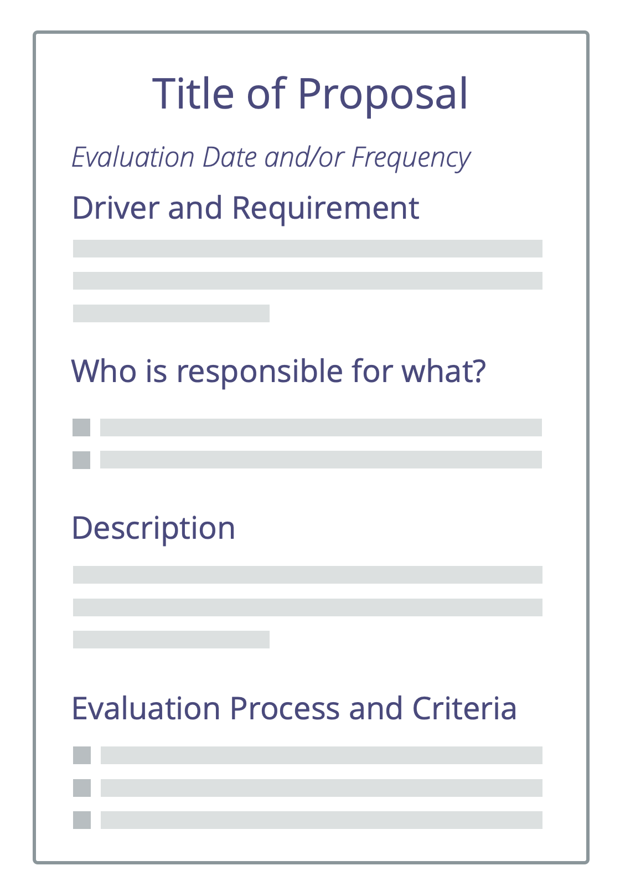
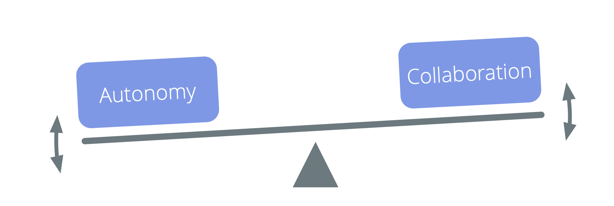
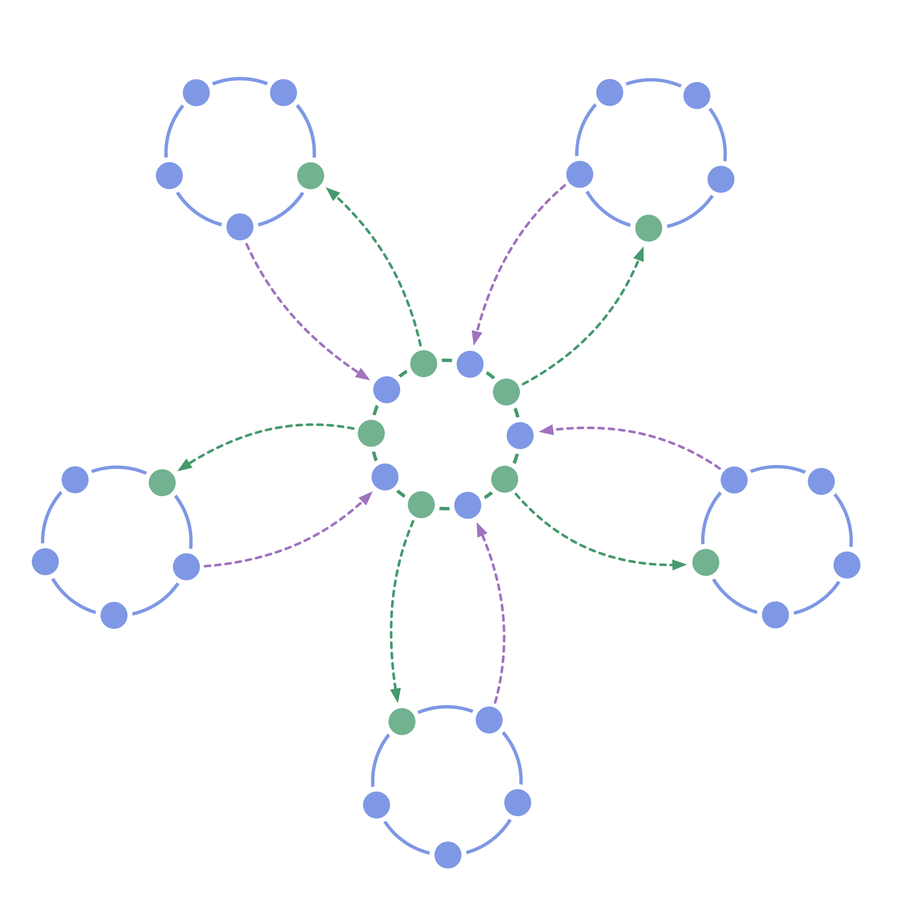

footer: ![] (img/by-sa-sm.png) B. Bockelbrink, J. Priest, L. David (v2018-06-25) - <http://sociocracy30.org>
slidenumbers: true
autoscale: true
theme: Plain Jane, 1

# [fit] Sociocracy 3.0

# A Practical Guide

#### James Priest, Bernhard Bockelbrink, Liliana David
#### <http://sociocracy30.org>

---

## Sociocracy 3.0 - A Practical Guide For Evolving Agile and Resilient Organizations 

### Effective Collaboration At Any Scale

-   **principles-based**: A coherent way for growing organizational integrity and developing a sociocractic and agile mindset
-   **flexible**: adaptable patterns, independent and mutually reinforcing, to help you with all aspects of collaboration
-   **free**: licensed under a Creative Commons Free Culture License

---

## What's in it for me?

Sociocracy 3.0 - **a.k.a. "S3"** - brings you an extensive collection of guidelines and practices (patterns)  that have proven helpful for organizations for **improving performance, alignment, fulfillment and wellbeing**. 

S3 helps you discover how to best reach your objectives and navigate complexity, one step at a time, **without the need for radical reorganization or a big change initiative**:

-   Simply start with your area of greatest need, select one or more patterns to try, **move at your own pace** and develop skills as you go. 

-   **Regardless of your position in the organization**, you will find patterns that are relevant and helpful for you.

---

## Contents

-   a brief overview of some basic concepts behind S3
-   a description of all the patterns in S3
-   an appendix with a changelog, acknowledgments, info about authors and license, a glossary and an index

---

## Influences and History

---

## Primary Driver for Sociocracy 3.0

> _In 2014 we came together to co-create a body of Creative Commons licensed learning resources, synthesizing ideas from Sociocracy, Agile and Lean. We discovered that organizations of all sizes need a flexible menu of practices and structures – appropriate for their specific context – that enable the evolution of a sociocratic and agile mindset to achieve greater effectiveness, alignment, fulfillment and wellbeing._

---

## Basic Concepts

Before diving into the content, consider taking time to learn about some basic concepts behind S3: 

- what is a pattern?
- the seven principles
- drivers, value and waste
- domains, delegation and accountability
- governance, self-organization, and semi-autonomy

For any terms you don't understand check out the glossary at the end.

---

## Patterns 

_A **pattern** is a template for successfully navigating a specific context._

-   S3 patterns are discovered through observing many organizations as they solve problems and respond to opportunities
-   S3 patterns can be evolved and adapted to suit differing contexts
-   the patterns are grouped by topic into ten categories

---

## All Patterns are based on The Seven Principles

---

## The Seven Principles

**The Principle of Effectiveness:** *Devote time only to what brings you closer towards achieving your objectives.*

**The Principle of Consent:** *Raise, seek out and resolve objections to decisions and actions.*

**The Principle of Empiricism:** *Test all assumptions through experiments and continuous revision.*

---

## The Seven Principles (…)

**The Principle of Continuous Improvement:** *Change incrementally to accommodate steady empirical learning.*

**The Principle of Equivalence:** *Involve people in making and evolving decisions that affect them.*

**The Principle of Transparency:** *Make all information accessible to everyone in an organization, unless there is a reason for confidentiality.*

**The Principle of Accountability:** *Respond when something is needed, do what you agreed to and take ownership for the course of the organization.*

---

## The Principle of Accountability

*Respond when something is needed, do what you agreed to and take ownership for the course of the organization.*

-   accountability applies to all agreements, including the organization itself, circles, and roles
-   everyone's primary accountability is for effective collaboration in response to organizational drivers
-   individuals and groups are accountable for their work, ongoing learning and development, with the organization providing necessary support
-   everyone in an organization is accountable for aligning action with organizational values
 

---

## Drivers

_A **driver** is a person’s or a group's motive for responding to a specific situation._

Drivers: 

-   can be used to derive goals, objectives, aims, mission, vision, purpose
-   can change over time

---

### Drivers: Value and Waste

_**Value** is the importance, worth or usefulness of something in relation to a driver._

_**Waste** is anything not necessary for - or standing in the way of - effective response of a driver._

By adopting the concept of value and waste, many practices and ideas from **lean production** and **lean software development** can be utilized by organizations pulling in S3 patterns:

-   value stream mapping
-   various strategies for eliminating waste
-   the Kanban Method

---

## Domains

_A **domain** is a distinct area of influence, activity and decision making within an organization._

All domains are within the overall domain of an organization and may overlap and/or be fully contained within other domains.

Domains are delegated to people (e.g. to a unit, department, team or individuals), who take accountability for the domain, within its defined constraints on influence and autonomy.

---

## Delegating Domains

Those delegating a domain (the _delegators_) still retain overall accountability for that domain, and often define:

-   **key responsibilities** (any essential work and decision making being delegated)
-   **constraints to autonomy and influence** for those the domain is delegated to, usually related to the organization itself (e.g. budget, resources, level of delegation, reporting)

---

## Drivers and Domains

It's also possible to understand a domain in relation to organizational drivers:

-   the domain's **primary driver** - the main driver the people accounting for that domain respond to
-   the set of subdrivers the organization may benefit from addressing when responding to the primary driver, which include :
    -   **key responsibilities** (any driver following directly from the domain's primary driver)
    -   drivers for **constraints** (which typically relate to the organization's wider context)

---

## Governance, Semi-Autonomy and  Self-Organization

**Governance**: Making and evolving decisions about what to do to achieve objectives, and setting constraints on how and when things will be done.

**Self-Governance**: People governing themselves within the constraints of a domain.

**Self-Organization**: People organizing work within constraints defined through governance.

**Operations** (Doing the Work): The work being done to create and deliver value, guided by governance

**Semi-Autonomy**: The autonomy of people to create value, limited by the constraints of their domain (including the influence of delegator(s) and representatives), and by objections from others.

---

## Governance vs. Operations

Tracking, reviewing and evolving decisions made to achieve objectives enables an organization to continuously learn and improve.

_Does it require or benefit from an individual or group decision?_

-   yes: governance
    -   not covered by a previous agreement
    -   needs to be agreed, decided or amended
-   no: operations
    -   covered by previous agreement (those accountable are free to act)
    -   needs to be done

---

---

## Pattern 1.1: Respond to Organizational Drivers

_Clarify organizational drivers (i.e. what's happening and what's needed in relation to the organization), and respond as required._

Responses to organizational drivers include:

- direct action (operations)
- organizing how work will be done 
- making governance decisions

The response to an organizational driver is typically treated as an experiment that is evaluated and evolved over time.

---

### Qualify Organizational Drivers

A driver is considered an **organizational driver** if responding to it would help the organization generate value, eliminate waste or avoid harm.

A simple way to qualify whether or not a driver falls within an organization's domain is by checking:

_Would it help the organization if we respond to this situation / driver? or would it harm us if we don't?_

---

### Review of Drivers

It's also important to review the driver. Helpful questions for a review include:

Is the description of the situation still correct?
Do we still associate the same needs with the situation?
Is the driver still within our domain?
Is the driver still relevant?

---

## Pattern 1.2: Navigate Via Tension

**Individuals identify and account for organizational drivers by investigating tension they experience.**

**Challenges and opportunities** for an organization are revealed by people bringing awareness to the reasons for tension they experience.

**Note:** In this context, a _tension_ is a personal experience: a symptom of dissonance between an individual's perception of a situation, and their expectations (or preferences).

To **discover drivers**, investigate what stimulates tension, and describe what's happening and what's needed. Sometimes an inquiry reveals misconceptions and the tension goes away.

---

## Navigate Via Tension (…)

**All members** bring awareness to what might help or harm the organization, and respond to the drivers they discover.

Awareness of **organizational drivers** can be passed to an appropriate domain to be addressed.

---

---

# Pattern 1.3: Describe Organizational Drivers

**Describe organizational drivers to understand, communicate and remember them.**

A simple way to describe a driver is with a **brief statement** explaining: 

-   **What’s happening...:**
    -   the **current situation**
    -   the **effect** of this situation on the organization
-   ...and **what’s needed:**
    -   the **need** of the organization in relation to this situation
    -   the **impact** of attending to that need

---

# Describe Organizational Drivers (…)

Depending on their perspective, a person or group may decide to describe a driver as a problem to solve or an opportunity to leverage. 

_A **driver statement** is a brief but comprehensive summary of the information required to understand a driver._

The driver statement contains just enough information to communicate the need for an action or a decision. Typically a driver statement can be summed up in one or two sentences.

More information about the scope and details of the driver may be recorded besides the initial driver statement. 

---

## Example driver statement: 

> _“The kitchen is a mess: there are no clean cups, the sink is full of dishes and it’s not possible to quickly grab a coffee and get right back to work. We need the kitchen in a usable state so we can stay focused on our work.”_

---

## 1. Current Situation

> _“The kitchen is a mess: there are no clean cups, the sink is full of dishes...”_

Describe the current situation:

- Briefly capture the essentials of what is happening.
- Be objective: Describe observations and avoid evaluation.

---

## 2. Effect

> _“...it’s not possible to quickly grab a coffee and get right back to work.”_

Explain the effect of this situation on the organization:

- Clarify **why** the situation needs attention: how does it affect the organization? 
- Be explicit about effects being current or anticipated. 
- Explain challenges, losses, opportunities or gains. 

---

## 3. Need

> _“We need the kitchen in a usable state...”_

Explain the need of the organization in relation to this situation:

- A **need of an organization** is anything a group (or individual) needs to effectively account for a domain. 
- When there’s disagreement about the need(s), it’s helpful to zoom out from specific solutions.
- Be specific on whose need it is (“we need”, “they need”, “I need”) .
- Avoid describing specific solutions disguised as needs.

---

## 4. Impact

> _“...so we can stay focused on our work”._

Describe the impact of attending to that need:

- Explain intended outcome, potential benefits or opportunities.
- The impact may be obvious or implicit, especially when the effects of the current situation are already described.

---

## Pattern 1.4: Consent Decision Making

**A (facilitated) group process for decision making.**

Invite objections, and integrate the wisdom they reveal, to evolve proposals or existing agreements.

Withholding objections can harm the objectives of a group or organization

Proposals become agreements when they are considered _good enough for now and safe enough to try_ until the next review.

Unresolved objections prevent proposals from becoming agreements.

---

### Implicit Contract of Consent

-   In the absence of objections against an agreement, I intend to follow through on the agreement to the best of my ability.
-   I agree to share objections as I become aware of them.

---

## Pattern 1.5: Objection

_An **objection** is a reason why doing something stands in the way of (more) effective response to an organizational driver (or objective)._

Objections contain information that reveals **certain or likely consequence of harm** and/or **opportunities to immediately improve** proposals, decisions, existing agreements or actions. 

---

## Objection (…)

It's the accountability of individuals to raise potential objections. 

Withholding objections can harm the ability of individuals, groups or
the whole organization to respond to organizational drivers.

Being able to raise *potential* objections at any time means decisions only need *to be good enough for now and safe enough to try*.

Those accountable for the action or (proposed) agreement in question, are responsible for *considering arguments and addressing objections.*

---
### Objection (…)

When seeking out potential objections, consider:

- **effectiveness**: Why the intended outcome would not (or only partially) be achieved.
- **efficiency**: Why it would be wasteful to proceed as proposed (or previously agreed).
- **side-effects**: The negative consequences something would have elsewhere (in the same domain, or in the wider organization, or beyond).

---

### Objection (…)

The information revealed by objections can be used to improve:

-   current and planned action
-   people executing on decisions
-   existing agreements
-   proposals
-   our understanding of drivers

---

## Qualify Objections

Some arguments raised are not in fact objections. Distinguish between objections, which always reveal useful information, and other arguments only based on opinion, preference or concerns.

To find out whether an argument qualifies as an objection, a facilitator might ask the group:

_“Do you think this argument qualifies as an objection?”_

If nobody disagrees with the argument, an objection typically qualifies, otherwise aim to discover the actual objection or to reveal the misconception.

---

### Understanding Objections

Some helpful questions:

-   How does the argument relate to this specific proposal or agreement?
-   Does the argument reveal how a (proposed or current) **action or agreement**:
    -   harms response to any organizational driver?
    -   can be improved right now?
    -   prevents or diminishes someone's contribution towards responding to a driver?
    -   is in conflict with the organization's values?
    -   is considered not ‘safe enough’ to try?

---

### Concerns

_A **concern** is an opinion that doing something (even in the absence of objections) **might** stand in the way of (more) effective response to an organizational driver._

In consent decision making, concerns can inform ways to further evolve agreements (including evaluation criteria and frequency of evaluation).  

Bring up concerns if you consider them important and at least record them along with evaluation criteria.

If you are in doubt whether you have an objection or a concern, raise it as a potential objection it it qualifies as an objection.

---

## Pattern 1.6: Resolve Objections

---

### A way for resolving objections

---

## Pattern 1.7: Evaluate And Evolve Agreements

Regular review of agreements is an essential practice for a learning organization. 

Continuously evolve the body of agreements, and eliminate waste:

-   adapt to changing context
-   integrate learning
-   ensure all agreements have an appropriate review date 

---

## Evaluate And Evolve Agreements (…)

Evaluating agreements can be as simple as checking that it is still relevant, and there is no objection to keeping the agreement as it is.

Agreements are often reviewed in *Governance Meetings*, however sometimes it's effective to schedule a dedicated session for reviewing an agreement.

Adjust review frequency as necessary, review earlier if required.

Elements of this process can also be used by individuals to evaluate decisions they make.

---

## Short Format for Evaluating Agreements

-   _How has this agreement helped us?_
-   _How can this agreement be improved?_
-   _Is there any reason why not to continue with this agreement?_
-   Agree on next review date

---

## Long Format For Evaluating Agreements

Preparation:

-   schedule review
-   ensure necessary information is available

Follow-up:

-   agree on next review date
-   documentation / notification
-   tracking tasks and decisions
-   effects on related agreements

---

## Pattern 1.8: Those Affected Decide

Involve everyone who will be affected by a decision, to maintain equivalence and accountability, and increase the amount of information available on the subject.

For larger groups:

-   facilitate a process in several stages and create smaller groups who select delegates
-   set out a virtual, asynchronous, time-boxed and staged process

Consider including those affected also in review and evolution of decisions.

---

## Pattern 1.9: Co-Create Proposal

**To tap collective intelligence, build sense of ownership and increase engagement and accountability, bring people together to co-create proposals in response to organizational drivers.**

There are many ways a group of people can co-create proposals. Generally they follow a similar pattern:

1. Agree on the driver (or problem / opportunity)
2. Explore the topic
3. Generate ideas
4. Create proposal in small(er) group

---

## Co-Create Proposal (…)

One way to do this is S3's _Proposal Forming_ pattern. 

For inspiration for steps 2 and 3, look to classic group facilitation techniques or design thinking activities.

Besides a face-to-face workshop, you can adapt this process for online meetings or even asynchronously and over an extended period of time to include many people.

---

## Pattern 1.10: Proposal Forming

**A (facilitated) group process for co-creating a response to a driver.**

-   draws on the collective intelligence and diversity of perspective within a group
-   involves people in co-creating agreements
-   fosters accountability and sense of ownership

Proposal forming may be also be used by an individual.

---
  
### Proposal Forming Steps

- **Consent to driver**: _Is this driver relevant for us to respond to? Is the driver statement an accurate description of what is happening and what is needed?_
- **Deepen shared understanding of driver**: invite essential questions to understand more detail about the driver.
- **Collect considerations** phrased as questions relating to possible solutions. Questions either reveal constraints (information gathering questions) or possibilities (generative questions).
- **Answer** any information gathering questions if possible.
- **Prioritize** considerations.
- **Gather ideas** as possible ingredients for a proposal.
- **Design a proposal** for addressing the driver considering the creative ideas and information gathered so far. This is usually done by a smaller group (tuners).
  
---

### Choosing Tuners

-   who should be there?
-   who wants to be there?
-   who else may have a valuable contribution to make?
-   consider expertise, outside view, and inspiration
-   any objections to this group?

---

## Pattern 1.11: Role Selection

**A group process for selecting people for roles.**

-   People avoid expressing interest before the selection
-   Nominations are made on the strength of the reason, not according to the majority
-   You can nominate yourself or pass
-   When checking for objections, ask the person nominated last

Objections to a nominee may be resolved in many ways, including amending the role's domain description or by nominating someone else.

**Note:** This pattern can also be used for selection between a variety of options in other circumstances.

---

## Pattern 1.12: Driver Mapping

A workshop format to identify an effective response to a complex situation: organize start-ups, kick-off projects, tackle major impediments or opportunities, align organizational structure to the flow of value.

Small or large groups identify and prioritize drivers, progressing quickly from concept to action in self-organizing teams.

---

## Driver Mapping (…)

---

### Driver Mapping: Template for Domains 

---

---

## Pattern 2.1: Ask For Help

**A simple protocol for learning, skill sharing, and building connections, with respect for people's autonomy.**

Ask someone, "_would you be willing to help me with ..._?"  The person asked answers with a simple "_yes_" or "_no_".

-   if the request is declined, the person asking accepts the answer without negotiation or inquiry
-   if the request is unclear, inquire for more information
-   if you accept a request for help, support your peer in the best way you can

---

## Pattern 2.2: Peer Feedback

Invite a peer to give you some constructive feedback on: 

-   performance in a role
-   general feedback about your participation and collaboration
-   any specific aspect you may be interested in

Considerations:

-   ask peers to take some time to prepare
-   invite both **appreciations** and **actionable improvement suggestions**
-   inquire to better understand the feedback, and avoid to discuss or judge it
-   decide for yourself what you will do with the feedback

---

## Pattern 2.3: Peer Review

**People support each other to learn and grow in the roles and groups they serve.**

The role keeper - or group - leads the peer review by setting up the process and speaking first in each step.

Ensure to invite people with complementing perspectives to contribute to the review, and a facilitator.

Improvement suggestions apply to personal development, collaboration, updates to domain description (including driver statement) and strategy.

---

## Peer Review (…)

### Continuous improvement of people's ability to effectively fulfill roles or collaborate together in groups.

---

## Pattern 2.4: Development Plan

**A plan for how to develop more effective ways of accounting for a domain, agreed between delegator and delegatee.**

The development plan may be created for a person in a role, or for a group (e.g. a department, circle, team or open domain).

Development may happen in the form of refining description of driver and domain, amendments to strategy, new or updated agreements and specific actions to be taken, either within the domain of the delegator, or the domain of the delegatee.

A development plan (and any accompanying recommendations for changes to the domain description and driver statement) requires consent from both the delegatee and the delegator.

---

---

---

## Pattern 3.1: Artful Participation

An **individual commitment** to developing helpful interactions and effective collaboration:

-   actively **consider and follow-up on all agreements** made, in the best way possible, given the circumstances
-   **develop awareness and understanding** of individual and collective needs
-   **grow the necessary skills** to do so
-   **support others** in doing the same 
-   bring impediments to the attention of others if necessary

Participating artfully may include interrupting, objecting or breaking  agreements.

---

### Benefits Of Artful Participation

- enables co-creation and evolution of agreements
- helps to grow stronger teams
- builds self-accountability, integrity and trust
- generates a culture of mutual support and close collaboration
- even more powerful when embraced by many

---

### Artful Participation: Self-Assessment

-   How will I support myself and others in participating more artfully? 
-   Where are my interactions with others unhelpful or ineffective?
-   Which agreements do I find hard to keep or contribute to? What can I do to address this?
-   What skills could I develop, that would support me to participate more artfully?
-   What would artful participation mean in relation to:
    -   my daily activities?
    -   collaboration and interaction with others?
    -   the organization? ...our customers or clients?
    -   the wider environment?

---

## Pattern 3.2: Adopt The Seven Principles

---

## Adopt The Seven Principles (…)

-   align collaboration with the Seven Principles
-   adopting the Seven Principles reduces the number of explicit agreements required, and guides adaptation of S3 patterns to suit the organization's context
-   an organization's actual values need to embrace Sociocracy 3.0 principles

---

## Pattern 3.3: Agree On Values

**Intentionally shape the culture in your organization.**

_A **value** is a principle that guides behavior. Values define scope for action and ethical constraints._

-   each member brings their own values to an organization based on personal experiences and beliefs
-   a group or organization may **choose to collectively adopt values** to guide their collaboration

--- 

## Agree On Values (…)

-   values offer guidance to determine appropriate action, even in the absence of explicit agreements
-   defining values is a **strategy** that supports effectiveness of an organization:
    -   reduces potential for **misunderstanding**
    -   **aligns** decision making and action
    -   **attracts new members, partners and customers** who are aligned with the organization
-   values are an agreement and thus subject to **regular review**

---

## Pattern 3.4: Governance Facilitator (Role)

A governance facilitator:

-   is accountable for ensuring governance meetings are facilitated, stay on track and are evaluated
-   is (usually) selected by a group from among it members
-   familiarizes themselves with the governance backlog
-   often invites others to facilitate some agenda items

---

## Governance Facilitator (…)

To support effective governance, the facilitator should be familiar with the following patterns:

-   rounds
-   proposal forming
-   consent decision making
-   role selection
-   evaluate meetings
-   resolve objections
-   peer reviews

---

## Pattern 3.5: Breaking Agreements

-   is sometimes **necessary**...
-   ...but may come at a **cost** to the community
-   be accountable!
    -   **clean up** disturbances
    -   **follow up** ASAP with those affected or accountable
    -   **initiate changes** instead of repeatedly breaking the same agreement

---

## Pattern 3.6: Contracting And Accountability

When entering into formal or informal agreements with others:

-   ensure all parties understand what's expected of them and intend to keep to the agreement
-   verify the agreement is beneficial to all parties, and that expectations are realistic

In cases where you still think it's necessary, be accountable for the consequences of breaking an agreement.

---

## Contracting And Accountability (…)

To preserve organizational culture, maintain self-accountability and help new members of an organization or circle have a smooth start:

- define expectations for new members (both cultural fit and the skills required)
- align contract with both organizational culture and legal requirements
- consider a probationary period
- have clear procedures for breaches of contract

---

## Pattern 3.7: Transparent Salary

-   transparent salaries need to be fair
-   fairness has several orthogonal dimensions    
-   perception of fairness is specific to organizational context
-   consider members and relevant stakeholders (e.g. investors)
-   create a salary formula:
    -   fixed: subsistence guarantee
    -   variable: fair distribution of gains and costs
-   consider remuneration for changing roles
-   create strategy for transitioning towards new contracts and compensation agreements

---

### Two Ways of Opening Salaries

---

## Pattern 3.8: Support Role

**Apply the role pattern to external contractors.**
    
-   clarify and describe driver for the role
-   create domain description
-   implement a selection process
-   limit term of the contract
-   build in regular peer reviews

Support roles may be operational only, and external contractors consent to account for their role.

---

## Pattern 3.9: Bylaws

Secure S3 principles and patterns in your bylaws as needed to protect **legal integrity** and **organizational culture**

Consider:
    
-   consent and equivalence in decision making
-   selection process for leadership roles
-   organizational structure, values and principles
-   influence of owners or shareholders
-   sharing gains and costs

---

---

## Pattern 4.1: Delegate Influence

Decentralize power to influence within defined constraints. Enable people to decide and act for themselves in response to organizational drivers.

The delegator supports people in delivering value by:

- defining domains of accountability and autonomy clearly
- ensuring ongoing learning and development
- providing support as needed

Adjust constraints incrementally, considering capabilities, reliability and outcome.

Decentralize as much as possible, retain as much influence as necessary.

---

## Pattern 4.2: Circle

  

_A **circle** is an equivalent, self-governing, and semi-autonomous group of people collaborating to account for a domain._

A circle:

-   may be permanent or temporary
-   may be self-organizing
-   is accountable for its own development and its body of agreements

---

## Circle (…)

-   **semi-autonomous**
    -   a circle acts within the constraints of their domain
    -   each circle can create value autonomously
-   **self-governing**:
    -   a circle continuously decides what to do to account for their domain, and sets constraints on how and when things will be done.

---

## Pattern 4.3: Role

**Delegate accountability for a domain to individuals.**

A role is an area of accountability defined by a domain and assigned to an individual (the **role keeper**), who has autonomy to decide and act within the constraints of the role's domain.

The role keeper leads in creating a strategy for how to account for their domain, and evolves their strategy in collaboration with the delegator.

A role is a simple way for a group to delegate recurring tasks or a specific area of work to one of its members.

--- 

## Role (…)

- people can be in more than one role, and roles can be fulfilled by more than one person
- role keepers are selected by consent and for a limited term
- peers support one another to develop in the roles they fulfill

A role keeper may maintain a logbook and a governance backlog to evolve their approach towards delivering value.

**Note**: In S3, guidelines, processes or protocols created by individuals in roles are treated as agreements.  

---

### Role: one way to account for a domain

---

## Pattern 4.4: Linking

**Facilitate flow of information and influence between two groups.**

A group selects one of its members to represent their interests in the governance decisions of another group.

---

## Pattern 4.5: Double Linking

**Facilitate _two-way_ flow of information and influence between two groups.**

Two interdependent groups each select one of their members to represent their interests in the governance decisions of the other group.

Double linking enables equivalence between two groups and can be used to draw out valuable information in hierarchical structures.

---

## Pattern 4.6: Representative (role)

Representatives (a.k.a. links):

-   stand for the interests one group in another group
-   are selected for a limited term
-   participate as full members in the **governance decisions** of the circle they are delegated to, and can:
    -   raise items for the agenda
    -   participate in forming proposals
    -   object to agreements and proposals (when there is reason to do so)

---

## Pattern 4.7: Helping Team

A group of people with the mandate to execute on a specific set of requirements defined by a delegator.

A helping team: 

-   is a way for a delegator to expand their capacity
-   may be self-organizing, or guided by a coordinator chosen by the delegator
-   is governed by the delegator
-   benefits from a clearly defined domain

Members of the helping team:

-   can object to the delegator's decisions that affect them
-   can add items to the delegator's governance backlog
-   may be invited to select a representative to participate in the governance decisions of the delegator

---

## Pattern 4.8: Open Domain

**A way to intentionally account for a domain by invitation rather than assignment.**
 
The delegator of the open domain clarifies:
 
- primary driver, key responsibilities and constraints of the open domain
- who is invited to contribute to the open domain
- constraints relating to the delegator’s participation in the open domain’s governance
 
The delegator of the open domain is accountable for ensuring regular review of the open domain.

Depending on the constraints set by delegators, contributors may only organize and do work, or take part in governance as well.

---

## Pattern 4.9: Open Systems

An organization can benefit from intentionally communicating with and learning from others.

Acknowledging its interdependence, an organization can consciously invite **outside information, influence or skills** to assist with making decisions and to support collective learning.

---

## Open Systems (…)

-   **External experts** can offer an outside perspective and bring knowledge, understanding and skills
-   **Representatives of affected parties** can inform and influence decision making in ways that benefit overall objectives (see Those Affected Decide)

---

---

## Pattern 5.1: Adapt Patterns To Context

**Adapt and evolve S3 patterns to fit your specific context.**

-   ensure everyone affected by adaptation:
    -   understands why it is necessary to adapt the pattern
    -   is present or represented when doing so
-   use S3 principles as a guide for adaptation
-   run experiments with adaptations for long enough to learn about benefits and potential pitfalls
-   consider sharing valuable adaptations with the S3 community

---

## Pattern 5.2: Create a Pull-System For Organizational Change

**Create an environment that invites and enables members of the organization to drive change.**

Change things when there is value in doing so:

-   bring in patterns that solve current and important problems
  * don't break what's already working!
  * meet everyone where they are…
  * …and let them choose their own pace
-   consider making all change voluntary!

---

## Pattern 5.3: Be The Change

**Lead by example.**

Behave and act in the ways you would like others to behave and act.

---

## Pattern 5.4: Invite Change

**It's often more effective to invite change than to impose it.**

Avoid resistance:

-   be transparent about the reason for the change
-   clarify expectations and constraints
-   avoid coercion or manipulation
-   acknowledge skepticism and doubts
-   include people in regular evaluation and evolution

---

## Pattern 5.5: Open-Space For Change

**Invite everyone to create and run experiments for evolving the organization.**

-   identify the driver for change
-   schedule regular open space events:
    -   invite all members to create and run experiments
    -   define constraints for the experiments that enable development of a sociocratic and agile mindset (e.g. S3 principles)
    -   review and learn from experimentation in the next open space
    -   repeat

---

## Pattern 5.6: Continuous Improvement Of Work Process With S3

**To reveal drivers and establish a metrics-based pull-system for organizational change.**

-   introduce the principle of consent and _Navigate Via Tension_ to evolve work process in one team
-   consider selecting a facilitator and agreeing on values
-   trigger continuous improvement (e.g through Kanban)
-   team members pull in S3 patterns as required
-   expand the scope of the experiment iteratively
-   intentionally look out for impediments  

---

### Waste And Continuous Improvement

**Waste** _is anything not necessary for - or standing in the way of - effective response to a driver._

-   waste exists in various forms and on different levels of abstraction (tasks, processes, organizational structure, mental models...)
-   establishing a process for ongoing elimination of waste enables natural evolution of an organization towards greater effectiveness
-   adaptation to changing context is built into the process

---

---

### S3 promotes a hypothesis-driven approach to decision making

---

### Agreement Life-Cycle

---

## Pattern 6.1: Agreement

_An **agreement** is an agreed upon guideline, process or protocol designed to guide the flow of value._

-   agreements are created in response to drivers 
-   **overall accountability** for an agreement lies with the people that make them
-   an agreement can include **delegation of specific responsibilities** to individuals or groups
-   agreements are **regularly reviewed**
-   record those agreements you might want to reference later

**Note**: In S3, guidelines, processes or protocols created by individuals in roles are treated as agreements.  

---

### Template for Agreements

---

## Pattern 6.2: Develop Strategy

_A **strategy** is a high level approach how people will create value to successfully account for a domain._

-   an organization, group or role keeper develop their own strategy
-   a strategy often includes a description of the intended outcome
-   as the delegator shares accountability for the domain, it's valuable they review the strategy, identify potential impediments and suggest improvements 
-   strategy is a shared agreement between delegator(s) and delegatee(s) that is regularly reviewed and updated as necessary (*pivot or persevere*)

---

## Strategy (…)

### Strategies are implemented and refined through experimentation and learning. 

---

## Pattern 6.3: Clarify Domains

A clear understanding of people's area of accountability and autonomy enables greater efficiency, effective collaboration and agility throughout the organization.

A simple way to clarify domains is with a **domain description** that contains:

-   primary driver
-   key responsibilities
-   constraints
-   evaluation criteria for peer review
-   term (for a role)
-   (previous versions)

---

## Clarify Domains (…)

Domain descriptions can be created for a role, position, circle, team, open domain, department, unit, or the whole organization.

You can either start by clarifying existing domains, or at least clarify new ones.

One way of clarifying a domain is by filling out a [S3 Delegation Canvas](http://s3canvas.sociocracy30.org/s3-delegation-canvas.html).

---

## Pattern 6.4: Intended Outcome

-   a concise description of the expected result of an agreement, action, project or strategy
-   specific *Evaluation Criteria* and metrics can be helpful for reviewing the actual outcome

---

## Pattern 6.5: Describe Deliverables

_A **deliverable** is a product, service, raw material, experience or transformation, provided as a result of an agreement._

In the context of an agreement, clearly describing deliverables supports shared understanding:

-   include the necessary amount of detail
-   reference other documents when helpful or necessary

---

## Describe Deliverables (…)

Explicitly defining deliverables can be useful for improving: 

-   organizational strategy
-   circle strategy
-   development plans
-   domain descriptions
-   any other agreement (e.g. business goals, process policy, customer communication)

---

## Pattern 6.6: Evaluation Criteria

Well-defined evaluation criteria can help to understand whether or not an agreement has had the desired effect.

-   go for **simple and unambiguous** criteria and document them (to avoid discussion when reviewing your agreements)
-   define **actionable metrics** to continuously track effects and spot deviations from intended outcomes
-   set a **specific threshold** under which this agreement is considered unsuccessful

---

## Pattern 6.7: Logbook

A logbook is a (digital) system to store all information relevant for running an organization and its teams. The logbook is accessible to all members of an organization, and information is kept confidential only when there is good reason to do so.

Common platforms for logbooks are Wikis (e.g. Dokuwiki or MediaWiki), Content Management Systems (e.g. Wordpress), G Suite, Evernote or Trello etc.

---

### Logbook Contents

-   Organization: 
    -   primary driver, strategy and organizational values
    -   organizational structure (domains and connections)
    -   agreements 

-   Circle: 
    -   circle description and strategy
    -   agreements (including delegatees' domain descriptions, strategies and development plans)
    -   backlogs and other information relating to a circle's work and governance

---

### Logbook Contents (…)

-   Personal logbooks
    -   domain descriptions, strategies and development plans
    -   governance and operational backlogs for roles
    -   decisions related to delivering value in a role

---

## Pattern 6.8: Logbook Keeper (Role)

The logbook keeper is accountable for maintaining a circle's logbook by: 

-   recording details of agreements, domain descriptions, selections, evaluation dates, minutes of meetings etc.
-   organizing relevant information and improving the system when valuable
-   keeping records up to date
-   ensuring accessibility to everyone in the circle (and in the wider organization as agreed)
-   attending to all technical aspects of logbook keeping

---

---

## Pattern 7.1: Governance Meeting

Groups meet at regular intervals to decide what to do to achieve objectives, and to set constraints on how and when things will be done.

A governance meeting is usually:

-   facilitated 
-   prepared in advance 
-   time-boxed for a duration of 90-120 minutes
-   scheduled every 4 weeks

---

## Governance Meeting (…)

A typical governance meeting includes: 

-   opening round: attune with each other and to the driver (or objectives) of the group
-   administrative matters 
    -   consent to last minutes, date for next meeting, etc.
    -   check for last-minute agenda items and consent to agenda
-   agenda items 
-   meeting evaluation: reflect on your interactions, celebrate successes and share suggestions for improvement
-   closing

---

## Governance Meeting (…)

Typical agenda items include:

-   any short reports 
-   evaluation of existing agreements due review
-   selecting people to roles 
-   new drivers requiring decisions to be made, including: 
    -   forming proposals
    -   making agreements 
    -   designing domains and deciding how to account for them (e.g. new roles, circles, teams or open domains)

---

## Pattern 7.2: Retrospective

Building in continuous improvement of work process through reflection and learning from past experience.

-   output: changes to work process, new tasks, on-the-fly agreements, and drivers requiring an agreement
-   facilitated meeting (~1hr)
-   regular intervals (1-4 weeks)
-   adapt to situation and context

---

### Output of a Retrospective 

---

### Five Phases of a Retrospective Meeting

1. Set the stage 
2. Gather data
3. Generate insights
4. Decide what to do
5. Close the retrospective

Many different activities for each phase can be found at [plans-for-retrospectives.com](http://www.plans-for-retrospectives.com/)

---

## Pattern 7.3: Daily Standup

**A meeting to organize work, facilitate learning, improve productivity and effectiveness.**

-   time-boxed (usually 15 minutes)
-   held daily at the same time
-   the group gathers around a visible project management board/tool to:
    -   organize daily work
    -   address impediments/blocks
    -   adapt existing agreements or create new agreements on the spot

---

## Pattern 7.4: Planning And Review Meetings

People meet at regular intervals (1-4 weeks) in time-boxed meetings to plan and review work.

-   select and estimate work items for the next iteration in a planning meeting
-   review completed work items and decide on re-work and changes for the next iteration in a review meeting

---

## Pattern 7.5: Coordination Meeting

**Meet on a regular basis (usually weekly) for reporting on and coordinating work across domains.**

-   facilitate the meeting and use rounds instead of discussions where valuable
-   if possible, compile the agenda before the meeting
    -   include any prerequisites for attendees to prepare
    -   further items may come up when hearing status reports

---

## Coordination Meeting (…)

---

## Coordination Meeting (…)

Agenda items: 

- cross domain synchronization and alignment
- prioritization and distribution of work  
- responding to impediments

---

---

## Pattern 8.1: Rounds

 

**A group facilitation technique to maintain equivalence.**

-   go around the circle giving everyone the chance to speak
-   begin each round with a different person, and change direction (clockwise or ccw) to bring variation to who speaks first and last, and to the order of people's contributions.

Experienced groups might sometimes choose to fast-track certain rounds in S3 group processes.

---

## Pattern 8.2: Facilitate Meetings

Choose someone to facilitate a meeting. Even an inexperienced facilitator can help to focus a meeting and make a positive difference.

-   prepare an agenda of topics
-   select a facilitator who:
    -   facilitates a suitable activity or format for each topic
    -   holds the space, keeps the time and navigates the agenda during the meeting
    -   facilitates an evaluation of the meeting at the end

---

## Pattern 8.3: Prepare For Meetings

**Prepare in advance to make meetings more effective.**

Organizing the meeting:

- clarify and communicate the driver for, and intended outcome of the meeting
- decide who to invite 
- schedule the meeting enough in advance, so people have time to prepare
- choose an appropriate duration for the meeting 
- be clear who will facilitate the meeting, who will take minutes and who will take care of the follow-up

---

## Prepare the Agenda

Involve people in preparing and prioritizing the agenda and send it out in advance

For each agenda item agree on:

- the driver 
- the intended outcome
- the process
- the time you want to spend on it 
- what people need to do to prepare

---

## Support the Participants' Preparation

- consider what can be done in advance to prepare for the meeting
- notify people about any expectations and prerequisites
- make any resources available that people may need for preparation

--- 

## As a participant

- consider _Artful Participation_ pattern
- review the agenda and consider how you can contribute to each item
- bring up objections to the agenda before the meeting
- review improvement suggestions from the last meeting's evaluation

---

## Pattern 8.4: Check In

**Help people to become aware of themselves and others, and to focus, be present and engage.**

To check in, briefly disclose something about what’s up for you and how you are, revealing thoughts, feelings, distractions or needs. 

Checking in may take the form of an opening or closing round in a group meeting, or just a brief exchange in a 1:1 meeting. 

You can also call for a group check-in during a meeting, or even choose to individually check in whenever you think this is valuable for the group.

In a group check-in, allow people to pass if they choose. 

When checking in, in a new setting, people also say their name and where they are coming from, as a way to introduce themselves. (Tip: Avoid talking about function, rank etc unless there is a reason to do so.)

---

## Pattern 8.5: Evaluate Meetings

**Take time for learning at the end of each meeting or workshop.**

Reflect on interactions, celebrate successes and share suggestions for improvement.

-   before the closing round
-   reserve 5 minutes for 1 hour, and 15 minutes for a full-day workshop
-   record learning and review before the next meeting
-   short formats: 
    -   more of/less of/start/stop/keep
    -   positive/critical/suggested improvements

---

### Evaluate Meetings: Long Format

Ask everyone in a round to reflect on any or all of the following topics in a brief sharing: 

-   effectiveness and format
-   facilitation and participation
-   emotional tone
-   appreciations and achievements (I liked...)
-   growing edges and improvement suggestions (I wish...)
-   wild ideas and radical suggestions (What if...)

---

## Pattern 8.6: Meeting Host (Role)

The meeting host is accountable for preparation and follow-up of meetings, workshops or other events. 

The role may be assigned temporarily (i.e. for one specific event) or for a duration of time.

---

### Responsibilities Of A Meeting Host

-   preparation
    -   identify goals and deliverables
    -   prepare and distribute agenda and schedule
    -   estimate required time
    -   identify and invite participants
    -   schedule the meeting/workshop
    -   book location (and transportation if required)
    -   set up the space, provide required materials and information
    -   ensure selection of a facilitator and a notetaker to record minutes, if appropriate
-   follow-up
    -   clean up location, return keys etc.
    -   ensure minutes are distributed

---

## Pattern 8.7: Governance Backlog

_A **governance backlog** is a visible, prioritized list of items (drivers) that are related to governing a domain and require attention._

A governance backlog contains:

-   decisions to make
-   proposals to create and consider
-   selecting people for roles

Typically upcoming reports and agreements for review are not kept in the backlog but added directly to the agenda.

---

---

## Pattern 9.1: Backlog

_A **backlog** (to-do-list) is a visible list of (often prioritized) uncompleted work items (drivers) that need to be addressed._

Types of backlog include:

-   operations backlog
-   sprint backlog
-   product backlog
-   impediments backlog

---

##  Backlog (…)

-   **Implementation**
    -   **analog backlog**: sticky notes on a wall, or index cards, magnets and whiteboard
    -   **digital backlog**: e.g. Google Sheets, Trello, Kanban Flow, Jira, Asana

---

## Backlog (…)

Each item on a (prioritized) backlog contains:

-   a **short description** or a driver statement
-   a **unique reference number** (or link) for each work item
-   (the **order of work items**)
-   **dependencies** to other work items or projects
-   **due date** (if necessary)
-   (optional) a measure for **value** 
-   (optional) a measure for **investment** (often an estimate of time or complexity)

---

## Pattern 9.2: Prioritize Backlogs

Order **all uncompleted work items** with the most important items first:

-   work items are pulled from the top whenever there is new capacity
-   no two items can be of equal importance, meaning it is necessary to agree on priorities and make tough choices
-   **Benefits**
    -   focus on most important items
    -   shared understanding of priorities enables more effective collaboration

---

## Pattern 9.3: Visualize Work

Transparency about the state of all work items currently pending, in progress or completed.

-   valuable for self-organization and pull-systems
-   system must be accessible to everyone affected
-   **analog**: post-its on a wall, or index cards, magnets and white board
-   **digital**: Trello, Kanbanery, Leankit, Jira, Google Sheets, etc.

---

### Things to track: 

-   **types of work items** (e.g. customer request, project tasks, reporting tasks, rework)
-   **start date** (and **due date** if necessary)
-   **priorities**
-   **stages** of work (e.g. "to do", "in progress", "review" and "done")
-   impediments/blocks
-   who is working on which items
-   agreements and expectations guiding workflow (e.g. definition of done, policy, quality standards)
-   use colors, symbols, highlights etc.

---

## Pattern 9.4: Pull-System For Work

-   people pull in new items when they have capacity (instead of work being pushed at them)
-   prioritize available work items to ensure that important items are worked on first
-   prevents overloading the system, especially when work in progress (WIP) per person is limited 

---

## Pattern 9.5: Limit Work in Progress

**Limit the number of work items in any stage of your work process.**

Work in Progress includes:

-   number of items in a backlog
-   concurrent projects or tasks for groups or individuals
-   products in a portfolio

When an action would exceed an agreed upon limit of work items in progress, this needs to be brought up with the group before continuing.

---

## Pattern 9.6: Timebox Activities

**Set a time constraint to stay focused, bring consciousness to the time you have and how you use it.**

A timebox is a fixed period of time spent focused on a specific activity (which is not necessarily finished by the end of the timebox):

- to get value out of the timebox, be clear what you want to achieve
- agree on the duration of the timebox and visualize time
- negotiate and agree to extend a timebox before the time is up
- break down longer activities into manageable timeboxes
- consider frequent review of progress
- consider choosing someone (the "time keeper") to help others stay conscious of time

---

## Timebox Activities (…)

You could timebox:

- meetings, calls, discussions
- tasks
- experiments
- an attempt to solve a problem
- checking emails
- breaks
- a longer stretch of work (a sprint)

---

## Pattern 9.7: Proposal: Align Flow

In an effective organization, **flow of information and influence supports the continuous flow of value*.

Alignment is achieved and maintained through the continuous improvement of agreements.

---

### Flow of Value

Flow of value is guided by (explicit and implicit) agreements and assumptions.

Continuous flow of value reduces the potential for accumulation of waste, and also makes for shorter feedback loops and amplifies learning.

(Work in progress is regarded as waste because it ties up resources)

---

## Pattern 9.8: Coordinator (Role)

A person in the role of a coordinator is accountable for **coordinating a domain's operations** and is **selected for a limited term.**

-   the coordinator may be selected by the group itself, or by the delegator
-   several coordinators may collaborate to synchronize work across multiple domains
-   instead of selecting a coordinator, a group may choose to self-organize

---

---

## Organizational Structure

Organizational structure is the actual arrangement of domains and their connections. It reflects where power to influence is located, and the channels through which information and influence flow.

An effective organizational structure:

-   supports flow of value
-   enables collaboration
-   addresses dependencies and makes them explicit
-   ensures information is available to those who need it
-   distributes power to influence as required
-   evolves continuously to adapt to changing context

---

## Organizational Structure (…)

The basic building blocks for organizational structure are interdependent, connected domains.

Domains can be linked to form a hierarchy or a **heterarchy** (a.k.a. complex  adaptive system, or network, where multiple functional structures can co-exist).

---

### Structural Patterns

Sociocracy 3.0 describes a variety of patterns to grow organizational structure.

-   patterns apply to different layers of abstraction
-   different structural patterns serve different drivers
-   structural patterns can be adapted and combined as needed
-   more patterns are out there and will be discovered

---

## Pattern 10.1: Service Circle

**Outsource services required by two or more domains.**

A service circle can be populated by members of the domains it serves, and/or by other people too.

---

## Pattern 10.2: Delegate Circle

**Delegate decisions on how to respond to drivers affecting multiple domains, to representatives.**

To make governance decisions on their behalf, stakeholders send representatives to form a delegate circle.

Governance decisions made in a delegate circle are acted upon in the various domains it serves.

Delegate circles provide a way of steering organizations in alignment to the flow of value, and bring a diversity of perspective to governance decisions.

A delegate circle may bring in other people (e.g. external experts) to help with specific decisions, or even as a  member of the circle.

---

## Pattern 10.3: Peach Organization

Deliver value in complex and competitive environments through **decentralization** (of resources and influence) and **direct interaction** between those creating value and the customers they serve.

-   circles on the periphery deliver value in direct exchange with the outside world (customers, partners, communities, municipalities etc.) 
-   the center provides internal services to support the organization
-   periphery stewards the monetary resources and steers the organization
-   link domains as required to flow information and influence and address dependencies

---

## Pattern 10.4: Double-Linked Hierarchy

**Bring equivalence to governance in a typical organizational hierarchy.**

-   the organization is built from of self-governing circles
-   circles select a member to represent their interests in governance decisions of the next higher circle, and vice versa
-   functional hierarchy is still possible if valuable

---

## Pattern 10.5: Service Organization

**Multi-stakeholder collaboration and alignment towards a shared driver (or objective).** 

-   improves potential for equivalence between various entities
-   increases cross-departmental/organizational alignment
-   supports multi-agency collaboration between departments/organizations with different primary motives, or that are in conflict
-   suitable for one-off projects, or ongoing collaboration

**Note:** a service organization is often referred to as a **backbone organization**.

---

## Pattern 10.6: Fractal Organization

A pattern for multiple organizations (or domains) with a common driver to share learning and if valuable, coordinate and align action.

-   a way to organize, align and steer from the ground up, while preserving autonomy and agency of the various entities involved
-   a structure to facilitate innovation and exchange of learning throughout a large community on an 'as needed' basis

---

# Appendix

-   Changelog
-   Links
-   License
-   Authors
-   Glossary
-   Pattern Index

---

## Changelog

### Changes 2018-03-21

* renamed pattern  _Describe Drivers_ to _Describe Organizational Drivers_
* _Describe Organizational Drivers_: explained four aspects of a driver: current situation, effect of the situation on the organization, need of the organization in relation to this situation, and impact of attending to need
* added _need_ to glossary

---

### Changes 2017-11-16

- small corrections
- aligned glossary entries for _Circle_ and _Role_ to pattern text
- _Development Plan_: clarification of responsibilities
- _Role_: clarified evolution of strategy

---

### Changes 2017-11-10

- various small clarifications and corrections
- _Circle_: clarified relationship between circle and domain
- _Role_: clarified description
- _Rounds_: updated description
- moved _Open Domain_, _Helping Team_ and _Open Systems_ to category "Building Organizations"
- added several terms to the glossary

---

### Changes 2017-10-21

- added Liliana David to authors
- dropped the term "framework" (replaced with "practical guide")
- updated order of patterns
- added an index of all the patterns 
- added a glossary 
- added acknowledgments
- various small clarifications and corrections to text and illustrations
- updated templates for agreement and development plan

---

### Changes 2017-10-21 (…)

- Introduction:
    -   added "what's in it for me?"
    -   added definitions for governance, self-organization, semi-autonomy, operations to introduction
    -   clarified domains and their relationship to drivers
    -   fleshed out core concepts
    -   made all principles actionable

---

### Changes 2017-10-21 (…)

- _Artful Participation_: refined description
- _Agreement_: clarified that the concept of agreements is applicable to people in roles
- _Clarify Domains_: refined description
- _Circle_: updated definition, refined description
- _Driver_: updated definition
- _Development Plan_: refined template and description
- _Develop Strategy_: clarified definition of strategy, refined description
- _Double-Linked Hierarchy_: new illustration

---

### Changes 2017-10-21 (…)

- _Evaluate Agreements_: aligned questions to peer review
- _Governance Backlog_: updated definition
- _Logbook_: added details about governance to personal logbook
- _Objections_: clarified qualifying objections
- _Peer Review_: refined description
- _Respond to Organizational Driver_: integrated information about qualifying drivers
- _Role_: clarified role keeper may maintain a governance backlog, introduced the term "role keeper" for a person in a role
- _Proposal Forming_: added criteria for selecting tuners, added step for prioritizing considerations, small clarifications
- _Resolve Objections_: updated illustration to better reflect the process

---

### Changes 2017-10-21 (…)

**Renamed Patterns:** 

- _Backbone Organization_ to _Service Organization_
- _Effectiveness Review_ to _Peer Review_
- _Strategy_ to _Develop Strategy_
- _Domain Description_ to _Clarify Domains_
- _Describing Deliverables_ to _Describe Deliverables_

---

### Changes 2017-10-21 (…)

**Added Patterns:**

- _Delegate Influence_
- _Describe Drivers_
- _Open Domain_

**Removed Patterns**

- _Coordination Circle_
- _Nested Domains_
- _Qualify Driver_

---

## Links

**Latest version of this guide**: [http://sociocracy30.org/guide/](http://sociocracy30.org/guide/)

**S3 website**: [http://sociocracy30.org](http://sociocracy30.org)

Follow us on **twitter**: [@sociocracy30](http://twitter.com/@sociocracy30)

---

## License

This work by Bernhard Bockelbrink, James Priest and Liliana David is licensed under the Creative Commons Attribution-ShareAlike 4.0 International License. To view a copy of this license, visit 
[http://creativecommons.org/licenses/by-sa/4.0/](http://creativecommons.org/licenses/by-sa/4.0/).

The latest version of this document is available at 
<http://sociocracy30.org>

---

## Acknowledgments 

The content of Sociocracy 3.0 reflects the accumulated experience and wisdom of contributors across generations. These people have shared a common quest to evolve more effective, harmonious and conscious ways of collaborating together.

Particular recognition goes to Gerard Endenburg and others over the years who have committed significant time towards evolving and documenting the Sociocratic Circle Organization Method, which has contributed towards and inspired the evolution of Sociocracy 3.0.

We’d also like to recognize all those who have worked extensively to facilitate the emergence of a more agile and lean mindset, and those who have evolved and shared various practices with the world.

Finally to acknowledge our numerous colleagues, customers, clients and attendees of Sociocracy 3.0 courses who have chosen to experiment with Sociocracy 3.0. Thank you for contributing your ongoing feedback to help evolve the patterns and enable us all to learn and grow.

---

## Acknowledgments (…)

By no means an exhaustive list, we’d like to offer our appreciation to the following people who directly contributed towards developing Sociocracy 3.0, or whose work influenced what it is today:

Gojko Adzic, Lysa Adkins, Christopher Alexander, David J. Anderson, Ruth Andrade, Jurgen Appelo, Kent Beck, Sue Bell, Angelina Bockelbrink, Jesper Boeg, Kees Boeke, Mary Boone, John Buck, Betty Cadbury, Diana Leafe Christian, Mike Cohn, Stephen Covey, Gigi Coyle, Jef Cumps, David Deida, Esther Derby, Kourosh Dini, Jutta Eckstein, Frands Frydendal, Gerard Endenburg, Andreas Hertel, Andrei Iuoraia, Francois Knuckel, Diana Larsen, Helmut Leitner, Jim and Michele McCarthy, Pieter van der Meche, Daniel Mezick, Susanne Mühlbauer, Niels Pfläging, Mary and Tom Poppendieck, Karl Popper, Brian Robertson, Marshall Rosenberg, Dave Snowden, Hal and Sidra Stone, Ken Schwaber, Jeff Sutherland, Sharon Villines, Nathaniel Whitestone, Ken Wilber, Jack Zimmerman.

---

## James Priest

... serves internationally, providing organizational development consultancy, learning facilitation, and mentoring for people wishing to evolve collaborative, adaptive organizations at scale.

[thriveincollaboration.com](http://thriveincollaboration.com)

[james@thriveincollaboration.com](mailto:james@thriveincollaboration.com)

---

## Bernhard Bockelbrink 

... is an agile coach, trainer and consultant supporting individuals, teams and organizations in navigating complex challenges and developing a culture of effective, conscious and joyful collaboration.

[evolvingcollaboration.com](http://evolvingcollaboration.com)

[bernhard.bockelbrink@gmail.com](mailto:bernhard.bockelbrink@gmail.com)

---

## Liliana David

... serves internationally, providing training, facilitation and mentoring to groups and organizations wishing to develop greater effectiveness and equivalence in collaboration.

[thriveincollaboration.com](http://thriveincollaboration.com)

[lili@thriveincollaboration.com](mailto:lili@thriveincollaboration.com)

---

# Glossary 

**Account for (v.)**: to take the responsibility for something.
**Accountability (principle)**: Respond when something is needed, do what you agreed to and take ownership for the course of the organization.
**Agreement**: An agreed upon guideline, process or protocol designed to guide the flow of value.
**Alignment**: The process of bringing the actions of all parts of an organization in line with the organization's objectives.
**Backlog**: A visible list of (often prioritized) uncompleted work items (drivers) that need to be addressed.
**Check-In**: A brief disclosure where you share something about what’s up for you and how you are, revealing thoughts, feelings, distractions or needs.
**Chosen Values**: A set of principles a group (or an organization) has chosen to collectively adopt to guide their behavior in the context of their collaboration.
**Circle**: An equivalent, semi-autonomous and self-governing group of people collaborating to account for a domain.
**Complexity**: An environment where unknowns are unknown, cause and effect can only be understood in retrospect, and actions lead to unpredictable changes. [Snowden and Boone]
**Concern**: An opinion why doing something (even in the absence of objections) might stand in the way of (more) effective response to an organizational driver.
**Consent (principle)**: Raise, seek out and resolve objections to decisions and actions.
**Continuous Improvement (principle)**: Change incrementally to accommodate steady empirical learning.
**Coordination**: The process of enabling individuals or groups to collaborate effectively across different domains to achieve shared objectives.
**Delegatee**: An individual or group accepting accountability for a domain delegated to them.
**Delegator**: An individual or group delegating a domain to other(s) to be accountable for.

---

# Glossary (…)

**Deliverable**: A product, service, raw material, experience or transformation, provided as a result of an agreement.
**Domain**: A distinct area of influence, activity and decision making within an organization.
**Driver**: A person’s or a group's motive for responding to a specific situation.
**Driver Statement**: A a brief but comprehensive summary of the information required to understand a driver.
**Effectiveness (principle)**: Devote time only to what brings you closer towards achieving your objectives.
**Empiricism (principle)**: Test all assumptions through experiments and continuous revision.
**Equivalence (principle)**: Involve people in making and evolving decisions that affect them.
**Evolve (v.)**: to develop gradually.
**Governance**: Making and evolving decisions about what to do to achieve objectives, and setting constraints on how and when things will be done.
**Governance Backlog**: A visible, prioritized list of items (drivers) that are related to governing a domain and require attention.
**Key responsibilities**: Essential work and decision making required in the context of a domain.
**Logbook**: A (digital) system to store all information relevant for running an organization and its teams.
**Need**: A need is a lack of something wanted or deemed necessary.
**Objection**: A _reason_ why doing something stands in the way of (more) effective response to an organizational driver (or objective).
**Operations**: The work being done to create and deliver value, guided by governance
**Organization**: A group of people collaborating towards a shared driver (or objective).

---

# Glossary (…)

**Organizational Driver**: A driver is considered an **organizational driver** if responding to it would help the organization generate value, eliminate waste or avoid harm.
**Pattern**: A template for successfully navigating a specific context.
**Peer Domain**: Two peer domains are contained within the same immediate superdomain, and may be overlapping.
**Primary Driver**: The primary driver for a domain is the main driver that people who account for that domain respond to,
**Principle**: A basic idea or rule that explains, guides or controls how something happens or works.
**Role**: An area of accountability defined by a domain and assigned to an individual.
**SCM**: (the Sociocratic Circle-Organisation Method) An egalitarian governance method for organizations based on a sociocratic mindset, developed in the Netherlands by Gerard Endenburg.
**Self-Governance**: People governing themselves within the constraints of a domain.
**Self-Organization**: People organizing work within constraints defined through governance.
**Semi-Autonomy**: The autonomy of people to create value, limited by the constraints of their domain (including the influence of delegator(s) and representatives), and by objections from others.
**Sociocracy**: A mindset where people affected by decisions can influence them on the basis of reasons to do so.
**Strategy**: A high level approach how people will create value to successfully account for a domain.
**Subdomain**: A domain that is fully contained in another domain.
**Subdriver**: A subdriver arises as a consequence of responding to another driver (the superdriver) and is essential for effectively responding to the superdriver.
**Superdomain**: A domain that fully contains another domain.
**Superdriver**: see subdriver.

---

# Glossary (…)

**Tension**: A personal experience, a symptom of dissonance between an individual's perception of a situation, and their expectations or preferences.
**Transparency (principle)**: Make all information accessible to everyone in an organization, unless there is a reason for confidentiality.
**Value**: The importance, worth or usefulness of something in relation to a driver. Also "a principle of some significance that guides behavior" (mostly used as plural, "values", or "organizational values").
**Values**: Valued principles that guide behavior. Not to be confused with "value" (singular) in the context of a driver.
**Waste**: Anything not necessary for - or standing in the way of - effective response of a driver.

---

Patterns  | Patterns (cont.)
--- | ---
Adapt Patterns To Context - 5.1<br\>Adopt The Seven Principles - 3.2<br\>Agree On Values - 3.3<br\>Agreement - 6.1<br\>Align Flow - 9.7<br\>Artful Participation - 3.1<br\>Ask For Help - 2.1<br\>Backlog - 9.1<br\>Be The Change - 5.3<br\>Breaking Agreements - 3.5<br\>Bylaws - 3.9<br\>Check In - 8.4<br\>Circle - 4.2<br\>Clarify Domains - 6.3<br\>Co-Create Proposals - 1.9<br\>Consent Decision Making - 1.4<br\>Continuous Improvement Of Work Process - 5.6<br\>Contracting And Accountability - 3.6<br\>Coordination Meeting - 7.5<br\>Coordinator - 9.8 | Create A Pull-System For Organizational Change - 5.2<br\>Daily Standup - 7.3<br\>Delegate Circle - 10.2<br\>Delegate Influence - 4.1<br\>Describe Deliverables - 6.5<br\>Describe Organizational Drivers - 1.3<br\>Develop Strategy - 6.2<br\>Development Plan - 2.4<br\>Double Linking - 4.5<br\>Double-Linked Hierarchy - 10.4<br\>Driver Mapping - 1.12<br\>Evaluate And Evolve Agreements - 1.7<br\>Evaluate Meetings - 8.5<br\>Evaluation Criteria - 6.6<br\>Facilitate Meetings - 8.2<br\>Fractal Organization - 10.6<br\>Governance Backlog - 8.7<br\>Governance Facilitator - 3.4<br\>Governance Meeting - 7.1<br\>Helping Team - 4.7

---

Patterns (cont.) | Patterns (cont.)
--- | ---
Intended Outcome - 6.4<br\>Invite Change - 5.4<br\>Limit Work In Progress - 9.5<br\>Linking - 4.4<br\>Logbook - 6.7<br\>Logbook Keeper - 6.8<br\>Meeting Host - 8.6<br\>Navigate Via Tension - 1.2<br\>Objection - 1.5<br\>Open Domain - 4.8<br\>Open Space For Change - 5.5<br\>Open Systems - 4.9<br\>Peach Organization - 10.3<br\>Peer Feedback - 2.2<br\>Peer Review - 2.3<br\>Planning And Review Meetings - 7.4<br\>Prepare For Meetings - 8.3<br\>Prioritize Backlogs - 9.2<br\>Proposal Forming - 1.10<br\>Pull-System For Work - 9.4 | Representative - 4.6<br\>Resolve Objections - 1.6<br\>Respond To Organizational Drivers - 1.1<br\>Retrospective - 7.2<br\>Role - 4.3<br\>Role Selection - 1.11<br\>Rounds - 8.1<br\>Service Circle - 10.1<br\>Service Organization - 10.5<br\>Support Role - 3.8<br\>Those Affected Decide - 1.8<br\>Timebox Activities - 9.6<br\>Transparent Salary - 3.7<br\>Visualize Work - 9.3
