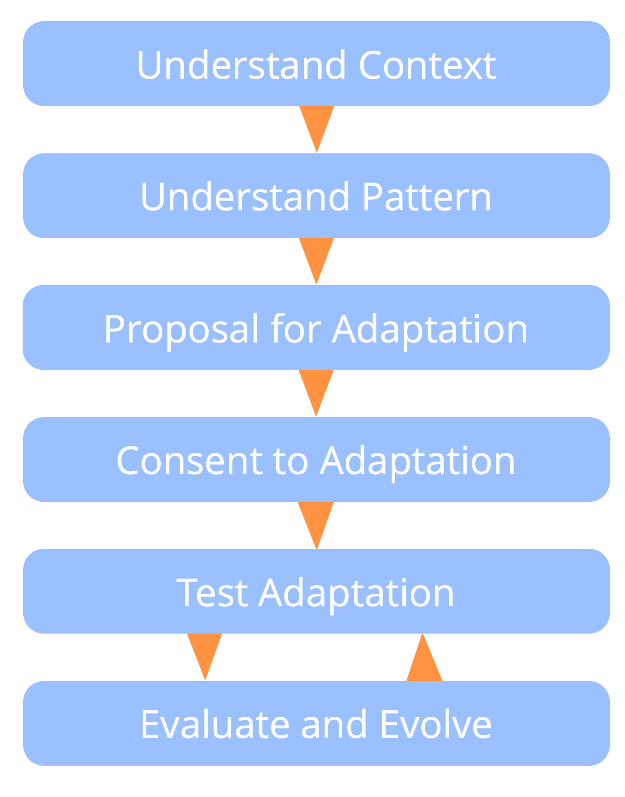

**Adapt and evolve S3 patterns to fit your specific context.**

-   ensure everyone affected by adaptation:
    -   understands why it is necessary to adapt the pattern
    -   is present or represented when doing so
-   use S3 principles as a guide for adaptation
-   run experiments with adaptations for long enough to learn about benefits and potential pitfalls
-   consider sharing valuable adaptations with the S3 community

