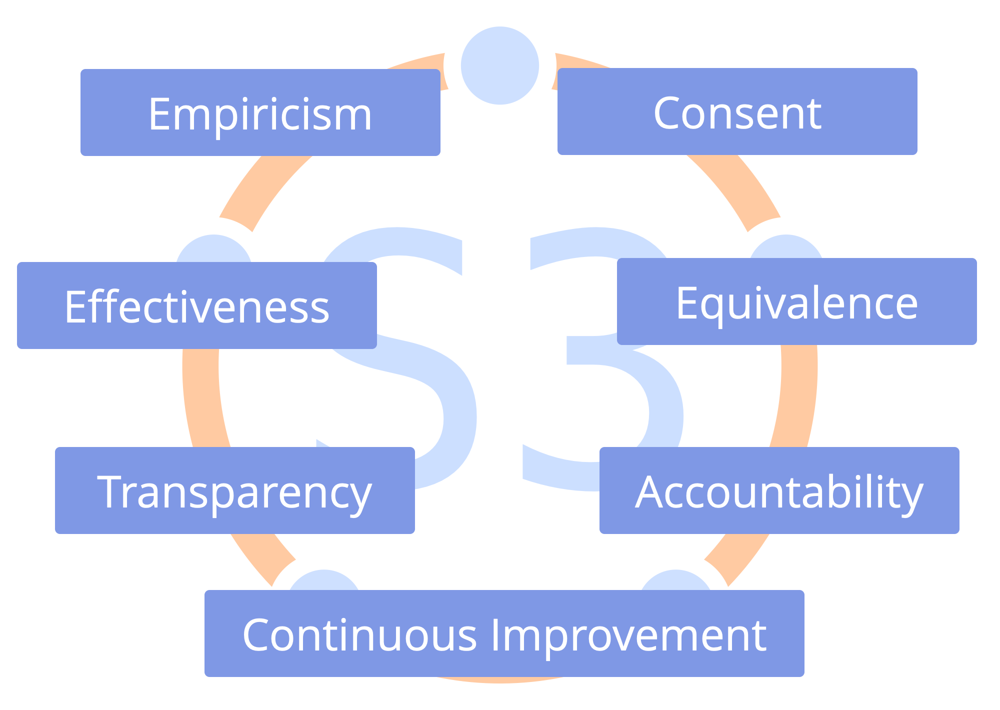
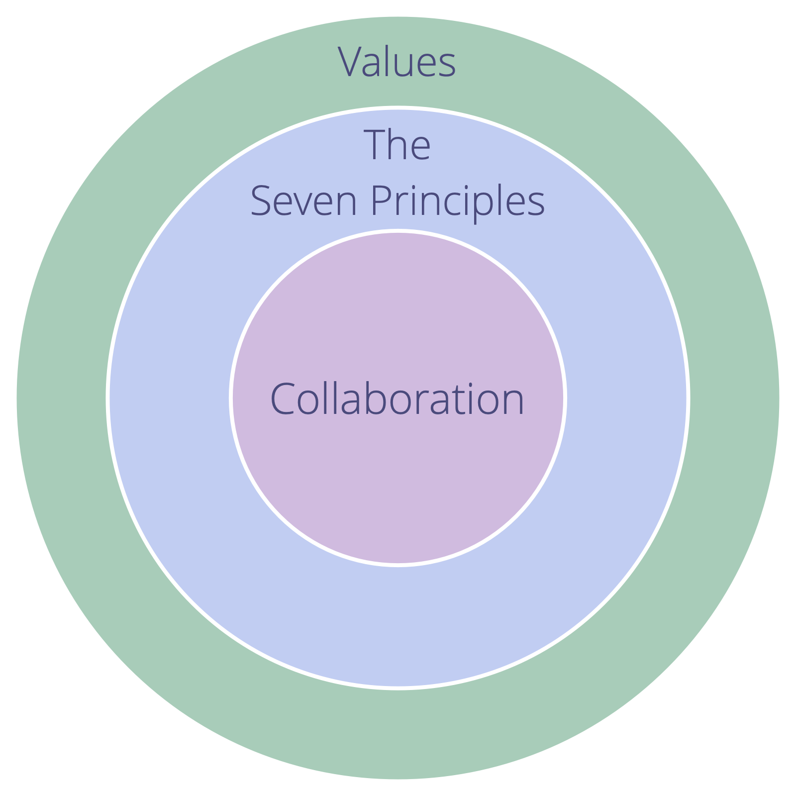

Align collaboration with the Seven Principles.

Adopting the Seven Principles reduces the number of explicit policies required, and guides adaptation of S3 patterns to suit the organization's context.

An organization's values need to embrace the Seven Principles.

<figure class="fig fig--limit-both fig--scale-normal">
    
    <figcaption>The Seven Principles</figcaption>'
</figure>

<figure class="fig fig--limit-both fig--scale-normal">
    
    <figcaption>An organization's values need to embrace the Seven Principles</figcaption>'
</figure>
