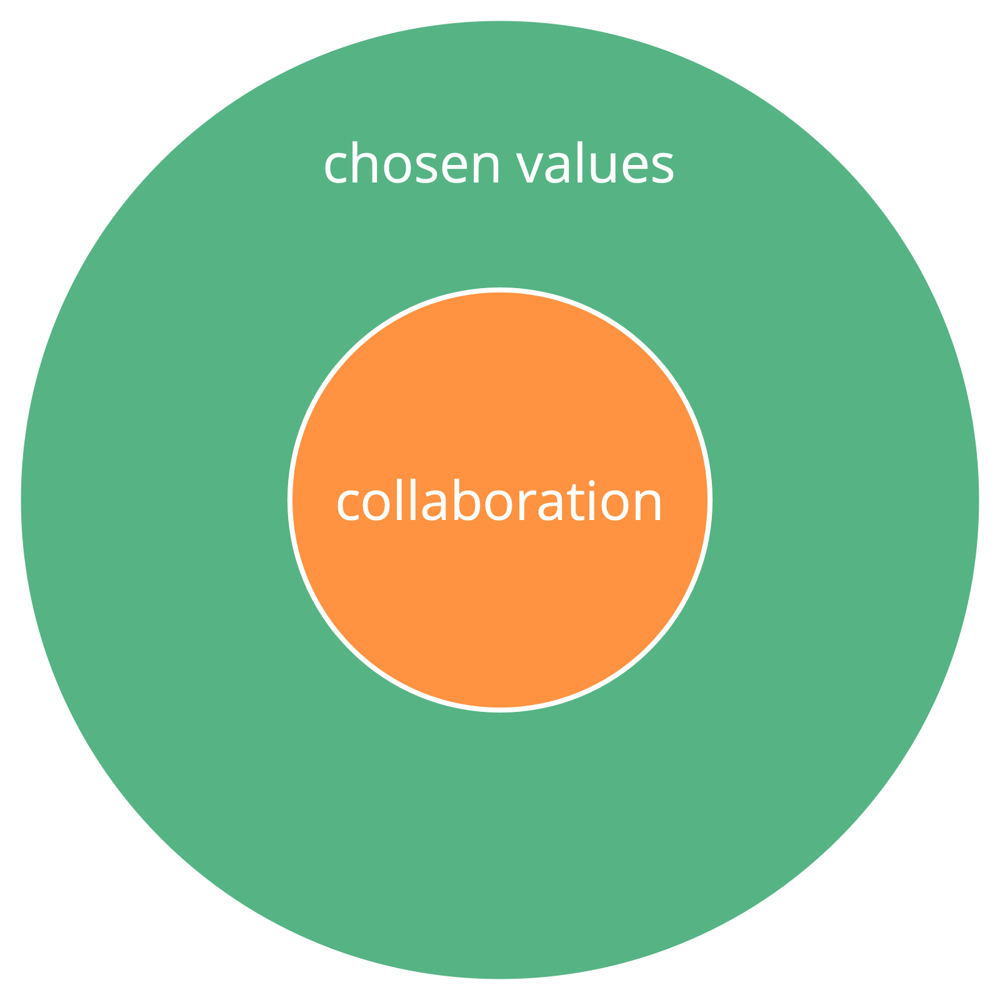

**Intentionally shape the culture in your organization.**

_A **value** is a principle that guides behavior. Values define scope for action and ethical constraints._

-   each member brings their own values to an organization based on personal experiences and beliefs
-   a group or organization may **choose to collectively adopt values** to guide their collaboration

-   values offer guidance to determine appropriate action, even in the absence of explicit agreements
-   defining values is a **strategy** that supports effectiveness of an organization:
    -   reduces potential for **misunderstanding**
    -   **aligns** decision making and action
    -   **attracts new members, partners and customers** who are aligned with the organization
-   values are an agreement and thus subject to **regular review**

