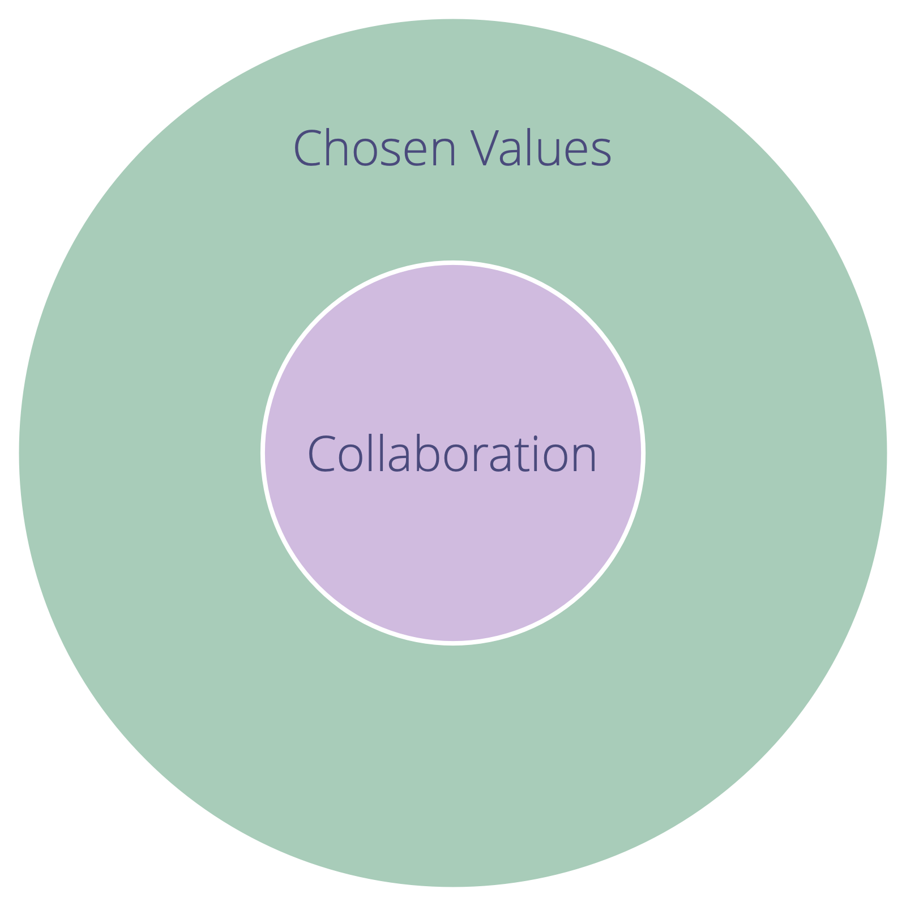

Intentionally evolve the culture in your organization.

_**Values** are valued principles that guide behavior. Values define scope for action and ethical constraints._

-   each member brings their own values to an organization based on personal experiences and beliefs
-   a team or organization may **choose to collectively adopt values** to guide their collaboration

Values offer guidance to determine appropriate action, even in the absence of explicit <a href="glossary.html#entry-policy" class="glossary-tooltip" data-toggle="tooltip" title="Policy: An intervention that is created and evolved through governance; a process, procedure, protocol, plan, strategy, or guideline.">policies</a>.

Collectively adopting a set of values supports the effectiveness of an organization:

-   reduces potential for **misunderstanding**
-   helps to **align** decision-making and action
-   **attracts new members, partners and customers** who are aligned with the organization

Chosen values are a policy that benefits from **regular review**.

<figure class="fig fig--limit-both fig--scale-normal">
    
    <figcaption>Chosen values define constraints for collaboration</figcaption>'
</figure>
