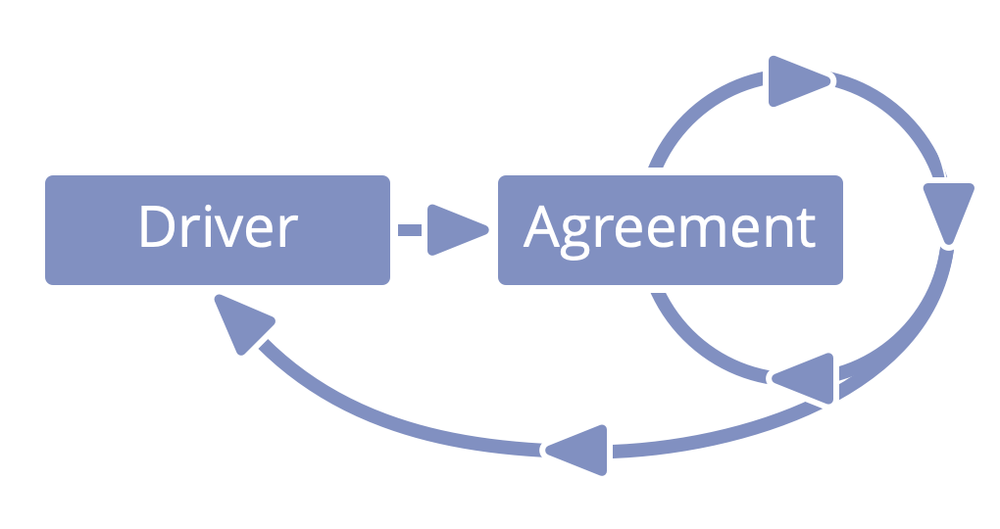

_An **agreement** is an agreed upon guideline, process or protocol designed to guide the flow of value._

-   agreements are created in response to drivers 
-   agreements are the **accountability of the people** that make them
-   agreements are **regularly reviewed**

**Note**: In S3, guidelines, processes or protocols created by individuals in roles are treated as agreements.  

### Template for Agreements

