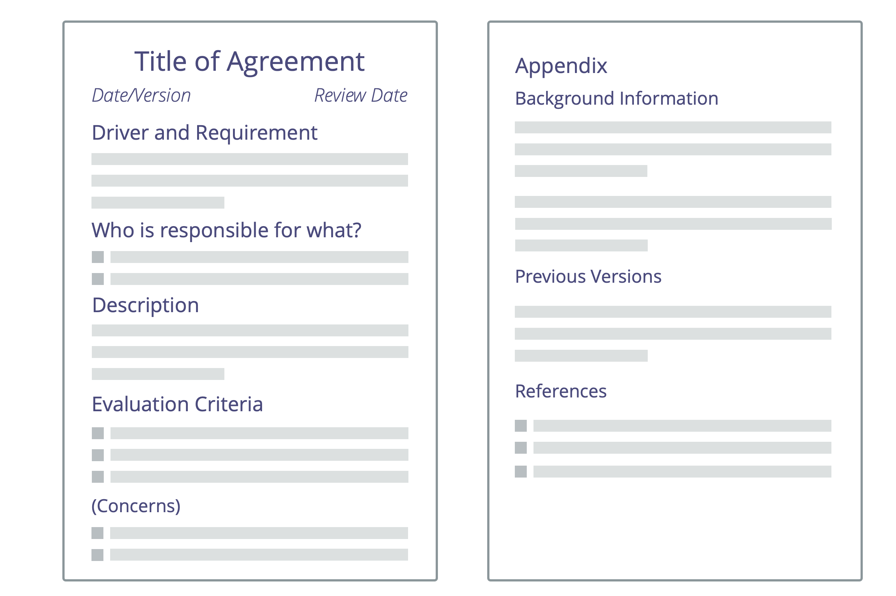

_An **agreement** is an agreed upon guideline, process, protocol or policy designed to guide the flow of value._

Agreements are created in response to <dfn data-info="Organizational Driver: A driver is a person’s or a group&apos;s motive for responding to a specific situation. A driver is considered an **organizational driver** if responding to it would help the organization generate value, eliminate waste or avoid harm.">organizational drivers</dfn>, are **regularly reviewed**, and evolved as necessary.

**Overall accountability** for an agreement lies with the people that make them.

An agreement can include **delegation of specific responsibilities** to individuals or groups.
   
Record any **expectations** related to <dfn data-info="Deliverable: A product, service, component or material provided in response to an organizational driver.">deliverables</dfn>, behavior or resources in the context of the agreement.

**Note:** In S3, guidelines, processes or protocols created by individuals in roles are also treated as agreements.  

[&#9654; Develop Strategy](develop-strategy.html) [&#9650; Defining Agreements](defining-agreements.html)

