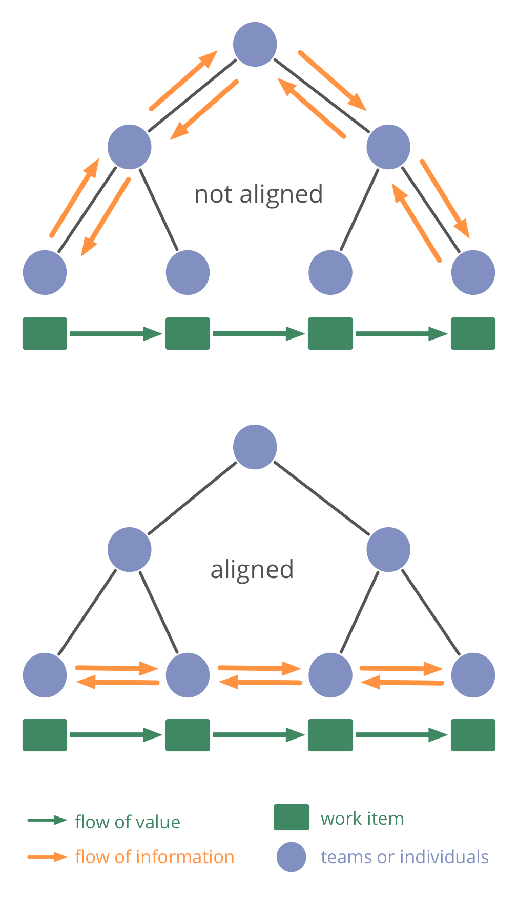

-   in an effective organization, **flow of information and influence supports the continuous flow of value**
-   alignment is achieved and maintained through the continuous improvement of agreements

### Flow of Value ###

-   flow of value is guided by (explicit and implicit) agreements and assumptions
-   work in progress is regarded as waste because it ties up resources
-   continuous flow of value reduces the potential for accumulation of waste
    -   it also makes for shorter feedback loops and amplifies learning
