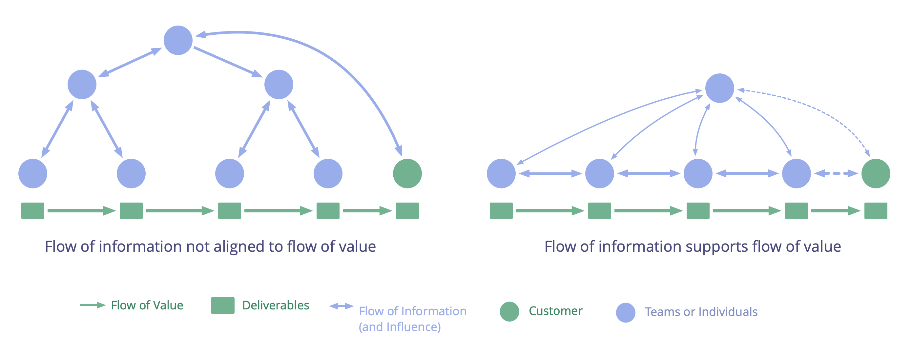

**In support of continuous flow of value, move decision making close to where value is created, and align the flow of information accordingly.**

**Flow of value:** Deliverables traveling through an organization towards customers or other stakeholders.

Achieve and maintain alignment of flow through the continuous evolution of an organization's body of <dfn data-info="Agreement: An agreed upon guideline, process, protocol or policy designed to guide the flow of value.">agreements</dfn>:

-   ensure all decisions affecting the flow of value actually support the flow of value
-   enable people with relevant skills and knowledge to influence decisions
-   make available any helpful information
-   aim for shorter feedback loops to amplify learning.

When decision making is conducted close to where value is created, and the flow of information supports the continuous and steady flow of value, the potential for accumulation of waste is reduced.

<a href="timebox-activities.html" title="Back to: Timebox Activities">◀</a> <a href="organizing-work.html" title="Up: Organizing Work">▲</a> <a href="coordinator.html" title="">▶ Read next: Coordinator</a>

