## What is Sociocracy 3.0?

Sociocracy 3.0 – a.k.a. "S3" – is <a href="glossary.html#entry-social-technology" class="glossary-tooltip" data-toggle="tooltip" title="Social Technology: Any process, technique, method, skill or any other approach that people can use to influence social systems – organizations, societies, communities, etc. – to support achieving shared objectives and guide meaningful interaction and exchange.">social technology</a> for evolving agile and resilient organizations at any size, from small start-ups to large international networks and multi-agency collaboration.

Inside this practical guide you'll discover a comprehensive collection of tried and tested **concepts, principles and practices for improving performance, engagement and wellbeing** in organizations.

Since its launch in 2015, S3 patterns have been helping people across a diverse range of organizational contexts to get the best out of collaboration: from start-ups to small and medium businesses, large international organizations, investor-funded and nonprofit organizations, families and communities.

Using S3 can **help you to achieve your objectives** and successfully navigate complexity. You can make changes one step at a time, **without the need for sudden radical reorganization** or planning a long-term change initiative:

-   Simply start with identifying your areas of greatest need and select one or more practices or guidelines that help.
-   Proceed at your own pace, and develop  your skills and competences as you go.

**Regardless of your position in the organization**, you'll find many proven ideas that are relevant and helpful for you.

**Sociocracy 3.0 is free**, and licensed under a Creative Commons Free Culture License.

### How does Sociocracy 3.0 help?

S3 is a transformational technology for both individuals and the whole organization that will help you figure out how to meet your organization's biggest challenges, take advantage of the opportunities you face and resolve the most persistent problems.

Sociocracy 3.0 is designed to be flexible and supports experimentation and learning. You can take whatever you need, adapt things to suit your context and enrich your existing approach.

S3 integrates core concepts and practices found in agile methodologies, lean management, Kanban (and KMM), Design Thinking, Teal Organizations and the family of sociocracy-based governance methods (SCM/Dynamic Governance, Holacracy® etc.). It's complementary and compatible with any agile or lean framework, including but not limited to Scrum and its various scaling frameworks.

### A Pattern-Based Approach to Organizational Change

S3 offers a pattern-based approach to organizational change.

A **pattern** is a process, practice or guideline that serves as a template for successfully responding to a specific kind of challenge or opportunity. S3 patterns are discovered through observing people working together in organizations to solve problems and respond to opportunities they face. When you find that your habitual ways of doing things fail to bring about the outcomes you expected or hope for, you can look to S3 for patterns that might help.

Patterns are modular and adaptable, can be used independently, and are mutually reinforcing, complementing one another when used in combination. S3 patterns can be evolved and adapted to address your specific needs.

In this guide, the patterns are grouped by topic into eleven categories to help you more easily identify those that are useful to you:

-   Sense-Making and Decision-Making
-   Evolving Organizations
-   Peer Development
-   Enablers Of Co-Creation
-   Building Organizations
-   Bringing In S3
-   Defining Agreements
-   Meeting Formats
-   Meeting Practices
-   Organizing Work
-   Organizational Structure

By providing a menu of patterns to choose from according to need, S3 encourages an organic, **iterative approach to change without a huge upfront investment**. It meets people where they are and helps them move forward pulling in patterns at their own pace and according to their unique context.

### What's in this guide?

Inside this practical guide book you'll discover:

-   Useful concepts that will help you **make more sense of your organization** and communicate effectively about where change is needed.
-   An **organic, iterative approach to change** that meets people where they are and helps them move forward at their own pace and according to their unique context and needs.
-   **Seven core principles** of agile and sociocratic collaboration
-   A coherent collection of **70+ practices and guidelines** to help you navigate complexity, and improve collaboration:
    -   **Simple, facilitated formats** that support teams in drawing on the collective intelligence of the group and incrementally processing available information into continuous improvement of work processes, products, services and skills.
    -   **Group-practices** to help organizations make the best use of talent they already have, through **people supporting each other** in building skills, accountability and engagement.
    -   Simple **tools for clarifying who does what**, freeing people up to decide and act for themselves as much as possible, within clearly defined constraints that enable experimentation and development.
    -   Patterns for **growing organizational structure beyond hierarchies** into flexible, decentralized networks where the flow of information and influence directly supports the creation of value.
-   The **Common Sense Framework**, a tool for making sense of teams and organizations and figuring out how to get started with S3.   
-   A **glossary** with explanations for all the terms you might be unfamiliar with.

This practical guide to Sociocracy 3.0 is written and published by the three co-developers of Sociocracy 3.0.

True to the mindset behind S3, this book will always be a work in progress that grows and changes as we learn from people who are experimenting with S3 in organizations around the world. Since we started out in 2015, we have released several updates per year and we'll continue to do so in the years to come.

Even though several sections in this book are brief and may still be rough around the edges, the content and explanations have been sufficient for many people to get started with S3 and achieve positive change in their organizations. We hope you'll find it useful too.

### Influences and History of Sociocracy 3.0

<figure class="fig fig--limit-width fig--scale-full">
    

        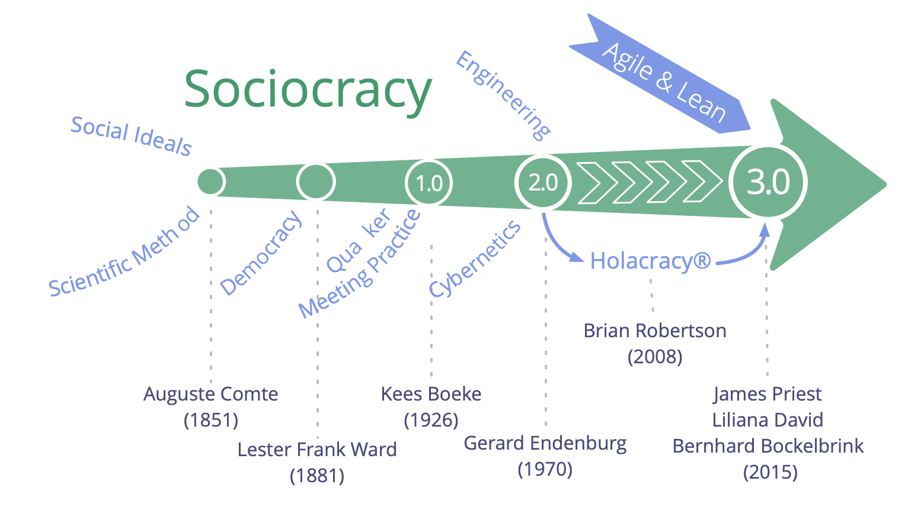
        

    

    <figcaption>Influences and history of Sociocracy 3.0</figcaption>
</figure>

The literal meaning of the term **sociocracy** is "rule of the companions": _socio_ — from Latin _socius_ — means "companion", or "friend", and the suffix _-cracy_ — from Ancient Greek κράτος (krátos) — means "power", or "rule".

The word sociocracy can be traced back to 1851, when **Auguste Comte** suggested applying a scientific approach to society: states would be governed by a body of scientists who are experts on society (which he termed "sociologists"). In his opinion, this future, although not yet achievable, would be inevitable.

A few decades later, **Lester Frank Ward**, used the word 'sociocracy' to describe the rule of people with relations with each other. Instead of having sociologists at the center, he wanted to give more authority and responsibility to the individual, he imagined sociologists in a role as researchers and consultants.

In 1926, the Dutch reformist educator and Quaker **Kees Boeke**, established a residential school based on the principle of consent. Staff and students were treated as equal participants in the governance of the school, all decisions needed to be acceptable to everyone. He built this version of sociocracy on Quaker principles and practices, and described sociocracy as an evolution of democracy in his 1945 essay "Democracy as it might be".

**Gerard Endenburg**, also a Quaker and a student in Boeke's school, wanted to apply sociocracy in his family's business, Endenburg Elektrotechniek. He created and evolved the _Sociocratic Circle Organisation Method (SCM)_ (later becoming the "Sociocratic Method"), integrating Boeke's form of sociocracy with engineering and cybernetics. In 1978 Endenburg founded the Sociocratisch Centrum in Utrecht (which is now the Sociocratic Center in Rotterdam) as a means to promote sociocracy in and beyond the Netherlands. Since 1994 organizations in the Netherlands using SCM have been exempt from the legal requirement to have a worker's council.

During the late 1990s and early 2000s, several non-Dutch speaking people came across sociocracy, but it wasn't until 2007 when **Sharon Villines and John Buck** launched their book, "We the People", that sociocracy became widely accessible to the English speaking world, and from there has begun to migrate into several other languages.

Sociocracy has proven to be effective for many organizations and communities around the world, but it has yet to become viral.

In 2014 **James Priest and Bernhard Bockelbrink** came together to co-create a body of Creative Commons licensed learning resources, synthesizing ideas from Sociocracy, Agile and Lean. They discovered that organizations of all sizes need a flexible menu of practices and structures — appropriate for their specific context — that enable the evolution of a more sociocratic and agile approach to achieve greater effectiveness, coherence, fulfillment and wellbeing. The first version of **Sociocracy 3.0.** was launched in March 2015.

**Liliana David** joined the team soon after. Together they regularly collaborate to make S3 available and applicable to as many organizations as possible, and provide resources under a **Creative Commons Free Culture License** for people who want to learn, apply and tell others about Sociocracy 3.0.

#### The Sociocracy 3.0 Movement

As interest in Sociocracy 3.0 grows there is a fast growing community of people from a variety of backgrounds — pioneering consultants, coaches, learning facilitators, and people applying S3 into their various contexts — who share appreciation for the transformational potential of Sociocracy 3.0 to help organizations and their members thrive. Many kindly dedicate some of their time to experimenting with and sharing about S3, and who collaborate to learn from one another and document experiences to inform the ongoing development and evolution of the S3 and its various applications.

### Why "3.0"?

Sociocracy as a form of governance has been referred to since 1851. Subsequently it has been developed and adapted by many different people and organizations, including Gerard Endenburg, The Sociocracy Group (TSG) and Brian Robertson (HolacracyOne).

Yet, outside the Netherlands sociocracy has until recently remained largely unknown.

We love sociocracy because we see organizations and their members thrive when they use elements of it to enrich or transform what they currently do.

We also love agile, lean, Kanban, the Core Protocols, Non-Violent Communication, and many other ideas too. We believe that the world will be a better place as more organizations learn to pull from this cornucopia of awesome practices that are emerging into the world today, and learn to synthesize them with what they already know.

Therefore we decided to devote some of our time to develop and evolve Sociocracy, integrating it with many of these other potent ideas, to make it available and applicable to as many organizations as possible.

To this end, we recognize the value of a strong identity, a radically different way of distribution, and of adapting the *Sociocratic Circle Organization Method* to improve its applicability.

#### The Name

The name "*Sociocracy 3.0*" demonstrates both respect to the lineage and a significant step forward.

It also helps avoid the perception of us misrepresenting the _Sociocratic Circle Organization Method (SCM)_ as promoted by The Sociocracy Group (TSG), The Sociocracy Consulting Group, Sociocracy For All (SoFA), Governance Alive, and many others.

<figure class="fig fig--limit-both fig--scale-normal">
    

        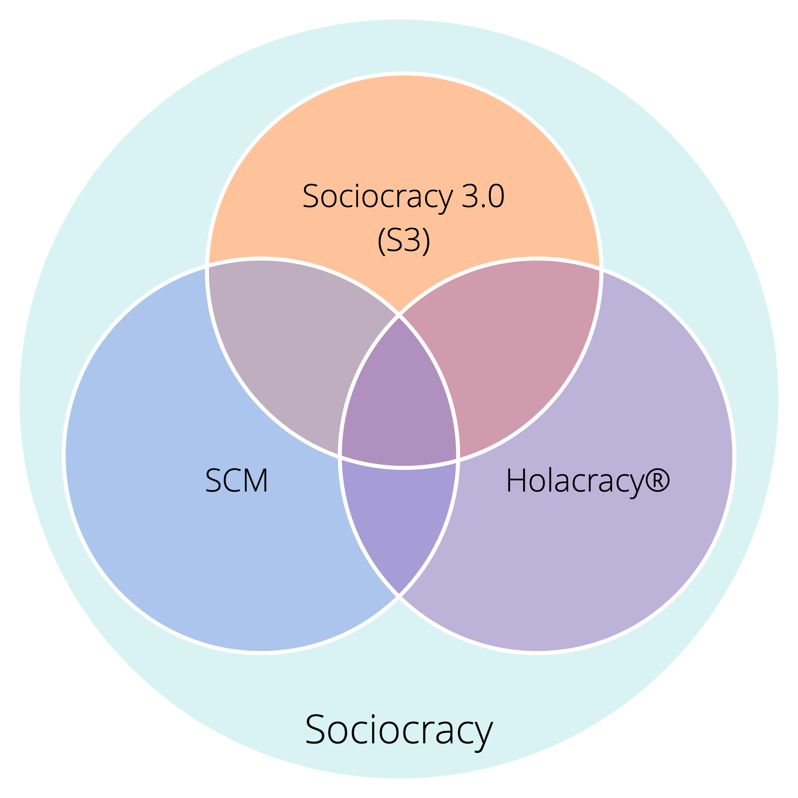
        

    

    <figcaption>Three variants of sociocracy</figcaption>
</figure>

#### The New Model of Distribution

*Sociocracy 3.0* employs a non-centralized model for distribution. This is a paradigm shift in the way sociocracy is brought to people and organizations, and one that many people can relate to.

We support "viral" distribution through two key strategies:

* **Sociocracy 3.0 is open:** We want to encourage growth of a vibrant ecosystem of applications and flavors of sociocracy, where people share and discuss their insights and the adaptations they are making for their specific context. To this end Sociocracy 3.0 puts emphasis on communicating the underlying principles and explicitly invites the creativity of everyone to remix, extend and adapt things to suit their needs.
* **Sociocracy 3.0 is free:** To eliminate the barrier of entry for people and organizations we provide free resources under a *Creative Commons Free Culture License* to learn, practice and teach *Sociocracy 3.0*. Everyone can use our resources without our explicit permission, even in a commercial context, or as a basis for building their own resources, as long as they share their new resources under the same license. We expect and support other organizations, consultants, coaches, learning facilitators and trainers to follow our example and release their resources too.

#### The Evolution of the Sociocratic Circle Organization Method

Maybe we need to make this explicit: _Sociocracy 3.0_ is not targeted specifically at the existing community of people exploring or using the _Sociocratic Circle Organization Method_ (SCM). SCM is already well developed and of those people who use it, many appear to be mostly happy with it.

Yet from our direct experience, for most organizations, the methodology is either insufficient or inappropriate for addressing many of their needs. With _Sociocracy 3.0_ we actively work on addressing these limitations and inadequacies by developing new patterns and eliminating what stands in the way.

##### Reducing Risk and Resistance

_Sociocracy 3.0_ meets organizations where they are and takes them on a journey of continuous improvement. There's no radical change or reorganization. _Sociocracy 3.0_ provides a collection of independent and principle-based patterns that an organization can pull in one by one to become more effective. All patterns relate to a set of core principles, so they can easily be adapted to context.

##### Shifting Focus from Vision to Need

_Sociocracy 3.0_ moves primary focus away from attempting to realize a vision, toward understanding the current reality and determining what is required to achieve an organization's objectives. Organizations which are already need-driven, value driven or customer-centric, find this immediately accessible.

##### Condensed to the Essentials

When looking at the norms, the _Sociocratic Circle Organization Method_ may look big and scary. By focusing on the essentials only, _Sociocracy 3.0_ offers a more lightweight starting point to adapt and build on as necessary.

This doesn't mean to say it's all easy: choosing to pull in *Sociocracy 3.0's* patterns requires an investment in learning and unlearning. This is why it's important to only pull in what you need, because there's no point to changing things if what you are doing is already good enough.

##### Integration With Agile and Lean Thinking

The *Sociocratic Circle Organization Method* is an "empty" method when it comes to operations and creating a culture of close collaboration. Many organizations already implement or show preference for lean and agile thinking for operations and collaboration. We believe this is a great idea, so *Sociocracy 3.0* is designed for easy adoption into lean and agile organizations.

##### A New Way to Evolve Organizational Structure

The organizational structure according to the *Sociocratic Circle Organization Method* is modeled on a hierarchy of domains. We see an increasing emergence of collaborative multi-stakeholder environments and the need for a wider variety of patterns for organizational structure.
Evolution of organizational structure happens naturally when the flow of information and influence in an organization is incrementally aligned to the flow of value. *Sociocracy 3.0* provides a variety of structural patterns that can be combined to evolve structure as required and in a flexible way.

## The Seven Principles

Sociocracy 3.0 is built on seven foundational principles which enable sociocratic and agile collaboration. Since the seven principles are reflected in all of the patterns, understanding these principles is helpful for adopting and paramount to adapting Sociocracy 3.0 patterns.

Practicing Sociocracy 3.0 helps people appreciate the essential value that these core principles bring – both to individuals and to organizations – and supports their integration into organizational culture.

<figure class="fig fig--limit-height fig--scale-small">
    

        
        

    

    <figcaption>The Seven Principles</figcaption>
</figure>

**_The Principle of Effectiveness_:** 

_**Devote time only to what brings you closer towards achieving your organization's overall objectives**, so that you can make the best use of your limited time, energy, and resources._

**_The Principle of Consent_:**

_**Raise, seek out and resolve objections to proposals, policies and activities**, to reduce the potential for decisions leading to undesirable consequences and to discover worthwhile ways to improve._

**_The Principle of Empiricism_:** 

_**Test all assumptions you rely on through experiments and continuous revision**, so that you learn fast, make sense of things, and navigate complexity as effectively as you can._

**_The Principle of Continuous Improvement_:**

_**Regularly review the outcomes of your actions, then make incremental improvements to what you do and how you do it based on what you learn**, so that you can adapt to changes when necessary, and maintain or improve effectiveness over time._

**_The Principle of Equivalence_:**

_**Involve people in making and evolving decisions that affect them**, to increase engagement and accountability, and utilize the distributed intelligence to achieve and evolve your objectives._

**_The Principle of Transparency_:**

_**Record all information that is valuable for the organization and make it accessible to everyone in the organization, unless there is a reason for confidentiality**, so that everyone has the information they need to understand how to do their work in a way that contributes most effectively to the whole._

**_The Principle of Accountability_:**

_**Respond when something is needed, do what you agreed to do, and accept your share of responsibility for the course of the organization,** so that what needs doing gets done, nothing is overlooked, and everyone does what they can to contribute toward the effectiveness and integrity of the organization._

### The Principle of Effectiveness

_**Devote time only to what brings you closer towards achieving your organization's overall objectives**, so that you can make the best use of your limited time, energy, and resources._

The principle of effectiveness invites us to think consciously about what we do and how we do things. It calls for the intentional consideration of the consequences of our actions, both now and across time, on our organizations but also on the wider environment and the world at large. 

Pursuing effectiveness requires that we act with intent to minimize waste, remove impediments and, where possible, conduct ourselves in ways that over time, lead to the greatest value creation possible, through the synergy of our creativity, resources, energy and time. 

#### Clarify the Why

Being effective begins with getting clear about why you want to do something and establishing an approximate idea of what it is you want to achieve. Defining why the organization exists and the objectives it's trying to achieve helps everyone understand more about what they are working toward and about how they can contribute in a meaningful way. Without this clarity, it's hard for individuals to contextualize their work in the bigger picture. It's also harder to qualify and quantify what brings value and in which ways. 

#### Keep Your Options Open

There might be many ways to go about achieving your objectives and sometimes your first choice might fail to meet the need. Keep your options open to avoid getting stuck in a particular trajectory as you learn about ways to improve. Avoid converging too soon and take an iterative approach whenever you can. In complexity, find ways to test any hypotheses quickly, run multiple small experiments if possible, and travel light so that you can pivot fast.

#### Aim for Being Effective in an Efficient Way

Effectiveness is about achieving the desired result, while efficiency is about doing things with the least waste of your effort, resources and time. It is entirely possible to do the "wrong" thing very efficiently, so before optimizing for efficiency, ensure the outcome is what you intended. Only then look for worthwhile improvements to produce the same outcome in a more efficient manner. 

#### Consider the Bigger Picture, Monitor, Evaluate and Learn

Be on the lookout for possible side-effects and unintended consequences before, during and after any interventions you make. Consider direct and indirect costs and negative externalities and be prepared to evolve or change your activities or objectives, based on what you learn.

There are scales of effectiveness (and efficiency) that can only be appreciated if we consider the wider context and consequences of our actions across time. Sometimes our activities might achieve the outcomes we intended in the short term but with unfavorable consequences and hidden costs that only reveal themselves across time.  For example, large scale, industrial agriculture produces huge yields very efficiently but over the long-term  it leads to a critical depletion of topsoil and increasing dependency on fertilizers, insecticides and weedkillers. This can be a case of a short term gain but for long term pain.

In complex environments it is sometimes hard to figure out what effectiveness would actually mean. Consider the perspective of others, even if you are making a decision for yourself.  Make the most of experience and expertise distributed throughout your organization and reach out to people with alternative points of view. Running your ideas past others can help you to avoid consequences that you'd rather avoid, and identify worthwhile ways to improve.

Decide how you will measure effectiveness, and if you're collaborating with others, develop and maintain a shared understanding of what this will mean. Having established a clear "_why_" and defined the outcome you intend to achieve, consider how you will measure results in a way that allows you to see how you're progressing (and whether anything you are doing is useful at all!)

Effectiveness can sometimes only be determined in retrospect. Pay attention to and reflect on the consequences of your actions,  and then use what you learn to improve your effectiveness next time. 

#### Be Mindful of Dependencies and Constraints

Aim to free everyone up to be able to act as autonomously as possible and do what you need to do to free yourself up as well. Make any necessary dependencies between certain individuals and teams explicit, and get together to co-create and evolve a coherent system to deal with them, so that you can still deliver value fast when dependencies cannot be avoided.

Clarify any constraints in which you need to operate. What are the internal and external expectations, guidelines or rules? How do the implicit or explicit values of your organization and the wider context in which you are operating, enable or limit the decisions and actions you make? How will you operate within any specific boundaries? Who do you need to communicate with if you see an argument for changing something, or for making an exception to a rule?

#### Prioritize and Choose Wisely

Set priorities and stick to them unless you become aware of a reason to change. Distractions, context switching and a lack of breaks or slack time will inevitably lead to waste. 

As well as getting clear on what you WILL do, be clear on what NOT to do as well and aim to resolve impediments as they arise.

### The Principle of Consent

_**Raise, seek out and resolve objections to proposals, policies and activities**, to reduce the potential for decisions leading to undesirable consequences and to discover worthwhile ways to improve._

Deliberately seeking objections is a way to tap into the collective intelligence distributed throughout an organization and benefit from insights we might otherwise miss. Examining proposals, decisions, and activities through the lens of different people’s perspectives helps to identify reasons why proceeding in a specific way could lead to consequences that would be better avoided, and if there are worthwhile ways to improve things.

Adopting the principle of consent invites a change of focus in decision-making, shifting intent from trying to reach an agreement - “_can everyone agree with this?_” — toward the practice of deliberately checking for <a href="glossary.html#entry-objection" class="glossary-tooltip" data-toggle="tooltip" title="Objection: An argument – relating to a proposal, existing decision, or activity being conducted by one or more members of the organization – that reveals consequences or risks that are preferably avoided for the organization or that demonstrates worthwhile ways to improve.">objections</a> — are there any arguments that reveal why this is not good enough, safe enough, or that there are worthwhile ways to improve?

Consent does not mean everyone is actively involved in making every decision, as this would be ineffective. It does, however, require adequate _transparency_ and mindfulness on the part of decision-makers to inform and involve people who would be impacted (to varying degrees), or to invite those who can bring relevant experience or expertise (see _the Principle of Equivalence_).

#### Invite Dissent

When dealing with complicated or complex matters, considering different perspectives, experience, and expertise is a simple yet effective way to develop a coherent shared understanding, out of which more effective decisions can be made.

Developing a culture that welcomes dissenting opinions and where people consider those opinions to discover any value they can bring generates greater engagement, psychological safety, and support for decisions.

#### Shift the Supremacy from People to Sound Arguments

When comparing the available paradigms for decision-making, the essential difference lies in where the ultimate authority for making a decision is placed. In autocratic systems, supremacy lies with an individual or a small group. In a system governed using majority voting, supremacy lies with the majority (or those who can convince the majority of their position). In a system aspiring toward consensus with unanimity, supremacy lies with whoever decides to block a proposal or existing decision. In all three of these cases, a decision is made regardless of whether the motive of those actors is aligned with the interest of the system or not.

When a group or organization chooses to abide by the principle of consent, supremacy shifts from any specific individual or group to reasoned arguments that reveal the potential for undesirable consequences that would be better avoided or worthwhile ways to improve. This way, people — regardless of their position, rank, function, or role — are unable to block decisions based solely on opinion, personal preference, or rank, and they can be _held to account_ in the case that they do. Consent invites everyone to at least be reasonable, while still leaving space for individuals to express diverse perspectives, opinions, and ideas.

#### Distinguish Between Opinion or Preference, and Objections

Consent draws on the intelligence distributed throughout an organization, not only by inviting people to raise possible _objections_, but by inviting people to then examine those arguments, rooting out any that are unfounded, evolving those they discover to be only partly true, and revealing those that are valid objections. So it’s typically a good idea to _test if arguments qualify as objections_ and only act on those that do. This helps avoid wasting time on arguments based merely on opinions, personal preference, or bias.

Arguments that qualify as objections — at least as far as stakeholders can tell — help a group in directing their effort toward making changes in those areas where it’s necessary or worthwhile to adapt and improve. Incremental improvement based on discovery and learning is built into consent and is an inevitable consequence of adopting the principle.

Adopting the principle of consent shifts the aim of decision-making toward identifying a solution that’s good enough for now, and where there are no obvious worthwhile improvements that would justify spending more time. This approach is far more effective than trying to arrive at a consensus with unanimity, where the aim is often to accommodate everyone’s personal preferences and ideas.

#### Integrate Learning from Objections

Objections inform people of things that can be improved. _Resolving objections_ typically means evolving (proposed) policies and changing activity in ways that render that argument void. Sometimes, however, having considered an objection, it might be realized that on balance and for some reason or other, it’s more advantageous to leave what was objected to unchanged. Ultimately, considering an objection and determining what, if anything, is worthwhile doing to resolve it involves weighing up pros and cons, both in relation to the specific situation a proposal, an existing decision, or an activity is intended to address, but also in the context of the organization as a whole. In complexity, there are typically no perfect or entirely correct decisions, only those that (for now at least) appear good enough for now and safe enough to try. Often, all that is needed is a good enough next step, which allows us to learn empirically and adapt and evolve the decision over time.

This approach of incremental learning draws on the diversity of knowledge, experience, and expertise distributed throughout an organization. It helps to shift from a paradigm rooted in binary thinking and polarization (either/or) to a continual process of synergy (both/and), which over time fosters stronger relationships between peers as well.

#### The Contract of Consent

Adopting the principle of consent in a team, or the organization as a whole, has implications for how people approach decision-making, dialogue, and activity. Consider making this implicit contract of consent explicit, to support members of the organization to adopt and apply the principle of consent:

1. In the absence of objections to a proposal or decision, I intend to follow through on what’s been agreed to the best of my ability.
2. As I become aware of them, I will share any possible objections to proposals, decisions, or current activities with those directly responsible for them.
3. I’ll actively seek out and consider objections to proposals, policies, and activities that I’m responsible for, and I’ll work to resolve those objections if I can.
4. I’ll actively consider policies that are due for review that I’m affected by or responsible for, to check for any possible objections to the prospect of continuing with that policy in its current form.

### The Principle of Empiricism

_**Test all assumptions you rely on through experiments and continuous revision**, so that you learn fast, make sense of things, and navigate complexity as effectively as you can._

Empiricism — the foundation of the scientific method — is an essential principle to embrace if we're to navigate effectively in a complex world. Not only are the environments in which organizations operate complex but an organization is in itself a complex adaptive system. Knowledge about an organizational system and its interactions is often tentative and highly dependent on context. 

Empiricism can help us to increase certainty and reduce self-delusion, so that we can make the best use of our time. In our attempts to make sense of things and to have a sense of certainty about what is happening, why it's happening, what should happen next and what's needed to achieve that, we often draw conclusions without checking if the assumptions they are built on are true and accurate. In complexity, what we perceive as causation can often turn out to be mere correlation or coincidence, and the outcomes of interventions we make will always lead to some consequences we couldn't predict.

Observing and probing systems, and making use of experimentation to inform an iterative approach to change, supports ongoing learning and helps an organization continuously develop to remain effective and responsive to change.

#### Clarify Your Hypothesis

A hypothesis is a tentative explanation of a relationship between a specific cause and effect that is both testable and falsifiable. It provides a starting point for experiments that prove or disprove that hypothesis. 

In the context of organizations, you might develop hypotheses about how a change to a work process or to the organizational structure would improve effectiveness or reduce cost. Or about how rescheduling a meeting would increase engagement, or making a certain change to a product would attract a new customer segment while keeping existing customers happy, and so on. 

When faced with uncertainty, it helps to make any questions and assumptions you have explicit and describe a clear hypothesis that allows for answering those questions and validating if your assumptions are true. A vague or ambiguous description will make assumptions hard or even impossible to test, and trying to test too many assumptions at once, might set you up on a long path where you learn little of value. Less is often more.

One vital skill to develop when designing experiments is the ability to **distinguish between established knowledge and mere assumptions**. By acknowledging what you don't know yet and what you assume to be more or less true, you can identify questions and assumptions around which to build a hypothesis.

In complex domains, a hypothesis-driven approach relies on experiments to validate or disprove hypotheses, so that you can find viable ideas or falsify them fast. Making sense of things through experimentation, not only enables you to more effectively achieve what you need or desire but it can also help you to validate assumptions you have about which objectives are worthwhile pursuing to start with.  

#### Design Good Experiments

An experiment is a controlled test designed to prove or disprove a hypothesis. Experiments provide you with validated learning about how to better respond to the challenges and opportunities you face. Outcomes often provide you with the opportunity to refine your hypothesis, or even develop new hypotheses that you can then test with further experiments.

Before you start an experiment, it's important to fully define and document it. In the context of an organization, a good experiment will consist of a list of things you need to do, and if helpful, how you need to do them, as well as a list of variables you will track before, during and/or after the experiment. 

Define and document specific thresholds for success and failure of the experiment related to your variables and add details about this to your evaluation criteria. In particular, consider what you would accept as evidence that your hypothesis is false. While an experiment is running, avoid making changes to it, and if you do change something, document those changes, otherwise your measurements may become meaningless. It is vital that you **measure before starting the experiment** to ensure that the threshold for success is not already met because you made an error in your experiment's design.

#### Treat Decisions as Experiments

In a complex system, it is impossible to predict all of the ways in which that system will react to a particular intervention of change. Because of this you can apply the concept of experimentation to the way you approach decision-making as well. It's valuable to view all significant operational and governance decisions you make as experiments, and to document the intended outcome and evaluation criteria in each case. Make one decision at a time, starting with what appears to be an appropriate or logical starting point and evolve those decisions iteratively, based on what you learn.

### The Principle of Continuous Improvement

_**Regularly review the outcomes of your actions, then make incremental improvements to what you do and how you do it based on what you learn**, so that you can adapt to changes when necessary, and maintain or improve effectiveness over time._

Whereas the principles of _Empiricism_ and _Consent_ reveal opportunities for learning, Continuous Improvement relates to what we do with what we learn. Continuous Improvement applies to how we conduct our operations, but also to governance. Everything from the evolution of strategies, policy, processes and guidelines, to the development of products, services, competencies and skills, attitudes and behavior, chosen values and tools, all can be continuously improved. 

####Take an Iterative Approach to Change

Evolution is often more effective and more sustainable than revolution which is rarely necessary or worthwhile unless you fail to continuously improve a system when it's needed. Especially in a complex environment, making many changes to a system at the same time can lead to a mess that is difficult to fix. Consequences resulting from larger interventions are often hard to measure effectively, especially in complexity, and the relationship between cause and effect will be difficult, if not impossible to determine and evaluate. 

Instead, consider changing things incrementally whenever you see an opportunity for a small and worthwhile improvement, significantly reducing the need for a large intervention. This will help you to effectively adapt to changing environments, keep your organization and systems fit for purpose, and prevent things from descending into a state that is costly or even impossible to repair.

**Even when a large change is needed, go step by step**, figuring out how things need to be and **adjust what you're doing based on what you learn**. With small changes, assumptions can be tested quickly and failure is more manageable. When a small experiment fails, you can learn fast and if necessary, use what you learn to develop a better experiment. When a large experiment fails, a lot of time and effort might be spent without learning much at all.

Be aware that if you change several things at the same time, you might not be able to determine which of them lead to the effects you see, so **aim for one or only a few concurrent changes at a time**.

#### Monitor, Measure and Change Things Based on What You Learn

**Define the _intended outcome_** you expect a change will lead to and be clear on how you will evaluate whatever occurs. When making changes, be clear about the specifics of what you want to improve. What positive consequences do you want to amplify and what negative consequences do you want to dampen?

**Monitor the consequences of your actions** and reflect on what you learn. Pay attention to what actually happens and whether or not the results of your interventions reflect your assumptions and intentions. This will help you keep track of whether or not your changes led to improvements at all.

Remember that even if things don't turn out as you expect sometimes, this doesn't necessarily mean that the results are negative. Sometimes things turn out differently to how we'd assumed or intended. All outcomes help us learn. **Be open to whatever happens**, consider the pros and cons of any unintended consequences that emerge and acknowledge when it would be beneficial to do things differently, or to aim for different results.

### The Principle of Equivalence

_**Involve people in making and evolving decisions that affect them**, to increase engagement and accountability, and utilize the distributed intelligence to achieve and evolve your objectives._

Equivalence is important in organizational systems, precisely because people are not equal in a variety of ways, and depending on the context.

Equivalence increases engagement by giving people affected by decisions the opportunity to influence those decisions to some degree.

By including people in making and evolving a decision that affects them, they gain a deeper understanding of the resulting decision, the situation it’s intended to address, and the pros and cons that have been weighed in the process. It also helps to keep systems more open and transparent and reduces the potential for information vital to the decision being overlooked or ignored. Depending on the level of involvement, people might also have the opportunity to shape things according to their preference, and in any case, participation in the decision-making leads to a greater sense of ownership over what is decided.

People are more likely to take responsibility for following through on decisions when they are involved in making them. This is further reinforced when ensuring affected parties have influence in adapting those decisions later, should they discover reasons why a decision is no longer good enough, or if they discover a viable way to improve something.

Developing decisions collaboratively fosters a stronger sense of ownership and commitment among stakeholders. In contrast, decisions made by others may be supported or appreciated to varying degrees by those affected, depending on individual perspectives and preferences.

Some decisions will affect a large group of people, e.g., an entire department, or even the organization as a whole. Including those affected in the decision-making process will yield benefits that reach far beyond the decision in question. People will build connection, trust, and a greater sense of community and belonging. For effectively involving a large number of stakeholders in the decision-making process, you can use a variety of group facilitation techniques and online tools.

#### Delegate Responsibility and Authority to Influence

To become or remain effective, organizations of any size benefit from distributing work and the authority to influence decisions relating to that work. Doing so helps to avoid unnecessary dependencies, so that people can create value unimpeded, without getting bottlenecked, waiting on a decision-making hierarchy or on the input of others who are more distant from the work.

For making or evolving policies that affect a large number of people, however, involving everyone fully from end-to-end, requires a lot of time and rarely makes sense. In such cases, delegating the responsibility to a smaller group with relevant experience and expertise helps keep the process efficient.  But then, by also keeping all affected parties informed about progress and involving them in procedures to the degree that is worthwhile, it’s possible to draw on a wider field of collective intelligence that can help improve the effectiveness of decisions as well. At the very least, possible objections from all stakeholders can still be quickly identified by checking for possible objections to proposals or in-principle agreements, and resolving those arguments that qualify. This helps to build and maintain a sense of ownership over those decisions, and reduces the potential for resistance and or resentment to grow.

Furthermore, periodically rotating who takes a lead in decision-making helps build trust, accountability, and a more widely shared understanding of the context in which decisions are being made, because a growing number of people will gain experience in that role.

#### Consider Who Should Be Involved and How

Everyone throughout an organization is impacted by all decisions to some degree, because each decision will impact the whole in some way. Equivalence in decision-making doesn’t mean everyone needs to be involved in every decision all of the time. Nor does it mean that everyone has to have the same amount of influence in every context where they are affected. Equivalence means ensuring that those affected by decisions are at least able to influence those decisions, on the basis of arguments that reveal unintended consequences for the organization that are preferable to avoid, and/or worthwhile ways for how things can be improved. Put another way, the minimum requirement for equivalence to exist is to hear and consider any possible objections raised by people affected by decisions, and work to ensure that those objections are resolved.

The degree of worthwhile involvement is context-dependent. At one end of the spectrum, it might be enough that decisions affecting others are made initially by an individual or a smaller group and that these decisions are then tested for any objections from those affected afterwards. On the other end of the spectrum, equivalence could manifest as a fully collaborative process where those affected participate in decision-making from end-to-end. A middle road is a participatory approach that keeps people informed about progress and invites specific input at various stages along the way.

Equivalence needs to be balanced with _Effectiveness_, enabled through _Transparency_ and constrained by _Consent_, for it to function at its best. It's valuable to weigh up the benefits of more or less involvement, versus the cost in terms of resources, energy and time. 

For any decision of significance, it’s good to ask yourself who, if anyone, should be involved, and to what degree? Consider those who will be directly or indirectly impacted and those who will have responsibility for acting on what you decide. While not directly related to Equivalence, it might also be prudent to consider those who are not obviously affected by a decision, but who could contribute with their influence, experience, and expertise.

#### Make the necessary information available

For people to contribute in an effective way, they need access to relevant information relating to the decision in question. It’s helpful to develop a system for visualizing important decisions and broadcasting about them to others. Visibility and the option for open dialogue about what’s going on in the organization help to build shared understanding, which, in turn, contributes toward more effective decisions being made.

#### Invest in Learning and Development

When involving people in decision-making, everyone understanding what objections are — and how they are distinct from concerns, opinions, or preferences — will help people contribute to decisions in more meaningful and effective ways. Put in place ways to gather any possible objections that people raise and develop a system to easily make them available to the people directly responsible for making and evolving those decisions.

In the case where people are responsible for making and evolving policies together on a regular basis, invest in everyone developing the necessary competence and skills. This includes learning basic communication skills and developing fluency in whichever decision-making processes you use.

#### Invite External Influence

Some decision-making will be improved through including a range of perspectives and expertise. When looking for people with a worthwhile perspective to bring, consider the wider organization and your external environment too. Who has valuable expertise or experience from elsewhere in the organization, and who are your customers, investors, and other stakeholders? All of these people are affected in some way by the consequences of the decisions you make. As well as being open to considering their suggestions and points of view, there might be times when actively inviting their opinion or involving them in certain decisions you need to make will inform you of better ways to achieve your goals.

### The Principle of Transparency

_**Record all information that is valuable for the organization and make it accessible to everyone in the organization, unless there is a reason for confidentiality**, so that everyone has the information they need to understand how to do their work in a way that contributes most effectively to the whole._

Transparency in an organization helps people understand what's going on, what to expect and why things are done the way they are. It reduces uncertainty, supports trust and trustworthiness and fosters accountability. 

Adequate transparency means that people either have direct access to the information they need, or that they at least know where to go or who to ask, to get access to it. Transparency helps everyone understand when they can safely and effectively decide and act for themselves and when they need to involve others to respond to dependencies they share.

Transparency supports us to learn from, and with each other. It helps to reduce the potential of small problems growing into big ones because we are more likely to spot mistakes and negative unintended consequences more promptly. 

Transparency facilitates the ongoing development and maintenance of a coherent and adaptive learning organization. Having access to relevant information helps us to quickly identify important needs and changes and respond fast.

#### Clarify Motivation for (More) Transparency

Transparency is a means to an end, not an end in itself, so if you're looking to increase transparency in your organization, take the time to clarify the reasons why. What are the challenges you are trying to solve by introducing more transparency and/or what are the opportunities you wish to pursue?

Introduce more transparency into your organization as a way to support learning and to free people up, not as a way to control them. Use it as a way to improve performance, not leave people feeling unsafe to do anything because they are anxious about being watched. Transparency can enable co-creation and innovation but in a context where failure is treated as negative, rather than an opportunity to learn, it will impede people's willingness to take risks and experiment.

#### Consider Reasons for Confidentiality

Be clear about information that is inappropriate to share. While secrecy can be associated with illicit or dubious affairs, there are many legitimate reasons for confidentiality in organizations.  Sometimes secrecy is necessary, for example, protection of people's personal data and affairs, security of assets or protection of intellectual property that helps an organization achieve its goals.

#### Identify What Information Is Valuable to Record and Share

Consider carefully what information is worthwhile to record. Valuable information worth recording typically includes:

-   decisions that have been made, along with the information they were based upon, who made them and the reasons why they were made
-   any information that supports people to make effective decisions, such as details about the context, possibilities explored and any important constraints
-   information that helps with evaluating progress and outcomes, including evaluation criteria, metrics, descriptions of intended outcomes and details of any hypotheses upon which decisions are being made
-   information that reduces uncertainty and supports the development of trust, such as finances and future plans
-   useful insights and learning
-   meeting minutes

#### Create and Maintain a Coherent System for Recording Information

Documenting relevant information in a way that is coherent and accessible is an ongoing task that relies on everyone in the organization playing their part. Developing a system for recording and sharing information and keeping it up to date takes time and effort. Choose tools that make it simple to create, update, and cross-reference records, as well as to search and retrieve information when it's required. Make clear which information is recorded and updated, by whom and when, and structure records accordingly. Take the time to regularly check through your records, ensure your system remains helpful and keep an archive of historical information for reference.

### The Principle of Accountability

_**Respond when something is needed, do what you agreed to do, and accept your share of responsibility for the course of the organization,** so that what needs doing gets done, nothing is overlooked, and everyone does what they can to contribute toward the effectiveness and integrity of the organization._

Whenever we are part of a system (e.g. an organization, a community, family or state) the consequence of our actions or inaction will impact others in that same system for better or worse. Therefore we carry a certain amount of responsibility for the wellbeing of the system.

In particular, when we choose to become part of an organization, we enter into a transactional relationship with others, where we can expect to receive something in exchange for taking care of one or more specific needs the organization has. 

The promise we make to take responsibility for things that need doing, creates a dependency between us and those who depend on the fulfillment of that promise.

#### Acknowledge Shared Accountability

The consequences of our action or inaction will affect the organization in some way, so by becoming part of an organization we are taking some responsibility for the wellbeing of the whole. Many responsibilities within an organization are hard to anticipate, are undefined and are undelegated. Therefore when members of an organization recognize that they _share accountability_ for the organization as a whole, they are more inclined to step up, bring attention to important issues, and take responsibility for things when needed. Problems and opportunities are more likely to be acknowledged and dealt with and you reduce the risk of developing a culture of looking the other way, or worse, a culture of blame. 

Many responsibilities are typically distributed throughout an organization by way of _delegation_, meaning that people take responsibility for specific work and decision-making. Whenever a responsibility is delegated by one party (the <a href="glossary.html#entry-delegator" class="glossary-tooltip" data-toggle="tooltip" title="Delegator: An individual or group delegating responsibility for a domain to other(s).">delegator</a>) to another party (the <a href="glossary.html#entry-delegatee" class="glossary-tooltip" data-toggle="tooltip" title="Delegatee: An individual or group accepting responsibility for a domain delegated to them, becoming a role keeper or a team.">delegatee</a>), accountability for results is shared between both parties. This is because either parties' choices and actions (or inaction) will impact results. Furthermore the delegator is accountable for their decision to delegate these responsibilities, and for their decision about whom to delegate them to.

While it's typically productive for delegatee(s) to take the lead in deciding how to take care of their <a href="glossary.html#entry-domain" class="glossary-tooltip" data-toggle="tooltip" title="Domain: A distinct area of responsibility and authority within an organization.">domain</a>, regular communication between delegator and delegatee(s) provides a broader scope of perspective which in turn, supports strategic development and the effective execution of work. 

When people consider themselves accountable only for those things that impact their immediate sphere of responsibility, many of the things that would require attention but have not been delegated to anyone in particular, or that appear to be someone else's problem to solve, would get missed.

Whenever you see an important issue, make sure it's taken care of, either by bringing it to the attention of others who will deal with it, or by dealing with it yourself. 

#### Make the Hierarchy of Accountability Explicit

Most organizations have a hierarchy of delegation and therefore a hierarchy of accountability. This means that accountability for outcomes is distributed throughout the organization, while overall accountability for the integrity of the organization rests with whomever takes legal responsibility for that organization as a whole. In many organizations today, this generally points back up a leadership hierarchy to wherever the buck stops. However, in other contexts, like a community for example, overall accountability lies equally with everyone who is involved.

Whatever your particular organizational context, making the hierarchy of accountability explicit is useful because it reveals the relationship between delegator and delegatee(s). 

#### Move From "Holding to Account" to Self-Accountability

The principle of accountability applies to everyone. It promotes a shift from being held to account by someone — which often leads to a culture of fear and blame — towards a culture of self-accountability where everyone acknowledges the impact of their actions and inaction on others, and on the system as a whole, and acts accordingly. In your relationships with others, it relates to making and following through on commitments you make, managing expectations, doing what you agree to and answering for when you don't. 

#### Create Conditions That Enable Accountability to Thrive

Merely clarifying what people can and cannot do is not enough to encourage a culture where accountability is embraced. In fact, alone, this can have the opposite effect. To increase the level of self-accountability in an organization there are various factors that can help:

-   **Involvement**: the more that people are able to influence decisions that affect them, the greater their sense of ownership will be, and the greater the likelihood that they will share a sense of accountability for the results (see also: _The Principle of Equivalence_)
-   **Access to information**: when people have the opportunity to find out what is going on in the organization and why certain decisions are made, they can figure out how they can best contribute to the whole and be an active and artful member of the organization (see also: _The Principle of Transparency_)
-   **Safety to disagree**: when people are free to express their opinions and learn how to listen and disagree in constructive ways, the organization can rely on a broader scope of perspectives, experiences and expertise, and people will feel more psychologically safe and in control. (see also: _The Principle of Consent_)

#### Make Implicit Responsibilities Explicit

When responsibilities are unclear, it can lead to mistaken assumptions about who is responsible for what, double work, people crossing important boundaries, or failing to take action in response to important situations. At the same time, when clarifying responsibilities, it's important to avoid over-constraining people because doing so limits their ability to make important decisions, innovate and act. This leads to a reduction in their willingness to accept accountability. 

Too much specificity or too much ambiguity around the scope of authority people have to influence can lead to hesitation and waste. And in the worst case it can mean that important things don't get dealt with at all. 

_Clarifying domains_ provides a way of explicitly delineating areas of responsibilities and defining where the edge to people's autonomy lies. 

#### Encourage Self-Accountability

To encourage a culture with a high level of self-accountability, do your part in creating a working environment where people voluntarily take on the following responsibilities:

-   Act within any constraints governing the domains you are responsible for. This includes policies related to the organization itself, to the teams you are part of, and to the roles you keep.
-   Act in accordance with any explicitly defined organizational values.
-   Be transparent and proactive in communicating with those you share accountability with, if you realize that adhering to what you have previously agreed to is no longer the most effective course of action.
-   Find others who can help you if you discover you’re unable to take care of your responsibilities.
-   Break agreements when you are certain the benefit to the organization outweighs the cost of waiting to amend that agreement first. In such cases, take responsibility for any consequences, including following up as soon as possible with anyone who is adversely affected.
-   Speak up if you believe that a proposal, policy or activity can be improved in a worthwhile way, by raising possible objections with whomever is responsible for any of these things, as soon as you become aware of them.
-   Be proactive in attending to situations that could help or harm the organization, either by dealing with them yourself directly, or by finding and informing the people who can.
-   Aim to give your best contribution, both through the work you are doing and in how you cooperate or directly collaborate with others.
-   Take responsibility for your ongoing learning and development, and support others to do the same.

## Key Concepts for Making Sense of Organizations

Whether you’re in a position of leadership and influence or simply looking to make a meaningful contribution in your organization, building and maintaining a common understanding with your colleagues about how the organization works is highly valuable for building and maintaining effectiveness and making the best use of everyone’s time.

This chapter offers a foundational introduction to several concepts that are applicable, no matter what kind of organization you are involved with. Together, they form a **straightforward yet powerful conceptual model** that will help you and your colleagues make better sense of what’s happening in your organization, communicate more clearly, and work together efficiently and effectively to respond to the numerous opportunities, demands, and challenges you face. Learning about these concepts is a worthwhile investment of time, no matter what context you are working in. Understanding these concepts is also a necessary prerequisite for understanding and getting the best out of many of the patterns in S3. 

The key concepts in S3 are: 

* Organization
* Purpose
* Intervention
* Organizational Driver
* Requirement
* Domain
* Governance
* Operations
* Policy
* Complexity
* Objection

This introduction provides an **overview of these concepts: You’ll learn what each concept is about, how they interrelate, and why they are useful.** In the sections that follow, we’ll go deeper into each one to help you understand more about their relevance and how you can use them to improve organizational effectiveness and perhaps even your life! **Developing a thorough understanding of these concepts will help you get the best out of Sociocracy 3.0 and this Practical Guide.**

At its core, an ***<a href="glossary.html#entry-organization" class="glossary-tooltip" data-toggle="tooltip" title="Organization: A group of people collaborating toward a common purpose by delivering products and services that meet the needs or desires of the customers they serve.">Organization</a>*** is a group of people collaborating toward a common ***<a href="glossary.html#entry-purpose" class="glossary-tooltip" data-toggle="tooltip" title="Purpose: The reason why something is done, used, or created; a guiding motivation that directs actions, decisions, and resources toward achieving a valuable outcome.">Purpose</a>***. In the pursuit of fulfilling the purpose, people make ***<a href="glossary.html#entry-intervention" class="glossary-tooltip" data-toggle="tooltip" title="Intervention: The specific steps you take and/or the constraints you put in place to fulfill a purpose.">Interventions</a>*** that ultimately lead to the delivery of products and services intended to meet the needs or desires of the customers they serve. 

To describe purpose, we use two concepts: *Organizational Driver* and *Requirement*.

In their daily work, people face numerous situations that may be necessary or beneficial to respond to. It’s good practice to verify which situations are relevant for fulfilling the organization’s purpose, establish who has the responsibility and/or expertise to deal with them, and prioritize responding to them relative to other situations that are important. In Sociocracy 3.0 (S3), we refer to these situations as **<a href="glossary.html#entry-organizational-driver" class="glossary-tooltip" data-toggle="tooltip" title="Organizational Driver: A situation where the organization&#x27;s members have a motive to respond because they anticipate that doing so is beneficial or necessary for fulfilling the organization’s purpose. (by helping generate value, eliminate waste, or avoid undesirable risks or consequences). Drivers are often expressed as _current conditions_ that lead to current or anticipated _effects_ that are _relevant_ to the organization.">Organizational Drivers</a>**. By _acknowledging organizational drivers_ and learning to _articulate them clearly_, you can improve shared understanding and communication regarding the numerous challenges and opportunities you face, which in turn can support effective prioritization and decision-making.

Once a priority driver has been identified, we suggest taking an additional step before making an intervention that addresses the situation — determining the **<a href="glossary.html#entry-requirement" class="glossary-tooltip" data-toggle="tooltip" title="Requirement: A state considered valuable to establish or maintain in order to address a specific driver. Requirements are often expressed as _intended outcome(s)_, and _enabling condition(s)_ considered necessary to establish for achieving or maintaining those outcomes.">Requirement</a>**: something you consider necessary or desirable to respond to the driver, either adequately or as a suitable incremental next step.

For some drivers, the corresponding requirement might be obvious, either because the situation is straightforward to deal with or because you have an existing policy in place that provides guidance on that. On all other occasions, determining the requirement will help clarify the general direction and scope for a suitable intervention while still leaving options open for creative thinking and exploration of various ideas for a specific intervention.  

As people start working on fulfilling the overall purpose of the organization, they break down the work into smaller pieces, each of which has its own sub-purpose. Responsibility for fulfilling certain sub-purposes can be distributed among people as distinct areas of responsibility and authority. We refer to these areas as ***<a href="glossary.html#entry-domain" class="glossary-tooltip" data-toggle="tooltip" title="Domain: A distinct area of responsibility and authority within an organization.">Domains</a>***. By dividing work into domains and clearly distributing responsibilities, organizations can clarify expectations, make the best use of people's skills and experience, and ensure that important work gets addressed. This cohesive approach supports alignment with the organization’s purpose, contributing to its overall effectiveness and resilience while avoiding unnecessary dependencies and maintaining coherence throughout the system as a whole.

To deal with many of the requirements they are responsible for, people simply need to complete one or more tasks. We refer to these daily activities as ***<a href="glossary.html#entry-operations" class="glossary-tooltip" data-toggle="tooltip" title="Operations: Doing the work and organizing day-to-day activities within the constraints defined through governance.">Operations</a>***. Fulfilling more significant requirements, however, necessitates developing ***<a href="glossary.html#entry-policy" class="glossary-tooltip" data-toggle="tooltip" title="Policy: An intervention that is created and evolved through governance; a process, procedure, protocol, plan, strategy, or guideline.">Policies</a>*** (strategies, plans, guidelines, etc.) Policies are a specific type of intervention that govern *how* people should go about fulfilling a requirement. We refer to the activity of setting significant objectives — for the entire organization or specific people within it — and of making and evolving significant decisions that guide people toward achieving those objectives as ***<a href="glossary.html#entry-governance" class="glossary-tooltip" data-toggle="tooltip" title="Governance: The sum of activities involved in setting objectives and making and evolving decisions (policies) that guide people toward achieving those objectives, for the entire organization or specific people within it.">Governance</a>***. Deciding on and evolving policies are the main activities of governance.

Since adhering to policies can significantly help or hinder the delivery of value, they are worth treating differently from less consequential decisions about day-to-day activity: Creating policies benefits from a deliberate and participatory approach, and the outcomes that result from implementing them should be _evaluated regularly_ to identify what is working and what can be improved to ensure that they fulfill their intended purpose and remain relevant over time. 

Making decisions on policy can feel daunting and overwhelming because there are so many things to consider, numerous risks and uncertainties, and solutions that appear obvious at first often turn out to make situations worse rather than improving them. That is because governance often deals with ***<a href="glossary.html#entry-complexity" class="glossary-tooltip" data-toggle="tooltip" title="Complexity: An environment where unknowns are unknown, cause and effect can only be understood in retrospect, and actions lead to unpredictable changes. [Snowden and Boone]">Complexity</a>***. Complexity is a property of a system in which a large number of elements are connected through an even larger number of relationships, interacting with each other and their environment in multiple ways.

In complexity, it is hard to predict the outcomes of interventions you make. Similarly, you can’t expect a policy to be correct or suitable, or even if it is initially, that it will remain so over time. Therefore, it is important to treat all policies and decisions as provisional and to regularly evaluate and adapt them when opportunities for improvement are discovered. 

To better manage the complexity of governance, it’s beneficial to take a collaborative approach to decision-making that integrates different people’s perspectives, experiences, and expertise when developing policies. To maintain the effectiveness of collaborative decision-making, it’s important to consider who needs to be involved in which decision, in what way, and to what degree. A simple tool for harnessing distributed cognition is inviting people with a relevant perspective to share ***<a href="glossary.html#entry-objection" class="glossary-tooltip" data-toggle="tooltip" title="Objection: An argument – relating to a proposal, existing decision, or activity being conducted by one or more members of the organization – that reveals consequences or risks that are preferably avoided for the organization or that demonstrates worthwhile ways to improve.">Objections</a>***: arguments that reveal undesirable consequences or risks or demonstrate worthwhile ways to improve a policy, a proposal, or an activity. As we explain in the section on the __Principle of Consent__, by raising, seeking out, and resolving objections, you focus people’s contribution toward ensuring that decisions and activities are improved whenever possible and align, so far as people can tell, with achieving the organization's short-term and long-term goals.

Throughout this guide, you’ll learn about a wide array of ***<a href="glossary.html#entry-pattern" class="glossary-tooltip" data-toggle="tooltip" title="Pattern: A process, practice or guideline that serves as a template for successfully responding to a specific kind of challenge or opportunity.">Patterns</a>***  —  templates of processes, practices, and guidelines for successfully responding to specific challenges or opportunities people in organizations face. These patterns build on the other key concepts and are aligned with the __Seven Principles__. These patterns can be applied individually, adapted, and combined to address your specific organizational needs. By choosing patterns according to your current requirements, you can take an iterative and incremental approach to organizational change. 

The concepts introduced above are not just informative — they have many practical applications for anyone seeking to lead or participate in an organization that not only survives but thrives.

### A Model for Purposeful Action

One way to understand work in organizations is as _people making interventions to fulfill a purpose._

<figure class="fig fig--limit-both fig--scale-small">
    

        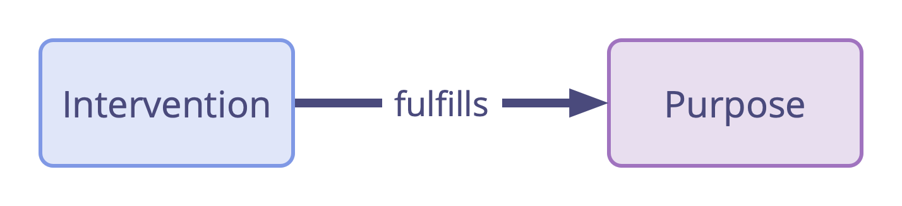
        

    

    <figcaption></figcaption>
</figure>

Purpose informs, motivates, and guides action. Interventions are specific steps people take, and/or the constraints they put in place, to fulfill a purpose.

Although _people making interventions to fulfill a purpose_ sounds intuitive and straightforward, in practice, there are many fail points that can lead to undesirable consequences or waste. Common examples include the following:

-   **Lack of clarity around objectives**: People act without understanding the purpose behind what they are doing.
-   **Misalignment**: The purpose of a specific decision or action does not align with the organization's broader goals or priorities.
-   **Disagreement on viability**: There is disagreement about whether a purpose is valuable or worth pursuing.
-   **Divergent opinions**: People have differing views about the purpose behind a decision or activity.
-   **Diverse implementation perspectives**: People have different perspectives on how to fulfill a purpose.
-   **Ineffective interventions**: The activities intended to fulfill a purpose turn out to be unsuitable or insufficient, from the beginning, or because circumstances changed in the meantime.
-   **Lack of effective feedback loops**: There is no review of whether interventions are achieving their purpose, or no follow-up to improve or adapt them.

It's much easier to avoid or at least detect and mitigate those fail points when all stakeholders share a common understanding about how to describe and discuss purpose and interventions clearly and coherently.

Understanding and describing interventions is often straightforward; you list the specific step(s) you take and/or the constraint(s) you put in place to fulfill a purpose. Clearly understanding and describing purpose, however, can be more challenging, and there are several ways to do it.

One way to understand purpose is as the confluence of a _situation_ that is relevant to address, and the _outcomes_ considered valuable to achieve in relation to that situation. To define purpose, we use two concepts:

-   **Organizational Driver**: a _situation_ of relevance that you want to address.
-   **Requirement:** a state considered valuable to establish or maintain in order to address a specific driver.

Clarifying both the organizational driver and the associated requirement makes it much easier to determine a suitable intervention.

<figure class="fig fig--limit-both fig--scale-normal">
    

        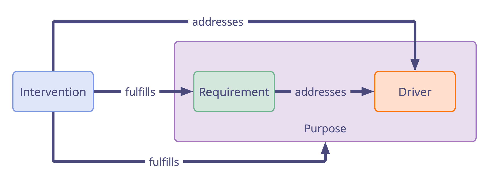
        

    

    <figcaption></figcaption>
</figure>

There is also a **natural sequence** to this approach: A clear understanding of the situation of relevance is essential to determine a suitable requirement. Understanding the requirement itself (or at least, a grasp of a valuable outcome) is necessary to determine an appropriate intervention.

<figure class="fig fig--limit-width fig--scale-small">
    

        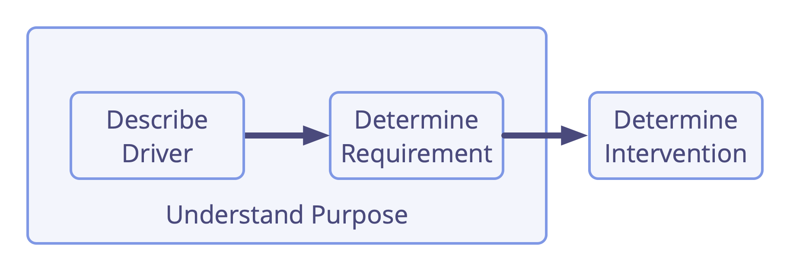
        

    

    <figcaption></figcaption>
</figure>

Breaking down the process of responding to relevant situations into distinct, sequential steps helps prevent misdiagnosis, reduce wasted effort, and avoid implementing solutions that fail to address the situation in a suitable way.

This model also helps to visualize interconnected purposes, supports shared understanding, better communication, and more effective evaluation of whether specific interventions are achieving the outcomes intended.

Ensuring coherence is often complex: each intervention needs to be suitable for fulfilling the purpose it is intended to serve, but it must not impede the fulfillment of other organizational purposes. It also needs to be aligned with and valuable in light of the organization's overarching goals. This complexity arises from the interconnected and interdependent nature of things and from the difficulty of clearly delineating where one aspect ends and another begins.

In essence, for people in organizations, this framework serves as a practical roadmap that turns vague intentions into concrete, purposeful actions. It supports better resource utilization, stronger alignment, a more focused approach toward achieving meaningful outcomes, and greater capacity for _learning and adaptation_ over time, as supported by the patterns in S3.

#### How the Model Helps

The model for purposeful action provides a lightweight and conceptual framework that reveals a simple underlying architecture behind all decision-making and activity in organizations.

The model can shift how people perceive organizational dynamics through the conversations it triggers. By understanding purpose, relevance, and relationship to the whole, people begin to "see the system" — recognizing interconnections between decisions and their relation to overarching purpose. This reframing is often transformational.

On the most fundamental level, the model helps people understand why they should act and to what end before they decide what to do and how. It enables insight into relationships between decisions by connecting and aligning what you decide and do with what other people are doing in the organization. It helps surface misalignments (e.g., interventions happening in parallel that should be connected but aren't), supporting learning and adaptation across systems.

It can be used to map out, understand, and evolve the structure of interrelated purposes and interventions throughout the entire organization, from the purpose of the organization itself, all the way down to any simple operational intervention.

While applicable across many contexts, the model is specifically designed to support organizational life: it brings attention to purposeful activity, facilitates coherence across interdependent efforts, and encourages learning and adaptation over time.

The model is universally applicable, regardless of your organization's structure and how you choose to categorize and manage work and decision-making.

Once you understand the concepts and relationships this model is built on, you can start using it right away — both for your own thought process and in your conversations with others — to improve your capacity for sense-making, meaning-making, and decision-making, and increase your chances of recognizing what's working and what may be valuable to change or improve.

The model also works seamlessly with any tools you are currently using for visualizing decisions and work, from pen and paper and wall boards to Miro, Jira, or Google Suite.

#### Purpose

**Everything you do serves a purpose**, even if you might not always consciously choose that purpose or be aware of it. Deliberately considering the purpose before taking action helps ensure that your actions contribute to achieving that purpose. What seems purposeful in isolation might not make sense when you step back and look at the bigger picture. To make the best use of resources, energy, and time, the purpose of your actions must align with your broader goals. This applies to organizations as well.

_**Purpose** is the reason why something is done, used, or created; a guiding motivation that directs actions, decisions, and resources toward achieving a valuable outcome._

Considering purpose helps people make sense of what's important to focus on and fosters a shared understanding of what may or may not be beneficial to do.

Reflecting on purpose supports:

-   **Sense-making**: understanding situations that motivate action
-   **Meaning-making**: establishing whether and why a situation is relevant to respond to
-   **Decision-Making**: determining direction and scope for a suitable response to the situation

##### Purpose at the Center of the Organization

**Every organization has an overall purpose it serves**, whether it's explicitly defined and widely understood or not, and the effectiveness of an organization depends on its members' ability to contribute toward fulfilling that purpose.

Therefore, ensuring the **overall purpose is clear and explicit** helps members align their priorities and actions to that purpose while avoiding wasting effort on activities that do not contribute meaningfully.

As an organization evolves and the context in which it operates changes over time, its **overall purpose might need to be refined** to ensure the organization remains relevant and effective. This is why it's essential to periodically evaluate whether the organization's purpose is still worthwhile pursuing and to determine whether adjustments are valuable or required.

Just as a project or team within an organization can outlive its relevance, the organization itself may reach a point where its purpose is no longer meaningful in its broader context. At that point, the organization must either redefine its purpose or cease to exist.

##### Organizations are Complex Networks of Interrelated Purposes

Within an organization, each team, role, decision, and action serves a purpose — whether that purpose is known, clearly understood, and defined or not. For an organization to be effective, it's important that every purpose people work toward fulfilling contributes to the organization's overall purpose and is not in contradiction to another purpose elsewhere in the organization. Similarly, and in addition to that, for a team or project to be effective, decisions and actions within a team or a project must also align with that team's or project's purpose and must not contradict any other decision or action.

<figure class="fig fig--limit-both fig--scale-normal">
    

        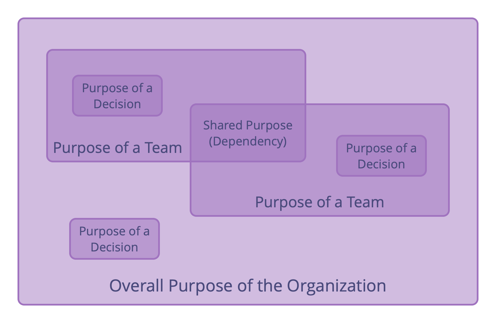
        

    

    <figcaption>Organizations are complex networks of interrelated purposes.</figcaption>
</figure>

Without such coherence, an organization may face numerous undesirable outcomes, such as conflicting decisions, unclear responsibilities, duplication of effort, or failure to take care of important work.

As an organization grows, complexity increases, and the connection between our interventions — the actions we take and the rules we put in place — and the organization's overall purpose becomes difficult to track and understand.

Developing and maintaining coherence across this complex, dynamic network of interrelated purposes is both necessary and challenging. It requires ongoing monitoring and evaluation of purposes, interventions, and actual outcomes to ensure that what works is reinforced and what does not is adapted or discarded.

<figure class="fig fig--limit-both fig--scale-normal">
    

        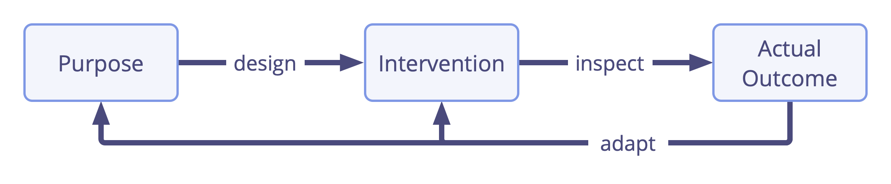
        

    

    <figcaption></figcaption>
</figure>

##### Purpose, Value, and Waste

Understanding this interrelated network of purposes provides a useful lens for evaluating value and waste in organizations. This perspective also makes many practices and ideas from lean production and lean software development immediately applicable for organizations pulling in S3 patterns, such as the Kanban Method or Value Stream Mapping.

In S3, both concepts are explained in relation to purpose:

_**Value** is the importance, worth or usefulness of something for fulfilling a purpose._

_**Waste**, in relation to purpose, is any activity, output, or use of resources that does not contribute — directly or indirectly — to fulfilling that purpose._

There is a wealth of research and development about value and waste in organizations. Exploring these ideas can provide valuable insights and practical methods for improving flow, reducing unnecessary effort, and increasing effectiveness when fulfilling organizational purposes.

##### How to Describe Purpose: Drivers and Requirements

For familiar or obvious challenges or opportunities, it's easy to describe purpose because it's implicit or self-evident. But even in such cases, sometimes we might discover that our interpretations differ from others', and what we thought was obvious turns out to be more complicated or complex.

In many situations, especially when things are new, uncertain, or complex, our understanding of what's going on and of what's required to respond may be more or less clear. Some aspects of a situation might be well understood, while others remain uncertain or entirely unknown. Therefore, it's helpful to have a way to describe purpose that reflects the clarity we have so far, while leaving space to evolve our understanding over time. This makes it easier to communicate, develop shared understanding, and regularly review and adjust our approach as we learn more.

<figure class="fig fig--limit-both fig--scale-small">
    

        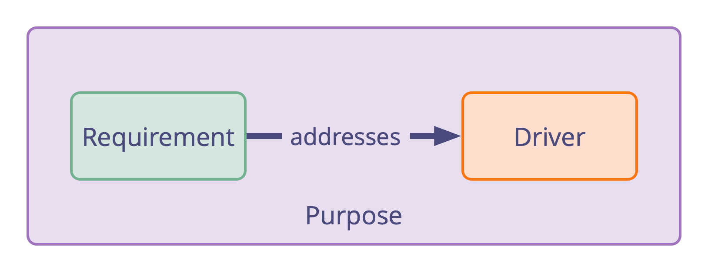
        

    

    <figcaption></figcaption>
</figure>

To help people make sense of and clarify purpose, we use the concepts of _Organizational Drivers_ and _Requirements_:

-   An **organizational driver** is any situation that is relevant for the organization to address.
-   A **requirement** is a state considered valuable to establish or maintain in order to address a specific driver.

This implies that any intervention that aims to fulfill (or at least serve) a specific purpose can be understood as fulfilling a specific requirement that has been identified as suitable to address a specific situation of relevance. The driver explains the situation that makes the intervention relevant. The requirement serves both as an indication of the direction to go and as a clarification of the scope and boundaries of the intervention.

So describing purpose in terms of a driver and a requirement clarifies why the intervention is needed in the first place, and then helps people understand and decide more specifically what to do. A purpose well articulated and understood not only explains and justifies activity, but it also motivates and drives action.

#### Organizational Drivers

Identifying and understanding situations that present potential **impediments** or **opportunities** in relation to an organization's objectives is essential for successfully navigating daily work and making the best use of limited resources, energy, and time.

However, not all situations that motivate an organization's _members_ to act are **relevant** for the organization to address. The concept of organizational drivers supports people in making this distinction explicit, enabling greater clarity, alignment, and focus, both in deciding what is necessary to respond to and how to respond.

_An **organizational driver** is a situation where the organization's members have a motive to respond because they anticipate that doing so is beneficial or necessary for fulfilling the organization’s purpose. (by helping generate value, eliminate waste, or avoid undesirable risks or consequences)._

Note: In this guide, organizational drivers are often simply referred to as "drivers".

Organizational drivers do not exist in isolation: in the course of serving the organization's overall purpose, people encounter numerous organizational drivers: challenges, impediments, risks, and opportunities. Some arise as a consequence of decisions you or others make in the organization, while others are due to external factors or changes. New drivers also often become apparent through the process of breaking down work into smaller parts.

Whenever you identify situations that appear to represent a **problem, challenge, impediment, risk, or opportunity** for the organization, you are thinking about potential organizational drivers.

Examples of situations that qualified as organizational drivers:

-   _The team spends 25% of their work hours on admin work, and this is leading to slow response time for customer requests and a growing number of complaints. The organization is starting to develop a bad reputation and runs the risk of losing customers and compromising future sales._
-   _Teams often work on items that have not been prioritized in accordance with the product roadmap. This slows down the delivery of features that have been assigned a high priority by the customer and is leading to complaints about the effectiveness of the teams' work._

Making sense of such situations and establishing if they are indeed relevant for the organization to deal with, before deciding how to respond to them, brings several benefits:

-   Understanding a situation well is essential for determining what's required to address it adequately (see _Respond to Organizational Drivers_).
-   Investigating a situation before acting helps avoid mistaken assumptions (see _Navigate via Tension_).
-   Describing a driver is an effective way of communicating with others, ensuring a shared understanding of the situation and why we must act (see _Describe organizational Drivers_).
-   Clarifying why you intend to act helps you evaluate outcomes effectively later and adapt based on learning.
-   Recording an organizational driver in its current form also helps with monitoring if the driver changes over time.

See _Describe Organizational Driver_ for more examples.

To determine whether a situation **qualifies** as an organizational driver, reflect on this question:

_Would responding to this situation help the organization generate value, eliminate waste, or avoid undesirable consequences?_

-   If the answer is **yes**, the situation qualifies as an **organizational driver** that requires attention.
-   If **not**, you can disregard it.
-   If **you are uncertain**, investigate further, which might include reaching out to others who have a clearer idea.

Whenever a situation qualifies as an organizational driver, dealing with it needs to be **prioritized** alongside other work. Even though many situations may qualify as organizational drivers, they might never be addressed because other drivers are more important.

This careful consideration of which situation should be addressed and when helps people stay focused on and responsive to the ongoing flow of challenges and opportunities that arise day to day and that are beneficial to deal with, considering the organization's various objectives and overall purpose.

While identifying organizational drivers often seems straightforward, be mindful of some **common challenges** people bump into, both when recognizing potentially relevant situations and when determining whether those situations are, in fact, relevant:

Related to understanding the situation:

-   Misreading the situation: People conflate what they observe with how they interpret it.
-   Conflicting or incomplete interpretations: People have different perspectives on what is actually happening and cannot reach an agreement, or fail to integrate different perspectives.
-   Mistaking symptoms for root causes: Sometimes, the situation you're reacting to is itself caused by something deeper. Without addressing the underlying cause, the real problem persists.

Related to determining relevance to the organization:

-   Lack of awareness: "*I didn't realize it was even a problem*"
-   Missing context: A lack of understanding of the organization's overall purpose, strategic direction, values, or existing policies makes it harder to determine what matters.
-   Confusing correlation with causation. Sometimes, the situation you are observing is a downstream effect of upstream causes. In complex situations, cause-and-effect relationships are often difficult to determine.
-   Confusing correlation with causation: Sometimes, you focus on addressing a particular situation without recognizing that there is an underlying issue that needs to be addressed in order to deal with it effectively.

For more guidance on how to describe organizational drivers clearly and effectively, see the _Describe Organizational Drivers_ pattern.

**Note**: It's generally good practice to keep a written record of any significant drivers for future reference or when they need to be communicated. However, there are some cases where recording a driver doesn't add any value, e.g. in operational day-to-day decisions that don't have any significant or lasting impact on the organization, or when the driver is implied by a requirement or an intervention that has already been determined (see the section "Define just enough detail to be helpful").

Related Patterns:

-   _Describe Organizational Drivers_ offers guidance on how to describe organizational drivers clearly and effectively.
-   _Respond to Organizational Drivers_ explains the steps for responding to organizational drivers.

#### Requirements

<figure class="fig fig--limit-both fig--scale-normal">
    

        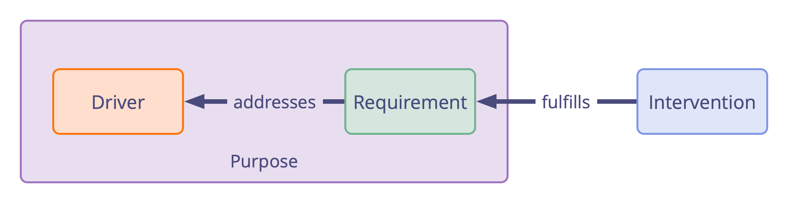
        

    

    <figcaption></figcaption>
</figure>

A requirement connects a driver and the intervention intended to address it. It bridges the *problem space* and the *solution space*. Once it has been determined to be suitable for addressing a driver, a requirement is binding and sets the scope and direction for the intervention you define. In this sense, requirements function as constraints.

_A **requirement** is a state considered valuable to establish or maintain in order to address a specific driver._

##### What's the Benefit of Explicitly Clarifying Requirements?

Unless the way to address a particular driver is obvious, explicitly clarifying the intended outcomes and the enabling conditions you think should be established to achieve those outcomes, _before_ determining more specific solutions, will give you the following benefits:

-   **Encourages more intentionality**: When determining the requirement first, people are more likely to think consciously about how to address a driver, rather than acting based on reaction or habit, especially in novel and or complex situations.
-   **Clarifies intent and direction**: By defining the outcome you seek and the conditions you deem suitable to establish, you anchor the intervention in shared understanding rather than assumption.
-   **Clarifies scope**: The requirement serves as a constraint on the kind of interventions that are acceptable or feasible, narrowing down the pool of options to those that suit the context.
-   **Creates space for creativity and diverse input**: A well-framed requirement invites a broader range of ideas before narrowing in on specific interventions.
-   **Supports delegation and autonomy**: When others will carry out the intervention, clearly stated requirements enable them to act with greater confidence and less oversight while remaining aligned with organizational intent.
-   **Enables effective collaboration**: The requirement provides a common ground for collaborating on finding suitable solutions and helps reduce unnecessary friction from people pulling in different directions because they have different assumptions about what is needed.
-   **Enables effective evaluation**: The outcome provides a reference point for assessing whether an intervention successfully addressed the driver, supporting iterative learning and continuous improvement.

##### The Anatomy of a Requirement

Determining the requirement involves intentionally and explicitly defining the _intended outcome(s)_ and the _enabling condition(s)_ considered suitable to establish or maintain for achieving that outcome.

_In the context of a requirement, **intended outcome(s)** are specific, observable results you aim to achieve in relation to a driver._

_In the context of a requirement, **enabling conditions** are conditions considered necessary to establish for achieving or maintaining intended outcomes._

**Examples of requirements:**

1. **Enabling Condition**: We need to store and share relevant information effectively… \
**Intended Outcome**: …to improve everyone's ability to provide valuable solutions for our customers.
2. **Enabling Condition**: We need to free up time to handle customer requirements in a timely manner… \
**Intended Outcomes**: …so that we can improve customer satisfaction and eliminate this type of complaint.

##### Why Clarify Both the Intended Outcomes and the Enabling Conditions in a Requirement?

-   **Distinguishes Ends from Means**
    -   The intended outcome represents the future state we aim to realize (the **end**).
    -   The enabling conditions describe what we consider suitable and sufficient to achieve that outcome (**a means**, but not the intervention itself).
    -   Separating these elements allows for clearer evaluation, adaptation, and learning over time.
-   **Enables more effective design of the intervention**
    -   The intended outcome defines the **direction** a suitable intervention must take
    -   The enabling conditions help narrow the **scope** of possible interventions to those we find acceptable, and guide discussion and refinement of the intervention's details.
-   **Supports evaluation and accountability**
    -   The outcome serves as the foundation for evaluation, as it clarifies what success looks like and allows assessment of whether **the intervention helped achieve what was intended**.
    -   The enabling condition provides a basis to evaluate whether **the intervention was appropriately scoped and implemented**.

##### Requirements as Assumptions that Guide Iteration and Learning

When determining a requirement in relation to a driver, we make several discrete assumptions:

-   Our understanding of the driver is _accurate_ and _sufficient_ for determining a suitable requirement
-   The intended outcomes are _achievable_ and _valuable_ (in relation to the driver)
-   The enabling conditions we want to establish (or maintain) are _suitable_ and _sufficient_ for achieving that outcome

These assumptions are based on the information available at the time, as well as the level of understanding and experience we have about the situation we are dealing with. Any of these assumptions may be wrong. Therefore, requirements need to be tested, monitored, and, if necessary, changed over time.

When interventions are implemented as designed but don't work as expected, being able to revisit both outcomes and enabling conditions separately helps determine what needs to be improved:

-   **The design of the intervention is flawed**: we implemented the intervention, but it didn't establish the enabling conditions, and also did not achieve the intended outcomes.
-   **The assumed conditions are inappropriate or insufficient** for achieving the intended outcomes: the enabling conditions were met, but it didn't lead to the outcome we intended.
-   **The intended outcomes are unsuitable**: we achieved the outcomes we intended, but the driver was not adequately addressed.
-   **The intended outcomes are unattainable**: they have not been achieved, and it appears unrealistic to expect they can be achieved in this context.

Revisiting these elements will help determine how to evolve your approach:

-   If necessary, update your understanding of the driver.
-   Then review, and if necessary, update the requirement.
-   Finally, adapt the intervention itself.

##### When and Why to Make Requirements Explicit

We often make interventions to address organizational drivers based on our assumptions about the requirement, without making those assumptions explicit. This isn't necessarily a problem, especially in familiar situations, where established patterns work well.

However, in novel or complex situations, jumping too quickly to a specific intervention can be detrimental. Our habitual or automatic responses may not suit the situation, leading to unintended consequences and missed opportunities for a more fit-for-context response.

**Example**:

You receive an email inquiry from a potential client. It seems straightforward, so your instinct is to reply quickly and informatively to acknowledge them and provide the information requested.

**Requirement (habitual)**: _Respond promptly and informatively to maintain professionalism and client satisfaction._

However, upon closer inspection of the email, you realize the inquiry references a possible collaboration involving a major strategic opportunity, not just a routine question.

**Requirement (deliberate)**: _Formulate a thoughtful and tailored response that opens a conversation and increases the likelihood of strategic collaboration._

By resisting the urge to respond habitually and instead clarifying what is actually required, you significantly improve the chances of securing a high-value partnership — something a quick, generic reply might have missed.

This comparison illustrates how a more deliberate process for determining the requirement can better ensure a strategic and impactful response.

Organizations often put emphasis on an action-oriented or solution-oriented mindset. However, in collaborative settings, focusing on specific interventions too early — before we fully understand the requirement — can stifle creativity and lead to unnecessary tension or conflict.

Moreover, interventions may sometimes stem from individuals projecting past experiences onto the current situation or simply defaulting to familiar routines. This can result in actions that do not adequately address the driver. A more suitable approach is first to _determine a suitable requirement_ and then establish an appropriate intervention to fulfill it.

**Note**: In complex situations, it may not be possible — or even useful — to determine a single overall requirement that fully addresses the driver at the outset of responding to it. However, it is always possible to identify a requirement that serves as a valuable next step in addressing the situation. This "sub-requirement" is already part of the intervention itself (see the section on Interventions below for more details). In such cases, you can mark the overall requirement as "TBD" (to be determined) and update it as your understanding evolves. In these situations, it is entirely valid to incrementally fulfill any sub-requirements you are able to determine as suitable, either until the overall requirement becomes clear or until the driver is sufficiently addressed through the interventions taken.

##### Requirements and User Stories

The concept of requirements in S3 is closely aligned with how the term is used in software engineering, where a requirement describes a capability or condition needed to fulfill a purpose. S3's concept of requirements provides a more generalized structure to support more deliberate and adaptive decision-making across a wide range of organizational contexts and beyond.

In software development, user stories are one way of describing requirements, typically focusing on user needs and outcomes in a concise, conversational format. A slight adaptation of this format also lends itself well to expressing requirements in S3:

User stories are formulated as follows:

_As a \<role\> I want \<capability\>, so that \<value\>._

The equivalent in our model is:

_(Considering the driver) we need \<enabling condition\>, so that \<intended outcome\>._

While a user story is written from the perspective of a customer or end user, a requirement in this context is typically written from the perspective of the organization responding to the driver — or a subset of its members — so the \<role\> is simply inferred from the driver. As with user stories, the details of the enabling conditions or intended outcomes may emerge over time. Requirements are formed through conversation, and refined collaboratively — ideally close to the time the driver is to be addressed — and then improved iteratively based on actual outcomes and learning.

Connecting requirements to their underlying drivers deepens shared understanding and strengthens alignment around what matters most. In the same way, it's often beneficial to make the driver behind a user story explicit, as it provides additional context to help the developer better understand the customer's (or user's) needs.

Related Patterns:

-   _Determine Requirements_
-   _Evaluate and Evolve Policy_

#### The Relationship Between Driver and Requirement

The following table highlights the structural parallels between drivers and requirements and clarifies how they relate.

Both concepts represent states in a system, yet they occupy distinct positions in the logic of purposeful action: a driver is a situation in the present that requires attention, and a requirement is a future situation whose realization is expected to address that driver.

The distinction mirrors a broader pattern: each present-focused element (current conditions, effects, relevance) has a corresponding future-focused counterpart (enabling conditions, intended outcomes, relevance). Together, these pairs help clarify both why action is needed now and what is believed necessary to move toward a preferable state.

<figure class="fig fig--limit-width fig--scale-full">
    

        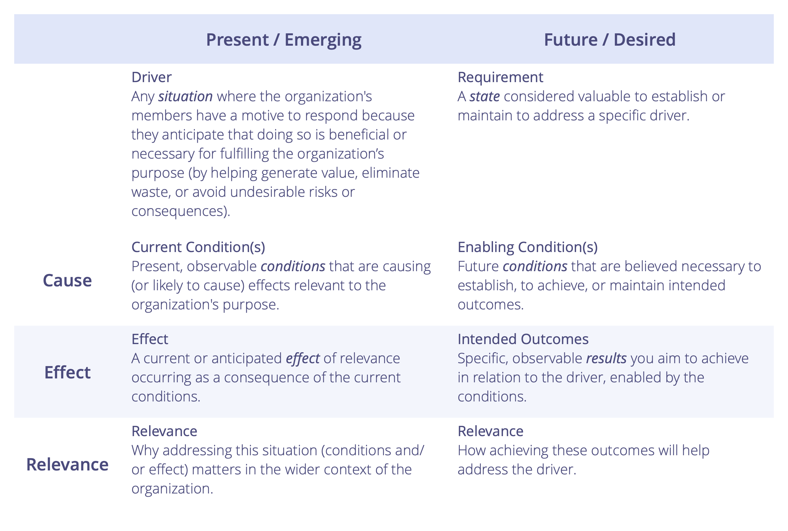
        

    

    <figcaption></figcaption>
</figure>

#### Interventions: Turning Purpose into Action

The model of purposeful action rests on the observation that work in organizations can be understood as people making interventions to fulfill a purpose.

<figure class="fig fig--limit-width fig--scale-small">
    

        
        

    

    <figcaption></figcaption>
</figure>

Now that we've clarified what purpose is and how it can be described in terms of drivers and requirements, the next step is to explain more about the nature and structure of interventions. After all, interventions are how people translate purpose into practice — they are the only means through which organizations create and deliver value: it's interventions that ultimately pay the bills.

_An intervention is the specific steps you take and/or the constraints you put in place to fulfill a purpose._

Interventions represent the means by which people fulfill purposes in practice. Depending on the specific purpose an intervention is intended to fulfill, it may be a simple operational task or a rule put in place to guide decisions and actions. However, interventions can also involve a complex arrangement of activities, prescriptions, constraints, and recommendations.

Some interventions are informal and intuitive, while others are developed intentionally, either by individuals or collaboratively by groups, and may require careful coordination, documentation, or evaluation. In complex situations, taking an experimental approach and developing interventions iteratively and incrementally is worthwhile.

##### Examples of Interventions

Interventions include both simple one-time tasks and longer-term activities or constraints that guide ongoing decisions. For example:

-   Create an agenda for a meeting
-   Responding to a customer inquiry
-   Reviewing financial data
-   _Set_ a time box for a meeting
-   Priority order of tasks or agenda items
-   Assigned responsibility for specific tasks or roles
-   Define the scope of work and decision-making authority for a role or team
-   Define a standard operating procedure
-   Set a budget limit or spending cap
-   Define a strategy
-   A policy for onboarding new members of the organization

##### Interventions That Constrain

Interventions not only refer to what to do (tasks, activities) but also may include putting limits on how things must be done or on the behaviour of members of the organization. We refer to these limitations as _constraints_:

_A constraint is a limitation or restriction that controls or limits what someone can do or what can happen. It can be a requirement to fulfill, a rule to follow, or a boundary on actions, behaviors, or outcomes._

You will find constraints in organizational strategy, policies, organizational values, and priorities, as well as all implicit expectations about what people can and cannot do ("unwritten rules").

**Note**: In the course of designing an intervention, any sub-requirement deemed suitable for contributing toward fulfilling the main requirement is, by definition, binding and therefore also functions as a constraint. However, this section is not concerned with sub-requirements; it focuses on interventions that, by themselves, impose constraints on behavior and activity in other parts of the system.

In the context of interventions, constraints are not restrictive in a negative sense. Rather, they serve to support collaboration, reduce friction, prevent waste, and help people make decisions that are aligned with the organization's broader purpose and objectives.

Constraints can apply to specific tasks or activities, guide behaviour, or limit the range of choices available when making decisions. They can be implied in a requirement or task (e.g., when the task is assigned to somebody), or made explicit,  and may be as simple or detailed as necessary.

Examples of constraints:

-   A time box for a meeting
-   Priority order of tasks or agenda items
-   Assigned responsibility for specific tasks or roles
-   Defined scope of decision-making authority
-   A standard process or template for certain situations
-   A budget limit or spending cap
-   Expected response times for internal communication

In practice, tasks, activities, and constraints are often described together, e.g., when a list of tasks also includes to whom that task is assigned, or under which specific or recurring conditions a task has to be executed.

##### Understanding the Flexible Nature of Interventions

In the daily work of an organization, interventions span a broad range from small, targeted adjustments to complex arrangements of activities and constraints. Some require little thought or coordination, while others call for careful planning, collaboration, and adaptation over time.

In many cases, interventions can be described as a single task or a single constraint. In other cases, it's necessary to describe an intervention in more detail and break it down into a number of tasks, activities, and constraints, each of which contributes toward fulfilling the purpose.

Also, the process of describing tasks, activities, or constraints often brings new situations of relevance or requirements into focus, which in turn may require more tasks, activities, or constraints.

In that context, it is helpful to imagine an intervention as a nested structure of **sub-interventions**, over as many layers as is necessary to convey what needs to be done or constrained.

This flexible structure of interventions lends itself to an iterative approach, because interventions can be broken down into smaller parts (sub-interventions) over as many levels as needed, and it's simple to add, replace, or restructure elements as understanding of the situation and requirement evolves or the situation changes.

Following the model for purposeful action, there is a specific purpose (driver and requirement) for each of those sub-interventions. This recurring pattern of purpose and intervention reflects the complexity of organizational life: activities at one level of detail often reveal new drivers, requirements, and corresponding interventions at another.

<figure class="fig fig--limit-both fig--scale-normal">
    

        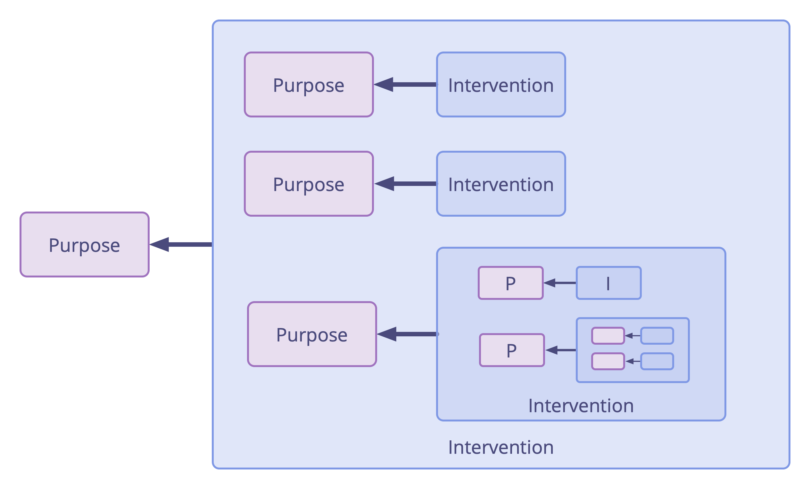
        

    

    <figcaption></figcaption>
</figure>

Breaking down a more comprehensive intervention in this way is especially helpful when it involves:

-   Multiple stakeholders or contributors
-   Recurring activities (systems of tasks and perhaps constraints)
-   Dependencies that must be taken into account
-   New members of a team or organization who are unfamiliar with how things are done
-   People who are less experienced in implementing the intervention.

While each of these **sub-interventions** ultimately contributes toward fulfilling the overall purpose of the intervention, some of them arise as a consequence of dependencies with other parts of the organization, or wider adherence to constraints within the organization or its broader environment within which it operates.

In many cases, these dependencies are already present but only become salient when people begin acting on a requirement. Making them explicit can help maintain coherence, especially when coordination across teams is required.

**Note**: an intervention — or one of its parts — may contribute to fulfilling several different or related purposes, especially in the case of dependencies between individuals or teams. In such cases, use your best judgment to decide whether the intervention needs to be tracked or referenced in all relevant contexts, or whether it is sufficient to document and monitor it in a single place, with links or references as needed.

##### Define Just Enough Detail to Be Helpful

Thinking through and defining interventions doesn't require exhaustive detail. Use your best judgment about what to include and what to omit. It's good practice to leave out obvious or redundant elements and to leave undefined those aspects that the people responsible for implementation are better able to determine, based on their context or evolving situations.

**Interventions** frequently include one or more **activities** along with **constraints** relating to those activities, such as who's responsible, due dates, or other important conditions. One entry in such a list might look like this: "_Sally will compile a report by Friday_." Presented together, they form a clear and useful description of the intervention, combining the activity itself (_compile the report_) and two constraints (_who_ will do it and _by when_), each of which corresponds to an implicit sub-requirement.

In cases where fulfilling a requirement is so simple, obvious, or familiar that it directly implies what a suitable intervention would be, there is no need to spell it out explicitly. For example, if the requirement is to "_Inform people about the topics for tomorrow's meeting so they arrive prepared_," describing the intervention ("_prepare and send out the agenda today_") may be unnecessary.

The same can be true for more complicated or complex interventions if the people responsible already share a clear and sufficient understanding of what needs to be done and why.

**Example**:

**Driver**: _The product unexpectedly went offline, negatively impacting users and posing a risk to customer satisfaction and retention._

**Requirement**: _We need to restore trust and satisfaction among affected customers so that we maintain a positive relationship with them and they continue using our product._

For an experienced support team, the requirement provides enough information to successfully fulfill it.

However, sometimes explicitly naming the intervention and/or breaking it down into smaller steps helps evaluate the effectiveness of the various steps, or for ensuring adequate understanding, especially among people with less experience in the matter or new to the organization.

When breaking interventions down into smaller parts (sub-interventions), the **purpose** (or rationale) for each part is often implicit, since the context remains within the scope of the main purpose and usually doesn't need to be restated.

However, be mindful of situations where it's worthwhile to clarify the purpose of certain parts — especially when there's a reason something needs to be done in a particular way, or when sub-interventions need to happen in a certain order or are otherwise interrelated. Likewise, if parts of an intervention relate to the **wider organization** — such as org-wide policies, responsibilities, or dependencies — or to the **external environment**, document this explicitly.

To clarify the purpose of a sub-intervention, it can be enough to define only the **enabling conditions** that need to be established — especially when the higher-level outcome is already clear — or just the **intended outcomes**, if this implies what enabling conditions are needed. In other cases, it's useful to describe the situation (**driver**) that the requirement is meant to address.

**Example**:

Continuing from the example above regarding the fallout from the product unexpectedly going offline, as part of the overall intervention, the team chose to _send everyone an email_. However, they also identified one customer who had a particularly negative experience and thought an email would be inadequate in this case. Depending on their context, for that sub-intervention, they might define and document one or more of the following:

-   **Sub-Intervention**: _Call customer X to check in and offer support._
-   **Enabling Condition**: _The customer feels heard and supported._
-   **Intended outcome**: _The customer stays_.
-   **Driver**: _Customer X had a negative experience when the product went down, expressed dissatisfaction, and threatened to leave._

In some cases, when designing interventions, it can be adequate first to determine sub-requirements you consider suitable to fulfill in the course of fulfilling the main requirement, deferring more specific decisions about how to fulfill some or even all of those sub-requirements until later. For example, you might decide that "*participants have access to relevant information*," "*there is a clear way to raise concerns*," and "*facilitation is available when needed*" are essential sub-requirements for a productive decision-making process (main requirement), without yet specifying how to achieve this.

##### Policies: A Specific Kind of Intervention

Policies are discussed in more detail in the chapter about _Governance, Operations, and Policy_, but a brief introduction is helpful in the context of the model.

Through the lens of this model, policies are simply those interventions that have a _significant impact on the organization_ because they guide decisions and actions repeatedly, or their influence sustains over an extended period of time.

Policies often take the form of processes, procedures, protocols, plans, strategies, or guidelines.

Because of their significance and their long-term use, and because of people's increasing understanding of the purpose they're responding to, policies are typically evaluated and evolved over time to ensure they become and remain fit for purpose, even in the face of changing circumstances.

Apart from their significance, there is no difference between a policy and any other intervention: they are created to fulfill a specific purpose, and are composed of tasks, activities, and constraints.

##### Determining Interventions

Once there is sufficient clarity around the purpose, the next step is to determine a suitable intervention to fulfill it. This involves identifying what needs to be done (tasks and activities) and what constraints need to be put in place to achieve the intended outcomes, at a level of detail appropriate for guiding effective action and evaluation.

If the action to take is already obvious, or if an existing policy already describes what to do, people can often proceed without further elaboration. This happens when simply replying to an email, responding to a customer inquiry, fixing a simple error in code, replacing a defective part on the line, or following a set of predetermined steps in a standard procedure.

In other cases, it may be necessary to take a moment to identify all the steps involved, clarify their sequence, and determine who is best placed to carry each one out.

However, in novel or complex situations, and especially in cases where the main requirement itself is not clear yet, determining a suitable intervention often requires more effort and can involve an iterative approach of investigation, experimentation, and adaptation.

The flexible structure of interventions lends itself to an iterative approach, because interventions can be broken down into smaller parts if helpful, and it's simple to add, replace, or restructure elements as understanding of the situation and requirement evolves or the situation changes.

So, in such cases, instead of attempting to define the intervention in full from the outset, it is a more viable approach to define only the most useful next step(s) for those sub-requirements that are already apparent. This often includes one or several of the following activities:

-   A deeper analysis of the situation to clarify assumptions, surface relevant information, or reveal constraints and opportunities that affect what interventions are possible.
-   Reviewing any existing agreements, policies, organizational values, or external constraints that guide or limit possible interventions.
-   Identify possible dependencies with other parts of the organization, to avoid impediments, or impeding the work of others, or double work.
-   Researching existing patterns, practices, or proven approaches that have worked in similar situations.
-   Consulting with others to benefit from diverse perspectives, relevant expertise, or local knowledge.
-   Exploring possible options, and selecting one that is safe enough to try and fits the context.
-   Testing ideas through small experiments or prototypes before committing to a more substantial intervention.
-   Evaluating an intervention on a regular basis and using what has been learned to evolve the intervention as necessary.

You can use the following patterns to determine and evolve interventions:

-   _Proposal Forming_ and _Co-Create proposals_ for co-creating solutions based on collective input.
-   _Consent Decision Making_ — for surfacing and addressing objections against a possible intervention before implementing it.
-   _Evaluate and Evolve policies_ to support continuous learning and improvement of interventions over time.

### Domains and Delegation

_A **domain** is a distinct area of responsibility and authority within an organization._

To use their limited time, energy, and resources effectively, people in organizations distribute work between them by delegating responsibilities to individuals (who keep roles), or to teams (squads, units, departments, and so on. In the process, they are explicitly or implicitly defining domains — distinct areas of responsibility and autonomy. Domains may overlap with one another or be fully contained within other domains. 

Most domains in an organization fall entirely within the overall domain of the organization. However, some domains relating to the organization might extend beyond the organization itself, like an advisory or shareholder board that may even have the authority to sell or dissolve the organization. 

<figure class="fig fig--limit-both fig--scale-normal">
    

        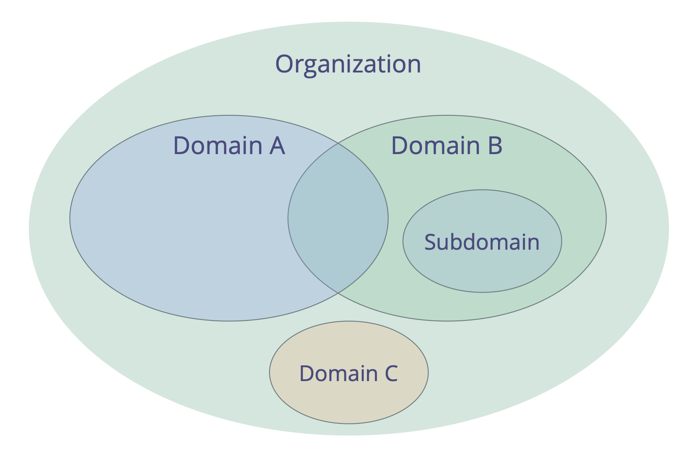
        

    

    <figcaption>Domains may overlap or be fully contained within other domains.</figcaption>
</figure>

Any role or team's purpose within an organization is to contribute toward the overall purpose of the organization by taking care of a specific area of responsibility. Inadequately defined domains typically lead to stakeholders having different assumptions about areas of responsibility and people's level of authority to decide and act for themselves. As a consequence, both collaboration and distribution of work suffer because of missed dependencies, double work, or important work not being done at all.

_Clarifying domains_ makes the contract between the *delegator* (who delegates responsibility for a domain) and the *delegatee(s)* (to whom the domain is delegated) explicit, which enables everyone to understand expectations and to reflect on what works and what doesn't, so that a domain's design can be improved over time. A clear domain description with a reasonable amount of detail is a necessary prerequisite for people to successfully evaluate and continuously improve their work.

#### Evaluate and Evolve Domains Regularly

People's understanding of the organization is limited, and the environment, both inside and outside of the organization, is always changing. Therefore, it is essential that the delegator, delegatee(s), and other relevant stakeholders regularly take the time to evaluate and evolve both the design of the domain and how people account for it, as their understanding of the work required to fulfill the purpose of a domain deepens.

People might do a great job of accounting for a domain in the way it's designed, but the design itself might still be primitive or flawed. On the other hand, even if the design of a domain is poor in the first iteration, through this process, it will improve over time.

#### Delegating Responsibility for Domains

_**Delegation** is the grant of authority by one party (the delegator) to another (the delegatee) to attend to a domain (i.e., to do certain things or to make certain decisions), for which the delegator maintains overall accountability._

Responsibility for domains is delegated to groups or individuals, who then act within their defined constraints on their autonomy and influence.

When a domain is delegated to a group of people, they form a <a href="glossary.html#entry-team" class="glossary-tooltip" data-toggle="tooltip" title="Team: A group of people collaborating toward fulfilling a shared purpose. Typically, a team is part of an organization, or it is formed as a collaboration of several organizations.">team</a>. When a domain is delegated to an individual, they become a <a href="glossary.html#entry-role-keeper" class="glossary-tooltip" data-toggle="tooltip" title="Role Keeper: An individual taking responsibility for a role.">role keeper</a>.

The <a href="glossary.html#entry-delegatee" class="glossary-tooltip" data-toggle="tooltip" title="Delegatee: An individual or group accepting responsibility for a domain delegated to them, becoming a role keeper or a team.">delegatee(s)</a> may do whatever they think will help them achieve their purpose, unless it is outside the domain of the organization, explicitly forbidden, they violate somebody else's (explicit) domain, or impede other people's contribution to the organization in some other way.

Note: *Things that are forbidden include explicit constraints laid out in the domain description, any other agreements the delegatee(s) need to keep, and legal and regulatory requirements.*

The <a href="glossary.html#entry-delegator" class="glossary-tooltip" data-toggle="tooltip" title="Delegator: An individual or group delegating responsibility for a domain to other(s).">delegator</a> still retains overall accountability for that domain, allocates resources, and often defines:

-   the **purpose** that the delegatees aim to fulfill
-   **key responsibilities**: any essential work and decision-making being delegated to the team or role keeper keeper
-   **customers and deliverables**
-   **critical risks** to manage
-   **constraints** to the autonomy and influence of the delegatee(s), usually related to the organization itself (dependencies, involvement of the delegator, etc.)

See _Clarify and Develop Domains_ for more details.

#### Domains, Drivers, and Requirements

It's also possible to understand a domain in the context of organizational drivers and their related requirements:

-   **Purpose**:
    -   the domain's primary driver (the situation the domain was set up to address in the first place)
    -   the main requirement the delegatee(s) are responsible for fulfilling with the intention to address the domain's primary driver effectively
-   the various sub-drivers delegatees are required to address in the course of responding to the domain's primary driver and fulfilling its main requirement, which include:
    -   **Key responsibilities**: requirements that the delegator and delegatee consider essential to take care of in relation to fulfilling the domain's purpose effectively.
    -   **Customer requirements**
    -   **Dependencies** and **constraints** (requirements relating to other domains or to the environment beyond the organization) that constrain the delegatees' autonomy
    

### Objections

_An **objection** is an argument – relating to a proposal, existing decision, or activity being conducted by one or more members of the organization – that reveals consequences or risks that are preferably avoided for the organization or that demonstrates worthwhile ways to improve._

You can think of objections as a simple tool for harvesting distributed intelligence and improving decision-making.

By surfacing objections, teams tap into the collective wisdom of the organization and increase the chances of success. Objections serve as critical feedback mechanisms, helping ensure that decisions are optimized as much as possible and align with achieving the organization's short-term and long-term goals.

The purpose of seeking out and resolving objections to proposals and policies is to ensure that, as far as can be determined, there are no known or anticipated undesirable consequences or risks associated with proceeding in that way. It also serves as a means of checking for potential improvements where the cost and effort of implementing them would likely be worthwhile.

Be aware that withholding objections can harm the ability of individuals, teams, or the whole organization to achieve their objectives. In practice, this means that people need to feel safe and empowered to express potential objections and concerns. 

In an organization that is following the _Principle of Consent_, it’s the responsibility of individuals to raise possible objections to proposals, existing decisions, including policies, and activity, if and when they become aware of them, with those who are directly responsible for the decision or activity in question. In turn, those responsible need to consider the arguments and address the ones that qualify as objections. This ensures that new and relevant information that emerges is taken into account.

Objections prevent proposals, decisions, or activities from being implemented or continued until the arguments raised have been consciously considered and a clear decision is made in light of the information revealed.

When reflecting on whether or not you have any objections to a proposal, decision, or activity, consider the following questions:

-   How would continuing in this way fail to adequately respond to the driver or effectively fulfill the requirement that the proposal, decision, or activity is meant to address? (**effectiveness**)
-   How would continuing in this way lead to undesirable consequences or risks in the same domain, in the wider organization, or beyond? (**side-effects**)
-   How would continuing in this way lead to waste or miss out on worthwhile ways to improve? (**efficiency**)

Note: A *worthwhile* improvement is one where the cost of making that improvement, in terms of the time, effort, and resources it would require, is considered to be less than the expected gains. In other words, the improvement should provide a net positive value to the organization. 

#### Aim for “Good Enough for Now and Safe Enough to Try” Decisions.

Creating a culture where people feel comfortable raising *possible* objections enables you to harness a diversity of perspectives and broaden your own. This culture of openness ensures that critical perspectives are not overlooked, which can otherwise hinder progress. If no one has an objection or if arguments that _qualify as objections_ have been _resolved_, a decision can be considered *good enough for now and safe enough to try*.

In the case of complex matters, striving for a perfect decision is futile. Complex systems are unpredictable, and what seems like a perfect solution may turn out to be unsuitable, not work in practice, or quickly become outdated. Approach decision-making iteratively and incrementally to encourage people to try things out instead of attempting to anticipate and account for all possibilities in advance.

A regular cadence for evaluating significant decisions (<a href="glossary.html#entry-policy" class="glossary-tooltip" data-toggle="tooltip" title="Policy: An intervention that is created and evolved through governance; a process, procedure, protocol, plan, strategy, or guideline.">policies</a>) and deliberately checking for objections to continuing with a decision unchanged provides further opportunities to identify ways to improve them. It helps people to relax into making decisions that are *good enough for now and safe enough to try*, encourages experimentation, and supports the practice of evolving decisions based on learning over time. (see _Evaluate and Evolve Policies_)

#### Concerns

Not all arguments raised are objections, but they might reveal concerns.

_A **concern** is an assumption that cannot (for now at least) be backed up by reasoning or enough evidence to qualify as an objection to those who are considering it._

Concerns don’t prevent proposals from being accepted; only objections do. Nevertheless, considering people’s concerns can provide insight into how to further evolve proposals, existing decisions, and activities, including revealing ways to change things to alleviate those concerns. For policies, this may include adding further evaluation criteria or adjusting the frequency of evaluation. 

In any case, it’s valuable to bring up a concern if you think it’s worthwhile to consider. However, determining whether an argument is an objection or a concern is sometimes dependent on context. Therefore, if you are in doubt about whether you have an objection or a concern, be proactive and check with others to see what they think too (see _Test Arguments Qualify as Objections_.

### Governance, Operations, Policy

During their daily work, people come across many situations they need to address (<a href="glossary.html#entry-organizational-driver" class="glossary-tooltip" data-toggle="tooltip" title="Organizational Driver: A situation where the organization&#x27;s members have a motive to respond because they anticipate that doing so is beneficial or necessary for fulfilling the organization’s purpose. (by helping generate value, eliminate waste, or avoid undesirable risks or consequences). Drivers are often expressed as _current conditions_ that lead to current or anticipated _effects_ that are _relevant_ to the organization.">organizational drivers</a>) and <a href="glossary.html#entry-requirement" class="glossary-tooltip" data-toggle="tooltip" title="Requirement: A state considered valuable to establish or maintain in order to address a specific driver. Requirements are often expressed as _intended outcome(s)_, and _enabling condition(s)_ considered necessary to establish for achieving or maintaining those outcomes.">requirements</a> they need to fulfill. In each case, they need to determine suitable <a href="glossary.html#entry-intervention" class="glossary-tooltip" data-toggle="tooltip" title="Intervention: The specific steps you take and/or the constraints you put in place to fulfill a purpose.">interventions</a>, which may involve operations — doing the work — or governance: creating or evolving decisions about what work will be done (setting objectives) and how (guidelines, strategy, rules, etc.). 

Making a clear distinction between *operations*—the day-to-day work of delivering value to customers — and *governance*—setting significant objectives and guiding people toward achieving them — ensures that governance matters are addressed in a deliberate, coherent, and incremental manner and, when worthwhile or necessary, through a participatory approach.

Distinguishing between the two is useful because governance requires a different approach and set of activities from those needed to handle day-to-day operations. 

_**Governance** the sum of activities involved in setting significant objectives and making and evolving significant decisions (policies) that guide people toward achieving those objectives, for the entire organization or specific people within it._

_**Operations** is doing the work and organizing day-to-day activities within the constraints defined through governance._

_A **policy** is an intervention that is created and evolved through governance; a process, procedure, protocol, plan, strategy, or guideline._

When people think of governance, they often think of corporate governance — the system of rules, practices, and processes for directing and controlling an organization. Traditionally, many of these decisions are seen as the domain of managers and boards of directors, and implemented through hierarchical structures for control and accountability. However, governance as we define and use the term in the context of S3 is broader. Governance occurs at all levels throughout an organization, including within teams and even at the individual level, with many people making and contributing to governance, often without being aware of it. This broader view of governance reveals why it's valuable for everyone in an organization to understand the concept, how to approach governance, and how it applies to their daily work.

Regardless of how you distribute responsibility for governance throughout the organization, whether it's more centralized or more distributed, you need clear guidelines and constraints that enable smooth collaboration between teams and individuals and support achieving both long-term and short-term objectives. In S3, we refer to these guidelines and constraints created through governance as **policy**. Policies guide and constrain people in relation to significant matters such as strategy, priorities, distribution of responsibilities and authority to influence, work processes, and many decisions about products and services.

While decisions with short-term consequences can easily be amended on the spot, making and evolving policies is more consequential because such decisions usually constrain people's behavior and activities for extended periods of time. To ensure policies become and remain fit for purpose, we recommend a more _participatory and deliberate approach to decision-making_

As organizations grow and their operations become more complex, developing the capacity for collective sense-making becomes increasingly critical. This involves harnessing diverse perspectives to make and evolve the decisions needed to respond effectively to the various challenges and opportunities they face as they navigate the world's complexities.

Regular _evaluation of outcomes_ ensures they are adapted, improved, or even discarded as circumstances change and people learn over time.

While doing the work and organizing day-to-day activities (operations) is essential for delivering value to your customers, governance enables operations to be effective and efficient. Consciously and intentionally deciding which objectives to pursue and putting in place policies to achieve those objectives supports everyone throughout the organization in making the best use of their time, energy, and available resources and in working together to fulfill the organization's purpose most effectively.

#### How to Distinguish Between Governance and Operations?

It will usually be clear whether a situation should be handled through governance or operationally. **For cases where it's unclear, first, check if an existing *policy* helps you decide.**

**For example**, a policy about handling security breaches can inform you whether a new incident can be resolved by implementing existing security protocols (operations) or whether it requires making a new decision with others about how to handle it (governance). 

**If there is no relevant policy**, make a decision whether it is worthwhile to use a formal governance process. Whenever you expect that how you handle the situation may have significant consequences, treat it as governance.

<figure class="fig fig--limit-both fig--scale-normal">
    

        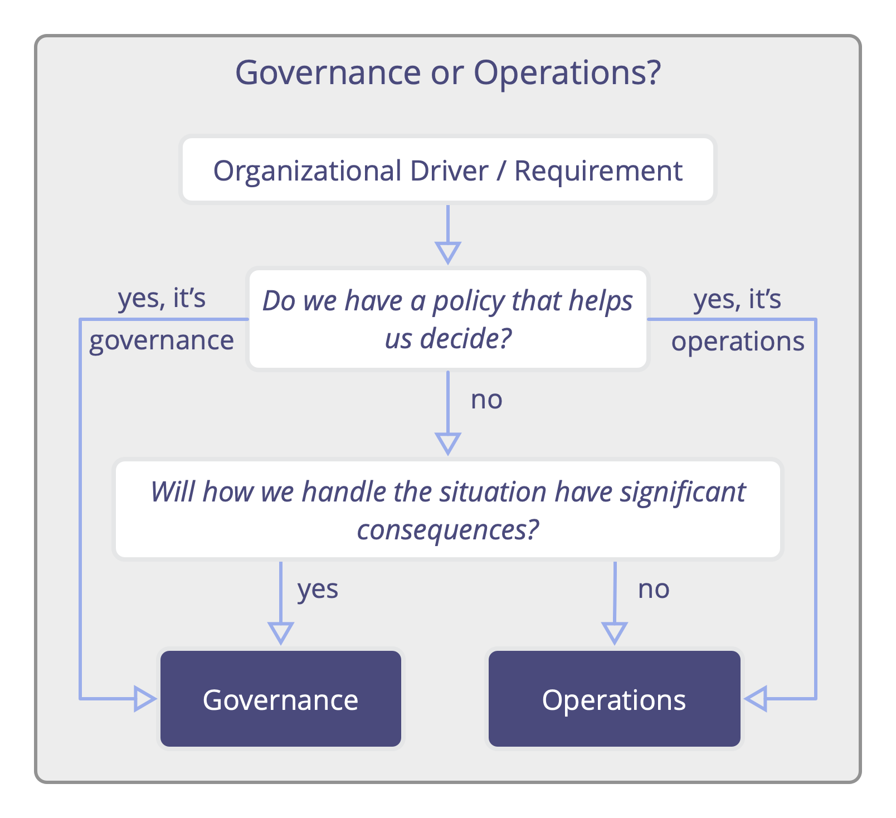
        

    

    <figcaption></figcaption>
</figure>

##### When Is It Worthwhile to Follow a Formal Governance Process?

Worthwhileness is not about whether something counts as governance; rather, it's about whether it merits going through a formal governance process (however that is defined in your organization, e.g., proposal-forming, policy-making, review scheduling) and deliberately monitoring, reviewing, and if necessary, evolving what has been decided over time.

While all governance decisions govern, **not all are processed formally**. The practical question is: *Is this worth going through a deliberate governance process — documented, reviewed, and evolved — or should we just agree and act?*

**Indicators that entering a formal governance process is worthwhile**:

-   The anticipated gain or loss in relation to the situation is *significant* for the organization.
-   The consequences of a specific requirement or intervention you have in mind will be *significant*.
-   The requirement or best approach is unclear.
-   The risks are high enough that care, documentation, and review add value.
-   The situation you are addressing is ongoing or recurring and would benefit from an agreed, reviewable policy.
-   Guidance is needed for others to act effectively.
-   The issue affects an entire domain or people in multiple domains.

You can determine **significance** by looking at factors such as:

-   time, effort, and cost required
-   opportunity cost or trade-offs
-   potential gains or benefits
-   exposure to unintended consequences or risks
-   duration of the intervention's impact on the organization
-   number of people affected.

If you are in doubt about when to handle situations through a formal governance process, get another opinion. If you find that a certain category of situations is often mishandled, consider creating a policy that helps people act consistently. You can also create policies that guide people in deciding when a specific type of situation should be handled through a formal governance process rather than dealt with informally.

#### Objectives and Policy

The definition of governance (above) describes two aspects: setting *objectives* and *developing* policies that guide people toward achieving those objectives. In the following two sections, we will further clarify what objectives and policies are.

##### Objectives

_An **objective** is a specific result (or goal) that a person, team, or organization wants to achieve._

Setting objectives applies to both governance and operations. The only distinction is that in governance, the objectives are more significant for the organization. 

In organizations, people set and further clarify objectives through the following activities:

1. Deciding which situations are relevant and a priority for the organization (or a domain within it) to respond to
2. Determining what <a href="glossary.html#entry-requirement" class="glossary-tooltip" data-toggle="tooltip" title="Requirement: A state considered valuable to establish or maintain in order to address a specific driver. Requirements are often expressed as _intended outcome(s)_, and _enabling condition(s)_ considered necessary to establish for achieving or maintaining those outcomes.">requirement</a> is suitable to fulfill to address a driver. This clarifies the direction and scope of what will be done.

Alignment and coherence between these decisions are essential: the requirement must be suitable for responding to the driver. Furthermore, since the *primary objective* of any organization is to fulfill its purpose, all other objectives throughout the organization need to be aligned with that.

##### Policy

When dealing with matters of governance, requirements are fulfilled through creating and implementing policy. 

<figure class="fig fig--limit-both fig--scale-normal">
    

        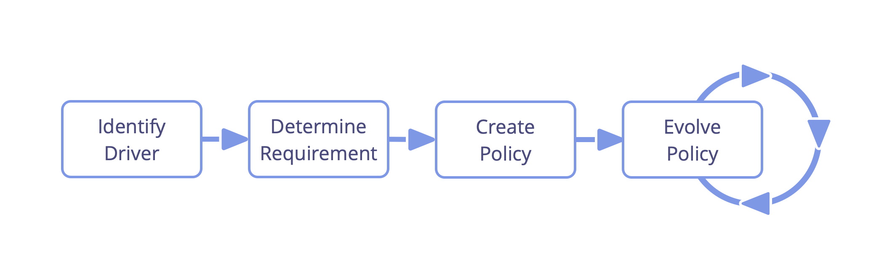
        

    

    <figcaption></figcaption>
</figure>

_A **policy** is an intervention that is created and evolved through governance; a process, procedure, protocol, plan, strategy, or guideline._

Typical examples of Policies include: 

-   Prioritization of work
-   Guidelines and procedures for how people work together 
-   Distribution of responsibilities and authority to influence by _designing domains_
-   Selecting people to take on responsibility for domains
-   Distribution of resources
-   Decisions about how to handle dependencies between teams
-   Development of organizational, team, or product <a href="glossary.html#entry-strategy" class="glossary-tooltip" data-toggle="tooltip" title="Strategy: A high-level approach for how people will fulfill the purpose of a domain (within the constraints of that domain).">strategies</a>, etc.
-   Consequential decisions about products, services, tools, technology, security, etc.

Each policy is created to fulfill a requirement and, by doing so, to address a driver adequately.

It's useful to _record policies_  to support their effective review and evolution. When describing policies, at the very least, include the following information:

-   Purpose (driver and requirement)
-   Intended Outcome(s)
-   Policy description (including rationale)
-   Who's responsible for what
-   Review date(s) Metrics and Monitoring

##### Creating Policies

Policies can be created by individuals or groups, depending on the context. Since creating policies is a governance activity often situated within a complex domain, involving relevant stakeholders in co-creation is valuable. 

Depending on the context, people might create policies:

-   in regular, dedicated _governance meetings_
-   on the fly during the workday, when useful or urgent
-   in a one-off meeting to deal with a specific topic
-   in other types of meetings, such as product meetings, _planning meetings_, or _retrospectives_, etc.

##### Iterative and Incremental Development of Policies

Developing policies iteratively and incrementally, based on continuous learning, enhances the organization's ability to remain effective, relevant, and responsive to unforeseen challenges and opportunities.

When aiming for 'perfect' policies, people often invest significant time and effort, and once established, the need to change them can trigger resistance. Instead, focus on designing *safe-to-fail experiments* that you regularly evaluate and evolve based on learning.

This _ongoing evolution of policies_ supports the organization's ability to adapt, reducing the risk of stagnation and enabling continuous improvement. To ensure this, schedule regular evaluations of policies and resolve any objections promptly when they arise.

#### Steps for Making and Evolving Policies

Whether or not you use S3 patterns to address matters of governance in your organization, there are a number of typical stages people who are successful in matters of governance follow to make and evolve effective policies:

-   **Confirm the Relevance** of the situation to ensure the effort is not wasted
-   **Determine Priority** to ensure drivers are addressed in order of their importance. 
-   **_Determine Requirement_** to decide on the scope and direction of the efforts
-   Determine intervention (in this case, a policy)
    -   **_Create a Proposal for a policy_** that describes what will be done, which constraints will be put in place, etc.
    -   **_Resolve any Objections_** that have been identified to ensure the policy is adequate for fulfilling the requirement and responding to the driver
-   **_Evaluate and Policy and Evolve it as necessary_** to ensure it remains fit for purpose.

You'll find that similar steps apply to both operations and governance. For more information, see _Respond to Organizational Drivers_

Check your current governance processes to see if all those steps are included, and in general, take a conscious and intentional approach to how you handle governance of your domain and the whole organization. 

<figure class="fig fig--limit-width fig--scale-small">
    

        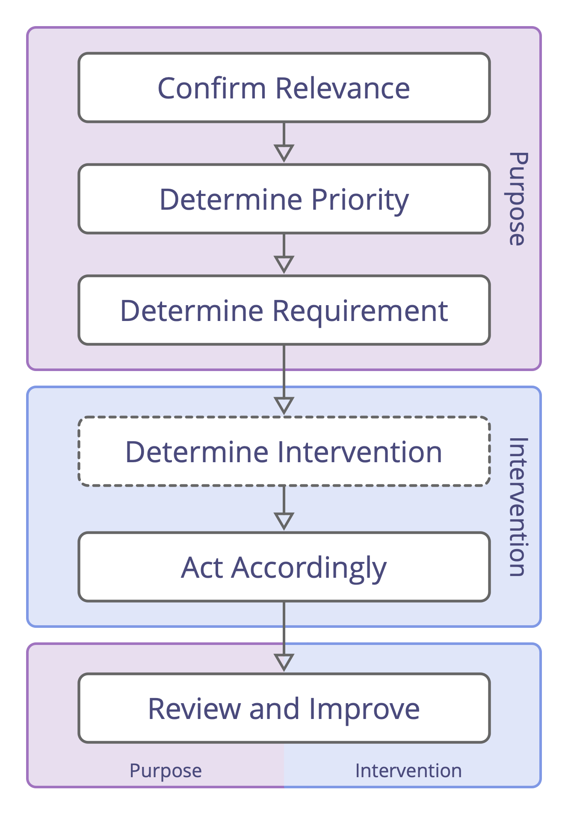
        

    

    <figcaption></figcaption>
</figure>

#### Distributing Governance Throughout the Organization

Every organization requires ongoing governance, both for the _whole system_, and each <a href="glossary.html#entry-domain" class="glossary-tooltip" data-toggle="tooltip" title="Domain: A distinct area of responsibility and authority within an organization.">domain</a> within it.

Due to their <a href="glossary.html#entry-complexity" class="glossary-tooltip" data-toggle="tooltip" title="Complexity: An environment where unknowns are unknown, cause and effect can only be understood in retrospect, and actions lead to unpredictable changes. [Snowden and Boone]">complex</a> nature, running organizations effectively requires distributing responsibilities, including responsibility for governance, in a way that enables everyone throughout the organization to work as productively as possible to deliver value related to the domains they are responsible for, while maintaining coherence and effectiveness across the organization.

Each domain within an organization needs to be designed and evolved in a way that those responsible can fulfill its purpose effectively, while ensuring coherence with the organization as a whole. That process includes clarifying who has responsibility and authority for making which governance decisions relating to the domain, who else should be involved, and to what extent. 

**Designing** a domain is itself an act of governance that precedes the existence of the domain and establishes who will be responsible for its governance. Once a domain exists, the delegator may play a more or less active role in its governance. However, they will always retain overall responsibility for **evolving** the design of the domain, even though they may involve others, especially the delegatees.

For an organization to be effective, domains need to be designed and evolved with consideration for the wider system of domains within which they are embedded. Furthermore, the entire system of domains needs to be continuously evolved to ensure its ongoing effectiveness in fulfilling the organization's overall purpose. In some contexts, delivery of value is best served by giving delegatees authority to handle aspects of governance relating to their domain autonomously. In other contexts, effective governance requires collaboration across multiple domains, either because it is necessary or beneficial.  To determine the right balance of autonomy and dependencies, organizations may need to periodically redesign the distribution of governance across multiple domains, or even across the whole organization.

##### Who governs a domain?

Each domain in an organization has a **governing body**: one or more people who are responsible for making governance decisions relating to the fulfillment of the purpose of that domain. Typically, the **governing body** consists of <a href="glossary.html#entry-delegator" class="glossary-tooltip" data-toggle="tooltip" title="Delegator: An individual or group delegating responsibility for a domain to other(s).">the delegator</a> (those who created the domain) and often the <a href="glossary.html#entry-delegatee" class="glossary-tooltip" data-toggle="tooltip" title="Delegatee: An individual or group accepting responsibility for a domain delegated to them, becoming a role keeper or a team.">delegatee(s)</a> who took on responsibility for attending to it. 

Depending on how a domain is designed, governance decisions may be made primarily by the delegator, by the delegatee(s), or shared between them. At times, representatives from other domains, outside experts, or other stakeholders may also be involved in the governing body, at least for working on certain topics. Some members of the governing body may be involved in all governance decisions relating to a domain, while others may only be brought in for certain topics or aspects.

In some cases, delegatees are not only responsible for governance decisions within the constraints of the domain, but may also be invited to collaborate with the delegator in developing or evolving the domain's design. Involving delegatees early in domain design and maintaining their involvement over time is often beneficial. The delegator, however, retains ultimate authority for defining the domain's purpose and its overall design. (see _Clarify and Develop Domains_)

The distribution of responsibilities related to governance should be documented so that everyone shares the same understanding. If it's unclear who is responsible for which decisions, those decisions risk not being made properly or being made inconsistently. "Who" may refer to a specific person, or to a function or role (e.g., a representative of a domain). This information can be captured in a _domain description_ (especially in the sections: Key Responsibilities, Deliverables, Dependencies, External Constraints, and Delegator Responsibilities).

When role keepers or teams have formal responsibility for making and evolving certain governance decisions, they are considered to be *self-governing* within their domain. By contrast, when they have no formal authority, they simply carry out operational work assigned by their delegator.

In all cases, people in organizations are *semi-autonomous*. Their freedom to decide and act is limited, not only by the boundaries of their domain, but also by constraints set by the wider organization and the external environment. In many cases, people may be required to pass on information about a situation requiring a decision to others with authority to make it, even if the situation and any decision that follows might affect them (see _Navigate via Tension_). In organizations that apply the _principle of consent_, autonomy is further constrained by any <a href="glossary.html#entry-objection" class="glossary-tooltip" data-toggle="tooltip" title="Objection: An argument – relating to a proposal, existing decision, or activity being conducted by one or more members of the organization – that reveals consequences or risks that are preferably avoided for the organization or that demonstrates worthwhile ways to improve.">objections</a> raised.

##### Considerations for Effectively Distributing Governance

To determine how much authority for governance to delegate to a role keeper or team, consider the following aspects: 

-   **Distribution of governance between delegator and delegatee(s)**: What can delegatees handle independently, which matters should the delegator retain responsibility for or participate in, and which require outside expertise?
-   **Addressing dependencies between domains**: For which decisions should people from outside the domain be involved because they are affected, or because collaboration on governance is worthwhile? 

**Example**: *A team responsible for the marketing domain has the authority to decide which partnerships and collaborations to pursue to extend market reach. The team manages its own budget, but must clear anything that costs more than 5.000 with the delegator. Any decisions regarding campaign schedules must be made in collaboration with the Product team.*

##### Distribution of Governance Between Delegators and Delegatees

Role keepers and teams often have responsibility for certain governance decisions, such as planning work and developing work processes. However, they may also take on responsibility for more consequential matters such as developing their own strategy, managing their own profit and loss, or even recruiting new team members.

When delegatees get more authority to decide how to address challenges and opportunities in their domain, they tend to take greater ownership over both decisions and outcomes. It also allows them to respond more quickly and with greater scope to create and innovate according to their own abilities and interests, as opposed to waiting on a decision-making hierarchy that can cause unnecessary delays and separate decision-making from the knowledge and experience of those closest to the work and its relevant context. 

Which governance matters to delegate depends on both the delegatees' level of competence and experience in the subject matter, as well as their level of experience with governance decision-making. Where certain domain expertise is lacking, a delegator might remain involved in making certain decisions or bring in others with relevant experience and expertise, until delegatees develop the capacity to make such decisions autonomously.

Making and evolving governance decisions requires a certain skillset, especially in cases where a collaborative approach is required. Understanding the governance process, as well as the various related practices, is essential for delegatees to effectively take on responsibility for governance. A delegator can also bring in a coach or facilitator to help the delegatees develop their capacity for governance decision-making, which will, over time, increase their capacity to effectively handle governance by themselves.

##### Addressing Dependencies Between Domains

Determining the right balance of autonomy and dependency for each domain requires ongoing evaluation of its design in light of how it contributes to delivering value within the overall system of domains. This balance is specific to each domain and needs to be regularly assessed and evolved — whether by removing _unnecessary or unhelpful dependencies_ to speed up decision-making, or addressing unavoidable (or helpful) dependencies by bringing in outside influence for certain governance decisions.

When distributing governance responsibilities, it's important to consider which dependencies you create or resolve. Involving others in decision-making saves time, energy, and resources, but it can also introduce cost, delay, or risk. If dependencies are avoidable, it's worth weighing the benefits against the drawbacks before involving others, or designing the domain so that delegatees have the authority to decide for themselves.

When distributing governance between domains, consider the operational dependencies between domains, the degree of significance of certain decisions, and who will be affected. As a general rule of thumb, governance decisions that impact other domains (e.g., due to dependencies) should be made with consideration for those other domains to ensure those decisions don't impede their effectiveness.

When individuals or teams lack the authority to make certain decisions for themselves, they should pass that information on to those who do.

If trade-offs involve more than two domains, resolving them requires considering the wider network of governance dependencies as well. Some domains form closely related subsystems that depend on ongoing collaboration, while others can operate with minimal interaction. The right balance of autonomy and dependency requires evaluating each domain's role in delivering value within the broader system.

Autonomy and coherence may appear contradictory, but in practice, they are complementary. Both need to be balanced and adjusted continually to maintain effectiveness across the organization. (See also: _Enable Autonomy_ and _Collaborate on Dependencies_).

### Complexity

Complexity in organizations arises from the dynamic relationships and interactions of people inside and outside the organization and the interdependencies between various internal subsystems (like teams and departments) and external factors, such as market conditions, regulatory changes, environmental changes, and technological advancements. The number of ever-evolving relationships and interactions makes it challenging to understand relationships of cause and effect until after events unfold, and it can also lead to rapid and unpredictable changes. 

In complexity, you can’t expect a change to a system to lead to a predictable outcome, nor can you expect a policy to be, or to remain suitable or sufficient over time. This is why any approach to governance must embrace complexity by treating all policies and decisions as provisional.

Taking an iterative and incremental approach that includes the regular evaluation and adaptation of policies to integrate learning, along with integrating insights gained from considering diverse perspectives, experience, and expertise, helps develop and maintain the effectiveness of policies and makes the complexity of governance more manageable. Such adaptability is crucial for resilience in complex systems, as it balances stability with responsiveness based on the discovery of new information or when new challenges or opportunities arise.

## The Patterns

S3 offers a pattern-based approach to organizational change.

_A **pattern** is a process, practice, or guideline that serves as a template for successfully responding to a specific kind of challenge or opportunity._

Patterns are modular and adaptable, can be used independently, and are mutually reinforcing, complementing one another when used in combination. S3 patterns can be evolved and adapted to address your specific needs.

In this guide, the patterns are grouped by topic into eleven categories to help you more easily identify those that are useful to you:

- [Sense-Making and Decision-Making](sense-making-and-decision-making.html)
- [Evolving Organizations](evolving-organizations.html)
- [Peer Development](peer-development.html)
- [Enablers of Co-Creation](enablers-of-co-creation.html)
- [Building Organizations](building-organizations.html)
- [Bringing in S3](bringing-in-s3.html)
- [Defining Agreements](defining-agreements.html)
- [Meeting Formats](meeting-formats.html)
- [Meeting Practices](meeting-practices.html)
- [Organizing Work](organizing-work.html)

### Sense-Making and Decision-Making

#### Respond to Organizational Drivers

Respond to all organizational drivers you are responsible for, in order of priority, by fulfilling the requirements you determine necessary in each case.

_An **organizational driver** is a situation where the organization's members have a motive to respond because they anticipate that doing so is beneficial or necessary for fulfilling the organization’s purpose. (by helping generate value, eliminate waste, or avoid undesirable risks or consequences)._

In the course of daily operations, every organization needs to deal with numerous existing and new drivers. Whenever a role keeper or a team becomes aware of a new driver they are responsible for addressing, taking a structured and considered approach supports staying focused on priorities, deciding and acting appropriately, and making the best use of resources, energy, and time. 

This pattern lays out a series of steps to follow that help you focus only on **relevant situations**, address them according to **priority**, consciously **determine what to do**, **act** intentionally, and **review**and iterate if necessary, to ensure each organizational driver is addressed adequately. 

While this approach sounds straightforward, acting in such a methodical and intentional way can be challenging. When faced with new situations, it's common to jump straight into action based on unverified assumptions about what's happening or required and act according to first impulse, habit, or according to how we dealt with things in the past. Such behaviors are more likely under pressure, but also occur simply because we misinterpret a situation, overlook the wider context, or fail to pause long enough to consciously consider what might actually be required. This can lead to various negative consequences for the organization, such as: 

-   **Responding to irrelevant or low-priority situations**: Time and energy are wasted on issues that don't matter or don't align with broader goals.
-   **Postponing or interrupting work on more important matters**: Focus is diverted from what actually needs attention, or too many issues are dealt with at once.
-   **Jumping to action without clarifying scope and direction**: Intervening without considering what is a meaningful and appropriate result.
-   **Designing ineffective or misaligned interventions**: Actions fail to address the actual requirement or conflict with other efforts.
-   **Overlooking opportunities to learn and adapt**: Interventions are left unreviewed and unchanged, even when they are ineffective, leaving the situation they were meant to address unresolved.

This pattern supports individuals and groups to **focus on what matters**, **consciously determine what's needed**, and **develop coherent, intentional interventions** suited to the situation, while still being flexible enough to react when new things come up that take priority. A structured, intentional approach helps ensure the best use of time and resources. 

These are the recommended steps to take to ensure that all situations that come to your attention in the course of your daily work are adequately addressed:

1. **Confirm that the situation is relevant** for the organization to address and that responding is your responsibility or that of your team.
2. **Determine its priority**: if it's not an immediate priority, ensure it is added to the appropriate place in the backlog before responding. When it's time to respond:
3. **Determine the requirement**.
4. **Determine intervention** (if necessary).
5. **Act accordingly**.
6. **Regularly review outcomes** and adapt your approach if necessary, based on what you learn.

Role keepers and teams will have to figure out how to integrate these steps into their daily work processes _to ensure they deliver value incrementally_.

Following these steps ensures that:

-   Action is grounded in a shared understanding of relevance and responsibility.
-   Responses are deliberate, clear, and adaptive.
-   Resources are used effectively to create value and avoid waste.
-   Learning is integrated as part of the process.

This process translates the **_concepts for purposeful action_** into practical steps to navigate everyday work, so you can act with greater coherence and impact. The first three steps relate to clarifying <a href="glossary.html#entry-purpose" class="glossary-tooltip" data-toggle="tooltip" title="Purpose: The reason why something is done, used, or created; a guiding motivation that directs actions, decisions, and resources toward achieving a valuable outcome.">purpose</a>, the next two to determining and implementing <a href="glossary.html#entry-intervention" class="glossary-tooltip" data-toggle="tooltip" title="Intervention: The specific steps you take and/or the constraints you put in place to fulfill a purpose.">interventions</a>, and the final step covers evaluation of both purpose and intervention. 

If you are not familiar with the concepts of purpose, driver, requirement, and intervention, it's recommended to pause here and check them out. 

<figure class="fig fig--limit-width fig--scale-small">
    

        
        

    

    <figcaption></figcaption>
</figure>

##### Step 1: Confirm Relevance

Before responding to a situation, it is essential to verify that it is relevant for *the organization* to respond to (i.e., it qualifies as an <a href="glossary.html#entry-organizational-driver" class="glossary-tooltip" data-toggle="tooltip" title="Organizational Driver: A situation where the organization&#x27;s members have a motive to respond because they anticipate that doing so is beneficial or necessary for fulfilling the organization’s purpose. (by helping generate value, eliminate waste, or avoid undesirable risks or consequences). Drivers are often expressed as _current conditions_ that lead to current or anticipated _effects_ that are _relevant_ to the organization.">organizational driver</a>) and that it is your responsibility to handle it.

To determine relevance for the organization, ask:

***Would responding to this situation help the organization generate value, eliminate waste, or avoid undesirable consequences?***

-   If the answer is **yes**, you've identified an **organizational driver** that requires attention.
-   If **not**, you can disregard it.
-   If **you are uncertain**, investigate further or ask for help.

If you personally perceive a situation that seems relevant, take whatever steps are necessary to confirm the fact for yourself. However, if someone else brings a situation to your attention, don't assume it's relevant just because they think so — verify it for yourself. 

Once you confirm the relevance of the driver, determine whether you or your team is responsible for addressing it or if it falls under someone else's responsibility.

-   **If it's outside your scope of responsibility, pass it on** to the appropriate person or team (see _Navigate via Tension_). 
-   **If you are unsure who is responsible, consult with others**, including the person who initially identified the situation.

**Note**: Sometimes, even though an organizational driver is not your explicit responsibility, you might still be best placed to deal with it, given the circumstances. In this case, ensure that your action will be beneficial and cause no impediments, exposure to risks, or harm.

To keep track of new situations that might qualify as organizational drivers, set up a dedicated space for storing information about them. For instance, for each [domain](glosssary:domain), create **a dedicated column on a Kanban board** labeled "**inbox**" or "**incoming**," where information can be stored until relevance is confirmed.

##### Step 2: Determine Priority

Once you've established that an organizational driver is relevant for you to respond to, the next step is to identify its priority relative to other matters you already need to deal with. Place it in the appropriate backlog and position it according to its priority, so that it can be managed and addressed effectively.

Even if responding to a situation is relevant and within your area of responsibility, it may not be an immediate priority. Other organizational drivers may need to be addressed first.

To maintain focus and work effectively, attend to high-priority drivers before lower-priority tasks to ensure that organizational energy is directed toward what matters most, rather than merely reacting to each new situation as it comes up. 

Remember to review priorities frequently to account for changing circumstances and requirements.

##### Step 3: Determine the Requirement

After establishing that a situation is both relevant to respond to and a priority, it's helpful to _determine the requirement_ before deciding on the specifics of an intervention (in the next step).

_A **requirement** is a state considered valuable to establish or maintain in order to address a specific driver._

In some cases, you may be familiar with this kind of driver and how to deal with it, or you have an idea in mind. There may even be an existing policy that clarifies a suitable requirement. In such cases, proceed to the next step and decide how to fulfill the requirement. Or, if you also know how to fulfill that requirement, go to Step 5 (*Act Accordingly*) instead.

However, for new drivers where the requirement is unclear, for example, when there's no policy in place that offers guidance, the situation is complicated or complex, or there are many possible options, you will need to determine a suitable requirement:

-   **The intended outcome(s)** you'd like to achieve to address the driver. 
-   **The condition(s)** you think should be established to achieve those outcomes.

See _Determine Requirements_ for more information and examples.

**Note**: In complex situations, you may not be able to identify a requirement that fully addresses the driver. In such cases, determine one or more requirements whose fulfillment would represent suitable next steps.

##### Step 4: Determine the Intervention

Once the requirement is clear, a suitable intervention can be determined to fulfill the requirement. However, if it's already obvious how to fulfill the requirement, or if an existing policy clarifies what to do, you can proceed to the next step (*Act Accordingly*).

_An intervention is the specific steps you take and/or the constraints you put in place to fulfill a purpose._

Examples of interventions:

-   Activities (operations) 
-   (Re)Prioritizing daily work (operations) 
-   Creating or adjusting policies (governance) 

For situations where co-creating an intervention with others is valuable or necessary, consider using one or more of the S3 patterns for decision-making, such as:

-   _Proposal Forming_ — for co-creating solutions based on collective input.
-   _Consent Decision Making_ — for surfacing and addressing objections before moving forward.

If there is uncertainty about how to proceed — especially in novel, high-stakes, or complex situations — consider taking an iterative and incremental approach. Taking things one step at a time supports continuous learning about whether your assumptions about the situation and its relevance, and the requirements and interventions you determine, are actually suitable. This way, you can update your understanding promptly, recognizing as soon as possible what's working, what needs changing, or deciding next, and when to pivot or persevere.

When planning an intervention, consider defining one or more metrics to help you track progress and assess effectiveness over time. Metrics act as early signals that indicate whether you're on track or if you need to adjust your approach. See _Define and Monitor Metrics_ for support in identifying clear and meaningful metrics.

Record enough detail about the intervention, including any relevant rationale, to support both the implementation and evaluation.

##### Step 5: Act Accordingly

Once the intervention is clear, it's time to implement it: act according to what you have determined in the previous step.

Take care to follow through on what you agreed to, and stay alert to new information that might reveal the need to make adjustments.

For any significant interventions, consider recording what you actually do, along with the actual outcomes, including those you didn't expect. This information will be valuable for reviewing and, if necessary, improving the intervention later.

##### Step 6: Review and Improve

Finally, regularly review the outcomes of your actions to assess what's working and use any insights to identify opportunities for improvement, both regarding the decisions you made and how you execute them.

Reviewing **operational tasks** involves assessing the actual outcomes and checking if the driver has been adequately addressed, considering the requirement and any defined **acceptance criteria**. Before scheduling any rework, first check if the purpose is still relevant.

The process for **evaluating policies** typically benefits from a more structured and detailed approach. For guidance, see _Evaluate and Evolve Policies_.

<figure class="fig fig--limit-both fig--scale-normal">
    

        
        

    

    <figcaption></figcaption>
</figure>

#### Navigate via Tension

Pay attention to the inner tension you experience in relation to the organization, investigate its cause, and if it reveals a situation that seems relevant for the organization to address, deal with it yourself or pass the information on to the person or group responsible for addressing it.

Tension often signals challenges and opportunities. When people reflect on the reasons behind their tension, they can uncover potential organizational drivers — situations worth responding to in order to generate value, eliminate waste, or avoid undesirable consequences.

##### Step 1: Notice Tension

In this context, _tension_ is an inner state of alert: a personal experience that's triggered when there's some kind of dissonance between an individual's perception of a situation and what they expect or would prefer to see.

##### Step 2: Understand the Situation

Investigate **the situation** you are perceiving that stimulates tension in you. Sometimes this inquiry can reveal misconceptions, and the tension goes away.

##### Step 3: Is this an Organizational Driver?

A simple way to determine whether a situation is relevant for the organization to address is by asking the question: 

_Would responding to this situation help the organization generate value, eliminate waste or avoid undesirable consequences?_

-   If you think the answer is **yes**, you've likely identified an organizational driver that needs a response.
-   If you think the answer is **no**, you can ignore the situation and focus on relevant things instead. 
-   If you are **unclear**, investigate further, which might include reaching out to others who could have a clearer idea.

##### Step 4: Is it in my/our domain? If not, pass it on

It could be that the driver falls within the scope of a domain you're responsible for, in which case you'll want to place it in your list of priorities and respond to it accordingly (see _Respond to Organizational Drivers_). Even if it falls outside of your area of responsibility, it might still be something that you are best placed to deal with, or that you can at least address without causing impediments or harm. Weigh the effort of finding someone else and explaining it to them against just taking care of it yourself. them against just taking care of it yourself. 

On other occasions, however, you'll come across drivers that are the responsibility of others to address. Therefore, to navigate via tension effectively, there needs to be enough clarity around who is responsible for what in the organization so that people know, or can find out, who to inform about new organizational drivers they discover, so they can pass that information on to them.

<figure class="fig fig--limit-both fig--scale-normal">
    

        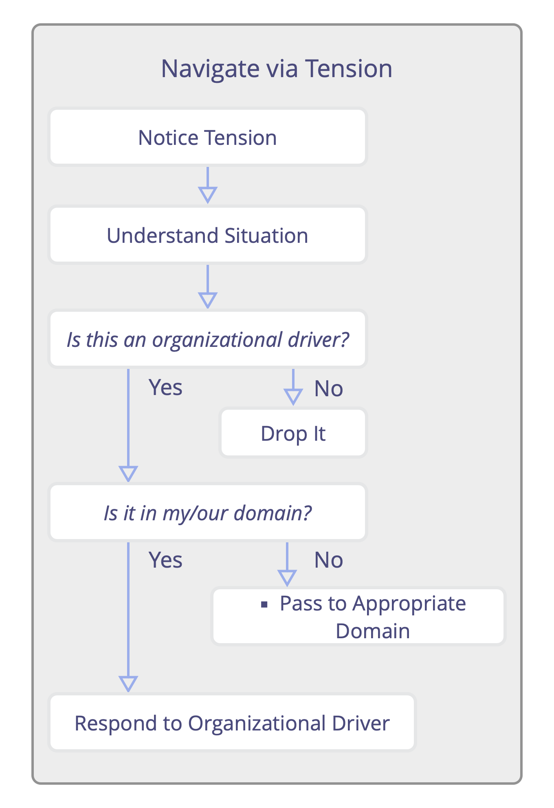
        

    

    <figcaption>Navigate via Tension</figcaption>
</figure>

<figure class="fig fig--limit-width fig--scale-full">
    

        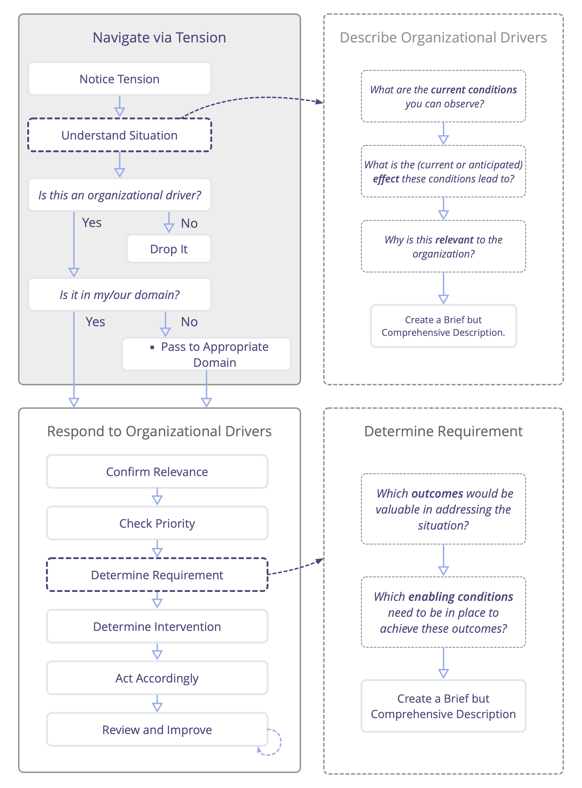
        

    

    <figcaption>Navigate via Tension in the context of Describe Organizational Drivers, Respond To Organizational Drivers and Determine Requirement</figcaption>
</figure>

#### Describe Organizational Drivers

Describe organizational drivers to support understanding and communication about situations that are relevant for the organization to respond to, and for recalling why particular activities are undertaken and why specific decisions are made.

_An **organizational driver** is a situation where the organization's members have a motive to respond because they anticipate that doing so is beneficial or necessary for fulfilling the organization’s purpose. (by helping generate value, eliminate waste, or avoid undesirable risks or consequences)._

Organizational drivers are identified by individuals (see _Navigate via Tension_) who either respond to them directly (when a driver falls within their own domain of responsibility) or who pass on information about drivers they discover to others in the organization (whom they believe are responsible for dealing with them). 

A simple way to describe an organizational driver is by explaining:

-   the **current conditions** that are being observed, 
-   the (current or anticipated) **effect** this situation leads to.
-   And, if it's not already obvious from the previous two points, why it's **relevant** for the organization to address this situation.

Describing these three aspects will typically provide enough information to communicate an organizational driver clearly.

###### Problem-Focused or Opportunity-Focused

In most cases, organizational drivers can be framed as either a problem to solve or as an opportunity to pursue. Sometimes it helps to deliberately choose (or agree on) which perspective to take, to help people gain a more optimistic or realistic outlook on a situation. 

Here is an example of a driver framed as a **problem**: 

(current conditions) *Information is unstructured, kept in silos, and sometimes unrecorded*, (effect) *leading to people working with missing or outdated information*, (relevance) *which results in ineffectiveness and our clients' needs being unmet.*

The same driver framed as an **opportunity**: 

(current conditions) *Useful information that can help us build a better understanding of our clients' needs is distributed throughout the organization*, (anticipated effect) *and figuring out how to record and share it could help us improve our services.*

##### Why Describe Organizational Drivers?

In the course of their daily work in organizations, individuals frequently encounter situations that require attention. They make decisions alone or with others, based on what they believe is required, and then act accordingly. However, sometimes decisions are taken without fully understanding the situation they were intended to deal with, which leads to decisions based more on judgments and assumptions rather than concrete observations. Additionally, failing to communicate relevant information to other stakeholders can lead to misunderstanding, conflict, and waste.

Clearly understanding organizational drivers and documenting essential information about them before deciding on a response is crucial for ensuring that the rationale behind decisions is understood. It also provides an opportunity for those who are collaborating to verify their assumptions, combine diverse viewpoints, align understanding, and consequently agree on a description of a driver. 

Both individuals and groups can describe organizational drivers. A summary can be added to a _backlog_, or used as a straightforward method to communicate pertinent details about a relevant situation to others within the organization who have responsibility for dealing with such things. Subsequently, these drivers can be _prioritized_ in relation to other drivers that are pending a response, and then, when the time comes, they can be dealt with accordingly. Further details on how to respond to organizational drivers can be found in the pattern _Respond to Organizational Drivers_.

##### How to Describe Organizational Drivers

Aim to create **a comprehensive but brief summary in two or three sentences**, so that the information is easy to remember and process. If necessary, more details about the driver may be recorded below the summary and/or kept in a _logbook_. 

<figure class="fig fig--limit-both fig--scale-normal">
    

        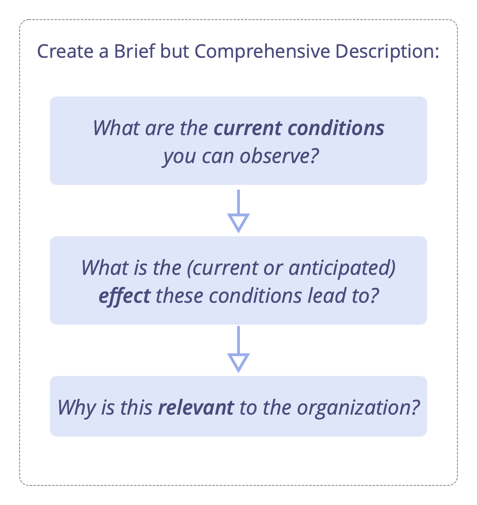
        

    

    <figcaption>Describe Organizational Drivers</figcaption>
</figure>

Here's an example that breaks down the description of an  organizational driver into current conditions, effect, and relevance:

*To resolve local issues, teams currently have autonomy to develop their work and decision-making processes in the way they see fit. This often leads to incoherence in how work and decision-making are handled between teams, which impedes effective collaboration on handling dependencies between and across domains.*

###### 1. Current Conditions

"*To resolve local issues, teams currently have autonomy to develop their work and decision-making processes in the way they see fit.*"

-   Describe the conditions you observe, rather than describing assumptions about what might be missing or lacking. For example, avoid phrases like "*teams don't focus enough on resolving common issues*" or "*we are lacking coherence between teams*". This way of framing a situation obscures what is actually happening.
-   Be **concise** and describe the essentials of what is happening, and, if necessary, the context in which it occurs. 
-   Be **specific** and avoid vague and ambiguous statements (e.g. use "*to resolve local issues*" instead of "*to resolve some issues*". 
-   Be **objective** and describe verifiable facts and observations. 
-   Avoid evaluative language (e.g. use "*teams have autonomy*" instead of "*teams have too much autonomy*").

###### 2. (Current or Anticipated) Effect

"*This often leads to incoherence in how work and decision-making are handled between teams, …*"

-   Explain the consequences that you observe or that you expect could result from the current conditions.
-   Be as objective and specific as possible.
-   Be explicit about whether the effect(s) are occurring already or if they are anticipated.
-   If it's not obvious, explain how you think the effect is a consequence of the current conditions.

###### 3. Relevance for the Organization

"…*which impedes effective collaboration on handling dependencies between and across domains.*"

The relevance of addressing a situation is determined by whether doing so is necessary or beneficial in the context of an existing (often superordinate) organizational purpose — specifically, whether responding will generate value, eliminate waste, or avoid undesirable risks or consequences. 

State the benefit of responding and/or the cost of not responding: how will action help fulfill an organizational purpose, or how would inaction expose the organization to risk, loss of value, or waste?

**Note**: Sometimes the relevance of addressing the situation for the organization is already obvious and clear, in which case there is no need to add any further information. 

##### Tips for Describing Organizational Drivers

When you encounter a situation you believe is an organizational driver, sometimes the current condition(s) are most salient, while at other times it's the effect. When communicating about potential organizational drivers with others, describing either the current condition(s) or effect can be enough for colleagues who share context to understand the situation and its relevance. 

However, there will be times, especially when communicating about unfamiliar circumstances, or with people who are not directly involved, or when a collaborative decision is required, where being explicit about all three elements — current condition(s), (anticipated) effect(s), and relevance — will be necessary or valuable. 

**Examples**

-   *There's a fire in the office.*  — Stating the current condition is sufficient to imply the anticipated effects and the relevance of acting. 
-   *Several team members are close to burnout.*  —  While this description indicates that the situation is worthwhile addressing, more context is needed to determine a suitable requirement. Explaining the current conditions that are at least in part causing this effect enables a better understanding of the situation, its relevance, and which conditions may need to change.
-   *The weekly team meeting frequently overruns by ~30 minutes.* — As a standalone condition, this is insufficient to establish the relevance. By clarifying how the overrun affects other work in the organization (effect), the relevance of addressing it becomes clear.

##### More Examples

Effect is already occurring:

-   (current conditions) *Information is unstructured, kept in silos, and sometimes unrecorded*, (current effect) *leading to people's inability to support each other, understand, and contribute to the bigger picture*, (relevance) *which impedes our ability to effectively do our work.*
-   (current condition) *We spend 25% of our work hours on admin work* (current effect) *and this is leading to slow response time for customer requests and a growing number of complaints.* (relevance) *We're starting to develop a bad reputation and run the risk of losing customers and compromising future sales.*

Effect is anticipated:

-   (current conditions) *We're preparing to recruit five new members into the development teams*, (anticipated effect) *and a lack of relevant training could lead to inefficiencies and errors*, (relevance) *and an overall decrease in team productivity and quality of work.*

The effect is already occurring, and relevance is implicit:

-   (current conditions) *The teams often work on items that have not been prioritized in accordance with the product roadmap.* (effect) *This slows down the delivery of features that have been assigned a high priority by the customer and is leading to complaints about the effectiveness of our work.*
-   (current conditions) *Although the financial records of the organization are available to anyone who asks, most people in the organization lack adequate financial understanding to make sense of them in the current format.* (effect) *This leads to frustration, uncertainty, and questions that are hard to answer about why certain decisions are being made.*

#### Determine Requirements

Determine what's required to respond appropriately to an organizational driver before deciding on an intervention.

Determining a <a href="glossary.html#entry-requirement" class="glossary-tooltip" data-toggle="tooltip" title="Requirement: A state considered valuable to establish or maintain in order to address a specific driver. Requirements are often expressed as _intended outcome(s)_, and _enabling condition(s)_ considered necessary to establish for achieving or maintaining those outcomes.">requirement</a> before deciding on the specific steps to be taken helps define a **general direction** and **scope** for an intervention, while still allowing for a range of options on how to fulfill the requirement to respond to the driver in an effective way.

As we mentioned in the section _A Model for Purposeful Action_ one way to understand work in organizations is as *people making interventions to fulfill a purpose.*

Purpose informs, motivates, and guides action. Interventions are specific steps people take, and/or the constraints they put in place, to fulfill a purpose.

To help people make sense of and clarify purpose, we use the concepts of *organizational drivers* and *requirements*.

-   An **organizational driver** is any *situation* that is relevant for the organization to address.
-   A **requirement** is a *future state* considered valuable to establish or maintain in order to address a specific driver. 
-   The intervention can be understood as fulfilling the requirement that has been identified as suitable to address the driver. 

In short, the driver explains the situation that makes the intervention relevant. The requirement serves both as an indication of the **direction** to go and as a clarification of the **scope** and **boundaries** of the intervention. 

Usually, the people responsible for addressing a driver are also responsible for determining the corresponding requirement. In more complex situations, it can be helpful to involve people with diverse perspectives when determining the requirement, because they can surface blind spots, challenge assumptions, and improve shared understanding — leading to a clearer, more realistic, and more widely supported requirement.

##### Why Determine Requirements?

When people notice a problem or opportunity, there's a natural tendency to jump straight to an intervention ("let's do X"). That speed can be valuable, but it can also lead to avoidable problems: people might act on habits that are unsuitable for the current context, or they might overlook constraints and side effects, or end up in polarized conversations about what to do before they even agree on which direction to take. 

Determining a requirement, before deciding on specific steps to take or constraints to put in place, **defines a general direction and scope**, while still allowing for a range of options on how to fulfill the requirement.

**When two or more people share responsibility for deciding** how to address an organizational driver, differing opinions about specific solutions can lead to contention. When stakeholders are on the same page about the requirement, agreeing on an intervention becomes much easier: proposals can be compared against a shared "target condition," rather than against competing opinions. 

**Even if you are the sole person responsible** for responding to an organizational driver, it's useful to clarify the requirement for yourself before deciding how to proceed. Deciding on a course of action is often more straightforward when the general direction and scope for such action are determined first.

##### When to Determine a Requirement?

Determine a requirement **after** confirming that the situation you wish to address qualifies as an organizational driver, and that it's your or your team's responsibility to deal with it.

Avoid determining requirements for situations you don't plan to tackle soon, because context and relevance can change, and your efforts might go to waste.

**Before** investing time in determining a suitable requirement, consider whether there is already a policy in place that covers this kind of thing. Also, check if you already have a policy in place that you can adapt or extend to address this situation.

Even in the case that a suitable requirement is obvious (to you), it's still often worthwhile to make it explicit by recording it for future reference.

##### How to Describe a Requirement?

An <a href="glossary.html#entry-organizational-driver" class="glossary-tooltip" data-toggle="tooltip" title="Organizational Driver: A situation where the organization&#x27;s members have a motive to respond because they anticipate that doing so is beneficial or necessary for fulfilling the organization’s purpose. (by helping generate value, eliminate waste, or avoid undesirable risks or consequences). Drivers are often expressed as _current conditions_ that lead to current or anticipated _effects_ that are _relevant_ to the organization.">organizational driver</a> is a **present situation** that the organization would benefit from addressing. A requirement linked to a driver is a desired **future state**, in which the present situation is adequately addressed. The requirement defines direction and scope for a suitable intervention. 

A simple way to describe a requirement is by explaining:

-   **Intended outcome(s)**: Specific, observable results you aim to achieve in relation to a driver.
-   **Enabling condition(s)**: Circumstances considered necessary to establish or maintain for achieving or sustaining the intended outcomes.

How much detail is necessary to communicate a requirement depends on context. For simple requirements, it is sufficient to explain them as a single sentence: 

*\<stakeholder\> needs \<enabling conditions\> so that \<intended outcomes\>.*

**Examples**

1. (stakeholder) *Employees need* (enabling conditions) *to gain confidence and competence in applying the new procedure so that* (intended outcome) *they can carry out their responsibilities independently without needing frequent guidance or correction.*
2. (stakeholder) *We* (enabling conditions) *need to ensure that team members' concerns about how we work are heard and addressed* (intended outcomes), *so that we can address issues early and prevent bigger problems down the line.*
3. (stakeholder) *We* (enabling conditions) *need to understand recurring themes and patterns in customer feedback* (intended outcome) *to prioritize necessary and worthwhile improvements.*

People familiar with Scrum or other agile methodologies will recognize that the format above is similar to that used for **user stories**. We use it deliberately: the concept of a 'requirement' builds on the idea of user stories, and extends it beyond product development to apply to any kind of purposeful intervention, in organizations and beyond. (see _Requirements and User Stories_

Often, the stakeholder is implicit, and sometimes it's only necessary to describe the intended outcomes, or only the enabling conditions, because the other is obvious or implicit. 

**Examples** (variations on one requirement): 

1. (enabling conditions) *Gain confidence and competence in applying the new procedure* (intended outcome) *so that everyone can carry out their responsibilities independently without needing frequent guidance or correction.*
2. (stakeholder) *Everyone* (intended outcome) *needs to be able to carry out their responsibilities independently without needing frequent guidance or correction.*
3. (stakeholder) *Employees* (enabling conditions) *need to gain confidence and competence in applying the new procedure.*

##### How to Determine a Requirement?

<figure class="fig fig--limit-height fig--scale-small">
    

        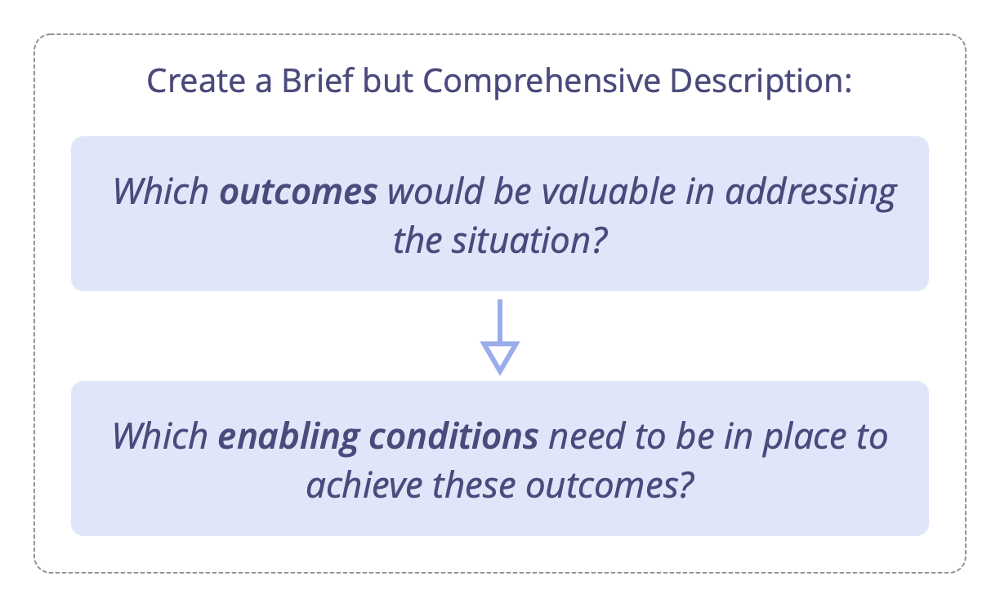
        

    

    <figcaption>Determine the requirement</figcaption>
</figure>

A requirement is always determined in relation to a <a href="glossary.html#entry-organizational-driver" class="glossary-tooltip" data-toggle="tooltip" title="Organizational Driver: A situation where the organization&#x27;s members have a motive to respond because they anticipate that doing so is beneficial or necessary for fulfilling the organization’s purpose. (by helping generate value, eliminate waste, or avoid undesirable risks or consequences). Drivers are often expressed as _current conditions_ that lead to current or anticipated _effects_ that are _relevant_ to the organization.">driver</a>, so before doing so, make sure the driver is understood. Write down a _description of the driver_ to keep it in mind.

If the requirement is obvious, name it and go on. There is no need to overthink something if it is known or clear.

Otherwise, start by identifying **outcome(s)** that are valuable in relation to the driver, and then identify **the immediate condition(s)** that must be true to realize those outcomes.

-   Which **outcomes** would be valuable in addressing the situation? 
-   Which **enabling conditions** need to be in place to achieve these outcomes? 

When determining requirements, it's important to ensure that existing external or standard constraints are considered. Many of these will be considered implicitly during the process, because people already have them in mind, and they naturally shape what they judge to be an appropriate requirement. 

After defining a combination of outcome(s) and enabling condition(s), check if the resulting requirement is suitable, effective, and feasible:

-   **Suitability**: Will the outcome address the driver?
-   **Effectiveness**: Are the enabling conditions likely to produce the outcome?
-   **Feasibility**: Can the conditions realistically be established?

Refine the outcomes and enabling conditions (using objections if seeking others' opinion) until the requirement is good enough.

If even after some deliberation, the full requirement is still not apparent, identify a requirement for the next incremental step. Once that step has been implemented, return to defining the complete requirement.

**Note**: If you discover *later* that a requirement turns out to be unsuitable, ineffective, or unfeasible, refine it as needed or start from scratch and determine a new requirement.

###### Requirements in Complexity

When dealing with a <a href="glossary.html#entry-complexity" class="glossary-tooltip" data-toggle="tooltip" title="Complexity: An environment where unknowns are unknown, cause and effect can only be understood in retrospect, and actions lead to unpredictable changes. [Snowden and Boone]">complex</a> situation, the relationship between cause and effect is unclear, and there might be many unknown unknowns.

Further investigation of the situation or experimentation to test assumptions may be the first requirement, and fulfilling that will lead to the emergence of more specific requirements. This process of iteratively defining requirements and then fulfilling them continues until the situation is adequately addressed. 

In complexity, it's also useful to determine requirements collaboratively, to benefit from the diversity of perspectives and experiences of relevant stakeholders or others with expertise. 

###### Balancing Specificity and Scope

When determining a requirement, make a conscious decision about how specific or broad it should be. Each requirement inherently suggests a direction for the intervention that addresses the organizational driver; a more specific one narrows the range of options, while a less specific requirement broadens the possibilities. The desirability of a wider or narrower scope of options varies depending on the situation. 

Contradictory suggestions about what is required often indicate that the discussion could have become overly specific. In that case, zooming out to a higher level that encompasses these suggestions can open the way for a broader range of options for designing an intervention.

##### Clarifying Requirements Through Acceptance Criteria

While a requirement can often be described sufficiently with a single sentence, there is sometimes merit in defining it further. This is especially the case when it would otherwise be difficult later to determine whether that requirement has been adequately fulfilled, because the future state needs to be described in more detail, or the enabling conditions that bring it about, or the relationship between those conditions and the intended outcomes, needs more explanation.

This is typically achieved through **acceptance criteria**: *a set of specific, verifiable properties of the conditions and/or outcomes of a requirement that, when taken together, indicate the requirement is fulfilled.*

Acceptance criteria **reduce ambiguity** by breaking a requirement down into concrete, verifiable aspects. In doing so, they can make the requirement more specific and actionable when doing so is helpful.

They inform the intervention by ruling out those that cannot plausibly satisfy the criteria, and by focusing attention on actions capable of producing the required effects.

It's especially useful to define acceptance criteria in complicated or complex situations, or when a product or solution needs to be handed over to a customer (within the organization or beyond), because the customer can use them to verify fulfillment *without* needing to understand the intervention's technical details.

When defining acceptance criteria, consider the following question: 

-   *What **specific, observable indicators** would show that the intended outcomes have been adequately achieved?*
-   *What **verifiable properties** must the enabling conditions have to bring about the intended outcomes?*

Sometimes, answering one question or the other is enough to clarify the requirement in a given context. 

Once some criteria have been identified, check: *Are these criteria taken together sufficient to determine whether the requirement has been fulfilled?*

**Example**: *Department Relocation*

-   **Requirement**: *We need to organize the relocation so that daily operations continue smoothly.* 
-   **Acceptance Criteria**:
    -   *What **specific, observable indicators** would show that daily operations continued smoothly during the relocation?*
        -   systems and access remain available
        -   critical operations meet minimum service levels
        -   problems that come up are resolved promptly
    -   *What **verifiable properties** must "organize the relocation" have to bring about the intended outcome?*
        -   Critical operations are identified and protected 
        -   The relocation schedule is aligned with operational needs and communicated with enough time to plan for the relocation
        -   We know what to do when we hit an unforeseen problem
        -    Testing proves continuity measures work

In this example, the requirement remains a single, coherent statement of what is needed. The acceptance criteria specify how people will verify that the requirement has been fulfilled in practice.

Not all acceptance criteria need to be made explicit for every requirement. Some standard or  "non-functional" criteria may apply across many different requirements, for example:

-   product standards
-   security or privacy policies
-   accessibility standards
-   legal or regulatory constraints

Instead of repeating such criteria with each requirement, it is simpler to maintain them as shared standards or policies and reference them where relevant.

When describing acceptance criteria, ensure they are verifiable, relevant, and complete:

-   **Verifiable**: clear pass/fail or measurable thresholds.
-   **Relevant**: it contributes to the requirement's value in relation to the driver
-   **Complete**: together they cover the full intent of the requirement.

**Note:** From the perspective of the requirement that is being clarified through acceptance criteria, these acceptance criteria point toward sub-requirements the intervention must fulfill, related to adequately fulfilling the main requirement, typically relating to the enablingg conditions or intended outcomes of that requirement. Acceptance criteria are typically defined as intended outcomes only.

##### Keep a Record

Record a description of the requirement (for example, in your _logbook_), and unless it's obvious, the driver it responds to, along with any acceptance criteria, any context that's useful to know about, and the key reasons the requirement was chosen. This makes it easier to communicate the requirement and its relevance to others, especially those affected by the intervention and those responsible for carrying it out. It also provides a clear reference point later, when you review the intervention and decide what to improve.

#### Consent Decision-Making

A (facilitated) group process for decision-making: invite objections, and consider information and knowledge revealed to further evolve proposals or policies.

##### Overview

Consent invites people to (at least) be reasonable and open to opportunities for learning and improvement. When you apply the _principle of consent_, you are agreeing to intentionally seek out _objections_.

_An **objection** is an argument – relating to a proposal, existing decision, or activity being conducted by one or more members of the organization – that reveals consequences or risks that are preferably avoided for the organization or that demonstrates worthwhile ways to improve._

Proposals are accepted when they are considered good enough for now and safe enough to try until the next review. Objections prevent proposals from becoming become <a href="glossary.html#entry-policy" class="glossary-tooltip" data-toggle="tooltip" title="Policy: An intervention that is created and evolved through governance; a process, procedure, protocol, plan, strategy, or guideline.">policy</a>, but concerns do not.

Withholding objections can harm the ability of individuals, teams, or the whole organization to achieve their objectives.

Not all arguments raised are objections, but they might reveal concerns:

_A **concern** is an assumption that cannot (for now at least) be backed up by reasoning or enough evidence to qualify as an objection to those who are considering it._

The most common use case for Consent Decision-Making is when groups need to decide on a policy or other significant decisions, and that is how it is laid out below. However, this process can be used anytime two or more people are working together to make a decision.

If you are new to using Consent Decision-Making, we recommend you strictly follow the process until you become familiar with the rationale behind the steps. As you gain experience, you might skip steps or hop between them, but doing so in the beginning can lead to confusion and even chaos. For example, if there is a general expression of concern voiced during the Brief Response round, it might appear to make sense to evolve the proposal on the spot to include points that people inferred. For any suggestion that involves changing the process, always check if there are any objections to doing so first. 

<figure class="fig fig--limit-both fig--scale-normal">
    

        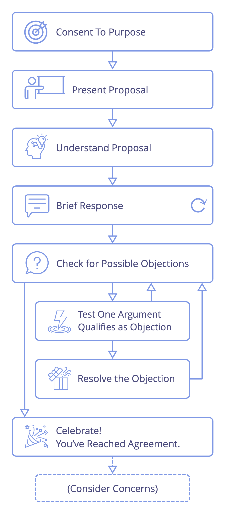
        

    

    <figcaption>Consent Decision-Making</figcaption>
</figure>

##### Step 1: Consent to Purpose

_Ensure the <a href="glossary.html#entry-purpose" class="glossary-tooltip" data-toggle="tooltip" title="Purpose: The reason why something is done, used, or created; a guiding motivation that directs actions, decisions, and resources toward achieving a valuable outcome.">purpose</a> of the proposal is clear and relevant for the organization (the <a href="glossary.html#entry-driver" class="glossary-tooltip" data-toggle="tooltip" title="Driver: A person&#x27;s or a group&#x27;s motive for responding to a specific situation.">driver</a> and <a href="glossary.html#entry-requirement" class="glossary-tooltip" data-toggle="tooltip" title="Requirement: A state considered valuable to establish or maintain in order to address a specific driver. Requirements are often expressed as _intended outcome(s)_, and _enabling condition(s)_ considered necessary to establish for achieving or maintaining those outcomes.">requirement</a> are summarized clearly enough), and it is your responsibility to deal with this._

**Facilitator asks:** _Is the description of the situation and requirement clear enough? Is this situation an organizational driver? Is this driver relevant for you to respond to? And, is this requirement suitable?_

**Note:** As a general recommendation, aim to complete this step with meeting attendees asynchronously, _before the meeting_. This will give you the opportunity to make any refinements in advance and save precious meeting time. However, in a case where someone is presenting a proposal to a group of stakeholders who were not involved in creating it, or if there are people who are only now joining the decision-making process, check everyone understands the driver and requirement for the proposal, and ensure they are described clearly enough, the requirement is considered to be suitable, and it’s relevant for those present to deal with this, before considering the proposal itself.

-   If the driver is not described clearly enough, take time to clarify and make any necessary changes to how the driver is summarized until there are no further objections. Unless this will be a quick fix, consider doing this after the meeting and defer considering the proposal, until the driver is clear.
-   If the driver is not relevant for this group, pass it on to the appropriate person or team, or, if it’s decided that this is not an organizational driver at all, discard it.
-   If the requirement is considered to be unsuitable, hear the argument(s), and if they qualify as objections, resolve them before considering the proposal.

##### Step 2: Present the Proposal

_Share the proposal with everyone._

**Facilitator asks the author(s) of the proposal:** _Would you please present the proposal to everyone?_

The author(s) of the proposal (when using _Proposal Forming_, the<a href="glossary.html#entry-tuners" class="glossary-tooltip" data-toggle="tooltip" title="Tuners: One or more people who use the information and ideas collected in Proposal Forming to design a coherent proposal (not a final decision).">tuners</a>) present it to the group, including details about who is responsible for what, a suggested review date or frequency, and any identified evaluation criteria. 

**Preparation:** Send out the proposal in advance of the meeting (whenever possible) so that people can familiarize themselves with the content, ask any clarifying questions, or even share improvement suggestions before the meeting. This saves taking up precious face-to-face meeting time for things that can be done outside of the meeting.

Proposals are typically created by an individual or a group beforehand, but are sometimes suggested _on the fly_. 

If you’re the one presenting a proposal, write it down, share it with the others beforehand if possible, and aim to keep your explanation concise and clear. Describe it in a way that maximizes the potential that others will understand what you are proposing, without requiring further explanation.

**Note:** Involving stakeholders in the creation of a proposal can increase engagement and accountability for whatever is decided because people are more likely to take ownership of a policy that they participate in creating. On the other hand, participatory or collaborative decision-making requires people’s time and effort, so use it only when the gains are worthwhile.

##### Step 3: Understand the Proposal

_Make sure everyone understands the proposal._

**Facilitator asks:** _Are there any questions to understand this proposal as it’s written here?_

This is _not_ a moment to get into a dialogue about _why_ a proposal has been put together in a certain way, but simply to check that everyone understands _what_ is being proposed. Avoid “_why_” questions and focus instead on “_what do you mean by …_” questions. 

Clarifying questions sometimes reveal helpful ways to change the proposal text to make it clearer. You can use this time to make edits to the proposal if it supports people’s understanding, but be wary of changing what is actually being proposed at this stage.

**Note:** If the group is experienced with using Consent Decision-Making, you may opt to make improvements to the proposal at this stage. However, if you’re less familiar, beware, you are very likely to slip into another session of tuning the proposal, this time with everybody being involved. You run the risk of wasting time attempting to reach a consensus instead of proceeding with the process and evolving the proposal based on objections (in step 7).

**Tips for the Facilitator:**

-   Use a round and invite the tuners (or whoever created the proposal) to answer one question at a time.
-   Pick up on any “_why_” or “_why not_” questions and remind people that the purpose of this step is simply to ensure understanding of the current proposal and not why the proposal was put together in this particular way.

**Tips for everyone:**

-   Say “_pass_” if you don’t have a question or if you’re unclear at this point about what your question is.
-   Keep your questions and answers brief and to the point.
-   Avoid preamble and stick to the point, e.g., “_Well, one thing that is not so clear to me, or at least, that I want to make sure I understand correctly is …_” or “_I’m not sure how to phrase this, but let me try_,” etc.

##### Step 4: Brief Response

_Get a sense of how this proposal lands with everyone._

**Facilitator asks:** What are your thoughts and feelings about the proposal?

Hearing everyone sharing their reflections, opinions, and feelings about a proposal helps to broaden people’s understanding and consider the proposal from various points of view. 

People’s responses can reveal useful information and might already reveal concerns or possible objections. At this stage, listen but avoid interacting with what people say. This step is just about seeing the proposal through each other’s eyes.

Examples:

-   “_I like that it’s simple and straightforward. It’s a great next step._”
-   “_I’m a bit concerned that this will take a lot of time when there are other important things that we need to take care of, too._”
-   “_I think there are some essential things missing here, like A and B, for example._”

**Tips for Facilitator:**

-   Invite a round.
-   Specify how “brief” the “brief response” should be! This will depend a lot on context and may range from a single sentence to some minutes of each person’s time.

**Tips for everyone:**

-   Avoid making comments or responding to what people share.
-   Adjust your contribution to fit the time constraint.
-   It’s valuable to hear something from everyone in this round, so avoid passing. If you’re lost for words, you can still say something like, “_I need some more time to think about it,_” or “_I’m unsure at this point where I stand._”

##### Step 5: Check for Possible Objections

_People consider the proposal and then indicate if they have possible objections or concerns._

This step is simply about identifying who has possible objections or concerns. Arguments are heard in the next step.

**If you came here from step 7 (Resolve One Objection)**, check for further possible objections to the **amended** proposal.

**The facilitator asks:** _Are there any possible objections or concerns to this proposal?_

**Remember:** concerns don’t prevent proposals from being accepted; only qualified objections do. Concerns are heard in Step 9 after celebrating reaching an agreement! 

**Tips for the facilitator:**

In case the distinction between objections and concerns is still unclear for some people, remind them:

_An **objection** is an argument – relating to a proposal, existing decision, or activity being conducted by one or more members of the organization – that reveals consequences or risks that are preferably avoided for the organization or that demonstrates worthwhile ways to improve._

_A **concern** is an assumption that cannot (for now at least) be backed up by reasoning or enough evidence to qualify as an objection to those who are considering it._

**Tips for everyone:**

-   Many groups **use hand signs** as a way to indicate quickly and clearly if anyone has any possible objections or concerns. If you are new to the process and concerned that you may be influenced by each other, wait until everyone is ready and then show hands simultaneously.
-   **If you are in doubt** between a possible objection or a concern, share it as a possible objection so that you can check with others to test if it qualifies.

**If no one indicates having any possible objections, you have reached an agreement. Move on to step 8 (Celebrate)!**

##### Step 6: Test One Argument Qualifies as Objection

_Use your limited time and resources wisely by testing if arguments qualify as objections and only acting on those that do._

Typically, it’s most effective to **take one possible objection** at a time, test if it qualifies as an objection, and, if it does, resolve the objection before moving on to the next argument.

**Tip for the Facilitator:** In case there are several possible objections, explain to everyone that you’re going to choose one person at a time to share one argument. Clarify with everyone that, having heard the argument, if someone believes it would be more effective to consider one of their arguments first, they should speak up.

Check that the argument reveals how leaving the proposal unchanged:

-   leads to consequences you want to avoid,
-   could lead to consequences you wish to avoid, and it’s a risk you don’t want to take,
-   or informs you of a worthwhile way to improve how to go about achieving your objectives.

See the pattern _Test Arguments Qualify as Objections_ for more details.

**If the argument doesn’t qualify as an objection, go back to step 5 (Check for Possible Objections). Otherwise, continue to the next step.**

##### Step 7: Resolve the Objection

_Improve the proposal based on the information revealed by the objection in the previous step._

See pattern _Resolve Objections_ for details.

Once the objection is resolved, **return to step 5.**

##### Step 8: Celebrate!

**Amazing! You reached an agreement! And, with practice, you’ll get faster as well! Take a moment to acknowledge the fact that an agreement has been made. Celebrate!** 

##### Step 9: Consider Concerns

After celebrating, consider if any concerns you have are worth voicing to the group before moving on to the next topic. If not, at least record them after the meeting, alongside the evaluation criteria for this policy. Information about concerns might be useful for informing the evaluation of the policy.

**Facilitator asks those with concerns:** _Are there any concerns worth hearing now? If not, please at least ensure that they are recorded alongside the evaluation criteria for this policy._

Sometimes, what someone thought was a concern turns out to be an objection. In this case, you can resolve it by amending your just-made policy using _Resolve Objections_.

#### Test if Arguments Qualify as Objections

Utilize your limited time and resources wisely by testing if arguments qualify as objections and only acting on those that do.

##### Overview

When someone raises a possible objection (an argument for changing something) check that the argument reveals how leaving things unchanged will — or could — lead to consequences you want to avoid, or that it informs you of a worthwhile way to improve how to go about achieving your objectives. 

Explore and refine each argument as necessary to identify any misconceptions or misunderstanding, and to eliminate aspects of the argument that are based merely on assumptions, or a personal preference or opinion. If you establish that what remains of the argument qualifies as an objection, then go on to _resolve the objection_.

##### Working with arguments

To have a productive dialogue, it is helpful to understand that any argument is made up of a series of **claims**: Each argument contains one or more **premises**, which are offered as reasons for accepting a **conclusion**.

Each of an argument's premises can be scrutinized individually, and when that is done, we can analyze whether or not the conclusion that follows from those premises stood up to the test.

It helps to present the argument in a way that makes the premises and conclusion, obvious, e.g. like this:

1 First Premise \
2 Second Premise \
 —  —  —  —  —  —  —  — \
**Therefore**: Conclusion

**Facilitator:** invite the group to list the premises and explain the conclusion, and then take it from there.

Sometimes it can be helpful to record this information on a flip chart or a digital whiteboard, or even as text in a chat. 

With an argument laid out like this, the group can focus questions to understand the argument according to each specific claim, and point out any claims with which they disagree. Each disagreement can be presented using the same method as above. 

When a premise has been agreed upon, mark that as done, when the dialogue reveals a hidden premise, simply add it to the list. If a premise turns out to be invalid, remove it. Recording progress in this way helps to ensure that everyone is on the same page with the current state of an argument.

**When agreement seems out of reach:** In a group setting, it may at times turn out to be impossible to immediately resolve a disagreement about a specific claim relating to a possible objection, often because the group lacks data, knowledge or expertise. When such a situation occurs, one way to deal with it is to re-frame the possible objection around that specific uncertainty. If the amended argument qualifies as an objection, it can then be resolved by amending the proposal with an added provision for establishing the facts about the controversial claim. 

##### A process for testing if an argument qualifies as objection

This process for testing if arguments qualify as objections, is a variation of the _Reasoned Decision-Making pattern_.

**Step 1:** Present the argument being put forward as a possible objection.

**Step 2:** Understand the argument. 

**Step 3:** Check if there is any disagreement with the claim that the argument qualifies as an objection (e.g. people can indicate with a raised hand). The reasons for the disagreements are presented in the next step. 

- If there is no disagreement, **the argument qualifies as an objection** and you can now proceed to _resolve the objection_.
- Otherwise take one possible disagreement at a time, and:

**Step 4:** Investigate the reasoning behind the disagreement: 

- If it demonstrates that the original argument is false (totally or partly) or that ( despite it being sound), it doesn't qualify as an objection, continue with the next step.
- Otherwise go back to step 3 to check for any further disagreements.

**Step 5:** Integrate the information revealed in the previous step with the original argument:

- If the original argument still has some validity, refine it and then continue with step 3 to see if there is any disagreement with the refined argument.
- Otherwise you have demonstrated that the original **argument is not an objection.**

<figure class="fig fig--limit-both fig--scale-normal">
    

        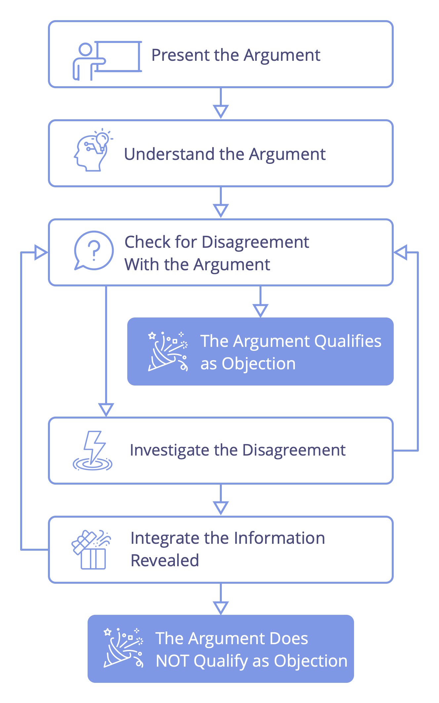
        

    

    <figcaption>A process for testing if an argument qualifies as an objection</figcaption>
</figure>

Below you'll find more guidance on how to go through each step. As with all patterns in S3, your approach to testing if arguments qualify as objections can be adjusted to suit your context.

###### Step 1 Present argument

*Present the argument being put forward as a possible <a href="glossary.html#entry-objection" class="glossary-tooltip" data-toggle="tooltip" title="Objection: An argument – relating to a proposal, existing decision, or activity being conducted by one or more members of the organization – that reveals consequences or risks that are preferably avoided for the organization or that demonstrates worthwhile ways to improve.">objection</a>*.

**Facilitator asks** the person with the possible objection: *Please explain your argument.*

###### Step 2 Understand argument

*Ensure everyone understands the argument.*

**Facilitator asks everyone:** *Any questions to understand the argument?*

**Everyone:** If you don't understand, jump in and ask a clarifying question. The person presenting the argument explains further, until everyone understands.

###### Step 3 Check for disagreement with the argument

*People consider the argument and then indicate if they disagree.*

**Everyone:** reflect for yourself if you think the argument presented qualifies as an objection or not. 

**Note:** If a group is new to the process, the facilitator might explicitly invite everyone to reflect for themselves: *Do you think this argument qualifies as an objection?* 

**Facilitator asks**: *Does anyone disagree totally or in part, that this argument qualifies as an objection? If so, please raise your hand.*

- If no-one disagrees: **the argument qualifies as an objection.** Proceed to _resolve the objection_.
- If anyone disagrees: continue to the next step.

###### Step 4: Investigate the reasoning behind a disagreement

Choose one of the people with a raised hand and using the same process for testing arguments qualify as objections, determine if their reasons for disagreeing are valid or not:

**4.1. Present the reason for disagreement**: Facilitator invites: *Please explain why the original argument is totally or partly incorrect.* 

**4.2. Understand reason for disagreement**: Facilitator invites: *Are there any questions to understand this argument?*

**4.3. Check for disagreement to the disagreement:** Facilitator asks: *Does anyone disagree totally or in part, that this argument is valid?*

- **If no one disagrees**: the argument for the disagreement is considered valid. Go to step 5.
- **If anyone disagrees**: investigate the reasoning behind the disagreement (see step 4) until you come to an argument that no-one disagrees with. Then take each preceding argument in turn — checking if there's anything remaining and/or if it needs to be changed or dropped (see step 5 for guidelines on how to do this) — until you arrive back to the initial disagreement. 

###### Step 5: Integrate the information revealed in the previous step with the original argument

**Facilitator asks** the person who presented the original argument: *"Anything remaining of your argument?"*

The person who brought the original argument has the option to refine, rephrase or reframe their argument, or to drop it entirely, if there's nothing remaining. 

- If the original argument still has some validity, refine it and then continue with step 3 to see if there is any disagreement with the refined argument.
- Otherwise you have demonstrated that the original **argument is not an objection.**

<figure class="fig fig--limit-width fig--scale-full">
    

        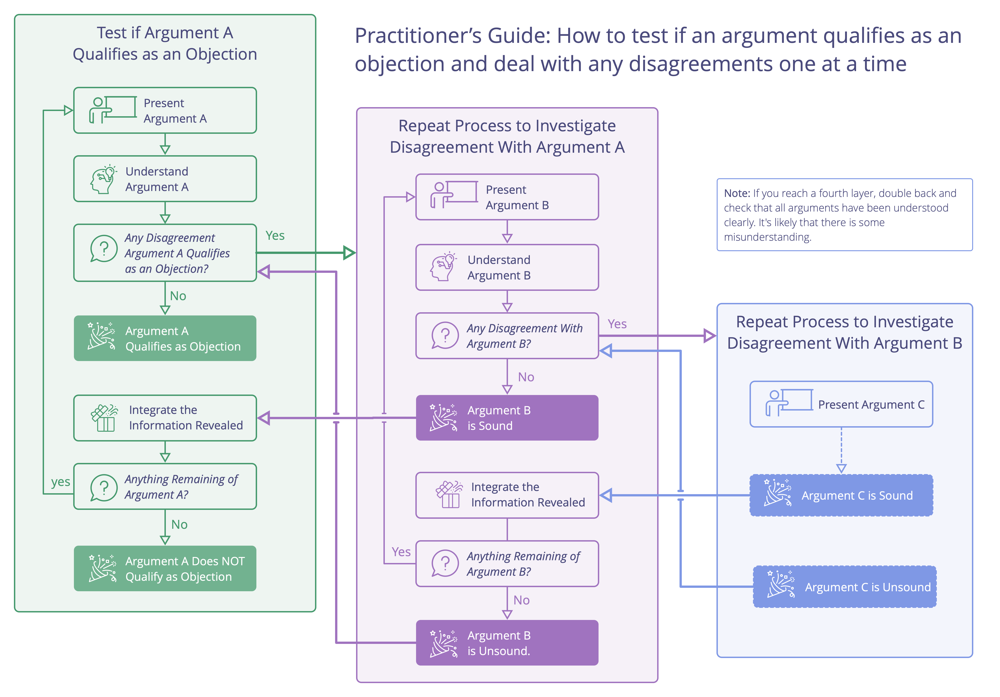
        

    

    <figcaption>Recursive application of testing arguments and investigating disagreements</figcaption>
</figure>

<figure class="fig fig--limit-width fig--scale-full">
    

        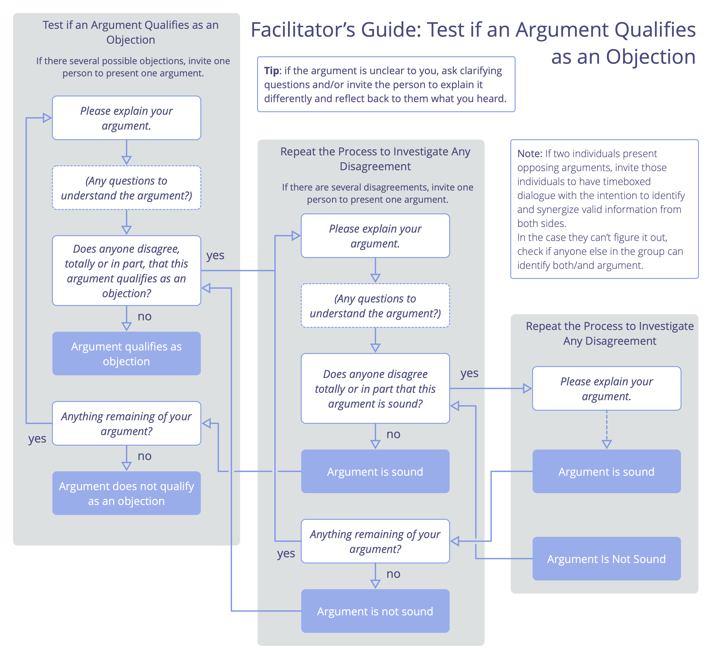
        

    

    <figcaption>Facilitator's Guide: Test Arguments Qualify As Objections</figcaption>
</figure>

#### Resolve Objections

Use the information revealed by an objection to identify ways to evolve proposals, policy and actions to a good-enough state. 

##### Overview

Typically it's most effective to **take one <a href="glossary.html#entry-objection" class="glossary-tooltip" data-toggle="tooltip" title="Objection: An argument – relating to a proposal, existing decision, or activity being conducted by one or more members of the organization – that reveals consequences or risks that are preferably avoided for the organization or that demonstrates worthwhile ways to improve.">objection</a> at a time**, come up with a proposal for an amendment, resolve any objections to that amendment, and then continue with the next objection to the overall proposal. 

A proposal becomes policy when all objections have been resolved.

Objections are resolved by amending the proposal. **Amendments** can include the following: 

- adding, removing and/or changing something in the proposal.
- deferring resolution of a particular objection until later. (Remember to clarify who will take responsibility for this, by when, and what will happen after that).
- (co-)creating a new proposal in the future (if it's considered more effective than continuing to work on developing the existing proposal).
- delegating the task to review, research, and/or propose an amendment for one, or even several related objections, to an individual or group.
- leaving the main proposal unchanged and monitoring the outcome because the effort, or cost of changing things to resolve the objection, outweighs the anticipated benefits or gain.
- asking a delegator for feedback or input (e.g. when agreeing on a strategy for a subdomain).
- take some more time for reflection and then come back to the objection again later.
- etc.

There's always an iterative next step of some kind that you can take! Even if a proposal doesn't fully address the <a href="glossary.html#entry-organizational-driver" class="glossary-tooltip" data-toggle="tooltip" title="Organizational Driver: A situation where the organization&#x27;s members have a motive to respond because they anticipate that doing so is beneficial or necessary for fulfilling the organization’s purpose. (by helping generate value, eliminate waste, or avoid undesirable risks or consequences). Drivers are often expressed as _current conditions_ that lead to current or anticipated _effects_ that are _relevant_ to the organization.">driver</a> or fulfill the corresponding <a href="glossary.html#entry-requirement" class="glossary-tooltip" data-toggle="tooltip" title="Requirement: A state considered valuable to establish or maintain in order to address a specific driver. Requirements are often expressed as _intended outcome(s)_, and _enabling condition(s)_ considered necessary to establish for achieving or maintaining those outcomes.">requirement</a>, reaching agreement about **one or more iterative next steps** is often good enough. It's also helpful sometimes to break things down into small steps, especially when you're dealing with complex or complicated situations. 

Objections can be resolved by following the process outlined in _Reasoned Decision-Making_:

**Step 1:** Come up with a proposal for an amendment

**Step 2:** Understand the proposed amendment 

**Step 3:** Check if there are any possible objections to the proposed amendment, e.g. by using hand signs. The possible objections themselves are presented in Step 4. 

If there are no possible objections, proceed to step 6 (Celebrate), otherwise take one possible objection at a time, and:

**Step 4:** Hear the reasoning for the possible objection and _determine if the argument put forward has any validity_.

**Step 5:** Integrate any information revealed in the previous step to improve the proposed amendment, then go back to step 3.

**Step 6:** Celebrate! You've agreed on an amendment that resolves the objection! 

<figure class="fig fig--limit-both fig--scale-normal">
    

        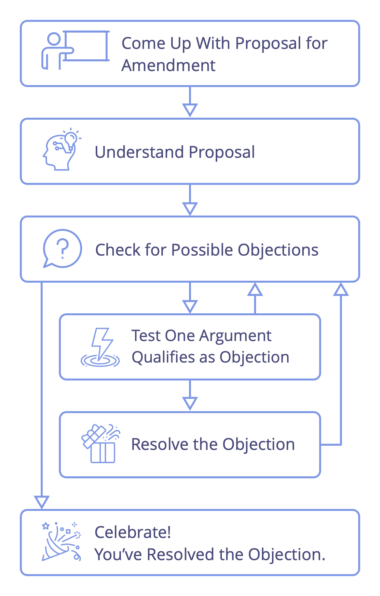
        

    

    <figcaption>Process for resolving an objection</figcaption>
</figure>

Below you'll find more guidance on how to go through each step. This process can be repeated until all objections have been resolved. As with all patterns in S3, your approach to resolving objections can be adjusted to suit your context. 

##### Step 1: Come Up With a Proposal for an Amendment

*Come up with a suggestion for how to amend the proposal to resolve the objection based on information the objection reveals.* 

There are many ways to come up with an amendment. Below are some typical options you can use. We recommend you use them in the order they are presented: if the first option does not work, go to the next one, and so on. Once you get more familiar with the process you'll be able to discern in the moment which option is more suitable. 

1. Ask the person raising the objection: "*Do you have a suggestion for how to amend this proposal to resolve this objection?*"
2. Ask the group "*Does anyone have a suggestion for how to amend this proposal to resolve this objection?*" and choose one person to present their suggestion.
3. In case it's difficult to immediately come up with an amendment, invite a time-boxed dialogue to share ideas, with the purpose of coming up with an amendment from there.

As with any proposal, an amendment suggestion gives you a starting point that can then be refined through inviting and resolving objections. (see Step 4:Test One Argument Qualifies as Objection)

It's often helpful to repeat or summarize the amendment and write it down for everyone to see. 

##### Step 2: Understand Amendment

*Ensure everyone understands the amendment being proposed.*

**Facilitator asks:** *Any questions to understand the proposed amendment?*

Tips for everyone:

- Keep your questions and answers brief and to the point. 
- Avoid getting into discussions or expressing opinions about the validity of the amendment at this stage. The point of this step is simply to ensure the suggested amendment is clear. 
- Add relevant clarifications to the written amendment.

##### Step 3: Check for Possible Objections

*People consider the proposed amendment and then indicate if they have possible objections or concerns.*

This step is simply about identifying who has possible objections or concerns. Arguments are heard in the next step.

**Facilitator asks:** *Are there any possible objections, or concerns to this amendment?* (note that the subject here is the amendment, not the whole proposal!)

Many groups use hand signs as a way to indicate quickly and clearly if anyone has any possible objections. 

- In case there are possible objections to the suggested amendment, go on to the next step (*Test One Argument Qualifies as Objection*). 
- If no one indicates having any possible objections, go to **Step 6: Celebrate**, because you've agreed on the amendment.

##### Step 4: Test One Argument Qualifies as Objection

Please refer to _Test Arguments Qualify as Objections_

- If the argument qualifies, continue to **Step 5** (Resolve one Objection)
- If the argument doesn't qualify, go back to **Step 3** to check if there are any further possible objections to the proposed amendment. 

##### Step 5: Resolve One Objection

*Repeat the process: use the Resolve Objection pattern to resolve one objection to the amendment.* 

Come up with an amendment to the current amendment suggestion! Be aware that a proposed amendment might include the suggestion to entirely replace the current amendment with a different one instead.

As you can see, the Resolve Objections pattern can be used recursively. Below you will find an illustration that shows how this works.

<figure class="fig fig--limit-width fig--scale-full">
    

        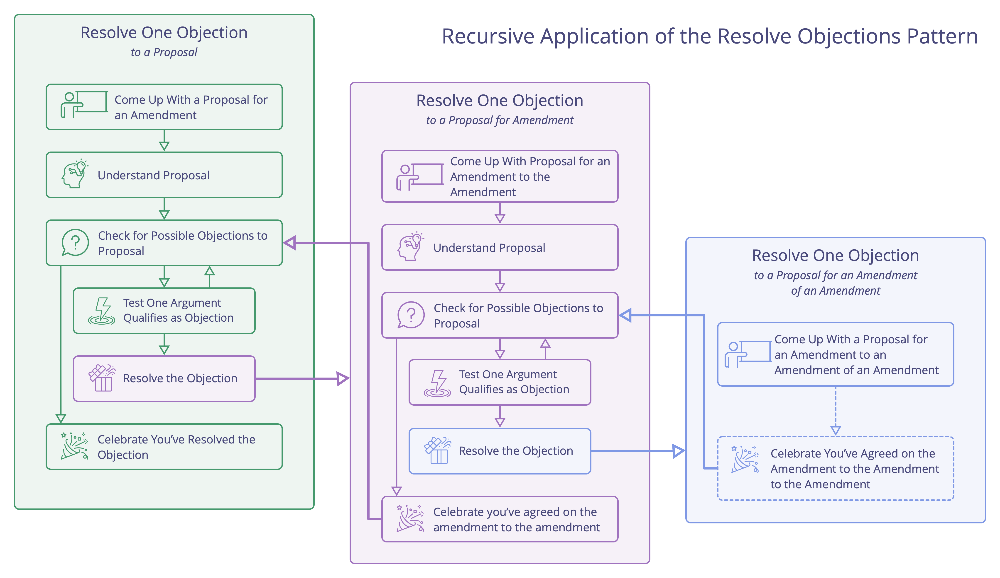
        

    

    <figcaption>Recursive application of the Resolve Objection pattern</figcaption>
</figure>

##### Step 6: Celebrate!

You've agreed on an amendment that resolves the objection!
Before moving on, remember to update your original proposal to integrate the amendment you've agreed on.

#### Evaluate and Evolve Policies

Regularly evaluate policies and adapt them as necessary to ensure they remain relevant and effective for fulfilling organizational requirements.

Organizations and the teams that operate within them are complex systems nested within wider <a href="glossary.html#entry-complexity" class="glossary-tooltip" data-toggle="tooltip" title="Complexity: An environment where unknowns are unknown, cause and effect can only be understood in retrospect, and actions lead to unpredictable changes. [Snowden and Boone]">complex</a> systems. In such environments, circumstances can change rapidly, making it unrealistic to expect that every decision or policy will be entirely suitable from the outset or will remain effective over time. 

An iterative process of regularly evaluating <a href="glossary.html#entry-policy" class="glossary-tooltip" data-toggle="tooltip" title="Policy: An intervention that is created and evolved through governance; a process, procedure, protocol, plan, strategy, or guideline.">policies</a> and adapting them as necessary ensures that policies are improved, so that they become and remain fit for purpose despite changes in the organization or the wider environment. The compound effect of regularly evaluating and evolving all policies prevents organizations from accumulating useless policies that hinder productivity. It also ensures that people regularly refresh their knowledge about the policies that affect them, enabling them to better keep to them, too. 

An effective evaluation integrates empirical data derived from _metrics_, systematically collected qualitative data, and personal experiences related to the policy being evaluated. These inputs guide participants toward understanding how effective the policy was, and reveal insights into worthwhile ways it might be improved.

To ensure policies are evaluated as necessary, it's important to keep a written record of each policy, including an archive of previous versions, and to set a suitable review date or cadence for when each policy should be reviewed. 

Ideally, when evaluating a policy, you will already have a _written record_, not only describing the policy itself but also its <a href="glossary.html#entry-purpose" class="glossary-tooltip" data-toggle="tooltip" title="Purpose: The reason why something is done, used, or created; a guiding motivation that directs actions, decisions, and resources toward achieving a valuable outcome.">purpose</a> and <a href="glossary.html#entry-metric" class="glossary-tooltip" data-toggle="tooltip" title="Metric: A quantifiable measure used to track and assess progress, evaluate outcomes, and determine success.">metrics</a> for evaluation. However, many teams may not have these details fully defined or recorded. If this is the case, you can use the format provided at the end of this pattern description to assess and improve your existing policies while you are putting these other elements in place.

When deciding on a suitable review date or frequency, consider factors like the level of uncertainty surrounding the policy and the potential impact of its application. Make arrangements to alert those responsible as the review date approaches, and remain adaptable by initiating reviews earlier if conditions change or if new insights emerge.

**Note**: While this pattern is designed for teams, individuals can also apply elements to evaluate their own decisions, fostering greater awareness of personal decision-making effectiveness. 

##### How to Evaluate and Evolve Policies

Evaluating a policy can be as simple as checking whether it is still relevant and suitable for achieving the outcomes intended and whether there are any objections to keeping it as it is. Policies are often reviewed in _Governance Meetings_. However, for more extensive or particularly complicated policies, or when a policy affects multiple stakeholders, it's sometimes more effective to schedule a session dedicated solely to the review.

Before evolving the policy itself, consider that the policy is designed to fulfill a requirement, which in turn is meant to provide a suitable response to an organizational driver. Therefore, making necessary changes to the driver and requirement takes precedence over changes in the policy itself:

-   Changes to the driver can alter opinions about what is required. 
-   Changes to the requirement can affect whether the policy remains suitable or needs adjustment. 

This implies there is a simple and natural order to the steps of a review:

First, ensure the purpose is still relevant to fulfill (or retire and archive the policy if it is not); second, evaluate how effective the current version of the policy has been in fulfilling the requirement; third, assess whether the purpose (driver and requirement) needs updating; and finally adapt or replace the current version of the policy based on insights from the evaluation, to support another iteration of learning and improvement.

<figure class="fig fig--limit-both fig--scale-normal">
    

        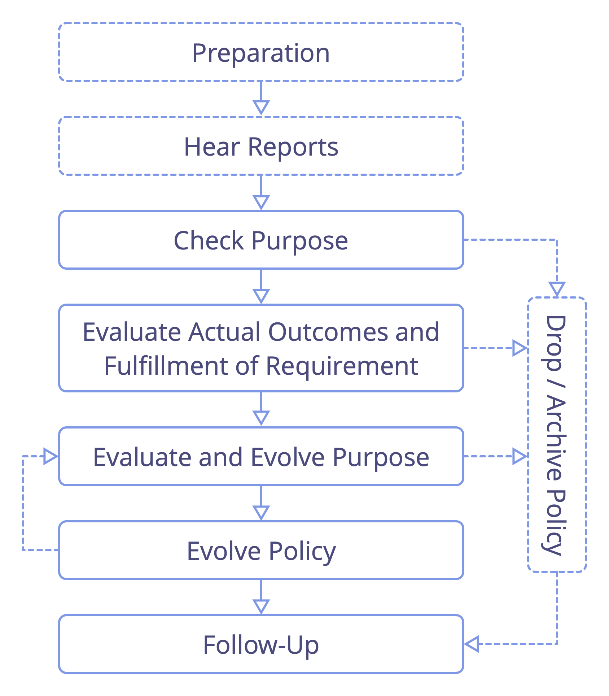
        

    

    <figcaption></figcaption>
</figure>

##### General Format for Evaluating and Evolving Policies

1. **Prepare**
    -   Schedule the review
    -   Ensure all necessary information is available to participants
    -   As a participant, ensure to review the policy and related information and prepare reports if relevant
2. **Hear any prepared reports** about the policy, e.g. usage data, observed outcomes, or incidents. 
3. **Check the purpose** of the policy to ensure it's still relevant. If the situation is no longer relevant to respond to (because the situation or the context has changed), retire and archive the policy, unless a compelling reason for its continuation is identified. You may still choose to evaluate what worked and what didn't if you have the time, especially if doing so may reveal learning that informs future governance.
4. **Evaluate actual outcomes and whether requirement(s) were fulfilled**.
    -   Evaluate how the intervention played out in practice: what was actually done, what happened as a result, and whether this aligned with what was expected.
    -   Review recorded numbers for metrics and any other relevant data to determine whether intended outcomes were achieved, and to what extent, and which acceptance criteria were met.
    -   Identify any significant unintended outcomes of implementing the policy, both positive and negative, and extract learning.
    -   Assess whether the conditions described in the requirement(s) were established or maintained. 
    -   Where intended outcomes were not achieved, or conditions were not established or maintained, assess whether the issue lay in implementation, an inappropriate policy, or unsuitable conditions defined in the requirements.
-   Take note of any findings that might inform updates to the requirement, description of the driver, or the policy itself.
5. **Evaluate and evolve purpose**: Review and — if necessary — change the description of the **driver** and/or update the **requirement**.
    -   Review driver: Has the situation changed, and is it still relevant?
    -   Are the intended outcomes valuable in relation to the driver, and reasonably complete?
    -   Are the conditions suitable for achieving the intended outcome? 
6. **Evolve the policy**
    -   Evolve the actual **policy**: What aspects were effective for achieving the intended outcomes? What can be improved? What needs to change to account for updates made to the purpose? Is there anything missing? 
    -   Review the **metrics**: do they sufficiently determine progress in relation to the intended outcomes, conditions, and driver? Do they warn us when things go wrong?
    -   If the policy is made up of sub-policies, you can apply this same process (for evaluating and evolving policies) to each of the sub-policies (starting from step 2 or 3).
    -   Check for coherence of all sub-policies, and add what is still missing.
    -   Whenever you learn anything new about the driver or requirement, you need to update the purpose first, and then check for any consequences this might have on the policy. 
7. **Follow-up**
    -   Agree on the date for the next evaluation.
    -   Decide on all necessary follow-up activities.
    -   Ensure that all follow-up decisions and tasks are documented and shared to maintain accountability and track progress.
    -   Consider effects on any related agreements. 

#### Co-Create Proposals

Bring people together to co-create proposals: tap collective intelligence, build a sense of ownership and increase engagement and accountability.

There are many ways to co-create proposals. They typically follow a similar pattern:

1. Agree on the <a href="glossary.html#entry-organizational-driver" class="glossary-tooltip" data-toggle="tooltip" title="Organizational Driver: A situation where the organization&#x27;s members have a motive to respond because they anticipate that doing so is beneficial or necessary for fulfilling the organization’s purpose. (by helping generate value, eliminate waste, or avoid undesirable risks or consequences). Drivers are often expressed as _current conditions_ that lead to current or anticipated _effects_ that are _relevant_ to the organization.">driver</a> and <a href="glossary.html#entry-requirement" class="glossary-tooltip" data-toggle="tooltip" title="Requirement: A state considered valuable to establish or maintain in order to address a specific driver. Requirements are often expressed as _intended outcome(s)_, and _enabling condition(s)_ considered necessary to establish for achieving or maintaining those outcomes.">requirement</a> (or problem/opportunity/need)
2. Explore the topic and understand constraints, available resources and any other relevant information.
3. Generate ideas
4. Design a proposal (often done by a smaller group)

One way to co-create proposals is to use S3's _Proposal Forming_ pattern.

<figure class="fig fig--limit-both fig--scale-normal">
    

        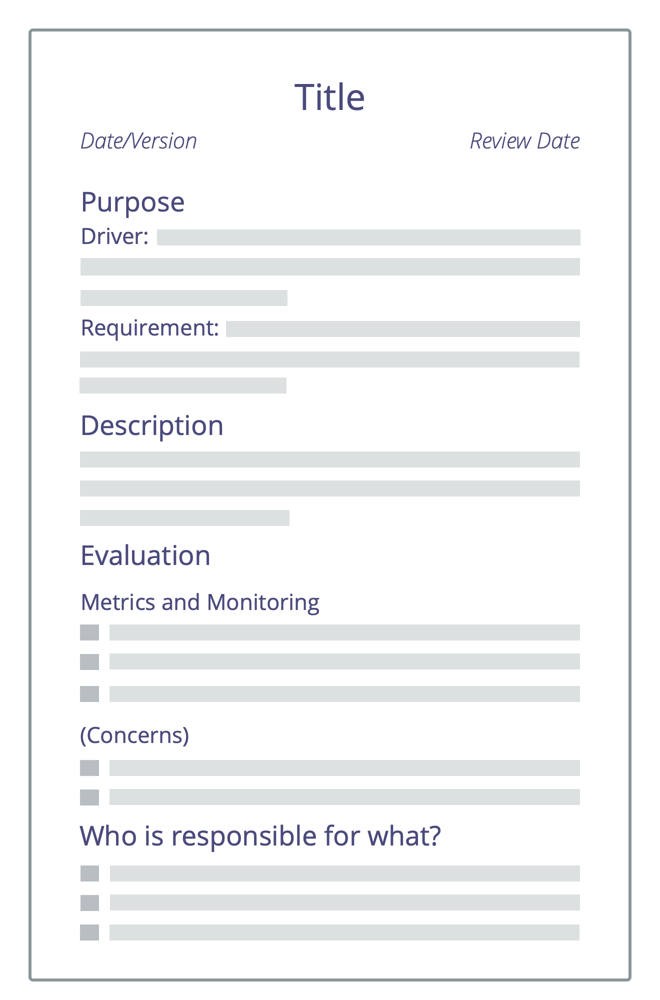
        

    

    <figcaption>A template for proposals</figcaption>
</figure>

For inspiration for steps 2 and 3, look to classic group facilitation techniques or design thinking activities.

Besides in a face-to-face workshop, you can adapt this process for online meetings. You can even use it asynchronously (and over an extended period of time) to include many people.

#### Proposal Forming

A structured process for designing a proposal for an intervention that draws on the collective intelligence and diversity of perspectives to understand context and elicit ideas about how to fulfill a purpose.

##### Overview

Proposal Forming is a process that guides people in designing a proposal for an intervention through a logical series of steps that build on one another. It consists of a defined sequence and a clear way to approach each step. This combination of structure and step design supports shared understanding and balanced participation, which makes it effective in facilitated group workshops.

When used by a group, it helps draw on the collective intelligence and diversity of perspectives to understand context and generate ideas for fulfilling a purpose; its participatory nature fosters creativity, accountability, and a strong sense of ownership among stakeholders. The same underlying structure — and parts of the step design — remain valuable without live collaboration, so groups can apply it asynchronously in time-boxed stages, and individuals can use it on their own when designing significant interventions. The process unfolds through the following steps:

1. **Consent to purpose**: *Check that the <a href="glossary.html#entry-purpose" class="glossary-tooltip" data-toggle="tooltip" title="Purpose: The reason why something is done, used, or created; a guiding motivation that directs actions, decisions, and resources toward achieving a valuable outcome.">purpose</a> is clearly summarized and relevant for the group to address.* 
2. **Questions about the purpose**: Deepen individual and shared understanding of the purpose.
3. **Information gathering**: *Document any constraints, available resources, and other information relevant to consider when designing the intervention.*
4. **Generative questions**: Capture open questions that reveal essential or desirable requirements the proposal should fulfill.
5. **Collect ideas**: Generate and record ideas about how to fulfill the purpose.
6. **Choose <a href="glossary.html#entry-tuners" class="glossary-tooltip" data-toggle="tooltip" title="Tuners: One or more people who use the information and ideas collected in Proposal Forming to design a coherent proposal (not a final decision).">tuners</a>**: Delegate responsibility for putting together a proposal to 2-3 people.
7. **Tuners design proposal**: The tuners design a proposal based on the information gathered in the previous steps.

<figure class="fig fig--limit-width fig--scale-small">
    

        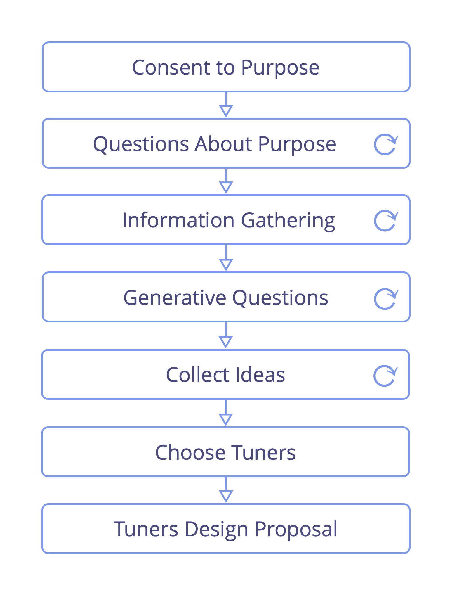
        

    

    <figcaption>Proposal forming process</figcaption>
</figure>

##### Step 1: Consent to Purpose

*Check that the purpose (driver and requirement) is clearly summarized and relevant for the group to address.*

**Facilitator asks**: *Is the description of the driver and the requirement clear enough? Is this an organizational driver? Is this driver relevant for you to address? And, is this requirement suitable?*

This first step ensures the purpose is clearly summarized, and it's the responsibility of those present to determine a way to fulfill it. Once the purpose is accepted, you'll have the chance to ask further questions and learn more in the next step.

**Tips for the Facilitator**:

-   Ensure the description of the purpose is available to all stakeholders throughout the process and invite someone to present it at the start. 
-   Check for any objections to the purpose or how it is described before proceeding to the next step, even if the group has previously agreed to the purpose prior to the meeting.
-   Guide the group in resolving any objections to the purpose or how it's described.

**Tips for Everyone**:

-   As a general recommendation, aim to complete this step before the meeting. Doing so allows time to make any refinements in advance and save precious meeting time.
-   If the driver or requirement is **not described clearly enough**, take time to clarify and make any necessary changes to the description until there are no further objections.
-   If the **driver is not relevant to this group**, pass it on to the appropriate person or team, or, if you decide that this is not an organizational driver at all, discard it.
-   If participants consider the requirement is unsuitable, hear the argument(s) and if they qualify as objections, resolve them before continuing to the next step.

##### Step 2: Questions About the Purpose

*Deepen individual and shared understanding of the purpose (driver and requirement).*

The goal of this step is to deepen your understanding, individually and as a group, of the situation and what's been determined as required to address it. You are looking back in time to the present moment to understand the situation.

**Facilitator asks**: *Any other information you need to know about the driver or requirement?*

Request and share whatever information you need to ensure you understand the driver and the requirement well enough.

**Tips for the Facilitator**:

-   Use rounds, hear one question at a time, and invite anyone with an answer to share it. Encourage people to be brief and concise.
-   Check regularly with the person who asked the question if the answers given are sufficient to move on.

**Tips for Everyone**:

-   Prioritize your questions in your mind, in case there isn't time to ask or answer them all.
-   If you don't have a question, when it's your turn, say "pass."
-   Keep both questions and answers brief. Avoid preamble and aim to stay focused on each question in turn.
-   Keep any conversation to a minimum and avoid getting into discussions.
-   Only record answers, NOT questions.
-   If there are 2 or more points of view, record them all.

##### Step 3: Information Gathering

*Document any known constraints, available resources, and other information relevant to consider when designing the intervention.*

Before jumping into ideas about how to fulfill the purpose, it's useful to identify and consider any relevant **constraints**, **available resources**, and **other contextual information** worth keeping in mind. 

Information gained in this step helps people make more appropriate and feasible suggestions for fulfilling the purpose. Important information-seeking questions that cannot be answered now might indicate the need to address them somehow in the proposal later.

Summary of this step: 

-   **Collect and categorize information**: Place items on the board under "*Constraints*", "*Resources*", or "*Other Information*".
-   **Answer information-seeking questions**: Hear questions, add answers to the board, and log unanswered questions if the answer could meaningfully shape the proposal's design.

**Note**: In some cases, you may pause the Proposal Forming process at this stage to allow time to answer important information-gathering questions.

###### Collect and Categorize Information

**Facilitator asks**: "*What constraints, available resources, or other relevant information are you aware of that might be valuable to keep in mind when designing this proposal? What information are you missing but might be helpful?*"

Collect constraints, resources, and other information in rounds and place them on the board. Answer any clarifying questions that may arise during that process.

**Examples**:

-   **Constraints** (factors that limit what's possible)
    -   Budget, time, or capacity limitations
    -   Legal, policy, or compliance boundaries
    -   Technical or infrastructure dependencies
    -   Commitments to other priorities or projects
-   **Resources** (anything that you can make use of)
    -   Available budget or funding
    -   People's skills and experience
    -   Existing tools, materials, or infrastructure
    -   Supportive networks, relationships, partnerships, or allies
-   **Other relevant information** (contextual insights or situational factors)
    -   Stakeholder expectations or needs
    -   External conditions (e.g., market, season, regulations)
    -   Historical context or lessons learned from past efforts
    -   Related initiatives that could align or conflict
-   **Questions to answer** (what people might want to know)
    -   *Who will be affected by this proposal, and how?*
    -   *What existing commitments or timelines could influence implementation?*
    -   *What support or resources are available from outside the group?*
    -   *What risks or uncertainties might impact success?*

###### Answer Any Remaining Questions

Hear any questions about constraints, resources, or other information that are still unanswered (one at a time), and record the answer in the appropriate place on the board. Also, keep questions that cannot be answered on the spot for later consideration. 

**Tips for the Facilitator**:

-   Begin by giving people a few minutes to reflect individually and record any information and questions on sticky notes.
-   Once the time is up, use rounds to collect all the information and hear one point from each person in turn. Go in rounds until all relevant information is visualized on a board.
-   Then continue with rounds, hearing any questions that remain unanswered. If the *information* is available, add the *answer* to the board in the appropriate section. For questions that cannot be answered immediately, add them to the board for later consideration.

**Tips for Everyone**:

-   For this step, allocate four areas on your (digital) board, one for each of the following: 'constraints', 'resources', 'other information', 'things to find out'.
-   When it's your turn, read out one of your points, or later, questions, and add it to the appropriate section on the board.
-   Use the "*Bingo*" and "*Sort-of Bingo*" technique to avoid duplication and to identify and cluster related points together: When you have the same point, say "*Bingo*"; there is no need to repeat what's on your sticky note. When you have a related point, say "*Sort-of-Bingo*" and jump in and add the additional details.
-   To increase meeting effectiveness, you can also prepare by documenting relevant information and questions in advance and bringing them to the meeting.

##### Step 4: Generative Questions

*Capture and sort open questions that reveal essential or desirable requirements the proposal should fulfill.*

**Generative questions** are open-ended, which means they can be answered in many ways. Reflecting on such questions stimulates creative thinking and invites people to consider multiple possibilities in the next step (Collect Ideas).

Summary of this step: 

-   **Collect generative questions**: hear questions and place them on the board
-   **Sort questions into three categories**: "_Essential_", "_Desirable_", and "_Maybe Later._"

**Note**: Do not attempt to answer the generative questions yet; that happens in the next step.

**Facilitator asks**: "*Keeping in mind what you've learned about constraints, resources, and other relevant information. Turn your attention toward fulfilling the purpose. What open questions arise that point toward possibilities and options for how to proceed?*"

**Examples**:

-   *How can we utilize our existing platforms to address this issue?*
-   *What's the simplest way to begin?*
-   *What can we learn from how others have dealt with this before?*

Collect all questions using rounds and place them on the board. Avoid discussing questions at this stage unless necessary to understand what is meant. 

Once all questions have been collected, sort them into the following categories: essential, desirable, and maybe later. 

**Tips for the Facilitator**:

-   Begin by giving people a few minutes to reflect individually and write down their questions on sticky notes
-   Once the time is up, use rounds to hear and collect one question from each person in turn and place it on the board. Go in rounds until all questions are on the board.

**Tips for Everyone**:

-   For this step, allocate four areas on your board: One large area to collect all questions, and three more to categorize them later ("_Essential_", "_Desirable_", and "_Maybe Later_")
-   When it's your turn, read out one of your questions and add it to the board.
-   Use the "*Bingo*" and "*Sort-of Bingo*" technique to avoid duplication and to identify and cluster related questions together: When you have the same question, say "*Bingo*"; there is no need to repeat what's on your sticky note. When you have a related question, say "*Sort-of-Bingo*" and jump in and add the additional details. 
-   When it comes to sorting the questions into the three categories, consider beginning in silence. Invite everyone to move the sticky notes into the appropriate categories. If someone disagrees with the categorization of a question, they can move that question aside until all other questions have been placed. Then have a conversation to decide where to position the disputed ones.
-   In the case of a solution disguised as a question (see below), rephrase the question or bring it up in the next step when you collect ideas.

###### Solutions Disguised As Questions

Be aware that sometimes people present solutions disguised as questions. For example, "*Could we use tool X to solve this?*" or "*Could we raise funds through an open campaign?*"

Such questions invite listeners to *converge* on an idea. The purpose of this step in Proposal Forming is to keep the field open (*divergent*) for as many creative ideas as possible. Specific ideas are shared in the next step.

If you do come across a solution disguised as a question, have a go at reformulating it as a generative question, for example, "*What tools do we know of that we could use for this?*" or "*How might we finance this?*" Alternatively, save it and bring it up in the next step.

##### Step 5: Collect Ideas

*Generate and record ideas about how to fulfill the purpose.*

In this step, everyone shares ideas about how to fulfill the determined requirement. This can include ideas that provide a complete or partial solution, iterative next steps, and suggestions for addressing any of the generative questions collected in the previous step. 

**Facilitator says**: *Coming back to the purpose of this proposal, mindful of all we've learned so far, and considering the generative questions collected in the previous step, please take some time now to come up with ideas about how we can fulfill the purpose.*

**Tips for the Facilitator**:

-   Begin by giving people a few minutes to reflect for themselves and record their ideas on sticky notes.
-   Encourage people to record as many ideas as possible. Reassure everyone that contradictory ideas are welcome.
-   Once the time is up, use rounds to hear one idea from each person. Go in rounds until all ideas are harvested.

**Tips for Everyone**:

-   Take time to reflect individually and write down your ideas on sticky notes.
-   Keep your notes brief.
-   Ask questions to clarify ideas if necessary, but avoid discussing, evaluating, comparing, or debating them.
-   Use the "Bingo" and "Sort-of Bingo" techniques to identify and cluster similar considerations together.
-   To increase meeting effectiveness, you can also prepare by recording your ideas in advance and bringing them to the meeting.

##### Step 6: Choose Tuners

*Delegate responsibility for creating a proposal to 2-3 people (the tuners).*

**Tuners** use the information and ideas collected in previous steps to design a coherent proposal. They review all input, select or combine promising ideas, and, if needed, introduce new elements to ensure the proposal effectively addresses the purpose. The term “Tuners” refers to the process of tuning a piano to create harmony and resonance. Tuners take the diverse input provided by the group and ‘tune’ it into a coherent form.

The Tuners do not make the final decision. Their responsibility is to produce a proposal that can later be evaluated, tested, and refined through the
 _Consent Decision Making process_.

When choosing Tuners, consider who has suitable experience and expertise, the level of investment, who is inspired and willing, and who has diverse perspectives or an outside point of view.

**Facilitator says**: "*We need to choose tuners*". Then asks in this order: 

1. *"Who do you think should be there?*
2. *Who would like to be there?*
3. *Can you think of anyone else, not present here, who might have a valuable contribution to make?"*

**Tips for the facilitator**:

-   Ask people to make suggestions, including proposing themselves. If there are several suggestions, narrow them down to 2 or 3 people.
-   Check for any objections to the proposed tuners, and resolve them until there are none.

**Note**: Tuners take responsibility for ensuring the proposal is well designed. They may create it themselves or invite others to contribute if it's necessary or valuable to do so.

##### Step 7: Tuners Design Proposal

*The tuners design a proposal based on the information gathered in the previous steps.*

A well-written proposal usually includes:

-   The purpose: the driver it responds to and the requirement it's intended to fulfill.
-   The proposal text — what, how, rationale, etc.
-   Who will be responsible for what, e.g., overseeing application, implementation, etc?
-   Evaluation date or frequency — when the future policy will be reviewed.
-   Evaluation criteria — to measure/determine the success or effectiveness of the decision.
-   A due date, if necessary.

When scheduling a Proposal Forming session, leave space afterward for the tuners to design the proposal without switching context (provided there are no dependencies on others not present in the session). In any case, aim to tune the proposal as soon as possible, while the context and all other details brought up throughout the process are still fresh in people's minds. 

Once the proposal is ready, tuners share it with the rest of the group. The group can then evolve it further by _inviting and resolving objections_ until an agreement is reached. 

When developing the proposal, it is often enough to design a (few) viable and iterative next step(s). Alternatively, prepare a high-level proposal first. You can go into detail later, once the basic concept has been approved.

In any case, consider setting an early evaluation date to review progress and outcomes, and to develop next steps. 

Of course, it's sometimes necessary to develop a comprehensive proposal from the start, but whenever possible, aim to break it down into iterative steps, so you can learn fast and use what you have learned to evolve the policy incrementally.

**Tuners, note**: When writing down the proposal, aim to keep your explanation clear and concise. Describe it in a way that maximizes the potential that others will understand it without needing further explanation.

#### Reasoned Decision-Making

Engage in productive dialogue by investigating different perspectives and the knowledge of participants, to reach agreement on what is considered viable, relevant, valid or empirically true.

There are many paths people can follow to arrive at a decision with others (majority, consensus, authoritative, etc), but for any approach that uses reason as a basis for reaching agreement, they typically follow a similar pattern of _Reasoned Decision-Making_.

Reasoned Decision-Making lays out the process that groups take when applying reason to check whether a proposal, decision or amendment is good enough, or if a particular argument is relevant, valid or empirically true.

##### The steps of the process

<figure class="fig fig--limit-both fig--scale-normal">
    

        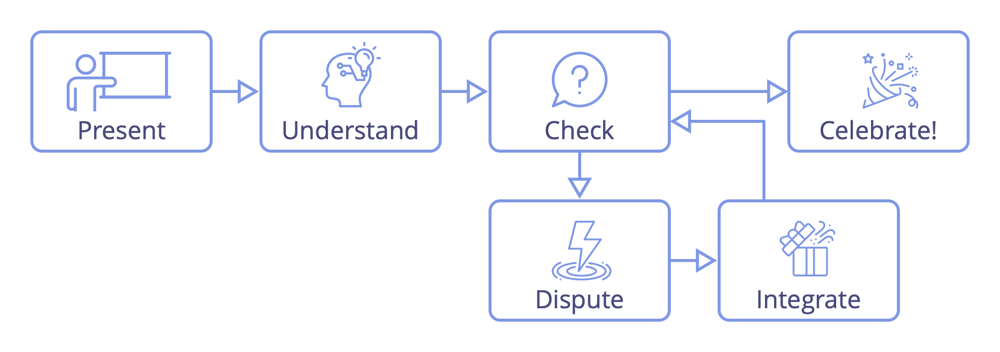
        

    

    <figcaption>Reasoned Decision-Making</figcaption>
</figure>

**Step 1: Present** the subject for investigation (this could be an argument, or a proposal for how to proceed).

**Step 2: Understand** the subject (e.g. through clarifying questions).

**Step 3: Check** if anyone disagrees with the subject (meaning they question the viability of the proposal or the validity of the argument), e.g. by using hand signs. Any disagreements are explained in Step 4. If there are no disagreements, **proceed to step 6** (Celebrate), otherwise take one disagreement at a time and: 

**Step 4: Dispute:** Hear the reasoning for the disagreement and determine if the argument put forward has any validity.

**Step 5: Integrate** any information revealed in the previous step to improve the subject, then go back to step 3.

**Step 6: Celebrate** reaching agreement.

How people undergo each of these steps varies and depends a lot on culture, context, preference, the number of people involved, and on whether they are communicating asynchronously or meeting face-to-face. 

##### Mapping Reasoned Decision-Making to other patterns in S3

Reasoned Decision-Making is reflected in all of the S3 process patterns that support groups to reach agreement. Understanding this meta-pattern helps people to more effectively apply them:

-   _Consent Decision-Making_, for testing if a proposal or existing agreement is good enough and safe enough. And, within this, two nested patterns:
-   _Test Arguments Qualify as Objections_, for testing if arguments qualify as objections and only acting on those that do.
-   _Resolve Objections_, for using the information revealed by objections to make and evolve agreements. 

Each of the three processes focuses on the investigation of a different subject: 

-    In _Consent Decision-Making_ the subject is a **proposal**.
-    In _Test Argument Qualifies as Objection_ the subject is an **argument** that indicates a possible objection.
-    In _Resolving Objections_ the subject is a **proposed amendment**. 

<figure class="fig fig--limit-width fig--scale-full">
    

        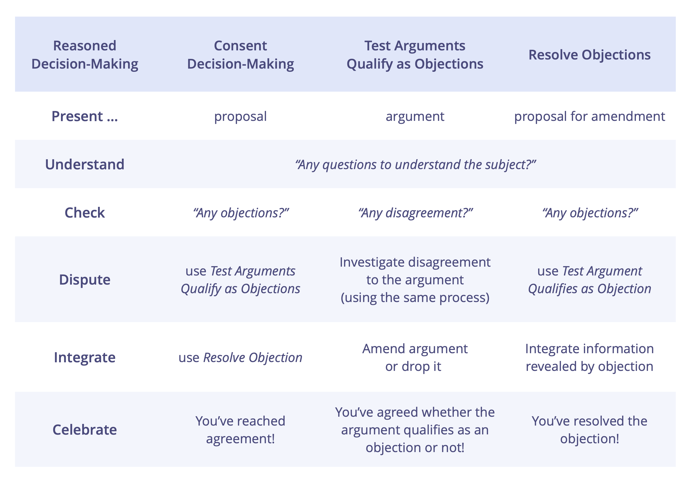
        

    

    <figcaption>Table: Mapping the steps of RDM to the other S3 decision-making processes</figcaption>
</figure>

#### Role Selection

A group process for selecting a person for a role based on the strength of the reason.

Instead of simply assigning people for _roles_, or making a choice based only on majority, use the role selection process to:

- tap collective intelligence by hearing and deliberating on reasons for nominations
- increase ownership over the decision
- ensure support for the role keeper by those affected.

A prerequisite to the selection process is a _clear description_ of the role's <a href="glossary.html#entry-domain" class="glossary-tooltip" data-toggle="tooltip" title="Domain: A distinct area of responsibility and authority within an organization.">domain</a>.

##### Steps

<figure class="fig fig--limit-both fig--scale-normal">
    

        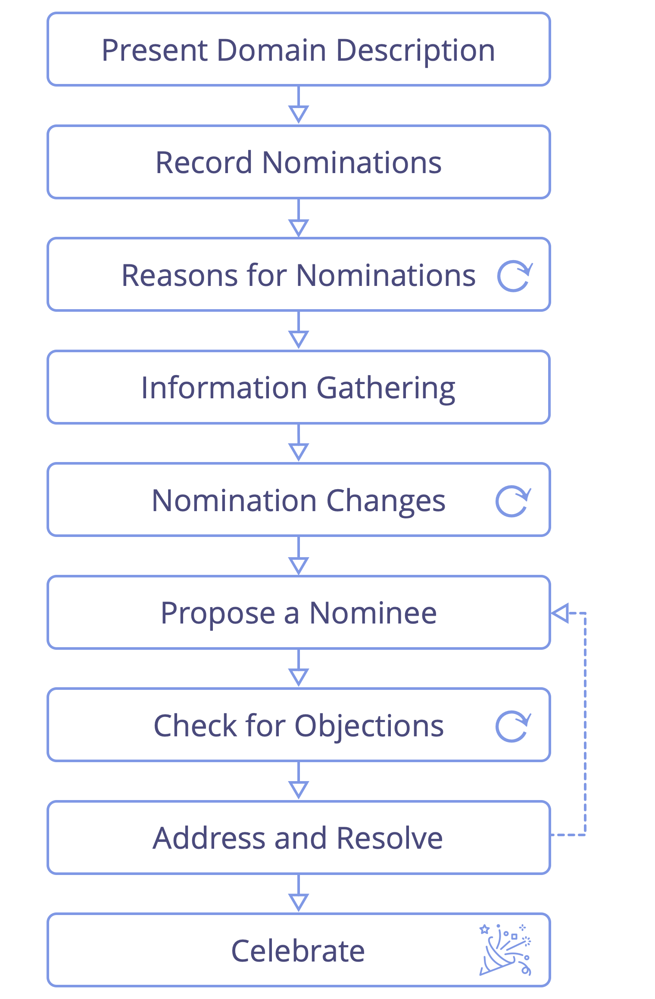
        

    

    <figcaption>Role selection process</figcaption>
</figure>

1. **Present Role Description:** If possible, send out the role's domain description in advance.
2. **Record Nominations:** Participants write their nomination on a slip of paper. People can nominate themselves, another, or pass.
3. **Reasons for Nominations:** Each person shares who they have nominated and why.
4. **Information Gathering:** Participants share or request any information that might support the group in making an appropriate selection.
5. **Nomination Changes:** Check if anyone wants to change their nomination in light of reasons and information shared so far, and hear the reasons for each change.
6. **Propose a nominee** for the role: The facilitator guides the process to identify a suitable nominee on the strength of the reasons heard, e.g. by:
    -   proposing a nominee themselves or asking a group member
    -   inviting (some) nominees to agree who should be proposed
    -   inviting group dialogue to help reveal the strongest nominee
7. **Check for Objections:** Ask participants (including the proposed nominee) to simultaneously signal whether or not they have an <a href="glossary.html#entry-objection" class="glossary-tooltip" data-toggle="tooltip" title="Objection: An argument – relating to a proposal, existing decision, or activity being conducted by one or more members of the organization – that reveals consequences or risks that are preferably avoided for the organization or that demonstrates worthwhile ways to improve.">objection</a>.
8. **Address and Resolve Objections,** beginning with any from the proposed nominee. _Objections may be resolved_ in many ways, including amending the role's domain description or by nominating someone else. When all objections are resolved, check with the (final) nominee again if they accept the role.
9. **Celebrate:** Acknowledge reaching agreement and thank the person who will now keep the role.

To avoid influencing others, abstain from expressing personal interest or opinions before a selection takes place.

Sometimes a role selection reveals a lack of capacity, relevant experience, qualities or skill. A group will then need to consider outside candidates, reconsider priorities or find an alternative way to attend to the domain.

This pattern can also be used in any situation where there is a need to choose between a variety of options.

### Evolving Organizations

#### Clarify and Develop Domains

Explicitly clarify, and then regularly evaluate and develop the design of domains throughout the organization, based on learning, to enable those with responsibility for each domain to deliver value as effectively as possible to the customers they serve.

A common practice in organizations is to distribute work and decision-making between people, to make good use of their limited time, energy, and resources. In the process, people are explicitly or implicitly defining and designing <a href="glossary.html#entry-domain" class="glossary-tooltip" data-toggle="tooltip" title="Domain: A distinct area of responsibility and authority within an organization.">domains</a> — distinct areas of responsibility and authority within the organization. Depending on the purpose it's meant to achieve, a domain in an organization may be temporary (e.g for a project), or permanent (e.g. finance).

Responsibility for domains is taken on by individuals (role keepers) or by groups of people (teams, projects, platforms, micro-enterprises, departments, etc.) Each team or role keeper contributes toward fulfilling the overall purpose of the organization by taking care of a specific area of responsibility in the organization. In some cases, people might keep more than one role or be part of more than one team.

In the process of delegating responsibility to others, or when existing responsibilities are misunderstood or people's efforts to fulfill their responsibilities are impeded in some way, consider explicitly clarifying domains. A written description of significant domains helps to reduce misunderstanding and makes existing expectations and assumptions clear. It lays out the contract between delegator and delegatees, and describes how the domain's design and the work done by the delegatees can be monitored, evaluated, and improved over time.

##### Why clarify and develop domains?

Clarifying domains makes expectations about the distribution of work transparent. It supports making the contract between <a href="glossary.html#entry-delegator" class="glossary-tooltip" data-toggle="tooltip" title="Delegator: An individual or group delegating responsibility for a domain to other(s).">delegator</a> and <a href="glossary.html#entry-delegatee" class="glossary-tooltip" data-toggle="tooltip" title="Delegatee: An individual or group accepting responsibility for a domain delegated to them, becoming a role keeper or a team.">delegatees</a> explicit and helps everyone understand who is responsible for what. A clear and easy-to-understand description of the area of responsibility and scope of authority to influence that delegatees have, helps clarify the part that each team or role keeper plays in the overall value chain. It also supports effective organizational development by making expectations explicit. Regular evaluation of each domain's design can reveal ways to improve it to enable greater efficiency, collaboration, and agility throughout the organization.

When domains are inadequately or insufficiently defined, stakeholders may have different assumptions about areas of responsibility and autonomy. As a consequence, both collaboration and distribution of work can suffer because of unnecessary or missed dependencies, double work, or work not done at all.

A clear domain description with adequate detail is a necessary prerequisite for people to successfully evaluate and continuously improve their work. Regular evaluation of each domain's design supports learning about what works and what doesn't. It helps people to identify ways to improve domain design over time, both locally regarding each individual domain and also regarding the overall structure of domains, the ways in which responsibilities are distributed between them, and the ways in which they are linked together to support the effective creation and delivery of value throughout the whole organization.

A simple way to support stakeholders in developing a shared understanding about the various aspects of a domain is by creating a domain description that contains information about:

-   **Purpose**: *What is the specific purpose the team (or role keeper) is responsible for fulfilling within the organization?*
-   **Key Responsibilities**: *What is the essential work and decision-making being delegated to the team (or role keeper)?*
-   **Customers and Deliverables**: *Whom does this team (or role keeper) deliver value to, and what specifically do they provide?*
-   **Dependencies**: *Who is the team (or role keeper) dependent on, from other parts of the organization or the outside world, and what deliverable(s) do these people provide?*
-   **External Constraints**: *What are important external constraints to the delegatees' autonomy and influence?*
-   **Key Challenges**: *What are the most important known (or anticipated) challenges the delegatees might face?*
-   **Key Resources**: *What essential resources can the team (or role keeper) make use of?*
-   **Delegator Responsibilities**: *What responsibilities can delegatees rely on the delegator to take care of to support them to successfully account for this domain?*
-   **Competencies, Qualities, and Skills**: *What competencies, qualities, and skills are required — or at least preferable — to successfully account for this domain?*
-   **Key Metrics and Monitoring**: *What are the critical indicators of progress, performance, project health, etc.? How frequently will they be measured and by whom?*
-   **Evaluation Schedule**: *When and how will you evaluate the effectiveness of the domain's design and the success of the team (or role keeper) in fulfilling the domain's purpose?*

On the [S3 Canvas microsite](http://s3canvas.sociocracy30.org/s3-delegation-canvas.html) you can find a template that you can use for (co-)designing new domains or for documenting existing domains, when clarifying them is worthwhile.

For a complete example of a domain description, see the Appendix: _Example Domain Description: Marketing Department_.

##### Considerations for designing domains

Free delegatees up to create and deliver value. Aim to design or develop domains in ways that enable them to fulfill the purpose of the domain as effectively as possible:

-   Avoid, minimize, or remove any unnecessary dependencies and constraints that otherwise impede the ability of the delegatees to successfully attend to the domain.
-   Enable delegatees to undertake whichever activities they consider to be valuable, unless such activity falls outside of the domain of the organization, is explicitly forbidden, they violate somebody else's (explicit) domain, or it impedes other people's contribution to the organization in some other way. Things that are forbidden may include explicit constraints laid out in the domain description, any other agreements the delegatees need to keep, or legal and regulatory requirements.
-   Aim to design simple metrics that help delegatees learn whether or not they focus on the right things.
-   Keep the design brief and to the point, and schedule regular evaluations to discover what is working, what's missing, and what needs to be changed.

Visit the section about [distributing governance throughout the organization]() for more guidance on how to do that in an effective way. 

##### When to clarify domains

**When delegating responsibility for a new domain**: As a delegator, take the time to draft out a design of the domain you intend to delegate, before contracting with an individual or team to take responsibility for it. As part of the delegation process, it's often worthwhile to review and perhaps develop some aspects of a new domain design, with input from the delegatees.

**When existing domains are unclear**: Consider clarifying existing domains whenever you identify that stakeholders have differing assumptions about the domain of an existing _role_, position, team, project, department, or even about the domain of the entire organization, if that unclarity leads to confusion, double work, work not being done, etc.

**When retrospectively clarifying domains** that have already been delegated to people, invite the delegatees to describe the domain from their perspective first. Then, in a dialogue between delegator and delegatees, add, remove, or change things until you reach a common understanding and an agreement on the design of the domain.

**When clarifying domains throughout an entire organization**, there is often merit in starting first with the domain(s) relating to governance and leadership of the overall organization. Identify and describe the responsibilities that those with responsibility for the overall organization have. Consider which of those responsibilities are essential for them to handle directly, and which are dependent on (or might benefit from) input from others throughout the organization, and in this case, clarify who. Consider which responsibilities would be better delegated _down_ the system, closer to those doing the actual work, to remove any unnecessary decision-making hierarchy and position responsibility for decision-making as close as possible to where value is being created and delivered to customers.

**Starting point**

All sections are worth considering when clarifying a domain. However, if you're tight on time, or if many aspects of the domain are currently unclear, start by defining the following, and then cover the rest as soon as you can:

-   Purpose
-   Key Responsibilities
-   Customers and Deliverables
-   Delegator Responsibilities
-   An early date by which the design of the domain will be reviewed and improved.

##### Regularly Evaluate and Develop Domains

People's understanding of the organization is limited, and the environment is always changing. Therefore, it's essential that delegator, delegatees, and other relevant stakeholders regularly evaluate and, when useful, improve the design of domains as their understanding of each domain and its contribution to a value chain deepens.

If the design of a domain is primitive or flawed, it will impede the team or role keeper's ability to contribute effectively to the purpose of the organization, even if the delegatees are doing a great job of accounting for the domain in the way it is currently designed. Therefore, it's essential that a domain's design is regularly evaluated so that a poor or out-of-date design can be improved incrementally as people learn over time.

If changes are made to one domain, consider if other domains are affected and make changes accordingly. Especially look to subdomains and dependent domains.

##### Clarify the Overall Domain of the Organization

All domains in an organization are nested within the <a href="glossary.html#entry-overall-domain" class="glossary-tooltip" data-toggle="tooltip" title="Overall Domain: The domain that defines the organization&#x27;s purpose, overall strategy, business model(s), and other standard constraints.">overall domain of the organization</a>. This domain can either be deliberately designed and described in the early stages of the organization or clarified retrospectively. An organization's overall domain needs to be designed in a way that enables the members of the organization to contribute effectively toward fulfilling its purpose, and it, too, typically needs to be evolved over time.

Consider reviewing the design of the organization's overall domain and how it's described if you discover that key stakeholders have differing understandings about it, or when its current design leads to missed opportunities or significant impediments. Review and adaptation of the organization's overall domain is the responsibility of the overall delegator of the organization. In a typical organizational hierarchy, the overall delegator is either the owners (or shareholders), sometimes represented by a board of directors, the president/CEO, or the executive team. In a bottom-archy (e.g. a cooperative or a community), the overall delegator might be everyone.

One way of clarifying an organization's overall domain is by filling out an [S3 Organization Canvas](http://s3canvas.sociocracy30.org/s3-organization-canvas.html).

An organization's overall domain should be designed with the customers, partners, other stakeholders, and business model in mind. It also needs to factor in environmental conditions (e.g. legal, or economic constraints, market trends, competition).

Once clarified, regularly evaluate the overall domain of the organization to identify opportunities for improvement and adapt its design when helpful or necessary.

##### Useful Aspects to Clarify in a Domain Description

All of the following elements are important to consider when clarifying a domain. Depending on where you are in the lifecycle of the domain, you might be able to describe each of them more or less clearly. Remember to regularly evaluate each domain's design, to test assumptions, clarify misconceptions, and improve things, as you learn over time.

<figure class="fig fig--limit-both fig--scale-normal">
    

        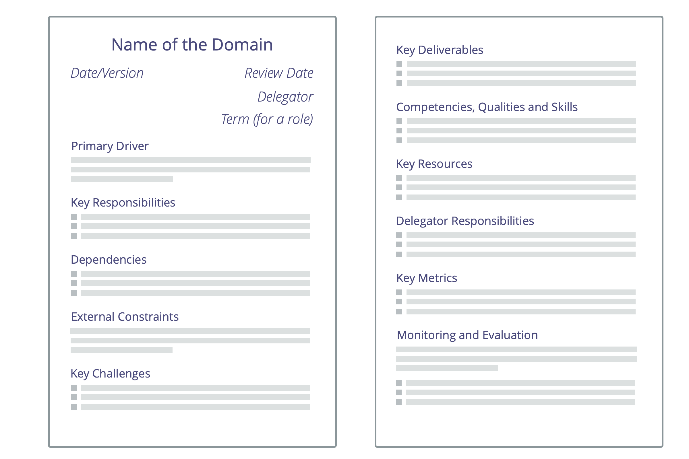
        

    

    <figcaption>Template for a domain description</figcaption>
</figure>

###### Purpose

_What's the primary driver and the associated requirement this team (or role keeper) is responsible for taking care of in the organization?_

Describing the specific purpose the team (or role keeper) is responsible for fulfilling within the organization clarifies why this domain exists, so that delegatees understand what's expected of them and why their work is relevant for the organization.

You can describe the primary driver using the pattern _Describe Organizational Drivers_ and look to the pattern _Respond to Organizational Drivers_ for suggestions on how to describe the requirement.

**Describe:**

-   **Primary Driver**: Describe the _current conditions_, the (anticipated or current) _effect_ these conditions lead to, and if it's not already obvious, the _relevance_ of this effect for the organization (to clarify why it's worthwhile or necessary to respond to the situation).
-   **Main Requirement**: Describe the _intended outcome_ of addressing the driver, as well as the _enabling conditions_ that will lead to achieving that outcome.

**Examples:**

1. Purpose of a Team Support domain:

    **Primary Driver:**  To resolve local issues, teams develop their work processes and meeting schedules in the way they see fit.  This often leads to incoherence in how work and decision-making are handled between teams, and it impedes effective collaboration on handling dependencies between and across domains.

    **Main Requirement:**  We need to support teams to develop and maintain a coherent approach to how they collaborate on dependencies so that they are able to deal with them effectively while ensuring they are still able to resolve local issues as autonomously as possible.

2. Purpose of a Marketing domain:

    **Primary Driver:** _Despite its limited feature set, our product is already highly valuable to a lot of small businesses, yet we operate in a competitive market where others provide a similar product with a far wider feature set than ours, and despite our competitive pricing, they currently tend to opt for these other products due to their reputation, and a lack of familiarity with ours._

    **Main Requirement:** _We need to increase awareness and understanding of our product and its benefits among those businesses that would appreciate it and find our existing feature set adequate for their needs, so that we boost sales and avoid the overhead that comes from attracting customers that are dissatisfied with the features we provide._

**Tips:**

-   Aim for two to three sentences as a maximum, so that the information is easy to remember and process.
-   Besides the summary, more details about the driver and the associated requirement may be kept in a _logbook_.
-   Ensure the description of the purpose clarifies why the work of delegatees is relevant for the organization.
-   Whilst the purpose can sometimes be clarified only by describing the main requirement the domain responds to, it's helpful to describe the primary driver behind the requirement as well, as it helps to clarify context and supports monitoring and evaluating outcomes.
-   Sometimes the primary driver is generic and obvious, for example, in the case of an HR or Marketing domain.

###### Key Responsibilities

_What is the essential work and decision-making being delegated to the team (or role keeper)?_

Key responsibilities are a summary of those areas of _work and decision-making_ that the delegator and delegatees consider **essential** to take care of in relation to fulfilling the domain's purpose effectively. They provide a high-level overview of what's expected from the delegatees.

**List** all _essential responsibilities_ that are being delegated by clarifying the **requirement** in each case.

**Recommended format:** Describe Key Responsibilities as requirements, if useful, include a description of the driver as well.

**Examples:**

1.  For a customer service team

    **Requirement**: _Ensure that customer inquiries are responded to in a timely manner, so that we stay within the time frame stipulated in our service level agreement._

    **Driver:** _The organization has observed an increasing volume of customer inquiries, with varied complexities, leading to delays in response times and customer dissatisfaction._

2.  For an agile coaching domain:

    **Requirement**: _Support cross-team collaboration on dependencies, so that common objectives of product teams are effectively achieved._

    **Driver:** _Our product development process involves multiple interdependent teams, where lack of coordination can lead to bottlenecks and project delays, emphasizing the need for effective cross-team collaboration to ensure efficient progress and successful delivery of product objectives._

3.  For an organizational development training provider team:

    **Requirement**: _Develop and deliver bespoke learning interventions to fulfill customer learning needs._

    **Driver:** _Our customers operate in a dynamic business environment where employee skills and knowledge requirements are constantly evolving, which leads to critical gaps in workforce capabilities and adaptability, underscoring the necessity for tailored learning interventions that ensure that employees are equipped to meet current and future challenges effectively._

4.  For a marketing team:

    **Requirement**: _Execute and refine digital marketing campaigns, to improve engagement metrics and customer acquisition costs._

    **Driver:** _With digital ad spending increasing without proportional gains in engagement, current strategies are leading to diminishing returns._

**Tips:**

-   Key Responsibilities inform and are informed by various other aspects of a domain's design. Therefore, while describing those other aspects, you will often find things that need to be added or revised, in this section documenting Key Responsibilities.
-   If the organizational driver behind a key responsibility is unclear, describe this as well to add context. Doing so helps to ensure that the reason for fulfilling each of these requirements is clear.
-   Don't describe the tasks that the delegatees are taking care of, but rather the requirements that those tasks are meant to fulfill.
-   Describe the intended outcome(s) of fulfilling each requirement in a way that allows you to define specific metrics to assess whether or not an outcome has been achieved. For example, say, "_… so that customers return and recommend our products to others_" rather than "_… so that our customers are happy_".
-   If you mention or imply specific deliverables in the description of certain Key Responsibilities, describe those deliverables explicitly in the section about Customers and Deliverables, as well.

###### Customers and Deliverables

*Who does this team (or role keeper) deliver value to, what specifically do they provide, and why?*

The purpose of the work done by the delegatees is to provide value to their **customers**. Customers can include those who are paying money for the deliverables provided, or others from inside the organization who are dependent on these deliverables to do their work.

**Deliverables** are the _products, services, components, and materials_ that delegatees deliver in the context of fulfilling their customers' requirements.

**List** the **direct recipients** of the value delivered by the team (or role keeper). In each case, describe the **deliverables** they receive with enough detail to clearly communicate what is being provided, and clarify the **requirement** that each deliverable is intended to fulfill.

**Recommended format:** Customer and deliverable(s), include a description of the requirement unless it's already clear.

**Examples:**

1. For a marketing department:

    **Customer:** _Current and potential customers_

    **Deliverable**: _Regularly updated content such as blog posts, newsletters, and social media updates to inform the customer base about the latest company news, product developments, and industry insights, to strengthen brand loyalty and attract potential customers._

2. For the delegator of a marketing department:

    **Customer:** _Executive leadership_

    **Deliverable:** _Marketing performance analytics reports that measure campaign effectiveness, customer engagement, and ROI, to inform leadership about marketing performance and guide budgeting and strategy development._

3. For a team that delivers consulting to clients:

    **Customer:** _Sales & marketing department_

    **Deliverable:** _Success stories about our work with clients that can be used as a reference for future sales to enhance the sales team's ability to demonstrate the value and effectiveness of the consulting services, ultimately aiding in closing more sales deals._

4. For a team that designs and develops websites for business clients:

    **Customer:** _Clients_

    **Deliverable:** _Design and develop user-friendly and aesthetically pleasing company websites that ensure a positive user experience and that the client's customers engage with to support their business objectives for increased traffic, customer retention, and sales._

5. For a user experience team:

    **Customer:** _Development team_

    **Deliverable:** _Interaction design for new features - with detailed description for all edge cases and potential errors, complete with all graphical assets required for implementation without the need for further communication, to facilitate the development team in efficiently building and implementing features that offer an optimal user experience, reducing the need for extensive revisions and ensuring a smoother product development process._

**Tips:**

-   Sometimes the specific deliverables for fulfilling a customer requirement are currently undefined. In this case, describe the customer requirement instead.
-   Remember: deliverables are products, services, etc, NOT outcomes.
-   When identifying Customers and Key Deliverables, consider the Purpose, Key Responsibilities, and Key Challenges of the domain.
-   List all relevant internal and external customers who depend on, or benefit from the value provided by this team (or role keeper).
-   Include both customers and users (if there is a difference).
-   When describing deliverables, use a sentence or two to describe each one. Link to a _more detailed description_ if necessary.
-   As a delegator: In the case of a new domain, consider carefully to what degree you will specify deliverables rather than leaving this decision up to the delegatees. Freeing them up to create value according to their expertise, strengths, and interests, and based on what they learn as their work proceeds can significantly improve their effectiveness.

###### Dependencies

_Who is the team (or role keeper) dependent on, from other parts of the organization or the outside world, and what deliverable(s) do these people provide?_

Dependencies refer to who and what the delegatees rely on, besides themselves and the key resources they have available, to be able to attend to the domain successfully. Some dependencies are prerequisites for the daily work, others are only required occasionally.

**Describe** those **deliverables** that are essential to the work of the delegatees. Explicitly name **who provides them** in each case (either from within the organization or from the outside world), and clarify the requirement that each deliverable is intended to fulfill.

**Recommended format:** Provider and deliverable(s), include a description of the requirement if it is not apparent.

**Examples**:

1.  For a sales team:

    **Provider:** _Legal team_
   
    **Deliverable:** _Adaptation of standard contracts for specific customers to ensure the customer's contract is in line with the unique agreements and terms negotiated, aiding smooth business transactions and reducing the risk of contract disputes._

1.  For a support team:

    **Provider:** _Development team_

    **Deliverable**: help from developers for technical assistance and resolution of complex issues, (intended outcome(s)) to enable the support team to address customer queries more effectively and improve overall customer satisfaction with prompt issue resolution.

3.  For a development team:
   
    **Provider:** _External consultancy_
    **Deliverable:** _Designs for new features on demand, including the graphical assets to support the development of innovative and user-centric design solutions, that enhance the functionality and user experience of the development team's products, leading to more successful and marketable software solutions for our customers._

4.  For a training department:

    **Provider**: _IT department_
   
    **Deliverable:** _IT support for making certain online learning tools available that ensure seamless integration and functionality of online learning platforms, to facilitate effective digital learning experiences, thereby improving the skills and competencies of employees across the organization._

5. For a research and development team:
   
    **Provider**: _Local university laboratory_
    **Deliverable:** _Testing facility with advanced testing and research facilities, to enable thorough experimentation and innovation, crucial for developing cutting-edge products and technologies in line with industry standards and market expectations._

**Tips:**

-   Include information that communicates what requirement a deliverable is intended to fulfill.
-   Describe any relevant expectations relating to delivery.
-   When delegatees rely on a deliverable from another domain, ensure that they are explicitly listed as a customer of that other domain and include details about the deliverable in that other domain's description.
-   When describing deliverables, use a sentence or two to describe each one. Link to a _more detailed description_ if necessary.
-   For deliverables provided by external partners, ensure these are clearly described in a contractual agreement.

###### External Constraints

_What are important external constraints to the delegatees' autonomy and influence?_

External constraints are anything that limits the delegatees' freedom to decide and act. They may refer to customer requirements, the outside world, other essential stakeholders in the organization, overarching responsibilities the delegatees may have, or to the preference of the delegator.

Some constraints only affect a single domain, others — referred to as **standard constraints** — affect several domains (e.g. an entire branch, platform, or department), or even all domains of the organization (e.g. company-wide strategy, organization-wide rules, etc).

Some external constraints are fixed, while others may be negotiable with stakeholders. They can include:

-   deadlines
-   specific decisions requiring authorization (from the delegator, a representative of another domain, etc.)
-   specific legal or regulatory constraints
-   time, or budget constraints
-   audits
-   expected reporting
-   organizational strategy or values
-   limitations when essential resources are shared.

**Describe** important constraints to the delegatees' autonomy and influence, and if necessary, offer some context to clarify why each constraint exists.

**Recommended format:** Describe constraints as requirements, if useful, describe the driver to add context.

**Examples:**

1. **Constraint**: _Ensure that we have clearance from the provider for training external consultants, so that we get the reduced rate for training._
    
    **Driver:** _We have an agreement with the external services provider that external consultants only receive 50% of their hourly fee for attending training provided by our company._

2. **Constraint:** _Prioritize work on projects with deadlines over time spent on training and development, so that we can keep to delivery dates agreed upon with customers._
    
    (Driver is obvious in this case)

3. **Constraint:** _Monthly expenditure over $15k needs to be approved with the PM to ensure total expenditure for the project remains within the overall budget._
    
    (Driver is obvious in this case)

4. **Constraint:** _Consult with the Architecture Circle on decisions related to software architecture, to ensure architectural coherence throughout all software products._
    
    (Driver is obvious in this case)

5. **Constraint:** _Schedule all hands meetings between 15:00 — 18:00 CEST, so that team members from the various time zones can work during typical working hours._
    
    (Driver is obvious in this case)

6. **Constraint**: _For projects larger than 3 person months, the team needs to have their project plan approved by the delegator, so that they can bring in their project management experience._
    
    **Driver:** _the team does not currently feel confident managing large projects alone._

7. **Constraint**: _Deliver the finished product to the integration team by 01 Feb so that they have time to complete integration before the non-negotiable project deadline on 10 March._
    
    (Driver is obvious in this case)

**Tips:**

-   For each constraint, clarify the requirement, and add further context where useful.
-   Describe in detail those constraints that are specific to this domain. Link to information about **standard constraints** that are also relevant to other domains as well, or to the whole organization.
-   If the reason why the constraint exists is unclear, provide some context by describing (or referencing) the organizational driver behind the constraint.
-   Certain external constraints may lead to key challenges for the delegatees.
-   Constraints within the company should enable organizational effectiveness overall. If an internal constraint impedes effectiveness, it's worth reviewing if and how it can be changed. External constraints may or may not directly support organizational effectiveness, but they need to be adhered to regardless (because the organization is powerless to change them).

###### Key Challenges

_What are the most important known (or anticipated) challenges the delegatees might face?_

Key challenges relate to situations that might significantly impede the delegatees' ability to successfully attend to the domain and where what's required to deal with those situations is variable or not obvious. Explicitly describing key challenges enables delegatees to monitor and decide how to prepare for and respond to them, should they occur.

Key challenges include:

-   risks and vulnerabilities
-   variables (e.g. weather)
-   uncertainty and complexity
-   lack of skills or resources

**Describe** the _driver_, the situation that is (or might be) challenging and the (anticipated) effect this would have on the organization. Include information about how this might impede the ability of the delegatees to successfully attend to this domain.

**Examples:**

1. _Changing legal requirements that need to be included in our software are often only announced a few weeks before taking effect, which can make it difficult to respond to the changes in time._
2. _Due to differing priorities, partners are sometimes unavailable when we need their services, making it difficult to meet project deadlines._
3. _Our codebase is old, incoherent, and poorly maintained, and we lack the funds to clean up the code.  Therefore, it's hard to estimate how long adding a new feature will take, and changes can lead to bugs and security issues._
4. _Customer purchases are highly weather-dependent, which makes it difficult to optimize perishable stock and staffing._
5. _We're threatened by an economic crisis, which could significantly impact our ability to meet our sales target._
6. _Some team members have their main responsibilities in other domains, which can sometimes make it difficult for them to free up enough time for work in this domain._
7. _Due to cultural differences, there is a diversity of norms and expectations across the different teams, which has in the past led to miscommunication, conflict, and ineffectiveness._

**Tips:**

-   There are always some challenges that you need to address. Try to list at least three!
-   Keep your descriptions objective.
-   When identifying key challenges, consider customers, the outside world, the organization itself, the delegator, and the specific delegatees.
-   Managing a key challenge might become a key responsibility as well, e.g. "*continuously manage risk X*".
-   When deciding how to prepare or respond to key challenges, include the delegator if helpful.

###### Key Resources

_What essential resources can the team (or role keeper) make use of?_

Key resources are those resources provided by the organization to delegatees that are essential for them to use to be able to fulfill the requirements of the domain effectively.

Clarity regarding which resources are currently available helps with monitoring and evaluating over time which are of value, which are essential, what might be missing, and what might actually be unnecessary.

Key resources can include:

-   time allocation
-   supply of money
-   privileges and permissions
-   facilities, hardware, software, tools
-   internal or external service providers
-   components, materials, etc.

Describe the resources that are available for the delegatees to use.

**Examples:**

1. _Time allocation for delegatee: 32 hrs per week_
2. _Budget for hardware, software licenses, and external engineering service providers is provided on request_
3. _Budget for yearly training: 2000€ per person, extension possible on request._
4. _Company credit card to hire cars and mini buses for transporting casters to the casting locations_
5. _A budget of €5000 per month for advertising_
6. _Administration privileges for systems X, Y, and Z_
7. _Direct communication channel (Slack) with the customer_
8. _Access to all machines, instruments, and test rigs whenever not in use_
9. _Access to the research facility from 8:00-18:00, weekdays_
10. _By-weekly mentoring session with an external marketing expert_
11. _Account with a stationary provider_

**Tips:**

-   Only describe resources that are specifically allocated for use in this domain. For example, if everyone in the organization is provided with a computer, it's unnecessary to list it here. However, if delegatees are provided with a laptop while everyone else gets a desktop computer, include the laptops in the list.
-   Be specific about quantity or amount.

###### Delegator Responsibilities

_What responsibilities can delegatees rely on the delegator to take care of to support them to successfully attend to this domain?_

When delegating responsibility for a domain to others, the delegator retains overall _accountability_ for ensuring the purpose of the domain is fulfilled. In support of this, they often have a valuable contribution to make toward the delegatees success. Describing specific responsibilities relating to the domain that the delegator will keep or take on clarifies what delegatees can rely on them for, and helps to keep expectations clear.

**List** any existing responsibilities related to this domain that the delegator had prior to delegation that they will keep, as well as information about new responsibilities that they take on to support the delegatees.

**Recommended Format:** Describe Delegator Responsibilities as requirements, if useful describe the driver as well.

**Examples:**

1.  **Requirement:** _Provide training for new team members when necessary, to ensure that they are familiar with the processes & tools the team works with._

    **Driver:** _The organization regularly integrates new members into existing teams, and lack of proper training can lead to inefficiencies and errors, and an overall decrease in team productivity and quality of work._

2.  **Requirement:** _Ensure that questions delegatees have throughout the project are answered within 24 hours to avoid bottlenecks while waiting for a reply._

3.  **Requirement:** _Inform delegatees of any relevant news or changes and work with them to update the domain's design when necessary or helpful._

4.  **Requirement:** _Participate in scheduled Peer Review sessions with delegatees, to support them with ongoing development and maintain high standards._

5.  **Requirement:** _In case of API changes, prioritize process software development resources to do required modifications, to allow automation interfaces to adapt swiftly to changing requirements._

    **Driver:** _The technological landscape is rapidly evolving, and failure to promptly adapt to changes like API updates can lead to system incompatibilities or downtimes._

6.  **Requirement:** _Proactively advocate for the work of delegatees with C-level and address concerns that they have to build credibility and support early on in the project._
    
    **Driver:** _Delegatees often face challenges in having their perspectives and needs understood and prioritized by top-level management, which can result in misalignment of goals and lack of support for critical projects._

**Tips:**

-   Describe all responsibilities that the delegator keeps or takes on to support delegatees to successfully attend to this domain. This includes responsibilities that may only require a small effort but that make the team's or role keeper's lives easier.
-   When identifying delegator responsibilities, consider any opportunities for learning, development, and support that are helpful for the delegatees.
-   Often, delegator responsibilities can be adequately documented by describing the requirements. If the organizational driver behind a particular delegator key responsibility is unclear, describe this as well to add context. Doing so helps to ensure that the reason for fulfilling each of these requirements is clear.
-   Don't describe the tasks that the delegator is responsible for taking care of but rather the requirements that those tasks are meant to fulfill, and in a way that allows you to define specific metrics to assess whether or not that requirement has been fulfilled, so that the delegator's work can be reviewed and developed when necessary.
-   As a delegator, keep track of and fulfill the responsibilities you have agreed to take on or keep.
-   Delegator responsibilities might lead to a new deliverable that the delegator will provide to the delegatees. In this case, remember to list the deliverable in the dependencies section.

###### Competencies, Qualities, and Skills

_What competencies, qualities and skills are required — or at least preferable — to successfully attend to this domain?_

For selecting suitable delegatees, and for identifying important areas for training and development, it's helpful to determine any attributes that are considered necessary or desirable for the role keeper or team members to have, to successfully attend to this domain.

Record any information that helps people to understand the competencies, qualities, or skills that delegatees need to have or develop, to account successfully for this domain. If not obvious, include an explanation of why a particular competence, quality of skill is relevant (which requirement it fulfills).

**Examples:**

1. _Experience in coaching, mentoring, and training with individuals and groups around the topics of collaboration, team, and organizational development._
2. _General group facilitation skills_
3. _Ability to diagnose and resolve technical issues quickly_
4. _Have a good foundation of product and project management approaches_
5. _At least one year of project experience with Apache Cassandra, Apache Kafka, and ClickHouse_
6. _Working knowledge of software architecture principles, including microservices architecture and domain-driven design_
7. _Effective communication skills, both verbal and written, to elicit product requirements from a diverse user base_
8. _Product knowledge on bookkeeping software and knowledge about the market_
9. _Minimum 4 years of experience working with Scrum in a team_
10. _Bachelor's or Master's degree in clinical mental health counseling_
11. _8-10 years of human resources experience within a multinational company_

**Tips:**

-   Consider the Primary Driver, Key Responsibilities, Key Deliverables, and Key Challenges, and what you already know is useful or necessary to deal with these things effectively.
-   It's not always possible or worthwhile to find people with all of the necessary experience and expertise. When this is the case, ensure delegatees have opportunities to develop those competencies and skills, or consider external providers and list them as dependencies instead.
-   Include level of expertise or amount of experience if helpful.

###### Key Metrics and Monitoring

*What are the critical indicators of progress, performance, project health, etc? How frequently will they be measured and by whom?*

Key <a href="glossary.html#entry-metric" class="glossary-tooltip" data-toggle="tooltip" title="Metric: A quantifiable measure used to track and assess progress, evaluate outcomes, and determine success.">Metrics</a> are statistics that help delegatees monitor the effectiveness of their work and identify when they need to correct course. Metrics need to be monitored frequently and serve as critical indicators of progress, project health, or performance. They typically relate to the primary driver and main requirement, key responsibilities, customers, deliverables, key challenges, and the delegator's responsibilities that have been defined for the domain.

Define simple and specific metrics that enable you to monitor progress and effectiveness, as well as to spot potential issues or opportunities as they arise. Specify when or how frequently key metrics will be checked, and by whom, and clarify the purpose that meeting this metric should help to fulfill (describe at least the requirement, and if helpful, the driver, too).

**Recommended Format**: Title, Description, Rate, Responsibilities, Baseline, Target and Triggers. Include Purpose if helpful. See _Define and Monitor Metrics_ for more guidance on metrics. 

**Examples:**

1. **Interviewed candidates per hire**
    -   **Description:** _The ratio of candidates hired to candidates interviewed, measured for each recruiter or channel (e.g. Website, LinkedIn)_
    -   **Rate:** _monthly (first week of the month for last month)_
    -   **Responsibilities**: _Jake compiles the monthly report in Confluence_
    -   **Target**: _10_
    -   **Triggers:** _When a recruiter or channel rises above 15, the HR team compiles a detailed report about that partner or channel, and makes a decision how the ratio can be improved, or, if the ratio stays above that threshold for at least 3 months, whether that partner or channel should be kept._
    -   **Purpose**: _Identify which recruiters and channels provide the best return on time spent by senior staff in interviews._
2. **Employee retention by recruiter**
    -   **Description:** _For each recruiter, track the total number of employees provided that were employed at the beginning of a month (TE), and the number of employees who left during that month (EL), then calculate retention rate = (TE - TL) / TE * 100_
    -   **Rate:** _monthly_
    -   **Responsibilities**: _monitored by HR team_
    -   **Triggers**: _If the rate for a recruiter is less than the average company retention rate, decide what to do about it in the next Planning Meeting._
    -   **Purpose**: _Onboarding new people carries a high cost and a misplaced candidate results in wasted time, effort, and resources, and the fact that the vacancy will need to be filled again.  Identify which recruiters provide candidates with the highest retention rate, to minimize the risk of new employees leaving._
3. **Disruption-Rate**
    -   **Description**: _Number of process disruptions because of problems attributed to control hardware/software (data source is the productive process execution system)_
    -   **Rate**: _weekly_
    -   **Responsibilities**: _Product Owner provides the metric, team monitors the metric_
    -   **Triggers**: _an average of less than 1 per month over the last 12 months_
    -   **Purpose**: _Process disruptions are costly, so we need to ensure the number of process disruptions remains low._

**Tips:**

-   Aim to define simple and specific metrics that you can measure frequently (and if appropriate, daily).
-   Decide on and keep to a schedule of monitoring and assessing Key Metrics frequently. They are relevant criteria for evaluating outcomes and success in scheduled evaluations.
-   Consider using a table format to visualize key metrics and the details relating to them.
-   For each metric, consider the actual numbers that are monitored, as well as the meaning of those numbers in relation to the domain (targets, acceptable range of tolerance).
-   Define thresholds and an appropriate response for when a metric crosses that threshold.
-   Consider metrics that enable you to measure the overall ability to meet due dates and project milestones, and keep information about actual project milestones or due dates in a backlog or project plan. If unavoidable due dates are already known or even contractually fixed, describe them in the section External Constraints, and if meeting them is likely to be challenging, describe those challenges in the section on Key Challenges.

###### Evaluation Schedule

_When and how will you evaluate the effectiveness of the domain's design and the success of the team (or role keeper) in fulfilling the domain's purpose?_

Regularly evaluate the outcomes resulting from activity in this domain, as well as the domain's design, and use what you learn to improve the creation and delivery of value.

**Describe** a _schedule_ (or frequency) for evaluating the success of the team (or role keeper) in fulfilling the domain's purpose. Include information about the _activity_ to be used (procedure, process, etc), and _who should participate_ in which parts of the evaluation. Include any _evaluation criteria_ in addition to the _key metrics_, as well as _any other relevant aspects_ to keep in mind for the evaluation.

Consider using the following processes for evaluation:

-   _Peer Review_ (led by the delegatee(s), with input from the delegator and selected representatives from customers and dependencies)
-   _Retrospective_

**Recommended format**: Frequency, Activity, Duration and Participants

**Example (for a team):**

-   **Weekly review the key metrics** together in the beginning of the weekly team meeting
    -   10 minutes
    -   Participants: team members
-   **Monthly retrospective**
    -   Up to 2 hours
    -   Participants: team members, delegator, team coach (as facilitator)
-   **Quarterly _peer review_** for delegatees to identify opportunities to improve strategy, domain design, learning requirements, and efficacy of approach.
    -   Up to 2 hours
    -   Participants: delegator, team members, team coach, facilitator, and selected representatives from customers and dependencies
-   **Quarterly strategy review** (following the Peer Review)
    -   Up to 4 hours 
    -   Participants: team members, delegator, facilitator
-   **Yearly review of domain design**
    -   Up to 3 hours
    -   Participants: team members, delegator

**Tips:**

-   Ensure to record and monitor when a domain is due for review and add these dates to your _logbook_.
-   Consider including a limited term of appointment for a role (after which a new selection is made).
-   Ensure that people know to flag obvious or significant problems or opportunities for improvement of the domain's design as they encounter them, not only in the evaluation.
-   For newly designed domains, consider reviewing the design more frequently to integrate learning and improve the domain's design quickly.
-   See below for more guidance on how to review a domain's design

###### Additional Information

Consider including the following information in the domain description:

-   Domain Name
-   Delegator (name of the circle or role; e.g. R&D, Project Manager, CEO, etc)
-   Delegatees (if they are known at the time)
-   Date of the latest update to the domain description
-   Author Name(s)

##### How to review a domain's design

When designing a process for evaluation, ensure you consider the following aspects:

-   The **effectiveness** of the work of delegatees in **fulfilling the purpose** of the domain
-   The **value** the delegatees brought to the organization by accounting for the domain.
-   The team's or role keeper's **work processes**, and their collaboration with each other, with the delegator, and with the rest of the organization.
-   The **design of the domain** itself (and potentially the design of other related domains). E.g.:
    -   Completeness and specificity of the **key metrics**, to identify if new ones are useful to add, or if existing metrics should be dropped or changed.
    -   The team members' or role keeper's **competencies and skills** in relation to the domain.
    -   How well the **delegator** takes care of their **responsibilities**.
-   The **<a href="glossary.html#entry-strategy" class="glossary-tooltip" data-toggle="tooltip" title="Strategy: A high-level approach for how people will fulfill the purpose of a domain (within the constraints of that domain).">strategy</a>** the delegatees follow to fulfill the main requirement of the domain.
-   The **suitability** of each requirement detailed in the domain description for addressing its related driver.

#### Manage the Whole System

Ensure that the effectiveness and integrity of the whole organization is monitored and maintained, so that the organization is able to sustainably and adequately fulfill its purpose.

#### Enable Autonomy

Free people up to decide and act for themselves as much as possible, so that they can deliver value fast and respond quickly to changes when necessary.

#### Collaborate on Dependencies

For each dependency, work with all stakeholders to agree on how to deal with it effectively, and act accordingly.

#### Clarify and Develop Strategy

For the whole organization and for each domain, devise a strategy for how to create value, and develop it over time based on what you learn.

_A **strategy** is a high-level approach for how people will fulfill the purpose of a domain (within the constraints of that domain)._

It is usually more effective if a team or role keeper lead in developing their own strategy.

A strategy often includes a description of the <a href="glossary.html#entry-intended-outcome" class="glossary-tooltip" data-toggle="tooltip" title="Intended Outcome: Specific, observable results you aim to achieve in relation to a driver.">intended outcome</a> of implementing that strategy.

As the <a href="glossary.html#entry-delegator" class="glossary-tooltip" data-toggle="tooltip" title="Delegator: An individual or group delegating responsibility for a domain to other(s).">delegator</a> shares accountability for <a href="glossary.html#entry-domain" class="glossary-tooltip" data-toggle="tooltip" title="Domain: A distinct area of responsibility and authority within an organization.">domains</a> they delegate, it's valuable they review a <a href="glossary.html#entry-delegatee" class="glossary-tooltip" data-toggle="tooltip" title="Delegatee: An individual or group accepting responsibility for a domain delegated to them, becoming a role keeper or a team.">delegatee's</a> strategy, to check for potential impediments and suggest ways it could be improved.

A strategy is a shared agreement between delegator(s) and delegatee(s) that is regularly reviewed and updated as necessary (*pivot or persevere*)

<figure class="fig fig--limit-width fig--scale-small">
    

        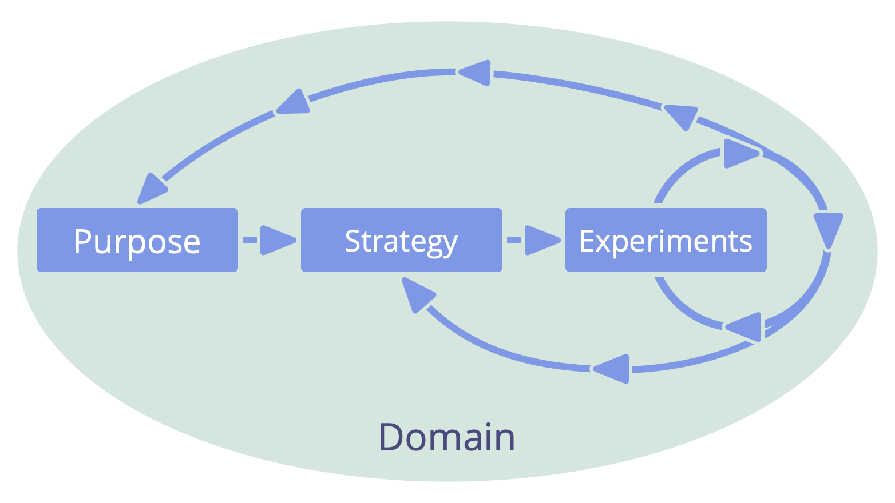
        

    

    <figcaption>Strategies are validated and refined through experimentation and learning.</figcaption>
</figure>

#### Design Adaptable Systems

Develop a coherent set of constraints that enable the organization to easily adapt and grow to meet changing demand, customer requirements, and market conditions.

#### Align Flow

In support of a continuous flow of value, move decision-making close to where value is created, and align the flow of information accordingly.

**Flow of value:** Deliverables traveling through an organization towards customers or other stakeholders.

Achieve and maintain alignment of flow through the continuous evolution of an organization's body of <a href="glossary.html#entry-policy" class="glossary-tooltip" data-toggle="tooltip" title="Policy: An intervention that is created and evolved through governance; a process, procedure, protocol, plan, strategy, or guideline.">policies</a>:

-   ensure all decisions affecting the flow of value actually support the flow of value
-   enable people with relevant skills and knowledge to influence decisions
-   make available any helpful information
-   aim for shorter feedback loops to amplify learning.

When decision-making is conducted close to where value is created, and the flow of information supports the continuous and steady flow of value, the potential for accumulation of waste is significantly reduced.

<figure class="fig fig--limit-width fig--scale-full">
    

        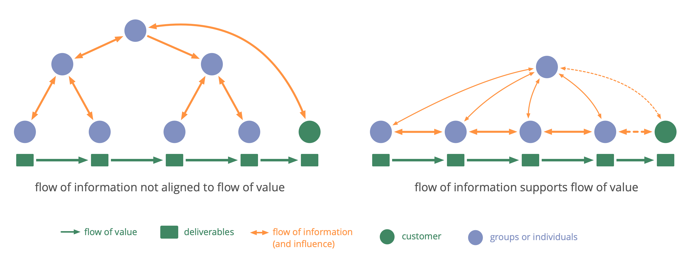
        

    

    <figcaption>Aligning the flow of information to support the flow of value</figcaption>
</figure>

#### Open Systems

Intentionally communicate with and learn from others outside of your system.

Individuals, teams and entire organizations can acknowledge interdependence and intentionally invite people from outside their system to bring in **knowledge, experience and influence** to assist with decision-making and support collective learning.

-   **External experts** can offer an outside perspective and bring knowledge, understanding and skills
-   **Representatives of affected parties** can inform and influence decision-making in ways that benefit overall objectives (see _Involve Those Affected_)

#### Requirements Mapping

A workshop format for large groups to co-create and organize themselves in response to a complex situation of significant scope and scale.

##### Overview

During the workshop, stakeholders take full ownership of the process from start to finish, as they progress quickly from concept to fully functioning collaboration.

Identify relevant stakeholders, map out related requirements, and use them to identify work items and decisions that need to be made, distribute work, and define an initial structure for collaboration.

You can use Requirements Mapping to:

-   organize start-ups
-   kick-off projects
-   tackle major impediments or opportunities
-   implement strategy
-   develop an organizational structure to better enable the flow of value

The outcome of a Requirements Mapping workshop is typically:

-   a distribution of work, categorized in a number of domains, centered around the needs of stakeholders.
-   a bespoke organizational structure that brings it all together, including interlinking domains for managing dependencies.
-   a first draft of prioritized governance and operations backlogs for each identified subdomain.
-   delegation of influence and the distribution of people to the subdomains through self-selection and nomination.

Although Requirements Mapping is often used for identifying and defining new domains, there are also applications for identifying and distributing governance and operational drivers among existing domains in an organization, e.g. when an initiative will be dealt with by existing teams in an organization, or if a group feels they're stuck in their current structure and are looking for inspiration for how to incrementally adapt it. The group can decide if they would map to existing domains and figure out which new ones they'd need to create, or even create a new structure from scratch.

In a small team or circle (max. 6-8 people), when it's not a priority to distribute work, the team might only use steps 1-5 to understand the scope and fill the operations and governance backlog, and then use proposal forming or some other approach for identifying strategy and/or next steps.

In preparation:

-   Invite people who can make a relevant contribution to this project. Send out the agenda for the workshop ahead of time.
-   Send out a description of the primary driver and the main requirement you'll work with, and in case of an existing domain, the domain description for the project/initiative in advance, so people can familiarize themselves with it. Aim to resolve any objections before the workshop.
-   Attendees can prepare by thinking through and recording ideas of actors and relating needs.
-   Prepare a poster with the domain description to present in the first step. You will also need A5 and rectangular sticky notes, pens, and a wide wall to work on.

##### The Requirements Mapping Process

These are the steps to follow:

<figure class="fig fig--limit-both fig--scale-normal">
    

        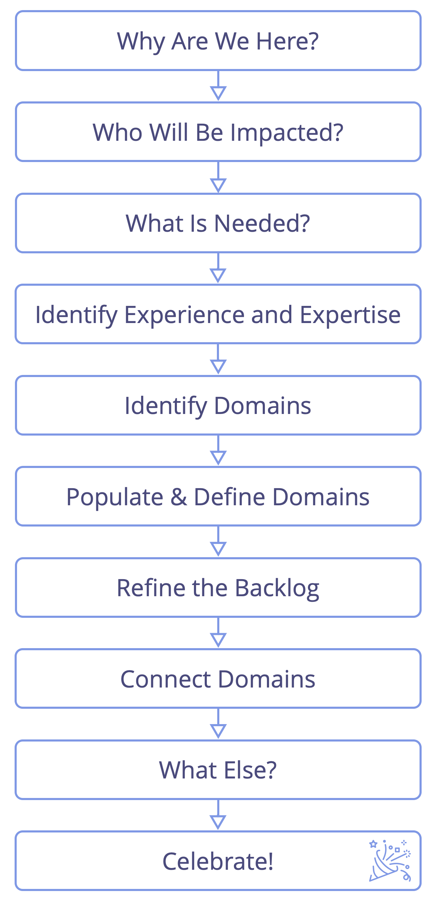
        

    

    <figcaption>Requirements Mapping: Process</figcaption>
</figure>

###### 1. Why Are We Here?

_Present and consent to the primary driver and main requirement._

-   Present the primary driver and main requirement to the group
-   Consent to the driver and requirement — _Is the description of the driver and requirement clear enough? Is this an organizational driver? Is this driver relevant for the group to respond to? And, is the main requirement suitable?_
-   Clarify any existing constraints from the delegator, e.g., budget, due date, expectations, etc. In the case of an existing domain, present the domain description. Invite further questions that help deepen understanding about what's happening and what's needed.
-   Make explicit the level of commitment expected from the participants, e.g., people are expected to be here for the duration of the workshop only, or for the duration of the initiative, etc.
-   Record any relevant information that comes up.

###### 2. Who Will Be Impacted?

_Who will be impacted as we fulfill the related requirement? Consider who can help, stand in the way, benefit, lose, or be harmed._

-   List actors on sticky notes and display them on a board
-   Focus on actual people that will be impacted by this initiative (groups or individuals), and avoid making assumptions about future roles (such as _Project Manager_) or other domains (e.g., _Marketing_) at this stage.

###### 3. What Is Needed?

_Consider the various actors and describe what is needed: what do they need in the context of the primary driver and main requirement, and what do we need from them?_

-   Write each suggestion on a separate sticky note (requirement card)
-   Describe the intended outcome and the enabling conditions that will lead to achieving that outcome 
-   Use the format _"We/they need <enabling conditions> so that <intended outcome>"_
-   Add the name of the actor in the top left corner of the card
-   Add your name in the top right corner of the card

<figure class="fig fig--limit-width fig--scale-small">
    

        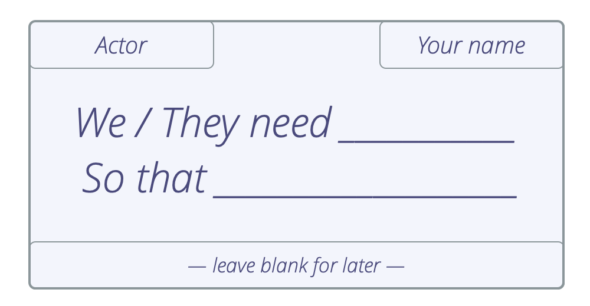
        

    

    <figcaption>Requirements Mapping: A Requirement Card</figcaption>
</figure>

###### 4. Identify Experience and Expertise

_Identify who has experience or expertise in responding to these needs, so that later, when people respond to a specific need, they know who might have valuable input._

-   Take time to familiarize yourself with the various _requirement cards_.
-   Add your name to those _requirement cards_ you have experience with, or ideas on how to address, so that later in the process, people can consult with you if helpful.
-   Consider adding names of people who are not present if you think they would have a valuable contribution to make.
-   Write the name(s) of these people at the bottom of the _requirement card_.
-   Adding your name to a card in this step doesn't mean you're taking responsibility for the requirement, only that you're able and willing to contribute to finding a solution if that's helpful later.

###### 5. Identify Domains

_Cluster actors and/or requirements according to relevance into coherent domains as a starting point for sorting and prioritizing needs. Consider how to optimize end-to-end delivery of value to the various actors that you identified in step 2._

Ways to identify domains:

-   Cluster groups of similar actors (actor-centric)
-   Cluster groups of similar requirements (needs-centric)
-   A combination of both (of the above) is common

Consider this step complete as soon as you've agreed on a first iteration of a meaningful distribution of work. Remember, you can make changes to the domains you defined at any time (later during the workshop or afterward), so you only need to aim for something that's good enough to start.

As a facilitator, gently support the group in self-organizing, and be mindful of people dropping out of the conversation. This process often includes a phase that appears chaotic to some participants, which might make them feel uncomfortable. To test if a result is achieved, ask for objections to the domains being good enough for now.

###### 6. Populate & Define Domains

_People organize into smaller teams around the different domains, then define the domain and give it a name._

-   Form small teams around the domains according to experience and interest
-   Add at least 1 or 2 people with expertise first. Use the information on the cards,
-   Check that all domains are sufficiently accounted for
-   In each group:
    -   Agree on a name for the domain.
    -   Define the primary driver and main requirement for the domain (and draft a brief domain description if helpful).
-   Finally, have each group briefly present their domain, and during each report, look out for dependencies and any overlap of these domains.

In this phase, some people might wander between domains until they find one they feel they can contribute to.

###### 7. Refine the Backlogs

_Organize the work that lies ahead in each domain, and ensure things are prioritized and described clearly._

-   For each domain, copy the template below to a flip chart
-   Sort all remaining requirements into the two backlogs on the flip chart:
    -   operations backlog: needs that can be acted on
    -   governance backlog: needs that would benefit from or necessitate a decision
-   Combine and rephrase cards as necessary, so that the description on each card is clear. Consult the author of the card when in doubt.
-   Prioritize the cards in each board.
-   Archive any _requirement cards_ that appear superfluous.
-   Consider the domain and describe and prioritize other requirements that may not have been identified.
-   Pass on cards that appear to be the accountability of another domain to address.
-   Put aside cards relating to multiple domains. You can deal with them in Step 8.

As a facilitator of the requirements mapping process, provide a space to collect cards concerning multiple domains so that they can be addressed later.

Regularly pause to share reports between the various domains. Note: Some domains might dissolve, change, or merge with others.

<figure class="fig fig--limit-width fig--scale-small">
    

        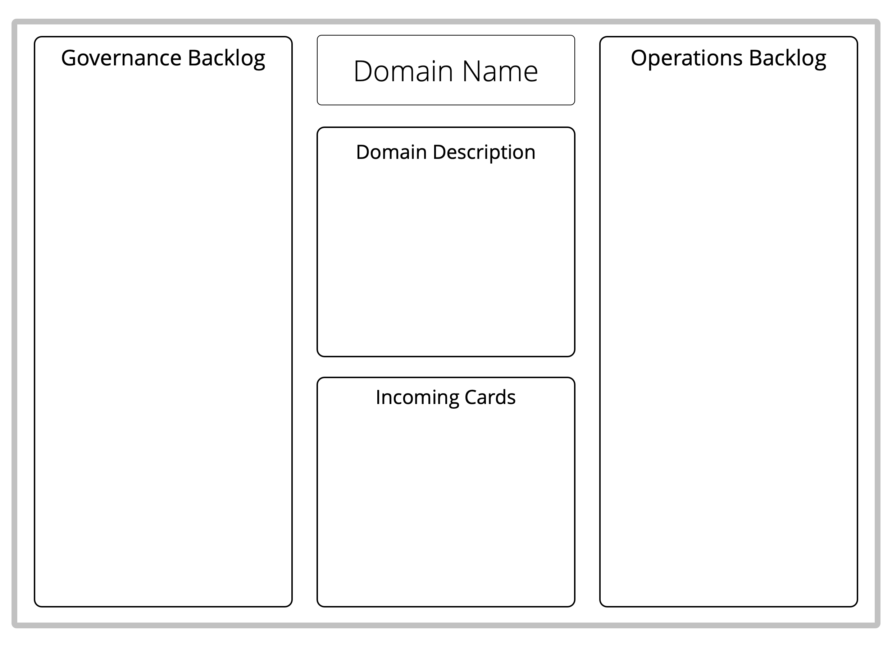
        

    

    <figcaption>Requirements Mapping: A template for domains</figcaption>
</figure>

###### 8. Connect Domains

_Create a structure to manage dependencies and deal with matters that extend beyond the scope of one domain or concern the wider organization_

-  For a new organization or project, consider _Delegate Circles_, _Service Circles_, or _Double-linking between domains_.
-  For an existing organization, also consider connecting to existing domains in the organization.

###### 9. What Else?

_Take a moment to check if anything's missing._

What else do we need to consider …

-  … to run safely?
-  … to effectively fulfill the main requirement?

###### 10. Celebrate!

_Take a moment to celebrate your achievements in getting your organization or initiative started!_

### Peer Development

#### Ask for Help

A simple protocol for learning, skill sharing, and building connections, with respect for people's agency.

Ask someone, "_would you be willing to help me with …_?" The person asked accepts or declines with a simple "_yes_" or "_no_".

-   if the request is declined, the person asking accepts the answer without negotiation or inquiry
-   if the request is unclear, inquire for more information
-   if you accept a request for help, support your peer in the best way you can

#### Peer Feedback

Invite any member of your organization to give you some constructive feedback on your performance in a role or in a team, about your general participation and contribution, or about any other area you wish to develop.

Before the invitation, consider who might be able and willing to provide the feedback you seek, and decide on an appropriate duration — 15 or 30 minutes is usually enough.

Schedule the session in advance, so that your peer can prepare for your meeting, and schedule some time for yourself after the session to decide how you will act on the feedback you received.

In the invitation, clarify the topic you want feedback on, and explain that you are looking for both **appreciations** and **actionable improvement suggestions**.

During the session itself, consider:

-   taking notes to ensure you can remember the details
-   repeating back, feedback you receive in your own words to check for the accuracy of your understanding
-   asking clarifying question to better understand feedback if the intended meaning is unclear for you 

Avoid discussing or judging the feedback you receive and remember to thank your peer for taking the time to give you their feedback. 

After the session, review your notes and decide for yourself what you will do with the feedback you received. It's your choice if you want to share your decision with your peer.

#### Peer Review

Support each other to learn and grow in the roles and teams you serve in.

The role keeper — or team — leads the peer review by setting up the process, and by speaking first in each step.

<figure class="fig fig--limit-width fig--scale-small">
    

        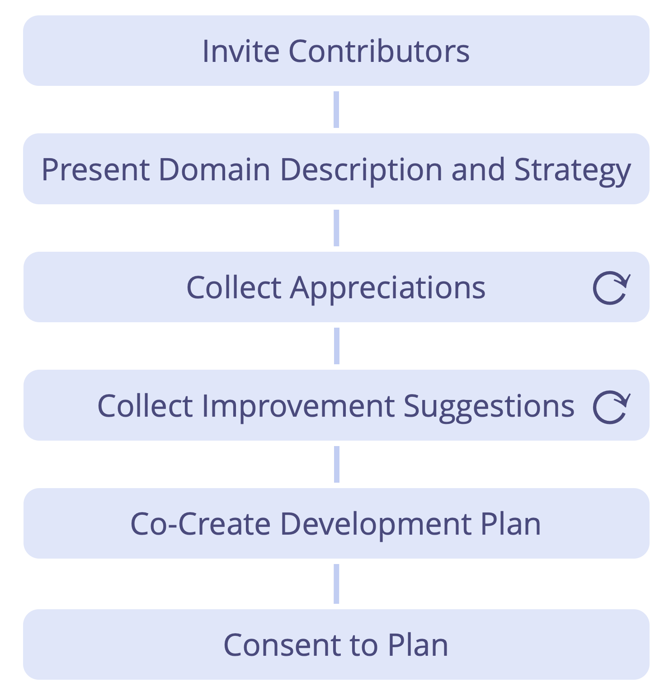
        

    

    <figcaption>Peer review process</figcaption>
</figure>

Ensure you invite people with complementary perspectives to contribute to the review, and a _facilitator_.

For both appreciations and improvement suggestions, ensure you consider the following aspects:

-   The **value** the delegatee brought to the organization by accounting for the <a href="glossary.html#entry-domain" class="glossary-tooltip" data-toggle="tooltip" title="Domain: A distinct area of responsibility and authority within an organization.">domain</a>.
-   The role keeper's or team's **work processes**, and their **collaboration** with the <a href="glossary.html#entry-delegator" class="glossary-tooltip" data-toggle="tooltip" title="Delegator: An individual or group delegating responsibility for a domain to other(s).">delegator</a> and with other relevant stakeholders, and — in the case of a team — with each other.
-   How well the **delegator** takes care of their responsibilities.
-   The **design of the domain** itself (and potentially the design of other related domains).
-   The role keeper's or team's **competencies and skills** in relation to the domain.
-   The **<a href="glossary.html#entry-strategy" class="glossary-tooltip" data-toggle="tooltip" title="Strategy: A high-level approach for how people will fulfill the purpose of a domain (within the constraints of that domain).">strategy</a>** the role keeper or team follows to attend to this domain.

<figure class="fig fig--limit-both fig--scale-normal">
    

        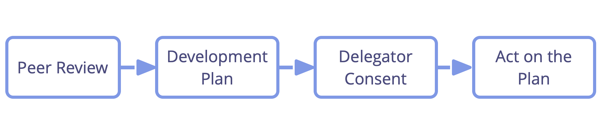
        

    

    <figcaption>Continuous improvement of people's ability to effectively keep roles or collaborate in teams</figcaption>
</figure>

#### Development Plan

A plan for how to develop more effective ways of accounting for a domain, agreed between delegator and delegatee.

The development plan may be created for a person in a role, or for a team (e.g. a department, _circle_ or _open team_).

Development may happen in the form of refining the _description of the driver_ and the <a href="glossary.html#entry-domain" class="glossary-tooltip" data-toggle="tooltip" title="Domain: A distinct area of responsibility and authority within an organization.">domain</a>, making amendments to <a href="glossary.html#entry-strategy" class="glossary-tooltip" data-toggle="tooltip" title="Strategy: A high-level approach for how people will fulfill the purpose of a domain (within the constraints of that domain).">strategy</a>, or new or updated policies and specific actions to be taken, either within the domain of the delegator, or the domain of the delegatee.

A development plan (and any accompanying recommendations for changes to the descriptions of the domain and the <a href="glossary.html#entry-organizational-driver" class="glossary-tooltip" data-toggle="tooltip" title="Organizational Driver: A situation where the organization&#x27;s members have a motive to respond because they anticipate that doing so is beneficial or necessary for fulfilling the organization’s purpose. (by helping generate value, eliminate waste, or avoid undesirable risks or consequences). Drivers are often expressed as _current conditions_ that lead to current or anticipated _effects_ that are _relevant_ to the organization.">driver</a>) requires consent from both the <a href="glossary.html#entry-delegatee" class="glossary-tooltip" data-toggle="tooltip" title="Delegatee: An individual or group accepting responsibility for a domain delegated to them, becoming a role keeper or a team.">delegatee</a> and the <a href="glossary.html#entry-delegator" class="glossary-tooltip" data-toggle="tooltip" title="Delegator: An individual or group delegating responsibility for a domain to other(s).">delegator</a>.

<figure class="fig fig--limit-both fig--scale-normal">
    

        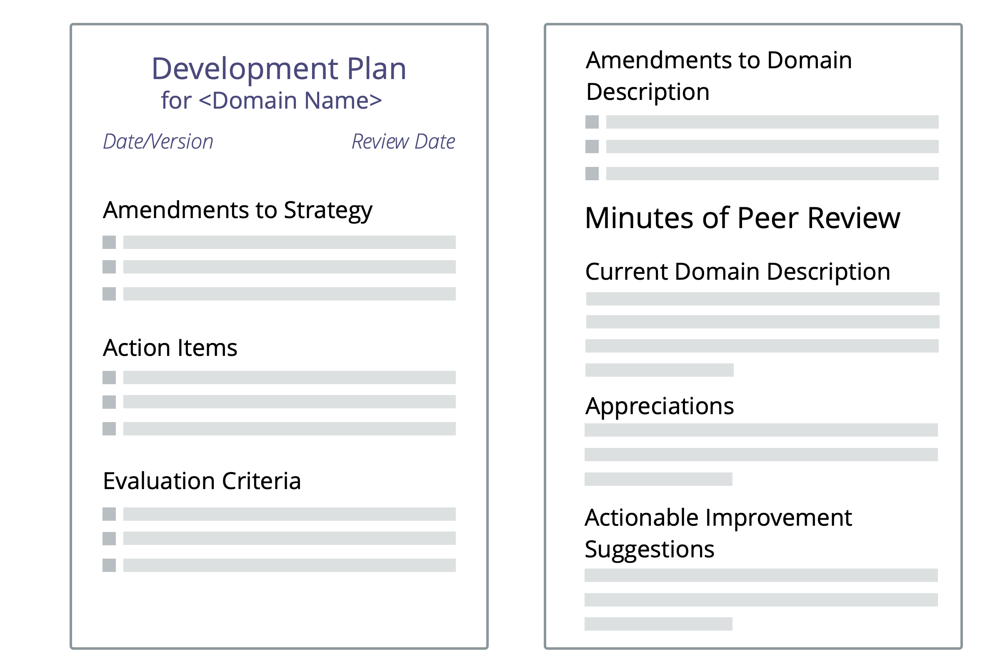
        

    

    <figcaption>A template for development plans</figcaption>
</figure>

### Enablers of Co-Creation

#### Artful Participation

Commit to doing your best to act and interact in ways that enable effective collaboration.

"_Is my behavior in this moment the greatest contribution I can make to the effectiveness of this collaboration?_"

Participating artfully may include interrupting, objecting to or even breaking <a href="glossary.html#entry-policy" class="glossary-tooltip" data-toggle="tooltip" title="Policy: An intervention that is created and evolved through governance; a process, procedure, protocol, plan, strategy, or guideline.">agreements</a>.

_Artful Participation_ is an **individual commitment** to:

-   actively **consider and follow-up on all agreements** made, in the best way possible, given the circumstances
-   **develop awareness and understanding** of individual and collective needs
-   **grow the necessary skills**
-   **support others** to participate artfully
-   bring impediments and improvement suggestions to the attention of others if necessary

##### Benefits Of Artful Participation

Artful participation:

- enables co-creation and evolution of policies
- helps to grow stronger teams
- builds self-accountability, integrity and trust
- generates a culture of mutual support and close collaboration
- is more powerful when embraced by many

<figure class="fig fig--limit-both fig--scale-normal">
    

        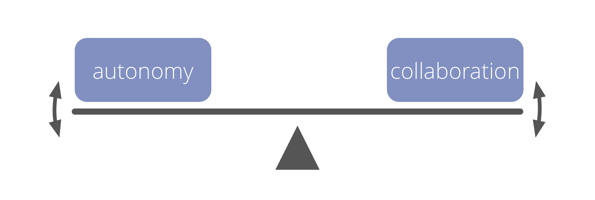
        

    

    <figcaption>Balance autonomy and collaboration through artful participation</figcaption>
</figure>

##### Artful Participation: Self-Assessment

-   How can I support myself and others to participate more artfully?
-   Where are my interactions with others unhelpful or ineffective?
-   Which policies do I find hard to adhere to? What can I do to address this?
-   What skills can I develop that would support me to participate more artfully?
-   What would artful participation mean in relation to:
    -   my daily activities?
    -   collaboration and interaction with others?
    -   the organization? 
    -   our customers or clients?
    -   the wider environment?

#### Agree On Values

Intentionally evolve the culture in your organization.

_**Values** are valued principles that guide behavior. Values define scope for action and ethical constraints._

-   each member brings their own values to an organization based on personal experiences and beliefs
-   a team or organization may **choose to collectively adopt values** to guide their collaboration

Values offer guidance to determine appropriate action, even in the absence of explicit <a href="glossary.html#entry-policy" class="glossary-tooltip" data-toggle="tooltip" title="Policy: An intervention that is created and evolved through governance; a process, procedure, protocol, plan, strategy, or guideline.">policies</a>.

Collectively adopting a set of values supports the effectiveness of an organization:

-   reduces potential for **misunderstanding**
-   helps to **align** decision-making and action
-   **attracts new members, partners and customers** who are aligned with the organization

Chosen values are a policy that benefits from **regular review**.

<figure class="fig fig--limit-width fig--scale-small">
    

        
        

    

    <figcaption>Chosen values define constraints for collaboration</figcaption>
</figure>

#### Involve Those Affected

Involve people in making decisions that affect them, to maintain equivalence and accountability, and to increase the amount of information available on the subject.

For larger groups:

-   facilitate a process in several stages and create smaller groups who select delegates
-   use an online tool and conduct an asynchronous, _time-boxed_ and staged process

Consider including those affected in reviewing and evolving decisions, too.

#### Invest in Ongoing Learning

Make continuous learning an integral part of people’s responsibilities and work, so that they continuously develop their capacity to contribute effectively toward the purpose of the organization.

#### Breaking Agreements

Break agreements when you are certain the benefit for the organization outweighs the cost of waiting to amend that agreement first, and take responsibility for any consequences.

Breaking (formal and informal) agreements is sometimes **necessary** but may come at a **cost** to the community.

Be accountable:

-   **clean up** disturbances
-   **follow up** as soon as possible with those affected
-   **change the agreement** instead of repeatedly breaking it

#### Financial Transparency

Share relevant information about financial performance with the organization’s members to build trust and accountability and support them in making informed decisions regarding their work.

#### Share Costs and Gains

Ensure that people have a direct relationship to the costs and gains resulting from their work, so that they are incentivized to give their best, work effectively, and minimize waste.

#### Open Salary

Create a fair salary formula and make it transparent.

Open salary (also referred to as "transparent salary") is the practice of determining each employee's compensation according to a set of rules — the _salary formula_ — instead of making compensation subject to individual negotiation between employer and employee. The salary formula — and often individual compensation as well — is transparent to all members of an organization, and sometimes to the public.

A open salary formula needs to suit an organization's context, and to be perceived as fair enough by all stakeholders.

Perception of fairness varies from person to person and according to context, so creating a salary formula requires developing a shared understanding of what is considered fair.

When deciding (or agreeing) on a salary formula for an organization or department, consider:

- what would be a suitable fixed subsistence guarantee
- how to calculate compensation according to need, investment, productivity, or merit
- how to distribute the organization's profit and cover for losses in line with expectations and needs of the various stakeholders

Decide how to handle remuneration for changing roles and _develop a strategy_ for how to transition towards new contracts and compensation agreements.

<figure class="fig fig--limit-both fig--scale-normal">
    

        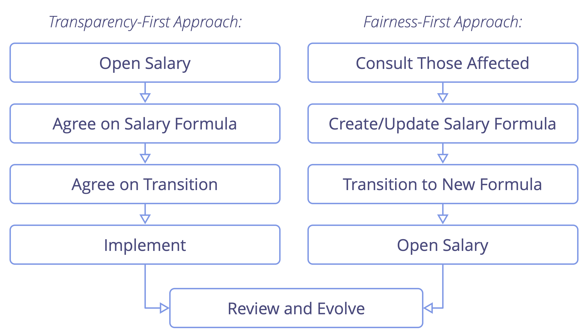
        

    

    <figcaption>Two ways of opening salaries</figcaption>
</figure>

#### Support Role

Apply the role pattern to external contractors.

-   clarify and describe the <a href="glossary.html#entry-organizational-driver" class="glossary-tooltip" data-toggle="tooltip" title="Organizational Driver: A situation where the organization&#x27;s members have a motive to respond because they anticipate that doing so is beneficial or necessary for fulfilling the organization’s purpose. (by helping generate value, eliminate waste, or avoid undesirable risks or consequences). Drivers are often expressed as _current conditions_ that lead to current or anticipated _effects_ that are _relevant_ to the organization.">driver</a> for the _role_
-   create a _domain description_
-   if valuable, implement a selection process
-   consider limiting the term of the contract, after which point it can be reviewed and renewed if necessary
-   build in regular _peer reviews_

External contractors consent to take on their role.

**See also:** _Contract For Successful Collaboration_

#### Bylaws

Secure S3 principles and patterns in your bylaws as needed to protect <strong>legal integrity</strong> and <strong>organizational culture</strong>.

Consider:
   
-   consent and equivalence in decision-making
-   selection process for leadership roles
-   organizational structure, <a href="glossary.html#entry-values" class="glossary-tooltip" data-toggle="tooltip" title="Values: Valued principles that guide behavior. Not to be confused with &quot;value&quot; (singular) in the context of a driver.">values</a> and <a href="glossary.html#entry-principle" class="glossary-tooltip" data-toggle="tooltip" title="Principle: A basic idea or rule that guides behavior, or explains or controls how something happens or works.">principles</a>
-   influence of owners or shareholders
-   sharing gains and costs

### Building Organizations

#### Circle

A circle is a self-governing and semi-autonomous team of equivalent people who collaborate to account for a domain.

Circles are a type of team that provides a mechanism for more effective collaboration by distributing responsibility for governance throughout an organization. 

A circle's members work together toward a common purpose: They share responsibility for a specific domain and are entrusted with the formal authority to govern and operate within the constraints of that domain in order to achieve their common purpose. 

Members continuously decide together what to do to account for their domain, and set constraints on how and when things will be done. To that end, they maintain and evolve a body of <a href="glossary.html#entry-policy" class="glossary-tooltip" data-toggle="tooltip" title="Policy: An intervention that is created and evolved through governance; a process, procedure, protocol, plan, strategy, or guideline.">policies</a>. All members of a circle are equally accountable for work and <a href="glossary.html#entry-governance" class="glossary-tooltip" data-toggle="tooltip" title="Governance: The sum of activities involved in setting objectives and making and evolving decisions (policies) that guide people toward achieving those objectives, for the entire organization or specific people within it.">governance</a> within the circle's domain.

While not every team needs to be a circle, in general, circles enable faster and more effective decision-making, increase self-accountability and engagement, and therefore improve an organization's capacity to navigate complexity and respond promptly to changing circumstances.

Establishing circles enables greater autonomy and fosters co-responsibility for achieving outcomes and improving how work gets done.

<figure class="fig fig--limit-both fig--scale-normal">
    

        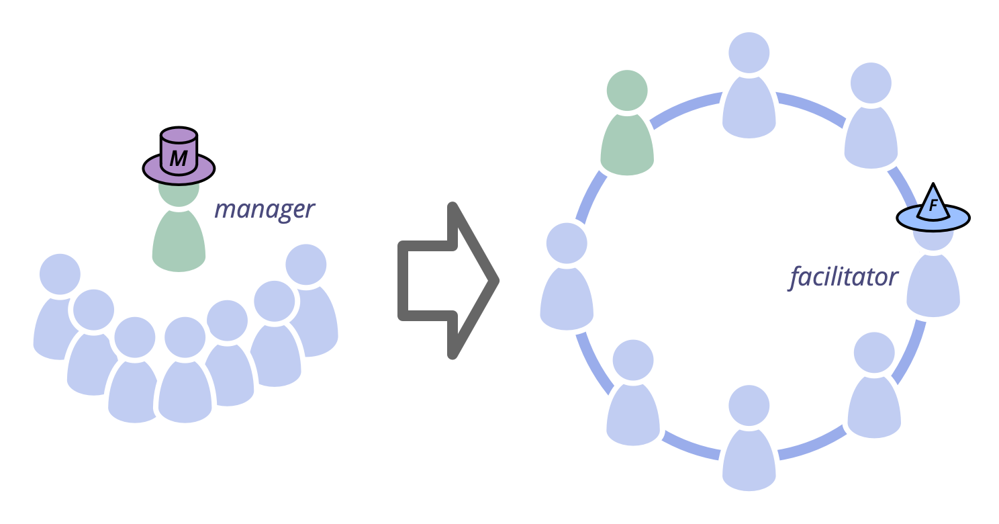
        

    

    <figcaption>From Managed Teams to Self-governing Circles</figcaption>
</figure>

A circle's members work best when their domain is defined in a way that eliminates unnecessary and unhelpful dependencies that get in the way of creating and delivering <a href="glossary.html#entry-value" class="glossary-tooltip" data-toggle="tooltip" title="Value: The importance, worth, or usefulness of something for fulfilling a purpose. Also: &quot;a valued principle that guides behavior&quot; (mostly used as plural &quot;values&quot;, e.g. &quot;organizational values&quot;).">value</a> effectively.

Circles may be permanent or temporary and can be composed of individuals holding specific roles or working together as a team.

##### Semi-Autonomous and Self-Governing

A circle is **semi-autonomous** because its members act within the boundaries of their domain, including any external constraints. It is also **self-governing** to a degree: members have explicit authority to decide how to fulfill the purpose of their domain, provided they remain within any explicitly defined limits. Their authority for governance covers **everything explicitly granted**, plus everything **not explicitly forbidden** by broader organizational policies.

The scope of authority for governance often includes responsibility for deciding specifics for how governance is handled, deciding how work is organized and done, improving work processes, and supporting ongoing professional development, with the necessary time and resources allocated for doing so.

A circle's members typically have the authority to distribute their responsibilities amongst themselves. They may also have the authority to delegate some of their responsibilities to others in the organization or even to recruit new people when needed.

**Note**: In the context of agile methodologies, teams are often loosely described as <a href="glossary.html#entry-self-organization" class="glossary-tooltip" data-toggle="tooltip" title="Self-Organization: Any activity or process through which people organize work. Self-organization happens within the constraints of a domain, but without the direct influence of  external agents. In any organization or team, self-organization co-exists with external influence (e.g. external objections or governance decisions that affect the domain).">self-organizing</a>. However, this term does not distinguish between operations and governance. Being explicit about a team's area of authority relating to governance makes expectations explicit, reduces misunderstanding, and prevents various stakeholders from overstepping boundaries by clarifying who is responsible for what.

###### Equivalence

All members of a circle are considered equivalent in the governance of the circle's domain, within the constraints defined by their delegator. Each has equal opportunity to participate in making and evolving decisions that define how the circle functions.

Together, a circle's members share the responsibility for setting objectives and defining or evolving policies that guide their work. They also share responsibility for ensuring that the decisions they make and the activities that follow are in alignment with broader organizational objectives and coherent with wider organizational policies.

<figure class="fig fig--limit-both fig--scale-normal">
    

        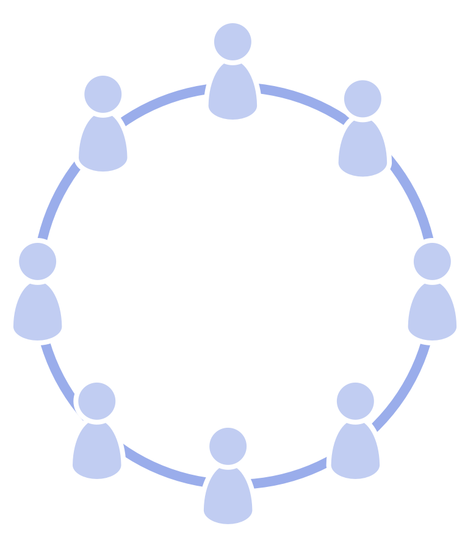
        

    

    <figcaption>All members of a circle are equally accountable for governance of the circle's domain</figcaption>
</figure>

##### Responsibilities of a Circle's Members

-   Collaborate to fulfill the domain's purpose.
-   Contribute towards developing and evolving policies for improving effectiveness in fulfilling the domain's purpose. 
-   Ensure transparency and accountability for decisions and actions.
-   Regularly evaluate the design and scope of their domain, and when helpful, collaborate with the delegator to improve its effectiveness.
-   Support one another's development and contribute to the ongoing development of the circle as a cohesive and effective team.

##### Associated Patterns

-   _Clarify and Develop Domains_ — for defining the scope and authority of the circle.
-   _Linking_ and _Double Linking_ — for connecting circles and enabling information flow and influence.
-   _Role Selection_ — for assigning specific responsibilities within the circle.
-   _Evaluate and Evolve Policies_ — to continuously improve how the circle operates.
-   _Consent Decision Making_ — for making decisions together.
-   _Proposal Forming_ — for collaborating on creating proposals. \

#### Role

Delegate responsibility for a domain to individuals.

A role is an area of responsibility (a <a href="glossary.html#entry-domain" class="glossary-tooltip" data-toggle="tooltip" title="Domain: A distinct area of responsibility and authority within an organization.">domain</a>) that is <a href="glossary.html#entry-delegation" class="glossary-tooltip" data-toggle="tooltip" title="Delegation: The grant of authority by one party (the delegator) to another (the delegatee) to attend to a domain (i.e. to do certain things or to make certain decisions), for which the delegator maintains overall accountability.">delegated</a> to an individual (the **role keeper**), who has autonomy to decide and act within the constraints of the role's domain.

The role keeper leads in creating a <a href="glossary.html#entry-strategy" class="glossary-tooltip" data-toggle="tooltip" title="Strategy: A high-level approach for how people will fulfill the purpose of a domain (within the constraints of that domain).">strategy</a> for how they will attend to their domain. They evolve their strategy in collaboration with the <a href="glossary.html#entry-delegator" class="glossary-tooltip" data-toggle="tooltip" title="Delegator: An individual or group delegating responsibility for a domain to other(s).">delegator</a>.

A role is a simple way for an organization (or <a href="glossary.html#entry-team" class="glossary-tooltip" data-toggle="tooltip" title="Team: A group of people collaborating toward fulfilling a shared purpose. Typically, a team is part of an organization, or it is formed as a collaboration of several organizations.">team</a>) to delegate recurring tasks or a specific area of work and decision-making to one of its members.

- people can take responsibility for more than one role
- instead of formally setting up a new team, it's sometimes simpler to just share one role between several people
- role keepers are selected by consent and for a limited term
- peers support one another to develop in the roles they keep

A role keeper may maintain a governance <a href="glossary.html#entry-backlog" class="glossary-tooltip" data-toggle="tooltip" title="Backlog: A list of (often prioritized) uncompleted work items (typically a deliverable, requirement or a driver) that need to be addressed.">backlog</a>, and a <a href="glossary.html#entry-logbook" class="glossary-tooltip" data-toggle="tooltip" title="Logbook: A (digital) system to store all information relevant to running an organization.">logbook</a> to record and help them evolve their approach toward delivering <a href="glossary.html#entry-value" class="glossary-tooltip" data-toggle="tooltip" title="Value: The importance, worth, or usefulness of something for fulfilling a purpose. Also: &quot;a valued principle that guides behavior&quot; (mostly used as plural &quot;values&quot;, e.g. &quot;organizational values&quot;).">value</a>.

**Note:** In S3, guidelines, processes or protocols created by individuals in roles are treated as <a href="glossary.html#entry-policy" class="glossary-tooltip" data-toggle="tooltip" title="Policy: An intervention that is created and evolved through governance; a process, procedure, protocol, plan, strategy, or guideline.">policies</a>.

<figure class="fig fig--limit-width fig--scale-small">
    

        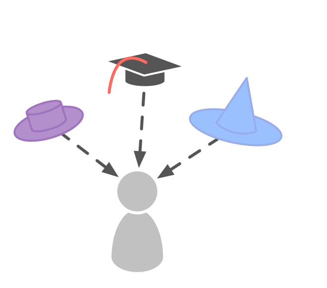
        

    

    <figcaption>People can take responsibility for more than one role</figcaption>
</figure>

#### Linking

Enable the flow of information and influence between two teams.

A team selects one of its members to represent their interests in the <a href="glossary.html#entry-governance" class="glossary-tooltip" data-toggle="tooltip" title="Governance: The sum of activities involved in setting objectives and making and evolving decisions (policies) that guide people toward achieving those objectives, for the entire organization or specific people within it.">governance</a> decisions of another team.

<figure class="fig fig--limit-width fig--scale-small">
    

        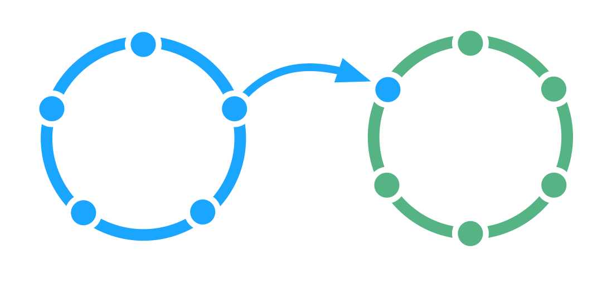
        

    

    <figcaption>One circle linked to another circle</figcaption>
</figure>

#### Double Linking

Enable the <em>two-way</em> flow of information and influence between two teams.

Two interdependent teams each select one of their members to represent their interests in the <a href="glossary.html#entry-governance" class="glossary-tooltip" data-toggle="tooltip" title="Governance: The sum of activities involved in setting objectives and making and evolving decisions (policies) that guide people toward achieving those objectives, for the entire organization or specific people within it.">governance</a> decisions of the other team.

Double linking enables equivalence between two teams and can be used to draw out valuable information in hierarchical structures.

<figure class="fig fig--limit-width fig--scale-small">
    

        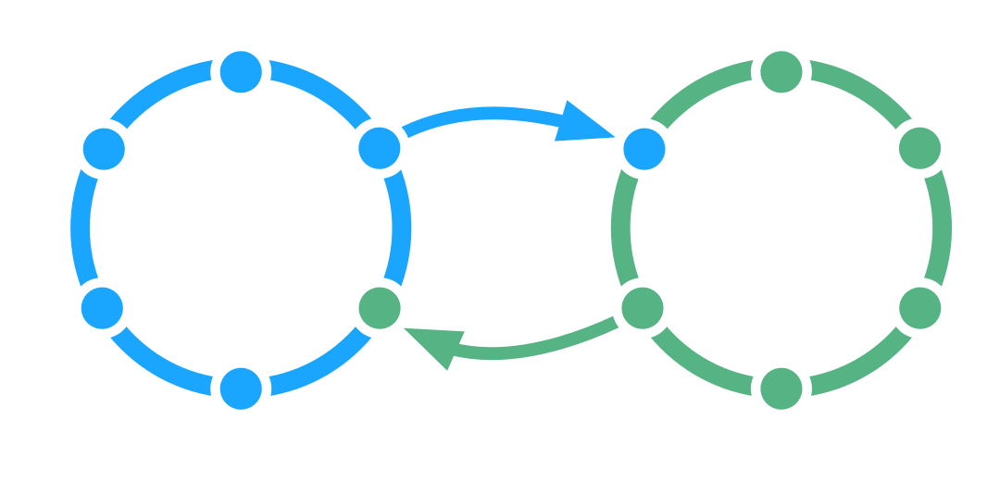
        

    

    <figcaption>Double linking two circles</figcaption>
</figure>

#### Representative

Select a team member to participate in the governance decision-making of another team to enable the flow of information and influence.

Representatives (a.k.a. links):

-   stand for the interests of one <a href="glossary.html#entry-team" class="glossary-tooltip" data-toggle="tooltip" title="Team: A group of people collaborating toward fulfilling a shared purpose. Typically, a team is part of an organization, or it is formed as a collaboration of several organizations.">team</a> in another team
-   are selected for a limited term
-   participate in the **governance decision-making** of the team they link with, and can:
    -   raise items for the agenda
    -   participate in forming proposals
    -   raise <a href="glossary.html#entry-objection" class="glossary-tooltip" data-toggle="tooltip" title="Objection: An argument – relating to a proposal, existing decision, or activity being conducted by one or more members of the organization – that reveals consequences or risks that are preferably avoided for the organization or that demonstrates worthwhile ways to improve.">objections</a> to proposals and <a href="glossary.html#entry-policy" class="glossary-tooltip" data-toggle="tooltip" title="Policy: An intervention that is created and evolved through governance; a process, procedure, protocol, plan, strategy, or guideline.">policies</a>

#### Delegate Circle

Delegate making governance decisions affecting multiple domains to representatives selected by those domains.

To make <a href="glossary.html#entry-governance" class="glossary-tooltip" data-toggle="tooltip" title="Governance: The sum of activities involved in setting objectives and making and evolving decisions (policies) that guide people toward achieving those objectives, for the entire organization or specific people within it.">governance</a> decisions on their behalf, stakeholders send _representatives_ to form a delegate circle.

<figure class="fig fig--limit-both fig--scale-normal">
    

        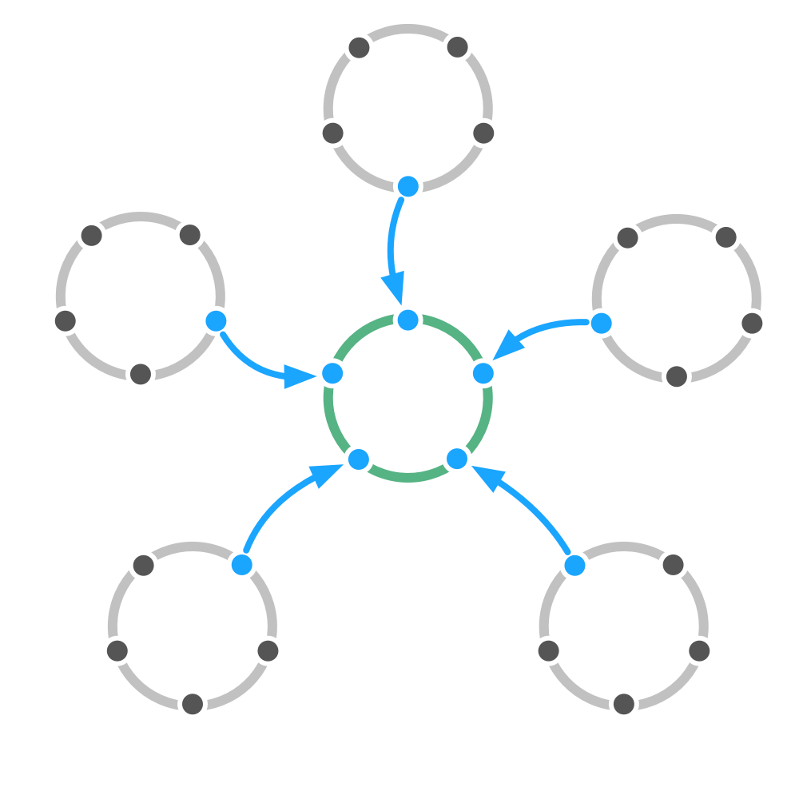
        

    

    <figcaption>Delegate Circle</figcaption>
</figure>

Governance decisions made in a delegate circle are acted upon in the various <a href="glossary.html#entry-domain" class="glossary-tooltip" data-toggle="tooltip" title="Domain: A distinct area of responsibility and authority within an organization.">domains</a> it serves.

Delegate circles provide a way of steering organizations in alignment with the <a href="glossary.html#entry-flow-of-value" class="glossary-tooltip" data-toggle="tooltip" title="Flow of Value: Deliverables traveling through an organization towards customers or other stakeholders.">flow of value</a>, and bring a diversity of perspectives to governance decision-making.

A delegate circle may bring in other people (e.g. external experts) to help with specific decisions, or even as a member of the circle.

#### Service Circle

Outsource services required by two or more domains.

A service circle can be populated by members of the <a href="glossary.html#entry-domain" class="glossary-tooltip" data-toggle="tooltip" title="Domain: A distinct area of responsibility and authority within an organization.">domains</a> it serves, and/or by other people too.

<figure class="fig fig--limit-both fig--scale-normal">
    

        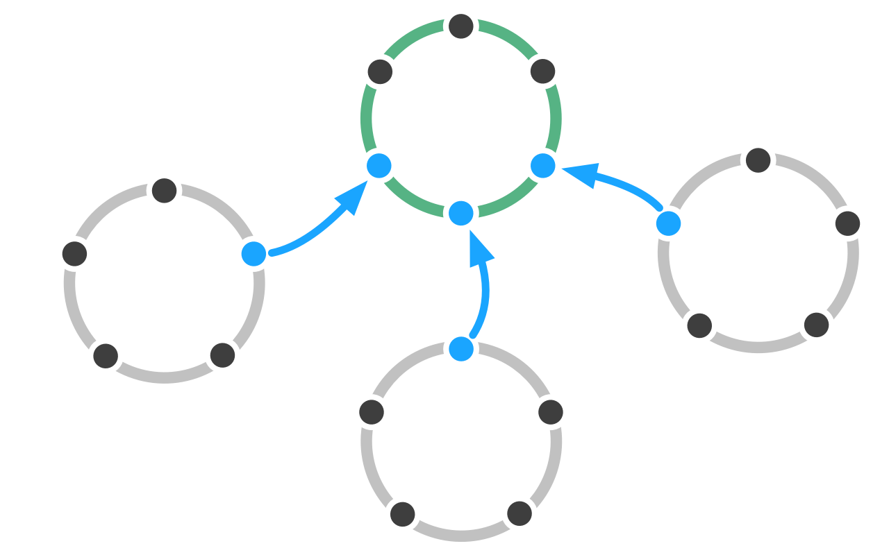
        

    

    <figcaption>Service Circle</figcaption>
</figure>

#### Open Team

Intentionally attend to a domain by invitation rather than assignment, and request that those invited contribute when they can.

_An **open team** is a group of people who are invited to contribute to the work and governance done in a domain when they can._

The <a href="glossary.html#entry-delegator" class="glossary-tooltip" data-toggle="tooltip" title="Delegator: An individual or group delegating responsibility for a domain to other(s).">delegator</a> of the domain creates an invitation that clarifies:

- the <a href="glossary.html#entry-primary-driver" class="glossary-tooltip" data-toggle="tooltip" title="Primary Driver: The primary driver for a domain is the main driver that people who attend to that domain respond to.">primary driver</a>, key responsibilities and constraints of the open team's domain
- who is invited to contribute (the members of the open team)
- constraints relating to the delegator's participation in the open team's <a href="glossary.html#entry-governance" class="glossary-tooltip" data-toggle="tooltip" title="Governance: The sum of activities involved in setting objectives and making and evolving decisions (policies) that guide people toward achieving those objectives, for the entire organization or specific people within it.">governance</a>

Depending on the constraints set by the delegator, contributors may only <a href="glossary.html#entry-operations" class="glossary-tooltip" data-toggle="tooltip" title="Operations: Doing the work and organizing day-to-day activities within the constraints defined through governance.">organize and do work</a>, or take part in governance as well.

The delegator is accountable for conducting regular reviews to support effectiveness of work and any decision-making in the open team.

<figure class="fig fig--limit-height fig--scale-small">
    

        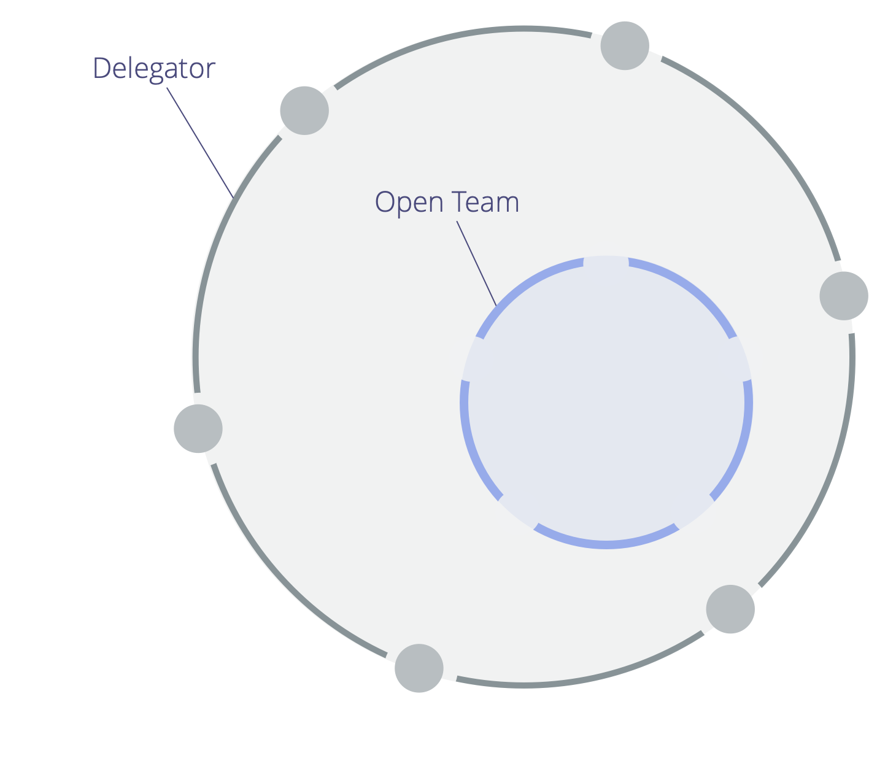
        

    

    <figcaption>Open Team</figcaption>
</figure>

#### Helping Team

Separate responsibility for execution from decision authority when doing so helps increase effectiveness.

A helping team is a way for a <a href="glossary.html#entry-delegator" class="glossary-tooltip" data-toggle="tooltip" title="Delegator: An individual or group delegating responsibility for a domain to other(s).">delegator</a> to **expand their capacity** by delegating work while retaining responsibility for all [governance ]()decisions concerning the team.  You can think of a Helping Team as a way for a delegator to extend their capacity with the help of some extra hands.

The delegator defines the rules, procedures, and constraints within which the team operates.

The team's primary responsibilities are **to execute tasks** and **inform the delegator** whenever they see the need for a governance decision (e.g., by adding it to the delegator's <a href="glossary.html#entry-governance-backlog" class="glossary-tooltip" data-toggle="tooltip" title="Governance Backlog: A visible, prioritized list of items relating to the governance of a domain.">governance backlog</a>).

A Helping Team's members might have *more or less scope to organize their work*, and they might be guided by someone chosen by the delegator (see _Coordinator_).

In an organization that has adopted the principle of consent, team members can still *raise objections* to decisions that affect them. They may even be invited or expected to select a _representative_ to participate in governance decisions concerning the team.

<figure class="fig fig--limit-height fig--scale-small">
    

        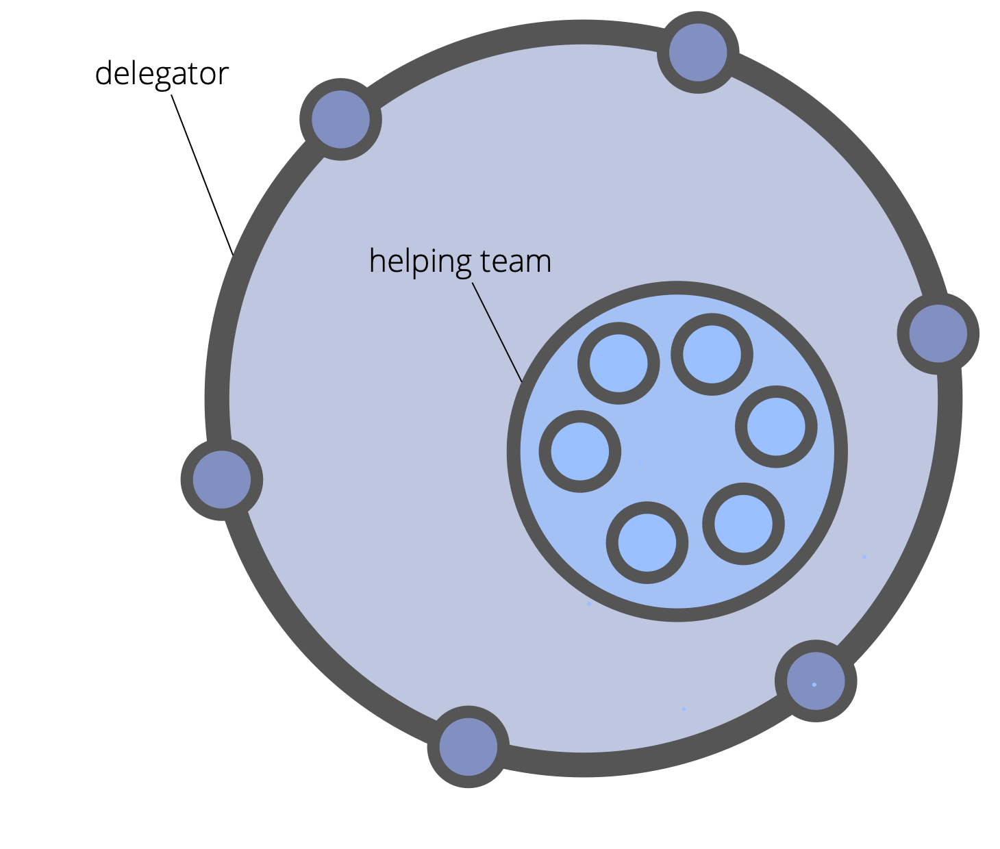
        

    

    <figcaption>Helping Team</figcaption>
</figure>

##### Choosing Between a Circle and a Helping Team

The decision about whether a Circle or a Helping Team is more suitable depends on *purpose, context, and who is involved*.

Managed Helping Teams are prevalent today, but it's worth asking whether this is always the most effective way to set up a team for maximum effectiveness. In many cases, _freeing team members up to decide and act for themselves as much as possible_ regarding not only how they execute and organize their work, but also concerning strategic development and governance of their domain as well, makes a lot of sense. In many cases, a team with more autonomy will be more effective in creating value. In this spirit, a well-designed domain can thoroughly enable a team to create value without the need for further interference or constraints.

However, there are circumstances where a helping team can be more appropriate than a circle: 

-   **Freeing members from the "burden of governance"**: When team members prefer to focus entirely on the work and "just do the job" without the added responsibility for governance.
-   **Lack of expertise**: When the team lacks the experience or necessary knowledge to handle governance decisions.
-   **Clear and effective procedures**: When the tasks are repetitive and do not require ongoing governance evolution by the team.

 In any case, a helping team benefits from a _clearly defined domain_ to ensure that expectations are clear to all involved.

##### Examples for Helping Teams

The following examples illustrate cases where, in their specific context, delegators chose to create a helping team.

**Example 1: Customer Support Team in a Regulated Industry**

A Head of Customer Support is responsible for regulatory interpretation, and support agents handle customer interactions:

-   The Head of Customer Support defines scripts, boundaries, and escalation rules.
-   Agents execute support work within strict constraints.
-   Edge cases go to the governance backlog.
-   Agents are invited to select a representative to participate in governance decisions.

**Why Helping Team fits**: When legal risk makes decentralized governance inappropriate, and clear procedures dominate, effectiveness comes from speed and consistency.

**Example 2: Event Production Crews for a Conference Director**

 A Conference Director oversees the planning, strategic design, and governance of large professional or academic conferences, while execution is carried out by multiple specialized production crews.

The director defines the conference design, strategies, standards, budgets, and key partnerships, and assigns a coordinator for each crew.

The production crews operate within these constraints:

-   **Logistics Crew** ensures operational execution, managing venues, catering, travel, accommodation, and on-site operations.
-   **Program & Speaker Crew** coordinates speakers, workshops, and session schedules.
**Communications & Registration Crew** handles attendee registration, communications, signage, and digital platforms.
-   **Sponsorship & Vendor Crew** liaises with sponsors, exhibitors, and external vendors.

Each crew escalates issues that exceed their delegated authority — such as budget reallocations, major contract changes, or reputational risks — to the director's governance backlog.

**Why Helping Team fits**: Multiple specialized production crews can work in parallel, ensuring efficient execution of complex tasks while the director retains governance over strategic, financial, and reputational risks. Clear boundaries and escalation procedures allow teams to focus on execution, which often aligns with a team's preference under time pressure to "just get it done" rather than engage in governance debates that would slow progress.

**Example 3: Assistant Pool for Senior Executive or Political Leader**

A senior executive or political leader is accountable for strategic decisions, public representation, and overall governance. A pool of assistants supports their work, enabling the leader to focus on high-level priorities.

The leader defines priorities, protocols, and decision thresholds for what the team can handle independently.

The team executes a wide variety of tasks:

-   Preparing briefs and research summaries.
-   Drafting speeches, talking points, and public statements.
-   Creating detailed itineraries for official engagements or journeys.
-   Managing scheduling, correspondence, and logistics.

Issues that exceed delegated authority, e.g., policy interpretation, sensitive decisions, or resource allocation, are escalated to the leader's governance backlog.

**Why helping team fits**: Clear rules and escalation paths expand the leader's capacity without diluting accountability; strategic, reputational, and political risks require governance to remain centralized. Assistants benefit from clarity, structure, and the ability to act efficiently within defined boundaries.

### Bringing in S3

#### Create a Pull System for Organizational Change

Create an environment that invites and enables members of the organization to drive change.

Change things when there is value in doing so:

-   Bring in patterns that help to solve current and important problems.
-   Don't break what's already working!
-   Meet everyone where they are …
-   … and support everyone to make necessary changes at a manageable pace.

#### Adapt Patterns to Context

Adapt and evolve S3 patterns to suit your specific context.

Ensure that everyone affected:

-   understands why changing the pattern is necessary (or helpful)
-   is present or represented when deciding how to change it
-   uses S3 principles as a guide for adaptation.

Run experiments with adaptations for long enough to learn about the benefits and any potential pitfalls.

Share valuable adaptations with the S3 community.

<figure class="fig fig--limit-width fig--scale-small">
    

        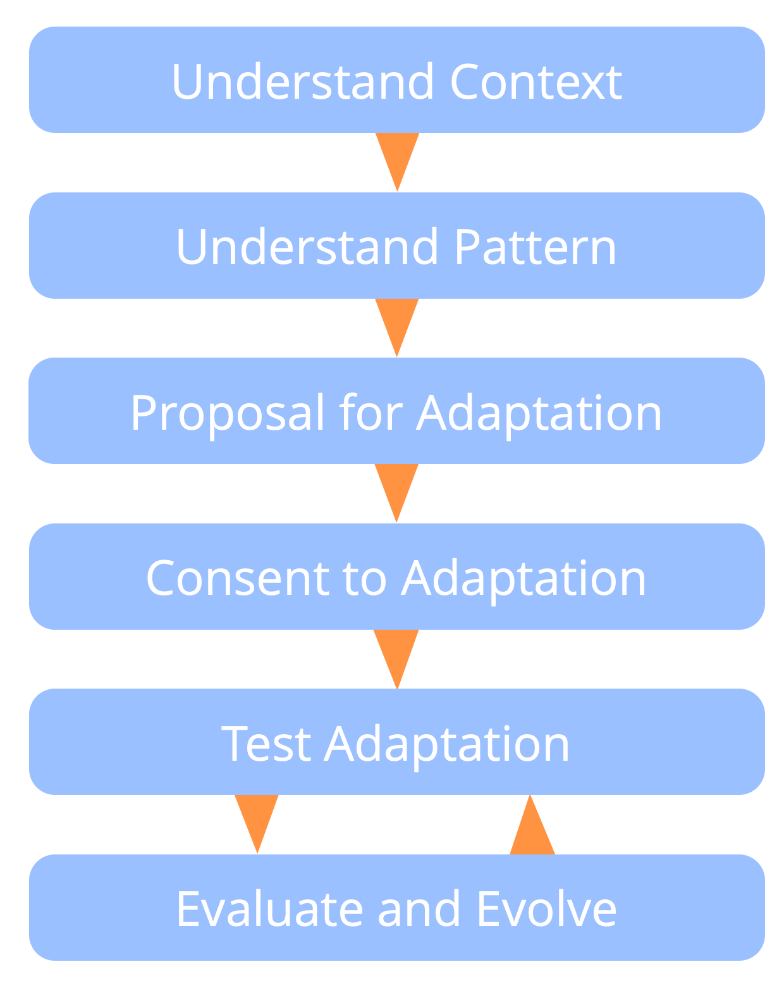
        

    

    <figcaption>Phases of adapting patterns to a specific context</figcaption>
</figure>

#### Be the Change

Lead by example.

Behave and act in the ways you would like others to behave and act.

#### Invite Change

Clarify the reason for change and invite people to participate.

Inviting rather than imposing change helps reduce resistance and enables people to choose for themselves.

When making the invitation:

-   be transparent about the reason for the change
-   clarify expectations and constraints
-   avoid coercion or manipulation
-   acknowledge any skepticism and doubts

Include the people involved and affected in regular evaluation of outcomes.

#### Adopt the Seven Principles

Align collaboration with the Seven Principles.

Adopting the Seven Principles reduces the number of explicit policies required, and guides adaptation of S3 patterns to suit the organization's context.

An organization's values need to embrace the Seven Principles.

<figure class="fig fig--limit-height fig--scale-small">
    

        
        

    

    <figcaption>The Seven Principles</figcaption>
</figure>

<figure class="fig fig--limit-height fig--scale-small">
    

        
        

    

    <figcaption>An organization's values need to embrace the Seven Principles</figcaption>
</figure>

#### Open Space for Change

Invite everyone to create and run experiments for evolving the organization.

-   clarify the <a href="glossary.html#entry-organizational-driver" class="glossary-tooltip" data-toggle="tooltip" title="Organizational Driver: A situation where the organization&#x27;s members have a motive to respond because they anticipate that doing so is beneficial or necessary for fulfilling the organization’s purpose. (by helping generate value, eliminate waste, or avoid undesirable risks or consequences). Drivers are often expressed as _current conditions_ that lead to current or anticipated _effects_ that are _relevant_ to the organization.">driver</a> for change
-   schedule regular open space events:
    -   invite all members to create and run experiments
    -   define constraints for the experiments that enable development of a <a href="glossary.html#entry-sociocracy" class="glossary-tooltip" data-toggle="tooltip" title="Sociocracy: An approach for organizing together where people affected by decisions can influence them on the basis of reasons to do so.">sociocratic</a> and agile mindset (e.g. S3 principles)
    -   review and learn from experimentation in the next open space

### Defining Agreements

S3 promotes a hypothesis-driven approach to decision-making.

<figure class="fig fig--limit-width fig--scale-small">
    

        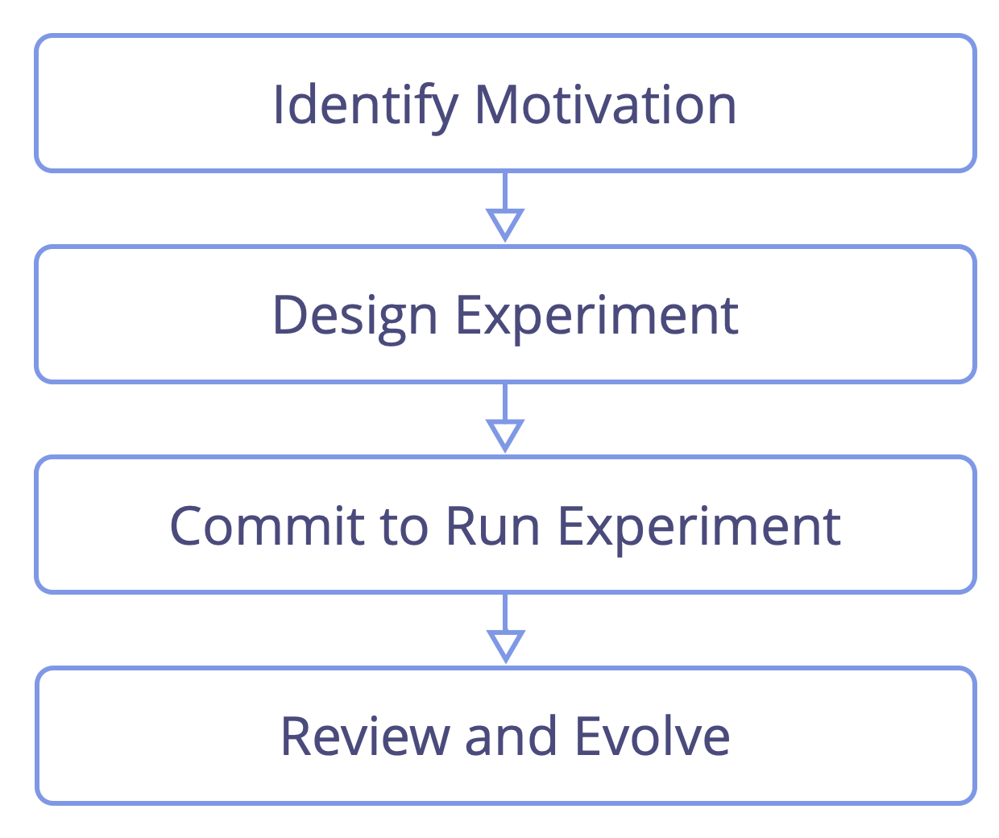
        

    

    <figcaption>Any policy or decision can be viewed as an experiment.</figcaption>
</figure>

<figure class="fig fig--limit-both fig--scale-normal">
    

        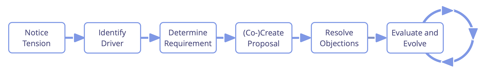
        

    

    <figcaption>The Life-Cycle of a Policy</figcaption>
</figure>

#### Contract for Successful Collaboration

Support successful collaboration from the start and build trust between parties by co-creating mutually beneficial and legally robust contracts.

##### Overview

A **contract** is a body of promises that two or more parties agree to make legally binding, i.e if those promises are violated, the injured party gains access to legal (or alternative) remedies.

Developing shared understanding about needs and expectations is essential for successful collaboration.

While negotiating and agreeing on a contract, model the culture of collaboration you want to achieve, and build a positive relationship with the other parties involved.

This pattern refers to contracts relating related to collaboration around any business transaction between an organization and other parties (e.g. employees, consultants, service providers, shareholders or customers). It is especially relevant for contracts that have a significant influence on the future of an organization or one of its partners, such as:

- employment contracts and contracts with external contractors or consultants in _support roles_ (including any agreement that results in a change of remuneration or working hours)
- contracts governing collaboration with customers, vendors or service providers
- shareholder agreements

**Note:** Many agreements about collaboration within an organization do not require dedicated contracts, as they are already governed by or subject to existing contracts.

##### Success Criteria for Contract Negotiation

When negotiating a contract, ensure:

- shared understanding of the reason for the collaboration, as well as the intended outcome and important constraints
- all parties understand what is expected of them
- all parties affected by a contract are involved in creating the contract and enter it voluntarily
- expectations are realistic
- the agreement is beneficial to all parties
- everyone intends to keep to the agreement made

If for any reason one or more of these criteria cannot be fulfilled, it is probably wise to not proceed.

##### Co-Creating the Contract

The way a contract is negotiated can significantly contribute toward building trust between parties. Approach contracting from the point of view of making an agreement between partners, not adversaries: co-create the contract, tailor it to its specific context, and ensure it is legally robust.

- the contract should include all expectations of the parties involved, each explained with adequate detail
- use clear and simple language that all parties can understand, and be unambiguous about legal consequences
- if you need to use specific technical or legal terms a party might be unfamiliar with, explain them in a glossary that is part of the contract
- consult a lawyer who supports the culture you aspire to and is competent in the field of business you are negotiating

##### When Co-Creating a Contract

- ensure all parties have a delegation that includes representation for all affected <a href="glossary.html#entry-domain" class="glossary-tooltip" data-toggle="tooltip" title="Domain: A distinct area of responsibility and authority within an organization.">domains</a> (e.g. not only sales, but also development, production, support etc.)
- explicitly describe the culture you want to develop, with consideration for common ground and any cultural differences between parties
- state the reasons for the proposed collaboration, and transparent about expectations and needs of all parties
- disclose all relevant information (if necessary under an NDA)
- agree first on terms of the relationship and expectations to all parties, and then consider how you can make them legally robust
- compile a list of specific laws and regulation the contract needs to comply to
- negotiate in several iterations, allowing time to consider implications and propose amendments
- keep minutes of each meeting to reduce the potential for misconceptions

##### Support the Full Lifecycle of the Collaboration

Any contract can be changed at any time, provided all signatories agree. However, it greatly reduces the potential for conflict later if you consider the full lifecycle of the collaboration in the contract:

- make provisions for successfully getting started by defining on-boarding procedures
- have a probationary period, where all parties can try out the collaboration, and a clear protocol for how each party can terminate the contract during the probationary period
- define and build into the contract regular review meetings where signatories come together to share learning and decide how the contract might be amended to adapt to changing context
- include procedures for breach of contract
- consider making available alternative means for dispute resolution, e.g. mediation, conciliation or arbitration
- consider limiting the contract to a fixed term after which the contract expires and can be renewed if required

##### Culture

Every contract influences the culture of the collaboration it governs, even when it appears to only describe *what* needs to be delivered:

- intentionally create the culture of collaboration you want to see by including expectations on *how* things should be done
- align the contract to the organizational culture (of all parties) and to legal requirements
- build contracts that enable and encourage accountability

If you find that standard contracts in your industry are misaligned with the culture you want to create, build your own repository of templates for contracts and clauses and consider sharing it with others, so that you can leverage past experience when creating new contracts.

#### Record Governance Decisions

Document the purpose and details of significant decisions to ensure a clear record is maintained so that you can recall what was decided over time and understand the reasoning behind those decisions.

Governance decisions are significant interventions — either for the organization as a whole or for specific people or domains — that include deciding which drivers to address, which requirements to fulfill, in which order, and what policies or other agreements are needed to fulfill them.

While recording governance decisions might initially appear to be an overhead, there are numerous benefits to being able to recollect and review what has been decided and why over time:

-   Improved transparency and trust by making decisions and rationales visible
-   Increased accountability by making it easier to track decisions, who made them, and on what basis
-   Provide access to important information people need to do their work effectively 
-   People better understand their own and others' commitments and responsibilities
-   More effective onboarding of new members 
-   More coherent execution of agreements within and across teams
-   Ensures continuity and coherence in decision-making by offering a source of reference for future decisions
-   Easier to identify dependencies between decisions, roles, and domains
-   Better evaluation of outcomes and adaptation of agreements
-   Reduces the potential for misunderstanding later about the details of agreements, including the reasons why they are made

Whether you are making governance decisions alone or with a team, and whether those decisions affect only yourself (e.g., as an individual in a role) or others as well, it's still worthwhile recording them.

Keep an up-to-date record of all governance decisions in a shared <a href="glossary.html#entry-logbook" class="glossary-tooltip" data-toggle="tooltip" title="Logbook: A (digital) system to store all information relevant to running an organization.">logbook</a> or equivalent register. 

For guidance on what to record for drivers and requirements, see the patterns _Describe Organizational Drivers_ and _Determine Requirements_.

##### Recording Policies

_A **policy** is an intervention that is created and evolved through governance; a process, procedure, protocol, plan, strategy, or guideline._

Record policies with adequate detail so that important information can be recalled later.

**At the very least**, include: 

-   A summary of the overall purpose of the policy
-   The intended outcome of the policy
-   A description of the agreed intervention in adequate detail so that it can be understood, implemented, and reviewed
-   Who is responsible for what
-   review date, relevant metrics, and how they will be monitored.

Depending on the scope and significance of the policy, consider including all of the following:

-   A title for the policy
-   Date of creation (or version)
-   Date of expiry or due date (if relevant)
-   The purpose (driver and requirement)
-   A description of the policy itself, which often includes one or more of these aspects: 
    -   Any relevant sub-purposes and the associated interventions
    -   Specific activities and or constraints 
    -   Specific <a href="glossary.html#entry-deliverable" class="glossary-tooltip" data-toggle="tooltip" title="Deliverable: A product or service provided provided in the context of an intervention. Products include components and materials.">deliverables</a>, the purpose they should fulfill, and for whom
    -   Rationale for why aspects of the overall decision were made (in case it would otherwise be unclear)
    -   Allocated and or available resources
    -   <a href="glossary.html#entry-standard-constraint" class="glossary-tooltip" data-toggle="tooltip" title="Standard Constraint: A constraint that affects several domains (e.g., all sales teams, an entire branch, platform, or department) or even all domains of the organization (e.g., company-wide strategy, a business model, or an organization-wide rule).">Standard constraints</a> that are relevant to keep in mind that might otherwise be overlooked by those with responsibility for execution or compliance
-   _Evaluation_
    -   _Metrics and Monitoring_ 
    -   Evaluation Schedule
    -   Information about any <a href="glossary.html#entry-concern" class="glossary-tooltip" data-toggle="tooltip" title="Concern: An assumption that cannot (for now at least) be backed up by reasoning or enough evidence to qualify as an objection to those who are considering it.">concerns</a>
-   Who is responsible for what?
    -   E.g., who will  oversee the execution of the policy, who will  execute each specific part of the policy, or who needs to adhere to  the policy
    -   Monitoring metrics and or acting when targets are unmet
-   Appendix (if helpful)
    -   Background information
    -   Previous versions of the policy and purpose
    -   References

<figure class="fig fig--limit-both fig--scale-normal">
    

        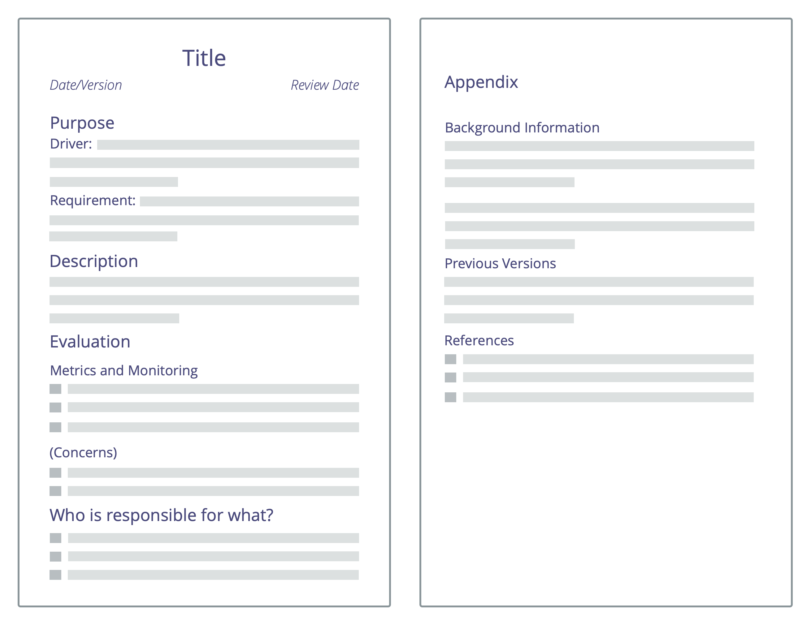
        

    

    <figcaption>A template for recording policy</figcaption>
</figure>

##### Recording Day-to-Day Agreements

While all decisions of significance are worth recording so that they can be remembered, reviewed, and evaluated over time, sometimes it's beneficial to record less significant decisions as well, although in most cases, far less information is required. For example: 

-   A task to complete
-   A note of who will take responsibility for a specific task, and by when
-   An appointment in a team calendar

#### Describe Deliverables

Clearly describe any deliverables related to a policy to support shared understanding of expectations.

_A **deliverable** is a product or service provided in the context of an intervention. Products include components and materials._

When describing deliverables:

-   include the necessary amount of detail
-   reference other documents when helpful or necessary

Explicitly describing deliverables can be useful for improving communication and collaboration within the organization, with customer and with external partners.

#### Define and Monitor Metrics

Develop clear, well-defined metrics to assess your effectiveness in achieving objectives, and monitor them frequently to identify opportunities for improvement early.

_A **metric** is a quantifiable measure used to track and assess progress, evaluate outcomes and determine success._

Metrics help you evaluate the effectiveness of your work and decisions. They act as early signals for when things are working or when something needs attention. Frequent measurement provides timely insights that support better decisions.

All significant decisions and activities (policies — including strategy, processes, projects, products, and services) benefit from being measured against clear metrics. Doing so helps you to know if you are on track and when to adjust course.

Define simple, specific metrics that directly **assess whether you are adequately addressing your purpose and identify potential problems or areas for improvement**. For each metric, clarify:

-   What  exactly will be measured, and how the results will be calculated 
-   Why the metric matters
-   How often should it be captured
-   Who is responsible for collecting, monitoring, and acting on the metric
-   Any targets or thresholds for success or failure (often derived from acceptance criteria)

To enable an effective evaluation of outcomes, the specifics of the metrics need to be agreed on *before* you start measuring, to ensure all relevant data is captured, and to avoid disagreement when reviewing the metrics.

Be cautious not to chase metrics for their own sake. Implementing top-down, performance-driven metrics may lead to gaming the system or focusing on improving the metric without achieving the underlying purpose. When reviewing policies, processes, or projects,  be open to evolving the metrics based on new insights and experiences. As you learn more about the system and its dynamics, updating or refining your metrics ensures they remain meaningful, relevant, and effective in measuring true progress toward your objectives.

Consider creating a centralized dashboard that consolidates all currently relevant metrics for a specific project, team, or role. This helps focus attention on what matters most and makes it easier to identify trends, spot issues early, and align efforts across the team. 

##### Defining and Using Metrics

Metrics typically fall into the following categories:

-   **Driver-related metrics** — Used to assess whether a situation has changed or if a particular driver remains relevant.
-   **Requirement-related metrics** — Help measure actual outcomes against intended outcomes, or assess whether specific conditions are present or have been fulfilled.
-   **Efficiency metrics** — Evaluate how efficiently an intervention is being implemented.
-   **Signals** — Notification of the presence of conditions that may warrant an intervention.

##### Tips for defining metrics

-   Choose **simple and specific metrics**, and document them clearly to avoid confusion or unnecessary debate during policy reviews.
-   **For high-frequency metrics, efficiency is critical**. Metrics captured daily or more often should either be captured and calculated automatically or, if done manually, the process must be straightforward and quick. Complex or time-consuming metrics are unlikely to be maintained reliably at this frequency.
-   For each metric, consider both the **measured values and their interpretation** — how the numbers relate to the underlying purpose or to broader constraints such as targets or acceptable tolerance ranges.
-   **Define actionable metrics** by setting clear thresholds and specifying the appropriate response when those thresholds are crossed.
-   **Don't rely on raw metrics without accounting for context**. Absolute numbers can be misleading when underlying variables change. For example, if your customer base doubles from 20,000 to 40,000 and complaints rise from 20 to 30 per day, the complaint rate actually drops. More complaints don't mean more unhappy customers — it means you need to check the ratio, not just the count.
-   **System knowledge is essential**: the person defining the metrics must have a solid understanding of the system being evaluated in order to derive meaningful insights and avoid misleading conclusions. Without this context, metrics risk becoming disconnected from actual performance or relevance.
-   **Establish a clear monitoring schedule for key metrics** and stick to it. Define how frequently each metric should be reviewed and assign responsibility for tracking and assessment. The appropriate frequency will vary: some metrics may require daily or weekly checks, while others may be reviewed monthly or quarterly. The goal is to monitor often enough to detect trends, track effects, and catch deviations from intended outcomes early.
-   **Use metrics as tools for learning rather than judgment**: When individuals apply metrics to understand and improve their work, rather than to label outcomes as "good" or "bad," metrics support reflection and insight. In contrast, top-down, judgment-driven metrics often discourage experimentation and can obscure underlying issues, limiting the ability to make meaningful progress instead of promoting it.

##### Recommended Format for Metrics Documentation

This structured format ensures clarity, accountability, and alignment between measurement and organizational goals: 

-   **Title**: A clear, concise name for the metric.
-   **Description**: A brief explanation of what the metric measures and how it is calculated.
-   **Rate**: The frequency at which the metric is measured or reported (e.g., daily, weekly, monthly).
-   **Responsibilities**: Who is responsible for collecting, monitoring, and acting on the metric?
-   **Baseline**: (if necessary) the value to compare relative metrics against, often a measurement taken before the intervention begins
-   **Target**: The values or range that is considered a success (typically derived from acceptance criteria)
-   **Triggers**: The specific values or range that triggers attention or action.

##### Examples

**Policy**: Hire a specialist to handle some of the admin work. 

**Intended outcome**: People working on the product will have to spend less time on admin work, so that they are able to spend more time focused on the customer.

**Metrics**: 

**Time Spent on Admin Work**

-   **Description**: Average time spent on administrative tasks by all team members working on the product (as recorded in the booking system)
-   **Rate**: Weekly
-   **Responsibilities**: Team leads collect and review data and monitor trends for their teams
-   **Baseline**: Time Spent on Admin Work for Week 10 of 2025 
-   **Target**: Reduce average time spent on admin tasks by at least 50% over the next 4 weeks
-   **Triggers**: Value exceeds 65% of baseline (after 4 weeks): team leads call a team meeting to assess the situation 

**Time Spent on Product and Customer Requests**

-   **Description**: Average time team members spend handling product development and customer requests (as recorded in the booking system)
-   **Rate**: Weekly
-   **Responsibilities**: Team leads collect and review data and monitor trends for their teams
-   **Baseline**: Time Spent on Product and Customer Requests for week 10 of 2025
-   **Target**: Increase average time spent on product development and customer requests by 10% over the next 4 weeks.
-   **Triggers**: 5% above baseline (after 4 weeks): team leads call a team meeting to assess the situation 

**Response Time for Customer Requests**

-   **Description**: Average time taken to respond to customer inquiries or requests from initial contact to first reply.
-   **Rate**: Weekly
-   **Responsibilities**: Team leads track data
-   **Baseline**: Response Time for Customer Requests for week 10 of 2025
-   **Target**: Decrease average response time for customer requests by 30% over 4 weeks.
-   **Triggers**: Exceeds 85% of baseline (after 4 weeks): team leads call a team meeting to assess the situation 

**Number of Customer Complaints**

-   **Description**: Total number of formal complaints received from customers within a given period.
-   **Rate**: Weekly
-   **Responsibilities**: Team members log complaints; Team leads compile weekly numbers
-   **Baseline**: Number of Customer Complaints for week 10 of 2025
-   **Target**: Decrease the number of customer complaints by 30% over 4 weeks..
-   **Triggers**: Exceeds 85% of baseline (after 4 weeks): team leads call a team meeting to assess the situation 

**Customer Satisfaction Score (CSAT)**

-   **Description**: CSAT (Customer satisfaction score).
-   **Rate**: Quarterly
-   **Responsibilities**: Marketing department: Include CSAT Test in the monthly newsletter (each quarter)
-   **Baseline**: CSAT for March 2025
-   **Target**: Improve overall customer satisfaction by 10% by the end of the next quarter
-   **Triggers**: None 

#### Logbook

Maintain a coherent and accessible system that stores all information required for collaboration.

A logbook is a (digital) system to store all information relevant for running an organization and its teams. The logbook is accessible to all members of an organization, and information is kept confidential only when there is good reason to do so.

Common platforms for logbooks are Wikis (e.g. [DokuWiki](https://www.dokuwiki.org/), [MediaWiki](https://www.mediawiki.org/), [Confluence](https://www.atlassian.com/software/confluence)), Content Management Systems (e.g. [Wordpress](https://wordpress.org/)), [G Suite](https://gsuite.google.com), [Evernote](https://evernote.com/business) or even [Trello](https://trello.com/).

##### Logbook Contents

Content relating to the whole organization:

-   <a href="glossary.html#entry-primary-driver" class="glossary-tooltip" data-toggle="tooltip" title="Primary Driver: The primary driver for a domain is the main driver that people who attend to that domain respond to.">primary driver</a>, <a href="glossary.html#entry-requirement" class="glossary-tooltip" data-toggle="tooltip" title="Requirement: A state considered valuable to establish or maintain in order to address a specific driver. Requirements are often expressed as _intended outcome(s)_, and _enabling condition(s)_ considered necessary to establish for achieving or maintaining those outcomes.">main requirement</a>, <a href="glossary.html#entry-strategy" class="glossary-tooltip" data-toggle="tooltip" title="Strategy: A high-level approach for how people will fulfill the purpose of a domain (within the constraints of that domain).">strategy</a> and organizational <a href="glossary.html#entry-values" class="glossary-tooltip" data-toggle="tooltip" title="Values: Valued principles that guide behavior. Not to be confused with &quot;value&quot; (singular) in the context of a driver.">values</a>
-   organizational structure (<a href="glossary.html#entry-domain" class="glossary-tooltip" data-toggle="tooltip" title="Domain: A distinct area of responsibility and authority within an organization.">domains</a> and the connections between them)
-   <a href="glossary.html#entry-policy" class="glossary-tooltip" data-toggle="tooltip" title="Policy: An intervention that is created and evolved through governance; a process, procedure, protocol, plan, strategy, or guideline.">policies</a>

Content relating to a specific team or <a href="glossary.html#entry-role" class="glossary-tooltip" data-toggle="tooltip" title="Role: A domain that is delegated to an individual, who then becomes the role keeper.">role</a>:

-   the domain description and strategy
-   policies (including <a href="glossary.html#entry-delegatee" class="glossary-tooltip" data-toggle="tooltip" title="Delegatee: An individual or group accepting responsibility for a domain delegated to them, becoming a role keeper or a team.">delegatees'</a> domain descriptions, strategies and _development plans_)
-   <a href="glossary.html#entry-backlog" class="glossary-tooltip" data-toggle="tooltip" title="Backlog: A list of (often prioritized) uncompleted work items (typically a deliverable, requirement or a driver) that need to be addressed.">backlogs</a> and other information relating to work and <a href="glossary.html#entry-governance" class="glossary-tooltip" data-toggle="tooltip" title="Governance: The sum of activities involved in setting objectives and making and evolving decisions (policies) that guide people toward achieving those objectives, for the entire organization or specific people within it.">governance</a>

#### Logbook Keeper

Select a member of your team to be specifically accountable for keeping up-to-date records of all information the team requires.

The logbook keeper is accountable for maintaining a team's <a href="glossary.html#entry-logbook" class="glossary-tooltip" data-toggle="tooltip" title="Logbook: A (digital) system to store all information relevant to running an organization.">logbook</a> by:

-   recording details of <a href="glossary.html#entry-policy" class="glossary-tooltip" data-toggle="tooltip" title="Policy: An intervention that is created and evolved through governance; a process, procedure, protocol, plan, strategy, or guideline.">policies</a>, <a href="glossary.html#entry-domain" class="glossary-tooltip" data-toggle="tooltip" title="Domain: A distinct area of responsibility and authority within an organization.">domain</a> descriptions, _selections_, evaluation dates, minutes of meetings etc.
-   organizing relevant information and improving the system when valuable
-   keeping records up to date
-   ensuring accessibility to everyone in the team (and in the wider organization as agreed)
-   attending to all technical aspects of logbook keeping

### Meeting Formats

#### Retrospective

Dedicate time to reflect on past experience, learn, and decide how to improve work processes.

-   output: changes to work process, new tasks, on-the-fly <a href="glossary.html#entry-policy" class="glossary-tooltip" data-toggle="tooltip" title="Policy: An intervention that is created and evolved through governance; a process, procedure, protocol, plan, strategy, or guideline.">policies</a>, and  new <a href="glossary.html#entry-organizational-driver" class="glossary-tooltip" data-toggle="tooltip" title="Organizational Driver: A situation where the organization&#x27;s members have a motive to respond because they anticipate that doing so is beneficial or necessary for fulfilling the organization’s purpose. (by helping generate value, eliminate waste, or avoid undesirable risks or consequences). Drivers are often expressed as _current conditions_ that lead to current or anticipated _effects_ that are _relevant_ to the organization.">drivers</a> or <a href="glossary.html#entry-requirement" class="glossary-tooltip" data-toggle="tooltip" title="Requirement: A state considered valuable to establish or maintain in order to address a specific driver. Requirements are often expressed as _intended outcome(s)_, and _enabling condition(s)_ considered necessary to establish for achieving or maintaining those outcomes.">requirements</a>
-   facilitated meeting (~1hr)
-   regular intervals (1-4 weeks)
-   adapt to situation and context

<figure class="fig fig--limit-width fig--scale-small">
    

        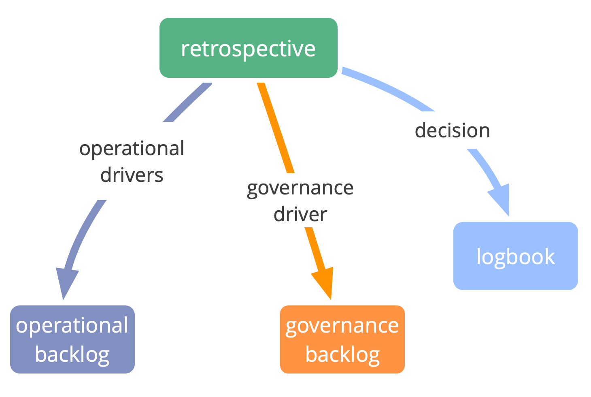
        

    

    <figcaption>Output of a retrospective</figcaption>
</figure>

##### Five Phases of a Retrospective Meeting

1. Set the stage
2. Gather data
3. Generate insights
4. Decide what to do
5. Close the retrospective

Many different activities for each phase can be found at [plans-for-retrospectives.com](http://www.plans-for-retrospectives.com/)

#### Governance Meeting

When you share responsibility for governance with others, hold regular, structured, and facilitated meetings to address a domain’s governance so that challenges and opportunities are addressed promptly, and policies are frequently evaluated and improved. 

In the case of a single individual attending to a domain without the need to involve others, it’s still valuable to schedule time for governance on a regular basis to develop your own policies that enable you to be and remain effective.

The main purpose of people’s efforts in any domain is to deliver value to the people they serve. This is mainly achieved during day-to-day activities (<a href="glossary.html#entry-operations" class="glossary-tooltip" data-toggle="tooltip" title="Operations: Doing the work and organizing day-to-day activities within the constraints defined through governance.">operations</a>). However, for operations to be and remain effective and efficient, it is essential to spend time regularly addressing  <a href="glossary.html#entry-governance" class="glossary-tooltip" data-toggle="tooltip" title="Governance: The sum of activities involved in setting objectives and making and evolving decisions (policies) that guide people toward achieving those objectives, for the entire organization or specific people within it.">governance</a> matters: deciding on *how* you do things, evaluating the effectiveness of your policies, and addressing challenges and opportunities beyond the scope of individual work items. These activities often get lost when the operational workload is overwhelming, and deadlines are looming, which can lead to increased stress over time, systemic challenges not being addressed, and missed opportunities.

Scheduling a regular Governance Meeting for a domain ensures that the time for governance is set aside and that all people responsible for making significant decisions (e.g. team members, <a href="glossary.html#entry-delegator" class="glossary-tooltip" data-toggle="tooltip" title="Delegator: An individual or group delegating responsibility for a domain to other(s).">delegators</a>, or _representatives_ from other domains) can be present, so that , so that challenges and opportunities are addressed promptly, and operations run smoothly over time.

A structured and facilitated meeting with a clear, prioritized _agenda_ supports a group in staying focused and productive. Adding a _time box_ to each agenda item helps keep discussions on point. If certain items take too long to resolve, review their priority and consider whether additional information or resources are needed to progress.

##### The Structure of a Governance Meeting

A governance meeting is usually:

-   facilitated
-   prepared in advance
-   _time-boxed_ for 90-120 minutes
-   scheduled every 2-4 weeks

A typical governance meeting includes the following phases:

1.  Opening: _check in_ with each other and attune to the objective of the meeting
2.  Administrative matters
    -   Check for consent to the previous meeting’s minutes
    -   Agree on a date for the next meeting
    -   Check for any last-minute agenda items and for consent to the agenda
3.  Agenda items (see below)
4.  _Meeting evaluation_: reflect on your interactions, celebrate successes and share suggestions for improvement
5.  Closing: Check in with each other before you leave the meeting.

<figure class="fig fig--limit-width fig--scale-small">
    

        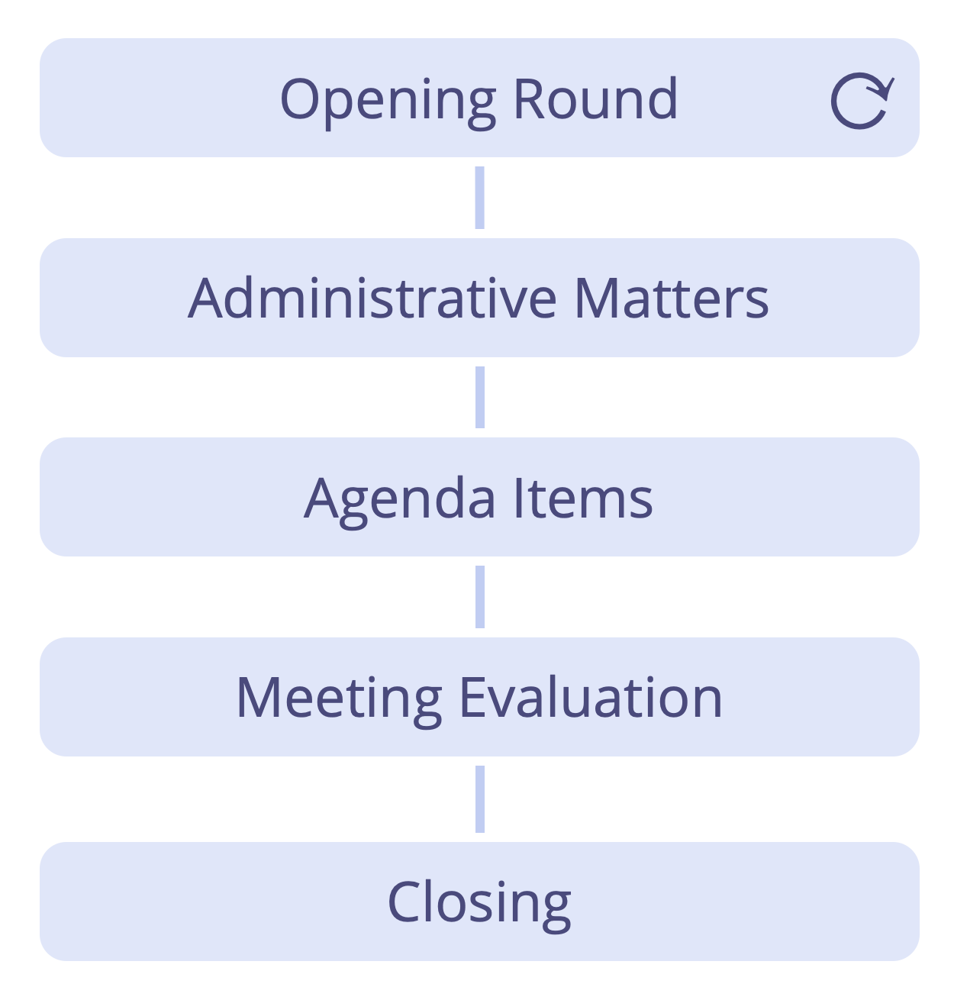
        

    

    <figcaption>Phases of a governance meeting</figcaption>
</figure>

##### Roles Involved in a Governance Meeting

-   The _Meeting Host_ is responsible for preparing and following up on the governance meeting.
-   The _Logbook Keeper_ records details of decisions, and keeps those records up to date and organized
-   The _Governance Facilitator_

##### Agenda Items

Typical **agenda items** include:

-   Any short reports
-   Evaluation of existing <a href="glossary.html#entry-policy" class="glossary-tooltip" data-toggle="tooltip" title="Policy: An intervention that is created and evolved through governance; a process, procedure, protocol, plan, strategy, or guideline.">policies</a> (including domains) due for review
-   _Testing objections_ and, if they qualify, _resolving them_
-   _Determining requirements_
-   _Forming proposals_
-   _Deciding on policy_
-   _Designing domains_ and deciding how to attend to domains (e.g. with new _roles_, _circles_ or any other type of team)
-   _Selecting people for roles_

For each agenda item, consider including the following details, to ensure clarity and help streamline preparations for the meeting:

-   A **description** of the item
-   An **item owner**, who is able to present the item and respond to questions 
-   What people should do to **_prepare in advance_**
    -   Specific actions
    -   Who to reach out to for clarifications
    -   Links to any relevant documentation
-   Which **process(es)** are required
-   A *time box* (how long you intend to spend on this item)
-   What **<a href="glossary.html#entry-intended-outcome" class="glossary-tooltip" data-toggle="tooltip" title="Intended Outcome: Specific, observable results you aim to achieve in relation to a driver.">outcome</a>** you wish to achieve in the meeting.

#### Daily Standup

Meet daily to organize work, facilitate learning, and improve your productivity and effectiveness.

A Daily Standup is <a href="glossary.html#entry-time-box" class="glossary-tooltip" data-toggle="tooltip" title="Time box: A fixed period of time spent focused on a specific activity (which is not necessarily finished by the end of the time box).">time-boxed</a> (usually 15 minutes) and held daily at the same time.

The team gathers around a visible project management board/tool to:

-   organize daily work
-   identify and resolve impediments/blocks
    -   adapt existing <a href="glossary.html#entry-policy" class="glossary-tooltip" data-toggle="tooltip" title="Policy: An intervention that is created and evolved through governance; a process, procedure, protocol, plan, strategy, or guideline.">policies</a> or create new ones on the fly

<figure class="fig fig--limit-width fig--scale-small">
    

        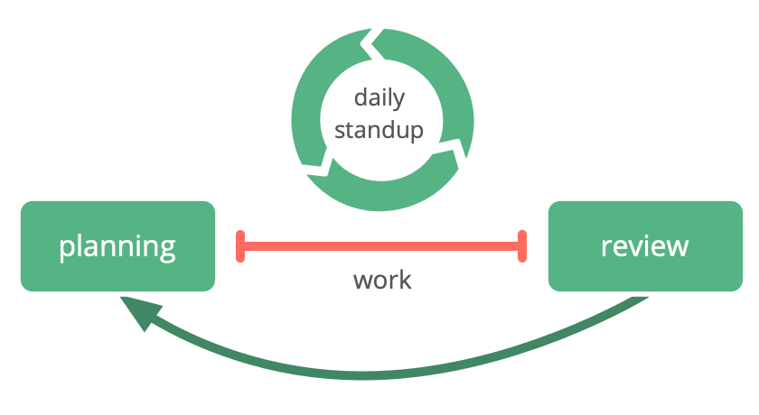
        

    

    <figcaption>Daily standup is an essential meeting for self-organizing teams.</figcaption>
</figure>

#### Planning and Review Meetings

Meet with your team at regular intervals (1-4 weeks) in time-boxed meetings to plan and review work.

Planning and review meetings serve as essential feedback loops in iterative work processes, providing a structured environment for teams to align on objectives, agree on work for the next iteration (or “sprint”), evaluate progress, and make necessary adjustments.

Both meetings rely on a well-maintained **product backlog**: The outcome of a planning meeting is the **iteration backlog** with items the team is confident they can deliver by the end of the iteration. In contrast, the outcome of the review meeting is a revised, prioritized, up-to-date product backlog that is ready for the next planning meeting.

While the planning meeting is typically limited to team members, the review meeting includes **relevant stakeholders**because they would be best placed to accept completed work items and can provide valuable feedback that might lead to new items in the backlog, as well as changes in priority.

<figure class="fig fig--limit-width fig--scale-small">
    

        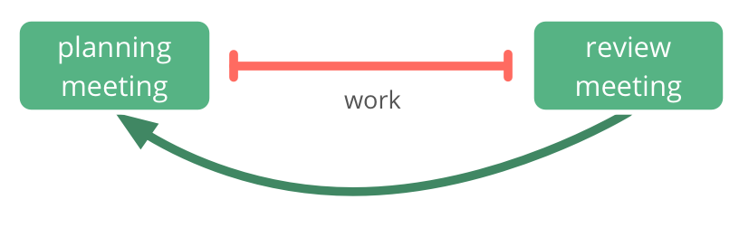
        

    

    <figcaption>Planning and review meetings</figcaption>
</figure>

##### Planning Meeting

Time-box the meeting to stay on track (typically 1-2 hours per week of iteration). 

-   Review the product backlog and select work items for the next iteration (the “iteration _backlog_”) by considering available capacity, estimated effort, priority, and dependencies.
-   Prioritize the iteration backlog and, if possible, identify the overall objective for the upcoming iteration.
-   Address any clarifying questions.
-   Make a plan for handling the iteration backlog, including how you will handle any dependencies between the individual items.

##### Review Meeting

Time-box the meeting to stay on track (typically 1 hour per week of iteration). Schedule any conversations requiring a significant amount of time for after the meeting.

-   Report which items in the iteration backlog have been completed and which are still unfinished.
-   Share insights on what worked well and where improvements may be required. (Add those to the agenda for a _Retrospective_ meeting, but refrain from attempting to deal with them in the Review meeting, which should maintain focus on reviewing the actual work).
-   Demonstrate or review the *completed* items and decide if they adequately fulfill the related requirement or require rework (if not already done as preparation for the review).
-   Celebrate successes, identify new insights, and add new items to the product backlog.
-   Hear any reports from stakeholders on changes in the environment or regarding priorities.
-   Review the product backlog, adjust priorities if necessary, and clarify any expectations relating to the delivery of specific items.
-   Update the backlog based on outcomes and insights, prioritizing accordingly.

#### Coordination Meeting

Meet on a regular basis (usually weekly) for reporting on and coordinating work across domains.

-   facilitate the meeting (<a href="glossary.html#entry-time-box" class="glossary-tooltip" data-toggle="tooltip" title="Time box: A fixed period of time spent focused on a specific activity (which is not necessarily finished by the end of the time box).">time box</a> dialogue and use rounds where valuable)
-   when useful, compile an agenda before the meeting and share it with attendees in advance
    -   include details of any prerequisites that can help attendees to prepare
    -   further agenda items may come up when hearing status reports

Agenda items:

-   cross domain synchronization and alignment
-   prioritization and distribution of work
-   responding to impediments

<figure class="fig fig--limit-width fig--scale-small">
    

        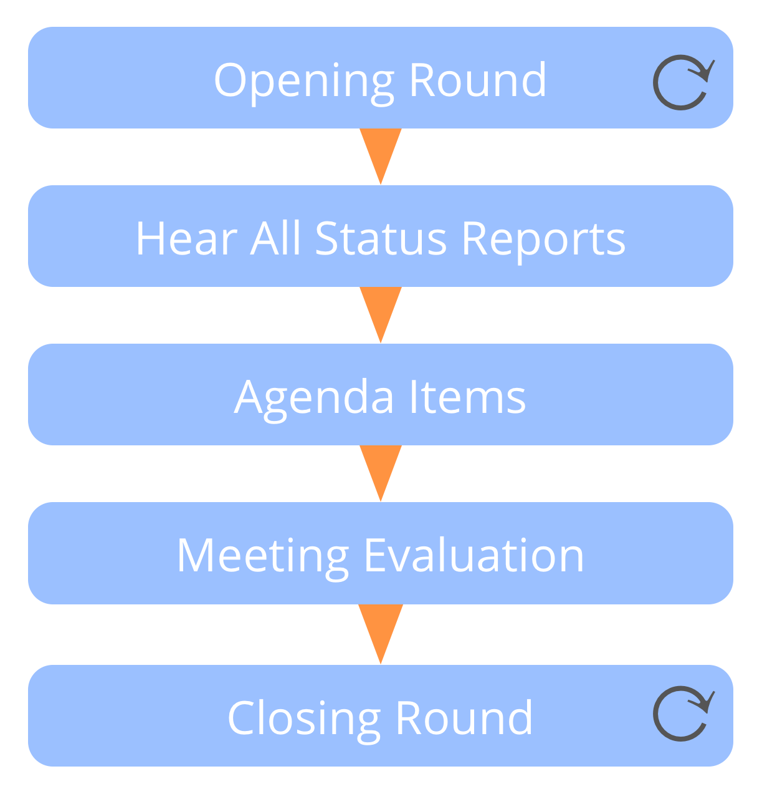
        

    

    <figcaption>Phases of a coordination meeting</figcaption>
</figure>

### Meeting Practices

#### Rounds

In a group meeting, go around the circle giving everyone the chance to speak in turn.

Rounds are a group facilitation technique to maintain equivalence and support effective dialogue.

Be clear on the purpose and intended outcome of each round.

Sit in a circle, begin each round with a different person, and change direction (clockwise or counterclockwise) to bring variation to who speaks first and last, and to the order of contributions.

<figure class="fig fig--limit-width fig--scale-small">
    

        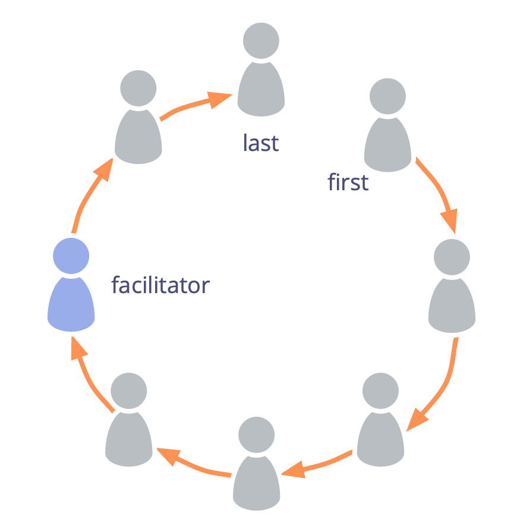
        

    

    <figcaption>Rounds</figcaption>
</figure>

#### Facilitate Meetings

Choose someone to facilitate a meeting to help the group maintain focus, keep the meeting on track, and draw out the participants' creativity and wisdom.

Before each meeting, prepare an agenda of topics, and select a facilitator to:

-   hold the space, keep the time and navigate the agenda during the meeting
-   facilitate a suitable activity for each topic
-   facilitate an _evaluation_ at the end of the meeting

Consider selecting a facilitator for a specific term. Even an inexperienced facilitator can make a positive difference.

**See also:** _Prepare For Meetings_, _Role Selection_

#### Prepare For Meetings

Prepare in advance to make meetings more effective.

Some considerations for successfully preparing a meeting:

-   clarify and communicate the <a href="glossary.html#entry-organizational-driver" class="glossary-tooltip" data-toggle="tooltip" title="Organizational Driver: A situation where the organization&#x27;s members have a motive to respond because they anticipate that doing so is beneficial or necessary for fulfilling the organization’s purpose. (by helping generate value, eliminate waste, or avoid undesirable risks or consequences). Drivers are often expressed as _current conditions_ that lead to current or anticipated _effects_ that are _relevant_ to the organization.">driver</a> for, and <a href="glossary.html#entry-intended-outcome" class="glossary-tooltip" data-toggle="tooltip" title="Intended Outcome: Specific, observable results you aim to achieve in relation to a driver.">intended outcome</a> of the meeting
-   decide who to invite
-   create an agenda
-   schedule the meeting enough in advance, so people have time to prepare
-   choose an appropriate duration for the meeting
-   be clear who will _facilitate the meeting_, who will take minutes and who will take care of any follow-up

##### Preparing an Agenda

Involve people in preparing and prioritizing an agenda and send it out in advance

For each agenda item agree on:

-   the driver
-   the intended outcome
-   the process
-   the time you want to spend on it
-   what people need to do to prepare

##### Support the Participants' Preparation

-   consider what can be done in advance to prepare for the meeting
-   notify people about any expectations and prerequisites
-   make any resources available that people may need for preparation

##### As a Participant

-   consider the pattern _Artful Participation_
-   review the agenda and consider how you can contribute to each item
-   bring up objections to an agenda, and if possible resolve them before the meeting
-   review improvement suggestions from the last meeting's evaluation and consider how **you** might act on them

#### Check In

Help people to become aware of themselves and others, and to focus, be present, and engage.

To check in, briefly disclose something about what's up for you and how you are, revealing thoughts, feelings, distractions or needs.

Checking in may take the form of an opening or closing round in a group meeting, or just a brief exchange in a 1:1 meeting.

You can also call for a group check-in during a meeting, or even choose to individually check in whenever you think this is valuable for the group.

In a group check-in, allow people to pass if they choose.

When checking in, in a new setting, people can also say their name and where they are coming from, as a way to introduce themselves. (Tip: Avoid talking about function, rank etc unless there is a reason to do so.)

#### Evaluate Meetings

Take time for learning at the end of each meeting or workshop.

Reflect on interactions, celebrate successes and share suggestions for improvement before closing the meeting.

-   reserve 5 minutes for 1 hour, and 15 minutes for a full-day workshop
-   record learning and review it before the next meeting

Short formats you can use:

-   more of/less of/start/stop/keep
-   positive/critical/suggested improvements

<figure class="fig fig--limit-width fig--scale-small">
    

        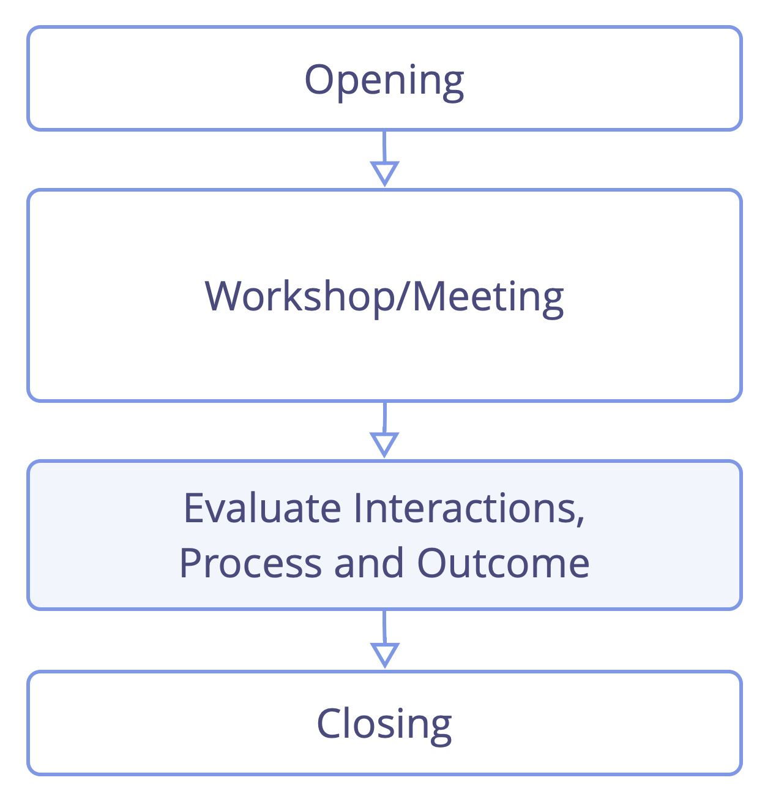
        

    

    <figcaption>Evaluate meetings right before closing the meeting</figcaption>
</figure>

##### Evaluate Meetings: Long Format

Ask everyone in a _round_ to reflect on any or all of the following topics in a brief sharing, and report key points you'd like to remember for next time:

-   effectiveness and format
-   facilitation and participation
-   emotional tone
-   appreciations and achievements (I liked …)
-   growing edges and improvement suggestions (I wish …)
-   wild ideas and radical suggestions (What if …)

#### Meeting Host

Select someone to take responsibility for the preparation and follow-up of meetings, workshops, or other events.

A person may take on the role of meeting host for a specific event or for several events over a period of time.

##### Responsibilities Of A Meeting Host

Preparation:

-   identify goals and deliverables
-   prepare and distribute agenda
-   identify and invite the participants
-   estimate the time required and schedule the meeting/workshop
-   book the location (and transportation if required)
-   set up the space and provide required materials and information
-   ensure selection of a facilitator and a notetaker to record minutes, if appropriate

**After the meeting:** clean up location, return keys, tie up all the loose ends, and ensure minutes are distributed.

**See also:** _Facilitate Meetings_, _Prepare For Meetings_

#### Governance Facilitator

Select someone to facilitate governance meetings.

A <a href="glossary.html#entry-governance" class="glossary-tooltip" data-toggle="tooltip" title="Governance: The sum of activities involved in setting objectives and making and evolving decisions (policies) that guide people toward achieving those objectives, for the entire organization or specific people within it.">governance</a> facilitator:

-   ensures _governance meetings_ stay on track and are evaluated
-   is (usually) selected by a <a href="glossary.html#entry-team" class="glossary-tooltip" data-toggle="tooltip" title="Team: A group of people collaborating toward fulfilling a shared purpose. Typically, a team is part of an organization, or it is formed as a collaboration of several organizations.">team</a> from among its members (and for a specific term)
-   familiarizes themselves with the _Governance Backlog_
-   often invites others to facilitate some agenda items

As a governance facilitator, consider learning about and using the following patterns from S3 to handle governance effectively:

-   _Rounds_
-   _Proposal Forming_
-   _Consent Decision-Making_
-   _Role Selection_
-   _Evaluate Meetings_
-   _Resolve Objections_
-   _Peer Review_

<figure class="fig fig--limit-both fig--scale-small">
    

        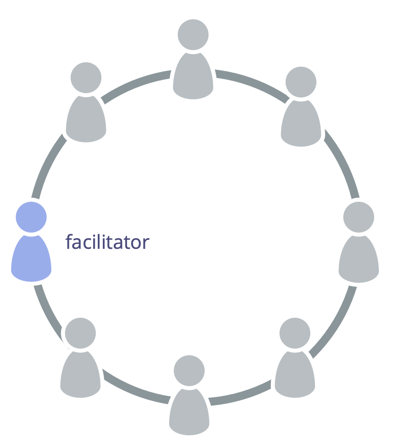
        

    

    <figcaption>The governance facilitator is typically a member of the team</figcaption>
</figure>

##### Governance Backlog

Keep a dedicated, prioritized backlog for items that pertain to governance so that you can remember them and use the information to plan and organize your governance.

_A **governance backlog** is a visible, prioritized list of items relating to the governance of a domain._

A governance backlog plays a key role in any reliable and transparent system of governance, because it contains information relating to a domain’s outstanding governance matters and allows you to remember and address them in the order of priority. Keeping a prioritized governance backlog is essential for planning regular _governance meetings_. It’s also useful for deciding which items are best addressed in a dedicated meeting versus those that can be handled effectively in other regular meetings such as product meetings, _planning meetings_, or _retrospectives_. 

Contents of a governance backlog:

-   Drivers that need a <a href="glossary.html#entry-requirement" class="glossary-tooltip" data-toggle="tooltip" title="Requirement: A state considered valuable to establish or maintain in order to address a specific driver. Requirements are often expressed as _intended outcome(s)_, and _enabling condition(s)_ considered necessary to establish for achieving or maintaining those outcomes.">Requirement</a>
-   Requirements that need a proposal
-   Proposals that need a decision
-   Policies due for review (according to an agreed-upon evaluation date)
-   Possible objections to existing policies or activity that need to be tested and, if they qualify, resolved
-   Selecting people for roles
-   Short reports relating to activity, outcomes resulting from acting on policies, or the ongoing governance of the domain

Typical information to include with an item in a (prioritized) governance backlog:

-   the situation that needs addressing 
-   the *next step(s)* for addressing the item (e.g. _determine requirement_, _form a proposal_, _test a proposal_, _review an existing policy_, _select someone for a role_, _test arguments_. and _resolve objections_
-   an estimate of the time required to reach the next step(s)
-   what people need to do to prepare
-   other interdependent items (including work items), along with other relevant information including reference to proposals, related policies, domain descriptions, etc.
-   who added the item to the backlog (for clarification/questions)
-   a due date (if necessary)
-   the priority of the item (see _Prioritized Backlog_)

##### Governance Boards

Visualizing all items related to governance and their progress using a Kanban-style board is helpful for tracking the status of each item. Visual representation ensures transparency and allows all stakeholders to stay informed about the current state of affairs. It is also helpful to link related governance items between boards if they concern multiple domains, or to related work items on operational boards, to facilitate addressing dependencies in a more coherent way.

A typical **governance board** includes the following columns (as a minimum):

-   **Incoming**: unconfirmed drivers coming in from other domains or from team members 
-   **Backlog**: items that have been determined relevant, significant, and require a decision, in the order of priority
-   **Agenda**: items that will be addressed in the next governance meeting)
-   **Agreed**: items that were agreed upon (this could also be stored in a separate board)

**Tips for Managing Overloaded Governance Boards:** If you find yourself overwhelmed by the number of items in your governance board, consider _limiting the number of items_ for the backlog, or for other columns. If you exceed that limit, decide whether to archive the item or store it somewhere outside of the board. 

### Organizing Work

#### Backlog

Keep an up-to-date list of things you need to address, so that you can remember them, and use that information to plan and organize your work. 

_A **backlog** (to-do list) is a list of (often prioritized) uncompleted work items (typically a deliverable, requirement, or driver) that need to be addressed._

Backlogs are at the core of any reliable and transparent system for organizing work and governance. Consider making backlogs visible, not only to other members of a team but also to the wider organization.

Rather than getting side-tracked when a new work item comes up, make a note of it in the appropriate backlog, so that you keep focus on the work in progress.

Types of backlog include:

-   <a href="glossary.html#entry-governance" class="glossary-tooltip" data-toggle="tooltip" title="Governance: The sum of activities involved in setting objectives and making and evolving decisions (policies) that guide people toward achieving those objectives, for the entire organization or specific people within it.">governance</a> backlog
-   <a href="glossary.html#entry-operations" class="glossary-tooltip" data-toggle="tooltip" title="Operations: Doing the work and organizing day-to-day activities within the constraints defined through governance.">operations</a> backlog
-   _sprint_ backlog
-   product backlog
-   impediments backlog

**Implementation:**

-   **analog backlog:** sticky notes on a wall, or index cards, magnets and whiteboard
-   **digital backlog:** e.g. [Google Sheets](https://www.google.com/sheets/about/), [Trello](https://trello.com/), [Kanban Flow](https://kanbanflow.com/), [Jira](https://www.atlassian.com/software/jira), [Asana](https://asana.com/)

Each item on a (prioritized) backlog typically contains:

-   a **short description** of the work item (typically a <a href="glossary.html#entry-deliverable" class="glossary-tooltip" data-toggle="tooltip" title="Deliverable: A product or service provided provided in the context of an intervention. Products include components and materials.">deliverable</a> <a href="glossary.html#entry-requirement" class="glossary-tooltip" data-toggle="tooltip" title="Requirement: A state considered valuable to establish or maintain in order to address a specific driver. Requirements are often expressed as _intended outcome(s)_, and _enabling condition(s)_ considered necessary to establish for achieving or maintaining those outcomes.">requirement</a> or a <a href="glossary.html#entry-organizational-driver" class="glossary-tooltip" data-toggle="tooltip" title="Organizational Driver: A situation where the organization&#x27;s members have a motive to respond because they anticipate that doing so is beneficial or necessary for fulfilling the organization’s purpose. (by helping generate value, eliminate waste, or avoid undesirable risks or consequences). Drivers are often expressed as _current conditions_ that lead to current or anticipated _effects_ that are _relevant_ to the organization.">driver</a>)
-   reference to other **interdependent work items** or projects, as well as to any **other relevant information**
-   an **estimate of the time** required to deal with it

It can also be useful to include:
- a due date (if necessary)
- a way of visualizing rank or priorities (see [Prioritized Backlog](https://patterns.sociocracy30.org/prioritize-backlogs.html))

#### Prioritize Backlogs

Order all uncompleted work items with the most important items first, then pull work items from the top whenever there is new capacity.

No two items can be of equal importance, meaning it is necessary to agree on priorities and make tough choices.

A prioritized <a href="glossary.html#entry-backlog" class="glossary-tooltip" data-toggle="tooltip" title="Backlog: A list of (often prioritized) uncompleted work items (typically a deliverable, requirement or a driver) that need to be addressed.">backlog</a> helps to **maintain focus** on the most important items.

#### Visualize Work

Maintain a system that allows all stakeholders to review the state of all work items currently pending, in progress, or complete.

-   valuable for <a href="glossary.html#entry-self-organization" class="glossary-tooltip" data-toggle="tooltip" title="Self-Organization: Any activity or process through which people organize work. Self-organization happens within the constraints of a domain, but without the direct influence of  external agents. In any organization or team, self-organization co-exists with external influence (e.g. external objections or governance decisions that affect the domain).">self-organization</a> and pull systems
-   system must be accessible to everyone affected
-   **analog:** post-its on a wall, or index cards, magnets and white board
-   **digital:** [Trello](https://trello.com/), [Kanbanize](https://kanbanize.com/), [Leankit](https://leankit.com/), [Miro](https://miro.com), [Jira](https://www.atlassian.com/software/jira), [Google Sheets](https://www.google.com/sheets/about/), etc.

<figure class="fig fig--limit-width fig--scale-small">
    

        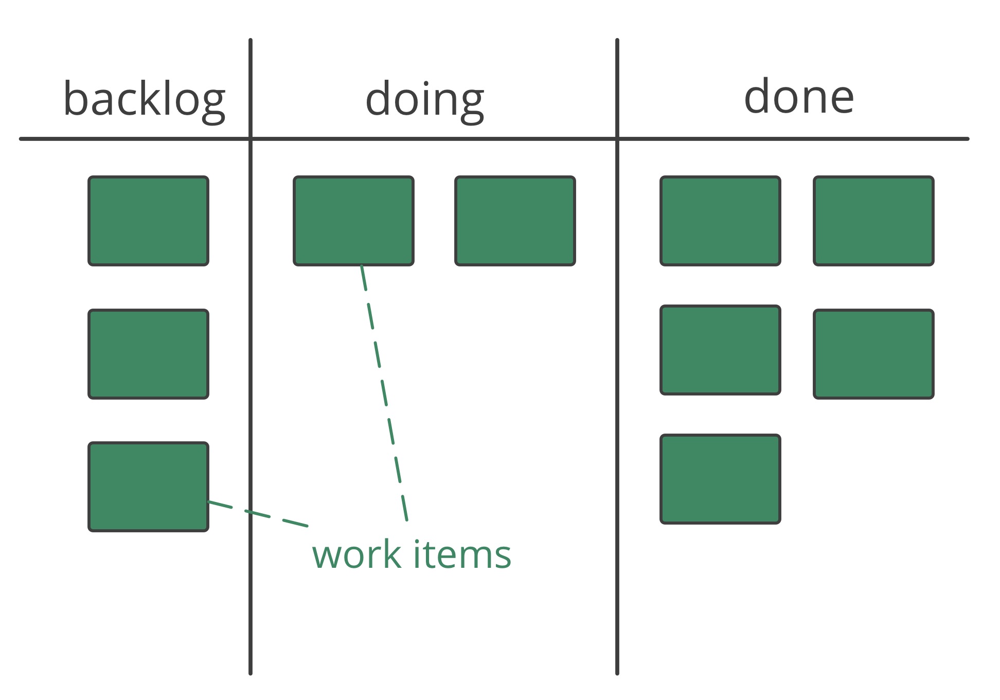
        

    

    <figcaption>Visualization of a simple work process</figcaption>
</figure>

**Things to track**:

-   **types of work items** (e.g. customer request, project tasks, reporting tasks, rework)
-   **start date** (and **due date** if necessary)
-   **priorities**
-   **stages** of work (e.g. "to do", "in progress", "review" and "done")
-   impediments/blocks
-   who is working on which items
-   <a href="glossary.html#entry-policy" class="glossary-tooltip" data-toggle="tooltip" title="Policy: An intervention that is created and evolved through governance; a process, procedure, protocol, plan, strategy, or guideline.">policies</a> that guide workflow (e.g. definition of done, policy, quality standards)
-   use colors, symbols, highlights etc.

<figure class="fig fig--limit-width fig--scale-small">
    

        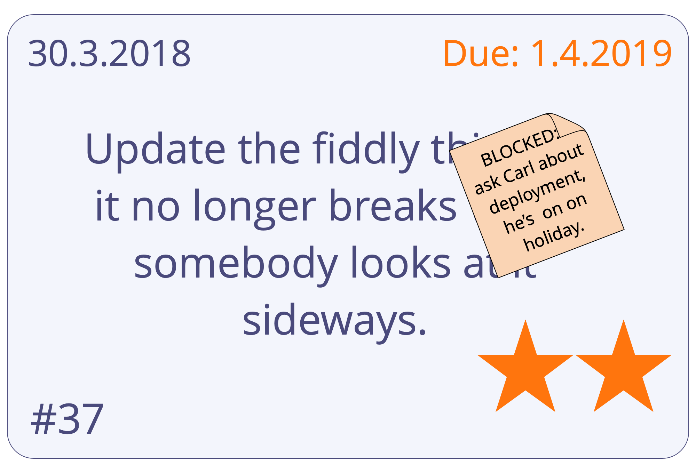
        

    

    <figcaption>A card representing a work item</figcaption>
</figure>

#### Deliver Value Incrementally

Slice work in a way that allows for delivering value fast and frequently, to validate assumptions quickly, align with customer needs, and respond promptly to changing priorities. 

#### Pull System For Work

People pull in new work items when they have capacity (instead of having work pushed or assigned to them).

Prioritize pending work items to ensure that important items are worked on first.

Pulling in work prevents overloading the system, especially when _work in progress (WIP) per person or team is limited_.

#### Limit Work in Progress

Limit the number of work items in any stage of your work process.

Work in progress includes:

-   the number of items in a <a href="glossary.html#entry-backlog" class="glossary-tooltip" data-toggle="tooltip" title="Backlog: A list of (often prioritized) uncompleted work items (typically a deliverable, requirement or a driver) that need to be addressed.">backlog</a>
-   concurrent projects or tasks for teams or individuals
-   products in a portfolio

When a team member notices an action would exceed an agreed upon limit of work items in progress, they bring it with the team before continuing. The team then decides together how to proceed. 

#### Continuous Improvement of Work Process

Reveal drivers and establish a metrics-based pull system for organizational change through continuously improving and refining the work process.

-   introduce the principle of consent and _Navigate via Tension_ to evolve work process in a team
-   consider selecting a facilitator to guide group processes, and choosing values to guide behavior
-   initiate a process of continuous improvement, e.g. through Kanban or regular _retrospectives_
-   members of the team pull in S3 patterns as required
-   if valuable, iteratively expand the scope of the experiment to other teams
-   intentionally look out for impediments

##### Waste and Continuous Improvement

_**Waste**, in relation to purpose, is any activity, output, or use of resources that does not contribute — directly or indirectly — to fulfilling that purpose._

Waste exists in various forms and on different levels of abstraction (tasks, processes, organizational structure, mental models etc.)

Establishing a process for the ongoing elimination of waste enables natural evolution of an organization towards greater effectiveness and adaptation to changing context.

<figure class="fig fig--limit-both fig--scale-normal">
    

        
        

    

    <figcaption>Drivers, Value and Waste</figcaption>
</figure>

#### Time-box Activities

Set a time constraint to stay focused, bring consciousness to the time you have, and how you use it.

_A **time box** is a fixed period of time spent focused on a specific activity (which is not necessarily finished by the end of the time box)._

-   to get value out of the time box, be clear what you want to achieve
-   agree on the duration of the time box and visualize time
-   negotiate and agree to extend a time box before the time is up
-   break down longer activities into manageable time boxes
-   consider frequent review of progress
-   consider choosing someone (the "time keeper") to help others stay conscious of time

You could time-box:

-   meetings, calls, dialogue
-   tasks
-   experiments
-   an attempt to solve a problem
-   checking emails
-   breaks
-   a longer stretch of work (a sprint)

#### Coordinator

A person fulfilling the role of a coordinator is accountable for <strong>coordinating a domain's operations</strong> and is <strong>selected for a limited term</strong>.

The coordinator may be selected by the team itself, or by the <a href="glossary.html#entry-delegator" class="glossary-tooltip" data-toggle="tooltip" title="Delegator: An individual or group delegating responsibility for a domain to other(s).">delegator</a>.

Several coordinators may collaborate to synchronize work across multiple <a href="glossary.html#entry-domain" class="glossary-tooltip" data-toggle="tooltip" title="Domain: A distinct area of responsibility and authority within an organization.">domains</a>.

Instead of selecting a coordinator, a team may choose to self-organize.

## Organizational Structure

Organizational structure is the actual arrangement of <a href="glossary.html#entry-domain" class="glossary-tooltip" data-toggle="tooltip" title="Domain: A distinct area of responsibility and authority within an organization.">domains</a> and their connections. It reflects where power to influence is located, and the channels through which information and influence flow.

Continuously evolve your organization's structure to:

-   support the continuous <a href="glossary.html#entry-flow-of-value" class="glossary-tooltip" data-toggle="tooltip" title="Flow of Value: Deliverables traveling through an organization towards customers or other stakeholders.">flow of value</a>
-   enable effective collaboration around dependencies
-   ensure information is available to those who need it
-   distribute resources and authority to influence as required

The basic building blocks for organizational structure are interdependent, connected domains.

Domains can be linked to form a hierarchy or a **heterarchy** (a.k.a. complex adaptive system, or network, where multiple functional structures can co-exist).

Sociocracy 3.0 describes a variety of _**structural patterns**_ to grow organizational structure.

-   S3's structural patterns apply to different layers of abstraction
-   different structural patterns fulfill different <a href="glossary.html#entry-requirement" class="glossary-tooltip" data-toggle="tooltip" title="Requirement: A state considered valuable to establish or maintain in order to address a specific driver. Requirements are often expressed as _intended outcome(s)_, and _enabling condition(s)_ considered necessary to establish for achieving or maintaining those outcomes.">requirements</a>
-   structural patterns can be adapted and combined as needed
-   more patterns are out there and will be discovered

### Examples of Larger Structures

#### Peach Organization

Deliver value in complex and competitive environments through <em>decentralization</em> (of resources and influence) and <em>direct interaction</em> between those creating value and the customers they serve.

Teams in the periphery:

-   deliver value in direct exchange with the outside world (customers, partners, communities, municipalities etc.)
-   steward the monetary resources and steer the organization

The center provides internal services to support the organization.

<a href="glossary.html#entry-domain" class="glossary-tooltip" data-toggle="tooltip" title="Domain: A distinct area of responsibility and authority within an organization.">Domains</a> are linked as required to flow information and influence, and to support collaboration around dependencies.

<figure class="fig fig--limit-height fig--scale-small">
    

        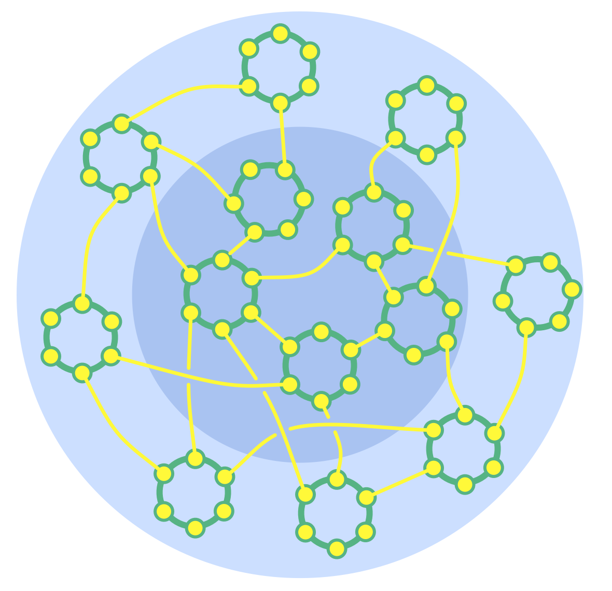
        

    

    <figcaption>Peach Organization</figcaption>
</figure>

#### Double-Linked Hierarchy

Delegate all authority for making governance decisions to circles, double-linked across all levels of the hierarchy, to transition from a traditional hierarchy towards a structure more suitable for tapping collective intelligence, ensuring equivalence, and building engagement.

1. On all levels of your organization, shift responsibility for governance decision-making from individuals to _circles_ by granting teams formal  authority for making certain governance decisions themselves.
2. Each circle's members select one of their group to represent their interests and participate in the <a href="glossary.html#entry-governance" class="glossary-tooltip" data-toggle="tooltip" title="Governance: The sum of activities involved in setting objectives and making and evolving decisions (policies) that guide people toward achieving those objectives, for the entire organization or specific people within it.">governance</a> decision-making of the next higher circle, and vice versa.

A double-linked hierarchy:

-   brings equivalence to governance
-   maintains the potential for a functional hierarchy (if it enables the flow of value).

<figure class="fig fig--limit-height fig--scale-small">
    

        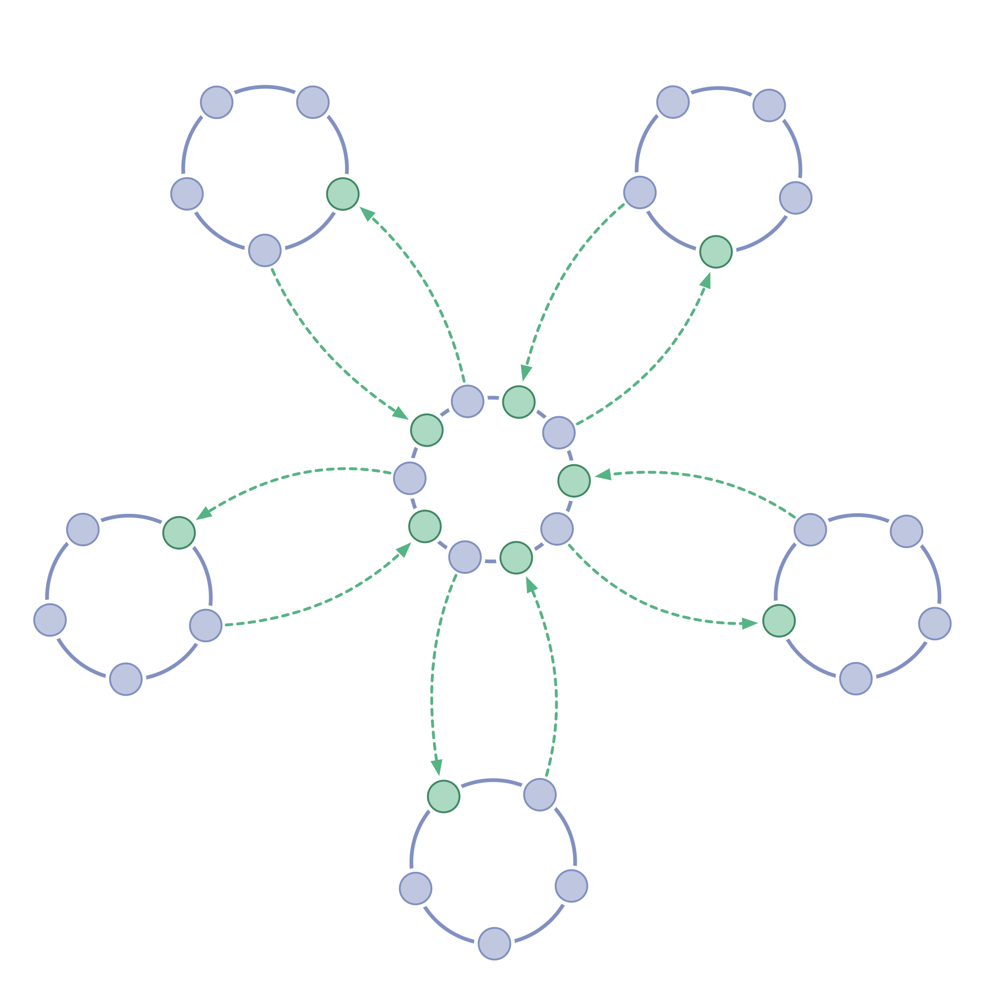
        

    

    <figcaption>A double-linked hierarchy: not your typical hierarchy</figcaption>
</figure>

**See also**: _Circle_, _Double Linking_, _Representative_

#### Service Organization

Multi-stakeholder collaboration and alignment towards a shared driver (or objective).

-   improves potential for equivalence between various entities
-   increases cross-departmental/organizational alignment
-   supports multi-agency collaboration between departments or organizations with different primary motives, or that are in conflict
-   suitable for one-off projects, or ongoing collaboration

**Note:** a service organization is sometimes referred to as a **backbone organization**.

<figure class="fig fig--limit-both fig--scale-normal">
    

        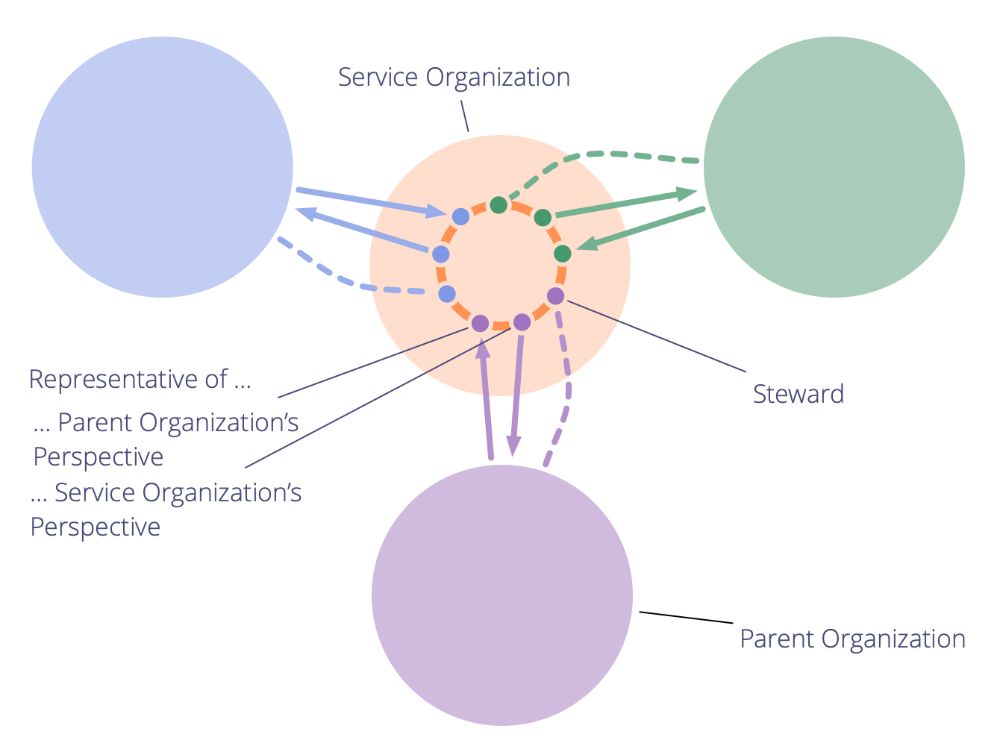
        

    

    <figcaption>Service Organization</figcaption>
</figure>

#### Fractal Organization

Multiple constituents (organizations or projects) with a common (or similar) primary driver and structure can share learning across functional domains, align action and make high level governance decisions (e.g. overall strategy).

Creating a fractal organization can enable a large network to rapidly respond to changing contexts.

If necessary, the pattern can be repeated to connect multiple fractal organizations into one.

<figure class="fig fig--limit-both fig--scale-normal">
    

        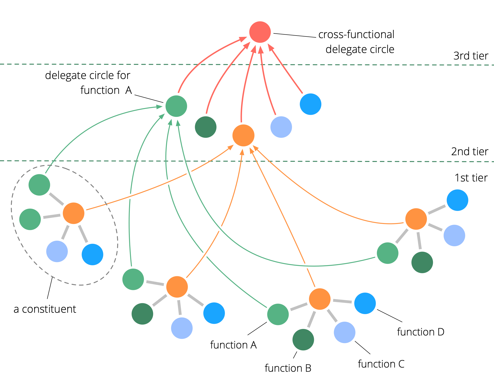
        

    

    <figcaption>Fractal Organization</figcaption>
</figure>

##### Prerequisites

A fractal organization can be formed either by multiple in(ter-)dependent organizations which share a common (primary) <a href="glossary.html#entry-organizational-driver" class="glossary-tooltip" data-toggle="tooltip" title="Organizational Driver: A situation where the organization&#x27;s members have a motive to respond because they anticipate that doing so is beneficial or necessary for fulfilling the organization’s purpose. (by helping generate value, eliminate waste, or avoid undesirable risks or consequences). Drivers are often expressed as _current conditions_ that lead to current or anticipated _effects_ that are _relevant_ to the organization.">driver</a>, or by multiple branches, departments, or projects within a larger organization.

These <a href="glossary.html#entry-constituent" class="glossary-tooltip" data-toggle="tooltip" title="Constituent: A group (e.g., a circle, team, department, branch, project, or organization) that delegates authority to a representative to act on their behalf in other teams or organizations.">constituents</a> (i.e. organizations, branches, departments or projects) need to share at least some — and typically most — functional <a href="glossary.html#entry-domain" class="glossary-tooltip" data-toggle="tooltip" title="Domain: A distinct area of responsibility and authority within an organization.">domains</a> (e.g. accounting, product management, or development).

##### Tiers

A fractal organization has at least three tiers:

- first tier: the **constituents** (i.e. organizations, branches, departments or projects)
- second tier: **function-specific _delegate circles_** to share learning and to make and evolve policies on behalf of function-specific domains
-  third tier: a **cross-functional delegate circle** to make and evolve policies in response to drivers affecting the overall body of constituents

##### Forming a Fractal Organization

1.  Forming the **second tier:** In each constituent, the members of each common (and significant) functional domain, decide who of them will represent them in a **function-specific delegate circle**, where they share knowledge and learning, and contribute toward making and evolving policies. Representatives are selected for a limited term (after which a new selection is made).
2.  Forming the **third tier:** second-tier delegate circles each select a delegate to form the **cross-functional delegate circle**.

##### Impact on the organization(s)

Each constituent:

- gains access to a wide array of experience, wisdom and skills to increase effectiveness and innovation.
- can share resources, infrastructure and experience with other constituents according to capacity and need

The second and third tier:

- can test decisions simultaneously across multiple instances of a function-specific domain, providing extensive feedback and rapid learning
- organize, align and steer the whole system while preserving autonomy and agency of the individual constituents

## A Common Sense Framework for Organizations and Teams

<figure class="fig fig--limit-width fig--scale-small">
    

        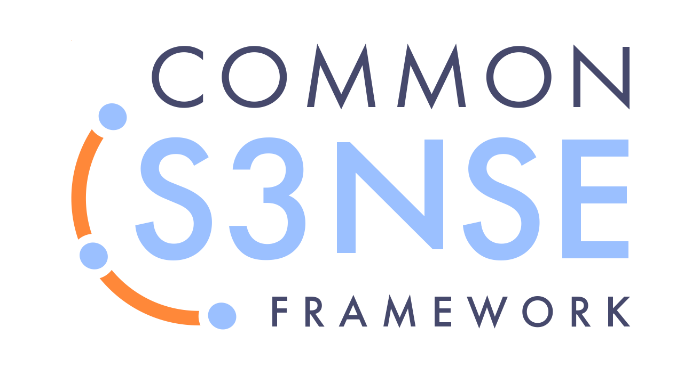
        

    

    <figcaption>The Common Sense Framework</figcaption>
</figure>

We're observing an emerging common sense that is transforming organizations around the world, inspiring and enabling people to build successful organizations where BOTH the people and the organization thrive.

We have distilled the essence of this _common sense_ into a concise  framework for teams and organizations: The **Common Sense Framework (CSF)** is a tool for sense-making, designed to help people address the challenges and opportunities they face. It supports building a shared understanding of the bigger picture, identifying and prioritizing areas of need within a team and throughout an organization, and understanding what to focus on next.

We mapped the 10 principles that comprise the framework to the patterns in S3, so that you can use the CSF as a guide for identifying those patterns that help address your specific needs.

The CSF can be applied in the context of developing individual teams and the organization as a whole. 

### An Organization Where BOTH the People and the Organization can Thrive

**See the bigger picture — identify what's needed — prioritize where to start.**

People face many challenges and opportunities in organizations and recognize the potential for improving the current state of things, yet they're uncertain or unable to agree how and where to start and what to do to move forward.

They need a simple way to build shared understanding about what is happening in their organization, and what needs to be done, so that they can effectively and sustainably respond to the impediments and opportunities they face.

The **Common Sense Framework** (CSF) lays out the big picture of what to consider to grow and maintain organizations where BOTH the people and the organization can thrive, and suggests specific practices and tools that can help you to get there.

**Through 10 essential principles** that apply equally to individual teams, and the organization as a whole, evolve organizations that are:

-   **focused on value** — people's efforts are directed toward creating value for the organization, its members, customers, and other stakeholders.
-   **productive** — the organization is efficient in identifying, developing and delivering the necessary products and services necessary to achieve its purpose.
-   **adaptive** — people are able to effectively identify and respond to organizational needs and changing contexts (both short term and long-term).
-   **resilient** — the organization and its members are able to withstand adversity and uncertainty, if needed.
-   **reciprocal** — the organization and its members share a relationship of mutual reciprocity where the organization is committed to the development, wellbeing and success of its members, and vice versa.

### Ten Principles for Evolving Teams and Organizations

**Principle 1 — Clarify Purpose:** _Ensure that everyone understands who the organization or team is serving, why and to what end, so that everyone is able to focus and unite their efforts on achieving that purpose._

**Principle 2 — Develop Strategy:** _Develop a strategy to guide value creation, so that everyone shares a common direction, and strategy is adapted as necessary to achieve the purpose._

**Principle 3 — Focus on Value:** _Focus your daily work on value delivery, so that the stuff that needs doing to achieve your purpose is done._

**Principle 4 — Sense & Respond:** _Identify, prioritize and respond to impediments and opportunities, so that you can adapt or pivot as necessary and improve where you can._

**Principle 5 — Run Experiments:** _Run experiments to address complex challenges, so that you learn how to move closer to where you want to be._

**Principle 6 — Enable Autonomy:** _Free individuals and teams up to create value as autonomously as possible, so that you can deliver value fast and avoid unnecessary dependencies._

**Principle 7 — Collaborate on Dependencies:** _Co-create and evolve a coherent system to deal with all dependencies, so that you deliver value fast when dependencies cannot be avoided._

**Principle 8 — Invest in Learning:** _Support everyone in developing their competence and skill, so that their contribution remains valuable and the organization can evolve._

**Principle 9 — Intentionally Develop Culture:** _Collaborate on fostering a cooperative culture where everyone can achieve their fuller potential, so that you build and maintain an engaging and productive work environment._

**Principle 10 — Build Shared Mental Models:** _Invest in building shared mental models, so that everyone can engage in meaningful dialogue about what's happening and what needs to be done, and in the process deepen their understanding of how the organization works, what it does and why._

### Two Principles for Orientation

<figure class="fig fig--limit-height fig--scale-small">
    

        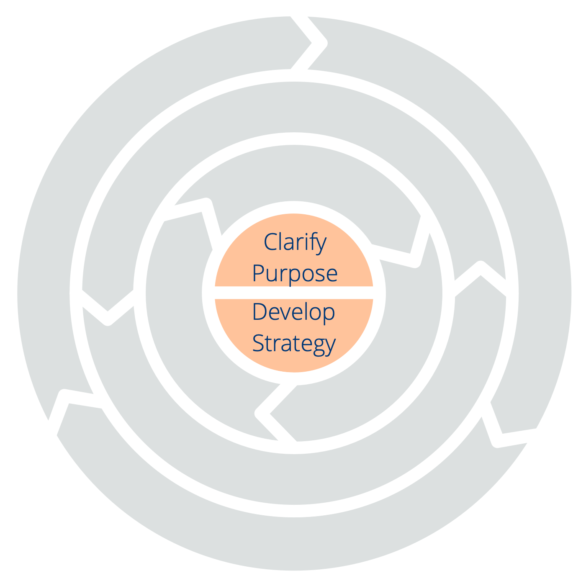
        

    

    <figcaption>Two Principles for Orientation: Clarify Purpose — Develop Strategy</figcaption>
</figure>

#### Principle 1 — Clarify Purpose

**_Ensure that everyone understands who the organization or team is serving, why and to what end, so that everyone is able to focus and unite their efforts on achieving that purpose._**

Essential Patterns to help you achieve this:

-   _Describe Organizational Drivers_ —  Understanding the situation that is motivating action is an essential component for understanding, defining, and communicating the purpose of an organization, a team, or a department.
-   _Determine Requirements_ — Clarifying the main requirement an organization or team is fulfilling helps people develop a shared understanding of direction for their contribution.

#### Principle 2 — Develop Strategy

**_Develop a strategy to guide value creation, so that everyone shares a common direction, and strategy is adapted as necessary to achieve the purpose._**

Essential Patterns to help you achieve this:

-   _Clarify and Develop Domains_ — A clearly defined area of influence, activity and decision-making is a prerequisite for defining an effective strategy for an organization, a team, or a role.
-   _Clarify Intended Outcome_ — Defining the intended outcome of a strategy is an essential component for monitoring and evaluating its effectiveness, and adapting things when necessary.
-   _Describe Organizational Drivers_ — Understanding the motive for acting in response to a specific situation is an essential component for designing an effective strategy for responding to it 
-   _Clarify and Develop Strategy_ — Stakeholders collaborating on creating and evolving strategy for an organization, team, or role helps to support creation of relevant and effective strategy.
-   _Evaluate and Evolve Policies_ — Reviewing strategy and evolving it as necessary over time ensures it remains helpful and relevant to the organization, team, or role.
-   _Define and Monitor Metrics_ — Defining criteria for success or failure is necessary for figuring out whether or not the strategy is effective.

### Three Principles for Navigation

<figure class="fig fig--limit-height fig--scale-small">
    

        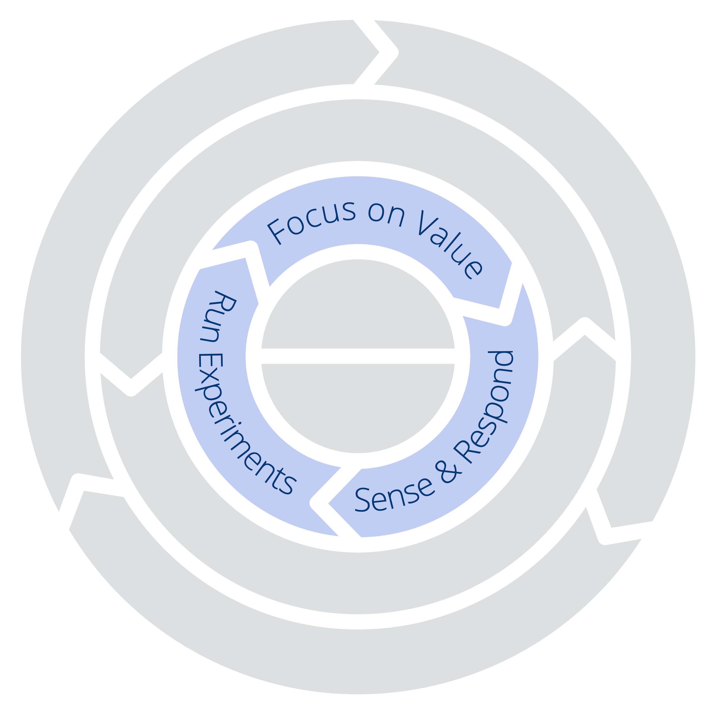
        

    

    <figcaption>Three Principles for Navigation: Focus on Value — Sense &amp; Respond — Run Experiments</figcaption>
</figure>

#### Principle 3 — Focus on Value

**_Focus your daily work on value delivery, so that the stuff that needs doing to achieve your purpose is done._**

Essential patterns to help you achieve this:

-   _Clarify and Develop Domains_ — Clarifying the area of influence, activity and decision-making that a team or person in a role is responsible for enables them to understand the value they are expected to deliver.
-   _Respond to Organizational Drivers_ — Ensuring people in the organization respond to relevant impediments and opportunities maximizes an organization’s potential for creating value.
-   _Prioritize Backlogs_ — When you prioritize your list of work items by value, it is obvious which ones need to be worked on first. 
-   _Limit Work In Progress_ — Limiting the number of concurrent work items for people and teams helps to maintain a steady flow of value and encourages collaboration when work is blocked.
-   _Daily Standup_ — A Daily Standup provides the space for a team to organize how they will create value during the day ahead.
-   _Test Arguments Qualify as Objections_ — Considering whether or not arguments brought forward against a decision reveal worthwhile improvements or unwanted consequences supports keeping your decision-making focused on value and avoids getting derailed by unfounded opinions and personal preferences.

#### Principle 4 — Sense & Respond

**_Identify, prioritize and respond to impediments and opportunities, so that you can adapt or pivot as necessary and improve where you can._**

Essential patterns to help you achieve this:

-   _Continuous Improvement of Work Process_ — Getting in the habit of continuously seeking to improve the work process supports people's skill in identifying and acting on opportunities to improve.
-   _Describe Organizational Drivers_ — Before acting on a perceived impediment or opportunity, it is essential to understand the situation and establish that it makes sense for the organization to address it.
-   _Determine Requirements_ — Agreeing on the general direction and scope of response to an impediment or opportunity first, supports effective decision-making about what specifically to do.
-   _Governance Backlog_ — Keeping a prioritized list of all impediments and opportunities that require a governance decision to be made keeps outstanding issues visible and clarifies what is most important to respond to first.
-   _Navigate via Tension_ — When everyone in the organization pays attention for situations that appear different to what is expected or desired, and brings that information to the attention of those responsible, you maximize the organization’s potential for identifying impediments and opportunities.
-   _Respond to Organizational Drivers_ — Responding only to challenges and opportunities that are valuable for the organization maximizes return on investment of the limited time, energy, and resources you have available.

#### Principle 5 — Run Experiments

**_Run experiments to address complex challenges, so that you learn how to move closer to where you want to be._**

Essential patterns to help you achieve this:

-   _Describe Organizational Drivers_ — Building a shared mental model of the situation you want to address is essential for successfully designing, running, and later on evaluating experiments.
-   _Determine Requirements_ — Clarifying the requirement is a prerequisite for designing the experiment, and for determining metrics for success.
-   _Define and Monitor Metrics_ — Defining clear criteria for determining success before the start of an experiment, helps to reveal flaws in its design and supports effective evaluation of outcomes. 
-   _Consent Decision-Making_ — An effective group process for viewing a proposition from a diversity of perspectives, and for testing whether or not an experiment is good enough and safe enough to run.
-   _Evaluate and Evolve Policies_ — An experiment needs to be regularly reviewed to determine what outcomes it achieves, and, as a consequence, potentially adapted, or even stopped.
-   _Limit Work in Progress_ — Limit the number of concurrent experiments to avoid overwhelm and maintain a steady flow of value. 
-   _Create A Pull System for Organizational Change_ — Inviting and enabling people to run experiments when they discover organizational requirements supports an effective and decentralized approach to organizational development.

### Two Principles for Structure

<figure class="fig fig--limit-height fig--scale-small">
    

        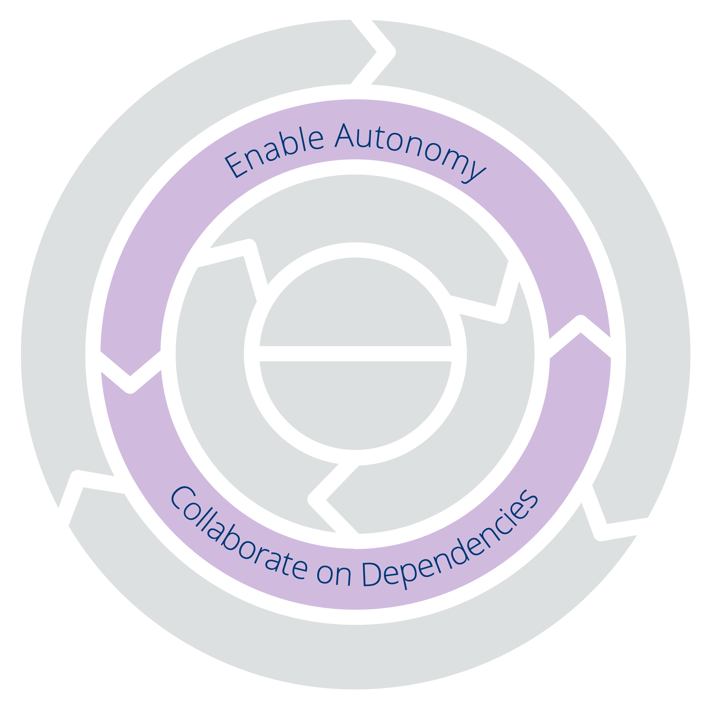
        

    

    <figcaption>Two Principles for Structure: Enable Autonomy — Collaborate on Dependencies</figcaption>
</figure>

#### Principle 6 — Enable Autonomy

**_Free individuals and teams up to create value as autonomously as possible, so that you can deliver value fast and avoid unnecessary dependencies._**

Essential patterns to help you achieve this:

-   _Clarify and Develop Domains_ — When people understand their own areas of responsibility, and those of others too, they know what is expected of them and where they are dependent on others.
-   _Pull System For Work_ — People being able to pull in new work items when they have capacity eliminates overload and improves productivity.
-   _Role_ — Delegating autonomy to an individual to decide and act within clearly defined constraints frees individuals up to create value, and enables those who delegate to retain as much influence as necessary. 
-   _Circle_ — Delegating autonomy to a team to organize and govern themselves within clearly defined constraints frees the team up to create value, and enables those who delegate that authority to retain as much influence as necessary.
-   _Clarify and Develop Strategy_ — A strategy for creating value, developed by the individual or team and agreed upon by all relevant stakeholders, builds trust and supports autonomy.
-   _Development Plan_ — Collaborating with relevant stakeholders on developing a plan for how to improve helps a team or individual in a role develop their skill and competence, and builds trust among all concerned.
-   _Align Flow_ — Moving decision-making close to where value is created while retaining the influence of the relevant stakeholders supports the flow of value, and eliminates unnecessary dependencies and delays.

#### Principle 7 — Collaborate on Dependencies

**_Co-create and evolve a coherent system to deal with all dependencies, so that you deliver value fast when dependencies cannot be avoided._**

Essential patterns to help you achieve this:

-   _Navigate via Tension_ — Everyone in the organization paying attention to dependencies maximizes the potential for unmanaged dependencies to be identified and responded to.
-   _Clarify and Develop Domains_ — When people understand their own areas of responsibility, and those of others too, they also understand where collaboration on dependencies will be necessary.
-   _Visualize Work_ — Visualizing work items and the dependencies between them makes it easier to manage dependencies in cooperation with the relevant stakeholders. 
-   _Respond to Organizational Drivers_ — Understanding why a dependency exists in the first place, and ensuring it is taken care of, is essential for collaborating on managing or resolving dependencies. 
-   _Involve Those Affected_ — To address dependencies in an effective way, it often helps to gather the perspectives of all (relevant) stakeholders and involve them in the decision-making process.
-   _Linking_ — Dependencies between two teams can often be addressed effectively by sending a _Representative_ to the decision-making of the other team, to ensure all relevant perspectives are considered and ownership of decisions is shared.
-   _Delegate Circle_ — When teams depend on each other, they can delegate the authority to make and evolve policies relating to specific dependencies to a circle of _Representatives_, to bring together relevant perspectives and generate ownership among all represented teams.
-   _Align Flow_ — Moving decision-making close to where value is created brings together the people necessary for making decisions in response to specific dependencies and eliminates unnecessary decision-making bottlenecks.
-   _Create a Pull System for Organizational Change_ — Invite and enable the people affected by dependencies to make changes to organizational structure, to address those dependencies and facilitate the ongoing evolution of a coherent and effective organization.

### Three Principles for Transformation

<figure class="fig fig--limit-height fig--scale-small">
    

        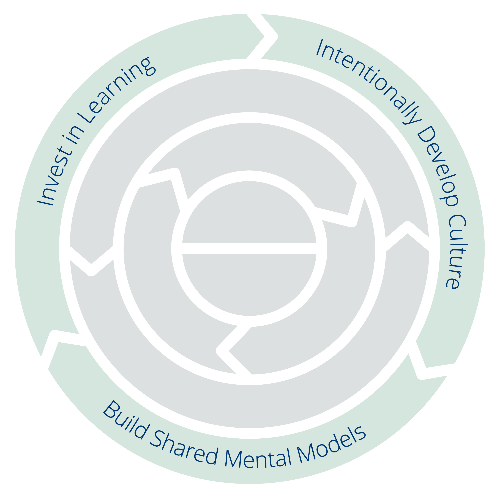
        

    

    <figcaption>Three Principles for Transformation: Invest in Learning — Intentionally Develop Culture — Build Shared Mental Models</figcaption>
</figure>

#### Principle 8 — Invest in Learning

**_Support everyone in developing their competence and skill, so that their contribution remains valuable and the organization can evolve._**

Essential patterns to help you achieve this:

-   _Navigate via Tension_ — Everyone in the organization paying attention for situations where growing competence and skills may be valuable focuses the learning effort and facilitates continuous improvement.
-   _Evaluate Meetings_ — A brief evaluation at the end of each meeting or workshop helps people identify their strengths, growing edges, and ways to improve their contribution in the future.
-   _Peer Review_ — When teams or people in roles regularly invite relevant stakeholders for a review of their effectiveness, they can learn about their strengths and growing edges, and identify ways they can improve their contribution in the future.
-   _Development Plan_ — Collaborating with relevant stakeholders on a plan for how to develop necessary skills and competence is an effective way of focusing the learning efforts of a person in a role, or for a team.
-   _Peer Feedback_ — Inviting feedback from peers supports people in understanding their strengths and growing edges, so that they can invest in learning where helpful.

#### Principle 9 — Intentionally Develop Culture

**_Collaborate on fostering a cooperative culture where everyone can achieve their fuller potential, so that you build and maintain an engaging and productive work environment._**

Essential patterns to help you achieve this:

-   _Artful Participation_ — Introducing the concept of Artful Participation to people invites them to pay conscious attention to how they contribute, and to make changes when they realize their current approach can be improved.
-   _Adopt the Seven Principles_ — The seven principles provide guidelines for behavior that enable a productive, engaging, and cooperative culture.
-   _Agree on Values_ — Agreement on fundamental guidelines for behavior in the organization defines ethical parameters for action and facilitates coherence.
-   _Evaluate and Evolve Policies_ — Regular review and intentional evolution of policies relating to culture keeps them alive in the consciousness of the people and helps identify when and how these policies can be improved.
-   _Contract for Successful Collaboration_ — Co-creating mutually beneficial agreements for collaboration from the start supports building and maintaining an engaging and productive working environment and a culture of trust between parties.
-   _Create a Pull System for Organizational Change_ — Distributing the responsibility for developing culture to everybody invites proactivity in addressing challenges and opportunities as they arise.

#### Principle 10 — Build Shared Mental Models

**_Invest in building shared mental models, so that everyone can engage in meaningful dialogue about what's happening and what needs to be done, and in the process deepen their understanding of how the organization works, what it does and why._**

Essential patterns to help you achieve this:

-   _Navigate via Tension_ — Looking out for, and addressing situations that could benefit from building or refining a shared mental model, helps people to get on the same page and supports productive dialogue.
-   _Determine Requirements_ — Determining what's required to respond appropriately to an organizational driver before deciding what to do helps develop a shared understanding of the direction and scope of a suitable response to the driver.
-   _Clarify and Develop Domains_ — Explicitly clarifying and documenting areas of  responsibility ensures a shared mental model regarding expectations and responsibilities.
-   _Clarify Intended Outcome_ — By first agreeing on the intended outcome of a proposed activity, project, or policy, people develop a shared understanding of where things should be headed and can then engage in productive dialog about how to get there.

### Where to Start?

<figure class="fig fig--limit-height fig--scale-small">
    

        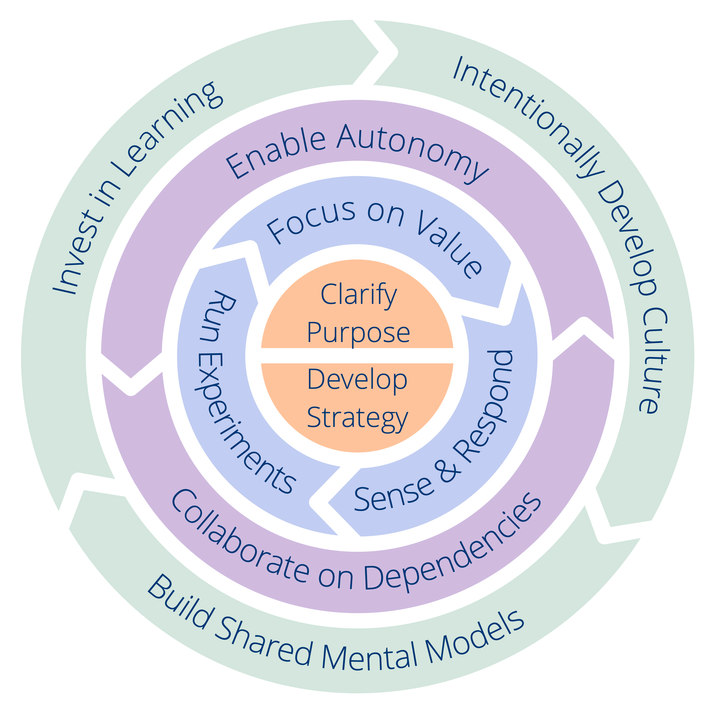
        

    

    <figcaption>Ten Principles for Evolving Teams and Organizations</figcaption>
</figure>

Each principle supports a specific outcome. To determine where to start in your organization or team, **take a look at the outcomes for each principle** (the text after "_so that_") and reflect on where your greatest need lies at the moment. In any case, **check that you are clear enough on your organization's or team's purpose and strategy before you proceed**.

In the illustration above you can see that some of the principles are more closely related than others, which might further inform you of where to start.

For each principle we included a list of suggestions for things you can try. These suggestions are taken from the [menu of patterns contained in Sociocracy 3.0](http://patterns.sociocracy30.org). For now, we only added the most essential patterns that support each principle, in future versions of this framework we will include even more patterns. 

## Appendix

### Changelog

#### 2026-01-26

This update brings substantial changes to the foundations of S3, including several revisions that affect many concepts, patterns, and glossary terms, as well as significant changes to several patterns.

**Changes to Key Concepts**

-   Introduction: Added an introduction to the section that briefly outlines all key concepts and their relationships.
-   Added **_Model for Purposeful Action_**: We consolidated the work that began with the introduction of Requirements (2022) into a single, coherent model, which is foundational for understanding Sociocracy 3.0 in its current form. It introduces **<a href="glossary.html#entry-purpose" class="glossary-tooltip" data-toggle="tooltip" title="Purpose: The reason why something is done, used, or created; a guiding motivation that directs actions, decisions, and resources toward achieving a valuable outcome.">Purpose</a>** and **<a href="glossary.html#entry-intervention" class="glossary-tooltip" data-toggle="tooltip" title="Intervention: The specific steps you take and/or the constraints you put in place to fulfill a purpose.">Interventions</a>** as explicit concepts and integrates them consistently with Drivers and Requirements.
-   **Drivers and Requirements**: Refined descriptions to make their roles, differences, and overlaps more explicit:
    -   **Driver**: *Current conditions* (instead of "current situation") that lead to an *effect* of relevance to the organization.
    -   **Requirement**: *Enabling conditions* (instead of "need") expected to lead to *intended outcomes* (instead of "anticipated impact").
-   **_Governance and Operations_**: Revised and extended the chapter, and added a section about distributing governance throughout the organization.
-   Renamed the concept of "agreement" to **<a href="glossary.html#entry-policy" class="glossary-tooltip" data-toggle="tooltip" title="Policy: An intervention that is created and evolved through governance; a process, procedure, protocol, plan, strategy, or guideline.">Policy</a>** and integrated it into the chapter about Governance and Operations. "Agreement" remains in use throughout the guide as a general term.
-   Added **examples** where possible to support understanding and correct interpretation.
-   Added the concept of **_Complexity_**.

**Changes to Principles**

- **_Principle of Equivalence_**: Addressed the balance between distributed authority and effective governance in complex organizations.

**Glossary Updated**

- **Changed**
    - _Agreement_ to <a href="glossary.html#entry-policy" class="glossary-tooltip" data-toggle="tooltip" title="Policy: An intervention that is created and evolved through governance; a process, procedure, protocol, plan, strategy, or guideline.">Policy</a> and revised the definition
    - Replaced _account for_ with _attend to_ (in relation to <a href="glossary.html#entry-domain" class="glossary-tooltip" data-toggle="tooltip" title="Domain: A distinct area of responsibility and authority within an organization.">Domains</a>)  
- **Added**: <a href="glossary.html#entry-acceptance-criteria" class="glossary-tooltip" data-toggle="tooltip" title="Acceptance Criteria: A number of specific, verifiable properties of the conditions and/or outcomes of a requirement that, when taken together, indicate the requirement is considered fulfilled.">Acceptance Criteria</a>, <a href="glossary.html#entry-current-conditions" class="glossary-tooltip" data-toggle="tooltip" title="Current conditions: (In the context of organizational drivers) Current conditions are present, observable circumstances that are causing — or could plausibly cause — effects relevant to the organization&#x27;s purpose.}}">Current Conditions</a>, <a href="glossary.html#entry-constraint" class="glossary-tooltip" data-toggle="tooltip" title="Constraint: A limitation or restriction that controls or limits what someone can do or what can happen. It can be a requirement to fulfill, a rule to follow, or a boundary on actions, behaviors, or outcomes.">Constraint</a>, <a href="glossary.html#entry-enabling-conditions" class="glossary-tooltip" data-toggle="tooltip" title="Enabling Conditions: Conditions considered necessary to establish for achieving or maintaining intended outcomes (in the context of a requirement).">Enabling Conditions</a>, <a href="glossary.html#entry-intended-outcome" class="glossary-tooltip" data-toggle="tooltip" title="Intended Outcome: Specific, observable results you aim to achieve in relation to a driver.">Intended Outcome</a>, <a href="glossary.html#entry-intervention" class="glossary-tooltip" data-toggle="tooltip" title="Intervention: The specific steps you take and/or the constraints you put in place to fulfill a purpose.">Intervention</a>, <a href="glossary.html#entry-purpose" class="glossary-tooltip" data-toggle="tooltip" title="Purpose: The reason why something is done, used, or created; a guiding motivation that directs actions, decisions, and resources toward achieving a valuable outcome.">Purpose</a>, <a href="glossary.html#entry-tuners" class="glossary-tooltip" data-toggle="tooltip" title="Tuners: One or more people who use the information and ideas collected in Proposal Forming to design a coherent proposal (not a final decision).">Tuners</a>
- **Updated**: <a href="glossary.html#entry-deliverable" class="glossary-tooltip" data-toggle="tooltip" title="Deliverable: A product or service provided provided in the context of an intervention. Products include components and materials.">Deliverable</a>, <a href="glossary.html#entry-governance" class="glossary-tooltip" data-toggle="tooltip" title="Governance: The sum of activities involved in setting objectives and making and evolving decisions (policies) that guide people toward achieving those objectives, for the entire organization or specific people within it.">Governance</a>, <a href="glossary.html#entry-governance-backlog" class="glossary-tooltip" data-toggle="tooltip" title="Governance Backlog: A visible, prioritized list of items relating to the governance of a domain.">Governance Backlog</a>, <a href="glossary.html#entry-key-responsibilities" class="glossary-tooltip" data-toggle="tooltip" title="Key Responsibilities: The work and decision-making considered essential in achieving a domain’s purpose.">Key Responsibilities</a>, <a href="glossary.html#entry-objection" class="glossary-tooltip" data-toggle="tooltip" title="Objection: An argument – relating to a proposal, existing decision, or activity being conducted by one or more members of the organization – that reveals consequences or risks that are preferably avoided for the organization or that demonstrates worthwhile ways to improve.">Objection</a>, <a href="glossary.html#entry-objective" class="glossary-tooltip" data-toggle="tooltip" title="Objective: A specific result (or goal) that a person, team, or organization wants to achieve. In the context of S3, objectives refer to achieving intended outcomes, establishing desired conditions, and responding adequately to organizational drivers, all with the overarching aim of fulfilling the organization’s purpose.">Objective</a>, <a href="glossary.html#entry-organization" class="glossary-tooltip" data-toggle="tooltip" title="Organization: A group of people collaborating toward a common purpose by delivering products and services that meet the needs or desires of the customers they serve.">Organization</a>, <a href="glossary.html#entry-organizational-driver" class="glossary-tooltip" data-toggle="tooltip" title="Organizational Driver: A situation where the organization&#x27;s members have a motive to respond because they anticipate that doing so is beneficial or necessary for fulfilling the organization’s purpose. (by helping generate value, eliminate waste, or avoid undesirable risks or consequences). Drivers are often expressed as _current conditions_ that lead to current or anticipated _effects_ that are _relevant_ to the organization.">Organizational Driver</a>, <a href="glossary.html#entry-requirement" class="glossary-tooltip" data-toggle="tooltip" title="Requirement: A state considered valuable to establish or maintain in order to address a specific driver. Requirements are often expressed as _intended outcome(s)_, and _enabling condition(s)_ considered necessary to establish for achieving or maintaining those outcomes.">Requirement</a>, <a href="glossary.html#entry-strategy" class="glossary-tooltip" data-toggle="tooltip" title="Strategy: A high-level approach for how people will fulfill the purpose of a domain (within the constraints of that domain).">Strategy</a>, <a href="glossary.html#entry-team" class="glossary-tooltip" data-toggle="tooltip" title="Team: A group of people collaborating toward fulfilling a shared purpose. Typically, a team is part of an organization, or it is formed as a collaboration of several organizations.">Team</a>, <a href="glossary.html#entry-value" class="glossary-tooltip" data-toggle="tooltip" title="Value: The importance, worth, or usefulness of something for fulfilling a purpose. Also: &quot;a valued principle that guides behavior&quot; (mostly used as plural &quot;values&quot;, e.g. &quot;organizational values&quot;).">Value</a>, <a href="glossary.html#entry-waste" class="glossary-tooltip" data-toggle="tooltip" title="Waste: Any activity, output, or use of resources that does not contribute — directly or indirectly — to fulfilling a specific purpose.&quot;">Waste</a>

**Changes to Patterns**

- Revised many pattern descriptions as a consequence of introducing new concepts, renaming the concept of Agreement to Policy, and introducing the Model of Purposeful Action.
- _Circle_: Updated and extended the pattern; corresponding revisions were also made to _Double-Linked Hierarchy_.
- _Clarify and Develop Domains_: Simplified examples, aligned with changes in Define and Monitor Metrics
- _Consent Decision-Making_: Updated according to the Model for Purposeful Action Purpose, improved overall clarity.
- _Define and Monitor Metrics_:  Expanded and revised the pattern description, added practical examples.
- _Determine Requirements_: Completely revised the pattern, added new examples
- _Evaluate and Evolve Policies_: Added a full description of the format and improved clarity.
- _Governance Backlog_: Revised for alignment with updated concepts. 
- _Governance Meeting_: Updated for clarity and consistency.
- _Helping Team_: Completely revised the pattern, added examples.
- _Planning and Review Meeting_: Refined descriptions, improved flow.
- _Proposal Forming_: Simplified the format by clearly separating information gathering and generative phases, revised the text and added examples.
- _Record Governance Decisions_: Expanded explanation of benefits, revised the template, and clarified recommendations for record contents.
- _Respond to Organizational Drivers_: revised and aligned with Model for Purposeful Action 

**Renamed and Moved Patterns**

-   renamed _Evaluation Criteria_ to _Define and Monitor Metrics_ 
-   renamed _Record Agreements_ to _Record Governance Decisions_ 
-   renamed _Driver Mapping_ to _Requirements-Mapping_
-   renamed _Test Arguments Qualify as Objections_ to _Test **if** Arguments Qualify as Objections_ 
-   moved _Adopt the Seven Principles_ and _Create a Pull System for Organizational Change_ to the category _Bringing in S3_
-   moved  _Continuous Improvement of Work Process_ to category _Organize Work_

**Removed Pattern**

-    _Clarify Intended Outcomes_ (now integrated into the concept *Requirement*) 

#### 2024-04-18

**General Changes**

-   Created a separate chapter for Organizational Structure, 
    -   added _Peach Organization_, _Service Organization_, _Fractal Organization_ and _Double-Linked Hierarchy_ as examples of larger structures.
    -   moved _Delegate Circle_ and _Service Circle_ into _Building Organizations_
-   updated the [S3 Organization Canvas](https://s3canvas.sociocracy30.org/s3-organization-canvas.html) 

**Glossary**

-   removed "need" from glossary 

**Renamed Patterns:**

-   renamed _Transparent Salary_ to _Open Salary_ 

**Added Patterns:** (all with a brief summary only for now)

-   _Collaborate on Dependencies_ 
-   _Deliver Value Incrementally_ 
-   _Design Adaptable Systems_ 
-   _Enable Autonomy_ 
-   _Financial Transparency_ 
-   _Invest in Ongoing Learning_ 
-   _Manage the Whole System_ 
-   _Share Costs and Gains_ 

**Removed Patterns:**

-   removed _Delegate Influence_ 

#### 2024-04-05

-   More changes relating to Requirements 
    -   updated glossary: revised definitions for <a href="glossary.html#entry-backlog" class="glossary-tooltip" data-toggle="tooltip" title="Backlog: A list of (often prioritized) uncompleted work items (typically a deliverable, requirement or a driver) that need to be addressed.">Backlog</a> and <a href="glossary.html#entry-governance-backlog" class="glossary-tooltip" data-toggle="tooltip" title="Governance Backlog: A visible, prioritized list of items relating to the governance of a domain.">Governance Backlog</a>
    -   Revised _Resolve Objections_, _Backlog_, _Governance Backlog_ and _Governance Meeting_
    -   revised recommended patterns in the _Common Sense Framework_

#### 2024-02-08

-   introduced _Requirement_ as a core concept distinct from the _Driver_: 
    -   added an explanation of _Requirement_ to _Drivers and Requirements_
    -   added new pattern _Determine Requirements_
    -   updated _Respond to Organizational Drivers_
    -   updated _Describe Organizational Drivers_:
    -   updated _Navigate via Tension_
    -   revised _Proposal Forming_, _Consent Decision Making_ and _Driver Mapping_
-   extended _Clarify and Develop Domains_ to include a detailed description and examples for each aspect of a domain description 
-   added an _example domain description_ to the appendix 
-   added a detailed description for each step to _Proposal Forming_ 
-   revised _The Principle of Consent_ and description of _Objection_ 
-   updated glossary: 
    -   revised definitions for <a href="glossary.html#entry-domain" class="glossary-tooltip" data-toggle="tooltip" title="Domain: A distinct area of responsibility and authority within an organization.">Domain</a>, <a href="glossary.html#entry-deliverable" class="glossary-tooltip" data-toggle="tooltip" title="Deliverable: A product or service provided provided in the context of an intervention. Products include components and materials.">Deliverable</a>, <a href="glossary.html#entry-organizational-driver" class="glossary-tooltip" data-toggle="tooltip" title="Organizational Driver: A situation where the organization&#x27;s members have a motive to respond because they anticipate that doing so is beneficial or necessary for fulfilling the organization’s purpose. (by helping generate value, eliminate waste, or avoid undesirable risks or consequences). Drivers are often expressed as _current conditions_ that lead to current or anticipated _effects_ that are _relevant_ to the organization.">Organizational Driver</a>, <a href="glossary.html#entry-objection" class="glossary-tooltip" data-toggle="tooltip" title="Objection: An argument – relating to a proposal, existing decision, or activity being conducted by one or more members of the organization – that reveals consequences or risks that are preferably avoided for the organization or that demonstrates worthwhile ways to improve.">Objection</a> and <a href="glossary.html#entry-concern" class="glossary-tooltip" data-toggle="tooltip" title="Concern: An assumption that cannot (for now at least) be backed up by reasoning or enough evidence to qualify as an objection to those who are considering it.">Concern</a>
    -   added new definitions for <a href="glossary.html#entry-requirement" class="glossary-tooltip" data-toggle="tooltip" title="Requirement: A state considered valuable to establish or maintain in order to address a specific driver. Requirements are often expressed as _intended outcome(s)_, and _enabling condition(s)_ considered necessary to establish for achieving or maintaining those outcomes.">Requirement</a>, <a href="glossary.html#entry-standard-constraint" class="glossary-tooltip" data-toggle="tooltip" title="Standard Constraint: A constraint that affects several domains (e.g., all sales teams, an entire branch, platform, or department) or even all domains of the organization (e.g., company-wide strategy, a business model, or an organization-wide rule).">Standard Constraint</a>, <a href="glossary.html#entry-overall-domain" class="glossary-tooltip" data-toggle="tooltip" title="Overall Domain: The domain that defines the organization&#x27;s purpose, overall strategy, business model(s), and other standard constraints.">Overall Domain</a>

#### 2022-04-26

-   added detailed description and new illustrations to _Test Arguments Qualify as Objections_ 

#### 2022-04-05

-   added detailed description and new illustrations to _Resolve Objections_ 

#### 2022-02-04

-   added detailed description of the _Consent Decision-Making_ process 
-   revised text of _Reasoned Decision-Making_ 
-   updated 20 illustration to align with style of new illustration for Consent Decision-Making 

#### 2022-01-27

-   added _Reasoned Decision-Making_ 
-   updated pattern categories: 
    -   new category _Evolving Organizations_
    -   renamed _Co-Creation and Evolution_ to _Sense-Making and Decision-Making_
    -   renamed _Focused Interactions_ to _Meeting Formats_
    -   renamed _Enablers of Collaboration_ to _Enablers of Co-Creation_
    -   and moved some patterns around
-   Aligned spelling of decision-making throughout the guide 
-   revised summary of _Resolve Objections_ 
-   revised text of _Driver Mapping_ (step 7) 

#### 2017 - 2021

##### 2021-09-22

-   fixed a link on the pattern map and added links to the principles 
-   fixed some typos, minor revisions to the text 

##### 2021-09-03

-   revised text about _Objections_ as well as the definitions of <a href="glossary.html#entry-objection" class="glossary-tooltip" data-toggle="tooltip" title="Objection: An argument – relating to a proposal, existing decision, or activity being conducted by one or more members of the organization – that reveals consequences or risks that are preferably avoided for the organization or that demonstrates worthwhile ways to improve.">Objection</a> and <a href="glossary.html#entry-concern" class="glossary-tooltip" data-toggle="tooltip" title="Concern: An assumption that cannot (for now at least) be backed up by reasoning or enough evidence to qualify as an objection to those who are considering it.">Concern</a> 

##### 2021-08-15

-   renamed _Open Domain_ to _Open Team_ 

##### 2021-06-18

-   added a dedicated chapter for each of the Seven Principles 
-   revised the ten principles of the Common Sense Framework 
-   updated section about governance in the introduction 
    -   added more text to explain how governance can be distributed throughout the organization
    -   more examples for governance decisions
-   corrected a few typos 
-   several small revisions 

##### 2021-05-15

-   _Navigate via Tension_: added more explanation about passing on drivers to another domain 
-   _Clarify and Develop Domains_: more explanation about refining the elements of a domain description, more information about metrics, monitoring and evaluation, added template illustration, 

##### 2021-03-15

-   updated the Seven Principles 

##### 2021-02-19

-   fixed several broken links on the online version 
-   corrected a few typos 

##### 2021-02-11

-   _Driver Mapping_: added explanation about applications of the pattern, and detailed instructions for each step of the format 

##### 2021-02-06

-   Revised glossary definitions for <a href="glossary.html#entry-semi-autonomy" class="glossary-tooltip" data-toggle="tooltip" title="Semi-Autonomy: The autonomy of people to decide for themselves how to create value, limited by the constraints of their domain and by objections brought by the delegator, representatives, or others.">Semi-Autonomy</a>, <a href="glossary.html#entry-self-organization" class="glossary-tooltip" data-toggle="tooltip" title="Self-Organization: Any activity or process through which people organize work. Self-organization happens within the constraints of a domain, but without the direct influence of  external agents. In any organization or team, self-organization co-exists with external influence (e.g. external objections or governance decisions that affect the domain).">Self-Organization</a> and <a href="glossary.html#entry-sociocracy" class="glossary-tooltip" data-toggle="tooltip" title="Sociocracy: An approach for organizing together where people affected by decisions can influence them on the basis of reasons to do so.">Sociocracy</a> 
-   Renamed Pattern: _Those Affected Decide_ to _Involve Those Affected_ 
-   Several small corrections and revisions 

##### 2021-02-03

-   Added the **_Common Sense Framework_** to the Practical Guide 
-   A new structure of the Practical Guide that makes that the relevant parts easier to find: 
    -   _What is Sociocracy 3.0_
    -   _The Seven Principles_
    -   _Key Concepts for Making Sense of Organizations_
    -   _The Patterns_
    -   _The Common Sense Framework_
    -   _Appendix_
-   Redesigned the website for better usability: 
    -   A new responsive menu that provides direct access to all patterns and other sections of the guide
    -   A new homepage that explains what is where
    -   A new layout for a cleaner experience on desktop and mobile devices

##### 2021-01-12

-   **Renamed Patterns:** 
    -   renamed _Clarify Domains_ to _Clarify and Develop Domains_
    -   renamed _Develop Strategy_ to _Clarify and Develop Strategy_
-   _Clarify and Develop Domains_: revised text, added more details and explanations about domain descriptions 
-   _Peer Review_: added more details about what should be reviewed 
-   _Peer Feedback_: revised the text and added more details 
-   _Breaking Agreements_: added summary 
-   added glossary entry for "metric" 
-   revised glossary entry for "governance" 
-   _Describe Organizational Drivers_: revised text 
-   Introduction: 
    -   added more details to the section about Domains and delegation
    -   removed illustration in the section about patterns and listed the pattern groups in the text
-   Appendix: 
    -   added a disclaimer
    -   added more information about the authors

##### 2020-05-08

-   revised all illustrations for a more consistent style and increased readability 
-   revised introduction: more explanation about patterns and core concepts 
-   updated glossary: revised explanation of <a href="glossary.html#entry-delegator" class="glossary-tooltip" data-toggle="tooltip" title="Delegator: An individual or group delegating responsibility for a domain to other(s).">Delegator</a>, <a href="glossary.html#entry-delegatee" class="glossary-tooltip" data-toggle="tooltip" title="Delegatee: An individual or group accepting responsibility for a domain delegated to them, becoming a role keeper or a team.">Delegatee</a>, <a href="glossary.html#entry-role" class="glossary-tooltip" data-toggle="tooltip" title="Role: A domain that is delegated to an individual, who then becomes the role keeper.">Role</a> and <a href="glossary.html#entry-pattern" class="glossary-tooltip" data-toggle="tooltip" title="Pattern: A process, practice or guideline that serves as a template for successfully responding to a specific kind of challenge or opportunity.">Pattern</a>, added <a href="glossary.html#entry-role-keeper" class="glossary-tooltip" data-toggle="tooltip" title="Role Keeper: An individual taking responsibility for a role.">role keeper</a> 

##### 2020-04-29

-   Introduction: Added _Objection_ and _Agreement_ to concepts 
-   renamed pattern _Objection_ to _Test Arguments Qualify as Objections_ 
-   renamed pattern _Agreement_ to _Record Agreements_ 
-   _Test Arguments Qualify as Objections_: revised text and updated illustration 
-   _Record Agreements_: revised text, added more details of agreements that might be recorded, updated illustration 

##### 2019-12-22

-   added new introduction text 
-   added "social technology" to glossary 
-   website now has separate pages for "Introduction" and "Concepts and Principles" 
-   ePub now looks much better 

##### 2019-11-29

-   Principle of Transparency: revised description to clarify that valuable information needs to be recorded, and then shared with everyone in the organization 
-   Principle of Empiricism: clarified that only those assumptions one relies on need to be tested 

##### 2019-06-27

-   _Objection_: further refined definition of objection, and updated the glossary term for <a href="glossary.html#entry-objection" class="glossary-tooltip" data-toggle="tooltip" title="Objection: An argument – relating to a proposal, existing decision, or activity being conducted by one or more members of the organization – that reveals consequences or risks that are preferably avoided for the organization or that demonstrates worthwhile ways to improve.">objection</a> accordingly 
-   replaced "action" with activity in a few places where it made more sense 
-   fixed a few typos 

##### 2019-05-03

-   refined glossary terms for <a href="glossary.html#entry-policy" class="glossary-tooltip" data-toggle="tooltip" title="Policy: An intervention that is created and evolved through governance; a process, procedure, protocol, plan, strategy, or guideline.">agreement</a>, <a href="glossary.html#entry-organization" class="glossary-tooltip" data-toggle="tooltip" title="Organization: A group of people collaborating toward a common purpose by delivering products and services that meet the needs or desires of the customers they serve.">organization</a> and <a href="glossary.html#entry-team" class="glossary-tooltip" data-toggle="tooltip" title="Team: A group of people collaborating toward fulfilling a shared purpose. Typically, a team is part of an organization, or it is formed as a collaboration of several organizations.">team</a>, added glossary term for <a href="glossary.html#entry-objective" class="glossary-tooltip" data-toggle="tooltip" title="Objective: A specific result (or goal) that a person, team, or organization wants to achieve. In the context of S3, objectives refer to achieving intended outcomes, establishing desired conditions, and responding adequately to organizational drivers, all with the overarching aim of fulfilling the organization’s purpose.">objective</a> 
-   Principle of Accountability: clarified individual accountability for work as well as for collaboration 
-   _Contract For Successful Collaboration_: revised text 
-   _Describe Deliverables_: added User Stories as an example for describing deliverables 
-   _Double-Linked Hierarchy_: revised summary 
-   _Delegate Circle_: refined summary 
-   _Objection_: refined definition of objection and concern, added illustration for a process to qualify an objection 
-   _Proposal Forming_: added missing process illustration 
-   _Role Selection_: small amendment to illustration 
-   _Transparent Salary_: explained what a salary formula is 

##### 2019-03-08

**General Changes**

-   expanded the introduction with more information about S3 and the history of sociocracy that was previously only available on the main S3 website 
-   updated section about governance in the introduction 
-   added captions to all illustrations 
-   renamed pattern group "Enablers of Co-Creation" to "Enablers of Collaboration" 
-   removed slide deck version and improved layout and formatting of pdf and ePub version 
-   website version: added clickable pattern map for simpler navigation, added glossary overlays to many patterns 

**Glossary:**

-   added <a href="glossary.html#entry-team" class="glossary-tooltip" data-toggle="tooltip" title="Team: A group of people collaborating toward fulfilling a shared purpose. Typically, a team is part of an organization, or it is formed as a collaboration of several organizations.">team</a> to glossary (and replaced group with team throughout the practical guide where applicable) 
-   updated definition for <a href="glossary.html#entry-deliverable" class="glossary-tooltip" data-toggle="tooltip" title="Deliverable: A product or service provided provided in the context of an intervention. Products include components and materials.">deliverable</a> 
-   removed **driver statement** from text and glossary 
-   updated definitions for <a href="glossary.html#entry-governance" class="glossary-tooltip" data-toggle="tooltip" title="Governance: The sum of activities involved in setting objectives and making and evolving decisions (policies) that guide people toward achieving those objectives, for the entire organization or specific people within it.">governance</a>, <a href="glossary.html#entry-operations" class="glossary-tooltip" data-toggle="tooltip" title="Operations: Doing the work and organizing day-to-day activities within the constraints defined through governance.">operations</a>, and <a href="glossary.html#entry-self-organization" class="glossary-tooltip" data-toggle="tooltip" title="Self-Organization: Any activity or process through which people organize work. Self-organization happens within the constraints of a domain, but without the direct influence of  external agents. In any organization or team, self-organization co-exists with external influence (e.g. external objections or governance decisions that affect the domain).">self-organization</a> 

**Illustrations:**

-   updated templates for domain description and role description 
-   updated illustrations for _Linking_ and _Double-Linking_ 

**Changes to Patterns:**

-   _Agreement_: description now mentions that any expectations should be recorded 
-   _Describe Deliverables_: updated summary 
-   _Describe Organizational Drivers_: more information on summarizing drivers 
-   _Resolve Objections_: added summary and description 

##### 2018-08-17

**General Changes**

-   added and revised the brief summary for many of the patterns 
-   removed bullet points in favor of full sentences in many patterns 
-   lots of small improvements to grammar and language 
-   included the URL to the web version of the practical guide 

**Glossary:**

-   **updated:** account for (v.), concern, deliverable, governance, objection, operations, primary driver, principle, role, self-organization, semi-autonomy, subdriver, values 
-   **added:** constituent, coordination, delegation, driver statement, evolve (v.), flow of value, helping team and open domain 
-   **removed:** peer driver 

**Changes to Introduction**

-   added the driver for creating Sociocracy 3.0 
-   The Seven Principles: 
    -   _The Principle of Empiricism_: removed reference to "falsification"
    -   _The Principle of Consent_ is now explained more clearly as "Raise, seek-out and resolve objections to decisions and actions"
-   _Governance, Semi-Autonomy and Self-Organization_: we refined the definitions of Governance, Operations, and Self-Organization, removed any reference to "coordination", and clarified the distinction between governance and operations 
-   _Drivers and Domains_: we clarified how domains can be understood in relation to organizational drivers 

**Changes to Patterns:**

-   _Agree on Values_: improved description 
-   _Align Flow_: improved description and illustration 
-   _Adapt Patterns To Context_: improved description 
-   _Agreement_: improved description, updated template 
-   _Artful Participation_: improved summary 
-   _Clarify Intended Outcome_ (renamed from _Intended Outcome_): improved description 
-   _Consent Decision-Making_: improved description, updated illustration 
-   _Continuous Improvement Of Work Process_: improved description 
-   _Contract For Successful Collaboration_: renamed the pattern to a more descriptive name, and explained process of creating contracts, and what needs to be in them 
-   _Coordination Meeting_: clarified agenda items, updated illustration 
-   _Delegate Circle_: improved description 
-   _Delegate Influence_: improved description 
-   _Describe Deliverables_: improved description 
-   _Describe Organizational Drivers_: made explicit that a driver statement is typically only 1-2 sentences, revised section about explaining the need, moved the section about reviewing driver statements from _Respond to Organizational Drivers_ to this pattern, and added a new illustration that explains _how_ to describe organizational drivers 
-   _Double Linking_: aligned description to _Link_ 
-   _Double-Linked Hierarchy_: explained in more detail what a double-linked hierarchy is, and how it is created 
-   _Evaluate and Evolve Agreements_: rearranged the text so it's clear there is a long and a short format 
-   _Evaluation Criteria_: suggested clarifying a threshold for success, and we explained about also evolving evaluation criteria when evolving agreements 
-   _Facilitate Meetings_: improved description 
-   _Fractal Organization_: extended and improved description 
-   _Governance Backlog_: improved description 
-   _Governance Meeting_: improved description, clarified agenda items 
-   _Invite Change_: description now focuses on _how_ to invite change 
-   _Linking_: aligned description to _Double Linking_ 
-   _Logbook_: clarified that there is no difference between logbooks for groups and logbooks for roles 
-   _Navigate via Tension_: improved description, added a new illustration to clarify the distinction between _Navigate via Tension_, _Describe Organizational Drivers_ and _Respond to Organizational Drivers_ 
-   _Objection_: clarified the difference between objection and concern, clarified what qualifies as an objection, and how to qualify objections in a group context 
-   _Open Domain_: improved description and updated illustration 
-   _Open Systems_: improved description 
-   _Open Space for Change_: renamed from _Open S3 Adoption_, improved description 
-   _Peach Organization_: clarified relationship between periphery and center 
-   _Proposal Forming_: revised text and illustration to make process of choosing tuners more clear, updated template for proposal to align with template for agreement 
-   _Representative_: improved description 
-   _Resolve Objections_: updated both illustrations 
-   _Respond to Organizational Drivers_: improved description, simplified qualification of organizational drivers 
-   _Role_: improved description 
-   _Role Selection_: improved description, added description of each step 
-   _Rounds_: improved description 
-   _Transparent Salary_: added more details about fairness, and on how to develop a salary formula 

**Renamed Patterns:**

-   _Evaluate Agreements_ to _Evaluate and Evolve Agreements_ 
-   _Intended Outcome_ to _Clarify Intended Outcome_ 
-   _Open S3 Adoption_ to _Open Space for Change_ 
-   _Contracting and Accountability_ to _Contract For Successful Collaboration_ 

**Added New Patterns:**

-   _Check In_ 
-   _Co-create Proposals_ 
-   _Prepare for Meetings_ 
-   _Time-box Activities_ 

##### 2018-03-21

-   renamed pattern _Describe Drivers_ to _Describe Organizational Drivers_ 
-   _Describe Organizational Drivers_: explained four aspects of a driver: current situation, effect of the situation on the organization, need of the organization in relation to this situation, and impact of attending to need 
-   added _need_ to glossary 

##### 2017-11-16

-   small corrections 
-   aligned glossary entries for _Circle_ and _Role_ to pattern text 
-   _Development Plan_: clarification of responsibilities 
-   _Role_: clarified evolution of strategy 

##### 2017-11-10

-   various small clarifications and corrections 
-   _Circle_: clarified relationship between circle and domain 
-   _Role_: improved description 
-   _Rounds_: improved description 
-   moved _Open Domain_, _Helping Team_ and _Open Systems_ to category "Building Organizations" 
-   added several terms to the glossary 

##### 2017-10-21

-   added Liliana David to authors 
-   dropped the term "framework" (replaced with "practical guide") 
-   updated order of patterns 
-   added an index of all the patterns 
-   added a glossary 
-   added acknowledgments 
-   various small clarifications and corrections to text and illustrations 
-   updated templates for agreement and development plan 

**Changes to Introduction**

-   added "what's in it for me?" 
-   added definitions for governance, self-organization, semi-autonomy, operations to introduction 
-   clarified domains and their relationship to drivers 
-   fleshed out core concepts 
-   made all principles actionable 

**Changes to Patterns:**

-   _Artful Participation_: improved description 
-   _Agreement_: clarified that the concept of agreements is applicable to people in roles 
-   _Clarify Domains_: improved description 
-   _Circle_: updated definition of "circle", improved description 
-   _Driver_: updated definition of "driver" 
-   _Development Plan_: improved description, updated template 
-   _Develop Strategy_: updated definition of "strategy", improved description 
-   _Double-Linked Hierarchy_: new illustration 
-   _Evaluate Agreements_: aligned questions to peer review 
-   _Governance Backlog_: improved description 
-   _Logbook_: added details about governance to personal logbook 
-   _Objections_: clarified qualifying objections 
-   _Peer Review_: improved description 
-   _Respond to Organizational Driver_: integrated information about qualifying drivers 
-   _Role_: clarified role keeper may maintain a governance backlog, introduced the term "role keeper" for a person in a role 
-   _Proposal Forming_: added criteria for selecting tuners, added step for prioritizing considerations, small clarifications 
-   _Resolve Objections_: updated illustration to better reflect the process 

**Renamed Patterns:**

-   _Backbone Organization_ to _Service Organization_ 
-   _Effectiveness Review_ to _Peer Review_ 
-   _Strategy_ to _Develop Strategy_ 
-   _Domain Description_ to _Clarify Domains_ 
-   _Describing Deliverables_ to _Describe Deliverables_ 

**Added Patterns:**

-   _Delegate Influence_ 
-   _Describe Drivers_ 
-   _Open Domain_ 

**Removed Patterns**

-   _Coordination Circle_ 
-   _Nested Domains_ 
-   _Qualify Driver_ 

### Alphabetical List Of All Patterns

<dl>

  <dt><a href="adapt-patterns-to-context.html">Adapt Patterns to Context</a></dt>
  <dd>
Adapt and evolve S3 patterns to suit your specific context.
</dd>

  <dt><a href="adopt-the-seven-principles.html">Adopt the Seven Principles</a></dt>
  <dd>
Align collaboration with the Seven Principles.
</dd>

  <dt><a href="agree-on-values.html">Agree On Values</a></dt>
  <dd>
Intentionally evolve the culture in your organization.
</dd>

  <dt><a href="align-flow.html">Align Flow</a></dt>
  <dd>
In support of a continuous flow of value, move decision-making close to where value is created, and align the flow of information accordingly.
</dd>

  <dt><a href="artful-participation.html">Artful Participation</a></dt>
  <dd>
Commit to doing your best to act and interact in ways that enable effective collaboration.
</dd>

  <dt><a href="ask-for-help.html">Ask for Help</a></dt>
  <dd>
A simple protocol for learning, skill sharing, and building connections, with respect for people's agency.
</dd>

  <dt><a href="backlog.html">Backlog</a></dt>
  <dd>
Keep an up-to-date list of things you need to address, so that you can remember them, and use that information to plan and organize your work.
</dd>

  <dt><a href="be-the-change.html">Be the Change</a></dt>
  <dd>
Lead by example.
</dd>

  <dt><a href="breaking-agreements.html">Breaking Agreements</a></dt>
  <dd>
Break agreements when you are certain the benefit for the organization outweighs the cost of waiting to amend that agreement first, and take responsibility for any consequences.
</dd>

  <dt><a href="bylaws.html">Bylaws</a></dt>
  <dd>
Secure S3 principles and patterns in your bylaws as needed to protect <strong>legal integrity</strong> and <strong>organizational culture</strong>.
</dd>

  <dt><a href="check-in.html">Check In</a></dt>
  <dd>
Help people to become aware of themselves and others, and to focus, be present, and engage.
</dd>

  <dt><a href="circle.html">Circle</a></dt>
  <dd>
A circle is a self-governing and semi-autonomous team of equivalent people who collaborate to account for a domain.
</dd>

  <dt><a href="clarify-and-develop-domains.html">Clarify and Develop Domains</a></dt>
  <dd>
Explicitly clarify, and then regularly evaluate and develop the design of domains throughout the organization, based on learning, to enable those with responsibility for each domain to deliver value as effectively as possible to the customers they serve.
</dd>

  <dt><a href="clarify-and-develop-strategy.html">Clarify and Develop Strategy</a></dt>
  <dd>
For the whole organization and for each domain, devise a strategy for how to create value, and develop it over time based on what you learn.
</dd>

  <dt><a href="co-create-proposals.html">Co-Create Proposals</a></dt>
  <dd>
Bring people together to co-create proposals: tap collective intelligence, build a sense of ownership and increase engagement and accountability.
</dd>

  <dt><a href="collaborate-on-dependencies.html">Collaborate on Dependencies</a></dt>
  <dd>
For each dependency, work with all stakeholders to agree on how to deal with it effectively, and act accordingly.
</dd>

  <dt><a href="consent-decision-making.html">Consent Decision-Making</a></dt>
  <dd>
A (facilitated) group process for decision-making: invite objections, and consider information and knowledge revealed to further evolve proposals or policies.
</dd>

  <dt><a href="continuous-improvement-of-work-process.html">Continuous Improvement of Work Process</a></dt>
  <dd>
Reveal drivers and establish a metrics-based pull system for organizational change through continuously improving and refining the work process.
</dd>

  <dt><a href="contract-for-successful-collaboration.html">Contract for Successful Collaboration</a></dt>
  <dd>
Support successful collaboration from the start and build trust between parties by co-creating mutually beneficial and legally robust contracts.
</dd>

  <dt><a href="coordination-meeting.html">Coordination Meeting</a></dt>
  <dd>
Meet on a regular basis (usually weekly) for reporting on and coordinating work across domains.
</dd>

  <dt><a href="coordinator.html">Coordinator</a></dt>
  <dd>
A person fulfilling the role of a coordinator is accountable for <strong>coordinating a domain's operations</strong> and is <strong>selected for a limited term</strong>.
</dd>

  <dt><a href="create-a-pull-system-for-organizational-change.html">Create a Pull System for Organizational Change</a></dt>
  <dd>
Create an environment that invites and enables members of the organization to drive change.
</dd>

  <dt><a href="daily-standup.html">Daily Standup</a></dt>
  <dd>
Meet daily to organize work, facilitate learning, and improve your productivity and effectiveness.
</dd>

  <dt><a href="define-and-monitor-metrics.html">Define and Monitor Metrics</a></dt>
  <dd>
Develop clear, well-defined metrics to assess your effectiveness in achieving objectives, and monitor them frequently to identify opportunities for improvement early.
</dd>

  <dt><a href="delegate-circle.html">Delegate Circle</a></dt>
  <dd>
Delegate making governance decisions affecting multiple domains to representatives selected by those domains.
</dd>

  <dt><a href="deliver-value-incrementally.html">Deliver Value Incrementally</a></dt>
  <dd>
Slice work in a way that allows for delivering value fast and frequently, to validate assumptions quickly, align with customer needs, and respond promptly to changing priorities.
</dd>

  <dt><a href="describe-deliverables.html">Describe Deliverables</a></dt>
  <dd>
Clearly describe any deliverables related to a policy to support shared understanding of expectations.
</dd>

  <dt><a href="describe-organizational-drivers.html">Describe Organizational Drivers</a></dt>
  <dd>
Describe organizational drivers to support understanding and communication about situations that are relevant for the organization to respond to, and for recalling why particular activities are undertaken and why specific decisions are made.
</dd>

  <dt><a href="design-adaptable-systems.html">Design Adaptable Systems</a></dt>
  <dd>
Develop a coherent set of constraints that enable the organization to easily adapt and grow to meet changing demand, customer requirements, and market conditions.
</dd>

  <dt><a href="determine-requirements.html">Determine Requirements</a></dt>
  <dd>
Determine what's required to respond appropriately to an organizational driver before deciding on an intervention.
</dd>

  <dt><a href="development-plan.html">Development Plan</a></dt>
  <dd>
A plan for how to develop more effective ways of accounting for a domain, agreed between delegator and delegatee.
</dd>

  <dt><a href="double-linking.html">Double Linking</a></dt>
  <dd>
Enable the <em>two-way</em> flow of information and influence between two teams.
</dd>

  <dt><a href="enable-autonomy.html">Enable Autonomy</a></dt>
  <dd>
Free people up to decide and act for themselves as much as possible, so that they can deliver value fast and respond quickly to changes when necessary.
</dd>

  <dt><a href="evaluate-meetings.html">Evaluate Meetings</a></dt>
  <dd>
Take time for learning at the end of each meeting or workshop.
</dd>

  <dt><a href="evaluate-and-evolve-policies.html">Evaluate and Evolve Policies</a></dt>
  <dd>
Regularly evaluate policies and adapt them as necessary to ensure they remain relevant and effective for fulfilling organizational requirements.
</dd>

  <dt><a href="facilitate-meetings.html">Facilitate Meetings</a></dt>
  <dd>
Choose someone to facilitate a meeting to help the group maintain focus, keep the meeting on track, and draw out the participants' creativity and wisdom.
</dd>

  <dt><a href="financial-transparency.html">Financial Transparency</a></dt>
  <dd>
Share relevant information about financial performance with the organization’s members to build trust and accountability and support them in making informed decisions regarding their work.
</dd>

  <dt><a href="governance-backlog.html">Governance Backlog</a></dt>
  <dd>
Keep a dedicated, prioritized backlog for items that pertain to governance so that you can remember them and use the information to plan and organize your governance.
</dd>

  <dt><a href="governance-facilitator.html">Governance Facilitator</a></dt>
  <dd>
Select someone to facilitate governance meetings.
</dd>

  <dt><a href="governance-meeting.html">Governance Meeting</a></dt>
  <dd>
When you share responsibility for governance with others, hold regular, structured, and facilitated meetings to address a domain’s governance so that challenges and opportunities are addressed promptly, and policies are frequently evaluated and improved.
</dd>

  <dt><a href="helping-team.html">Helping Team</a></dt>
  <dd>
Separate responsibility for execution from decision authority when doing so helps increase effectiveness.
</dd>

  <dt><a href="invest-in-ongoing-learning.html">Invest in Ongoing Learning</a></dt>
  <dd>
Make continuous learning an integral part of people’s responsibilities and work, so that they continuously develop their capacity to contribute effectively toward the purpose of the organization.
</dd>

  <dt><a href="invite-change.html">Invite Change</a></dt>
  <dd>
Clarify the reason for change and invite people to participate.
</dd>

  <dt><a href="involve-those-affected.html">Involve Those Affected</a></dt>
  <dd>
Involve people in making decisions that affect them, to maintain equivalence and accountability, and to increase the amount of information available on the subject.
</dd>

  <dt><a href="limit-work-in-progress.html">Limit Work in Progress</a></dt>
  <dd>
Limit the number of work items in any stage of your work process.
</dd>

  <dt><a href="linking.html">Linking</a></dt>
  <dd>
Enable the flow of information and influence between two teams.
</dd>

  <dt><a href="logbook.html">Logbook</a></dt>
  <dd>
Maintain a coherent and accessible system that stores all information required for collaboration.
</dd>

  <dt><a href="logbook-keeper.html">Logbook Keeper</a></dt>
  <dd>
Select a member of your team to be specifically accountable for keeping up-to-date records of all information the team requires.
</dd>

  <dt><a href="manage-the-whole-system.html">Manage the Whole System</a></dt>
  <dd>
Ensure that the effectiveness and integrity of the whole organization is monitored and maintained, so that the organization is able to sustainably and adequately fulfill its purpose.
</dd>

  <dt><a href="meeting-host.html">Meeting Host</a></dt>
  <dd>
Select someone to take responsibility for the preparation and follow-up of meetings, workshops, or other events.
</dd>

  <dt><a href="navigate-via-tension.html">Navigate via Tension</a></dt>
  <dd>
Pay attention to the inner tension you experience in relation to the organization, investigate its cause, and if it reveals a situation that seems relevant for the organization to address, deal with it yourself or pass the information on to the person or group responsible for addressing it.
</dd>

  <dt><a href="open-salary.html">Open Salary</a></dt>
  <dd>
Create a fair salary formula and make it transparent.
</dd>

  <dt><a href="open-space-for-change.html">Open Space for Change</a></dt>
  <dd>
Invite everyone to create and run experiments for evolving the organization.
</dd>

  <dt><a href="open-systems.html">Open Systems</a></dt>
  <dd>
Intentionally communicate with and learn from others outside of your system.
</dd>

  <dt><a href="open-team.html">Open Team</a></dt>
  <dd>
Intentionally attend to a domain by invitation rather than assignment, and request that those invited contribute when they can.
</dd>

  <dt><a href="peer-feedback.html">Peer Feedback</a></dt>
  <dd>
Invite any member of your organization to give you some constructive feedback on your performance in a role or in a team, about your general participation and contribution, or about any other area you wish to develop.
</dd>

  <dt><a href="peer-review.html">Peer Review</a></dt>
  <dd>
Support each other to learn and grow in the roles and teams you serve in.
</dd>

  <dt><a href="planning-and-review-meetings.html">Planning and Review Meetings</a></dt>
  <dd>
Meet with your team at regular intervals (1-4 weeks) in time-boxed meetings to plan and review work.
</dd>

  <dt><a href="prepare-for-meetings.html">Prepare For Meetings</a></dt>
  <dd>
Prepare in advance to make meetings more effective.
</dd>

  <dt><a href="prioritize-backlogs.html">Prioritize Backlogs</a></dt>
  <dd>
Order all uncompleted work items with the most important items first, then pull work items from the top whenever there is new capacity.
</dd>

  <dt><a href="proposal-forming.html">Proposal Forming</a></dt>
  <dd>
A structured process for designing a proposal for an intervention that draws on the collective intelligence and diversity of perspectives to understand context and elicit ideas about how to fulfill a purpose.
</dd>

  <dt><a href="pull-system-for-work.html">Pull System For Work</a></dt>
  <dd>
People pull in new work items when they have capacity (instead of having work pushed or assigned to them).
</dd>

  <dt><a href="reasoned-decision-making.html">Reasoned Decision-Making</a></dt>
  <dd>
Engage in productive dialogue by investigating different perspectives and the knowledge of participants, to reach agreement on what is considered viable, relevant, valid or empirically true.
</dd>

  <dt><a href="record-governance-decisions.html">Record Governance Decisions</a></dt>
  <dd>
Document the purpose and details of significant decisions to ensure a clear record is maintained so that you can recall what was decided over time and understand the reasoning behind those decisions.
</dd>

  <dt><a href="representative.html">Representative</a></dt>
  <dd>
Select a team member to participate in the governance decision-making of another team to enable the flow of information and influence.
</dd>

  <dt><a href="requirements-mapping.html">Requirements Mapping</a></dt>
  <dd>
A workshop format for large groups to co-create and organize themselves in response to a complex situation of significant scope and scale.
</dd>

  <dt><a href="resolve-objections.html">Resolve Objections</a></dt>
  <dd>
Use the information revealed by an objection to identify ways to evolve proposals, policy and actions to a good-enough state.
</dd>

  <dt><a href="respond-to-organizational-drivers.html">Respond to Organizational Drivers</a></dt>
  <dd>
Respond to all organizational drivers you are responsible for, in order of priority, by fulfilling the requirements you determine necessary in each case.
</dd>

  <dt><a href="retrospective.html">Retrospective</a></dt>
  <dd>
Dedicate time to reflect on past experience, learn, and decide how to improve work processes.
</dd>

  <dt><a href="role.html">Role</a></dt>
  <dd>
Delegate responsibility for a domain to individuals.
</dd>

  <dt><a href="role-selection.html">Role Selection</a></dt>
  <dd>
A group process for selecting a person for a role based on the strength of the reason.
</dd>

  <dt><a href="rounds.html">Rounds</a></dt>
  <dd>
In a group meeting, go around the circle giving everyone the chance to speak in turn.
</dd>

  <dt><a href="service-circle.html">Service Circle</a></dt>
  <dd>
Outsource services required by two or more domains.
</dd>

  <dt><a href="share-costs-and-gains.html">Share Costs and Gains</a></dt>
  <dd>
Ensure that people have a direct relationship to the costs and gains resulting from their work, so that they are incentivized to give their best, work effectively, and minimize waste.
</dd>

  <dt><a href="support-role.html">Support Role</a></dt>
  <dd>
Apply the role pattern to external contractors.
</dd>

  <dt><a href="test-arguments-qualify-as-objections.html">Test if Arguments Qualify as Objections</a></dt>
  <dd>
Utilize your limited time and resources wisely by testing if arguments qualify as objections and only acting on those that do.
</dd>

  <dt><a href="time-box-activities.html">Time-box Activities</a></dt>
  <dd>
Set a time constraint to stay focused, bring consciousness to the time you have, and how you use it.
</dd>

  <dt><a href="visualize-work.html">Visualize Work</a></dt>
  <dd>
Maintain a system that allows all stakeholders to review the state of all work items currently pending, in progress, or complete.
</dd>
</dl>

### Example Domain Description: Marketing Department

-   **Delegator**: Executive team
-   **Delegatees**: Danielle, Mawiyah, Chris, Mohammed
-   **Date of latest update to the domain description**: 13th November 2023
-   **Author Name(s)**: Mohammed, Danielle, Richard

#### Purpose

**Primary Driver**: The organization's growth is currently hindered by a lack of brand recognition and market penetration, despite having a product that meets the needs of the market. This results in lower sales volume and a slower rate of customer acquisition compared to what's possible, considering we want to sustain our growth and market share in an industry with rapid innovation and high competition.

**Main Requirement**: We need to elevate the company's brand profile and articulate the unique value proposition of our products to the target market, so that potential customers understand why our product is the right choice for them, leading to increased customer engagement and revenue.

#### Key Responsibilities

**Develop and implement a data-driven marketing strategy that targets customer segments more effectively**, to increase market share. —  Increasing competition and evolving customer preferences are currently leading to a loss of market share.

**Manage the marketing budget efficiently**, to maximize ROI across all campaigns.

**Monitor and analyze market trends**, to adjust marketing strategies proactively and maintain competitive advantage. The fast pace of change in consumer behavior and market dynamics is rendering current marketing strategies ineffective.

**Execute and refine digital marketing campaigns**, to improve engagement and reduce customer acquisition costs. — With digital ad spend increasing without proportional gains in engagement and acquisition, current strategies are leading to diminishing returns.

**Foster brand partnerships and collaborations**, to extend market reach and brand recognition. —  As brand visibility plateaus, the company is experiencing stagnation in market growth.

**Oversee the production of all marketing materials**, to ensure brand consistency and message clarity across all media. 

**Cultivate a strong online presence** through SEO and content marketing, to gain higher organic search rankings and increased web traffic.

#### Customers and Deliverables

##### Internal Sales Team 🔗

**Deliverable**: Marketing collateral including product brochures, pitch decks, and case studies that equip the sales team with detailed, engaging sales materials to effectively communicate the value proposition to prospects and leads.

##### Current and Potential Customers 🔗

**Deliverable**: Regularly updated content such as blog posts, newsletters, and social media updates to keep the customer base informed about the latest company news, product developments, and industry insights, and attract potential customers.

##### Product Development Team 🔗

**Deliverable**: Market research reports that provide insights into customer needs, preferences, and trends, to aid the product team in making data-driven decisions for product enhancements or new product creation.

##### Customer Service Department 🔗

**Deliverable**: Training materials and FAQs for new campaigns or product launches, that equip customer service representatives with up-to-date information, enabling them to effectively address customer inquiries and enhance overall customer satisfaction.

##### Executive Leadership 🔗

**Deliverable**: Marketing performance analytics reports that provide leadership with information about marketing campaign effectiveness, customer engagement, and ROI that they can use for budgeting and strategy development.

##### Partners and Affiliates 🔗

**Deliverable**: Co-branded marketing campaigns and promotional material that align with both organizations' messaging, to maximize the reach and impact of joint marketing efforts.

#### Dependencies

##### Product Development Team 🔗

**Deliverable**: Product information and updates, which are critical for creating accurate marketing materials and campaigns.

**Requirement**: Receive detailed product specifications and roadmaps to develop marketing strategies that align with product capabilities and release schedules.

##### IT Department 🔗

**Deliverable**: Technical infrastructure support for hosting the company's website, managing marketing databases, and ensuring cybersecurity for digital marketing operations.

**Requirement**: Ensure robust and secure IT systems to maintain the functionality and security of marketing channels and customer data.

##### Customer Service Department 🔗

**Deliverable**: Feedback and insights from customer interactions, providing first-hand customer experiences and expectations.

**Requirement**: Gather customer feedback to refine marketing messages and identify customer service improvement opportunities.

##### Sales Team 🔗

**Deliverable**: Sales data and customer feedback on marketing leads and their conversion rates.

**Requirement**: Share detailed sales results to inform marketing effectiveness and direction for future campaigns.

##### Product Management Team 🔗

**Deliverable**: Strategic direction and decision-making that guide overall business and marketing strategy alignment.

**Requirement**: Provide clear strategic directives to ensure marketing efforts support overarching business goals.

##### Finance Department 🔗

**Deliverable**: Budget allocations and financial reporting systems that marketing needs for budget management and campaign funding.

**Requirement**: Allocate marketing budgets to plan and execute campaigns effectively without overspending.

##### Legal Team 🔗

**Deliverable**: Legal advice and approval for marketing content to ensure compliance with advertising laws and regulations.

**Requirement**: Legal vetting of marketing materials to avoid regulatory breaches and protect brand reputation.

#### External Constraints

**Adhere to brand guidelines🔗 and messaging for all marketing materials**, to maintain a consistent brand image and avoid customer confusion. 

**Obtain approval for campaigns exceeding the allocated budget from Finance🔗**, to avoid overspending. — With a finite marketing budget, overspending on one campaign could limit the resources available for other critical marketing activities throughout the fiscal year.

**Compliance with advertising standards and regulations**, to prevent legal issues and uphold the company's reputation for integrity. The marketing industry is regulated to protect consumers and ensure fair competition, making compliance a non-negotiable aspect of marketing operations.

**Coordinate campaign launches with product release schedules**, to ensure alignment with overall product strategy and availability. Misalignment between product availability and marketing campaigns can lead to customer dissatisfaction and lost sales opportunities.

**Follow data protection laws and guidelines in customer data handling**, to safeguard customer privacy and company compliance with global data protection regulations. 

**Prioritize marketing initiatives that support strategic organizational goals**, to ensure that marketing efforts contribute to the overarching objectives of the company. 

**Report on marketing metrics quarterly to the executive team**, to provide insight into marketing performance and justify budget use. Executive stakeholders require regular updates to monitor departmental performance and to make informed decisions on future marketing investments.

#### Key Challenges

-   The **digital marketing landscape is evolving rapidly** with frequent updates to algorithms on search engines and social media platforms potentially leading to a lag in effective customer reach if not managed proactively.
-   As a result of **market saturation with numerous competitors**, differentiating our brand becomes increasingly difficult which may lead to reduced visibility and effectiveness of marketing campaigns in attracting and retaining customers.
-   With the growing importance of content marketing, the need to produce high-quality, **engaging content consistently can be resource-intensive**, potentially leading to content gaps or a decline in content quality if not scaled properly.
-   Measuring the impact of marketing efforts on sales and company growth is complex and often met with **delays in data reporting or interpretation** resulting in challenges for timely adjustments to strategy, budget allocation, and to making future strategic marketing decisions.
-   The need to **align marketing initiatives with multiple internal departments' schedules and priorities** can lead to delays and reduced efficiency affecting the timely execution of projects and campaigns.
-   **Fluctuations in market demand and consumer behavior**, often influenced by external factors such as economic conditions or public health concerns, create unpredictability in marketing planning making it difficult to forecast and allocate resources efficiently.

#### Key Resources

**Time allocation for delegatees**: full-time (40 hrs per week), with approval for overtime during product launches.

##### Finances

-   A budget of €120,000 per quarter for marketing campaigns.
-   Budget for software licenses provided on request, subject to annual review.
-   Budget for yearly training: €2500 per person with justifications for additional requirements.
-   Company credit card with a pre-approved monthly limit for necessary marketing-related expenses.

##### Communication

-   Direct communication channels (like Slack or Microsoft Teams) with the sales, product development, and customer service departments.
-   Access to a dedicated marketing suite with meeting rooms and storage facilities.
-   Bi-weekly mentoring session with an external marketing expert, contracted for a fixed period.

##### Other

-   Administration privileges for marketing team members on platforms such as Hootsuite, MailChimp, Salesforce, and Google Analytics.
-   Established accounts with Google AdWords, Facebook Business, Instagram, LinkedIn, YouTube, Xitter and a preferred printing service for physical advertising materials.
-   Allocation of high-spec laptops and professional-grade cameras to marketing team members based on their role requirements.

#### Delegator responsibilities

**Provide clear strategic direction and priorities** to guide the marketing department's focus and ensure alignment with the company's business objectives. The company operates in a dynamic industry where priorities shift rapidly, which sometimes leads to misalignment of efforts and inefficient resource utilization.

**Be responsive**: Maintain open channels of communication for feedback and escalation to resolve issues swiftly and keep marketing initiatives on track. Delays in decision-making stall marketing projects, and result in missed deadlines and lost opportunities.

**Support professional development and training** to ensure the marketing team's skills and knowledge remain cutting-edge. The marketing field is continually evolving, leading to skill gaps and falling behind industry standards without ongoing training.

**Review significant changes to marketing strategy or campaign tactics** to maintain strategic coherence and mitigate risk. 

**Ensure the marketing department is kept informed about relevant market and organizational developments** to facilitate proactive and informed marketing decisions.

#### Competencies, qualities and skills

##### Personality

-   **Customer-centric thinking** to ensure marketing efforts align with customer needs and preferences.
-   **Adaptability to embrace and lead change** in response to market trends, technology developments, and shifts in consumer behavior.
-   **Ethical judgment and professionalism** in representing the company's brand and interacting with stakeholders.
-   **Attention to detail** in crafting marketing materials and analyzing the performance metrics of campaigns.
-   **Strong collaborative skills** to work with other teams and external partners effectively.
-   **Resilience** in facing and overcoming the setbacks common in dynamic and competitive environments.
-   **Experience paired with open-mindedness** to approach marketing challenges with fresh ideas and new perspectives.
-   **Networking abilities** to cultivate relationships with media, influencers, and industry professionals.

##### Domain Expertise

-   **Strategic marketing planning and execution** with an ability to align marketing campaigns with business objectives and customer insights.
-   **Expertise in market segmentation and targeting strategies** to effectively reach and engage with desired customer demographics.
-   **Data analysis and interpretation skills** to glean actionable insights from market research and campaign data.
-   **Advanced writing and editing skills** for creating a variety of content types, from technical white-papers to compelling ad copy.
-   **Communication proficiency, both verbal and written**, for clear articulation of marketing strategies and value propositions.
-   **Understanding of branding principles** to maintain brand integrity across all marketing and communication channels.
-   **Creativity in developing engaging marketing content and campaigns** that resonate with diverse audiences and stand out in a competitive marketplace.
-   **Regulatory awareness** to ensure marketing practices comply with legal and industry standards.

##### Technical Expertise

-   **Proficiency in digital marketing tools and platforms**, including social media, search engine optimization (SEO), and email marketing software.
-   **Proficiency in analytical and reporting tools t**o measure KPIs and ROI effectively.
-   **Understanding of content management systems (CMS) and content creation tools** for website and blog management.
-   **Experience in customer relationship management (CRM) software** to track leads, customer interactions, and sales conversions.
-   **Graphic design**: understanding and familiarity with design software to guide the visual aspect of marketing materials.

##### Other Expertise

-   **Leadership and team management experience** to nurture and grow the department's talent.
-   **Budget management** to ensure marketing initiatives are cost-effective and yield a high return on investment.
-   **Project management capabilities** to oversee campaigns from conception through to execution and post-campaign analysis.

#### Key Metrics and Monitoring

##### Customer Acquisition Cost (CAC)

**Description**:The cost associated with acquiring a new customer, calculated by dividing the total marketing expenses by the number of new customers acquired in that period.

**Marketing Analyst** calculates CAC **quarterly** (as soon as customer numbers for previous quarters are available) and reports results to Marketing Manager. 

**The Marketing Team adjusts marketing strategies** if CAC exceeds industry average by 15% or more.

**Purpose**: Monitor spending efficiency to ensure the company is not overspending on acquiring new customers.

##### Marketing Return on Investment (MROI)

**Description**: The return on marketing investment, measured by the revenue generated from marketing activities divided by the cost of those activities.

Track MROI for **each campaign**, and **quarterly** for overall performance

**Marketing Manager** reviews MROI **as it becomes available**, and report to the executive team

**Trigger**: Investigate and strategize if MROI falls below the set company benchmark by 10%.

**Purpose**: Assess the profitability of marketing campaigns to validate and improve marketing spend decisions.

##### Lead Conversion Rate

**Description**: The percentage of leads that become paying customers, indicating the effectiveness of marketing strategies in driving sales.

**Rate** and **Responsibilities**: Sales and Marketing teams to track and analyze jointly, **monthly.**

**Trigger**: Enhance targeting and customer journey tactics if conversion rate drops below the monthly target by 5%.

**Purpose**: Optimize marketing funnel efficiency to increase the rate at which prospects are converted into customers.

##### Customer Satisfaction Score (CSAT)

**Description**: Measure customer satisfaction on a 5-point scale, calculate CSAT as  the sum of all positive responses, divided by the total responses collected, then multiplied by 100.

**Rates and Responsibilities**: 

-   Measure satisfaction after each purchase or interaction, provide CSAT **daily.**
-   Customer Service Manager to compile data, report to Marketing and Product Development Teams **monthly**

**Trigger**: Initiate customer experience improvement initiative if CSAT is below 85 for two consecutive months.

**Purpose**: Ensure product and service quality meets customer expectations to maintain a positive brand reputation and customer loyalty.

##### Brand Engagement

**Calculate Brand Engagement rate per platform** as reported by Hootsuite.

**Rates and Responsibilities**:

-   Social Media Specialist monitors Brand Engagement per platform **daily**, 
-   Marketing Manager reviews Brand Engagement **weekly**

**Trigger**: Adjust content strategy if engagement on any platform decreases by 15% from one week to the next.

**Purpose**: Build a strong online community and brand loyalty.

##### Brand Awareness Growth

Increase in brand awareness measured by surveys, web traffic analytics, social mentions, and media exposure.

**Rates and Responsibilities**: Marketing Team defines metrics sets up tracking and monitors Brand Awareness Growth **bi-weekly**

**Trigger**: Re-evaluate brand strategy if growth is below industry benchmarks or company goals.

**Purpose**: Expand market presence and brand recognition to support long-term sales and marketing objectives.

##### Posts and Email Marketing Performance

Measure performance of social media posts and email campaigns in Hootsuite and Mailchimp.

**Rates and Responsibilities**:

-   Marketing Team to set up metrics, analyze, and report
-   Track performance overall and for each platform **weekly**

**Trigger**: Review and adjust marketing strategy if performance metrics are below the industry average.

**Purpose**: Improve quality of content and refine campaign strategy.

#### Evaluation Schedule

-   **Weekly review of key metrics** (10-15 min): Marketing team members, marketing analyst
-   **Monthly marketing performance meeting** (1h): Marketing team members, sales representatives, customer service manager, Product development liaison
-   **Quarterly strategic review meeting** (2-3 hrs): Marketing team members, delegator, executive leadership

-    **Semiannual peer review** (2hrs): Marketing team members, delegator, selected customer representatives, dependencies representatives
-   **Semiannual campaigns effectiveness retrospective** (2hrs max.): Marketing team members, delegator, external agencies, sales team representatives

-   **Annual domain design review** (4 hrs max): Marketing team members, delegator, IT support representative, legal advisor, finance department representative

**Criteria for evaluation during these activities should also include assessment of the following aspects**:

-   Alignment of marketing initiatives with strategic objectives
-   Quality and timeliness of marketing deliverables
-   Satisfaction levels of internal customers and dependencies
-   Effectiveness of the communication flow within and outside the department
-   Professional development needs and progress of the marketing team
-   Changes in market conditions and the department's adaptability to these changes

The results of these evaluations should be documented and stored in an accessible format, allowing for tracking of progress over time and providing a clear record for decision-making regarding changes in strategy or domain design. Additionally, evaluations should be flexible to include any ad-hoc reviews triggered by significant market events or internal organizational changes.

### Links

The **latest online version** of the Practical Guide at <http://patterns.sociocracy30.org> can be annotated via hypothes.is and comes with an alphabetical index and a pattern map for easy navigation.

Various other formats and languages of the practical guide can be found at <http://sociocracy30.org/guide/>

**More S3 Resources:** <http://sociocracy30.org/resources/>

**Main S3 website:** <http://sociocracy30.org>

### License

"_A Practical Guide for Evolving Agile and Resilient Organizations with Sociocracy 3.0_" by Bernhard Bockelbrink, James Priest and Liliana David is licensed under a **Creative Commons Attribution-ShareAlike 4.0 International License**, which is a **Free Culture License**.

Basically this license grants you:

1. Freedom to use the work itself.
2. Freedom to use the information in the work for any purpose, even commercially.
3. Freedom to share copies of the work for any purpose, even commercially.
4. Freedom to make and share remixes and other derivatives for any purpose.

You need to **attribute the original creator of the materials**, and **all derivatives need to be shared under the same license**.

To view the the full text of this license, visit <https://creativecommons.org/licenses/by-sa/4.0/legalcode>

There's more on the topic of free culture on the [Creative Commons website](https://creativecommons.org/freeworks).

#### Attribution of derivative works

If you create a derivative work, you must give appropriate credit, and indicate which changes you made. A good attribution contains title, author, source and license, like this:

> This work, "[name of your work]", is a derivative of "A Practical Guide for Evolving Agile and Resilient Organizations with Sociocracy 3.0" by James Priest, Bernhard Bockelbrink and Liliana David used under CC BY SA. "[name of your work]" is licensed under CC BY SA by [your name].

You can find out more about attribution on the [Creative Commons page about best practices for attribution](https://wiki.creativecommons.org/wiki/best_practices_for_attribution).

#### Donating to Support Our Work

Publishing this book and maintaining Sociocracy 3.0 as free and openly licensed material requires ongoing effort: research, writing, editing, maintenance, and community support.

If you find this work useful and want to support the continued development of Sociocracy 3.0 and the publication of free learning resources under a Creative Commons license, you can make a financial contribution here:

<https://payment.sociocracy30.org/donation/>

You will receive a receipt for your donation.

### Disclaimer

The information available in this guide may be used by any entity/organization. Consequently, any entity/organization may use, from the information and suggestions made available, those it finds useful, depending on the particularities of the activity carried out by that entity/organization. For the avoidance of doubt, the authors of said information shall not be held liable, in any form whatsoever, in respect of the achievement of certain objectives and/or attainment of certain results by such entities/organizations further to the use of the information or any one or several of the suggestions made available in this guide.

### The Intentional Commitment for Practitioners and Teachers of Sociocracy 3.0 (ICPT)

This commitment supports:

**Practitioners and teachers** with clear guidance on how to continually develop their experience and skills in sharing about and applying S3 patterns, and improve their knowledge and understanding of S3 as it evolves.

**Clients and students** in selecting the people they wish to work with and learn from, according to their level of experience and the quality and integrity of their work.

If you follow the voluntary Commitment you can add our banners to your website, or to other materials that promote you as a practitioner or teacher of Sociocracy 3.0. Please consider signing the commitment so that we can notify you of proposed changes to the ICPT and seek any objections or concerns you may have. Thank you.

You can find out more about the ICPT at <https://sociocracy30.org/s3-intentional-commitment/>

#### Full Text of the ICPT

**Intentional Commitment for Practitioners and Teachers of Sociocracy 3.0**

I commit to developing a sociocratic and agile mindset, and I hold myself accountable to practice and teach Sociocracy 3.0 with integrity, by following these guidelines:

I strive to follow the seven principles in my daily life. I commit to participating artfully in my collaboration with others.

I practice and facilitate S3 patterns.

I maintain appropriate confidentiality about issues relating to my clients.

I will work in accordance with my level of competence and the client's needs, and disclose when I am out of my depth.

I stay up to date with the ongoing developments of the S3 and the way it's presented. (e.g. by following the changelog in the latest version of the practical guide)

I will continue learning about S3, deepen my understanding and explore related topics.

I am transparent about my level of experience, my understanding of S3, the feedback I receive and my development plan.

I conduct regular peer reviews, and I integrate feedback from clients and peers into evolving what I'm doing.

I will give all clients/peers the chance to publicly share feedback.

I am part of an organized intervision group (of at least 3 people, e.g. a triad or a circle) for collaborative learning to support my development, where I share about my practice and offer and receive help from peers, including relating to resources any one of us creates.

I dedicate some time to actively support others from the S3 community to learn and grow.

I will make any S3 resources I adapt or create available under a Creative Commons Attribution-ShareAlike license.

I will discuss possible objections relating to S3 patterns in my intervision group, and pass to S3 developers if I believe they qualify.

### Acknowledgments

The content of Sociocracy 3.0 reflects the accumulated experience and wisdom of contributors across generations. These people have shared a common quest: to evolve more effective, harmonious and conscious ways of collaborating together.

Particular recognition goes to Gerard Endenburg and others over the years who have committed significant time towards evolving and documenting the Sociocratic Circle Organization Method, which has contributed towards and inspired the evolution of Sociocracy 3.0.

We'd also like to recognize all those who have worked extensively to facilitate the emergence of a more agile and lean mindset, and those who have developed and shared various practices with the world.

Finally to acknowledge our numerous colleagues, customers, clients and attendees of Sociocracy 3.0 courses who have chosen to experiment with Sociocracy 3.0. Thank you for contributing your ongoing feedback to help evolve the patterns and enable us all to learn and grow.

By no means an exhaustive list, we'd like to offer our appreciation to the following people who directly contributed toward developing Sociocracy 3.0, or whose work influenced what it is today:

Gojko Adzic, Lyssa Adkins, Christopher Alexander, David J. Anderson, Ruth Andrade, Jurgen Appelo, Kent Beck, Sue Bell, Sonja Blignaut, Angelina Bockelbrink, Jesper Boeg, Kees Boeke, Mary Boone, John Buck, Betty Cadbury, Diana Leafe Christian, Mike Cohn, Stephen Covey, Gigi Coyle, Jef Cumps, David Deida, Esther Derby, Kourosh Dini, Jutta Eckstein, Frands Frydendal, Gerard Endenburg, Andreas Hertel, Andrei Iuoraia, François Knuchel, Diana Larsen, Helmut Leitner, Jim and Michele McCarthy, Pieter van der Meche, Daniel Mezick, Susanne Mühlbauer, Niels Pfläging, Mary and Tom Poppendieck, Karl Popper, Brian Robertson, Marshall Rosenberg, Dave Snowden, Hal and Sidra Stone, Ken Schwaber, Jeff Sutherland, Sharon Villines, Nathaniel Whitestone, Ken Wilber, Jack Zimmerman.

### Authors

We sell consulting, learning facilitation, coaching and mentoring, including but not limited to *Sociocracy 3.0*. We dedicate a part of our time and money to create free resources about *Sociocracy 3.0* as part of our ongoing commitment to make sociocracy and related ideas more accessible to the wider world.

<figure class="fig fig--limit-both fig--scale-normal">
    

        
        

    

    <figcaption>James Priest, Liliana David, Bernhard Bockelbrink</figcaption>
</figure>

**James Priest** serves internationally, providing organizational development consultancy, learning facilitation, and mentoring for people wishing to evolve collaborative, adaptive organizations at scale.

<https://thriveincollaboration.com>

<james@thriveincollaboration.com>

**Bernhard Bockelbrink** is an agile coach, trainer and consultant supporting individuals, teams and organizations in navigating complex challenges and developing a culture of effective, conscious and joyful collaboration.

<https://evolvingcollaboration.com>

<bernhard.bockelbrink@evolvingcollaboration.com>

**Liliana David** serves internationally, providing training, facilitation and mentoring to teams and organizations wishing to develop greater effectiveness and equivalence in collaboration.

<https://thriveincollaboration.com>

<lili@thriveincollaboration.com>

#### Our Commitment to You

We dedicate a part of our time and money to create free resources about Sociocracy 3.0 as part of our ongoing commitment to make sociocracy and related ideas more accessible to the wider world. 

There's an overlap between what we give away for free and how we make a living. Besides our work co-developing Sociocracy 3.0, we also sell consulting, facilitation, coaching and mentoring services, and design and delivery courses and events about, but not limited to Sociocracy 3.0. 

You can always rely on the the Practical Guide as being the current and authoritative description of Sociocracy 3.0, which will always be available under a Creative Commons Attribution-ShareAlike 4.0 International License.

On top of that, we make all the content of this website and all the materials on the Resources page available under the same license. 

We share new documentation we create, describing and explaining about S3 patterns and how they can be applied, in the Practical Guide and on the Sociocracy 3.0 website, when those documents are in a state of readiness that we are happy with. 

To find out how you can contribute to the development of S3, go to <https://sociocracy30.org/contribute/>

### Glossary

**Acceptance Criteria:** A number of specific, verifiable properties of the conditions and/or outcomes of a requirement that, when taken together, indicate the requirement is considered fulfilled.

**Accountability (principle):** **Respond when something is needed, do what you agreed to do, and accept your share of responsibility for the course of the organization,** so that what needs doing gets done, nothing is overlooked, and everyone does what they can to contribute toward the effectiveness and integrity of the organization.

**Alignment:** The process of aligning the actions of all parts of an organization with the organization's objectives.

**Attend to (v.):** to take responsibility for something.

**Backlog:** A list of (often prioritized) uncompleted work items (typically a deliverable, requirement or a driver) that need to be addressed.

**Check-In:** A brief disclosure where you share something about what's up for you and how you are, revealing thoughts, feelings, distractions, or needs.

**Chosen Values:** A set of principles that a team (or an organization) has chosen to collectively adopt to guide their behavior in the context of their collaboration.

**Circle:** A self-governing and semi-autonomous team of equivalent people who collaborate to attend to a domain.

**Complexity:** An environment where unknowns are unknown, cause and effect can only be understood in retrospect, and actions lead to unpredictable changes. [Snowden and Boone]

**Concern:** An assumption that cannot (for now at least) be backed up by reasoning or enough evidence to qualify as an objection to those who are considering it.

**Consent (principle):** **Raise, seek out and resolve objections to proposals, policies and activities**, to reduce the potential for decisions leading to undesirable consequences and to discover worthwhile ways to improve.

**Constituent:** A group (e.g., a circle, team, department, branch, project, or organization) that delegates authority to a representative to act on their behalf in other teams or organizations.

**Constraint:** A limitation or restriction that controls or limits what someone can do or what can happen. It can be a requirement to fulfill, a rule to follow, or a boundary on actions, behaviors, or outcomes.

**Continuous Improvement (principle):** **Regularly review the outcomes of your actions, then make incremental improvements to what you do and how you do it based on what you learn**, so that you can adapt to changes when necessary, and maintain or improve effectiveness over time.

**Coordination:** The process of enabling individuals or teams to collaborate effectively across different domains to achieve shared objectives.

**Current conditions:** (In the context of organizational drivers) Current conditions are present, observable circumstances that are causing — or could plausibly cause — effects relevant to the organization's purpose.}}

**Delegatee:** An individual or group accepting responsibility for a domain delegated to them, becoming a role keeper or a team.

**Delegation:** The grant of authority by one party (the delegator) to another (the delegatee) to attend to a domain (i.e. to do certain things or to make certain decisions), for which the delegator maintains overall accountability.

**Delegator:** An individual or group delegating responsibility for a domain to other(s).

**Deliverable:** A product or service provided provided in the context of an intervention. Products include components and materials.

**Domain:** A distinct area of responsibility and authority within an organization.

**Driver:** A person's or a group's motive for responding to a specific situation.

**Effectiveness (principle):** **Devote time only to what brings you closer towards achieving your organization's overall objectives**, so that you can make the best use of your limited time, energy, and resources.

**Empiricism (principle):** **Test all assumptions you rely on through experiments and continuous revision**, so that you learn fast, make sense of things, and navigate complexity as effectively as you can.

**Enabling Conditions:** Conditions considered necessary to establish for achieving or maintaining intended outcomes (in the context of a requirement).

**Equivalence (principle):** **Involve people in making and evolving decisions that affect them**, to increase engagement and accountability, and utilize the distributed intelligence to achieve and evolve your objectives.

**Evolve (v.):** to develop gradually.

**Flow of Value:** Deliverables traveling through an organization towards customers or other stakeholders.

**Governance:** The sum of activities involved in setting objectives and making and evolving decisions (policies) that guide people toward achieving those objectives, for the entire organization or specific people within it.

**Governance Backlog:** A visible, prioritized list of items relating to the governance of a domain.

**Helping Team:** A team of equivalent people with the mandate to execute on a specific set of requirements.

**Intended Outcome:** Specific, observable results you aim to achieve in relation to a driver.

**Intervention:** The specific steps you take and/or the constraints you put in place to fulfill a purpose.

**Key Responsibilities:** The work and decision-making considered essential in achieving a domain’s purpose.

**Logbook:** A (digital) system to store all information relevant to running an organization.

**Metric:** A quantifiable measure used to track and assess progress, evaluate outcomes, and determine success.

**Objection:** An argument – relating to a proposal, existing decision, or activity being conducted by one or more members of the organization – that reveals consequences or risks that are preferably avoided for the organization or that demonstrates worthwhile ways to improve.

**Objective:** A specific result (or goal) that a person, team, or organization wants to achieve. In the context of S3, objectives refer to achieving intended outcomes, establishing desired conditions, and responding adequately to organizational drivers, all with the overarching aim of fulfilling the organization’s purpose.

**Open Team:** A group of people who are invited to contribute to the work and governance done in a domain when they can.

**Operations:** Doing the work and organizing day-to-day activities within the constraints defined through governance.

**Operations Backlog:** A visible list of (typically prioritized) uncompleted work items (deliverables).

**Organization:** A group of people collaborating toward a common purpose by delivering products and services that meet the needs or desires of the customers they serve.

**Organizational Driver:** A situation where the organization's members have a motive to respond because they anticipate that doing so is beneficial or necessary for fulfilling the organization’s purpose. (by helping generate value, eliminate waste, or avoid undesirable risks or consequences). Drivers are often expressed as _current conditions_ that lead to current or anticipated _effects_ that are _relevant_ to the organization.

**Overall Domain:** The domain that defines the organization's purpose, overall strategy, business model(s), and other standard constraints.

**Pattern:** A process, practice or guideline that serves as a template for successfully responding to a specific kind of challenge or opportunity.

**Policy:** An intervention that is created and evolved through governance; a process, procedure, protocol, plan, strategy, or guideline.

**Primary Driver:** The primary driver for a domain is the main driver that people who attend to that domain respond to.

**Principle:** A basic idea or rule that guides behavior, or explains or controls how something happens or works.

**Purpose:** The reason why something is done, used, or created; a guiding motivation that directs actions, decisions, and resources toward achieving a valuable outcome.

**Requirement:** A state considered valuable to establish or maintain in order to address a specific driver. Requirements are often expressed as _intended outcome(s)_, and _enabling condition(s)_ considered necessary to establish for achieving or maintaining those outcomes.

**Role:** A domain that is delegated to an individual, who then becomes the role keeper.

**Role Keeper:** An individual taking responsibility for a role.

**Self-Governance:** People governing themselves within the constraints of a domain.

**Self-Organization:** Any activity or process through which people organize work. Self-organization happens within the constraints of a domain, but without the direct influence of  external agents. In any organization or team, self-organization co-exists with external influence (e.g. external objections or governance decisions that affect the domain).

**Semi-Autonomy:** The autonomy of people to decide for themselves how to create value, limited by the constraints of their domain and by objections brought by the delegator, representatives, or others.

**Social Technology:** Any process, technique, method, skill or any other approach that people can use to influence social systems – organizations, societies, communities, etc. – to support achieving shared objectives and guide meaningful interaction and exchange.

**Sociocracy:** An approach for organizing together where people affected by decisions can influence them on the basis of reasons to do so.

**Sociocratic Circle-Organisation Method (SCM):** An egalitarian governance method for organizations based on a sociocratic mindset, developed in the Netherlands by Gerard Endenburg.

**Standard Constraint:** A constraint that affects several domains (e.g., all sales teams, an entire branch, platform, or department) or even all domains of the organization (e.g., company-wide strategy, a business model, or an organization-wide rule).

**Strategy:** A high-level approach for how people will fulfill the purpose of a domain (within the constraints of that domain).

**Subdomain:** A domain that is fully contained within another domain.

**Subdriver:** A subdriver arises as a consequence of responding to another driver (the superdriver) and is essential for effectively responding to the superdriver.

**Superdomain:** A domain that fully contains another domain.

**Superdriver:** see Subdriver.

**Team:** A group of people collaborating toward fulfilling a shared purpose. Typically, a team is part of an organization, or it is formed as a collaboration of several organizations.

**Tension:** A personal experience, a symptom of dissonance between an individual's perception of a situation and their expectations or preferences.

**Time box:** A fixed period of time spent focused on a specific activity (which is not necessarily finished by the end of the time box).

**Transparency (principle):** **Record all information that is valuable for the organization and make it accessible to everyone in the organization, unless there is a reason for confidentiality**, so that everyone has the information they need to understand how to do their work in a way that contributes most effectively to the whole.

**Tuners:** One or more people who use the information and ideas collected in Proposal Forming to design a coherent proposal (not a final decision).

**Value:** The importance, worth, or usefulness of something for fulfilling a purpose. Also: "a valued principle that guides behavior" (mostly used as plural "values", e.g. "organizational values").

**Values:** Valued principles that guide behavior. Not to be confused with "value" (singular) in the context of a driver.

**Waste:** Any activity, output, or use of resources that does not contribute — directly or indirectly — to fulfilling a specific purpose."

