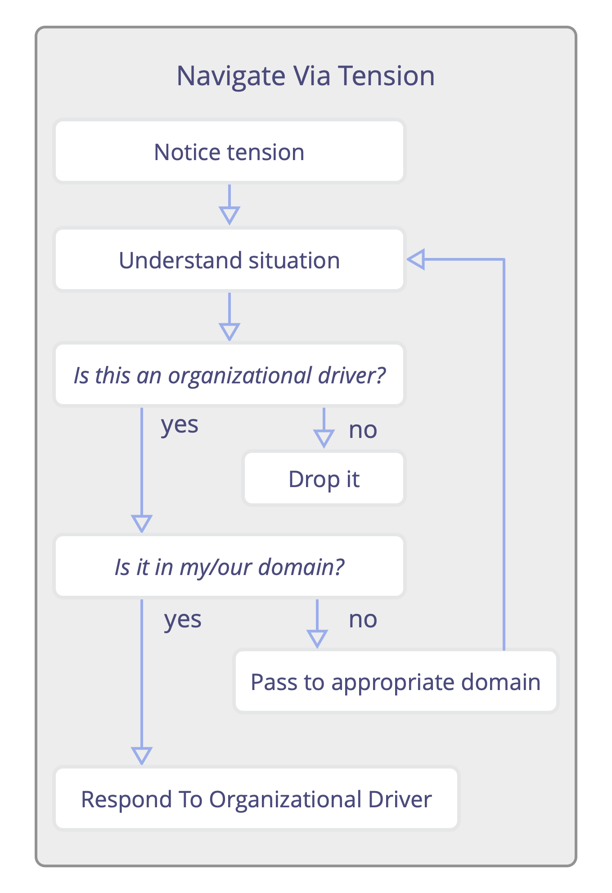
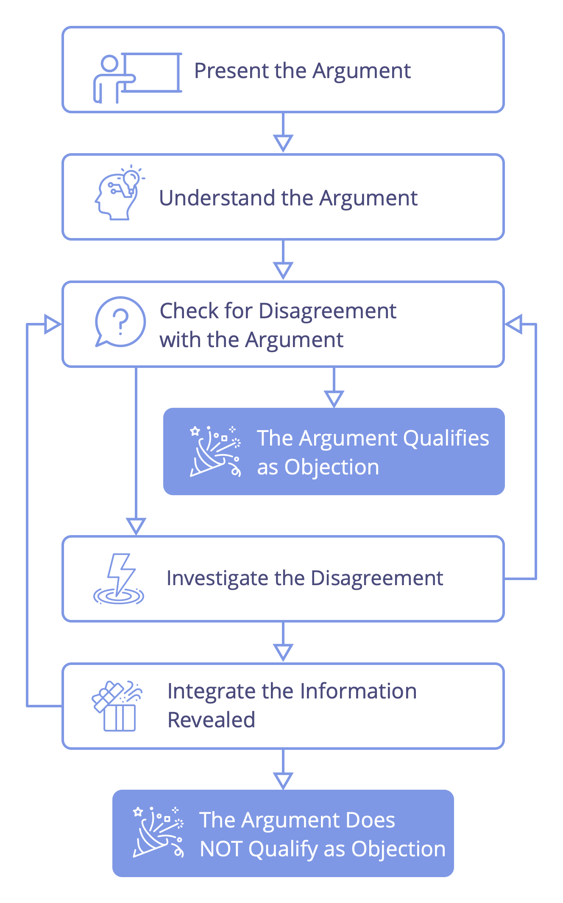
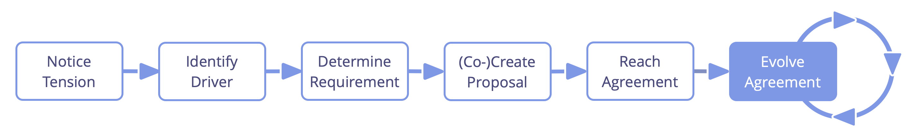
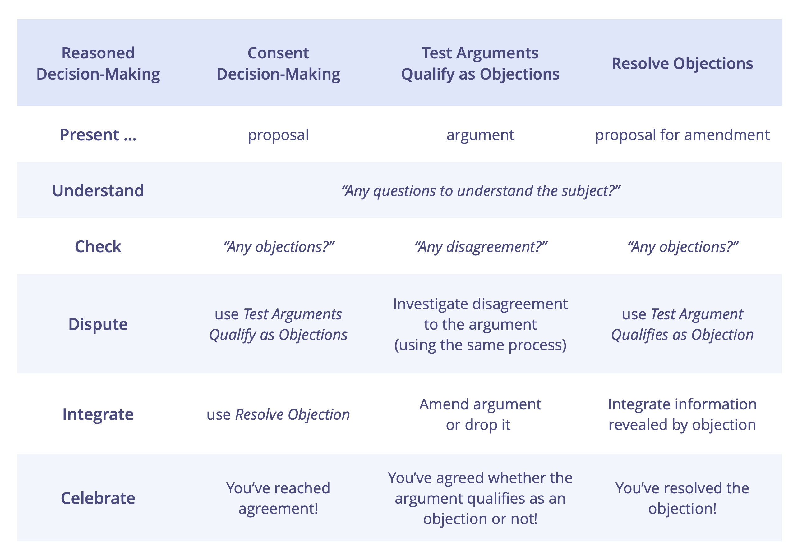
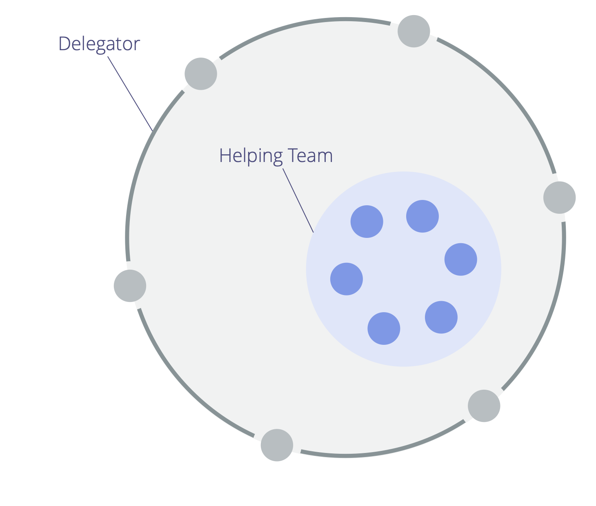
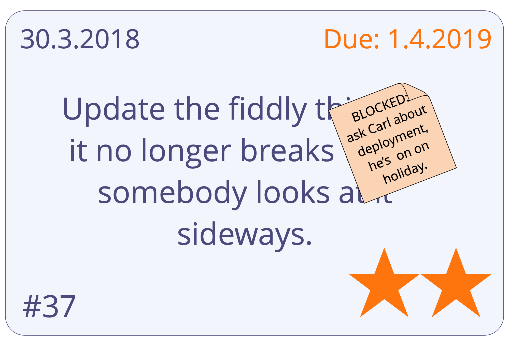
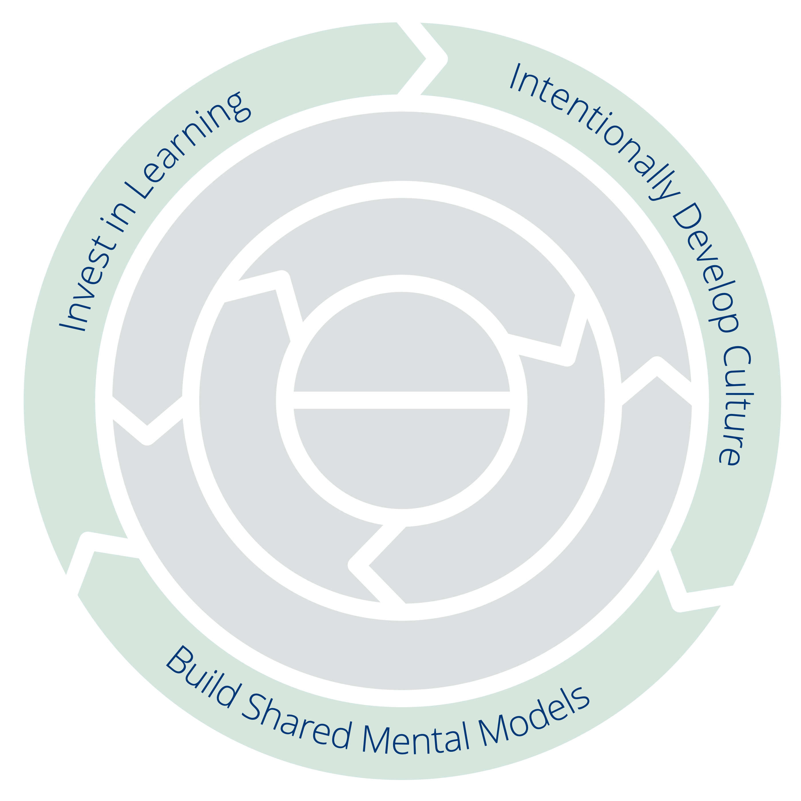

## What is Sociocracy 3.0?

Sociocracy 3.0 — a.k.a. "S3" — is <a href="glossary.html#entry-social-technology" class="glossary-tooltip" data-toggle="tooltip" title="Social Technology: Any process, technique, method, skill or any other approach that people can use to influence social systems — organizations, societies, communities etc. — to support achieving shared objectives and guide meaningful interaction and exchange.">social technology</a> for evolving agile and resilient organizations at any size, from small start-ups to large international networks and multi-agency collaboration.

Inside this practical guide you'll discover a comprehensive collection of tried and tested **concepts, principles and practices for improving performance, engagement and wellbeing** in organizations.

Since its launch in 2015, S3 patterns have been helping people across a diverse range of organizational contexts to get the best out of collaboration. From start-ups to small and medium businesses, large international organizations, investor-funded and nonprofit organizations, families and communities.

Using S3 can **help you to achieve your objectives** and successfully navigate complexity. You can make changes one step at a time, **without the need for sudden radical reorganization** or planning a long-term change initiative:

-   Simply start with identifying your areas of greatest need and select one or more practices or guidelines that help.
-   Proceed at your own pace, and develop  your skills and competences as you go.

**Regardless of your position in the organization**, you'll find many proven ideas that are relevant and helpful for you.

**Sociocracy 3.0 is free**, and licensed under a Creative Commons Free Culture License.

### How does Sociocracy 3.0 help?

S3 is a transformational technology for both individuals and the whole organization that will help you figure out how to meet your organization's biggest challenges, take advantage of the opportunities you face and resolve the most persistent problems.

Sociocracy 3.0 is designed to be flexible and supports experimentation and learning. You can take whatever you need, adapt things to suit your context and enrich your existing approach.

S3 integrates core concepts and practices found in agile methodologies, lean management, Kanban (and KMM), Design Thinking, Teal Organizations and the family of sociocracy-based governance methods (SCM/Dynamic Governance, Holacracy® etc.). It's complimentary and compatible with any agile or lean framework, including but not limited to Scrum and its various scaling frameworks.

### A pattern-based approach to organizational change

S3 offers a pattern-based approach to organizational change.

A **pattern** is a process, practice or guideline that serves as a template for successfully responding to a specific kind of challenge or opportunity. S3 patterns are discovered through observing people working together in organizations to solve problems and respond to opportunities they face. When you find that your habitual ways of doing things fail to bring about the outcomes you expected or hope for, you can look to S3 for patterns that might help.

Patterns are modular and adaptable, can be used independently, and are mutually reinforcing, complementing one another when used in combination. S3 patterns can be evolved and adapted to address your specific needs.

In this guide, the patterns are grouped by topic into eleven categories to help you more easily identify those that are useful to you:

-   Sense-Making and Decision-Making
-   Evolving Organizations
-   Peer Development
-   Enablers Of Co-Creation
-   Building Organizations
-   Bringing In S3
-   Defining Agreements
-   Meeting Formats
-   Meeting Practices
-   Organizing Work
-   Organizational Structure

By providing a menu of patterns to choose from according to need, S3 encourages an organic, **iterative approach to change without a huge upfront investment**. It meets people where they are and helps them move forward pulling in patterns at their own pace and according to their unique context.

### What's in this guide?

Inside this practical guide book you'll discover:

-   Useful concepts that will help you **make more sense of your organization** and communicate effectively about where change is needed.
-   An **organic, iterative approach to change** that meets people where they are and helps them move forward at their own pace and according to their unique context and needs.
-   **Seven core principles** of agile and sociocratic collaboration
-   A coherent collection of **70+ practices and guidelines** to help you navigate complexity, and improve collaboration:
    -   **Simple, facilitated formats** that support teams in drawing on the collective intelligence of the group and incrementally processing available information into continuous improvement of work processes, products, services and skills.
    -   **Group-practices** to help organizations make the best use of talent they already have, through **people supporting each other** in building skills, accountability and engagement.
    -   Simple **tools for clarifying who does what**, freeing people up to decide and act for themselves as much as possible, within clearly defined constraints that enable experimentation and development.
    -   Patterns for **growing organizational structure beyond hierarchies** into flexible, decentralized networks where the flow of information and influence directly supports the creation of value.
-   The **Common Sense Framework**, a tool for making sense of teams and organizations and figuring out how to get started with S3.   
-   A **glossary** with explanations for all the terms you might be unfamiliar with.

This practical guide to Sociocracy 3.0 is written and published by the three co-developers of Sociocracy 3.0.

True to the mindset behind S3, this book will always be a work in progress that grows and changes as we learn from people who are experimenting with S3 in organizations around the world. Since we started out in 2015, we have released several updates per year and we'll continue to do so in the years to come.

Even though several sections in this book are brief and may still be rough around the edges, the content and explanations have been sufficient for many people to get started with S3 and achieve positive change in their organizations. We hope you'll find it useful too.

### Influences and History of Sociocracy 3.0

The literal meaning of the term **sociocracy** is "rule of the companions": _socio_ — from Latin _socius_ — means "companion", or "friend", and the suffix _-cracy_ — from Ancient Greek κράτος (krátos) — means "power", or "rule".

The word sociocracy can be traced back to 1851, when **Auguste Comte** suggested applying a scientific approach to society: states would be governed by a body of scientists who are experts on society (which he termed "sociologists"). In his opinion, this future, although not yet achievable, would be inevitable.

A few decades later, **Lester Frank Ward**, used the word 'sociocracy' to describe the rule of people with relations with each other. Instead of having sociologists at the center, he wanted to give more power and responsibility to the individual, he imagined sociologists in a role as researchers and consultant.

In 1926, the Dutch reformist educator and Quaker **Kees Boeke**, established a residential school based on the principle of consent. Staff and students were treated as equal participants in the governance of the school, all decisions needed to be acceptable to everyone. He built this version of sociocracy on Quaker principles and practices, and described sociocracy as an evolution of democracy in his 1945 essay "Democracy as it might be".

**Gerard Endenburg**, also a Quaker and a student in Boeke's school, wanted to apply sociocracy in his family's business, Endenburg Elektrotechniek. He created and evolved the _Sociocratic Circle Organisation Method (SCM)_ (later becoming the "Sociocratic Method"), integrating Boeke's form of sociocracy with engineering and cybernetics. In 1978 Endenburg founded the Sociocratisch Centrum in Utrecht (which is now the Sociocratic Center in Rotterdam) as a means to promote sociocracy in and beyond the Netherlands. Since 1994 organizations in the Netherlands using SCM are exempt from the legal requirement to have a worker's council.

During the late 1990s and early 2000s, several non-Dutch speaking people came across sociocracy, but it wasn't until 2007 when **Sharon Villines and John Buck** launched their book, "We the People", that sociocracy became widely accessible to the English speaking world, and from there has began to migrate into several other languages.

Sociocracy has proven to be effective for many organizations and communities around the world, but it has yet to become viral.

In 2014 **James Priest and Bernhard Bockelbrink** came together to co-create a body of Creative Commons licensed learning resources, synthesizing ideas from Sociocracy, Agile and Lean. They discovered that organizations of all sizes need a flexible menu of practices and structures – appropriate for their specific context – that enable the evolution of a more sociocratic and agile approach to achieve greater effectiveness, coherence, fulfillment and wellbeing. The first version of **Sociocracy 3.0.** was launched in March 2015.

**Liliana David** joined the team soon after. Together they regularly collaborate to make S3 available and applicable to as many organizations as possible, and provide resources under a **Creative Commons Free Culture License** for people who want to learn, apply and tell others about Sociocracy 3.0.

#### The Sociocracy 3.0 Movement

As interest in Sociocracy 3.0 grows there is a fast growing community of people from a variety of backgrounds — pioneering consultants, coaches, learning facilitators, and people applying S3 into their various contexts — who share appreciation for the transformational potential of Sociocracy 3.0 to help organizations and their members thrive. Many kindly dedicate some of their time to experimenting with and sharing about S3, and who collaborate to learn from one another and document experiences to inform the ongoing development and evolution of the S3 and its various applications.

### Why "3.0"?

Sociocracy as a form of governance has been referred to since 1851. Subsequently it has been developed and adapted by many different people and organizations, including Gerard Endenburg, The Sociocracy Group (TSG) and Brian Robertson (HolacracyOne).

Yet, outside the Netherlands sociocracy has until recently remained largely unknown.

We love sociocracy because we see organizations and their members thrive when they use elements of it to enrich or transform what they currently do.

We also love agile, lean, Kanban, the Core Protocols, Non-Violent Communication, and many other ideas too. We believe that the world will be a better place as more organizations learn to pull from this cornucopia of awesome practices that are emerging into the world today, and learn to synthesize them with what they already know.

Therefore we decided to devote some of our time to develop and evolve Sociocracy, integrating it with many of these other potent ideas, to make it available and applicable to as many organizations as possible.

To this end, we recognize the value of a strong identity, a radically different way of distribution, and of adapting the *Sociocratic Circle Organization Method* to improve its applicability.

#### The Name

The name "*Sociocracy 3.0*" demonstrates both respect to the lineage and a significant step forward.

It also helps avoid the perception of us misrepresenting the _Sociocratic Circle Organization Method (SCM)_ as promoted by The Sociocracy Group (TSG), The Sociocracy Consulting Group, Sociocracy For All (SoFA), Governance Alive, and many others.

#### The New Model of Distribution

*Sociocracy 3.0* employs a non-centralized model for distribution. This is a paradigm shift in the way sociocracy is brought to people and organizations, and one that many people can relate to.

We support "viral" distribution through two key strategies:

* **Sociocracy 3.0 is open:** We want to encourage growth of a vibrant ecosystem of applications and flavors of sociocracy, where people share and discuss their insights and the adaptations they are making for their specific context. To this end Sociocracy 3.0 puts emphasis on communicating the underlying principles and explicitly invites the creativity of everyone to remix, extend and adapt things to suit their needs.
* **Sociocracy 3.0 is free:** To eliminate the barrier of entry for people and organizations we provide free resources under a *Creative Commons Free Culture License* to learn, practice and teach *Sociocracy 3.0*. Everyone can use our resources without our explicit permission, even in a commercial context, or as a basis for building their own resources, as long as they share their new resources under the same license. We expect and support other organizations, consultants, coaches, learning facilitators and trainers to follow our example and release their resources too.

#### The Evolution of the Sociocratic Circle Organization Method

Maybe we need to make this explicit: _Sociocracy 3.0_ is not targeted specifically at the existing community of people exploring or using the _Sociocratic Circle Organization Method_ (SCM). SCM is already well developed and of those people who use it, many appear to be mostly happy with it.

Yet from our direct experience, for most organizations, the methodology is either insufficient or inappropriate for addressing many of their needs. With _Sociocracy 3.0_ we actively work on addressing these limitations and inadequacies by developing new patterns and eliminating what stands in the way.

##### Reducing Risk and Resistance

_Sociocracy 3.0_ meets organizations where they are and takes them on a journey of continuous improvement. There's no radical change or reorganization. _Sociocracy 3.0_ provides a collection of independent and principle-based patterns that an organization can pull in one by one to become more effective. All patterns relate to a set of core principles, so they can easily be adapted to context.

##### Shifting Focus from Vision to Need

_Sociocracy 3.0_ moves primary focus away from attempting to realize a vision, toward understanding the current reality and determining what is required to achieve an organization's objectives. Organizations which are already need-driven, value driven or customer-centric, find this immediately accessible.

##### Condensed to the Essentials

When looking at the norms, the _Sociocratic Circle Organization Method_ may look big and scary. By focusing on the essentials only, _Sociocracy 3.0_ offers a more lightweight starting point to adapt and build on as necessary.

This doesn't mean to say it's all easy: choosing to pull in *Sociocracy 3.0's* patterns requires an investment in learning and un-learning. This is why it's important to only pull in what you need, because there's no point to changing things if what you are doing is already good enough.

##### Integration With Agile and Lean Thinking

The *Sociocratic Circle Organization Method* is an "empty" method when it comes to operations and creating a culture of close collaboration. Many organizations already implement or show preference for lean and agile thinking for operations and collaboration. We believe this is a great idea, so *Sociocracy 3.0* is designed for easy adoption into lean and agile organizations.

##### A New Way to Evolve Organizational Structure

The organizational structure according to the *Sociocratic Circle Organization Method* is modeled on a hierarchy of domains. We see an increasing emergence of collaborative multi-stakeholder environments and the need for a wider variety of patterns for organizational structure.
Evolution of organizational structure happens naturally when the flow of information and influence in an organization is incrementally aligned to the flow of value. *Sociocracy 3.0* provides a variety of structural patterns that can be combined to evolve structure as required and in a flexible way.

## The Seven Principles

Sociocracy 3.0 is built on seven foundational principles which enable sociocratic and agile collaboration. Since the seven principles are reflected in all of the patterns, understanding these principles is helpful for adopting and paramount to adapting Sociocracy 3.0 patterns.

Practicing Sociocracy 3.0 helps people appreciate the essential value that these core principles bring – both to individuals and to organizations – and supports their integration into organizational culture.

**_The Principle of Effectiveness_:** 

_**Devote time only to what brings you closer towards achieving your organization's overall objectives**, so that you can make the best use of your limited time, energy and resources._

**_The Principle of Consent_:**

_**Raise, seek out and resolve objections to proposals, existing agreements and activity**, to reduce the potential for decisions leading to undesirable consequences and to discover worthwhile ways to improve._

**_The Principle of Empiricism_:** 

_**Test all assumptions you rely on through experiments and continuous revision**, so that you learn fast, make sense of things and navigate complexity as effectively as you can._

**_The Principle of Continuous Improvement_:**

_**Regularly review the outcome of what you are doing, and then make incremental improvements to what you do and how you do it based on what you learn**, so that you can adapt to changes when necessary, and maintain or improve effectiveness over time._

**_The Principle of Equivalence_:**

_**Involve people in making and evolving decisions that affect them**, so that you increase engagement and accountability, and make use of the distributed intelligence toward achieving and evolving your objectives._

**_The Principle of Transparency_:**

_**Record all information that is valuable for the organization and make it accessible to everyone in the organization, unless there is a reason for confidentiality**, so that everyone has the information they need to understand how to do their work in a way that contributes most effectively to the whole._

**_The Principle of Accountability_:**

_**Respond when something is needed, do what you agreed to do, and accept your share of responsibility for the course of the organization,** so that what needs doing gets done, nothing is overlooked and everyone does what they can to contribute toward the effectiveness and integrity of the organization._

### The Principle of Effectiveness

_**Devote time only to what brings you closer towards achieving your organization's overall objectives**, so that you can make the best use of your limited time, energy and resources._

The principle of effectiveness invites us to think consciously about what we do and how we do things. It calls for the intentional consideration of the consequences of our actions, both now and across time, on our organizations but also on the wider environment and the world at large. 

Pursuing effectiveness requires that we act with intent to minimize waste, remove impediments and, where possible, conduct ourselves in ways that over time, lead to the greatest value creation possible, through the synergy of our creativity, resources, energy and time. 

#### Clarify the why

Being effective begins with getting clear about why you want to do something and establishing an approximate idea of what it is you want to achieve. Defining why the organization exists and the objectives it's trying to achieve helps everyone understand more about what they are working toward and about how they can contribute in a meaningful way. Without this clarity, it's hard for individuals to contextualize their work in the bigger picture. It's also harder to qualify and quantify what brings value and in which ways. 

#### Keep your options open

There might be many ways to go about achieving your objectives and sometimes your first choice might fail to meet the need. Keep your options open to avoid getting stuck in a particular trajectory as you learn about ways to improve. Avoid converging too soon and take an iterative approach whenever you can. In complexity, find ways to test any hypotheses quickly, run multiple small experiments if possible, and travel light so that you can pivot fast.

#### Aim for being effective in an efficient way

Effectiveness is about achieving the desired result, while efficiency is about doing things with the least waste of your effort, resources and time. It is entirely possible to do the "wrong" thing very efficiently, so before optimizing for efficiency, ensure the outcome is what you intended. Only then look for worthwhile improvements to produce the same outcome in a more efficient manner. 

#### Consider the bigger picture, monitor, evaluate and learn

Be on the lookout for possible side-effects and unintended consequences before, during and after any interventions you make. Consider direct and indirect costs and negative externalities and be prepared to evolve or change your activities or objectives, based on what you learn.

There are scales of effectiveness (and efficiency) that can only be appreciated if we consider the wider context and consequences of our actions across time. Sometimes our activities might achieve the outcomes we intended in the short term but with unfavorable consequences and hidden costs that only reveal themselves across time.  For example, large scale, industrial agriculture produces huge yields very efficiently but over the long-term  it leads to a critical depletion of topsoil and increasing dependency on fertilizers, insecticides and weedkillers. This can be a case of a short term gain but for long term pain.

In complex environments it is sometimes hard to figure out what effectiveness would actually mean. Consider the perspective of others, even if you are making a decision for yourself.  Make the most of experience and expertise distributed throughout your organization and reach out to people with alternative points of view. Running your ideas past others can help you to avoid consequences that you'd rather avoid, and identify worthwhile ways to improve.

Decide how you will measure effectiveness, and if you're collaborating with others, develop and maintain a shared understanding of what this will mean. Having established a clear "_why_" and defined the outcome you intend to achieve, consider how you will measure results in a way that allows you to see how you're progressing (and whether anything you are doing is useful at all!)

Effectiveness can sometimes only be determined in retrospect. Pay attention to and reflect on the consequences of your actions,  and then use what you learn to improve your effectiveness next time. 

#### Be mindful of dependencies and constraints

Aim to free everyone up to be able to act as autonomously as possible and do what you need to do to free yourself up as well. Make any necessary dependencies between certain individuals and teams explicit, and get together to co-create and evolve a coherent system to deal with them, so that you can still deliver value fast when dependencies cannot be avoided.

Clarify any constraints in which you need to operate. What are the internal and external expectations, guidelines or rules? How do the implicit or explicit values of your organization and the wider context in which you are operating, enable or limit the decisions and actions you make? How will you operate within any specific boundaries? Who do you need to communicate with if you see an argument for changing something, or for making an exception to a rule?

#### Prioritize and choose wisely

Set priorities and stick to them unless you become aware of a reason to change. Distractions, context switching and a lack of breaks or slack time will inevitably lead to waste. 

As well as getting clear on what you WILL do, be clear on what NOT to do as well and aim to resolve impediments as they arise.

### The Principle of Consent

_**Raise, seek out and resolve objections to proposals, existing agreements and activity**, to reduce the potential for decisions leading to undesirable consequences and to discover worthwhile ways to improve._

Deliberately seeking objections is a way to tap into the collective intelligence distributed throughout an organization and benefit from insights we might otherwise miss. Examining proposals, agreements, and activity, through the lens of different people's perspectives helps to identify reasons why proceeding in a specific way could lead to consequences that would better be avoided, and if there are worthwhile ways to improve things.

Adopting the principle of consent invites a change of focus in decision-making, shifting intent from trying to reach agreement - can everyone agree with this? - toward the practice of deliberately checking for objections - are there any arguments that reveal why this is not good enough, safe enough, or that there are worthwhile ways to improve?

Consent does not mean everyone is actively involved in making every decision, as this would be ineffective. It does however require adequate _transparency_ and mindfulness on the part of decision makers, to inform and involve people who would be impacted (to varying degrees), or to invite those that can bring relevant experience or expertise (see _the Principle of Equivalence_).

#### Invite dissent

When dealing with complicated or complex matters, considering different perspectives, experience and expertise is a simple yet effective way for developing a coherent shared understanding, out of which more effective decisions can be made.

Developing a culture that welcomes dissenting opinions and where people consider those opinions to discover any value they can bring, generates greater engagement, psychological safety, and support for decisions.

#### Shift supremacy from people to sound arguments

When comparing the available paradigms for decision-making, the essential difference lies in where ultimate authority for making a decision is placed. In autocratic systems supremacy lies with an individual or small group. In a system governed by majority vote, supremacy lies with the majority (or those who can convince the majority of their position). In a system aspiring toward consensus with unanimity, supremacy lies with whoever decides to block a proposal or existing agreement. In all three of these cases, a decision is made regardless of whether the motive of those actors is aligned with the interest of the system or not.

When a group or organization chooses to abide by the principle of consent, supremacy shifts from any specific individual or group, to reasoned arguments that reveal the potential for undesirable consequences that would better be avoided or worthwhile ways to improve. This way, people — regardless of their position, rank, function or role — are unable to block decisions based solely on opinion, personal preference or rank, and they can be held to _account_ in the case that they do. Consent invites everyone to at least be reasonable, while still leaving space for individuals to express diverse perspectives, opinions and ideas.

#### Distinguish between opinion or preference, and objections

Consent draws on the intelligence distributed throughout an organization, not only by inviting people to raise possible _objections_, bso by inviting people to then examine those arguments, rooting out any that are unfounded, evolving those they discover to be only partly true, and revealing those that are valid objections. So it's typically a good idea to _test arguments qualify as objections_ and only act on those that do. This helps avoid wasting time on arguments based merely on opinions, personal preference or bias.

Arguments that qualify as objections—at least as far as stakeholders can tell—help a group in directing their effort toward making changes in those areas where it's necessary or worthwhile to adapt and improve. Incremental improvement based on discovery and learning is built into consent and is an inevitable consequence of adopting the principle.

Adopting the principle of consent shifts the aim of decision-making toward identifying a solution that's good enough for now, and where there are no obvious worthwhile improvements that would justify spending more time. This approach is far more effective than trying to arrive at consensus with unanimity, where the aim is often to accommodate everyone's personal preference and ideas.

#### Integrate learning from objections

Objections inform people of things that can be improved. _Resolving objections_ typically means evolving (proposed) agreements and changing activity in ways that render that argument void. Sometimes however, having considered an objection, it might be realized that on balance and for some reason or other, it's more advantageous to leave what was objected to unchanged. Ultimately, considering an objection and determining what, if anything, is worthwhile doing to resolve it, involves weighing up pros and cons, both in relation to the specific situation a proposal, agreement or activity is intended to address, but also in the context of the organization as a whole. In complexity there are typically no perfect or entirely correct decisions, only those that (for now at least) appear good enough for now and safe enough to try. Often all that is needed is a good enough next step which allows us to learn empirically and adapt and evolve the decision over time.

This approach of incremental learning draws on the diversity of knowledge, experience and expertise distributed throughout an organization. It helps to shift from a paradigm rooted in binary thinking and polarization (either/or) to a continual process of synergy (both/and), which over time fosters stronger relationships between peers as well.

#### The Contract of Consent

Adopting the principle of consent in a team, or in the organization as a whole, has implications for how people approach decision-making, dialogue and activity. Consider making this implicit contract of consent explicit, to support members of the organization to adopt and apply the principle of consent:

1. In the absence of objections to a proposal or existing agreement, I intend to follow through on what's been agreed to the best of my ability.
2. As I become aware of them, I will share any possible objections to proposals,  agreements, or current activities, with those directly responsible for them.
3. I'll actively seek out and consider objections to proposals,  agreements and activity that I'm responsible for,, and I'll work to resolve those objections if I can.
4. I'll actively consider agreements that are due review that I'm affected by or responsible for, to check for any possible objections to the prospect of continuing with that agreement in its current form.

### The Principle of Empiricism

_**Test all assumptions you rely on through experiments and continuous revision**, so that you learn fast, make sense of things and navigate complexity as effectively as you can._

Empiricism — the foundation of the scientific method — is an essential principle to embrace if we're to navigate effectively in a complex world. Not only are the environments in which organizations operate complex but an organization is in itself a complex adaptive system. Knowledge about an organizational system and its interactions is often tentative and highly dependent on context. 

Empiricism can help us to increase certainty and reduce self-delusion, so that we can make the best use of our time. In our attempts to make sense of things and to have a sense of certainty about what is happening, why it's happening, what should happen next and what's needed to achieve that, we often draw conclusions without checking if the assumptions they are built on are true and accurate. In complexity, what we perceive as causation can often turn out to be mere correlation or coincidence, and the outcomes of interventions we make will always lead to some consequences we couldn't predict.

Observing and probing systems, and making use of experimentation to inform an iterative approach to change, supports ongoing learning and helps an organization continuously develop to remain effective and responsive to change.

#### Clarify your hypothesis

A hypothesis is a tentative explanation of a relationship between a specific cause and effect that is both testable and falsifiable. It provides a starting point for experiments that prove or disprove that hypothesis. 

In the context of organizations, you might develop hypotheses about how a change to a work process or to the organizational structure would improve effectiveness or reduce cost. Or about how rescheduling a meeting would increase engagement, or making a certain change to a product would attract a new customer segment while keeping existing customers happy, and so on. 

When faced with uncertainty, it helps to make any questions and assumptions you have explicit and describe a clear hypothesis that allows for answering those questions and validating if your assumptions are true. A vague or ambiguous description will make assumptions hard or even impossible to test, and trying to test too many assumptions at once, might set you up on a long path where you learn little of value. Less is often more.

One vital skill to develop when designing experiments is the ability to **distinguish between established knowledge and mere assumptions**. By acknowledging what you don't know yet and what you assume to be more or less true, you can identify questions and assumptions around which to build a hypothesis.

In complex domains, a hypothesis-driven approach relies on experiments to validate or disprove hypotheses, so that you can find viable ideas or falsify them fast. Making sense of things through experimentation, not only enables you to more effectively achieve what you need or desire but it can also help you to validate assumptions you have about which objectives are worthwhile pursuing to start with.  

#### Design good experiments

An experiment is a controlled test designed to prove or disprove a hypothesis. Experiments provide you with validated learning about how to better respond to the challenges and opportunities you face. Outcomes often provide you with the opportunity to refine your hypothesis, or even develop new hypotheses that you can then test with further experiments.

Before you start an experiment, it's important to fully define and document it. In the context of an organization, a good experiment will consist of a list of things you need to do, and if helpful, how you need to do them, as well as a list of variables you will track before, during and/or after the experiment. 

Define and document specific thresholds for success and failure of the experiment related to your variables and add details about this to your evaluation criteria. In particular, consider what you would accept as evidence that your hypothesis is false. While an experiment is running, avoid making changes to it, and if you do change something, document those changes, otherwise your measurements may become meaningless. It is vital that you **measure before starting the experiment** to ensure that the threshold for success is not already met because you made an error in your experiment's design.

#### Treat decisions as experiments

In a complex system, it is impossible to predict all of the ways in which that system will react to a particular intervention of change. Because of this you can apply the concept of experimentation to the way you approach decision-making as well. It's valuable to view all significant operational and governance decisions you make as experiments, and to document the intended outcome and evaluation criteria in each case. Make one decision at a time, starting with what appears to be an appropriate or logical starting point and evolve those decisions iteratively, based on what you learn.

### The Principle of Continuous Improvement

_**Regularly review the outcome of what you are doing, and then make incremental improvements to what you do and how you do it based on what you learn**, so that you can adapt to changes when necessary, and maintain or improve effectiveness over time._

Whereas the principles of _Empiricism_ and _Consent_ reveal opportunities for learning, Continuous Improvement relates to what we do with what we learn. Continuous Improvement applies to how we conduct our operations, but also to governance. Everything from the evolution of strategies, policy, processes and guidelines, to the development of products, services, competencies and skills, attitudes and behavior, chosen values and tools, all can be continuously improved. 

#### Take an iterative approach to change

Evolution is often more effective and more sustainable than revolution which is rarely necessary or worthwhile unless you fail to continuously improve a system when it's needed. Especially in a complex environment, making many changes to a system at the same time can lead to a mess that is difficult to fix. Consequences resulting from larger interventions are often hard to measure effectively, especially in complexity, and the relationship between cause and effect will be difficult, if not impossible to determine and evaluate. 

Instead, consider changing things incrementally whenever you see an opportunity for a small and worthwhile improvement, significantly reducing the need for a large intervention. This will help you to effectively adapt to changing environments, keep your organization and systems fit for purpose, and prevent things from descending into a state that is costly or even impossible to repair.

**Even when a large change is needed, go step by step**, figuring out how things need to be and **adjust what you're doing based on what you learn**. With small changes, assumptions can be tested quickly and failure is more manageable. When a small experiment fails, you can learn fast and if necessary, use what you learn to develop a better experiment. When a large experiment fails, a lot of time and effort might be spent without learning much at all.

Be aware that if you change several things at the same time, you might not be able to determine which of them lead to the effects you see, so **aim for one or only a few concurrent changes at a time**.

#### Monitor, measure and change things based on what you learn

**Define the _intended outcomes_** you expect a change will lead to and be clear on how you will evaluate whatever occurs. When making changes, be clear about the specifics of what you want to improve. What positive consequences do you want to amplify and what negative consequences do you want to dampen?

**Monitor the consequences of your actions** and reflect on what you learn. Pay attention to what actually happens and whether or not the results of your interventions reflect your assumptions and intentions. This will help you keep track of whether or not your changes led to improvements at all.

Remember that even if things don't turn out as you expect sometimes, this doesn't necessarily mean that the results are negative. Sometimes things turn out differently to how we'd assumed or intended. All outcomes help us learn. **Be open to whatever happens**, consider the pros and cons of any unintended consequences that emerge and acknowledge when it would be beneficial to do things differently, or to aim for different results.

### The Principle of Equivalence

_**Involve people in making and evolving decisions that affect them**, so that you increase engagement and accountability, and make use of the distributed intelligence toward achieving and evolving your objectives._

Equivalence is important in organizational systems, precisely because people are not equal to one other in a variety of ways and depending on the context. 

Equivalence increases engagement by giving people affected by decisions the opportunity to influence those decisions to some degree. 

By including people in making and evolving a decision that affects them, they gain deeper understanding about the resulting decision, the situation it's intended to address, and the pros and cons that have been weighed in the process. It also helps to keep systems more open and transparent and reduces the potential for information vital to the decision being overlooked or ignored. Depending on the level of involvement, people might also have the opportunity to shape things according to their preference, and in any case, participation in the decision-making leads to a greater sense of ownership over what is decided. 

People are more likely to take responsibility for following through on decisions when they are involved in making them. This is further reinforced when ensuring affected parties have influence in adapting those decisions later, should they discover reasons why a decision is no longer good enough, or if they discover a viable way for improving something.  

Decisions we develop together will always be _our_ decisions, whereas decisions taken by others, will always be _theirs_ and will be appreciated and supported more or less by others, depending on their personal preference and point of view.

Some decisions will affect a large group of people, e.g. an entire department, or even the  organization as a whole. Including those affected in the decision-making process will yield benefits that reach far beyond the decision in question. People will build connection, trust and a greater sense of community and belonging. For effectively involving a large number of stakeholders in the decision-making process you can use a variety of group facilitation techniques and online tools. 

#### Delegate responsibility and power to influence

To become or remain effective, organizations of any size benefit from distributing work, and the power to influence decisions relating to that work, throughout the organization. This helps to eliminate unnecessary dependencies, so that people can create value unimpeded, without getting bottlenecked, waiting on a decision-making hierarchy or the input of others who are more distant from the work. 

For matters that concern a large number of people, it makes sense to delegate responsibility for making and evolving agreements to a smaller group that has the necessary experience and expertise, who can then inform and consult with others in the organization during their decision-making process. With adequate transparency and some proactivity in informing people affected by decisions of anything that is useful for them to know, possible objections from all stakeholders can still be quickly identified, qualified, and if necessary, resolved. In this way, equivalence enables the delegation of responsibilities to individuals or small groups, while still keeping the whole system open to discover and draw on the collective intelligence of everyone involved.

Periodically rotating who takes a lead in decision-making helps build trust, accountability and a more widely shared understanding of the context in which decisions are being made, because a growing number of people will gain experience in that role.

#### Consider who should be involved and how

Everyone throughout an organization is impacted by all decisions to some degree, because each decision will impact the whole in some way. Equivalence in decision-making doesn't mean everyone needs to be involved in every decision all of the time. Nor does it mean that everyone has to have the same amount of influence in every context where they are affected. Equivalence means ensuring that those affected by decisions are at least able to influence those decisions, on the basis of arguments that reveal unintended consequences for the organization that are preferable to avoid, and/or worthwhile ways for how things can be improved. Put another way, the minimum requirement for equivalence to exist is to hear and consider any possible objections raised by people affected by decisions, and work to ensure that those objections are resolved.

The degree of worthwhile involvement is context dependent. At one end of the spectrum, it might be enough that decisions affecting others are made initially by an individual or a smaller group and that these decisions are then tested for any objections with those affected afterwards. On the other end of the spectrum, equivalence could manifest as a fully collaborative process where those affected participate in decision-making from end-to-end. A middle road is a participatory approach that keeps people informed about progress and invites specific input at various stages along the way.

Equivalence needs to be balanced with _Effectiveness_, enabled through _Transparency_ and constrained by _Consent_, for it to function at its best. It's valuable to weigh up the benefits of more or less involvement, versus the cost in terms of resources, energy and time. 

For any decision of significance it's good to ask yourself who, if anyone, should be involved, and to what degree? Consider those who will be directly or indirectly impacted and those who will have responsibility for acting on what you decide. While not directly related to Equivalence, it might also be prudent to consider those who are not obviously affected by a decision, but who could contribute with their influence, experience and expertise.

#### Make necessary information available

For people to contribute in an effective way, they need access to relevant information relating to the decision in question. It's helpful to develop a system for visualizing important decisions and broadcasting about them to others. Visibility and the option for open dialogue about what's going on in the organization helps to build shared understanding, which, in turn, contributes toward more effective decisions being made. 

#### Invest in learning and development

When involving people in decision-making, everyone understanding what objections are – and how they are distinct from concerns, opinion or preference – will help people contribute to decisions in more meaningful and effective ways. Put in place ways to gather any possible objections that people raise and develop a system to easily make them available to the people directly responsible for making and evolving those decisions.

In the case where people are responsible for making and evolving agreements together on a regular basis, invest in everyone developing the necessary competence and skills. This includes learning basic communication skills and developing fluency in whichever decision-making processes you use. 

#### Invite external influence

Some decision-making will be improved through including a range of perspectives and expertise. When looking for people with a worthwhile perspective to bring, consider the wider organization and your external environment too. Who has valuable expertise or experience from elsewhere in the organization and who are your customers, investors and other stakeholders? All of these people are affected in some way by the consequences of decisions you make. As well as being open to consider their suggestions and points of view, there might be times when actively inviting their opinion or involving them in certain decisions you need to make, will inform you of better ways to achieve your goals.

### The Principle of Transparency

_**Record all information that is valuable for the organization and make it accessible to everyone in the organization, unless there is a reason for confidentiality**, so that everyone has the information they need to understand how to do their work in a way that contributes most effectively to the whole._

Transparency in an organization helps people understand what's going on, what to expect and why things are done the way they are. It reduces uncertainty, supports trust and trustworthiness and fosters accountability. 

Adequate transparency means that people either have direct access to the information they need, or that they at least know where to go or who to ask, to get access to it. Transparency helps everyone understand when they can safely and effectively decide and act for themselves and when they need to involve others to respond to dependencies they share.

Transparency supports us to learn from, and with each other. It helps to reduce the potential of small problems growing into big ones because we are more likely to spot mistakes and negative unintended consequences more promptly. 

Transparency facilitates the ongoing development and maintenance of a coherent and adaptive learning organization. Having access to relevant information helps us to quickly identify important needs and changes and respond fast.

#### Clarify motivation for (more) transparency

Transparency is a means to an end, not an end in itself, so if you're looking to increase transparency in your organization, take the time to clarify the reasons why. What are the challenges you are trying to solve by introducing more transparency and/or what are the opportunities you wish to pursue?

Introduce more transparency into your organization as a way to support learning and to free people up, not as a way to control them. Use it as a way to improve performance, not leave people feeling unsafe to do anything because they are anxious about being watched. Transparency can enable co-creation and innovation but in a context where failure is treated as negative, rather than an opportunity to learn, it will impede people's willingness to take risks and experiment.

#### Consider reasons for confidentiality

Be clear about information that is inappropriate to share. While secrecy can be associated with illicit or dubious affairs, there are many legitimate reasons for confidentiality in organizations.  Sometimes secrecy is necessary, for example, protection of people's personal data and affairs, security of assets or protection of intellectual property that helps an organization achieve its goals.

#### Identify what information is valuable to record and share

Consider carefully what information is worthwhile to record. Valuable information worth recording typically includes:

-   decisions that have been made, along with the information they were based upon, who made them and the reasons why they were made
-   any information that supports people to make effective decisions, such as details about the context, possibilities explored and any important constraints
-   information that helps with evaluating progress and outcomes, including evaluation criteria, metrics, descriptions of intended outcomes and details of any hypotheses upon which decisions are being made
-   information that reduces uncertainty and supports the development of trust, such as finances and future plans
-   useful insights and learning
-   meeting minutes

#### Create and maintain a coherent system for recording information

Documenting relevant information in a way that is coherent and accessible is an ongoing task that relies on everyone in the organization playing their part. Developing a system for recording and sharing information and keeping it up to date takes time and effort. Choose tools that make it simple to create, update, and cross-reference records, as well as to search and retrieve information when it's required. Make clear which information is recorded and updated, by whom and when, and structure records accordingly. Take the time to regularly check through your records, ensure your system remains helpful and keep an archive of historical information for reference.

### The Principle of Accountability

_**Respond when something is needed, do what you agreed to do, and accept your share of responsibility for the course of the organization,** so that what needs doing gets done, nothing is overlooked and everyone does what they can to contribute toward the effectiveness and integrity of the organization._

Whenever we are part of a system (e.g. an organization, a community, family or state) the consequence of our actions or inaction will impact others in that same system for better or worse. Therefore we carry a certain amount of responsibility for the wellbeing of the system.

In particular, when we choose to become part of an organization, we enter into a transactional relationship with others, where we can expect to receive something in exchange for taking care of one or more specific needs the organization has. 

The promise we make to take responsibility for things that need doing, creates a dependency between us and those who depend on the fulfillment of that promise.

#### Acknowledge shared accountability

The consequences of our action or inaction will affect the organization in some way, so by becoming part of an organization we are taking some responsibility for the wellbeing of the whole. Many responsibilities within an organization are hard to anticipate, are undefined and are undelegated. Therefore when members of an organization recognize that they _share accountability_ for the organization as a whole, they are more inclined to step up, bring attention to important issues, and take responsibility for things when needed. Problems and opportunities are more likely to be acknowledged and dealt with and you reduce the risk of developing a culture of looking the other way, or worse, a culture of blame. 

Many responsibilities are typically distributed throughout an organization by way of _delegation_, meaning that people take responsibility for specific work and decision-making. Whenever a responsibility is delegated by one party (the <a href="glossary.html#entry-delegator" class="glossary-tooltip" data-toggle="tooltip" title="Delegator: An individual or group delegating responsibility for a domain to other(s).">delegator</a>) to another party (the <a href="glossary.html#entry-delegatee" class="glossary-tooltip" data-toggle="tooltip" title="Delegatee: An individual or group accepting responsibility for a domain delegated to them, becoming a role keeper or a team.">delegatee</a>), accountability for results is shared between both parties. This is because either parties' choices and actions (or inaction) will impact results. Furthermore the delegator is accountable for their decision to delegate these responsibilities, and for their decision about whom to delegate them to.

While it's typically productive for delegatee(s) to take the lead in deciding how to take care of their <a href="glossary.html#entry-domain" class="glossary-tooltip" data-toggle="tooltip" title="Domain: A distinct area of responsibility and authority within an organization.">domain</a>, regular communication between delegator and delegatee(s) provides a broader scope of perspective which in turn, supports strategic development and the effective execution of work. 

When people consider themselves accountable only for those things that impact their immediate sphere of responsibility, many of the things that would require attention but have not been delegated to anyone in particular, or that appear to be someone else's problem to solve, would get missed.

Whenever you see an important issue, make sure it's taken care of, either by bringing it to the attention of others who will deal with it, or by dealing with it yourself. 

#### Make the hierarchy of accountability explicit

Most organizations have a hierarchy of delegation and therefore a hierarchy of accountability. This means that accountability for outcomes is distributed throughout the organization, while overall accountability for the integrity of the organization rests with whomever takes legal responsibility for that organization as a whole. In many organizations today, this generally points back up a leadership hierarchy to wherever the buck stops. However, in other contexts, like a community for example, overall accountability lies equally with everyone who is involved.

Whatever your particular organizational context, making the hierarchy of accountability explicit is useful because it reveals the relationship between delegator and delegatee(s). 

#### Move from "holding to account" to self-accountability

The principle of accountability applies to everyone. It promotes a shift from being held to account by someone—which often leads to a culture of fear and blame—towards a culture of self-accountability where everyone acknowledges the impact of their actions and inaction on others, and on the system as a whole, and acts accordingly. In your relationships with others, it relates to making and following through on commitments you make, managing expectations, doing what you agree to and answering for when you don't. 

#### Create conditions that enable accountability to thrive

Merely clarifying what people can and cannot do is not enough to encourage a culture where accountability is embraced. In fact, alone, this can have the opposite effect. To increase the level of self-accountability in an organization there are various factors that can help:

-   **Involvement**: the more that people are able to influence decisions that affect them, the greater their sense of ownership will be, and the greater the likelihood that they will share a sense of accountability for the results (see also: _The Principle of Equivalence_)
-   **Access to information**: when people have the opportunity to find out what is going on in the organization and why certain decisions are made, they can figure out how they can best contribute to the whole and be an active and artful member of the organization (see also: _The Principle of Transparency_)
-   **Safety to disagree**: when people are free to express their opinions and learn how to listen and disagree in constructive ways, the organization can rely on a broader scope of perspectives, experiences and expertise, and people will feel more psychologically safe and in control. (see also: _The Principle of Consent_)

#### Make implicit responsibilities explicit

When responsibilities are unclear, it can lead to mistaken assumptions about who is responsible for what, double work, people crossing important boundaries, or failing to take action in response to important situations. At the same time, when clarifying responsibilities, it's important to avoid over-constraining people because doing so limits their ability to make important decisions, innovate and act. This leads to a reduction in their willingness to accept accountability. 

Too much specificity or too much ambiguity around the scope of authority people have to influence can lead to hesitation and waste. And in the worst case it can mean that important things don't get dealt with at all. 

_Clarifying domains_ provides a way of explicitly delineating areas of responsibilities and defining where the edge to people's autonomy lies. 

#### Encourage self-accountability

To encourage a culture with a high level of self-accountability, do your part in creating a working environment where people voluntarily take on the following responsibilities:

-   Act within the constraints of any agreements governing domains you are responsible for, that includes agreements related to the organization itself, to the teams you are part of, and to the roles you keep.
-   Act in accordance with any explicitly defined organizational values.
-   Be transparent and proactive in communicating with those you share accountability with, if you realize that what you agreed to is not the best course of action.
-   Find others who can help you if you discover you're unable to take care of your responsibilities.
-   Break agreements when you are certain the benefit to the organization outweighs the cost of waiting to amend that agreement first. And take responsibility for any consequences, including following up as soon as possible with those affected.
-   Speak up if you disagree with something or think it can be improved in a worthwhile way, by raising possible objections as soon as you become aware of them.
-   Be proactive in responding to situations that could help or harm the organization, either by dealing with them yourself directly, or by finding the people who can, and letting them know.
-   Aim to give your best contribution, both through the work you are doing and in how you cooperate or directly collaborate with others.
-   Take responsibility for your ongoing learning and development, and support others to do the same.

## Key Concepts for Making Sense of Organizations

In this section you'll learn about the following key concepts:

- Driver and Requirement
- Domain
- Agreement
- Objection
- Governance and Operations

You will also discover how these concepts relate to value (and waste), delegation (and accountability), self-organization, self-governance and semi-autonomy.

When people understand these concepts, it gives them a common language for describing clearly what's going on in the organization. This helps to increase shared understanding and enables constructive dialogue about what needs to be done.

For any terms you don't understand, check out the glossary at the end.

### Organizational Drivers and Requirements

_An **organizational driver** is any situation where the organization's members have a motive to respond because they anticipate that doing so would be beneficial for the organization (by helping to generate value, eliminate waste or avoid undesirable risks or consequences)._

_A **requirement** is a need or desire considered necessary to fulfill to respond to an organizational driver, adequately or as a suitable incremental next step._

Identifying and interacting with situations that warrant some kind of response is a fundamental aspect of everyone's working day in an organization. 

In the context of Sociocracy 3.0, _effectiveness_ is a key principle that invites an organization's members to make the best use of their resources, energy and time by devoting effort toward only doing what brings an organization closer toward achieving its overall objectives. To help people make sense of what's important to focus on, and to develop shared understanding around what may or may not be beneficial to do, we use the concepts of _Organizational Drivers_ and _Requirements_.

Reflecting on and describing organizational drivers and requirements supports:

-   understanding situations that motivate action (**sense-making)**
-   establishing whether and why a situation is relevant to respond to (**meaning-making**) 
-   determining direction and scope for a suitable response to the situation (**decision-making**)

#### Organizational Drivers

Identifying and understanding situations that present potential impediments or opportunities in relation to an organization's objectives is important if we are to successfully orient through our daily work and make the best use of our limited resources, energy, and time. 

However, not all situations that motivate an organization's members to act, are pertinent for the organization to respond to. With the concept of organizational drivers we give a name to those situations an organization's members investigate and determine as relevant to respond to because they anticipate that doing so would be beneficial for the organization - by helping to generate value, eliminate waste, or avoid undesirable risks or consequences.

Making sense of situations that arise in the course of daily work and establishing if those situations are relevant to deal with, before deciding how to respond to them, has evident **benefits**: 

-   A clear and accurate understanding of a situation that requires an intervention, **supports people to develop a better idea of what's required to deal with it**. A problem well-defined is a problem half-solved (see _Respond to Organizational Drivers_)
-   Explicitly describing a driver helps to **communicate about it effectively** with others and **develop a shared understanding** of the situation and its relevance for the organization (see _Describe Organizational Drivers_)
-   Thinking about organizational drivers supports people to reflect on, **understand and communicate about why they do the things they do**. It provides a way to investigate and make explicit the reasons behind actions and decisions and it helps to understand **why we are motivated to pursue particular objectives and goals**. 
-   Taking time to investigate situations and their potential relevance, before acting, helps to **determine if and when intervening is worthwhile**, because people can be mistaken, both regarding their conclusions about what they are perceiving, and in terms of the relevance they ascribe to the situations they perceive (see _Navigate via Tension_). 
-   Being clear about why you are doing things will make it easier to **regularly evaluate the outcomes** of your actions and identify ways to improve your approach. (When doing so, also consider whether the organizational driver has changed: the situation is different, or its relevance for the organization has changed.)

Determining whether a situation qualifies as an organizational driver is dependent on adequate understanding of the overall purpose of the organization (its <a href="glossary.html#entry-primary-driver" class="glossary-tooltip" data-toggle="tooltip" title="Primary Driver: The primary driver for a domain is the main driver that people who account for that domain respond to.">primary driver</a> and main <a href="glossary.html#entry-requirement" class="glossary-tooltip" data-toggle="tooltip" title="Requirement: A need or desire considered necessary to fulfill to respond to an organizational driver, adequately or as a suitable incremental next step.">requirement</a>, its <a href="glossary.html#entry-strategy" class="glossary-tooltip" data-toggle="tooltip" title="Strategy: A high level approach for how people will create value to successfully account for a domain.">strategy</a>, <a href="glossary.html#entry-objective" class="glossary-tooltip" data-toggle="tooltip" title="Objective: A (specific) result that a person or team or organization wants to achieve; an aim or a goal.">objectives</a>, <a href="glossary.html#entry-values" class="glossary-tooltip" data-toggle="tooltip" title="Values: Valued principles that guide behavior. Not to be confused with &quot;value&quot; (singular) in the context of a driver.">values</a>, existing <a href="glossary.html#entry-agreement" class="glossary-tooltip" data-toggle="tooltip" title="Agreement: An agreed-upon guideline, process, protocol or policy designed to guide the flow of value.">agreements</a>, and so on. Once it's established that responding to a particular situation would be beneficial for the organization, it qualifies as an organization driver and can then be prioritized accordingly. Such diligence ensures that people remain focused on, and responsive to, challenges and opportunities that are relevant to the organization's purpose and objectives.

##### Relationships between organizational drivers

All organizational drivers arise as a consequence of the decision to respond to the organization's primary driver and fulfill its main requirement. The decision to respond to a driver often reveals necessary steps, obstacles and opportunities that need taking care of. To describe the relationship between organizational drivers, we use the terms <a href="glossary.html#entry-subdriver" class="glossary-tooltip" data-toggle="tooltip" title="Subdriver: A subdriver arises as a consequence of responding to another driver (the superdriver) and is essential for effectively responding to the superdriver.">subdriver</a> and <a href="glossary.html#entry-superdriver" class="glossary-tooltip" data-toggle="tooltip" title="Superdriver: see Subdriver.">superdriver</a>.

##### Drivers, Value and Waste

By adopting the concepts of value and waste in organizations, many practices and ideas from lean production and lean software development are immediately applicable for organizations pulling in S3 patterns, like the Kanban Method, or Value Stream Mapping.

Both concepts can be explained in relation to drivers:

_**Value** is the importance, worth or usefulness of something in relation to a driver._

_**Waste** is anything unnecessary for — or standing in the way of — a (more) effective response to a driver._

There's a wealth of research and development about the concept of value and waste in organizations. We'd encourage you to explore that for yourself.

#### Requirements

Intentionally and explicitly clarifying the general direction and scope of the response to a driver _before_ deciding on what specific steps to take, helps identify more specific and suitable solutions, especially in complex situations.

Having a solution-oriented attitude is highly valued in organizations. However, in collaborative settings, becoming overly fixated on specific ideas too soon in the process can stifle creativity and lead to unnecessary tension and conflicts. When tasked with responding to an organizational driver, immediately jumping to specific solutions can restrict or obscure the range of possibilities considered. Furthermore, specific solutions might be derived by individuals projecting their past experiences onto the situation or acting based on habit, rather than based on a thorough and considered analysis of the situation at hand, and a deliberate and explicit decision regarding the requirement: understanding what is needed or desired to address this driver and how fulfilling this requirement could positively impact the situation (as outlined in the pattern _Determine Requirements_.

### Domains

_A **domain** is a distinct area of responsibility and authority within an organization._

To make better use of their limited time, energy, and resources, people in organizations distribute work between them by creating roles or forming teams, units, or departments. In the process they are explicitly or implicitly defining domains - distinct areas of responsibility and autonomy. All domains are within the overall domain of an organization and may overlap or be fully contained within other domains.

Any role or team's purpose is to contribute towards the overall purpose of the organization by taking care of a specific organizational need. Inadequately defined domains typically lead to stakeholders having different assumptions about areas of responsibility and autonomy. As a consequence, both collaboration and distribution of work suffers because of missed dependencies, double work, or work not done at all.

_Clarifying domains_ makes the contract between the _delegator_ (who delegate responsibility for a domain) and the _delegatee(s)_ (to whom the domain is delegated) explicit, which enables everyone to learn about what works and what doesn't, and to understand who is responsible for what. A clear domain description with a reasonable amount of detail is a necessary prerequisite for people to successfully evaluate and continuously improve their work.

#### Evaluate and evolve domains regularly

People's understanding of the organization is limited and the environment is always changing. Therefore it is essential that delegator, delegatee(s) and other relevant stakeholders regularly take the time to evaluate and evolve both the design of the domain and how people account for it as their understanding of the domain deepens. 

People might do a great job of accounting for a domain in the way it's designed, but the design of the domain might be primitive or flawed. On the other hand, even if the design of a domain is poor in the first iteration, through this process it will improve over time.

#### Delegating Responsibility for Domains

_Delegation is the grant of authority by one party (the delegator) to another (the delegatee) to account for a domain (i.e. to do certain things or to make certain decisions), for which the delegator maintains overall accountability._

Responsibility for domains is delegated to groups or individuals, who then act within its defined constraints on their autonomy and influence.

When a domain is delegated to a group of people, they become a <a href="glossary.html#entry-team" class="glossary-tooltip" data-toggle="tooltip" title="Team: A group of people collaborating toward a shared driver (or objective). Typically a team is part of an organization, or it is formed as a collaboration of several organizations.">team</a>, when it's delegated to an individual, they become a <a href="glossary.html#entry-role-keeper" class="glossary-tooltip" data-toggle="tooltip" title="Role Keeper: An individual taking responsibility for a role.">role keeper</a>.

The <a href="glossary.html#entry-delegatee" class="glossary-tooltip" data-toggle="tooltip" title="Delegatee: An individual or group accepting responsibility for a domain delegated to them, becoming a role keeper or a team.">delegatee(s)</a> may do whatever they think will help them achieve their purpose, unless it is outside the domain of the organization, explicitly forbidden, they violate somebody else's (explicit) domain, or impede other people's contribution to the organization in some other way. 

**Note:** _Things that are forbidden include explicit constraints laid out in the domain description, any other agreements the delegatee(s) need to keep, and legal and regulatory requirements._

The <a href="glossary.html#entry-delegator" class="glossary-tooltip" data-toggle="tooltip" title="Delegator: An individual or group delegating responsibility for a domain to other(s).">delegator</a> still retains overall accountability for that domain, allocates **resources** and often defines:

-   the **organizational need** the domain is designed to respond to
-   **key responsibilities** (key deliverables, any critical risks to manage, other essential work and decision-making being delegated)
-   **constraints to the autonomy and influence** of the delegatee(s), usually related to the organization itself (dependencies, involvement of the delegator, reporting etc.)

#### Drivers and Domains

It's also possible to understand a domain in relation to organizational drivers:

-   the domain's **primary driver** - the main driver the delegatee(s) respond to
-  the set of subdrivers the organization may benefit from addressing when responding to the domain's primary driver, which include:
    -   **key responsibilities** (any driver following directly from the domain's primary driver)
    -  **dependencies** and **external constraints** (drivers relating to other domains or to the environment beyond the organization) that constrain the delegatees' autonomy

### Objections

_An **objection** is an argument – relating to a proposal, existing agreement, or activity being conducted by one or more members of the organization – that reveals consequences or risks that are preferably avoided for the organization, or that demonstrates worthwhile ways to improve._

You can think of objections as a simple tool for harvesting distributed intelligence and improving decision-making.

Be aware that withholding objections can harm the ability of individuals, teams or the whole organization to achieve their objectives.

In an organization that is following the _Principle of Consent_ it's the responsibility of individuals to raise possible objections to proposals, existing agreements, and activity – if and when they become aware of them – with those who are directly responsible for the decision or activity in question. In turn, those with that responsibility need to consider those arguments and address the ones that qualify as objections. Objections prevent proposals becoming agreements, without first considering the argument and making a conscious and explicit agreement about how to deal with it. The same is true for existing decisions and activities.

When reflecting on whether or not you have any objections to a proposal, existing agreement, or activity, consider the following questions. 

-   How would continuing in this way fail to adequately respond to the driver and or fulfill the requirement that the proposal or agreement is intended to address in an effective way? (**effectiveness**) 
-   How would continuing in this way lead to undesirable consequences or risks in the same domain, in the wider organization or beyond? (**side-effects**) 
-   How would continuing in this way lead to waste, or miss out on worthwhile ways to improve? (**efficiency**)

**Note:** A worthwhile improvement is one where the cost of improving, in terms of the time, energy and resources it would require, would be outweighed by the anticipated gains the change would lead to. 

The information revealed by objections can be used to improve:

-   current and planned activity
-   how people execute on decisions
-   existing agreements
-   proposals
-   shared understanding of drivers

#### Aim for "good enough for now and safe enough to try" decisions

Creating a culture where people feel comfortable to raise _possible_ objections enables you to harness a diversity of perspectives, and to broaden your own. 

If no one has an objection or if arguments that _qualify as objections_ have been _resolved_, a decision can be considered _good enough for now and safe enough to try_.

The purpose of identifying, testing and resolving objections to proposals and existing agreements is not to reach or ensure a 'perfect' decision, but rather one that is _good enough for now and safe enough to try_. This means that, as far as the people involved in the decision-making were able to determine, for now, there are no known consequences or risks that would be better avoided, and no worthwhile improvements either. 

In the case of complex matters, approaching decision-making in an iterative and incremental way encourages people to try things out, instead of attempting to anticipate and account for all possibilities in advance. It encourages developing a preference for trying things out, instead of attempting to anticipate and account for all possibilities in advance.

A regular cadence for evaluating significant decisions and deliberately checking for objections to continuing with a decision unchanged, provides further opportunities to identify ways to improve existing agreements. And, it helps people to relax into making decisions that are _good enough for now and safe enough to try_ (see _Evaluate and Evolve Agreements_). This approach supports a journey of experimentation and discovery, and evolving decisions based on learning over time. 

#### Concerns

**Not all arguments raised are objections, but they might reveal concerns.**

_A **concern** is an assumption that cannot (for now at least) be backed up by reasoning or enough evidence to qualify as an objection to those who are considering it._

Concerns don't prevent proposals becoming agreements, only objections do. Nevertheless, considering people's concerns can provide insight into how to further evolve proposals and agreements, including making changes to an agreement that alleviates the concern, adding certain evaluation criteria, or adjusting the frequency of the evaluation. This is why it's important to bring up concerns if you think it's valuable to consider them. However, determining whether an argument is an objection or concern is sometimes dependent on context. Therefore, if you are in doubt about whether you have an objection or a concern, be proactive and check with others to see what they think too (see _Test Arguments Qualify as Objections_).

### Agreements

_An **agreement** is an agreed-upon guideline, process, protocol or policy designed to guide the flow of value._

Shared guidelines about why, how and when to act, and what is specifically required, enable effective collaboration.

Agreements are created in response to <a href="glossary.html#entry-organizational-driver" class="glossary-tooltip" data-toggle="tooltip" title="Organizational Driver: Any situation where the organization&#x27;s members have a motive to respond because they anticipate that doing so would be beneficial for the organization (by helping to generate value, eliminate waste or avoid undesirable risks or consequences).">organizational drivers</a>, are **regularly reviewed** and evolved as necessary.

**Overall accountability** for an agreement lies with the people that make them.

An agreement can include **delegation of specific responsibilities** to individuals or groups.

### Governance and Operations

When people think about governance they often think of corporate governance, the framework of rules, practices, and processes that are used to direct and manage the company. Traditionally, many of these decisions are seen to be made by managers in a management hierarchy but many others throughout an organization often make or at least contribute to governance decisions as well, regardless whether they are aware of it, or not. Governance happens not only on an organizational level, but within teams and even on an individual level as well.

Most organizations and teams today benefit from developing capacity for collective sense-making and harnessing a diversity of perspectives to effectively make and evolve the decisions necessary to navigate in a complex world.

Since there are so many decisions to make for an organization to run effectively, S3 seeks to enable productivity by freeing people up to do and decide as much as possible for themselves, while ensuring coherence in collaboration for a successful and effective organization.

Greater autonomy of individuals and teams necessitates clear <a href="glossary.html#entry-agreement" class="glossary-tooltip" data-toggle="tooltip" title="Agreement: An agreed-upon guideline, process, protocol or policy designed to guide the flow of value.">agreements</a> (i.e. guidelines and constraints) that enable smooth collaboration between those teams and individuals, and that support achievement of both long-term and short-term objectives. Regular iterative reviews and incremental evolution of agreements ensure they become, and remain fit for purpose over time. 

While a decision of short-term consequence can easily be amended on the spot, making more consequential agreements that constrain people's behavior and activity, often benefits from a more participatory and deliberate _decision-making process_. These agreements include but are not limited to matters such as: strategy, priorities, distribution of responsibilities and power to influence, work processes, and many decisions about products and services. 

Such agreements need to be documented, both to remember them and to support effective _review_, and to be communicated to people affected (who are ideally also _involved in the creation and evolution_ of those agreements).

Therefore it's valuable to distinguish between two categories of activities in an organization, one of which we refer to as governance, and the other as operations:

_**Governance** in an organization (or a domain within it) is the process of setting objectives and making and evolving decisions that guide people toward achieving those objectives._

_**Operations** is doing the work and organizing day-to-day activities within the constraints defined through governance._

For each <a href="glossary.html#entry-domain" class="glossary-tooltip" data-toggle="tooltip" title="Domain: A distinct area of responsibility and authority within an organization.">domain</a> in an organization there is a _governing body_: people with a mandate to make and evolve agreements which govern how the people doing the work in that domain create value.

There are many ways to distribute work and governance. Sometimes the governing body is a single person, e.g. in the case of a manager who leads others. Other times a _group of people govern themselves_ and all members share responsibility for governance within the constraints of their domain. 
 
**Governance decisions** set constraints on activity and guide future decisions.They relate to matters like:

-   Work processes
-   Policies and procedures about how people work together
-   Organizational structure:
    -   Distributing responsibilities and power to influence by designing domains and selecting people to account for them
    -   Accounting for dependencies between teams
-   Distribution of resources
-   Strategy (for the whole organization, for a team, product or role), 
-   Priorities and objectives
-   Consequential decisions about products, services, tools, technology, security etc.

Depending on the context, a team might make governance decisions: 

-   in dedicated _governance meetings_ that are scheduled on a regular basis
-   on the fly, during the working day
-   in a one-off meeting to deal with a specific topic
-   in other types of meetings such as product meetings, _planning meetings_ or _retrospectives_, etc.

Wherever and whenever you make governance decisions, one thing worth considering is _documenting them somehow_. This way you'll be able to remember what was agreed, so will others, and you'll have something to come back to when it's time to review.

#### Related Concepts

**Self-Governance:** People governing themselves within the constraints of a domain.

**Semi-Autonomy:** The autonomy of people to decide for themselves how to create value, limited by the constraints of their domain, and by objections brought by the delegator, representatives, or others.

**Self-Organization:** Any activity or process through which people organize work. Self-organization happens within the constraints of a domain, but without the direct influence of  external agents. In any organization or team, self-organization co-exists with external influence (e.g. external objections or governance decisions that affect the domain).

Depending on the constraints set by the delegator, teams have more or less license to conduct governance and decide how they organize their operations, and are therefore more or less self-governing and self-organizing.

## The Patterns

S3 offers a pattern-based approach to organizational change.

_A **pattern** is a process, practice or guideline that serves as a template for successfully responding to a specific kind of challenge or opportunity._

Patterns are modular and adaptable, can be used independently, and are mutually reinforcing, complementing one another when used in combination. S3 patterns can be evolved and adapted to address your specific needs.

In this guide, the patterns are grouped by topic into eleven categories to help you more easily identify those that are useful to you:

- [Sense-Making and Decision-Making](sense-making-and-decision-making.html)
- [Evolving Organizations](evolving-organizations.html)
- [Peer Development](peer-development.html)
- [Enablers of Co-Creation](enablers-of-co-creation.html)
- [Building Organizations](building-organizations.html)
- [Bringing in S3](bringing-in-s3.html)
- [Defining Agreements](defining-agreements.html)
- [Meeting Formats](meeting-formats.html)
- [Meeting Practices](meeting-practices.html)
- [Organizing Work](organizing-work.html)

### Sense-Making and Decision-Making

#### Respond to Organizational Drivers

Respond to all organizational drivers you are responsible for, in order of priority, by fulfilling the requirements you determine necessary in each case.

When a role keeper or a team becomes aware of a new driver they are responsible for dealing with, it's usually ineffective to drop everything else and do the first thing that comes to mind to respond to it.

Here's a series of steps you can take which will support you to make the best use of your time and resources:

1. Confirm that this situation is both relevant for the organization to respond to, and that responding is the responsibility of you or your team.
2. Sort it into your backlog according to its priority. When it's time to respond to the driver:
3. Determine the <a href="glossary.html#entry-requirement" class="glossary-tooltip" data-toggle="tooltip" title="Requirement: A need or desire considered necessary to fulfill to respond to an organizational driver, adequately or as a suitable incremental next step.">requirement</a>
4. Decide on how to fulfill the requirement 
5. act on what's been agreed
6. Regularly review outcomes and, if needed, adapt your decision to improve it, based on what you learn.

##### Step 1: Confirm Relevance

As a role keeper or team, before responding to a driver, it is essential to verify both that the driver is relevant _for the organization_ to respond to (i.e. it is in fact an _organizational driver_), **and** that it's yours or your team's responsibility to deal with it, or at least, that your doing so is beneficial and that it will cause no impediment or harm.

If you think that a driver is relevant, but it's someone else's responsibility to deal with it, pass it on to them instead (see also _Navigate via Tension_). 

To keep track of new drivers that you become aware of (or that others identify and pass on to you) it's useful that for each domain you set up a dedicated place to receive them, such as a column in a kanban board called "inbox" or "incoming" where information about potentially relevant drivers can be placed.

##### Step 2: Determine Priority

Once you decide that a driver is described clearly enough and it's relevant for you to respond to, it needs to be prioritized and moved to the appropriate backlog, to be picked up and dealt with accordingly. 

Even if a situation is relevant to the organization and it falls within your area of responsibility to deal with it, this doesn't imply that it's also a priority to do something about it immediately. There may be many other organizational drivers that are more important to deal with first. Therefore, new drivers need to be prioritized in relation to other work items, so that you remain focused on doing what's most important next, to continue working effectively toward your objectives.

##### Step 3: Determine the requirement

After establishing that a driver is both relevant and a priority, it's helpful to determine the requirement: what you consider is needed or desirable to effectively respond to the situation - before narrowing down on a specific solution. 

_A **requirement** is a need or desire considered necessary to fulfill to respond to an organizational driver, adequately or as a suitable incremental next step._

In some cases, the requirement is already clear, because there is an existing agreement that governs how to deal with drivers like this. In this case, simply continue with step 4. Otherwise refer to the pattern _Determine Requirement_ for guidance. 

##### Step 4: Agree on how to fulfill the requirement

Fulfilling a requirement can include: 

-   direct action (<a href="glossary.html#entry-operations" class="glossary-tooltip" data-toggle="tooltip" title="Operations: Doing the work and organizing day-to-day activities within the constraints defined through governance.">operations</a>)
-   organizing how work will be done 
-   making or changing agreements (including creating new roles, teams, projects, etc.)

In the absence of any existing agreement that guides people on how to fulfill a requirement, those with responsibility for responding to the driver will need to decide for themselves how to do this. For situations where co-creating a solution as a group is valuable or necessary, consider using one or more of the S3 patterns for decision-making such as _Proposal Forming_, and _Consent Decision Making_.

##### Step 5: Act

Finally, it's time to act on what was agreed. 

##### Step 6: Review and Improve

It's helpful to regularly review decisions in light of the outcomes that arise from acting on them, so you can reflect on learning and use that information to identify opportunities for improving any decisions you have made.

As well as reviewing outcomes, remember to also review your decisions regarding:

-   Your interpretation of the driver, including to evaluate whether a the driver is still relevant, or if the situation has changed
-   The requirement
-   The specific decision you made for how to fulfill the requirement

For more information on reviewing agreements, check _Evaluate and Evolve Agreements_.

#### Navigate via Tension

Pay attention to tension you experience in relation to the organization, investigate the cause and pass on information about any organizational drivers you discover to the people accountable for the appropriate domain.

**Challenges and opportunities** for an organization are revealed by people reflecting on the reasons why they experience tension.

##### Step 1: Notice tension

In this context, _tension_ is an inner state of alert: a personal experience that's triggered when there's some kind of dissonance between an individual's perception of a situation, and what they expect or would prefer to see.

##### Step 2: Understand situation

Investigate **the situation** you are perceiving that stimulates tension in you. Sometimes this inquiry can reveal misconceptions and the tension goes away.

##### Step 3: Is this an Organizational Driver?

A simple way to determine whether a driver is relevant for the organization is by asking the question: 

_Would responding to this situation help the organization to generate value, eliminate waste or avoid undesirable consequences?_

-   If you think the answer is **yes**, it's likely you've identified an organizational driver that needs a response.
-   If you think the answer is **no**, you can ignore the situation and focus on relevant things instead. 
-   If you are **unclear**, investigate further, which might include reaching out to others who could have a clearer idea.

##### Step 4: Is it in my/our domain? If not, pass it on

It could be that the driver falls within the scope of a domain you're responsible for, in which case you'll want to place it in your list of priorities and respond to it accordingly (see _Respond to Organizational drivers_). Even if it does fall outside of your area of responsibility, it might still be something that you are best placed to deal with, or at the very least, you can take care of it without  causing any impediments or harm, in which case, consider just doing it. It might not be worth the effort to go and find somebody else and explain to them about the situation if it's something you can simply deal with yourself.

On other occasions however, you'll come across drivers that are the responsibility of others to respond to. Therefore, to Navigate Via Tension effectively, there needs to be enough clarity around who is responsible for what in the organization so that people know, or can find out, who to inform about new organizational drivers they discover, so they can pass that information on to them.

#### Describe Organizational Drivers

Describe organizational drivers to support understanding and communication about situations that are relevant for the organizational to respond to, and for recalling why particular activities are undertaken and why specific decisions are made.

_An **organizational driver** is any situation where the organization's members have a motive to respond because they anticipate that doing so would be beneficial for the organization (by helping to generate value, eliminate waste or avoid undesirable risks or consequences)._

Organizational drivers are identified by individuals (see _Navigate Via Tension_) who either respond to them directly (when a driver falls within their own domain of responsibility), or who pass on information about drivers they discover to others in the organization (whom they believe are responsible for dealing with them). 

##### Why describe organizational drivers?

In the course of their daily work in organizations, individuals frequently encounter situations that need responding to. They make decisions alone or with others, based on what they believe is required and then act accordingly. However, sometimes decisions are taken without fully understanding the situation they were intended to deal with. Decisions can be based more on judgments and assumptions rather than on concrete observations. Additionally, failing to communicate relevant information to other stakeholders can lead to misunderstanding, conflict, and waste.

Clearly understanding organizational drivers and documenting essential information about them before deciding on a response, is crucial for ensuring that the rationale behind decisions is understood. It also provides an opportunity for those who are collaborating to verify their assumptions, combine diverse viewpoints, align understanding, and consequently agree on a  description of a driver. 

Both individuals and groups can describe organizational drivers. A summary can be added to a _backlog_, or used as a straightforward method to communicate pertinent details about a relevant situation to others within the organization who have responsibility for dealing such things. Subsequently, these drivers can be _prioritized_ in relation to other drivers that are pending a response and then, when the time comes, they can be dealt with accordingly. Further details on how to respond to organizational drivers can be found in the pattern _Respond to Organizational Drivers_.

##### How to describe organizational drivers

A simple way to describe an organizational driver is by explaining:

-   the **current situation** that is being observed, 
-   the **(current or anticipated) effect** this situation leads to.
-   and, if it's not already obvious from the previous two points, why it's **relevant** for the organization to respond to this situation.

Describing these three aspects will typically provide enough information to communicate an organizational driver clearly.

###### Problem-focused or opportunity-focused

In most cases, organizational drivers can be framed as either a problem to solve, or as an opportunity to pursue. Sometimes it helps to deliberately choose (or agree on) which perspective to take, to help people gain a more optimistic, or realistic, outlook on a situation. 

Here is an example of a driver framed as a **problem**: 

(current situation) _Information is unstructured, kept in silos and sometimes unrecorded_, (effect) _leading to people working with missing or outdated information_, (relevance) _which results in ineffectiveness and our clients' needs being unmet_.

The same driver framed as an **opportunity**: 

(current situation) _Useful information that can help us build a better understanding of our clients' needs is distributed throughout the organization_, (anticipated effect) _and figuring out how to record and share it could help us improve our services._

##### Tips for describing organizational drivers

Aim to create **a comprehensive but brief summary in two or three sentences**, so that the information is easy to remember and process. If necessary more details about the driver may be recorded below the summary and/or kept in a _logbook_. 

For further guidance on how to describe organizational drivers and requirements in an effective way, check out the following example: 

_To resolve local issues, teams currently have autonomy to develop their work and decision-making processes in the way they see fit. This often leads to incoherence in how work and decision-making is handled between teams, which impedes effective collaboration on handling dependencies between and across domains._

###### 1. Current Situation

"_To resolve local issues, teams currently have autonomy to develop their work and decision-making processes in the way they see fit_."

-   Describe the situation you observe, rather than describing assumptions about what might be missing or lacking. For example, avoid phrases like _"teams don't focus enough on resolving common issues_"or "_we are lacking coherence between teams_". This way of framing a situation obscures what is actually happening.
-   Be concise and describe the essentials of what is happening, and, if necessary, the context in which it occurs. 
-   Be specific and avoid vague and ambiguous statements (e.g. use "_to resolve local issues_" instead of "_to resolve some issues_". 
-   Be objective and describe verifiable facts and observations. 
-   Avoid evaluative language (e.g. use "_teams have autonomy_" instead of "_teams have too much autonomy_").

###### 2. (Current or Anticipated) Effect

"_This often leads to incoherence in how work and decision-making is handled between teams …_."

-   Explain the consequences that you observe or that you expect could result from the situation.
-   Be as objective and specific as possible.
-   Be explicit about whether the effect(s) are occurring already, or if they are anticipated.
-   If it's not obvious, explain how you think the effect is a consequence of the situation.

###### 3. Relevance for the organization

"_… which impedes effective collaboration on handling dependencies between and across domains_."

-   Explain why responding to the situation is worthwhile for the organization, by describing the benefit of interacting with it, or the cost of not doing so: How would it help the organization to respond to this situation? How would it harm us if we don't? 
-   Sometimes the relevance of responding to the situation for the organization is already obvious and clear, in which case there is no need to add any further information. 

##### Other examples:

Effect is already occurring:

-   (current situation) _Information is unstructured, kept in silos and sometimes unrecorded_, (current effect) _leading to people's inability to support each other, and understand and contribute to the bigger picture_, (relevance) _which impedes our ability to effectively do our work_.
-   (current situation) _We spend 25% of our work hours on admin work_ (effect) _and this is leading to slow response time for customer requests and a growing number of complaints._ (relevance) _We're starting to develop a bad reputation and run the risk of losing customers and compromising future sales._

Effect is anticipated:

-   (current situation) _We're preparing to recruit five new members into the development teams_, (anticipated effect) _and a lack of relevant training could lead to inefficiencies and errors_, (relevance) _and an overall decrease in team productivity and quality of work_.

Effect is already occurring and relevance is implicit:

-   (current situation) _The teams often work on items that have not been prioritized in accordance with the product roadmap_. (effect) _This slows down the delivery of features that have been assigned a high priority by the customer and is leading to complaints about the effectiveness of our work_.
-   (current situation) _Although the financial records of the organization are available to anyone who asks, most people in the organization lack adequate financial understanding to make sense of them in the current format._ (effect) _This leads to frustration, uncertainty and questions that are hard to answer about why certain decisions are being made._

#### Determine Requirements

Determine what's required to respond appropriately to an organizational driver, before making a specific decision about what to do.

Identifying and responding to organizational drivers is a fundamental aspect of everyone's working day in an organization. Intentionally and explicitly clarifying the general direction and scope of the response to a driver _before_ deciding on what specific steps to take, helps identify more specific and suitable solutions, especially in complex situations.

_A **requirement** is a need or desire considered necessary to fulfill to respond to an organizational driver, adequately or as a suitable incremental next step._

##### Examples

1.  **Driver**: _Information is unstructured, kept in silos and sometimes unrecorded, leading to people working with missing or outdated information, which results in ineffectiveness and our clients' needs being unmet._

    **Requirement**: _We need to store and share relevant information effectively, to improve everyone's ability to provide valuable solutions for our customers._

2.  **Driver:** _We spend 25% of our work hours on admin work and this is leading to slow response time for customer requests and a growing number of complaints. We're starting to develop a bad reputation and run the risk of losing customers and compromising future sales._

    **Requirement:** _We need to free up time for handling customer requirements in a timely manner, so that we improve customer satisfaction and eliminate this type of complaint._

3.  **Driver**: _We're preparing to recruit five new members into the development teams, and a lack of relevant training could lead to inefficiencies and errors, and an overall decrease in team productivity and quality of work._

    **Requirement:** _We need to ensure that all prospective candidates have the relevant training and experience, so they can effectively contribute to the teams they'll be part of._

4.  **Driver**: _The teams often work on items that have not been prioritized in accordance with the product roadmap. This slows down the delivery of features that have been assigned a high priority by the customer and is leading to complaints about the effectiveness of our work._

    **Requirement:** _We need to improve alignment of the team planning to the product roadmap so that the most important features are shipped first._

5.  **Driver:** _Although the financial records of the organization are available to anyone who asks, most people in the organization lack adequate financial understanding to make sense of them in the current format. This leads to frustration, uncertainty and questions that are hard to answer about why certain decisions are being made._

    **Requirement:** _We need to present the information in ways that are understandable, so that people can inform themselves when insight into the financial situation of the organization is required._

##### Why determine requirements?

In some cases, a requirement is already clear because there is an existing agreement that governs how to deal with a particular driver, or because the situation is simple to deal with and the requirement is obvious.

If there is no agreement in place you need to agree (or decide) what the requirement is. Then you can then act on what has been agreed, review outcomes and, if necessary or helpful, adapt and improve things based on what you learn. 

Our opinion about what's required to deal with a specific situation will inevitably be influenced by our past experience. When facing complex situations however, our initial opinion about what's required is more likely to be unsuitable or difficult to determine: Several potential requirements may be indicated or what's required may simply be unclear. 

This is why it's valuable to approach deciding what you believe is required to respond effectively, in a conscious and intentional way, even if the requirement appears obvious.

**Determining a requirement, before deciding on what specific steps to be taken**, helps define a general direction while still allowing for a range of options on how to fulfill the requirement to respond to the driver in an effective way.

**When two or more people share responsibility** for deciding how to respond to an organizational driver, differing opinions about specific solutions can lead to contention. People's ideas can be contradictory or objectionable to others, and they can get into either/or conversations about what would be best. To avoid such confrontation, it's helpful to resist debating specific solutions until you've agreed on the requirement first. 

**Even in the case that you are the sole person responsible** for responding to an organizational driver, it's useful to clarify for yourself the requirement, before deciding how to proceed. Deciding on a course of action is often more straightforward when the general direction and scope for such action is determined first.

**Keeping a record of the requirement** (as well as any relevant information about _why_ it was chosen) will help with communicating the requirement to others - especially to those who will be affected by whatever's decided and by those who will help respond to the organizational driver. It will also help later when reviewing and potentially improving whatever decision has been made.

Once a requirement is determined, the **next steps for responding to the organizational driver** involve agreeing on how to fulfill the requirement, acting on this agreement, reviewing outcomes, and, if needed, adapting your decision to improve it, based on what you learn (see _Respond to Organizational Drivers_ for more details).

In complex situations where multiple and sometimes even contradictory options exist, an iterative approach for determining a requirement may be necessary because: 

-   In some cases the suitability of a particular requirement can only be validated through experimentation (i.e. practical application and subsequent evaluation)
-   fulfilling what was initially determined as required may take you some way toward responding to a driver, but a further requirement—or even several further requirements—may need to be determined and fulfilled sequentially, to respond to the driver in an adequate way.

##### How to determine the requirement

An organizational driver is a situation that the organization would benefit from responding to. A requirement however, is a decision that defines direction and scope for a suitable response. When determining what requirement would be suitable, it's helpful to consider:

-   **The requirement**: what you believe is needed or desirable to respond to this driver appropriately
-   **The anticipated impact**: how you think fulfilling the requirement will help with the driver.

###### Requirement

When determining a requirement, deciding how specific or broad to be is crucial. Each requirement inherently suggests a direction; a more specific one narrows the range of options for how to fulfill it, while a less specific requirement broadens the possibilities. The desirability of a wider or narrower scope of options varies depending on the situation.

When addressing a complex driver, or when deciding how to respond to an organizational driver collaboratively, it's often beneficial to aim for a requirement that allows for a broader scope of potential solutions.

If people bring contradictory suggestions about what's required, this is sometimes an indicator that they're too much in the solution space. In this case it can be helpful to zoom out and try to identify a requirement that some or all of these solutions might help to fulfill.

-   Be specific on whose requirement it is (e.g. "we need", "they need", "I need") 
-   Avoid describing specific solutions disguised as requirements (see "Requirement vs. Solution" below)

Sometimes further investigation of the driver or experimentation to test assumptions may be the first requirement, leading to the identification of a more specific and suitable requirement in time.

###### Anticipated Impact

When describing the anticipated impact, explain what you anticipate the consequence of fulfilling the requirement will lead to, and how this is relevant in relation to the driver.

-   Explain potential benefits, opportunities, or even the <a href="glossary.html#entry-intended-outcome" class="glossary-tooltip" data-toggle="tooltip" title="Intended Outcome: The expected result of an agreement, action, project or strategy.">intended outcome</a> of responding to the requirement _in relation to the driver_.
-   Making the impact explicit constraints the scope of the response and helps evaluating the effectiveness of the response in relation the driver 

##### Requirement vs. Solution

The requirement provides a general direction and clarifies the scope for possible solutions. A solution on the other hand is a specific course of action that fulfills a requirement.

Example:

-   **Requirement:** _We need to store and share relevant information effectively, to improve everyone's ability to provide valuable solutions for our customers._
-   **Solution**: _A simple and comprehensive information architecture for Confluence, and a coordinated effort to migrate all existing information into that structure._

The requirement above explains _what_ is missing (absent or deficit in some way), but it doesn't specify _how_ the information will be stored and shared, what steps to take, and who will do what, etc. Having agreed on this requirement, specific decisions. e.g. about _how_ and _where_ to store and share relevant information effectively can be made.

##### When to determine a requirement?

Determine the requirement _before_ deciding how to specifically respond to an organizational driver, but _after_ establishing that this is in fact an organizational driver, that it's yours or your team's responsibility to deal with it, _and_ that responding is a priority. Determining a requirement for drivers that are _not_ a priority might be wasteful, because the situation or its relevance to the organization might change.

#### Consent Decision-Making

A (facilitated) group process for decision-making: invite objections, and consider information and knowledge revealed to further evolve proposals or existing agreements.

Consent invites people to (at least) be reasonable and open to opportunities for learning and improvement. When you apply the _principle of consent_, you are agreeing to intentionally seek out _objections_.

_An **objection** is an argument – relating to a proposal, existing agreement, or activity being conducted by one or more members of the organization – that reveals consequences or risks that are preferably avoided for the organization, or that demonstrates worthwhile ways to improve._

Proposals become <a href="glossary.html#entry-agreement" class="glossary-tooltip" data-toggle="tooltip" title="Agreement: An agreed-upon guideline, process, protocol or policy designed to guide the flow of value.">agreements</a> when they are considered good enough for now and safe enough to try until the next review. Objections prevent proposals from becoming agreements, but concerns do not.

Withholding objections can harm the ability of individuals, teams or the whole organization to achieve their objectives.

Not all arguments raised are objections, but they might reveal _concerns_:

_A **concern** is an assumption that cannot (for now at least) be backed up by reasoning or enough evidence to qualify as an objection to those who are considering it._

##### Step 1: Consent to Driver and Requirement

_Make sure the <a href="glossary.html#entry-organizational-driver" class="glossary-tooltip" data-toggle="tooltip" title="Organizational Driver: Any situation where the organization&#x27;s members have a motive to respond because they anticipate that doing so would be beneficial for the organization (by helping to generate value, eliminate waste or avoid undesirable risks or consequences).">driver</a> and <a href="glossary.html#entry-requirement" class="glossary-tooltip" data-toggle="tooltip" title="Requirement: A need or desire considered necessary to fulfill to respond to an organizational driver, adequately or as a suitable incremental next step.">requirement</a> are summarized clearly enough and that it is relevant for this group to deal with them._

Facilitator asks: _Is the description of the driver and requirement clear enough? Is this an organizational driver? Is this driver relevant for you to respond to? And, is this requirement suitable?_

**Note:** As a general recommendation, aim to complete this step with meeting attendees asynchronously, _prior to the meeting_. This will give you the opportunity to make any refinements in advance and save wasting precious meeting time. However, in a case where someone is presenting a proposal to a group of stakeholders who were not involved in creating it, or if there are people who are only now joining the decision-making process, check everyone understands the driver and requirement for the proposal, and make sure that it's described clearly enough, the requirement is considered to be suitable and it's relevant for those present to deal with this, before considering the proposal itself.

-   If the driver is not described clearly enough, take time to clarify and make any necessary changes to how the driver is summarized until there are no further objections. Unless this will be a quick fix, consider doing this after the meeting and defer considering the proposal, until the driver is clear.
-   If the driver is not relevant for this group, pass it on to the appropriate person or team, or, if it's decided that this is not an organizational driver at all, discard it.
-   If the requirement is considered to be unsuitable, hear the argument(s) and if they qualify as objections, resolve them before considering the proposal.

##### Step 2: Present the Proposal

_Share the proposal with everyone._

**Facilitator asks the author(s) of the proposal:** _Would you please present the proposal to everyone?_

The author(s) of the proposal (tuners), present it to the group, including details about who is responsible for what, a suggested review date or frequency, and any identified evaluation criteria. 

**Preparation:** Where possible, send out the proposal in advance of the meeting, so that people can familiarize themselves with the content, ask any clarifying questions, or even share improvement suggestions, prior to the meeting. This saves taking up precious face-to-face meeting time for things that can be done outside of the meeting.

Proposals are typically created by an individual or a group beforehand but are sometimes suggested "on the fly". 

If you're the one presenting a proposal, write it down, share it with the others beforehand if possible and aim to keep your explanation concise and clear. Describe it in a way that maximizes the potential that others will understand what you are proposing, without requiring further explanation.

**Note:** Involving stakeholders in the creation of a proposal can increase engagement and accountability for whatever is decided because people are more likely to take ownership of an agreement that they participate in creating. On the other hand, participatory or collaborative decision-making requires people's time and effort, so, only use it when the gains are worthwhile.

##### Step 3: Understand the Proposal

_Make sure everyone understands the proposal._

**Facilitator asks:** _Are there any questions to understand this proposal as it's written here?_ 

This is _not_ a moment to get into dialogue about _why_ a proposal has been put together in a certain way, but simply to check that everyone understands _what_ is being proposed. Avoid "_why_" questions and focus instead on "_what do you mean by …_" questions. 

Clarifying questions sometimes reveal helpful ways to change the proposal text to make it more clear. You can use this time to make edits to the proposal, if it supports people's understanding, but be wary of changing what is actually being proposed at this stage.

**Note:** If the group is experienced with using Consent Decision-Making, you might well make improvements to the proposal at this stage. However, if you're less familiar, beware, you are very likely to slip into another session of tuning the proposal, this time with everybody being involved. You run the risk of wasting time attempting to reach consensus, instead of proceeding with the process and evolving the proposal based on objections (in step 7).

**Tips for the Facilitator:** 

-   Use a round and invite the tuners (or whoever created the proposal) to answer one question at a time.
-   Pick up on any "_why_" or "_why not_" questions and remind people that the purpose of this step is simply to ensure understanding of the current proposal, and not why the proposal was put together in this particular way.

**Tips for everyone:** 

-   Say "_pass_" if you don't have a question or you're unclear at this point what your question is.
-   Keep your questions and answers brief and to the point. 
-   Avoid preamble and stick to the point, e.g.: "_Well, one thing that is not so clear to me, or at least, that I want to make sure I understand correctly is …_" or "_I'm not sure how to phrase this, but let me try_", etc.

##### Step 4: Brief Response

_Get a sense of how this proposal lands with everyone._

**Facilitator asks:** What are your thoughts and feelings about the proposal?

Hearing everyone sharing their reflections, opinions and feelings about a proposal, helps to broaden people's understanding and consider the proposal from various points of view. 

People's responses can reveal useful information and might already reveal concerns or possible objections. At this stage, listen but avoid interacting with what people say. This step is just about seeing the proposal through each other's eyes.

Examples:

-   "_I like that it's simple and straightforward. It's a great next step._"
-   "_I'm a bit concerned that this will take a lot of time, when there are other important things that we need to take care of too._"
-   "_I think there are some essential things missing here, like A and B for example._" 

**Tips for Facilitator:** 

-   Invite a round.
-   Specify how "brief" the "brief response" should be! This will depend a lot on context and may range from a single sentence to some minutes of each person's time. 

**Tips for everyone:** 

-   Avoid making comments or responding to what people share.
-   Adjust your contribution to fit the time constraint.
-   It's valuable to hear something from everyone in this round, so avoid passing. If you're lost for words, you can still say something like "_I need some more time to think about it_" or "_I'm unsure at this point where I stand_"

##### Step 5: Check for Possible Objections

_People consider the proposal and then indicate if they have possible objections or concerns._ 

This step is simply about identifying who has possible objections or concerns. Arguments are heard in the next step.

**If you came here from step 7 (Resolve One Objection)**, check for further possible objections to the **amended** proposal.

**The facilitator asks:** _Are there any possible objections, or concerns to this proposal?_ 

**Remember:** concerns don't stop proposals becoming agreements, only qualified objections do. Concerns are heard in Step 9, after celebrating reaching an agreement! 

**Tips for the facilitator:** 

In case the distinction between objections and concerns is still unclear for some people, remind them:

-   _An **objection** is an argument – relating to a proposal, existing agreement, or activity being conducted by one or more members of the organization – that reveals consequences or risks that are preferably avoided for the organization, or that demonstrates worthwhile ways to improve._
-   _A **concern** is an assumption that cannot (for now at least) be backed up by reasoning or enough evidence to qualify as an objection to those who are considering it._
-   Proposals become agreements when they are considered good enough for now and safe enough to try until the next review.

**Tips for everyone:**

-   Many groups **use hand signs** as a way to indicate quickly and clearly if anyone has any possible objections or concerns. If you are new to the process and concerned that you may be influenced by each other, wait until everyone is ready and then show hands simultaneously.
-   **If you are in doubt** between a possible objection or a concern, share it as a possible objection so that you can check with others to test if it qualifies.

**If no one indicates having any possible objections, you have reached agreement, move on to step 8 (Celebrate)!**

##### Step 6: Test One Argument Qualifies as Objection

_Use your limited time and resources wisely by testing if arguments qualify as objections and only acting on those that do._ 

Typically it's most effective to **take one possible objection** at a time, test if it qualifies as an objection, and if it does, resolve the objection before moving on to the next argument.

**Tip for the Facilitator:** In case there are several possible objections, explain to everyone that you're going to choose one person at a time, to share one argument. Clarify with everyone that, if having heard the argument, someone believes it would be more effective to consider one of their arguments first, they should speak up.

Check that the argument reveals how leaving the proposal unchanged:

-   leads to consequences you want to avoid, 
-   could lead to consequences you want to avoid and it's a risk you don't want to take, 
-   or informs you of a worthwhile way to improve how to go about achieving your objectives. 

See pattern _Test Arguments Qualify as Objections_ for more details.

**If the argument doesn't qualify as an objection, go back to step 5 (Check for Possible Objections), otherwise continue to the next step.** 

##### Step 7: Resolve the Objection

_Improve the proposal, based on the information revealed by the objection revealed in the previous step._

See pattern _Resolve Objections_ for details.

Once the objection is resolved, **return to step 5.**

##### Step 8: Celebrate!

**Amazing! You made an agreement! And, with practice, you'll get faster as well!**
Take a moment to acknowledge the fact that an agreement has been made. Celebrate! 

##### Step 9: Consider Concerns

After celebrating, consider if any concerns you have are worth voicing to the group before moving on to the next topic. If not, at least record them after the meeting, alongside the evaluation criteria for this agreement. Information about concerns might be useful for informing the evaluation of the agreement when the time comes for it to be reviewed.

**Facilitator asks those with concerns:** _Are there any concerns worth hearing now? If not, please at least ensure that they are recorded alongside the evaluation criteria for this agreement._

Sometimes, what someone thought was a concern, turns out to be an objection. In this case, you can resolve it by amending your just-made agreement using the Resolve Objections process.

**A Final Note:** 

If you are new to using Consent Decision-Making, we recommend you strictly follow the process until you become familiar with it and thoroughly understand all of the steps. Once you get more experience, you might hop¹ around between steps, but doing this in the beginning can lead to confusion, and even, chaos.

¹For example, if there is a general expression of concern voiced during the Brief Response round, the facilitator (or another member of the group) might suggest evolving the proposal on the spot, to include points that people inferred. In this case, always check if there is any objection to doing so, first.

#### Test If Arguments Qualify as Objections

Utilize your limited time and resources wisely by testing if arguments qualify as objections and only acting on those that do.

When someone raises a possible objection (an argument for changing something) check that the argument reveals how leaving things unchanged will – or could – lead to consequences you want to avoid, or that it informs you of a worthwhile way to improve how to go about achieving your objectives. 

Explore and refine each argument as necessary to identify any misconceptions or misunderstanding, and to eliminate aspects of the argument that are based merely on assumptions, or a personal preference or opinion. If you establish that what remains of the argument qualifies as an objection, then go on to _resolve the objection_.

##### Working with arguments

To have a productive dialogue, it is helpful to understand that any argument is made up of a series of **claims**: Each argument contains one or more **premises**, which are offered as reasons for accepting a **conclusion**.

Each of an argument's premises can be scrutinized individually, and when that is done, we can analyze whether or not the conclusion that follows from those premises stood up to the test.

It helps to present the argument in a way that makes the premises and conclusion, obvious, e.g. like this:

1 First Premise \
2 Second Premise \
– – – – – – – – \
**Therefore**: Conclusion

**Facilitator:** invite the group to list the premises and explain the conclusion, and then take it from there.

Sometimes it can be helpful to record this information on a flip chart or a digital whiteboard, or even as text in a chat. 

With an argument laid out like this, the group can focus questions to understand the argument according to each specific claim, and point out any claims with which they disagree. Each disagreement can be presented using the same method as above. 

When a premise has been agreed upon, mark that as done, when the dialogue reveals a hidden premise, simply add it to the list. If a premise turns out to be invalid, remove it. Recording progress in this way helps to ensure that everyone is on the same page with the current state of an argument.

**When agreement seems out of reach:** In a group setting, it may at times turn out to be impossible to immediately resolve a disagreement about a specific claim relating to a possible objection, often because the group lacks data, knowledge or expertise. When such a situation occurs, one way to deal with it is to re-frame the possible objection around that specific uncertainty. If the amended argument qualifies as an objection, it can then be resolved by amending the proposal with an added provision for establishing the facts about the controversial claim. 

##### A process for testing if an argument qualifies as objection

This process for testing if arguments qualify as objections, is a variation of the _Reasoned Decision-Making pattern_.

**Step 1:** Present the argument being put forward as a possible objection.

**Step 2:** Understand the argument. 

**Step 3:** Check if there is any disagreement with the claim that the argument qualifies as an objection (e.g. people can indicate with a raised hand). The reasons for the disagreements are presented in the next step. 

- If there is no disagreement, **the argument qualifies as an objection** and you can now proceed to _resolve the objection_.
- Otherwise take one possible disagreement at a time, and:

**Step 4:** Investigate the reasoning behind the disagreement: 

- If it demonstrates that the original argument is false (totally or partly) or that ( despite it being sound), it doesn't qualify as an objection, continue with the next step.
- Otherwise go back to step 3 to check for any further disagreements.

**Step 5:** Integrate the information revealed in the previous step with the original argument:

- If the original argument still has some validity, refine it and then continue with step 3 to see if there is any disagreement with the refined argument.
- Otherwise you have demonstrated that the original **argument is not an objection.**

Below you'll find more guidance on how to go through each step. As with all patterns in S3, your approach to testing if arguments qualify as objections can be adjusted to suit your context.

###### Step 1 Present argument

*Present the argument being put forward as a possible <a href="glossary.html#entry-objection" class="glossary-tooltip" data-toggle="tooltip" title="Objection: An argument –relating to a proposal, existing agreement, or activity being conducted by one or more members of the organization – that reveals consequences or risks that are preferably avoided for the organization, or that demonstrates worthwhile ways to improve.">objection</a>*.

**Facilitator asks** the person with the possible objection: *Please explain your argument.*

###### Step 2 Understand argument

*Ensure everyone understands the argument.*

**Facilitator asks everyone:** *Any questions to understand the argument?*

**Everyone:** If you don't understand, jump in and ask a clarifying question. The person presenting the argument explains further, until everyone understands.

###### Step 3 Check for disagreement with the argument

*People consider the argument and then indicate if they disagree.*

**Everyone:** reflect for yourself if you think the argument presented qualifies as an objection or not. 

**Note:** If a group is new to the process, the facilitator might explicitly invite everyone to reflect for themselves: *Do you think this argument qualifies as an objection?* 

**Facilitator asks**: *Does anyone disagree totally or in part, that this argument qualifies as an objection? If so, please raise your hand.*

- If no-one disagrees: **the argument qualifies as an objection.** Proceed to _resolve the objection_.
- If anyone disagrees: continue to the next step.

###### Step 4: Investigate the reasoning behind a disagreement

Choose one of the people with a raised hand and using the same process for testing arguments qualify as objections, determine if their reasons for disagreeing are valid or not:

**4.1. Present the reason for disagreement**: Facilitator invites: *Please explain why the original argument is totally or partly incorrect.* 

**4.2. Understand reason for disagreement**: Facilitator invites: *Are there any questions to understand this argument?*

**4.3. Check for disagreement to the disagreement:** Facilitator asks: *Does anyone disagree totally or in part, that this argument is valid?*

- **If no one disagrees**: the argument for the disagreement is considered valid. Go to step 5.
- **If anyone disagrees**: investigate the reasoning behind the disagreement (see step 4) until you come to an argument that no-one disagrees with. Then take each preceding argument in turn – checking if there's anything remaining and/or if it needs to be changed or dropped (see step 5 for guidelines on how to do this) – until you arrive back to the initial disagreement. 

###### Step 5: Integrate the information revealed in the previous step with the original argument

**Facilitator asks** the person who presented the original argument: *"Anything remaining of your argument?"*

The person who brought the original argument has the option to refine, rephrase or reframe their argument, or to drop it entirely, if there's nothing remaining. 

- If the original argument still has some validity, refine it and then continue with step 3 to see if there is any disagreement with the refined argument.
- Otherwise you have demonstrated that the original **argument is not an objection.**

#### Resolve Objections

Use the information revealed by an objection to identify ways to evolve proposals, agreements and actions to a good-enough state. 

Typically it's most effective to **take one <a href="glossary.html#entry-objection" class="glossary-tooltip" data-toggle="tooltip" title="Objection: An argument –relating to a proposal, existing agreement, or activity being conducted by one or more members of the organization – that reveals consequences or risks that are preferably avoided for the organization, or that demonstrates worthwhile ways to improve.">objection</a> at a time**, come up with a proposal for an amendment, resolve any objections to that amendment, and then continue with the next objection to the overall proposal. 

A proposal becomes an agreement when all objections have been resolved.

Objections are resolved by amending the proposal. **Amendments** can include: 

- adding, removing and/or changing something in the proposal.
- deferring resolution of a particular objection until later. (Remember to clarify who will take responsibility for this, by when, and what will happen after that).
- an alternative proposal, or an agreement to (co-)create a new proposal in the future (if it's considered more effective than continuing to work on developing the existing proposal).
- delegating the task to review, research, and/or propose an amendment for one, or even several related objections, to an individual or group.
- leaving the main proposal unchanged and monitoring the outcome because the effort, or cost of changing things to resolve the objection, outweighs the anticipated benefits or gain.
- asking a delegator for feedback or input (e.g. when agreeing on a strategy for a subdomain).
- take some more time for reflection and then come back to the objection again later.
- etc.

There's always an iterative next step of some kind that you can take! Even if a proposal doesn't fully address the <a href="glossary.html#entry-organizational-driver" class="glossary-tooltip" data-toggle="tooltip" title="Organizational Driver: Any situation where the organization&#x27;s members have a motive to respond because they anticipate that doing so would be beneficial for the organization (by helping to generate value, eliminate waste or avoid undesirable risks or consequences).">driver</a> or fulfill the corresponding <a href="glossary.html#entry-requirement" class="glossary-tooltip" data-toggle="tooltip" title="Requirement: A need or desire considered necessary to fulfill to respond to an organizational driver, adequately or as a suitable incremental next step.">requirement</a> reaching an agreement about **one or more iterative next steps** is often good enough. It's also helpful sometimes to break things down into small steps, especially when you're dealing with complex or complicated situations. 

Objections can be resolved by following the process outlined in _Reasoned Decision-Making_:

**Step 1:** Come up with a proposal for an amendment

**Step 2:** Understand the proposed amendment 

**Step 3:** Check if there are any possible objections to the proposed amendment, e.g. by using hand signs. The possible objections themselves are presented in Step 4. 

If there are no possible objections, proceed to step 6 (Celebrate), otherwise take one possible objection at a time, and:

**Step 4:** Hear the reasoning for the possible objection and _determine if the argument put forward has any validity_.

**Step 5:** Integrate any information revealed in the previous step to improve the proposed amendment, then go back to step 3.

**Step 6:** Celebrate! You've agreed on an amendment that resolves the objection! 

Below you'll find more guidance on how to go through each step. This process can be repeated until all objections have been resolved. As with all patterns in S3, your approach to resolving objections can be adjusted to suit your context. 

##### Step 1: Come up with a proposal for an amendment

*Come up with a suggestion for how to amend the proposal to resolve the objection based on information the objection reveals.* 

There are many ways to come up with an amendment. Below are some typical options you can use. We recommend you use them in the order they are presented: if the first option does not work, go to the next one, and so on. Once you get more familiar with the process you'll be able to discern in the moment which option is more suitable. 

1. Ask the person raising the objection: "*Do you have a suggestion for how to amend this proposal to resolve this objection?*"
2. Ask the group "*Does anyone have a suggestion for how to amend this proposal to resolve this objection?*" and choose one person to present their suggestion.
3. In case it's difficult to immediately come up with an amendment, invite a time-boxed dialogue to share ideas, with the purpose of coming up with an amendment from there.

As with any proposal, an amendment suggestion gives you a starting point that can then be refined through inviting and resolving objections. (see Step 4:Test One Argument Qualifies as Objection)

It's often helpful to repeat or summarize the amendment and write it down for everyone to see. 

##### Step 2: Understand amendment

*Ensure everyone understands the amendment being proposed.*

**Facilitator asks:** *Any questions to understand the proposed amendment?*

Tips for everyone:

- Keep your questions and answers brief and to the point. 
- Avoid getting into discussions or expressing opinions about the validity of the amendment at this stage. The point of this step is simply to ensure the suggested amendment is clear. 
- Add relevant clarifications to the written amendment.

##### Step 3: Check for Possible Objections

*People consider the proposed amendment and then indicate if they have possible objections or concerns.*

This step is simply about identifying who has possible objections or concerns. Arguments are heard in the next step.

**Facilitator asks:** *Are there any possible objections, or concerns to this amendment?* (note that the subject here is the amendment, not the whole proposal!)

Many groups use hand signs as a way to indicate quickly and clearly if anyone has any possible objections. 

- In case there are possible objections to the suggested amendment, go on to the next step, Test One Argument Qualifies as Objection(link). 
- If no one indicates having any possible objections, go to **Step 6: Celebrate**, because you've agreed on the amendment.

##### Step 4: Test One Argument Qualifies as Objection

Please refer to _Test Arguments Qualify as Objections_

- If the argument qualifies, continue to **Step 5** (Resolve one Objection)
- If the argument doesn't qualify, go back to **Step 3** to check if there are any further possible objections to the proposed amendment. 

##### Step 5: Resolve one Objection

*Repeat the process: use the Resolve Objection pattern to resolve one objection to the amendment.* 

Come up with an amendment to the current amendment suggestion! Be aware that a proposed amendment might include the suggestion to entirely replace the current amendment with a different one instead.

As you can see, the Resolve Objections pattern can be used recursively. Below you will find an illustration that shows how this works.

##### Step 6: Celebrate!

You've agreed on an amendment that resolves the objection!
Before moving on, remember to update your original proposal to integrate the amendment you've agreed on.

#### Evaluate And Evolve Agreements

Continuously evolve the body of agreements, and eliminate waste.

Regular review of agreements is an essential practice for a learning organization:

-   adapt agreements to suit changing context
-   integrate learning to make them more effective

Ensure all <a href="glossary.html#entry-agreement" class="glossary-tooltip" data-toggle="tooltip" title="Agreement: An agreed-upon guideline, process, protocol or policy designed to guide the flow of value.">agreements</a> have an appropriate review date.

Evaluating agreements can be as simple as checking that an agreement is still relevant, and there is no objection to keeping it as it is.

Agreements are often reviewed in _Governance Meetings_, however sometimes it's more effective to schedule a dedicated session.

Adjust review frequency as necessary, and review early if required.

Elements of this pattern can also be used by individuals to evaluate decisions they make.

##### Short Format

-   _How has this agreement helped us?_
-   _Is there any reason to drop this agreement?_
-   _How can this agreement be improved?_
-   Agree on a next review date.

##### Long Format

Preparation:

-   Schedule the review.
-   Ensure all necessary information is available.

Follow-up:

-   Agree on the next review date.
-   Document decisions and tasks, and share with relevant people.
-   Consider effects on any related agreements.

#### Co-Create Proposals

Bring people together to co-create proposals in response to organizational drivers: tap collective intelligence, build sense of ownership and increase engagement and accountability.

There are many ways to co-create proposals. They typically follow a similar pattern:

1. Agree on the <a href="glossary.html#entry-organizational-driver" class="glossary-tooltip" data-toggle="tooltip" title="Organizational Driver: Any situation where the organization&#x27;s members have a motive to respond because they anticipate that doing so would be beneficial for the organization (by helping to generate value, eliminate waste or avoid undesirable risks or consequences).">driver</a> and <a href="glossary.html#entry-requirement" class="glossary-tooltip" data-toggle="tooltip" title="Requirement: A need or desire considered necessary to fulfill to respond to an organizational driver, adequately or as a suitable incremental next step.">requirement</a> (or problem/opportunity/need)
2. Explore the topic and understand constraints
3. Generate ideas
4. Design a proposal (often done by a smaller group)

One way to co-create proposals is to use S3's _Proposal Forming_ pattern.

For inspiration for steps 2 and 3, look to classic group facilitation techniques or design thinking activities.

Besides in a face-to-face workshop, you can adapt this process for online meetings. You can even use it asynchronously (and over an extended period of time) to include many people.

#### Proposal Forming

A (facilitated) group process for co-creating a response to a driver.

* draws on the collective intelligence and diversity of perspective within a group
* involves people in co-creating agreements
* fosters accountability and sense of ownership

_Proposal Forming_ may also be used by an individual.

##### Proposal Forming Steps

**1. Consent to Driver and Requirement:** Check the driver and requirement is summarized clearly enough and is relevant for the group to respond to. 

**2. Questions about the Driver and Requirement:** Deepen individual and shared understanding of the driver and Requirement.

**3. Considerations as questions:** Collect any considerations you have in relation to possible solutions. Record them in the form of questions.

**4. Answer information gathering questions:** Gather any information regarding constraints and specific details that are worthwhile to consider.

**5. Prioritize generative questions:** Identify priority considerations to clarify which are more or less important to consider when forming the proposal.

**6. Collect ideas:** Generate and record ideas about how to fulfill the determined requirement.

**7. Choose tuners:** Delegate responsibility for putting together a proposal to 2-3 people (tuners).

**8. Design proposal:** The Tuners design a proposal based on the information gathered in the previous steps.

##### Step 1: Consent to Driver and Requirement

_Check the driver and requirement is summarized clearly enough and is relevant for the group to respond to._

Facilitator asks: _Is the description of the driver and requirement clear enough? Is this an organizational driver? Is this driver relevant for you to respond to? And, is this requirement suitable?_

This first step is simply about ensuring that the driver is summarized clearly enough and that it's relevant for those who are involved to respond to it. Once the driver has been accepted, you'll have the chance to ask further questions and learn more in the next step

As a general recommendation, aim to complete this step with meeting attendees asynchronously, prior to meeting. This will give you the opportunity to make any refinements in advance and can save wasting precious meeting time.

**If the driver is not described clearly enough**: take time to clarify and make any necessary changes to how the driver is summarized until there are no further objections. Unless this will be a quick fix, consider doing this after the meeting and defer forming the proposal until the driver is clear.

**If the driver is not relevant for this group:** pass it on to the appropriate person or team, or, if it's decided that this is not an organizational driver at all, discard it.

**If the requirement is considered to be unsuitable:** hear the argument(s) and if they qualify as objections, resolve them before considering the proposal.

##### Step 2: Questions about the Driver and Requirement

_Deepen individual and shared understanding of the driver and requirement._

The purpose of this step is to deepen your understanding, individually and as a group, of the situation and what's been determined as required to address it. You are looking back in time and until the present moment, to understand the situation.

**Facilitator asks**: _Any other (essential) information you need to know about the driver or requirement?_

Ask whatever questions you need, to be sure you understand enough about:

-   the current situation, 
-   the effect it has on the organization, 
-   the requirement you're trying to address in this process and 
-   the impact you want to achieve. 

**Tips for the facilitator:**

-   Use rounds, hear one question at a time, and invite anyone with an answer to share it briefly. Encourage them to be brief and concise.
-   Check regularly with the person who asks a question, if the answer(s) given is sufficient to move on.  

**Tips for everyone:**

-   Prioritize your questions in your mind, in case there isn't time to ask or answer them all.
-   If you don't have a question, then when it comes to your turn, say "pass".
-   Keep both questions and answers brief. Avoid preamble and aim to stay focused on each question in turn. 
-   Keep any conversation to a minimum and avoid getting into discussion. 
-   Only record answers, NOT questions.
-   If there are 2 or more points of view, record them all.

##### Step 3: Considerations as questions

_Collect any considerations you have in relation to possible solutions. Record them in the form of questions._

Before jumping into ideas about how to fulfill the requirement, it's useful to consider important constraints and specific facts that might inform the generation of ideas (which will take place in step 6). It's also helpful to stimulate creative thinking. This is all covered in steps 3 and 4.

**Facilitator asks:** _What questions come up for you when you're thinking about possible solutions?_

**You're looking for two types of questions:** Information gathering questions and generative questions.

**Information gathering questions**

These questions elicit information that helps to understand constraints relating to possible solutions. They reveal specific information, or that there is a lack of knowledge to be able to answer that question. 

Examples:

-   _What budget do we have available for this?_
-   _How much slack time do we currently have?_
-   _How many people are affected by this situation?_

**Generative questions**

These are open questions that can be answered in many ways and invite people to think of various possibilities. They stimulate creative thinking. 

Examples:

-   _How can we utilize our existing platforms to address this issue?_
-   _What's the simplest way to begin?_
-   _What can we learn from how others have dealt with this before?_

**Solutions disguised as questions**

There's a third type of question that's better to avoid at this stage: solutions disguised as questions, like "_could we use tool X to solve this?_" or "_could we raise funds through an open campaign?_"

Such questions invite listeners to _converge_ on an idea, but in this step of Proposal Forming, we actually want to keep the field open (_divergent_) for as many creative ideas as possible. Specific Ideas about solutions are shared in step 6.

If you do come across a solution disguised as a question, have a go at reformulating it as a generative question, for example, "_what tools do we know of that we could use for this?_" or "_how will we finance this?_". Alternatively, save it and bring it up in step 6. 

**Tips for the facilitator:**

-   Begin by giving people a few minutes to reflect for themselves and record their considerations as questions on sticky notes. 
-   Once the time is up, use rounds to hear 1 question from each person at a time. Go in rounds until all questions are harvested. 
-   Remember: you don't answer any questions in this step.

**Tips for everyone:**

-   Allocate two areas (columns) on your (digital) board, one for information gathering questions and the other for generative questions.
-   When it's your turn, add one of your questions to the board as you read it out loud. You'll need to decide in which column to place it. If in doubt, add it to the "info gathering" column. You can talk about it later. 
-   Use the "_Bingo_" and "_Sort-of Bingo_" technique, to identify and cluster similar considerations together: When you have the same question, say "_Bingo_", there is no need to repeat what's on your sticky note. When you have a related question, say "_Sort-of-Bingo_" and jump in and add the additional details.
-   Avoid discussing questions in this step, unless it's necessary for understanding the question.
-   In the case of a solution disguised as a question, rephrase the question or bring it up in Step 6 when you collect ideas. 
-   To increase meeting effectiveness, you can also prepare some of these questions prior to the meeting, as part of your preparation.

##### Step 4: Answer information gathering questions

_Gather any information regarding constraints and specific details that are worthwhile to consider._

Having collected and visualized all of the information gathering and generative questions, answer as many information gathering questions as you can. 

**Note:** Don't attempt to answer the generative questions in this step. This happens in step 6 when you collect ideas.

**Facilitator:** Ask those present to answer whatever questions they can and record the answers under the question, (on the same sticky note if that's what you used). Learning that a question cannot be answered by those present is also useful information. 

Information gained in this step informs people in making appropriate suggestions for solutions in the next round. Important information gathering questions that cannot be answered now might indicate the need to address them somehow in the proposal later.

**Note:** In some cases you might even pause the Proposal Forming process at this stage, to allow time to answer important information gathering questions before continuing to step 5 another day.

Here's some tips on how to do this step:  

-   Everyone gather around the board and begin writing down any relevant answers on the sticky notes with the questions 
-   Have any dialogue necessary to clarify answers.
-   The answer can also be "_we don't know_".
-   If you notice there are many possible answers to a question, move it to the generative column instead.
-   Record any other generative questions that come up, including rephrasing information gathering questions if required:

    Example: 
    Information gathering question: _How many people are affected by this problem?_
    Answer: _we don't know_
    Generative question: _How shall we find out how many people are affected?_

##### Step 5: Prioritize generative questions

_Identify priority considerations to clarify which are more or less important to consider when forming the proposal._

In this step, arrange the generative questions in order of importance.

**A suggested way to prioritize:**

Together, in silence, arrange the sticky notes in an approximate order of importance in a vertical list, with those that are essential to address in any proposal near the top, and those that are of little consequence near the bottom. Place any disputed considerations aside until undisputed notes have been placed. Then dedicate time for dialogue to decide where to position the others in the list.

**Note:** this prioritization only needs to be approximate. The main purpose here is to ensure that essential considerations are identified so that they can be considered when it comes to tuning the proposal. 

##### Step 6: Collect ideas

_Generate and record ideas about how to fulfill the determined requirement._

In this step, everyone shares ideas about how to fulfill the determined requirement. This can include ideas that might provide a whole solution, partial solutions, iterative next steps and suggestions about how to respond to any of the prioritized generative questions. 

**Facilitator says:** _Coming back to the driver for this proposal, mindful of all we've learned so far, and considering the priority considerations we've identified, please take some time now to come up with ideas about how we can respond to this driver._

**Tips for the facilitator:**

-   Begin by giving people a few minutes to reflect for themselves and record their ideas on sticky notes. 
-   Encourage people to record as many ideas as possible. Reassure everyone that contradictory ideas are welcome.
-   Once the time is up, use rounds to hear one idea from each person at a time. Go in a round until all ideas are harvested.
-   Use the "Bingo" and "Sort-of Bingo" technique, to identify and cluster similar considerations together.

**Tips for everyone**

-   Take time to reflect individually and write down ideas you have on sticky notes. 
-   If you know about the requirement in advance, you can start recording any ideas you have about how to fulfil the requirement prior to the meeting.
-   Keep your notes brief.
-   Avoid discussing, evaluating, comparing or debating ideas.
-   Ask questions for understanding if necessary.
-   Use the "Bingo" and "Sort-of Bingo" technique.

##### Step 7: Choose tuners

_Delegate responsibility for putting together a proposal, to 2-3 people (tuners)._

**Tuners** are individuals chosen by the group. Their task is to consider all the information and ideas the group has collected and to prepare a proposal for how to respond to the driver. They can choose one or more of the ideas, synthesize them or come up with new ones, based on all the information gathered in the process. When choosing Tuners, consider expertise, outside view, and inspiration.

**Facilitator says**: _We need to choose tuners_. Then asks in this order: 

1. _Who do you think should be there?_
2. _Who would like to be there?_
3. _Can you think of anyone else, not present here, who might have a valuable contribution to make?_ 

**Tips for the facilitator:**

-   Ask people to make suggestions, including proposing themselves, and if there are several suggestions, narrow it down to 2 or 3 people. 
-   Check for any objections to the proposed tuners, and if there are any, resolve them until there are no further objections remaining.

**Note:** Tuners can invite others to contribute toward designing the proposal if they decide it is necessary or valuable to do so.

**Note:** The **tuners are not making a final decision**. Their task is to ensure a proposal is created based on the information gathered in the previous steps. The output of the Proposal Forming process is a proposal that can later be tested and evolved if necessary using the Consent Decision Making process.

##### Step 8: Design proposal

_The Tuners design a proposal._

A well written proposal usually includes:

-   the driver it responds to and the requirement it's intended to fulfill. 
-   the proposal text - what, how, rationale, etc.
-   who will be responsible for what - for overseeing its application/implementation.
-   evaluation date or frequency - when the future agreement will be reviewed.
-   evaluation criteria - to measure/determine the success or effectiveness of the decision.
-   (a due date if necessary).

When developing the proposal it is often enough to design a (few) viable and iterative next step(s). Alternatively, you might prepare a high-level proposal first and then get into details later, once the basic concept has been tested and approved.

In any case, consider setting an early evaluation date to review progress and outcomes, and to develop next steps. 

Of course, it's sometimes necessary to develop a comprehensive proposal from the start but whenever possible, aim to break it down into iterative steps, so you can learn fast and evolve your agreement based on what you learn.

**Tuners, note:** When writing down the proposal, aim to keep your explanation clear and concise. Describe it in a way that maximizes the potential that others will understand it without needing further explanation.

#### Reasoned Decision-Making

Engage in productive dialogue by investigating different perspectives and the knowledge of participants, to reach agreement on what is considered viable, relevant, valid or empirically true.

There are many paths people can follow to arrive at a decision with others (majority, consensus, authoritative, etc), but for any approach that uses reason as a basis for that agreement, they typically follow a similar pattern of _Reasoned Decision-Making_.

Reasoned Decision-Making lays out the process that groups take when applying reason to check whether a proposal, existing agreement or amendment is good enough, or if a particular argument is relevant, valid or empirically true.

##### The steps of the process

**Step 1: Present** the subject for investigation (this could be an argument, or a proposal for how to proceed).

**Step 2: Understand** the subject (e.g. through clarifying questions).

**Step 3: Check** if anyone disagrees with the subject (meaning they question the viability of the proposal or the validity of the argument), e.g. by using hand signs. Any disagreements are explained in Step 4. If there are no disagreements, **proceed to step 6** (Celebrate), otherwise take one disagreement at a time and: 

**Step 4: Dispute:** Hear the reasoning for the disagreement and determine if the argument put forward has any validity.

**Step 5: Integrate** any information revealed in the previous step to improve the subject, then go back to step 3.

**Step 6: Celebrate** reaching agreement.

How people undergo each of these steps varies and depends a lot on culture, context, preference, the number of people involved, and on whether they are communicating asynchronously or meeting face-to-face. 

##### Mapping Reasoned Decision-Making to other patterns in S3

Reasoned Decision-Making is reflected in all of the S3 process patterns that support groups to reach agreement. Understanding this meta-pattern helps people to more effectively apply them:

-   _Consent Decision-Making_, for testing if a proposal or existing agreement is good enough and safe enough. And, within this, two nested patterns:
-   _Test Arguments Qualify as Objections_, for testing if arguments qualify as objections and only acting on those that do.
-   _Resolve Objections_, for using the information revealed by objections to make and evolve agreements. 

Each of the three processes focuses on the investigation of a different subject: 

-    In _Consent Decision-Making_ the subject is a **proposal**.
-    In _Test Argument Qualifies as Objection_ the subject is an **argument** that indicates a possible objection.
-    In _Resolving Objections_ - the subject is a **proposed amendment**. 

#### Role Selection

A group process for selecting a person for a role on the strength of the reason.

Instead of simply assigning people for _roles_, or making a choice based only on majority, use the role selection process to:

- tap collective intelligence by hearing and deliberating on reasons for nominations
- increase ownership over the decision
- ensure support for the role keeper by those affected.

A prerequisite to the selection process is a _clear description_ of the role's <a href="glossary.html#entry-domain" class="glossary-tooltip" data-toggle="tooltip" title="Domain: A distinct area of responsibility and authority within an organization.">domain</a>.

##### Role Selection - Steps

1. **Present Role Description:** If possible, send out the role's domain description in advance.
2. **Record Nominations:** Participants write their nomination on a slip of paper. People can nominate themselves, another, or pass.
3. **Reasons for Nominations:** Each person shares who they have nominated and why.
4. **Information Gathering:** Participants share or request any information that might support the group in making an appropriate selection.
5. **Nomination Changes:** Check if anyone wants to change their nomination in light of reasons and information shared so far, and hear the reasons for each change.
6. **Propose a nominee** for the role: The facilitator guides the process to identify a suitable nominee on the strength of the reasons heard, e.g. by:
    -   proposing a nominee themselves or asking a group member
    -   inviting (some) nominees to agree who should be proposed
    -   inviting group dialogue to help reveal the strongest nominee
7. **Check for Objections:** Ask participants (including the proposed nominee) to simultaneously signal whether or not they have an <a href="glossary.html#entry-objection" class="glossary-tooltip" data-toggle="tooltip" title="Objection: An argument –relating to a proposal, existing agreement, or activity being conducted by one or more members of the organization – that reveals consequences or risks that are preferably avoided for the organization, or that demonstrates worthwhile ways to improve.">objection</a>.
8. **Address and Resolve Objections,** beginning with any from the proposed nominee. _Objections may be resolved_ in many ways, including amending the role's domain description or by nominating someone else. When all objections are resolved, check with the (final) nominee again if they accept the role.
9. **Celebrate:** Acknowledge reaching agreement and thank the person who will now keep the role.

To avoid influencing others, abstain from expressing personal interest or opinions before a selection takes place.

Sometimes a role selection reveals a lack of capacity, relevant experience, qualities or skill. A group will then need to consider outside candidates, reconsider priorities or find an alternative way to account for the domain.

This pattern can also be used in any situation where there is a need to choose between a variety of options.

### Evolving Organizations

#### Clarify and Develop Domains

Explicitly clarify, and then regularly evaluate and develop the design of domains throughout the organization, based on learning, to enable those with responsibility for each domain to deliver value as effectively as possible to the customers they serve.

A common practice in organizations is to distribute work and decision-making between people, to make good use of their limited time, energy and resources. In the process people are explicitly or implicitly defining and designing <a href="glossary.html#entry-domain" class="glossary-tooltip" data-toggle="tooltip" title="Domain: A distinct area of responsibility and authority within an organization.">domains</a> —distinct areas of responsibility and authority within the organization. Depending on the purpose it's meant to achieve, a domain in an organization may be  temporary (e.g for a project), or permanent (e.g. finance).

Responsibility for domains is taken on by individuals (role keepers), or by groups of people (teams, projects, platforms, micro-enterprises, departments, etc.) Each team or role keeper contributes toward fulfilling the overall purpose of the organization by taking care of a specific area of responsibility in the organization. In some cases, people might keep more than one role, or be part of more than one team. 

In the process of delegating responsibility to others, or when existing responsibilities are misunderstood or people's efforts to fulfill their responsibilities are impeded in some way, consider explicitly clarifying domains. A written description of significant domains helps to reduce misunderstanding and makes existing expectations and assumptions clear. It lays out the contract between delegator and delegatees, and describes how the domain's design and the work done by the delegatees, can be monitored, evaluated and improved over time.

##### Why clarify and develop domains?

Clarifying domains makes expectations about the distribution of work transparent. It supports making the contract between <a href="glossary.html#entry-delegator" class="glossary-tooltip" data-toggle="tooltip" title="Delegator: An individual or group delegating responsibility for a domain to other(s).">delegator</a> and <a href="glossary.html#entry-delegatee" class="glossary-tooltip" data-toggle="tooltip" title="Delegatee: An individual or group accepting responsibility for a domain delegated to them, becoming a role keeper or a team.">delegatees</a> explicit and helps everyone understand who is responsible for what. A clear and easy to understand description of the area of responsibility and scope of authority to influence that delegatees have, helps clarify the part that each team or role keeper plays in the overall value chain. It also supports effective organizational development by making expectations explicit. Regular evaluation of each domain's design can reveal ways to improve them to enable greater efficiency, collaboration, and agility throughout the organization.

When domains are inadequately or insufficiently defined, stakeholders may have different assumptions about areas of responsibility and autonomy. As a consequence, both collaboration and distribution of work can suffer because of unnecessary or missed dependencies, double work, or work not done at all. 

A clear domain description with adequate detail is a necessary prerequisite for people to successfully evaluate and continuously improve their work. Regular evaluation of each domain's design supports learning about what works and what doesn't. It helps people to identify ways to improve domain design over time, both locally regarding each individual domain and also regarding the overall structure of domains, the ways in which responsibilities are distributed between them, and the ways in which they are linked together to support the effective creation and delivery of value throughout the whole organization. 

A simple way for supporting stakeholders in developing shared understanding about the various aspects of a domain is by creating a domain description that contains information about:

-   **Purpose**:  _What is the specific purpose the team (or role keeper) is responsible for fulfilling within the organization_?
-   **Key Responsibilities:** _What is the essential work and decision-making being delegated to the team (or role keeper)?_
-   **Customers and Deliverables**: _Whom does this team (or role keeper) deliver value to and what specifically do they provide?_
-   **Dependencies**: _Who is the team (or role keeper) dependent on, from other parts of the organization or the outside world, and what deliverable(s) do these people provide?_
-   **External Constraints**: _What are important external constraints to the delegatees' autonomy and influence?_
-   **Key Challenges**: _What are the most important known (or anticipated) challenges the delegatees might face?_
-   **Key Resources**: _What essential resources can the team (or role keeper) make use of?_
-   **Delegator Responsibilities**: _What responsibilities can delegatees rely on the delegator to take care of to support them to successfully account for this domain?_
-   **Competencies, Qualities and Skills**: _What competencies, qualities and skills are required – or at least preferable – to successfully account for this domain?_
-   **Key Metrics and Monitoring**: _What are the critical indicators of progress, performance, project health, etc, how frequently will they be measured and by whom?_
-   **Evaluation Schedule:** _When and how will you evaluate the effectiveness of the domain's design and the success of the team (or role keeper) in fulfilling the domain's purpose?_

On the [S3 Canvas microsite](http://s3canvas.sociocracy30.org/s3-delegation-canvas.html) you can find a template that you can use for (co-)designing new domains or for documenting existing domains, when clarifying them is worthwhile. 

For a complete example of a domain description, see the Appendix: _Example Domain Description: Marketing Department_.

##### Considerations for designing domains

Free delegatees up to create and deliver value. Aim to design or develop domains in ways that enable them to fulfill the purpose of the domain as effectively as possible: 

-   Avoid, minimize or remove any unnecessary dependencies and constraints that otherwise impede the ability of the delegatees to successfully account for the domain.
-   Enable delegatees to undertake whichever activities they consider to be valuable, unless such activity falls outside of the domain of the organization, is explicitly forbidden, they violate somebody else's (explicit) domain, or if it impedes other people's contribution to the organization in some other way. Things that are forbidden may include explicit constraints laid out in the domain description, any other agreements the delegatees need to keep, or legal and regulatory requirements.
-   Aim to design simple metrics that help delegatees learn whether or not they focus on the right things   
-   Keep the design brief and to the point, and schedule regular evaluations to discover what is working, what's missing, and what needs to be changed.

##### When to clarify domains

**When delegating responsibility for a new domain:** as a delegator, take the time to draft out a design of the domain you intend to delegate, before contracting with an individual or team to take responsibility for it. As part of the delegation process, It's often worthwhile to review and perhaps develop some aspects of a new domain design, with input from the delegatees.

**When existing domains are unclear:** Consider clarifying existing domains whenever you identify that stakeholders have differing assumptions about the domain of an existing _role_, position, team, project, department, or even about the domain of the entire organization, if that unclarity leads to confusion, double work, work not being done, etc.

When retrospectively clarifying domains that have already been delegated to people, invite the delegatees to describe the domain from their perspective first. Then, in a dialogue between delegator and delegatees, add, remove or change things until you reach a common understanding and an agreement on the design of the domain.

When clarifying domains throughout an entire organization there is often merit in starting first with the domain(s) relating to governance and leadership of the overall organization. Identify and describe the responsibilities that those with responsibility for the overall organization have. Consider which of those responsibilities are essential for them to handle directly, which would benefit from, or are dependent on, input from others throughout the organization and in this case, clarify who. Consider which responsibilities would be better delegated _down_ the system, closer to those doing the actual work, to remove any unnecessary decision-making hierarchy and position responsibility for decision-making as close as possible to where value is being created and delivered to customers.

**Starting point**

All sections are worth considering when clarifying a domain. However, if you're tight on time, or if many aspects of the domain are currently unclear, start with defining the following, and then cover the rest as soon as you can:

-   Purpose
-   Key Responsibilities
-   Customers and Deliverables
-   Delegator Responsibilities
-   An early date by when the design of the domain will be reviewed and improved.

##### Regularly evaluate and develop domains

People's understanding of the organization is limited and the environment is always changing. Therefore it's essential that delegator, delegatees and other relevant stakeholders regularly evaluate and when useful, improve the design of domains as their understanding of each domain and its contribution to a value chain deepens.

If the design of a domain is primitive or flawed, it will impede the team or role keeper's ability to contribute effectively to the purpose of the organization, even if the delegatees are doing a great job of accounting for the domain in the way it is currently designed. Therefore it's essential that a domain's design is regularly evaluated so that a poor or out of date design can be improved incrementally as people learn over time.

If changes are made to one domain, consider if other domains are affected and make changes accordingly. Especially look to subdomains and dependent domains.

##### Clarify the overall domain of the organization

All domains in an organization are nested within the <a href="glossary.html#entry-overall-domain" class="glossary-tooltip" data-toggle="tooltip" title="Overall Domain: The domain that defines the organization&#x27;s purpose, overall strategy, business model(s), and other standard constraints.">overall domain of the organization</a>. This domain can either be deliberately designed and described in the early stages of the organization, or clarified retrospectively. An organization's overall domain needs to be designed in a way that enables the members of the organization to contribute effectively toward fulfilling its purpose, and it too, typically needs to be evolved over time.

Consider reviewing the design of the organization's overall domain and how it's described if you discover that key stakeholders have differing understanding about it, or when its current design leads to missed opportunities or significant impediments. Review and adaptation of the organization's overall domain is the responsibility of the overall delegator of the organization. In a typical organizational hierarchy, the overall delegator is either the owners (or shareholders), sometimes represented by a board of directors, the president/CEO or the executive team. In a bottom-archy (e.g. a cooperative, or a community), the overall delegator might be everyone.

One way of clarifying an organization's overall domain is by filling out an [S3 Organization Canvas](http://s3canvas.sociocracy30.org/s3-organization-canvas.html).

An organization's overall domain should be designed with the customers, partners, other stakeholders, and business model in mind. It also needs to factor in environmental conditions (e.g. legal, or economic constraints, market trends, competition).

Once clarified, regularly evaluate the overall domain of the organization to identify opportunities for improvement and adapt its design when helpful or necessary.

##### Useful aspects to clarify in a domain description

All of the following elements are important to consider when clarifying a domain. Depending on where you are in the lifecycle of the domain, you might be able to describe each of them more or less clearly. Remember to regularly evaluate each domain's design, to test assumptions, clarify misconceptions and improve things, as you learn over time. 

###### Purpose

_What's the primary driver and the associated requirement this team (or role keeper) is responsible for taking care of in the organization?_

Describing the specific purpose the team (or role keeper) is responsible for fulfilling within the organization, clarifies why this domain exists, so that delegatees understand what's expected of them and why their work is relevant for the organization.

You can describe the primary driver using the pattern _Describe Organizational Drivers_ and look to the pattern _Respond to Organizational Drivers_ for suggestions on how to describe the requirement.

**Describe:**

-   **Primary Driver**: Describe the _current situation_, its _(anticipated or current) effect_, and if it's not already obvious, the  _relevance_ of this effect for the organization (to clarify why it's worthwhile or necessary to respond to the situation).
-   **Main Requirement**: Describe what is _required_ to respond to this situation, as well as what is the _anticipated impact_ of fulfilling the requirement?

**Recommended format:** Primary Driver: (current situation) and (anticipated or current) effect, if useful, also describe (relevance). Main Requirement: (requirement) and (anticipated impact).

**Examples:**

1. Purpose of a Team Support domain:

    **Primary Driver:** (current situation) To resolve local issues, teams develop their work processes and meeting schedules in the way they see fit. (effect) This often leads to incoherence in how work and decision-making is handled between teams and (relevance) it impedes effective collaboration on handling dependencies between and across domains. 

    **Main Requirement:** (requirement) We need to support teams to develop and maintain a coherent approach to how they collaborate on dependencies (anticipated impact) so that they are able to deal with them effectively while ensuring they are still able to resolve local issues as autonomously as possible.

2. Purpose of a Marketing domain:

    **Primary Driver:** (current situation) Despite its limited feature set, our product is already highly valuable to a lot of small businesses, yet we operate in a competitive market where others provide a similar product with a far wider feature set than ours, (effect) and despite our competitive pricing, they currently tend to opt for these other products due to their reputation, and a lack of familiarity with ours.

    **Main Requirement:** (requirement) We need to increase awareness and understanding of our product and its benefits among those businesses that would appreciate it and find our existing feature set adequate for their needs, (anticipated impact) so that we boost sales and avoid the overhead that comes from attracting customers that are dissatisfied with the features we provide.

**Tips:**

-   Aim for two to three sentences as a maximum, so that the information is easy to remember and process.
-   Besides the summary, more details about the driver and the associated requirement may be kept in a _logbook_.
-   Ensure the description of the purpose clarifies why the work of delegatees is relevant for the organization. 
-   Whilst the purpose can sometimes be clarified only by describing the main requirement the domain desponds to, it's helpful to describe the primary driver behind the requirement as well, as it helps to clarify context and supports monitoring and evaluating outcomes, 
-   Sometimes the Primary Driver is generic and obvious, for example, in the case of an HR or Marketing domain.

###### Key Responsibilities

_What is the essential work and decision-making being delegated to the team (or role keeper)?_

Key responsibilities are a summary of those areas of _work and decision-making_ that the delegator and delegatees considers **essential** to take care of in relation to fulfilling the domain's purpose effectively. They provide a high level overview of what's expected from the delegatees.

**List**all _essential responsibilities_ that are being delegated by clarifying the **requirement** in each case, and the **anticipated impact** that responding to each requirement will bring.

**Recommended format:** (requirement) and (anticipated impact). If useful, describe the Driver as well: (current situation), (anticipated or current) effect, and (relevance).

**Examples:**

1.  For a customer service team

    **Requirement**: (requirement) Ensure that customer inquiries are responded to in a timely manner (anticipated impact) so that we stay within the time-frame stipulated in our service level agreement.

    **Driver:** (current situation) The organization has observed an increasing volume of customer inquiries, with varied complexities, (effect) leading to delays in response times and customer dissatisfaction.

2.  For an agile coaching domain:

    **Requirement**: (requirement) Support cross-team collaboration on dependencies, (anticipated impact) so that common objectives of product teams are effectively achieved.

    **Driver:** (current situation) Our product development process involves multiple interdependent teams, (effect) where lack of coordination can lead to bottlenecks and project delays, (relevance) emphasizing the need for effective cross-team collaboration to ensure efficient progress and successful delivery of product objectives.

3.  For an organizational development training provider team:

    **Requirement**: (requirement) Develop and deliver bespoke learning interventions (anticipated impact) to fulfill customer learning needs.
 

    **Driver:** (current situation) Our customers operate in a dynamic business environment where employee skills and knowledge requirements are constantly evolving, (effect) which leads to critical gaps in workforce capabilities and adaptability, (relevance) underscoring the necessity for tailored learning interventions that ensure that employees are equipped to meet current and future challenges effectively.

4.  For a marketing team:

    **Requirement**: (requirement) Execute and refine digital marketing campaigns, (anticipated impact) to improve engagement metrics and customer acquisition costs.

    **Driver:** (current situation) With digital ad spend increasing without proportional gains in engagement, (effect) current strategies are leading to diminishing returns.

**Tips:**

-   Key Responsibilities inform, and are informed by, various other aspects of a domain's design. Therefore, while describing those other aspects, you will often find things that need to be added or revised, in this section documenting Key Responsibilities.
-   If the organizational driver behind a key responsibility is unclear, describe this as well to add context. Doing so helps to ensure that the reason for fulfilling each of these requirements is clear.
-   Don't describe the tasks that the delegatees are taking care of, but rather the requirements that those tasks are meant to fulfill. 
-   Describe the anticipated impact of fulfilling each requirement in a way that allows you to define specific metrics to assess whether or not that impact has been achieved. For example, say, "_… so that customers return and recommend our products to others_" rather than "_… so that our customers are happy_".
-   If you mention or imply specific deliverables in the description of certain Key Responsibilities, describe those deliverables explicitly in the section about Customers and Deliverables, as well. 

###### Customers and Deliverables

_Whom does this team (or role keeper) deliver value to, what specifically do they provide, and why?_

The purpose of work done by the delegatees is to provide value to their **customers**. Customers can include those who are paying money for the deliverables provided, or others from inside of the organization who are dependent on these deliverables to do their work. 

**Deliverables** are the _products, services, components and materials_ that delegatees deliver to fulfill their customers' requirements.

**List** the **direct recipients** of the value delivered by the team (or role keeper). In each case, describe the **deliverables** they receive with enough detail to clearly communicate what is being provided, and clarify the **requirement** that each deliverable is intended to fulfill.

**Recommended format:** Customer and Deliverable(s). And, unless it's already clear, information about the Requirement: (requirement) and (anticipated impact).

**Examples:**

1. For a marketing department:
    -   **Customer:** Current and Potential Customers
    -   **Deliverable**: Regularly updated content such as blog posts, newsletters, and social media updates (requirement) to keep the customer base informed about the latest company news, product developments, and industry insights, (anticipated impact) to strengthen brand loyalty and attract potential customers.
2. For the delegator of a marketing department:
    -   **Customer:** Executive Leadership
    -   **Deliverable:** Marketing performance analytics reports (requirement) that measure campaign effectiveness, customer engagement, and ROI to inform strategic decisions and budget allocations, (anticipated impact) to inform leadership about marketing performance and guide budgeting and strategy development.
3. For a team that delivers consulting to clients:
    -   **Customer:** Sales & marketing department
    -   **Deliverable:** Success stories about our work with clients (requirement) that can be used as reference for future sales (anticipated impact) to enhance the sales team's ability to demonstrate the value and effectiveness of the consulting services, ultimately aiding in closing more sales deals.
4. For a team that designs and develops websites for business clients:
    -   **Customer:** Clients
    -   **Deliverable:** Design and develop user-friendly and aesthetically pleasing websites company websites (requirement) that ensure a positive user experience and that the client's customers engage with (anticipated impact) to support their business objectives for increased traffic, customer retention, and sales.
5. For a User Experience team: 
    -   **Customer:** development team
    -   **Deliverable:** interaction design for new features - with detailed description for all edge cases and potential errors, complete with all graphical assets required for implementation without the need for further communication, (requirement) to facilitate the development team in efficiently building and implementing features that offer an optimal user experience, (anticipated impact) reducing the need for extensive revisions and ensuring a smoother product development process.

**Tips:**

-   Sometimes the specific deliverables for fulfilling a customer requirement are currently undefined. In this case, describe the customer requirement instead. 
-   Remember: deliverables are products, services, etc, NOT outcomes. 
-   When identifying Customers and Key Deliverables, consider the Purpose, Key Responsibilities, and Key Challenges of the domain. 
-   List all relevant internal and external customers who depend on, or benefit from the value provided by this team (or role keeper). 
-   Include both customers and users (if there is a difference).
-   When describing deliverables, use a sentence or two to describe each one. Link to a _more detailed description_ if necessary.
-   As a delegator: In the case of a new domain, consider carefully to what degree you will specify deliverables rather than leaving this decision up to the delegatees. Freeing them up to create value according to their expertise, strengths, and interests, and based on what they learn as their work proceeds can significantly improve their effectiveness.

###### Dependencies

_Who is the team (or role keeper) dependent on, from other parts of the organization or the outside world, and what deliverable(s) do these people provide?_

Dependencies refer to who and what the delegatees rely on, besides themselves and the key resources they have available, to be able to account for the domain successfully. Some dependencies are prerequisites for the daily work, others are only required occasionally.

**Describe** those **deliverables** that are essential to the work of the delegatees. Explicitly name **who provides them** in each case (either from within the organization or from the outside world), and clarify the requirement that each deliverable is intended to fulfill.

**Recommended format:** Provider and Deliverable(s). And, unless it's already clear, add information about the Requirement: (requirement) and (anticipated impact).

**Examples**: 

1.  For a sales team:

    **Provider:** Legal team
    
    **Deliverable:** adaptation of standard contracts for specific customers (requirement) to ensure the customer's contract is in line with the unique agreements and terms negotiated, (anticipated impact) aiding smooth business transactions and reducing the risk of contract disputes.

1.  For a support team:

    **Provider:** development team

    **Deliverable:** help from developers (requirement) for technical assistance and resolution of complex issues, (anticipated impact) to enable the support team to address customer queries more effectively and improve overall customer satisfaction with prompt issue resolution.

3.  For a development team:
    
    **Provider:** external consultancy
    **Deliverable:** designs for new features on demand, including the graphical assets (requirement) to support the development of innovative and user-centric design solutions, (anticipated impact) that enhance the functionality and user experience of the development team's products, leading to more successful and marketable software solutions for our customers.

4.  For a training department:

    **Provider**: IT department
    
    **Deliverable:** IT support for making certain online learning tools available (requirement) that ensure seamless integration and functionality of online learning platforms, (anticipated impact) to facilitate effective digital learning experiences, thereby improving the skills and competencies of employees across the organization.

5. For a research and development team:
    
    **Provider**: local university laboratory
    **Deliverable:** testing facility with advanced testing and research facilities, (requirement) to enable thorough experimentation and innovation, crucial for (anticipated impact) developing cutting-edge products and technologies in line with industry standards and market expectations.

**Tips:**

-   Include information that communicates what requirement a deliverable is intended to fulfill.
-   Describe any relevant expectations relating to delivery.
-   When delegatees rely on a deliverable from another domain, ensure that they are explicitly listed as a customer of that other domain and include details about the deliverable in that other domain's description.
-   When describing deliverables, use a sentence or two to describe each one. Link to a _more detailed description_ if necessary.
-   For deliverables provided by external partners, ensure these are clearly described in a contractual agreement.

###### External Constraints

_What are important external constraints to the delegatees' autonomy and influence?_

External constraints are anything that limits the delegatees' freedom to decide and act. They may refer to customer requirements, the outside world, other essential stakeholders in the organization, overarching responsibilities the delegatees may have, or to the preference of the delegator. 

Some constraints only affect a single domain, others – referred to as **standard constraints** – affect several domains (e.g. an entire branch, platform, or department), or even all domains of the organization (e.g. company-wide strategy, organization-wide rules, etc). 

Some external constraints are fixed while others may be negotiable with stakeholders. They can include:

-   deadlines
-   specific decisions requiring authorization (from the delegator, a representative of another domain, etc.)
-   specific legal or regulatory constraints
-   time, or budget constraints
-   audits
-   expected reporting
-   organizational strategy or values
-   limitations when essential resources are shared.

**Describe** important constraints to the delegatees' autonomy and influence and if necessary, offer some context to clarify why each constraint exists.

**Recommended format:** Constraint: (requirement) and (anticipated impact). If useful, describe the Driver to add context: (current situation)

**Examples:**

1. **Constraint**: (requirement) Ensure that we have clearance from the provider for training external consultants, (anticipated impact) so that we get the reduced rate for training. **Driver:** (current situation) We have an agreement with the external services provider that external consultants only receive 50% of their hourly fee for attending training provided by our company.
2. **Constraint:** (requirement) Prioritize work on projects with deadlines over time spent on training and development (anticipated impact) so that we can keep to delivery dates agreed upon with customers. (Driver is obvious in this case)
3. **Constraint:** (requirement) Monthly expenditure over $15k needs to be approved with the PM (anticipated impact) to ensure total expenditure for the project remains within the overall budget. (Driver is obvious in this case)
4. **Constraint:** (requirement) Consult with the Architecture Circle on decisions related to software architecture, (anticipated impact) to ensure architectural coherence throughout all software products. (Driver is obvious in this case)
5. **Constraint:** (requirement) Schedule all hands meetings between 15:00 - 18:00 CEST, (anticipated impact) so that team members from the various time-zones can work during typical working hours. (Driver is obvious in this case)
6. **Constraint**: (requirement) For projects larger than 3 person months, the team needs to have their project plan approved by the delegator, (anticipated impact) so that they can bring in their project management experience. **Driver:** (current situation) the team does not currently feel confident managing large projects, alone.
7. **Constraint**: (requirement) Deliver the finished product to the integration team by 01 Feb (anticipated impact) so that they have time to complete integration before then non-negotiable project deadline on 10 March. (Driver is obvious in this case)

**Tips:**

-   For each constraint, clarify what is required and what the anticipated impact of fulfilling the requirement is expected to be. Add further information to clarify the context where useful.
-   Describe in detail those constraints that are specific to this domain. Link to information about **standard constraints** that are also relevant to other domains as well, or to the whole organization.
-   If the reason why the constraint exists is unclear, provide some context by describing (or referencing) the organizational driver (current situation) behind the constraint.
-   Certain external constraints may lead to key challenges for the delegatees.
-   Constraints within the company should enable organizational effectiveness overall. If an internal constraint impedes effectiveness, it's worth reviewing if and how it can be changed. External constraints may or may not directly support organizational effectiveness but they need to be adhered to regardless (because the organization is powerless to change it).

###### Key Challenges

_What are the most important known (or anticipated) challenges the delegatees might face?_

Key challenges relate to situations that might significantly impede the delegatees' ability to successfully account for the domain and where what's required to deal with those situations is variable or not obvious. Explicitly describing key challenges enables delegatees to monitor and decide how to prepare for and respond to them, should they occur. 

Key challenges include:

-   risks and vulnerabilities
-   variables (e.g. weather)
-   uncertainty and complexity
-   lack of skills or resources

**Describe** the _Driver_, the situation that is (or might be) challenging and the (anticipated) effect this would have on the organization. Include information about  how this might impede the ability of the delegatees to successfully account for this domain.

**Recommended format:** Driver: (current situation) and (anticipated or current) effect

**Examples:**

1. (current situation) Changing legal requirements that need to be included in our software are often only announced a few weeks before taking effect (anticipated effect) which can make it difficult to respond to the changes in time.
2. (current situation) Due to differing priorities, partners are sometimes unavailable when we need their services, (effect) making it difficult to meet project deadlines.
3. (current situation) Our codebase is old, incoherent and poorly maintained, and we lack the funds to clean up the code. (effect) Therefore it's hard to estimate how long adding a new feature will take, and changes can lead to bugs and security issues.
4. (current situation) Customer purchases are highly weather dependent (effect) which makes it difficult to optimize perishable stock and staffing. 
5. (current situation) We're threatened by an economic crisis, (anticipated effect) which could significantly impact our ability to meet our sales target. 
6. (current situation) Some team members have their main responsibilities in other domains, (anticipated effect) which can sometimes make it difficult for them to free up enough time for work in this domain 
7. (current situation) Due to cultural differences, there is a diversity of norms and expectations across the different teams (effect) which has in the past led to miscommunication, conflict and ineffectiveness.

**Tips:**

-   There are always some challenges that you need to address. Try to list at least three!
-   Keep your descriptions objective.
-   When identifying key challenges, consider customers, the outside world, the organization itself, the delegator and the specific delegatees.
-   Managing a key challenge might become a key responsibility as well, e.g. "_ongoingly manage risk X_".
-   When deciding how to prepare or respond to key challenges, include the delegator if helpful.

###### Key Resources

_What essential resources can the team (or role keeper) make use of?_

Key resources are those resources provided by the organization to delegatees that are essential for them to use to be able to fulfill the requirements of the domain effectively. 

Clarity regarding which resources are currently available helps with monitoring and evaluating over time which are of value, which are essential, what might be missing, and what might actually be unnecessary.

Key resources can include: 

-   time allocation
-   supply of money
-   privileges and permissions
-   facilities, hardware, software, tools
-   internal or external service providers
-   components, materials, etc.

**Describe** the resources that are available for the delegatees to use.

**Examples:**

1. Time allocation for delegatee: 32 hrs per week
2. Budget for hardware, software licenses and external engineering service providers is provided on request
3. Budget for yearly training: 2000€ per person. Extension possible on request.
4. Company credit card to hire cars and mini buses for transporting casters to the casting locations. 
5. A budget of €5000 per month for advertising
6. Administration privileges for systems X,Y and Z
7. Direct communication channel (Slack) with customer
8. Access to all machines, instruments and test-rigs whenever not in use
9. Access to research facility from 8:00-18:00, weekdays
10. By-weekly mentoring session with external marketing expert
11. Account with stationary provider

**Tips:**

-   Only describe resources that are specifically allocated for use in this domain. For example, if everyone in the organization is provided with a computer, it's unnecessary to list it here. However, if delegatees are provided with a laptop while everyone else gets a desktop computer, include the laptops in the list.
-   Be specific about quantity or amount.

###### Delegator Responsibilities

_What responsibilities can delegatees rely on the delegator to take care of to support them to successfully account for this domain?_

When delegating responsibility for a domain to others, the delegator retains overall _accountability_ for ensuring the purpose of the domain is fulfilled. In support of this, they often have a valuable contribution to make toward the delegatees success. Describing specific responsibilities relating to the domain that the delegator will keep or take on, clarifies what delegatees can rely on them for, and helps to keep expectations clear.

**List** any existing responsibilities related to this domain that the delegator had prior to delegation that they will keep, as well as information about new responsibilities that they take on to support the delegatees.

**Recommended Format:** Requirement: (requirement) and (anticipated impact). If useful, describe the Driver as well: (current situation), (anticipated or current) effect, and (relevance).

**Examples:**

1.  **Requirement:** (requirement) Provide training for new team members when necessary, (anticipated impact) to ensure that they are familiar with the processes & tools the team works with.

    **Driver:** (current situation) The organization regularly integrates new members into existing teams, (effect) and lack of proper training can lead to inefficiencies and errors, (relevance) and an overall decrease in team productivity and quality of work.

2.  **Requirement:** (requirement) Ensure that questions delegatees have throughout the project are answered within 24 hours (anticipated impact) to avoid bottlenecks while waiting for a reply.
3.  **Requirement:** (requirement) Inform delegatees of any relevant news or changes and work with them to update the domain's design when necessary or helpful.
4.  **Requirement:** (requirement) Participate in scheduled Peer Review sessions with delegatees, (anticipated impact) to support them with ongoing development and maintaining high standards.
5.  **Requirement:** (requirement) In case of API changes, prioritize process software development resources to do required modifications, (anticipated impact) to allow automation interfaces to adapt swiftly to changing requirements.

    **Driver:** (current situation) The technological landscape is rapidly evolving, (effect) and failure to promptly adapt to changes like API updates can lead to system incompatibilities or downtimes.

6.  **Requirement:** (requirement) Proactively advocate for the work of delegatees with C-level and address concerns that they have (anticipated impact) to build credibility and support early on in the project.

    **Driver:** (current situation) Delegatees often face challenges in having their perspectives and needs understood and prioritized by top-level management, (effect) which can result in misalignment of goals and lack of support for critical projects.

**Tips:**

-   Describe all responsibilities that the delegator keeps or takes on to support delegatees to successfully account for this domain. This includes responsibilities that may only require a small effort but that make the team's or role keeper's lives easier.
-   When identifying delegator responsibilities, consider any opportunities for learning, development and support that are helpful for the delegatees.
-   Often, delegator responsibilities can be adequately documented by describing the requirements. If the organizational driver behind a particular delegator key responsibility is unclear, describe this as well to add context. Doing so helps to ensure that the reason for fulfilling each of these requirements is clear.
-   Don't describe the tasks that the delegator is responsible for taking care of but rather the requirements that those tasks are meant to fulfill. 
-   Describe the anticipated impact of fulfilling each requirement in a way that allows you to define specific metrics to assess whether or not that impact has been achieved, so that the delegator's work can be reviewed and developed when necessary.
-   As a delegator, keep track of, and fulfill the responsibilities you have agreed to take on or keep.
-   Delegator responsibilities might lead to a new deliverable that the delegator will provide to the delegatees. In this case, remember to list the deliverable in the dependencies section.

###### Competencies, qualities and skills

_What competencies, qualities and skills are required – or at least preferable – to successfully account for this domain?_

For selecting suitable delegatees, and for identifying important areas for training and development, it's helpful to determine any attributes that are considered necessary or desirable for the role keeper or team members to have, to successfully account for this domain.

**Record** any information that helps people to understand the competencies, qualities or skills that delegatees need to have or develop, to account successfully for this domain. If not obvious, include an explanation of why a particular competence, quality of skill is relevant (which requirement it fulfills).

**Examples:**

1. Experience in coaching, mentoring and training with individuals and groups around the topics of collaboration, team and or organizational development.
2. General group facilitation skills
3. Ability to diagnose and resolve technical issues quickly
4. Have a good foundation of product and project management approaches
5. At least one year of project experience with Apache Cassandra, Apache Kafka and ClickHouse.
6. Working knowledge of software architecture principles, including microservices architecture and domain-driven design.
7. Effective communication skills, both verbal and written, to elicit product requirements from a diverse user-base.
8. Product knowledge on bookkeeping software and knowledge about the market
9. Minimum 4 years experience of working with Scrum in a team.
10. Bachelor's or Master's degree in clinical mental health counseling
11. 8-10 years of human resources experience within a multinational company

**Tips:**

-   Consider the Primary Driver, Key Responsibilities, Key Deliverables and Key Challenges, and what you already know is useful or necessary to deal with these things effectively.
-   It's not always possible or worthwhile to find people with all of the necessary experience and expertise. When this is the case, ensure delegatees have opportunities to develop those competencies and skills or consider external providers and list them as dependencies instead.
-   Include level of expertise or amount of experience if helpful.

###### Key Metrics and Monitoring

_What are the critical indicators of progress, performance, project health, etc, how frequently will they be measured and by whom?_

Key <a href="glossary.html#entry-metric" class="glossary-tooltip" data-toggle="tooltip" title="Metric: A quantifiable measure used to track and assess progress, evaluate outcomes and determine success">Metrics</a> are statistics that help delegatees monitor the effectiveness of their work and identify when they need to correct course. Metrics need to be monitored frequently and serve as critical indicators of progress, project health or performance. They typically relate to the primary driver and main requirement, key responsibilities, customers, deliverables, key challenges, and the delegator responsibilities that have been defined for the domain.

**Define** simple and specific metrics that enable you to monitor progress and effectiveness, as well as to spot potential issues or opportunities as they arise. Specify when or how frequently key metrics will be checked, and by whom, and clarify the purpose that meeting this metric should help to fulfill (describe at least the requirement, and if helpful, the driver, too).

**Recommended format:** Title, Description, Rate, Responsibilities, Threshold, and Purpose (include information about the Driver (current situation and anticipated or current effect. And, Requirement ((requirement) and (anticipated impact)) as necessary.

**Examples:**

1. **Interviews per hire**
    -   **Description:** The ratio of candidates hired to candidates interviewed by recruiter or channel (e.g. Website, LinkedIn) 
    -   **Rate:** monthly (first week of the month for last month)
    -   **Responsibilities**: Jake compiles the monthly report in Confluence
    -   **Threshold:** When a recruiter or channel rises above 15, the HR team compiles a detailed report about that partner or channel, and makes a decision how the ratio can be improved, or, if the ratio was below the threshold for at least 3 months,  whether that partner or channel should be kept.
    -   **Purpose**: (requirement) Identify which recruiters and channels (anticipated impact) provide the best return on time spent by senior staff in interviews.
2. **Employee retention by recruiter**
    -   **Description:** For each recruiter, track the total number of employees provided that were employed at the beginning of a month (TE), and the number of employees who left during that month (EL), then calculate retention rate = (TE - TL) / TE * 100
    -   **Rate:** monthly
    -   **Responsibilities**: monitored by HR team
    -   **Threshold**: if the rate for a recruiter is less than the average company retention rate, decide what to do about it in the next Planning Meeting 
    -   **Purpose**: (current situation) Onboarding new people carries a high cost (anticipated effect) and a misplaced candidate results in wasted time, effort and resources, and the fact that the vacancy will need to be filled again. (requirement) Identify which recruiters provide candidates with the highest retention rate, (anticipated impact) to minimize the risk of new employees leaving.
3. **Disruptions - Rate**
    -   **Description**: Number of process disruptions because of problems attributed to control hardware/software (data source is the productive process execution system)
    -   **Rate**: weekly 
    -   **Responsibilities**: Product Owner provides the metric, team monitors the metric 
    -   **Threshold**: an average of less than 1 per month over the last 12 months
    -   **Purpose**: (current situation) Process disruptions are costly, (requirement) so we need to ensure the number of process disruptions remains low.

**Tips:**

-   Aim to define simple and specific metrics that you can measure frequently (and if appropriate, daily).
-   Decide on and keep to a schedule of monitoring and assessing Key Metrics frequently. They are relevant criteria for evaluating outcomes and success in scheduled evaluations.
-   Consider using a table format to visualize key metrics and the details relating to them.
-   For each metric, consider the actual numbers that are monitored, as well as the meaning of those numbers in relation to the domain (targets, acceptable range of tolerance). 
-   Define thresholds and appropriate response for when a metric crosses that threshold.
-   Consider metrics that enable you to measure the overall ability to meet due dates and project milestones, and keep information about actual project milestones or due dates in a backlog or project plan. If unavoidable due dates are already known or even contractually fixed, describe them in the section External Constraints, and if meeting them is likely to be challenging, describe those challenges in the section on Key Challenges.

###### Evaluation Schedule

_When and how will you evaluate the effectiveness of the domain's design and the success of the team (or role keeper) in fulfilling the domain's purpose?_

Regularly evaluate the outcomes resulting from activity in this domain, as well as the domain's design, and use what you learn to improve the creation and delivery of value. 

**Describe** a _schedule_ (or frequency) for evaluating the success of the team (or role keeper) in fulfilling the domain's purpose. Include information about the _activity_ to be used (procedure, process, etc), and _who should participate_ in which parts of the evaluation. Include any _evaluation criteria_ in addition to the _key metrics_, as well as _any other relevant aspects_ to keep in mind for the evaluation.

Consider using the following processes for evaluation: 

-   _Peer Review_ (led by the delegatee(s), with input from the delegator and selected representatives from customers and dependencies)
-   _Retrospective_

**Recommended format**: Frequency, Activity, Duration and Participants

**Example (for a team):**

-   **Weekly: Review the key metrics** together in the beginning of the weekly team meeting
    -   10 minutes
    -   Participants: team members
-   **Monthly retrospective**
    -   Up to 2 hours
    -   Participants: team members, delegator, team coach (as facilitator)
-   **Quarterly _Peer Review_** for delegatees to identify opportunities to improve strategy, domain design, learning requirements and efficacy of approach.
    -   Up to 2 hours
    -   Participants: delegator, team members, team coach, facilitator and selected representatives from customers and dependencies
-   **Quarterly**: **Review strategy** (following the Peer Review)
    -   Up to 4 hours  
    -   Participants: team members, delegator, facilitator
-   **Yearly: complete review of the domain design**
    -   Up to 3 hours
    -   Participants: team members, delegator

**Tips:**

-   Ensure to record and monitor when a domain is due review and add these dates to your _logbook_.
-   Consider including a limited term of appointment for a role (after which a new selection is made).
-   Ensure that people know to flag obvious or significant problems or opportunities for improvement of the domain's design as they encounter them, not only in the evaluation.
-   For newly designed domains, consider reviewing the design more frequently, to integrate learning and improve the domain's design quickly. 
-   See below for more guidance on how to review a domain's design 

###### Additional Information

Consider including the following information to the domain description:

-   Domain Name
-   Delegator (name of the circle or role; e.g. R&D, Project Manager, CEO, etc)
-   Delegatees (if they are known at the time)
-   Date of latest update to the domain description
-   Author Name(s)

##### How to review a domain's design

When designing a process for evaluation, ensure you consider the following aspects:

-   The **effectiveness** of the work of delegatees in **fulfilling the purpose** of the domain
-   The **value** the delegatees brought to the organization by accounting for the domain.
-   The team's or role keeper's **work processes**, and their collaboration with each other, with the delegator, and with the rest of the organization.
-   The **design of the domain** itself (and potentially the design of other related domains). E.g.: 
    -   Completeness and specificity of the **key metrics**, to identify if new ones are useful to add, or if existing metrics should be dropped or changed.
    -   The team members' or role keeper's **competencies and skills** in relation to the domain.
    -   How well the **delegator** takes care of their **responsibilities**.
-   The **<a href="glossary.html#entry-strategy" class="glossary-tooltip" data-toggle="tooltip" title="Strategy: A high level approach for how people will create value to successfully account for a domain.">strategy</a>** the delegatees follow to fulfill the main requirement of the domain.
-   Whether fulfilling each requirement detailed in the domain description leads to the impact and whether achieving this impact results in a positive outcome in relation to the driver it's intended to address. 

#### Manage the Whole System

Ensure that the effectiveness and integrity of the whole organization is monitored and maintained, so that the organization is able to ongoingly and adequately fulfill its purpose.

#### Enable Autonomy

Free people up to decide and act for themselves as much as possible, so that they can deliver value fast and respond quickly to changes when necessary.

#### Collaborate on Dependencies

For each dependency, work with all stakeholders to agree on how to deal with it effectively, and act accordingly.

#### Clarify and Develop Strategy

For the whole organization and for each domain, devise a strategy for how to create value, and develop it over time based on what you learn.

_A **strategy** is a high level approach for how people will create value to successfully account for a domain._

It is usually more effective if a team or role keeper lead in developing their own strategy.

A strategy often includes a description of the <a href="glossary.html#entry-intended-outcome" class="glossary-tooltip" data-toggle="tooltip" title="Intended Outcome: The expected result of an agreement, action, project or strategy.">intended outcome</a> of implementing that strategy.

As the <a href="glossary.html#entry-delegator" class="glossary-tooltip" data-toggle="tooltip" title="Delegator: An individual or group delegating responsibility for a domain to other(s).">delegator</a> shares accountability for <a href="glossary.html#entry-domain" class="glossary-tooltip" data-toggle="tooltip" title="Domain: A distinct area of responsibility and authority within an organization.">domains</a> they delegate, it's valuable they review a <a href="glossary.html#entry-delegatee" class="glossary-tooltip" data-toggle="tooltip" title="Delegatee: An individual or group accepting responsibility for a domain delegated to them, becoming a role keeper or a team.">delegatee's</a> strategy, to check for potential impediments and suggest ways it could be improved.

A strategy is a shared agreement between delegator(s) and delegatee(s) that is regularly reviewed and updated as necessary (*pivot or persevere*)

Strategies are validated and refined through experimentation and learning.

#### Design Adaptable Systems

Develop a coherent set of constraints that enable the organization to easily adapt and grow to meet changing demand, customer requirements and market conditions.

#### Align Flow

In support of continuous flow of value, move decision-making close to where value is created, and align the flow of information accordingly.

**Flow of value:** Deliverables traveling through an organization towards customers or other stakeholders.

Achieve and maintain alignment of flow through the continuous evolution of an organization's body of <a href="glossary.html#entry-agreement" class="glossary-tooltip" data-toggle="tooltip" title="Agreement: An agreed-upon guideline, process, protocol or policy designed to guide the flow of value.">agreements</a>:

-   ensure all decisions affecting the flow of value actually support the flow of value
-   enable people with relevant skills and knowledge to influence decisions
-   make available any helpful information
-   aim for shorter feedback loops to amplify learning.

When decision-making is conducted close to where value is created, and the flow of information supports the continuous and steady flow of value, the potential for accumulation of waste is significantly reduced.

#### Open Systems

Intentionally communicate with and learn from others outside of your system.

Individuals, teams and entire organizations can acknowledge interdependence and intentionally invite people from outside their system to bring in **knowledge, experience and influence** to assist with decision-making and support collective learning.

-   **External experts** can offer an outside perspective and bring knowledge, understanding and skills
-   **Representatives of affected parties** can inform and influence decision-making in ways that benefit overall objectives (see _Involve Those Affected_)

#### Create a Pull-System For Organizational Change

Create an environment that invites and enables members of the organization to drive change.

Change things when there is value in doing so:

-   Bring in patterns that help to solve current and important problems.
-   Don't break what's already working!
-   Meet everyone where they are …
-   … and support everyone to make necessary changes at a manageable pace.

#### Driver Mapping

A workshop format for large groups to co-create and organize themselves in response to a complex situation of significant scope and scale.

During the workshop stakeholders take full ownership of the process from start to finish, as they progress quickly from concept to fully functioning collaboration.

Identify relevant stakeholders, map out related requirements and use them to identify work items and decisions that need to be made, distribute work and define an initial structure for collaboration.

You can use Driver Mapping to:

-   organize start-ups
-   kick-off projects
-   tackle major impediments or opportunities
-   implement strategy
-   develop organizational structure to better enable the flow of value

The outcome of a driver mapping workshop is typically:

-   a distribution of work, categorized in a number of domains, centered around the needs of stakeholders.
-   a bespoke organizational structure that brings it all together, including interlinking domains for managing dependencies.
-   a first draft of prioritized governance and operations backlogs for each identified subdomain.
-   delegation of influence and the distribution of people to the subdomains through self-selection and nomination.

Although Driver Mapping is often used for identifying and defining new domains, there are also applications for identifying and distributing governance and operational drivers among existing domains in an organization, e.g. when an initiative will be dealt with by existing teams in an organization, or if a group feels they're stuck in their current structure and are looking for inspiration for how to incrementally adapt it. The group can decide if they would map to existing domains and figure out which new ones they'd need to create, or even create a new structure from scratch.

In a small team or circle (max. 6-8 people), when it's not a priority to distribute work, the team might only use steps 1-5, to understand the scope and fill the operations and governance backlog, and then use proposal forming or some other approach for identifying strategy and/or next steps.

In preparation:

-   Invite people that can make a relevant contribution to this project. Send out the agenda for the workshop ahead of time.
-   Send out a description of the primary driver and the main requirement you'll work with, and in case of an existing domain, the domain description for the project/initiative in advance so people can familiarize themselves with it. Aim to resolve any objections before the workshop.
-   Attendees may already prepare by thinking through and recording ideas of actors and relating needs.
-   Prepare a poster with the domain description to present in the first step. You will also need A5 and rectangular sticky notes, pens and a wide wall to work.

##### The Driver Mapping Process:

These are the steps to follow:

###### 1. Why are we here?

_Present and consent to the primary driver and main requirement._

-   Present the primary driver and main requirement, to the group
-   Consent to the driver and requirement– _Is the description of the driver and requirement clear enough? Is this an organizational driver? Is this driver relevant for the group to respond to? And, is the requirement suitable?_
-   Clarify any existing constraints from the delegator, e.g. budget, due date, expectations, etc. In the case of an existing domain, present the domain description.Invite further questions that help deepen understanding about what's happening and what's needed.
-   Make explicit the level of commitment expected from the participants. E.g. people are expected to be here for the duration of the workshop only, or for the duration of the initiative, etc.
-   Record any relevant information that comes up.

###### 2. Who will be impacted?

_Who will be impacted as we fulfill the related requirement? Consider who can help, stand in the way, benefit, lose, or be harmed._

-   List actors on sticky notes and display them on a board
-   Focus on actual people that will be impacted by this initiative (groups or individuals), and avoid making assumptions about future roles (such as _Project Manager_) or other domains (e.g. _Marketing_) at this stage.

###### 3. What is needed?

_Consider the various actors and describe what is needed: what do they need in context of the primary driver and main requirement, and what do we need from them?_

-   Write each suggestion on a separate sticky note (requirement card)
-   Describe the requirement as well as the anticipated impact of fulfilling the requirement
-   Use the format _"We/they need … so that …"_
-   Add the name of the actor in the top left corner of the card
-   Add your name in the top right corner of the card

###### 4. Identify experience and expertise

_Identify who has experience or expertise in responding to these needs, so that later, when people respond to a specific need, they know who might have valuable input._

-   Take time to familiarize yourself with the various _requirement cards_.
-   Add your name to those _requirement cards_ you have experience with, or ideas how to address, so that later in the process people can consult with you if helpful.
-   Consider adding names of people who are not present if you think they would have a valuable contribution to make.
-   Write the name(s) of these people at the bottom of the _requirement card_.
-   Adding your name to a card in this step, doesn't mean you're taking responsibility for the requirement, only that you're able and willing to contribute to finding a solution if that's helpful later.

###### 5. Identify Domains

_Cluster actors and/or requirements according to relevance, into coherent domains as a starting point for sorting and prioritizing needs. Consider how to optimize end-to-end delivery of value to the various actors that you identified in step 2._

Ways to identify domains:

-   Cluster groups of similar actors (actor-centric)
-   Cluster groups of similar requirements (needs-centric)
-   A combination of both (of the above) is common

Consider this step complete, as soon as you've agreed on a first iteration of a meaningful distribution of work. Remember, you can make changes to the domains you defined at any time (later during the workshop or afterward), so you only need to aim for something that's good enough to start.

As a facilitator, gently support the group in self-organizing, and be mindful of people dropping out of the conversation. This process often includes a phase that appears chaotic to some participants, which might make them feel uncomfortable. To test if a result is achieved, ask for objections to the domains being good enough for now.

###### 6. Populate & define Domains

_People organize into smaller teams around the different domains, then define the domain and give it a name._

-   Form small team around the domains according to experience and interest
-   Add at least 1 or 2 people with expertise first. Use the information on the cards,
-   Check all domains are sufficiently accounted for
-   In each group:
    -   agree on a name for the domain.
    -   define the primary driver and main requirement for the domain (and draft a brief domain description if helpful).
-   Finally, have each group briefly present their domain, and during each report look out for dependencies and any overlap of these domains.

In this phase some people might wander between domains until they find one they feel they can contribute to.

###### 7. Refine the Backlogs

_Organize the work that lies ahead in each domain, ensure things are prioritized and described clearly._

-   For each domain, copy the template below to a flip chart
-   Sort all remaining requirements into the two backlogs on the flip chart:
    -   operations backlog: needs that can be acted on
    -   governance backlog: needs that would benefit from or necessitate a decision
-   Combine and rephrase cards as necessary, so that description on each card is clear. Consult the author of the card when in doubt.
-   Prioritize the cards in each board.
-   Archive any _requirement cards_ that appear superfluous.
-   Consider the domain and describe and prioritize other requirements that may not have been identified.
-   Pass on cards that appear to be the accountability of another domain to address.
-   Put aside cards relating to multiple domains. You can deal with them in Step 8.

As a facilitator of the driver mapping process, provide a space to collect cards concerning multiple domains so that they can be addressed later.

Regularly pause to share reports between the various domains. Note: Some domains might dissolve, change or merge with others.

###### 8. Connect Domains

_Create structure to manage dependencies and deal with matters that extend beyond the scope of one domain or concern the wider organization_

-  For a new organization or project, consider _Delegate Circles_, _Service Circles_ or _Double-linking between domains_.
-  For an existing organization, also consider connecting to existing domains in the organization.

###### 9. What else?

_Take a moment to check if anything's missing._

What else do we need to consider …

-  … to run safely?
-  … to effectively fulfill the main requirement?

###### 10. Celebrate!

_Take a moment to celebrate your achievements in getting your organization or initiative started!_

### Peer Development

#### Ask For Help

A simple protocol for learning, skill sharing, and building connections, with respect for people's agency.

Ask someone, "_would you be willing to help me with …_?" The person asked accepts or declines with a simple "_yes_" or "_no_".

-   if the request is declined, the person asking accepts the answer without negotiation or inquiry
-   if the request is unclear, inquire for more information
-   if you accept a request for help, support your peer in the best way you can

#### Peer Feedback

Invite any member of your organization to give you some constructive feedback on your performance in a role or in a team, about your general participation and contribution, or about any other area you wish to develop.

Before the invitation, consider who might be able and willing to provide the feedback you seek, and decide on an appropriate duration – 15 or 30 minutes is usually enough.

Schedule the session in advance, so that your peer can prepare for your meeting, and schedule some time for yourself after the session to decide how you will act on the feedback you received.

In the invitation, clarify the topic you want feedback on, and explain that you are looking for both **appreciations** and **actionable improvement suggestions**.

During the session itself, consider:

-   taking notes to ensure you can remember the details
-   repeating back, feedback you receive in your own words to check for the accuracy of your understanding
-   asking clarifying question to better understand feedback if the intended meaning is unclear for you 

Avoid discussing or judging the feedback you receive and remember to thank your peer for taking the time to give you their feedback. 

After the session, review your notes and decide for yourself what you will do with the feedback you received. It's your choice if you want to share your decision with your peer.

#### Peer Review

Support each other to learn and grow in the roles and teams you serve in.

The role keeper — or team — leads the peer review by setting up the process, and by speaking first in each step.

Ensure you invite people with complementary perspectives to contribute to the review, and a _facilitator_.

For both appreciations and improvement suggestions, ensure you consider the following aspects:

-   The **value** the delegatee brought to the organization by accounting for the <a href="glossary.html#entry-domain" class="glossary-tooltip" data-toggle="tooltip" title="Domain: A distinct area of responsibility and authority within an organization.">domain</a>.
-   The role keeper's or team's **work processes**, and their **collaboration** with the <a href="glossary.html#entry-delegator" class="glossary-tooltip" data-toggle="tooltip" title="Delegator: An individual or group delegating responsibility for a domain to other(s).">delegator</a> and with other relevant stakeholders, and – in the case of a team - with each other.
-   How well the **delegator** takes care of their responsibilities.
-   The **design of the domain** itself (and potentially the design of other related domains).
-   The role keeper's or team's **competencies and skills** in relation to the domain.
-   The **<a href="glossary.html#entry-strategy" class="glossary-tooltip" data-toggle="tooltip" title="Strategy: A high level approach for how people will create value to successfully account for a domain.">strategy</a>** the role keeper or team follows to account for this domain.

#### Development Plan

A plan for how to develop more effective ways of accounting for a domain, agreed between delegator and delegatee.

The development plan may be created for a person in a role, or for a team (e.g. a department, _circle_ or _open team_).

Development may happen in the form of refining the _description of the driver_ and the <a href="glossary.html#entry-domain" class="glossary-tooltip" data-toggle="tooltip" title="Domain: A distinct area of responsibility and authority within an organization.">domain</a>, making amendments to <a href="glossary.html#entry-strategy" class="glossary-tooltip" data-toggle="tooltip" title="Strategy: A high level approach for how people will create value to successfully account for a domain.">strategy</a>, or new or updated agreements and specific actions to be taken, either within the domain of the delegator, or the domain of the delegatee.

A development plan (and any accompanying recommendations for changes to the descriptions of the domain and the <a href="glossary.html#entry-organizational-driver" class="glossary-tooltip" data-toggle="tooltip" title="Organizational Driver: Any situation where the organization&#x27;s members have a motive to respond because they anticipate that doing so would be beneficial for the organization (by helping to generate value, eliminate waste or avoid undesirable risks or consequences).">driver</a>) requires consent from both the <a href="glossary.html#entry-delegatee" class="glossary-tooltip" data-toggle="tooltip" title="Delegatee: An individual or group accepting responsibility for a domain delegated to them, becoming a role keeper or a team.">delegatee</a> and the <a href="glossary.html#entry-delegator" class="glossary-tooltip" data-toggle="tooltip" title="Delegator: An individual or group delegating responsibility for a domain to other(s).">delegator</a>.

### Enablers of Co-Creation

#### Artful Participation

Commit to doing your best to act and interact in ways that enable effective collaboration.

_"Is my behavior in this moment the greatest contribution I can make to the effectiveness of this collaboration?"_

Participating artfully may include interrupting, objecting or breaking  <a href="glossary.html#entry-agreement" class="glossary-tooltip" data-toggle="tooltip" title="Agreement: An agreed-upon guideline, process, protocol or policy designed to guide the flow of value.">agreements</a>.

_Artful Participation_ is an **individual commitment** to:

-   actively **consider and follow-up on all agreements** made, in the best way possible, given the circumstances
-   **develop awareness and understanding** of individual and collective needs
-   **grow the necessary skills**
-   **support others** to participate artfully
-   bring impediments and improvement suggestions to the attention of others if necessary

##### Benefits Of Artful Participation

Artful participation:

- enables co-creation and evolution of agreements
- helps to grow stronger teams
- builds self-accountability, integrity and trust
- generates a culture of mutual support and close collaboration
- is more powerful when embraced by many

##### Artful Participation: Self-Assessment

-   How can I support myself and others to participate more artfully?
-   Where are my interactions with others unhelpful or ineffective?
-   Which agreements do I find hard to keep? What can I do to address this?
-   What skills can I develop, that would support me to participate more artfully?
-   What would artful participation mean in relation to:
    -   my daily activities?
    -   collaboration and interaction with others?
    -   the organization? 
    -   our customers or clients?
    -   the wider environment?

#### Adopt The Seven Principles

Align collaboration with the Seven Principles.

Adopting the Seven Principles reduces the number of explicit agreements required, and guides adaptation of S3 patterns to suit the organization's context.

An organization's values need to embrace the Seven Principles.

#### Agree On Values

Intentionally evolve the culture in your organization.

_**Values** are valued principles that guide behavior. Values define scope for action and ethical constraints._

-   each member brings their own values to an organization based on personal experiences and beliefs
-   a team or organization may **choose to collectively adopt values** to guide their collaboration

Values offer guidance to determine appropriate action, even in the absence of explicit <a href="glossary.html#entry-agreement" class="glossary-tooltip" data-toggle="tooltip" title="Agreement: An agreed-upon guideline, process, protocol or policy designed to guide the flow of value.">agreements</a>.

Collectively adopting a set of values supports the effectiveness of an organization:

-   reduces potential for **misunderstanding**
-   helps to **align** decision-making and action
-   **attracts new members, partners and customers** who are aligned with the organization

Chosen values are an agreement that benefits from **regular review**.

#### Involve Those Affected

Involve people in making decisions that affect them, to maintain equivalence and accountability, and to increase the amount of information available on the subject.

For larger groups:

-   facilitate a process in several stages and create smaller groups who select delegates
-   use an online tool and conduct an asynchronous, _timeboxed_ and staged process

Consider including those affected in reviewing and evolving decisions, too.

#### Invest in Ongoing Learning

Make continuous learning an integral part of people’s responsibilities and work, so that they ongoingly develop their capacity to contribute effectively toward the purpose of the organization.

#### Breaking Agreements

Break agreements when you are certain the benefit for the organization outweighs the cost of waiting to amend that agreement first, and take responsibility for any consequences.

Breaking <a href="glossary.html#entry-agreement" class="glossary-tooltip" data-toggle="tooltip" title="Agreement: An agreed-upon guideline, process, protocol or policy designed to guide the flow of value.">agreements</a> is sometimes **necessary** but may come at a **cost** to the community.

Be accountable:

-   **clean up** disturbances
-   **follow up** as soon as possible with those affected
-   **change the agreement** instead of repeatedly breaking it

#### Financial Transparency

Share relevant information about financial performance with the organization’s members, to build trust and accountability and support them to make informed decisions regarding their work.

#### Share Costs and Gains

Ensure that people have a direct relationship to the costs and gains resulting from their work, so that they are incentivised to give their best, work effectively and minimize waste.

#### Open Salary

Create a fair salary formula and make it transparent.

Open salary (also referred to as "transparenty salary") is the practice of determining each employee's compensation according to a set of rules — the _salary formula_ — instead of making compensation subject to individual negotiation between employer and employee. The salary formula — and often individual compensation as well — is transparent to all members of an organization, and sometimes to the public.

A open salary formula needs to suit an organization's context, and to be perceived as fair enough by all stakeholders.

Perception of fairness varies from person to person and according to context, so creating a salary formula requires developing a shared understanding of what is considered fair.

When deciding (or agreeing) on a salary formula for an organization or department, consider:

- what would be a suitable fixed subsistence guarantee
- how to calculate compensation according to need, investment, productivity, or merit
- how to distribute the organization's profit and cover for losses in line with expectations and needs of the various stakeholders

Decide how to handle remuneration for changing roles and _develop a strategy_ for how to transition towards new contracts and compensation agreements.

#### Support Role

Apply the role pattern to external contractors.

-   clarify and describe the <a href="glossary.html#entry-organizational-driver" class="glossary-tooltip" data-toggle="tooltip" title="Organizational Driver: Any situation where the organization&#x27;s members have a motive to respond because they anticipate that doing so would be beneficial for the organization (by helping to generate value, eliminate waste or avoid undesirable risks or consequences).">driver</a> for the _role_
-   create a _domain description_
-   if valuable, implement a selection process
-   consider limiting the term of the contract, after which point it can be reviewed and renewed if necessary
-   build in regular _peer reviews_

External contractors consent to take on their role.

**See also:** _Contract For Successful Collaboration_

#### Bylaws

Secure S3 principles and patterns in your bylaws as needed to protect <strong>legal integrity</strong> and <strong>organizational culture</strong>.

Consider:
   
-   consent and equivalence in decision-making
-   selection process for leadership roles
-   organizational structure, <a href="glossary.html#entry-values" class="glossary-tooltip" data-toggle="tooltip" title="Values: Valued principles that guide behavior. Not to be confused with &quot;value&quot; (singular) in the context of a driver.">values</a> and <a href="glossary.html#entry-principle" class="glossary-tooltip" data-toggle="tooltip" title="Principle: A basic idea or rule that guides behavior, or explains or controls how something happens or works.">principles</a>
-   influence of owners or shareholders
-   sharing gains and costs

### Building Organizations

#### Circle

A <strong>circle</strong> is a self-governing and semi-autonomous team of equivalent people who collaborate to account for a domain.

A circle:

-   may be permanent or temporary
-   may be <a href="glossary.html#entry-self-organization" class="glossary-tooltip" data-toggle="tooltip" title="Self-Organization: Any activity or process through which people organize work. Self-organization happens within the constraints of a domain, but without the direct influence of  external agents. In any organization or team, self-organization co-exists with external influence (e.g. external objections or governance decisions that affect the domain).">self-organizing</a>
-   is responsible for its own development and its body of <a href="glossary.html#entry-agreement" class="glossary-tooltip" data-toggle="tooltip" title="Agreement: An agreed-upon guideline, process, protocol or policy designed to guide the flow of value.">agreements</a>

-   **semi-autonomous:**
    -   A circle's members act within the constraints of their <a href="glossary.html#entry-domain" class="glossary-tooltip" data-toggle="tooltip" title="Domain: A distinct area of responsibility and authority within an organization.">domain</a>.
    -   Each circle can create <a href="glossary.html#entry-value" class="glossary-tooltip" data-toggle="tooltip" title="Value: The importance, worth or usefulness of something in relation to a driver. Also &quot;a valued principle that guides behavior&quot; (mostly used as plural, &quot;values&quot;, or &quot;organizational values&quot;).">value</a> autonomously.
-   **self-governing:**
    -   A circle's members continuously decide together what to do to account for their domain, and set constraints on how and when things will be done.
-  **equivalence of circle members:**
    -   All members of a circle are equally accountable for <a href="glossary.html#entry-governance" class="glossary-tooltip" data-toggle="tooltip" title="Governance: The process of setting objectives and making and evolving decisions that guide people toward achieving those objectives.">governance</a> of the circle's domain.

#### Role

Delegate responsibility for a domain to individuals.

A role is an area of responsibility (a <a href="glossary.html#entry-domain" class="glossary-tooltip" data-toggle="tooltip" title="Domain: A distinct area of responsibility and authority within an organization.">domain</a>) that is <a href="glossary.html#entry-delegation" class="glossary-tooltip" data-toggle="tooltip" title="Delegation: The grant of authority by one party (the delegator) to another (the delegatee) to account for a domain (i.e. to do certain things or to make certain decisions), for which the delegator maintains overall accountability.">delegated</a> to an individual (the **role keeper**), who has autonomy to decide and act within the constraints of the role's domain.

The role keeper leads in creating a <a href="glossary.html#entry-strategy" class="glossary-tooltip" data-toggle="tooltip" title="Strategy: A high level approach for how people will create value to successfully account for a domain.">strategy</a> for how they will account for their domain. They evolve their strategy in collaboration with the <a href="glossary.html#entry-delegator" class="glossary-tooltip" data-toggle="tooltip" title="Delegator: An individual or group delegating responsibility for a domain to other(s).">delegator</a>.

A role is a simple way for an organization (or <a href="glossary.html#entry-team" class="glossary-tooltip" data-toggle="tooltip" title="Team: A group of people collaborating toward a shared driver (or objective). Typically a team is part of an organization, or it is formed as a collaboration of several organizations.">team</a>) to delegate recurring tasks or a specific area of work and decision-making to one of its members.

- people can take responsibility for more than one role
- instead of formally setting up a new team, it's sometimes simpler to just share one role between several people
- role keepers are selected by consent and for a limited term
- peers support one another to develop in the roles they keep

A role keeper may maintain a governance <a href="glossary.html#entry-backlog" class="glossary-tooltip" data-toggle="tooltip" title="Backlog: A list of (often prioritized) uncompleted work items (typically a deliverable, requirement or a driver) that need to be addressed.">backlog</a>, and a <a href="glossary.html#entry-logbook" class="glossary-tooltip" data-toggle="tooltip" title="Logbook: A (digital) system to store all information relevant for running an organization.">logbook</a> to record and help them evolve their approach toward delivering <a href="glossary.html#entry-value" class="glossary-tooltip" data-toggle="tooltip" title="Value: The importance, worth or usefulness of something in relation to a driver. Also &quot;a valued principle that guides behavior&quot; (mostly used as plural, &quot;values&quot;, or &quot;organizational values&quot;).">value</a>.

**Note:** In S3, guidelines, processes or protocols created by individuals in roles are treated as agreements.

#### Linking

Enable the flow of information and influence between two teams.

A team selects one of its members to represent their interests in the <a href="glossary.html#entry-governance" class="glossary-tooltip" data-toggle="tooltip" title="Governance: The process of setting objectives and making and evolving decisions that guide people toward achieving those objectives.">governance</a> decisions of another team.

#### Double Linking

Enable the <em>two-way</em> flow of information and influence between two teams.

Two interdependent teams each select one of their members to represent their interests in the <a href="glossary.html#entry-governance" class="glossary-tooltip" data-toggle="tooltip" title="Governance: The process of setting objectives and making and evolving decisions that guide people toward achieving those objectives.">governance</a> decisions of the other team.

Double linking enables equivalence between two teams and can be used to draw out valuable information in hierarchical structures.

#### Representative

Select a team member to participate in the governance decision-making of another team to enable the flow of information and influence.

Representatives (a.k.a. links):

-   stand for the interests of one <a href="glossary.html#entry-team" class="glossary-tooltip" data-toggle="tooltip" title="Team: A group of people collaborating toward a shared driver (or objective). Typically a team is part of an organization, or it is formed as a collaboration of several organizations.">team</a> in another team
-   are selected for a limited term
-   participate in the **governance decision-making** of the team they link with, and can:
    -   raise items for the agenda
    -   participate in forming proposals
    -   raise <a href="glossary.html#entry-objection" class="glossary-tooltip" data-toggle="tooltip" title="Objection: An argument –relating to a proposal, existing agreement, or activity being conducted by one or more members of the organization – that reveals consequences or risks that are preferably avoided for the organization, or that demonstrates worthwhile ways to improve.">objections</a> to proposals and existing <a href="glossary.html#entry-agreement" class="glossary-tooltip" data-toggle="tooltip" title="Agreement: An agreed-upon guideline, process, protocol or policy designed to guide the flow of value.">agreements</a>

#### Delegate Circle

Delegate making governance decisions affecting multiple domains to representatives selected by those domains.

To make <a href="glossary.html#entry-governance" class="glossary-tooltip" data-toggle="tooltip" title="Governance: The process of setting objectives and making and evolving decisions that guide people toward achieving those objectives.">governance</a> decisions on their behalf, stakeholders send _representatives_ to form a delegate circle.

Governance decisions made in a delegate circle are acted upon in the various <a href="glossary.html#entry-domain" class="glossary-tooltip" data-toggle="tooltip" title="Domain: A distinct area of responsibility and authority within an organization.">domains</a> it serves.

Delegate circles provide a way of steering organizations in alignment with the <a href="glossary.html#entry-flow-of-value" class="glossary-tooltip" data-toggle="tooltip" title="Flow of Value: Deliverables traveling through an organization towards customers or other stakeholders.">flow of value</a>, and bring a diversity of perspectives to governance decision-making.

A delegate circle may bring in other people (e.g. external experts) to help with specific decisions, or even as a member of the circle.

#### Service Circle

Outsource services required by two or more domains.

A service circle can be populated by members of the <a href="glossary.html#entry-domain" class="glossary-tooltip" data-toggle="tooltip" title="Domain: A distinct area of responsibility and authority within an organization.">domains</a> it serves, and/or by other people too.

#### Open Team

Intentionally account for a domain by invitation rather than assignment, and request that those invited contribute when they can.

_An **open team** is a group of people who are invited to contribute to the work and governance done in a domain when they can._

The <a href="glossary.html#entry-delegator" class="glossary-tooltip" data-toggle="tooltip" title="Delegator: An individual or group delegating responsibility for a domain to other(s).">delegator</a> of the domain creates an invitation that clarifies:

- the <a href="glossary.html#entry-primary-driver" class="glossary-tooltip" data-toggle="tooltip" title="Primary Driver: The primary driver for a domain is the main driver that people who account for that domain respond to.">primary driver</a>, key responsibilities and constraints of the open team's domain
- who is invited to contribute (the members of the open team)
- constraints relating to the delegator's participation in the open team's <a href="glossary.html#entry-governance" class="glossary-tooltip" data-toggle="tooltip" title="Governance: The process of setting objectives and making and evolving decisions that guide people toward achieving those objectives.">governance</a>

Depending on the constraints set by the delegator, contributors may only <a href="glossary.html#entry-operations" class="glossary-tooltip" data-toggle="tooltip" title="Operations: Doing the work and organizing day-to-day activities within the constraints defined through governance.">organize and do work</a>, or take part in governance as well.

The delegator is accountable for conducting regular reviews to support effectiveness of work and any decision-making in the open team.

#### Helping Team

Bring together a team of equivalent people with the mandate to execute on a specific set of requirements defined by a delegator.

A helping team:

-   is a way for a <a href="glossary.html#entry-delegator" class="glossary-tooltip" data-toggle="tooltip" title="Delegator: An individual or group delegating responsibility for a domain to other(s).">delegator</a> to expand their capacity
-   may be self-organizing, or guided by a _coordinator_ chosen by the delegator
-   is governed by the delegator
-   benefits from a clearly defined <a href="glossary.html#entry-domain" class="glossary-tooltip" data-toggle="tooltip" title="Domain: A distinct area of responsibility and authority within an organization.">domain</a>

Members of the helping team:

-   can object to the delegator's decisions that affect them
-   can add items to the delegator's <a href="glossary.html#entry-governance-backlog" class="glossary-tooltip" data-toggle="tooltip" title="Governance Backlog: A visible, prioritized list of items (drivers and/or requirements) relating to the governance of a domain.">governance backlog</a>
-   may be invited to select a _representative_ to participate in the governance decision-making of the delegator

### Bringing in S3

#### Adapt Patterns To Context

Adapt and evolve S3 patterns to suit your specific context.

Ensure that everyone affected:

-   understands why changing the pattern is necessary (or helpful)
-   is present or represented when deciding how to change it
-   uses S3 principles as a guide for adaptation.

Run experiments with adaptations for long enough to learn about the benefits and any potential pitfalls.

Share valuable adaptations with the S3 community.

#### Be The Change

Lead by example.

Behave and act in the ways you would like others to behave and act.

#### Invite Change

Clarify the reason for change and invite people to participate.

Inviting rather than imposing change helps reduce resistance and enables people to choose for themselves.

When making the invitation:

-   be transparent about the reason for the change
-   clarify expectations and constraints
-   avoid coercion or manipulation
-   acknowledge any skepticism and doubts

Include the people involved and affected in regular evaluation of outcomes.

#### Open Space For Change

Invite everyone to create and run experiments for evolving the organization.

-   clarify the <a href="glossary.html#entry-organizational-driver" class="glossary-tooltip" data-toggle="tooltip" title="Organizational Driver: Any situation where the organization&#x27;s members have a motive to respond because they anticipate that doing so would be beneficial for the organization (by helping to generate value, eliminate waste or avoid undesirable risks or consequences).">driver</a> for change
-   schedule regular open space events:
    -   invite all members to create and run experiments
    -   define constraints for the experiments that enable development of a <a href="glossary.html#entry-sociocracy" class="glossary-tooltip" data-toggle="tooltip" title="Sociocracy: An approach for organizing together where people affected by decisions can influence them on the basis of reasons to do so.">sociocratic</a> and agile mindset (e.g. S3 principles)
    -   review and learn from experimentation in the next open space

#### Continuous Improvement Of Work Process

Reveal drivers and establish a metrics-based pull-system for organizational change through continuously improving and refining the work process.

-   introduce the principle of consent and _Navigate via Tension_ to evolve work process in a team
-   consider selecting a facilitator to guide group processes, and choosing values to guide behavior
-   initiate a process of continuous improvement, e.g. through Kanban or regular _retrospectives_
-   members of the team pull in S3 patterns as required
-   if valuable, iteratively expand the scope of the experiment to other teams
-   intentionally look out for impediments

##### Waste And Continuous Improvement

_**Waste** is anything unnecessary for — or standing in the way of — a (more) effective response to a driver._

Waste exists in various forms and on different levels of abstraction (tasks, processes, organizational structure, mental models etc.)

Establishing a process for the ongoing elimination of waste enables natural evolution of an organization towards greater effectiveness and adaptation to changing context.

### Defining Agreements

S3 promotes a hypothesis-driven approach to decision-making.

#### Contract For Successful Collaboration

Support successful collaboration from the start and build trust between parties by co-creating mutually beneficial and legally robust contracts.

A **contract** is a body of promises that two or more parties agree to make legally binding, i.e if those promises are violated, the injured party gains access to legal (or alternative) remedies.

Developing shared understanding about needs and expectations is essential for successful collaboration.

While negotiating and agreeing on a contract, model the culture of collaboration you want to achieve, and build a positive relationship with the other parties involved.

This pattern refers to contracts relating related to collaboration around any business transaction between an organization and other parties (e.g. employees, consultants, service providers, shareholders or customers). It is especially relevant for contracts that have a significant influence on the future of an organization or one of its partners, such as:

- employment contracts and contracts with external contractors or consultants in _support roles_ (including any agreement that results in a change of remuneration or working hours)
- contracts governing collaboration with customers, vendors or service providers
- shareholder agreements

**Note:** Many agreements about collaboration within an organization do not require dedicated contracts, as they are already governed by or subject to existing contracts.

##### Success criteria for contract negotiation

When negotiating a contract, ensure:

- shared understanding of the reason for the collaboration, as well as the intended outcome and important constraints
- all parties understand what is expected of them
- all parties affected by a contract are involved in creating the contract and enter it voluntarily
- expectations are realistic
- the agreement is beneficial to all parties
- everyone intends to keep to the agreement made

If for any reason one or more of these criteria cannot be fulfilled, it is probably wise to not proceed.

##### Co-creating the contract

The way a contract is negotiated can significantly contribute toward building trust between parties. Approach contracting from the point of view of making an agreement between partners, not adversaries: co-create the contract, tailor it to its specific context, and ensure it is legally robust.

- the contract should include all expectations of the parties involved, each explained with adequate detail
- use clear and simple language that all parties can understand, and be unambiguous about legal consequences
- if you need to use specific technical or legal terms a party might be unfamiliar with, explain them in a glossary that is part of the contract
- consult a lawyer who supports the culture you aspire to and is competent in the field of business you are negotiating

##### When Co-Creating a Contract:

- ensure all parties have a delegation that includes representation for all affected <a href="glossary.html#entry-domain" class="glossary-tooltip" data-toggle="tooltip" title="Domain: A distinct area of responsibility and authority within an organization.">domains</a> (e.g. not only sales, but also development, production, support etc.)
- explicitly describe the culture you want to develop, with consideration for common ground and any cultural differences between parties
- state the reasons for the proposed collaboration, and transparent about expectations and needs of all parties
- disclose all relevant information (if necessary under an NDA)
- agree first on terms of the relationship and expectations to all parties, and then consider how you can make them legally robust
- compile a list of specific laws and regulation the contract needs to comply to
- negotiate in several iterations, allowing time to consider implications and propose amendments
- keep minutes of each meeting to reduce the potential for misconceptions

##### Support The Full Lifecycle Of The Collaboration:

Any contract can be changed at any time, provided all signatories agree. However, it greatly reduces the potential for conflict later if you consider the full lifecycle of the collaboration in the contract:

- make provisions for successfully getting started by defining on-boarding procedures
- have a probationary period, where all parties can try out the collaboration, and a clear protocol for how each party can terminate the contract during the probationary period
- define and build into the contract regular review meetings where signatories come together to share learning and decide how the contract might be amended to adapt to changing context
- include procedures for breach of contract
- consider making available alternative means for dispute resolution, e.g. mediation, conciliation or arbitration
- consider limiting the contract to a fixed term after which the contract expires and can be renewed if required

##### Culture

Every contract influences the culture of the collaboration it governs, even when it appears to only describe *what* needs to be delivered:

- intentionally create the culture of collaboration you want to see by including expectations on *how* things should be done
- align the contract to the organizational culture (of all parties) and to legal requirements
- build contracts that enable and encourage accountability

If you find that standard contracts in your industry are misaligned with the culture you want to create, build your own repository of templates for contracts and clauses and consider sharing it with others, so that you can leverage past experience when creating new contracts.

#### Record Agreements

Record the details of agreements you make, so you can recall them later, evaluate the outcome and evolve the agreement over time.

_An **agreement** is an agreed-upon guideline, process, protocol or policy designed to guide the flow of value._

**Note:** In S3, guidelines, processes or protocols created by individuals in roles are also treated as agreements.

Keep records of agreements up to date, e.g. in a <a href="glossary.html#entry-logbook" class="glossary-tooltip" data-toggle="tooltip" title="Logbook: A (digital) system to store all information relevant for running an organization.">logbook</a>.

##### What to record?

Record agreements with adequate detail so that important information can be recalled later.

At the very least include a summary of the driver, a description of what's been agreed, who is responsible for what, evaluation criteria and a review date.

Depending on the scope and significance of the agreement, consider including all of the following:

-   A title for the agreement
-   _Description of the driver_
-   Date of creation (or version)
-   Date of expiry or due date (if relevant)
-   Review date (or frequency)
-   Who is responsible for what?
-   A description of the agreement, including:
    -   Any relevant requirements and expectations
    -   Action items
    -   Resources
    -   Constraints
    -   _Intended outcomes_
    -   _Deliverables_
    -   Rationale
-   _Evaluation criteria_ (and potentially <a href="glossary.html#entry-concern" class="glossary-tooltip" data-toggle="tooltip" title="Concern: An assumption that cannot (for now at least) be backed up by reasoning or enough evidence to qualify as an objection to those who are considering it.">concerns</a>)
-   Appendix (if helpful)
    -   Background information
    -   Previous versions of the agreements
    -   References

#### Clarify Intended Outcome

Be explicit about the expected results of agreements, activities, projects and strategies.

Agree on and record a concise description of the intended outcome.

The intended outcome can be used to define _Evaluation Criteria_ and <a href="glossary.html#entry-metric" class="glossary-tooltip" data-toggle="tooltip" title="Metric: A quantifiable measure used to track and assess progress, evaluate outcomes and determine success">metrics</a> for reviewing actual outcome.

#### Describe Deliverables

Clearly describe any deliverables related to an agreement to support shared understanding of expectations.

_A **deliverable** is a product, service, component or material provided to fulfill a requirement._

When describing deliverables:

-   include the necessary amount of detail
-   reference other documents when helpful or necessary

Explicitly describing deliverables can be useful for improving communication and collaboration within the organization, with customer and with external partners.

**Example:** A popular way to describe deliverables in software-engineering are so-called **user stories**, which focus on the need of users in relation to a software system. User stories are developed in dialogue between a customer (or their representative, the product manager or "product owner"), and the software developer(s). What is written down is usually one sentence to remind the team of the user need, and acceptance criteria, a list of requirements for the new feature, which the customer will then use in a review meeting to decide whether or not they accept the new feature as delivered.

#### Evaluation Criteria

Develop well-defined evaluation criteria to determine if acting on an agreement had the desired effect.

-   go for **simple and unambiguous** criteria and document them (to avoid discussion or unnecessary dialogue when reviewing your <a href="glossary.html#entry-agreement" class="glossary-tooltip" data-toggle="tooltip" title="Agreement: An agreed-upon guideline, process, protocol or policy designed to guide the flow of value.">agreements</a>)
-   define **actionable <a href="glossary.html#entry-metric" class="glossary-tooltip" data-toggle="tooltip" title="Metric: A quantifiable measure used to track and assess progress, evaluate outcomes and determine success">metrics</a>** to continuously track effects and spot deviations from <a href="glossary.html#entry-intended-outcome" class="glossary-tooltip" data-toggle="tooltip" title="Intended Outcome: The expected result of an agreement, action, project or strategy.">intended outcome</a>
-   consider adding criteria which make it explicit when the outcome of an agreement would be considered **unsuccessful**
-   when reviewing an agreement, consider **evolving the evaluation criteria** based on what you have learned

#### Logbook

Maintain a coherent and accessible system that stores all information required for collaboration.

A logbook is a (digital) system to store all information relevant for running an organization and its teams. The logbook is accessible to all members of an organization, and information is kept confidential only when there is good reason to do so.

Common platforms for logbooks are Wikis (e.g. [DokuWiki](https://www.dokuwiki.org/), [MediaWiki](https://www.mediawiki.org/), [Confluence](https://www.atlassian.com/software/confluence)), Content Management Systems (e.g. [Wordpress](https://wordpress.org/)), [G Suite](https://gsuite.google.com), [Evernote](https://evernote.com/business) or even [Trello](https://trello.com/).

##### Logbook Contents

Content relating to the whole organization:

-   <a href="glossary.html#entry-primary-driver" class="glossary-tooltip" data-toggle="tooltip" title="Primary Driver: The primary driver for a domain is the main driver that people who account for that domain respond to.">primary driver</a>, <a href="glossary.html#entry-strategy" class="glossary-tooltip" data-toggle="tooltip" title="Strategy: A high level approach for how people will create value to successfully account for a domain.">strategy</a> and organizational <a href="glossary.html#entry-values" class="glossary-tooltip" data-toggle="tooltip" title="Values: Valued principles that guide behavior. Not to be confused with &quot;value&quot; (singular) in the context of a driver.">values</a>
-   organizational structure (<a href="glossary.html#entry-domain" class="glossary-tooltip" data-toggle="tooltip" title="Domain: A distinct area of responsibility and authority within an organization.">domains</a> and the connections between them)
-   <a href="glossary.html#entry-agreement" class="glossary-tooltip" data-toggle="tooltip" title="Agreement: An agreed-upon guideline, process, protocol or policy designed to guide the flow of value.">agreements</a>

Content relating to a specific team or <a href="glossary.html#entry-role" class="glossary-tooltip" data-toggle="tooltip" title="Role: A domain that is delegated to an individual, who then becomes the role keeper.">role</a>:

-   the domain description and strategy
-   agreements (including <a href="glossary.html#entry-delegatee" class="glossary-tooltip" data-toggle="tooltip" title="Delegatee: An individual or group accepting responsibility for a domain delegated to them, becoming a role keeper or a team.">delegatees'</a> domain descriptions, strategies and _development plans_)
-   <a href="glossary.html#entry-backlog" class="glossary-tooltip" data-toggle="tooltip" title="Backlog: A list of (often prioritized) uncompleted work items (typically a deliverable, requirement or a driver) that need to be addressed.">backlogs</a> and other information relating to work and <a href="glossary.html#entry-governance" class="glossary-tooltip" data-toggle="tooltip" title="Governance: The process of setting objectives and making and evolving decisions that guide people toward achieving those objectives.">governance</a>

#### Logbook Keeper

Select a member of your team to be specifically accountable for keeping up to date records of all information the team requires.

The logbook keeper is accountable for maintaining a team's <a href="glossary.html#entry-logbook" class="glossary-tooltip" data-toggle="tooltip" title="Logbook: A (digital) system to store all information relevant for running an organization.">logbook</a> by:

-   recording details of <a href="glossary.html#entry-agreement" class="glossary-tooltip" data-toggle="tooltip" title="Agreement: An agreed-upon guideline, process, protocol or policy designed to guide the flow of value.">agreements</a>, <a href="glossary.html#entry-domain" class="glossary-tooltip" data-toggle="tooltip" title="Domain: A distinct area of responsibility and authority within an organization.">domain</a> descriptions, _selections_, evaluation dates, minutes of meetings etc.
-   organizing relevant information and improving the system when valuable
-   keeping records up to date
-   ensuring accessibility to everyone in the team (and in the wider organization as agreed)
-   attending to all technical aspects of logbook keeping

### Meeting Formats

#### Retrospective

Dedicate time to reflect on past experience, learn, and decide how to improve work process.

-   output: changes to work process, new tasks, on-the-fly <a href="glossary.html#entry-agreement" class="glossary-tooltip" data-toggle="tooltip" title="Agreement: An agreed-upon guideline, process, protocol or policy designed to guide the flow of value.">agreements</a>, and <a href="glossary.html#entry-organizational-driver" class="glossary-tooltip" data-toggle="tooltip" title="Organizational Driver: Any situation where the organization&#x27;s members have a motive to respond because they anticipate that doing so would be beneficial for the organization (by helping to generate value, eliminate waste or avoid undesirable risks or consequences).">drivers</a> requiring an agreement
-   facilitated meeting (~1hr)
-   regular intervals (1-4 weeks)
-   adapt to situation and context

##### Five Phases of a Retrospective Meeting

1. Set the stage
2. Gather data
3. Generate insights
4. Decide what to do
5. Close the retrospective

Many different activities for each phase can be found at [plans-for-retrospectives.com](http://www.plans-for-retrospectives.com/)

#### Governance Meeting

Teams meet at regular intervals to decide what to do to achieve objectives, and to set constraints on how and when things will be done.

A governance meeting is usually:

-   facilitated
-   prepared in advance
-   _timeboxed_ for a duration of 90-120 minutes
-   scheduled every 2-4 weeks

A typical governance meeting includes:

-   opening: _check in_ with each other and attune to the objective of the meeting
-   administrative matters
    -   check for consent to the last meeting's minutes
    -   agree on a date for the next meeting
    -   check for any last-minute agenda items and for consent to the agenda
-   agenda items
-   _meeting evaluation_: reflect on your interactions, celebrate successes and share suggestions for improvement
-   closing: check in with each other before you leave the meeting

Typical agenda items include:

-  any short reports
-  evaluation of existing <a href="glossary.html#entry-agreement" class="glossary-tooltip" data-toggle="tooltip" title="Agreement: An agreed-upon guideline, process, protocol or policy designed to guide the flow of value.">agreements</a> due review
-  _determining requirements_
-  _forming proposals_
-  _making agreements_
-  _designing domains_ and deciding how to account for them (e.g. new _roles_, _circles_ or any other type of team)
-  _selecting people for roles_

#### Daily Standup

Meet daily to organize work, facilitate learning and improve your productivity and effectiveness.

-   <a href="glossary.html#entry-timebox" class="glossary-tooltip" data-toggle="tooltip" title="Timebox: A fixed period of time spent focused on a specific activity (which is not necessarily finished by the end of the timebox).">timeboxed</a> (usually 15 minutes)
-   held daily at the same time
-   the team gathers around a visible project management board/tool to:
    -   organize daily work
    -   address impediments/blocks
    -   adapt existing <a href="glossary.html#entry-agreement" class="glossary-tooltip" data-toggle="tooltip" title="Agreement: An agreed-upon guideline, process, protocol or policy designed to guide the flow of value.">agreements</a> or create new agreements on the spot

#### Planning And Review Meetings

People meet at regular intervals (1-4 weeks) in timeboxed meetings to plan and review work.

**Planning meeting:** select and estimate work items for the next iteration.

**Review meeting:** review completed work items and decide on re-work and changes for the next iteration.

#### Coordination Meeting

Meet on a regular basis (usually weekly) for reporting on and coordinating work across domains.

-   facilitate the meeting (<a href="glossary.html#entry-timebox" class="glossary-tooltip" data-toggle="tooltip" title="Timebox: A fixed period of time spent focused on a specific activity (which is not necessarily finished by the end of the timebox).">timebox</a> dialogue and use rounds where valuable)
-   when useful, compile an agenda before the meeting and share it with attendees in advance
    -   include details of any prerequisites that can help attendees to prepare
    -   further agenda items may come up when hearing status reports

Agenda items:

- cross domain synchronization and alignment
- prioritization and distribution of work
- responding to impediments

### Meeting Practices

#### Rounds

In a group meeting, go around the circle giving everyone the chance to speak in turn.

Rounds are a group facilitation technique to maintain equivalence and support effective dialogue.

Be clear on the purpose and intended outcome of each round.

Sit in a circle, begin each round with a different person, and change direction (clockwise or counterclockwise) to bring variation to who speaks first and last, and to the order of contributions.

#### Facilitate Meetings

Choose someone to facilitate a meeting to help the group maintain focus, keep the meeting on track and draw out the participant's creativity and wisdom.

Before each meeting, prepare an agenda of topics, and select a facilitator to:

-   hold the space, keep the time and navigate the agenda during the meeting
-   facilitate a suitable activity for each topic
-   facilitate an _evaluation_ at the end of the meeting

Consider selecting a facilitator for a specific term. Even an inexperienced facilitator can make a positive difference.

**See also:** _Prepare For Meetings_, _Role Selection_

#### Prepare For Meetings

Prepare in advance to make meetings more effective.

Some considerations for successfully preparing a meeting:

- clarify and communicate the <a href="glossary.html#entry-organizational-driver" class="glossary-tooltip" data-toggle="tooltip" title="Organizational Driver: Any situation where the organization&#x27;s members have a motive to respond because they anticipate that doing so would be beneficial for the organization (by helping to generate value, eliminate waste or avoid undesirable risks or consequences).">driver</a> for, and <a href="glossary.html#entry-intended-outcome" class="glossary-tooltip" data-toggle="tooltip" title="Intended Outcome: The expected result of an agreement, action, project or strategy.">intended outcome</a> of the meeting
- decide who to invite
- create an agenda
- schedule the meeting enough in advance, so people have time to prepare
- choose an appropriate duration for the meeting
- be clear who will _facilitate the meeting_, who will take minutes and who will take care of any follow-up

##### Preparing an Agenda

Involve people in preparing and prioritizing an agenda and send it out in advance

For each agenda item agree on:

- the driver
- the intended outcome
- the process
- the time you want to spend on it
- what people need to do to prepare

##### Support the Participants' Preparation

- consider what can be done in advance to prepare for the meeting
- notify people about any expectations and prerequisites
- make any resources available that people may need for preparation

##### As a participant

- consider the pattern _Artful Participation_
- review the agenda and consider how you can contribute to each item
- bring up objections to an agenda, and if possible resolve them before the meeting
- review improvement suggestions from the last meeting's evaluation and consider how **you** might act on them

#### Check In

Help people to become aware of themselves and others, and to focus, be present and engage.

To check in, briefly disclose something about what's up for you and how you are, revealing thoughts, feelings, distractions or needs.

Checking in may take the form of an opening or closing round in a group meeting, or just a brief exchange in a 1:1 meeting.

You can also call for a group check-in during a meeting, or even choose to individually check in whenever you think this is valuable for the group.

In a group check-in, allow people to pass if they choose.

When checking in, in a new setting, people can also say their name and where they are coming from, as a way to introduce themselves. (Tip: Avoid talking about function, rank etc unless there is a reason to do so.)

#### Evaluate Meetings

Take time for learning at the end of each meeting or workshop.

Reflect on interactions, celebrate successes and share suggestions for improvement before closing the meeting.

-   reserve 5 minutes for 1 hour, and 15 minutes for a full-day workshop
-   record learning and review it before the next meeting

Short formats you can use:

-   more of/less of/start/stop/keep
-   positive/critical/suggested improvements

##### Evaluate Meetings: Long Format

Ask everyone in a _round_ to reflect on any or all of the following topics in a brief sharing, and report key points you'd like to remember for next time:

-   effectiveness and format
-   facilitation and participation
-   emotional tone
-   appreciations and achievements (I liked …)
-   growing edges and improvement suggestions (I wish …)
-   wild ideas and radical suggestions (What if …)

#### Meeting Host

Select someone to take responsibility for the preparation and follow-up of meetings, workshops or other events.

A person may take on the role of meeting host for a specific event or for several events over a period of time.

##### Responsibilities Of A Meeting Host

Preparation:

-   identify goals and deliverables
-   prepare and distribute agenda
-   identify and invite the participants
-   estimate the time required and schedule the meeting/workshop
-   book the location (and transportation if required)
-   set up the space and provide required materials and information
-   ensure selection of a facilitator and a notetaker to record minutes, if appropriate

**After the meeting:** clean up location, return keys, tie up all the loose ends, and ensure minutes are distributed.

**See also:** _Facilitate Meetings_, _Prepare For Meetings_

#### Governance Facilitator

Select someone to facilitate governance meetings.

A <a href="glossary.html#entry-governance" class="glossary-tooltip" data-toggle="tooltip" title="Governance: The process of setting objectives and making and evolving decisions that guide people toward achieving those objectives.">governance</a> facilitator:

-   ensures _governance meetings_ stay on track and are evaluated
-   is (usually) selected by a <a href="glossary.html#entry-team" class="glossary-tooltip" data-toggle="tooltip" title="Team: A group of people collaborating toward a shared driver (or objective). Typically a team is part of an organization, or it is formed as a collaboration of several organizations.">team</a> from among it members (and for a specific term)
-   familiarizes themselves with the _Governance Backlog_
-   often invites others to facilitate some agenda items

As a governance facilitator, consider learning about and using the following patterns from S3 to handle governance effectively:

-   _Rounds_
-   _Proposal Forming_
-   _Consent Decision-Making_
-   _Role Selection_
-   _Evaluate Meetings_
-   _Resolve Objections_
-   _Peer Review_

#### Governance Backlog

Keep a dedicated backlog for items that require a governance decision, so that you can remember them and use the information to plan and organize your governance.

_A **governance backlog** is a visible, prioritized list of items (drivers and/or requirements) relating to the governance of a domain._

A governance <a href="glossary.html#entry-backlog" class="glossary-tooltip" data-toggle="tooltip" title="Backlog: A list of (often prioritized) uncompleted work items (typically a deliverable, requirement or a driver) that need to be addressed.">backlog</a> is at the core of any reliable and transparent system for governance. Keeping a governance backlog helps with planning regular _governance meetings_. It’s also useful for deciding which items are best addressed in a dedicated meeting, or in other regular meetings such as product meetings, _planning meetings_ or _retrospectives_.

A governance backlog contains information about:

-   matters requiring a decision
-   proposals to create and consider
-   selecting people for roles

An item in a (prioritized) governance backlog typically provides information about: 

- the <a href="glossary.html#entry-organizational-driver" class="glossary-tooltip" data-toggle="tooltip" title="Organizational Driver: Any situation where the organization&#x27;s members have a motive to respond because they anticipate that doing so would be beneficial for the organization (by helping to generate value, eliminate waste or avoid undesirable risks or consequences).">driver</a> that needs addressing (and the <a href="glossary.html#entry-requirement" class="glossary-tooltip" data-toggle="tooltip" title="Requirement: A need or desire considered necessary to fulfill to respond to an organizational driver, adequately or as a suitable incremental next step.">requirement</a>—for drivers that have been determined as relevant and a priority)
- the next step(s) for addressing the item (e.g. _determine requirement_, form a proposal, _test a proposal_, _review an existing agreement_, _select someone for a role_, including an estimate of the time required
- other interdependent items (including work items), as well as any other relevant information, e.g. reference to proposals, domain descriptions, etc)
- who added the item to the backlog (for clarification/questions)
- a due date (if necessary)
- a way of visualizing rank or priority (see _Prioritize Backlogs_).

### Organizing Work

#### Backlog

Keep an up-to-date list of things you need to address, so that you can remember them, and use that information to plan and organize your work. 

_A **backlog** (to-do list) is a list of (often prioritized) uncompleted work items (typically a deliverable, requirement or a driver) that need to be addressed._

Backlogs are at the core of any reliable and transparent system for organizing work and governance. Consider making backlogs visible, not only to other members of a team but also to the wider organization.

Rather than getting side-tracked when a new work item comes up, make a note of it in the appropriate backlog, so that you keep focus on the work in progress.

Types of backlog include:

-   <a href="glossary.html#entry-governance" class="glossary-tooltip" data-toggle="tooltip" title="Governance: The process of setting objectives and making and evolving decisions that guide people toward achieving those objectives.">governance</a> backlog
-   <a href="glossary.html#entry-operations" class="glossary-tooltip" data-toggle="tooltip" title="Operations: Doing the work and organizing day-to-day activities within the constraints defined through governance.">operations</a> backlog
-   _sprint_ backlog
-   product backlog
-   impediments backlog

**Implementation:**

-   **analog backlog:** sticky notes on a wall, or index cards, magnets and whiteboard
-   **digital backlog:** e.g. [Google Sheets](https://www.google.com/sheets/about/), [Trello](https://trello.com/), [Kanban Flow](https://kanbanflow.com/), [Jira](https://www.atlassian.com/software/jira), [Asana](https://asana.com/)

Each item on a (prioritized) backlog typically contains:

-   a **short description** of the work item (typically a <a href="glossary.html#entry-deliverable" class="glossary-tooltip" data-toggle="tooltip" title="Deliverable: A product, service, component or material provided to fulfill a requirement.">deliverable</a> <a href="glossary.html#entry-requirement" class="glossary-tooltip" data-toggle="tooltip" title="Requirement: A need or desire considered necessary to fulfill to respond to an organizational driver, adequately or as a suitable incremental next step.">requirement</a> or a <a href="glossary.html#entry-organizational-driver" class="glossary-tooltip" data-toggle="tooltip" title="Organizational Driver: Any situation where the organization&#x27;s members have a motive to respond because they anticipate that doing so would be beneficial for the organization (by helping to generate value, eliminate waste or avoid undesirable risks or consequences).">driver</a>)
-   reference to other **interdependent work items** or projects, as well as to any **other relevant information**
-   an **estimate of the time** required to deal with it

It can also be useful to include:
- a due date (if necessary)
- a way of visualizing rank or priorities (see [Prioritized Backlog](https://patterns.sociocracy30.org/prioritize-backlogs.html))

#### Prioritize Backlogs

Order all uncompleted work items with the most important items first, then pull work items from the top whenever there is new capacity.

No two items can be of equal importance, meaning it is necessary to agree on priorities and make tough choices.

A prioritized <a href="glossary.html#entry-backlog" class="glossary-tooltip" data-toggle="tooltip" title="Backlog: A list of (often prioritized) uncompleted work items (typically a deliverable, requirement or a driver) that need to be addressed.">backlog</a> helps to **maintain focus** on the most important items.

#### Visualize Work

Maintain a system that allows all stakeholders to review the state of all work items currently pending, in progress or complete.

-   valuable for <a href="glossary.html#entry-self-organization" class="glossary-tooltip" data-toggle="tooltip" title="Self-Organization: Any activity or process through which people organize work. Self-organization happens within the constraints of a domain, but without the direct influence of  external agents. In any organization or team, self-organization co-exists with external influence (e.g. external objections or governance decisions that affect the domain).">self-organization</a> and pull-systems
-   system must be accessible to everyone affected
-   **analog:** post-its on a wall, or index cards, magnets and white board
-   **digital:** [Trello](https://trello.com/), [Kanbanize](https://kanbanize.com/), [Leankit](https://leankit.com/), [Miro](https://miro.com), [Jira](https://www.atlassian.com/software/jira), [Google Sheets](https://www.google.com/sheets/about/), etc.

##### Things to track:

-   **types of work items** (e.g. customer request, project tasks, reporting tasks, rework)
-   **start date** (and **due date** if necessary)
-   **priorities**
-   **stages** of work (e.g. "to do", "in progress", "review" and "done")
-   impediments/blocks
-   who is working on which items
-   <a href="glossary.html#entry-agreement" class="glossary-tooltip" data-toggle="tooltip" title="Agreement: An agreed-upon guideline, process, protocol or policy designed to guide the flow of value.">agreements</a> and expectations guiding workflow (e.g. definition of done, policy, quality standards)
-   use colors, symbols, highlights etc.

#### Deliver Value Incrementally

Slice work in a way that allows for delivering value fast and frequently, to validate assumptions quickly, align with customer needs, and respond promptly to changing priorities. 

#### Pull-System For Work

People pull in new work items when they have capacity (instead of having work pushed or assigned to them).

Prioritize pending work items to ensure that important items are worked on first.

Pulling in work prevents overloading the system, especially when _work in progress (WIP) per person or team is limited_.

#### Limit Work in Progress

Limit the number of work items in any stage of your work process.

Work in progress includes:

-   the number of items in a <a href="glossary.html#entry-backlog" class="glossary-tooltip" data-toggle="tooltip" title="Backlog: A list of (often prioritized) uncompleted work items (typically a deliverable, requirement or a driver) that need to be addressed.">backlog</a>
-   concurrent projects or tasks for teams or individuals
-   products in a portfolio

When an action would exceed an agreed upon limit of work items in progress, this needs to be brought up with the team before continuing.

#### Timebox Activities

Set a time constraint to stay focused, bring consciousness to the time you have and how you use it.

_A **timebox** is a fixed period of time spent focused on a specific activity (which is not necessarily finished by the end of the timebox)._

- to get value out of the timebox, be clear what you want to achieve
- agree on the duration of the timebox and visualize time
- negotiate and agree to extend a timebox before the time is up
- break down longer activities into manageable timeboxes
- consider frequent review of progress
- consider choosing someone (the "time keeper") to help others stay conscious of time

You could timebox:

- meetings, calls, dialogue
- tasks
- experiments
- an attempt to solve a problem
- checking emails
- breaks
- a longer stretch of work (a sprint)

#### Coordinator

A person fulfilling the role of a coordinator is accountable for <strong>coordinating a domain's operations</strong> and is <strong>selected for a limited term</strong>.

The coordinator may be selected by the team itself, or by the <a href="glossary.html#entry-delegator" class="glossary-tooltip" data-toggle="tooltip" title="Delegator: An individual or group delegating responsibility for a domain to other(s).">delegator</a>.

Several coordinators may collaborate to synchronize work across multiple <a href="glossary.html#entry-domain" class="glossary-tooltip" data-toggle="tooltip" title="Domain: A distinct area of responsibility and authority within an organization.">domains</a>.

Instead of selecting a coordinator, a team may choose to self-organize.

## Organizational Structure

Organizational structure is the actual arrangement of <a href="glossary.html#entry-domain" class="glossary-tooltip" data-toggle="tooltip" title="Domain: A distinct area of responsibility and authority within an organization.">domains</a> and their connections. It reflects where power to influence is located, and the channels through which information and influence flow.

Continuously evolve your organization's structure to:

-   support the continuous <a href="glossary.html#entry-flow-of-value" class="glossary-tooltip" data-toggle="tooltip" title="Flow of Value: Deliverables traveling through an organization towards customers or other stakeholders.">flow of value</a>
-   enable effective collaboration around dependencies
-   ensure information is available to those who need it
-   distribute resources and power to influence as required

The basic building blocks for organizational structure are interdependent, connected domains.

Domains can be linked to form a hierarchy or a **heterarchy** (a.k.a. complex adaptive system, or network, where multiple functional structures can co-exist).

Sociocracy 3.0 describes a variety of _**structural patterns**_ to grow organizational structure.

-   S3's structural patterns apply to different layers of abstraction
-   different structural patterns fulfill different <a href="glossary.html#entry-requirement" class="glossary-tooltip" data-toggle="tooltip" title="Requirement: A need or desire considered necessary to fulfill to respond to an organizational driver, adequately or as a suitable incremental next step.">requirements</a>
-   structural patterns can be adapted and combined as needed
-   more patterns are out there and will be discovered

### Examples of Larger Structures

#### Peach Organization

Deliver value in complex and competitive environments through <em>decentralization</em> (of resources and influence) and <em>direct interaction</em> between those creating value and the customers they serve.

Teams in the periphery:

-   deliver value in direct exchange with the outside world (customers, partners, communities, municipalities etc.)
-   steward the monetary resources and steer the organization

The center provides internal services to support the organization.

<a href="glossary.html#entry-domain" class="glossary-tooltip" data-toggle="tooltip" title="Domain: A distinct area of responsibility and authority within an organization.">Domains</a> are linked as required to flow information and influence, and to support collaboration around dependencies.

#### Double-Linked Hierarchy

Delegate all authority for making governance decisions to self-governing circles, double-linked across all levels of the hierarchy, to transition from an traditional hierarchy towards a structure more suitable for tapping collective intelligence, ensuring equivalence and building engagement.

1. Shift governance decision-making from individuals to teams by forming <a href="glossary.html#entry-governance" class="glossary-tooltip" data-toggle="tooltip" title="Governance: The process of setting objectives and making and evolving decisions that guide people toward achieving those objectives.">self-governing</a> <a href="glossary.html#entry-circle" class="glossary-tooltip" data-toggle="tooltip" title="Circle: A self-governing and semi-autonomous team of equivalent people who collaborate to account for a domain.">circles</a> on all levels of your organization.
2. Each circle's members select one of their group to represent their interests and participate in the <a href="glossary.html#entry-governance" class="glossary-tooltip" data-toggle="tooltip" title="Governance: The process of setting objectives and making and evolving decisions that guide people toward achieving those objectives.">governance</a> decision-making of the next higher circle, and vice versa.

A double-linked hierarchy:

- brings equivalence to governance
- maintains the potential for a functional hierarchy (if it enables the flow of value).

**See also:** _Circle_, _Double Linking_, _Representative_

#### Service Organization

Multi-stakeholder collaboration and alignment towards a shared driver (or objective).

-   improves potential for equivalence between various entities
-   increases cross-departmental/organizational alignment
-   supports multi-agency collaboration between departments or organizations with different primary motives, or that are in conflict
-   suitable for one-off projects, or ongoing collaboration

**Note:** a service organization is sometimes referred to as a **backbone organization**.

#### Fractal Organization

Multiple constituents (organizations or projects) with a common (or similar) primary driver and structure can share learning across functional domains, align action and make high level governance decisions (e.g. overall strategy).

Creating a fractal organization can enable a large network to rapidly respond to changing contexts.

If necessary, the pattern can be repeated to connect multiple fractal organizations into one.

##### Prerequisites

A fractal organization can be formed either by multiple in(ter-)dependent organizations which share a common (primary) <a href="glossary.html#entry-organizational-driver" class="glossary-tooltip" data-toggle="tooltip" title="Organizational Driver: Any situation where the organization&#x27;s members have a motive to respond because they anticipate that doing so would be beneficial for the organization (by helping to generate value, eliminate waste or avoid undesirable risks or consequences).">driver</a>, or by multiple branches, departments, or projects within a larger organization.

These <a href="glossary.html#entry-constituent" class="glossary-tooltip" data-toggle="tooltip" title="Constituent: A team (e.g. a circle, team, department, branch, project or organization) who delegate authority to a representative to act on their behalf in other team or organizations.">constituents</a> (i.e. organizations, branches, departments or projects) need to share at least some — and typically most — functional <a href="glossary.html#entry-domain" class="glossary-tooltip" data-toggle="tooltip" title="Domain: A distinct area of responsibility and authority within an organization.">domains</a> (e.g. accounting, product management, or development).

##### Tiers

A fractal organization has at least three tiers:

- first tier: the **constituents** (i.e. organizations, branches, departments or projects)
- second tier: **function-specific _delegate circles_** to share learning and to make and evolve agreements on behalf of function-specific domains
-  third tier: a **cross-functional delegate circle** to make and evolve agreements in response to drivers affecting the overall body of constituents

##### Forming a Fractal Organization

1.  Forming the **second tier:** In each constituent, the members of each common (and significant) functional domain, decide who of them will represent them in a **function-specific delegate circle**, where they share knowledge and learning, and contribute toward making and evolving agreements. Representatives are selected for a limited term (after which a new selection is made).
2.  Forming the **third tier:** second-tier delegate circles each select a delegate to form the **cross-functional delegate circle**.

##### Impact on the organization(s)

Each constituent:

- gains access to a wide array of experience, wisdom and skills to increase effectiveness and innovation.
- can share resources, infrastructure and experience with other constituents according to capacity and need

The second and third tier:

- can test decisions simultaneously across multiple instances of a function-specific domain, providing extensive feedback and rapid learning
- organize, align and steer the whole system while preserving autonomy and agency of the individual constituents

## A Common Sense Framework for Organizations and Teams

We're observing an emerging common sense that is transforming organizations around the world, inspiring and enabling people to build successful organizations where BOTH the people and the organization thrive.

We have distilled the essence of this _common sense_ into a concise  framework for teams and organizations: The **Common Sense Framework (CSF)** is a tool for sense-making, designed to help people address the challenges and opportunities they face. It supports building a shared understanding of the bigger picture, identifying and prioritizing areas of need within a team and throughout an organization, and understanding what to focus on next.

We mapped the 10 principles that comprise the framework to the patterns in S3, so that you can use the CSF as a guide for identifying those patterns that help address your specific needs.

The CSF can be applied in the context of developing individual teams and the organization as a whole. 

### An Organization Where BOTH the People and the Organization can Thrive

**See the bigger picture – identify what's needed – prioritize where to start.**

People face many challenges and opportunities in organizations and recognize the potential for improving the current state of things, yet they're uncertain or unable to agree how and where to start and what to do to move forward.

They need a simple way to build shared understanding about what is happening in their organization, and what needs to be done, so that they can effectively and sustainably respond to the impediments and opportunities they face.

The **Common Sense Framework** (CSF) lays out the big picture of what to consider to grow and maintain organizations where BOTH the people and the organization can thrive, and suggests specific practices and tools that can help you to get there.

**Through 10 essential principles** that apply equally to individual teams, and the organization as a whole, evolve organizations that are:

-   **focused on value** – people's efforts are directed toward creating value for the organization, its members, customers, and other stakeholders.
-   **productive** – the organization is efficient in identifying, developing and delivering the necessary products and services necessary to achieve its purpose.
-   **adaptive** – people are able to effectively identify and respond to organizational needs and changing contexts (both short term and long-term).
-   **resilient** – the organization and its members are able to withstand adversity and uncertainty, if needed.
-   **reciprocal** – the organization and its members share a relationship of mutual reciprocity where the organization is committed to the development, wellbeing and success of its members, and vice versa.

### Ten Principles for Evolving Teams and Organizations

**Principle 1 – Clarify Purpose:** _Ensure that everyone understands who the organization or team is serving, why and to what end, so that everyone is able to focus and unite their efforts on achieving that purpose._

**Principle 2 – Develop Strategy:** _Develop a strategy to guide value creation, so that everyone shares a common direction, and strategy is adapted as necessary to achieve the purpose._

**Principle 3 – Focus on Value:** _Focus your daily work on value delivery, so that the stuff that needs doing to achieve your purpose is done._

**Principle 4 – Sense & Respond:** _Identify, prioritize and respond to impediments and opportunities, so that you can adapt or pivot as necessary and improve where you can._

**Principle 5 – Run Experiments:** _Run experiments to address complex challenges, so that you learn how to move closer to where you want to be._

**Principle 6 – Enable Autonomy:** _Free individuals and teams up to create value as autonomously as possible, so that you can deliver value fast and avoid unnecessary dependencies._

**Principle 7 – Collaborate on Dependencies:** _Co-create and evolve a coherent system to deal with all dependencies, so that you deliver value fast when dependencies cannot be avoided._

**Principle 8 – Invest in Learning:** _Support everyone in developing their competence and skill, so that their contribution remains valuable and the organization can evolve._

**Principle 9 – Intentionally Develop Culture:** _Collaborate on fostering a cooperative culture where everyone can achieve their fuller potential, so that you build and maintain an engaging and productive work environment._

**Principle 10 – Build Shared Mental Models:** _Invest in building shared mental models, so that everyone can engage in meaningful dialogue about what's happening and what needs to be done, and in the process deepen their understanding of how the organization works, what it does and why._

### Two Principles for Orientation

#### Principle 1 – Clarify Purpose

**_Ensure that everyone understands who the organization or team is serving, why and to what end, so that everyone is able to focus and unite their efforts on achieving that purpose._**

Essential Patterns to help you achieve this:

-   _Describe Organizational Drivers_ –  Understanding the situation that is motivating action is an essential component for understanding, defining, and communicating the purpose of an organization, a team, or a department.
-   _Determine Requirements_ - Clarifying the main requirement an organization or team is fulfilling helps people develop a shared understanding of direction for their contribution.

#### Principle 2 – Develop Strategy

**_Develop a strategy to guide value creation, so that everyone shares a common direction, and strategy is adapted as necessary to achieve the purpose._**

Essential Patterns to help you achieve this:

-   _Clarify and Develop Domains_ – A clearly defined area of influence, activity and decision-making is a prerequisite for defining an effective strategy for an organization, a team, or a role.
-   _Clarify Intended Outcome_ - Defining the intended outcome of a strategy is an essential component for monitoring and evaluating its effectiveness, and adapting things when necessary.
-   _Describe Organizational Drivers_ – Understanding the motive for acting in response to a specific situation is an essential component for designing an effective strategy for responding to it 
-   _Clarify and Develop Strategy_ – Stakeholders collaborating on creating and evolving strategy for an organization, team, or role helps to support creation of relevant and effective strategy.
-   _Evaluate And Evolve Agreements_ – Reviewing strategy and evolving it as necessary over time ensures it remains helpful and relevant to the organization, team, or role.
-   _Evaluation Criteria_ – Defining criteria for success or failure is necessary for figuring out whether or not the strategy is effective.

### Three Principles for Navigation

#### Principle 3 – Focus on Value

**_Focus your daily work on value delivery, so that the stuff that needs doing to achieve your purpose is done._**

Essential patterns to help you achieve this:

-   _Clarify and Develop Domains_ – Clarifying the area of influence, activity and decision-making that a team or person in a role is responsible for enables them to understand the value they are expected to deliver.
-   _Respond to Organizational Drivers_ – Ensuring people in the organization respond to relevant impediments and opportunities maximizes an organization’s potential for creating value.
-   _Prioritize Backlogs_ – When you prioritize your list of work items by value, it is obvious which ones need to be worked on first. 
-   _Limit Work In Progress_ – Limiting the number of concurrent work items for people and teams helps to maintain a steady flow of value and encourages collaboration when work is blocked.
-   _Daily Standup_ – A Daily Standup provides the space for a team to organize how they will create value during the day ahead.
-   _Test Arguments Qualify as Objections_ – Considering whether or not arguments brought forward against a decision reveal worthwhile improvements or unwanted consequences supports keeping your decision-making focused on value and avoids getting derailed by unfounded opinions and personal preferences.

#### Principle 4 – Sense & Respond

**_Identify, prioritize and respond to impediments and opportunities, so that you can adapt or pivot as necessary and improve where you can._**

Essential patterns to help you achieve this:

-   _Continuous Improvement of Work Process_ – Getting in the habit of continuously seeking to improve the work process supports people's skill in identifying and acting on opportunities to improve.
-   _Describe Organizational Drivers_ – Before acting on a perceived impediment or opportunity, it is essential to understand the current situation and establish that it makes sense for the organization to respond.
-   _Determine Requirements_ - Agreeing on the general direction and scope of response to an impediment or opportunity first, supports effective decision-making about what specifically to do.
-   _Governance Backlog_ – Keeping a prioritized list of all impediments and opportunities that require a governance decision to be made keeps outstanding issues visible and clarifies what is most important to respond to first.
-   _Navigate via Tension_ – When everyone in the organization pays attention for situations that appear different to what is expected or desired, and brings that information to the attention of those responsible, you maximize the organization’s potential for identifying impediments and opportunities.
-   _Respond to Organizational Drivers_ – Responding only to challenges and opportunities that are valuable for the organization maximizes return on investment of the limited time, energy, and resources you have available.

#### Principle 5 – Run Experiments

**_Run experiments to address complex challenges, so that you learn how to move closer to where you want to be._**

Essential patterns to help you achieve this:

-   _Describe Organizational Drivers_ – Building a shared mental model of the situation you want to address is essential for successfully designing, running, and later on evaluating experiments.
-   _Determine Requirements_ - CClarifying the requirement, including the anticipated impact of fulfilling that requirement, is a prerequisite for designing the experiment, and for determining metrics for success.
-   _Clarify Intended Outcome_ – A clear description of the intended outcome of an experiment is essential for understanding whether or not an experiment produced the intended result.
-   _Evaluation Criteria_ – Defining clear criteria for determining success before the start of an experiment, helps to reveal flaws in its design and supports effective evaluation of outcomes. 
-   _Consent Decision-Making_ – An effective group process for viewing a proposition from a diversity of perspectives, and for testing whether or not an experiment is good enough and safe enough to run.
-   _Evaluate and Evolve Agreements_ – An experiment needs to be regularly reviewed to determine what outcomes it achieves, and, as a consequence, potentially adapted, or even stopped.
-   _Limit Work in Progress_ – Limit the number of concurrent experiments to avoid overwhelm and maintain a steady flow of value. 
-   _Create A Pull-System for Organizational Change_ – Inviting and enabling people to run experiments when they discover organizational requirements supports an effective and decentralized approach to organizational development.

### Two Principles for Structure

#### Principle 6 – Enable Autonomy

**_Free individuals and teams up to create value as autonomously as possible, so that you can deliver value fast and avoid unnecessary dependencies._**

Essential patterns to help you achieve this:

-   _Clarify and Develop Domains_ – When people understand their own areas of responsibility, and those of others too, they know what is expected of them and where they are dependent on others.
-   _Pull-System For Work_ – People being able to pull in new work items when they have capacity eliminates overload and improves productivity.
-   _Delegate Influence_ – Delegating work together with authority to make decisions relating to that work frees people up to create value and removes unnecessary dependencies. 
-   _Role_ – Delegating autonomy to an individual to decide and act within clearly defined constraints frees individuals up to create value, and enables those who delegate to retain as much influence as necessary. 
-   _Circle_ – Delegating autonomy to a team to organize and govern themselves within clearly defined constraints frees the team up to create value, and enables those who delegate that authority to retain as much influence as necessary.
-   _Clarify and Develop Strategy_ – A strategy for creating value, developed by the individual or team and agreed upon by all relevant stakeholders, builds trust and supports autonomy.
-   _Development Plan_ – Collaborating with relevant stakeholders on developing a plan for how to improve helps a team or individual in a role develop their skill and competence, and builds trust among all concerned.
-   _Align Flow_ – Moving decision-making close to where value is created while retaining the influence of the relevant stakeholders supports the flow of value, and eliminates unnecessary dependencies and delays.

#### Principle 7 – Collaborate on Dependencies

**_Co-create and evolve a coherent system to deal with all dependencies, so that you deliver value fast when dependencies cannot be avoided._**

Essential patterns to help you achieve this:

-   _Navigate via Tension_ – Everyone in the organization paying attention to dependencies maximizes the potential for unmanaged dependencies to be identified and responded to.
-   _Clarify and Develop Domains_ – When people understand their own areas of responsibility, and those of others too, they also understand where collaboration on dependencies will be necessary.
-   _Visualize Work_ – Visualizing work items and the dependencies between them makes it easier to manage dependencies in cooperation with the relevant stakeholders. 
-   _Respond to Organizational Drivers_ – Understanding why a dependency exists in the first place, and ensuring it is taken care of, is essential for collaborating on managing or resolving dependencies. 
-   _Involve Those Affected_ – To address dependencies in an effective way, it often helps to gather the perspectives of all (relevant) stakeholders and involve them in the decision-making process.
-   _Linking_ – Dependencies between two teams can often be addressed effectively by sending a _Representative_ to the decision-making of the other team, to ensure all relevant perspectives are considered and ownership of decisions is shared.
-   _Delegate Circle_ – When teams depend on each other, they can delegate the power to make and evolve agreements relating to specific dependencies to a circle of _Representatives_, to bring together relevant perspectives and generate ownership among all represented teams.
-   _Align Flow_ – Moving decision-making close to where value is created brings together the people necessary for making decisions in response to specific dependencies and eliminates unnecessary decision-making bottlenecks.
-   _Create a Pull-System for Organizational Change_ – Invite and enable the people affected by dependencies to make changes to organizational structure, to address those dependencies and facilitate the ongoing evolution of a coherent and effective organization.

### Three Principles for Transformation

#### Principle 8 – Invest in Learning

**_Support everyone in developing their competence and skill, so that their contribution remains valuable and the organization can evolve._**

Essential patterns to help you achieve this:

-   _Navigate via Tension_ – Everyone in the organization paying attention for situations where growing competence and skills may be valuable focuses the learning effort and facilitates continuous improvement.
-   _Evaluate Meetings_ – A brief evaluation at the end of each meeting or workshop helps people identify their strengths, growing edges, and ways to improve their contribution in the future.
-   _Peer Review_ – When teams or people in roles regularly invite relevant stakeholders for a review of their effectiveness, they can learn about their strengths and growing edges, and identify ways they can improve their contribution in the future.
-   _Development Plan_ – Collaborating with relevant stakeholders on a plan for how to develop necessary skills and competence is an effective way of focusing the learning efforts of a person in a role, or for a team.
-   _Peer Feedback_ – Inviting feedback from peers supports people in understanding their strengths and growing edges, so that they can invest in learning where helpful.

#### Principle 9 – Intentionally Develop Culture

**_Collaborate on fostering a cooperative culture where everyone can achieve their fuller potential, so that you build and maintain an engaging and productive work environment._**

Essential patterns to help you achieve this:

-   _Artful Participation_ – Introducing the concept of Artful Participation to people invites them to pay conscious attention to how they contribute, and to make changes when they realize their current approach can be improved.
-   _Adopt the Seven Principles_ – The seven principles provide guidelines for behavior that enable a productive, engaging, and cooperative culture.
-   _Agree on Values_ – Agreement on fundamental guidelines for behavior in the organization defines ethical parameters for action and facilitates coherence.
-   _Evaluate and Evolve Agreements_ – Regular review and intentional evolution of agreements relating to culture keeps them alive in the consciousness of the people and helps identify when and how these agreements can be improved.
-   _Contract for Successful Collaboration_ – Co-creating mutually beneficial agreements for collaboration from the start supports building and maintaining an engaging and productive working environment and a culture of trust between parties.
-   _Create a Pull-System for Organizational Change_ – Distributing the responsibility for developing culture to everybody invites proactivity in addressing challenges and opportunities as they arise.

#### Principle 10 – Build Shared Mental Models

**_Invest in building shared mental models, so that everyone can engage in meaningful dialogue about what's happening and what needs to be done, and in the process deepen their understanding of how the organization works, what it does and why._**

Essential patterns to help you achieve this:

-   _Navigate via Tension_ – Looking out for, and addressing situations that could benefit from building or refining a shared mental model, helps people to get on the same page and supports productive dialogue.
-   _Determine Requirements_ - Determining what's required to respond appropriately to an organizational driver before deciding what to do helps develop a shared understanding of the direction and scope of a suitable response to the driver.
-   _Clarify and Develop Domains_ – Explicitly clarifying and documenting areas of  responsibility ensures a shared mental model regarding expectations and responsibilities.
-   _Clarify Intended Outcome_ – By first agreeing on the intended outcome of a proposed activity, project, or agreement, people develop shared understanding of where things should be headed and can then engage in productive dialog about how to get there.

### Where to Start?

Each principle supports a specific outcome. To determine where to start in your organization or team, **take a look at the outcomes for each principle** (the text after "_so that_") and reflect on where your greatest need lies at the moment. In any case, **check that you are clear enough on your organization's or team's purpose and strategy before you proceed**.

In the illustration below you can see that some of the principles are more closely related than others, which might further inform you of where to start.

For each principle we included a list of suggestions for things you can try. These suggestions are taken from the [menu of patterns contained in Sociocracy 3.0](http://patterns.sociocracy30.org). For now, we only added the most essential patterns that support each principle, in future versions of this framework we will include even more patterns. 

## Appendix

### Changelog

#### Changes 2024-04-18

**General Changes**

-   Created a separate chapter for Organizational Structure,
    -   added _Peach Organization_, _Service Organization_, _Fractal Organization_ and _Double-Linked Hierarchy_ as examples of larger structures.
    -   moved _Delegate Circle_ and _Service Circle_ into _Building Organizations_
-   updated the [S3 Organization Canvas](https://s3canvas.sociocracy30.org/s3-organization-canvas.html)

**Glossary**

-   removed "need" from glossary

**Renamed Patterns:**

-   renamed _Transparent Salary_ to _Open Salary_

**Added Patterns:** (all with a brief summary only for now)

-   _Collaborate on Dependencies_
-   _Deliver Value Incrementally_
-   _Design Adaptable Systems_
-   _Enable Autonomy_
-   _Financial Transparency_
-   _Invest in Ongoing Learning_
-   _Manage the Whole System_
-   _Share Gains and Costs_

**Removed Patterns:**

-   removed _Delegate Influence_

#### Changes 2024-04-05

-   More changes relating to Requirements
    -   updated glossary: revised definitions for <a href="glossary.html#entry-backlog" class="glossary-tooltip" data-toggle="tooltip" title="Backlog: A list of (often prioritized) uncompleted work items (typically a deliverable, requirement or a driver) that need to be addressed.">Backlog</a> and <a href="glossary.html#entry-governance-backlog" class="glossary-tooltip" data-toggle="tooltip" title="Governance Backlog: A visible, prioritized list of items (drivers and/or requirements) relating to the governance of a domain.">Governance Backlog</a>
    -   Revised _Resolve Objections_, _Backlog_, _Governance Backlog_ and _Governance Meeting_
    -   revised recommended patterns in the _Common Sense Framework_

#### Changes 2024-02-08

-   introduced _Requirement_ as a core concept distinct from the _Driver_:
    -   added an explanation of _Requirement_ to _Drivers and Requirements_
    -   added new pattern _Determine Requirements_
    -   updated _Respond to Organizational Drivers_
    -   updated _Describe Organizational Drivers_:
    -   updated _Navigate via Tension_
    -   revised _Proposal Forming_, _Consent Decision Making_ and _Driver Mapping_
-   extended _Clarify and Develop Domains_ to include a detailed description and examples for each aspect of a domain description
-   added an _example domain description_ to the appendix
-   added a detailed descripton for each step to _Proposal Forming_
-   revised _The Principle of Consent_ and description of _Objection_
-  updated glossary:
    -  revised definitions for <a href="glossary.html#entry-domain" class="glossary-tooltip" data-toggle="tooltip" title="Domain: A distinct area of responsibility and authority within an organization.">Domain</a>, <a href="glossary.html#entry-deliverable" class="glossary-tooltip" data-toggle="tooltip" title="Deliverable: A product, service, component or material provided to fulfill a requirement.">Deliverable</a>, <a href="glossary.html#entry-organizational-driver" class="glossary-tooltip" data-toggle="tooltip" title="Organizational Driver: Any situation where the organization&#x27;s members have a motive to respond because they anticipate that doing so would be beneficial for the organization (by helping to generate value, eliminate waste or avoid undesirable risks or consequences).">Organizational Driver</a>, <a href="glossary.html#entry-objection" class="glossary-tooltip" data-toggle="tooltip" title="Objection: An argument –relating to a proposal, existing agreement, or activity being conducted by one or more members of the organization – that reveals consequences or risks that are preferably avoided for the organization, or that demonstrates worthwhile ways to improve.">Objection</a> and <a href="glossary.html#entry-concern" class="glossary-tooltip" data-toggle="tooltip" title="Concern: An assumption that cannot (for now at least) be backed up by reasoning or enough evidence to qualify as an objection to those who are considering it.">Concern</a>
    -  added new definitions for <a href="glossary.html#entry-requirement" class="glossary-tooltip" data-toggle="tooltip" title="Requirement: A need or desire considered necessary to fulfill to respond to an organizational driver, adequately or as a suitable incremental next step.">Requirement</a>, <a href="glossary.html#entry-standard-constraint" class="glossary-tooltip" data-toggle="tooltip" title="Standard Constraint: A constraint that affects several domains (e.g. all sales teams, an entire branch, platform, or department), or even all domains of the organization (e.g. company-wide strategy, a business models, or an organization-wide rule).">Standard Constraint</a>, <a href="glossary.html#entry-overall-domain" class="glossary-tooltip" data-toggle="tooltip" title="Overall Domain: The domain that defines the organization&#x27;s purpose, overall strategy, business model(s), and other standard constraints.">Overall Domain</a>

#### Changes 2022-04-26

-   added detailed description and new illustrations to _Test Arguments Qualify as Objections_

#### Changes 2022-04-05

-   added detailed description and new illustrations to _Resolve Objections_

#### Changes 2022-02-04

-   added detailed description of the _Consent Decision-Making_ process
-   revised text of _Reasoned Decision-Making_
-   updated 20 illustration to align with style of new illustration for Consent Decision-Making

#### Changes 2022-01-27

-   added _Reasoned Decision-Making_
-   updated pattern categories:
    -   new category _Evolving Organizations_
    -   renamed _Co-Creation and Evolution_ to _Sense-Making and Decision-Making_
    -   renamed _Focused Interactions_ to _Meeting Formats_
    -   renamed _Enablers of Collaboration_ to _Enablers of Co-Creation_
    -   and moved some patterns around
-   Aligned spelling of decision-making throughout the guide
-   revised summary of _Resolve Objections_
-   revised text of _Driver Mapping_ (step 7)

#### Changes 2021-09-22

-   fixed a link on the pattern map and added links to the principles
-   fixed some typos, minor revisions to the text

#### Changes 2021-09-03

-   revised text about _Objections_ as well as the definitions of <a href="glossary.html#entry-objection" class="glossary-tooltip" data-toggle="tooltip" title="Objection: An argument –relating to a proposal, existing agreement, or activity being conducted by one or more members of the organization – that reveals consequences or risks that are preferably avoided for the organization, or that demonstrates worthwhile ways to improve.">Objection</a> and <a href="glossary.html#entry-concern" class="glossary-tooltip" data-toggle="tooltip" title="Concern: An assumption that cannot (for now at least) be backed up by reasoning or enough evidence to qualify as an objection to those who are considering it.">Concern</a>

#### Changes 2021-08-15

-   renamed _Open Domain_ to _Open Team_

#### Changes 2021-06-18

-   added a dedicated chapter for each of the Seven Principles
-   revised the ten principles of the Common Sense Framework
-   updated section about governance in the introduction
    -   added more text to explain how governance can be distributed throughout the organization
    -   more examples for governance decisions
-   corrected a few typos
-   several small revisions

#### Changes 2021-05-15

-   _Navigate via Tension_: added more explanation about passing on drivers to another domain
-   _Clarify and Develop Domains_: more explanation about refining the elements of a domain description, more information about metrics, monitoring and evaluation, added template illustration,

#### Changes 2021-03-15

-   updated the Seven Principles

#### Changes 2021-02-19

-   fixed several broken links on the online version
-   corrected a few typos

#### Changes 2021-02-11

-   _Driver Mapping_: added explanation about applications of the pattern, and detailed instructions for each step of the format

#### Changes 2021-02-06

-   Revised glossary definitions for <a href="glossary.html#entry-semi-autonomy" class="glossary-tooltip" data-toggle="tooltip" title="Semi-Autonomy: The autonomy of people to decide for themselves how to create value, limited by the constraints of their domain, and by objections brought by the delegator, representatives, or others.">Semi-Autonomy</a>, <a href="glossary.html#entry-self-organization" class="glossary-tooltip" data-toggle="tooltip" title="Self-Organization: Any activity or process through which people organize work. Self-organization happens within the constraints of a domain, but without the direct influence of  external agents. In any organization or team, self-organization co-exists with external influence (e.g. external objections or governance decisions that affect the domain).">Self-Organization</a> and <a href="glossary.html#entry-sociocracy" class="glossary-tooltip" data-toggle="tooltip" title="Sociocracy: An approach for organizing together where people affected by decisions can influence them on the basis of reasons to do so.">Sociocracy</a>
-   Renamed Pattern: _Those Affected Decide_ to _Involve Those Affected_
-   Several small corrections and revisions

#### Changes 2021-02-03

-   Added the **_Common Sense Framework_** to the Practical Guide
-   A new structure of the Practical Guide that makes that the relevant parts easier to find:
    -   _What is Sociocracy 3.0_
    -   _The Seven Principles_
    -   _Key Concepts for Making Sense of Organizations_
    -   _The Patterns_
    -   _The Common Sense Framework_
    -   _Appendix_
-   Redesigned the website for better usability:
    -   A new responsive menu that provides direct access to all patterns and other sections of the guide
    -   A new homepage that explains what is where
    -   A new layout for a cleaner experience on desktop and mobile devices

#### Changes 2021-01-12

-   **Renamed Patterns:**
    - renamed _Clarify Domains_ to _Clarify and Develop Domains_
    - renamed _Develop Strategy_ to _Clarify and Develop Strategy_
-   _Clarify and Develop Domains_: revised text, added more details and explanations about domain descriptions
-   _Peer Review_: added more details about what should be reviewed
-   _Peer Feedback_: revised the text and added more details
-   _Breaking Agreements_: added summary
-   added glossary entry for "metric"
-   revised glossary entry for "governance"
-   _Describe Organizational Drivers_: revised text
-   Introduction:
    -   added more details to the section about Domains and delegation
    -   removed illustration in the section about patterns and listed the pattern groups in the text
-   Appendix:
    -   added a disclaimer
    -   added more information about the authors

#### Changes 2020-05-08

-   revised all illustrations for a more consistent style and increased readability
-   revised introduction: more explanation about patterns and core concepts
-   updated glossary: revised explanation of <a href="glossary.html#entry-delegator" class="glossary-tooltip" data-toggle="tooltip" title="Delegator: An individual or group delegating responsibility for a domain to other(s).">Delegator</a>, <a href="glossary.html#entry-delegatee" class="glossary-tooltip" data-toggle="tooltip" title="Delegatee: An individual or group accepting responsibility for a domain delegated to them, becoming a role keeper or a team.">Delegatee</a>, <a href="glossary.html#entry-role" class="glossary-tooltip" data-toggle="tooltip" title="Role: A domain that is delegated to an individual, who then becomes the role keeper.">Role</a> and <a href="glossary.html#entry-pattern" class="glossary-tooltip" data-toggle="tooltip" title="Pattern: A process, practice or guideline that serves as a template for successfully responding to a specific kind of challenge or opportunity.">Pattern</a>, added <a href="glossary.html#entry-role-keeper" class="glossary-tooltip" data-toggle="tooltip" title="Role Keeper: An individual taking responsibility for a role.">Role Keeper</a>

#### Changes 2020-04-29

-   Introduction: Added _Objection_ and _Agreement_ to concepts
-   renamed pattern _Objection_ to _Test Arguments Qualify as Objections_
-   renamed pattern _Agreement_ to _Record Agreements_
-   _Test Arguments Qualify as Objections_: revised text and updated illustration
-   _Record Agreements_: revised text, added more details of agreements that might be recorded, updated illustration

#### Changes 2019-12-22

-   added new introduction text
-   added "social technology" to glossary
-   website now has separate pages for "Introduction" and "Concepts and Principles"
-   ePub now looks much better

#### Changes 2019-11-29

-   Principle of Transparency: revised description to clarify that valuable information needs to be recorded, and then shared with everyone in the organization
-   Principle of Empiricism: clarified that only those assumptions one relies on need to be tested

#### Changes 2019-06-27

-   _Objection_: further refined definition of objection, and updated the glossary term for <a href="glossary.html#entry-objection" class="glossary-tooltip" data-toggle="tooltip" title="Objection: An argument –relating to a proposal, existing agreement, or activity being conducted by one or more members of the organization – that reveals consequences or risks that are preferably avoided for the organization, or that demonstrates worthwhile ways to improve.">objection</a> accordingly
-   replaced "action" with activity in a few places where it made more sense
-   fixed a few typos

#### Changes 2019-05-03

-   refined glossary terms for <a href="glossary.html#entry-agreement" class="glossary-tooltip" data-toggle="tooltip" title="Agreement: An agreed-upon guideline, process, protocol or policy designed to guide the flow of value.">agreement</a>, <a href="glossary.html#entry-organization" class="glossary-tooltip" data-toggle="tooltip" title="Organization: A group of people collaborating toward a shared driver (or objective). Often an organization subdivides into several teams.">organization</a> and <a href="glossary.html#entry-team" class="glossary-tooltip" data-toggle="tooltip" title="Team: A group of people collaborating toward a shared driver (or objective). Typically a team is part of an organization, or it is formed as a collaboration of several organizations.">team</a>, added glossary term for <a href="glossary.html#entry-objective" class="glossary-tooltip" data-toggle="tooltip" title="Objective: A (specific) result that a person or team or organization wants to achieve; an aim or a goal.">objective</a>
-   Principle of Accountability: clarified individual accountability for work as well as for collaboration
-   _Contract For Successful Collaboration_: revised text
-   _Describe Deliverables_: added User Stories as an example for describing deliverables
-   _Double-Linked Hierarchy_: revised summary
-   _Delegate Circle_: refined summary
-   _Objection_: refined definition of objection and concern, added illustration for a process to qualify an objection
-   _Proposal Forming_: added missing process illustration
-   _Role Selection_: small amendment to illustration
-   _Transparent Salary_: explained what a salary formula is

#### Changes 2019-03-08

**General Changes**

-   expanded the introduction with more information about S3 and the history of sociocracy that was previously only available on the main S3 website
-   updated section about governance in the introduction
-   added captions to all illustrations
-   renamed pattern group "Enablers of Co-Creation" to "Enablers of Collaboration"
-   removed slide deck version and improved layout and formatting of pdf and ePub version
-   website version: added clickable pattern map for simpler navigation, added glossary overlays to many patterns

**Glossary:**

-   added <a href="glossary.html#entry-team" class="glossary-tooltip" data-toggle="tooltip" title="Team: A group of people collaborating toward a shared driver (or objective). Typically a team is part of an organization, or it is formed as a collaboration of several organizations.">team</a> to glossary (and replaced group with team throughout the practical guide where applicable)
-   updated definition for <a href="glossary.html#entry-deliverable" class="glossary-tooltip" data-toggle="tooltip" title="Deliverable: A product, service, component or material provided to fulfill a requirement.">deliverable</a>
-   removed **driver statement** from text and glossary
-   updated definitions for <a href="glossary.html#entry-governance" class="glossary-tooltip" data-toggle="tooltip" title="Governance: The process of setting objectives and making and evolving decisions that guide people toward achieving those objectives.">governance</a>, <a href="glossary.html#entry-operations" class="glossary-tooltip" data-toggle="tooltip" title="Operations: Doing the work and organizing day-to-day activities within the constraints defined through governance.">operations</a>, and <a href="glossary.html#entry-self-organization" class="glossary-tooltip" data-toggle="tooltip" title="Self-Organization: Any activity or process through which people organize work. Self-organization happens within the constraints of a domain, but without the direct influence of  external agents. In any organization or team, self-organization co-exists with external influence (e.g. external objections or governance decisions that affect the domain).">self-organization</a>

**Illustrations:**

-   updated templates for domain description and role description
-   updated illustrations for _Linking_ and _Double-Linking_

**Changes to Patterns:**

-   _Agreement_: description now mentions that any expectations should be recorded
-   _Describe Deliverables_: updated summary
-   _Describe Organizational Drivers_: more information on summarizing drivers
-   _Resolve Objections_: added summary and description

#### Changes 2018-08-17

**General Changes**

-   added and revised the brief summary for many of the patterns
-   removed bullet points in favor of full sentences in many patterns
-   lots of small improvements to grammar and language
-   included the URL to the web version of the practical guide

**Glossary:**

-   **updated:** account for (v.), concern, deliverable, governance, objection, operations, primary driver, principle, role, self-organization, semi-autonomy, subdriver, values
-   **added:** constituent, coordination, delegation, driver statement, evolve (v.), flow of value, helping team and open domain
-   **removed:** peer driver

**Changes to Introduction**

-   added the driver for creating Sociocracy 3.0
-   The Seven Principles:
    -   _The Principle of Empiricism_: removed reference to "falsification"
    -   _The Principle of Consent_ is now explained more clearly as "Raise, seek-out and resolve objections to decisions and actions"
-   _Governance, Semi-Autonomy and Self-Organization_: we refined the definitions of Governance, Operations, and Self-Organization, removed any reference to "coordination", and clarified the distinction between governance and operations
-   _Drivers and Domains_: we clarified how domains can be understood in relation to organizational drivers

**Changes to Patterns:**

-   _Agree on Values_: improved description
-   _Align Flow_: improved description and illustration
-   _Adapt Patterns To Context_: improved description
-   _Agreement_: improved description, updated template
-   _Artful Participation_: improved summary
-   _Clarify Intended Outcome_ (renamed from _Intended Outcome_): improved description
-   _Consent Decision-Making_: improved description, updated illustration
-   _Continuous Improvement Of Work Process_: improved description
-   _Contract For Successful Collaboration_: renamed the pattern to a more descriptive name, and explained process of creating contracts, and what needs to be in them
-   _Coordination Meeting_: clarified agenda items, updated illustration
-   _Delegate Circle_: improved description
-   _Delegate Influence_: improved description
-   _Describe Deliverables_: improved description
-   _Describe Organizational Drivers_: made explicit that a driver statement is typically only 1-2 sentences, revised section about explaining the need, moved the section about reviewing driver statements from _Respond to Organizational Drivers_ to this pattern, and added a new illustration that explains _how_ to describe organizational drivers
-   _Double Linking_: aligned description to _Link_
-   _Double-Linked Hierarchy_: explained in more detail what a double-linked hierarchy is, and how it is created
-   _Evaluate and Evolve Agreements_: rearranged the text so it's clear there is a long and a short format
-   _Evaluation Criteria_: suggested clarifying a threshold for success, and we explained about also evolving evaluation criteria when evolving agreements
-   _Facilitate Meetings_: improved description
-   _Fractal Organization_: extended and improved description
-   _Governance Backlog_: improved description
-   _Governance Meeting_: improved description, clarified agenda items
-   _Invite Change_: description now focuses on _how_ to invite change
-   _Linking_: aligned description to _Double Linking_
-   _Logbook_: clarified that there is no difference between logbooks for groups and logbooks for roles
-   _Navigate via Tension_: improved description, added a new illustration to clarify the distinction between _Navigate via Tension_, _Describe Organizational Drivers_ and _Respond to Organizational Drivers_
-   _Objection_: clarified the difference between objection and concern, clarified what qualifies as an objection, and how to qualify objections in a group context
-   _Open Domain_: improved description and updated illustration
-   _Open Systems_: improved description
-   _Open Space for Change_: renamed from _Open S3 Adoption_, improved description
-   _Peach Organization_: clarified relationship between periphery and center
-   _Proposal Forming_: revised text and illustration to make process of choosing tuners more clear, updated template for proposal to align with template for agreement
-   _Representative_: improved description
-   _Resolve Objections_: updated both illustrations
-   _Respond to Organizational Drivers_: improved description, simplified qualification of organizational drivers
-   _Role_: improved description
-   _Role Selection_: improved description, added description of each step
-   _Rounds_: improved description
-   _Transparent Salary_: added more details about fairness, and on how to develop a salary formula

**Renamed Patterns:**

-   _Evaluate Agreements_ to _Evaluate and Evolve Agreements_
-   _Intended Outcome_ to _Clarify Intended Outcome_
-   _Open S3 Adoption_ to _Open Space for Change_
-   _Contracting and Accountability_ to _Contract For Successful Collaboration_

**Added New Patterns:**

-   _Check In_
-   _Co-create Proposals_
-   _Prepare for Meetings_
-   _Timebox Activities_

#### Changes 2018-03-21

-   renamed pattern _Describe Drivers_ to _Describe Organizational Drivers_
-   _Describe Organizational Drivers_: explained four aspects of a driver: current situation, effect of the situation on the organization, need of the organization in relation to this situation, and impact of attending to need
-   added _need_ to glossary

#### Changes 2017-11-16

-   small corrections
-   aligned glossary entries for _Circle_ and _Role_ to pattern text
-   _Development Plan_: clarification of responsibilities
-   _Role_: clarified evolution of strategy

#### Changes 2017-11-10

-   various small clarifications and corrections
-   _Circle_: clarified relationship between circle and domain
-   _Role_: improved description
-   _Rounds_: improved description
-   moved _Open Domain_, _Helping Team_ and _Open Systems_ to category "Building Organizations"
-   added several terms to the glossary

#### Changes 2017-10-21

-   added Liliana David to authors
-   dropped the term "framework" (replaced with "practical guide")
-   updated order of patterns
-   added an index of all the patterns
-   added a glossary
-   added acknowledgments
-   various small clarifications and corrections to text and illustrations
-   updated templates for agreement and development plan

**Changes to Introduction**

-   added "what's in it for me?"
-   added definitions for governance, self-organization, semi-autonomy, operations to introduction
-   clarified domains and their relationship to drivers
-   fleshed out core concepts
-   made all principles actionable

**Changes to Patterns:**

-   _Artful Participation_: improved description
-   _Agreement_: clarified that the concept of agreements is applicable to people in roles
-   _Clarify Domains_: improved description
-   _Circle_: updated definition of "circle", improved description
-   _Driver_: updated definition of "driver"
-   _Development Plan_: improved description, updated template
-   _Develop Strategy_: updated definition of "strategy", improved description
-   _Double-Linked Hierarchy_: new illustration
-   _Evaluate Agreements_: aligned questions to peer review
-   _Governance Backlog_: improved description
-   _Logbook_: added details about governance to personal logbook
-   _Objections_: clarified qualifying objections
-   _Peer Review_: improved description
-   _Respond to Organizational Driver_: integrated information about qualifying drivers
-   _Role_: clarified role keeper may maintain a governance backlog, introduced the term "role keeper" for a person in a role
-   _Proposal Forming_: added criteria for selecting tuners, added step for prioritizing considerations, small clarifications
-   _Resolve Objections_: updated illustration to better reflect the process

**Renamed Patterns:**

-   _Backbone Organization_ to _Service Organization_
-   _Effectiveness Review_ to _Peer Review_
-   _Strategy_ to _Develop Strategy_
-   _Domain Description_ to _Clarify Domains_
-   _Describing Deliverables_ to _Describe Deliverables_

**Added Patterns:**

-   _Delegate Influence_
-   _Describe Drivers_
-   _Open Domain_

**Removed Patterns**

-   _Coordination Circle_
-   _Nested Domains_
-   _Qualify Driver_

### Alphabetical List Of All Patterns

<dl>

  <dt><a href="adapt-patterns-to-context.html">Adapt Patterns To Context</a></dt>
  <dd>
Adapt and evolve S3 patterns to suit your specific context.
</dd>

  <dt><a href="adopt-the-seven-principles.html">Adopt The Seven Principles</a></dt>
  <dd>
Align collaboration with the Seven Principles.
</dd>

  <dt><a href="agree-on-values.html">Agree On Values</a></dt>
  <dd>
Intentionally evolve the culture in your organization.
</dd>

  <dt><a href="align-flow.html">Align Flow</a></dt>
  <dd>
In support of continuous flow of value, move decision-making close to where value is created, and align the flow of information accordingly.
</dd>

  <dt><a href="artful-participation.html">Artful Participation</a></dt>
  <dd>
Commit to doing your best to act and interact in ways that enable effective collaboration.
</dd>

  <dt><a href="ask-for-help.html">Ask For Help</a></dt>
  <dd>
A simple protocol for learning, skill sharing, and building connections, with respect for people's agency.
</dd>

  <dt><a href="backlog.html">Backlog</a></dt>
  <dd>
Keep an up-to-date list of things you need to address, so that you can remember them, and use that information to plan and organize your work.
</dd>

  <dt><a href="be-the-change.html">Be The Change</a></dt>
  <dd>
Lead by example.
</dd>

  <dt><a href="breaking-agreements.html">Breaking Agreements</a></dt>
  <dd>
Break agreements when you are certain the benefit for the organization outweighs the cost of waiting to amend that agreement first, and take responsibility for any consequences.
</dd>

  <dt><a href="bylaws.html">Bylaws</a></dt>
  <dd>
Secure S3 principles and patterns in your bylaws as needed to protect <strong>legal integrity</strong> and <strong>organizational culture</strong>.
</dd>

  <dt><a href="check-in.html">Check In</a></dt>
  <dd>
Help people to become aware of themselves and others, and to focus, be present and engage.
</dd>

  <dt><a href="circle.html">Circle</a></dt>
  <dd>
A <strong>circle</strong> is a self-governing and semi-autonomous team of equivalent people who collaborate to account for a domain.
</dd>

  <dt><a href="clarify-intended-outcome.html">Clarify Intended Outcome</a></dt>
  <dd>
Be explicit about the expected results of agreements, activities, projects and strategies.
</dd>

  <dt><a href="clarify-and-develop-domains.html">Clarify and Develop Domains</a></dt>
  <dd>
Explicitly clarify, and then regularly evaluate and develop the design of domains throughout the organization, based on learning, to enable those with responsibility for each domain to deliver value as effectively as possible to the customers they serve.
</dd>

  <dt><a href="clarify-and-develop-strategy.html">Clarify and Develop Strategy</a></dt>
  <dd>
For the whole organization and for each domain, devise a strategy for how to create value, and develop it over time based on what you learn.
</dd>

  <dt><a href="co-create-proposals.html">Co-Create Proposals</a></dt>
  <dd>
Bring people together to co-create proposals in response to organizational drivers: tap collective intelligence, build sense of ownership and increase engagement and accountability.
</dd>

  <dt><a href="collaborate-on-dependencies.html">Collaborate on Dependencies</a></dt>
  <dd>
For each dependency, work with all stakeholders to agree on how to deal with it effectively, and act accordingly.
</dd>

  <dt><a href="consent-decision-making.html">Consent Decision-Making</a></dt>
  <dd>
A (facilitated) group process for decision-making: invite objections, and consider information and knowledge revealed to further evolve proposals or existing agreements.
</dd>

  <dt><a href="continuous-improvement-of-work-process.html">Continuous Improvement Of Work Process</a></dt>
  <dd>
Reveal drivers and establish a metrics-based pull-system for organizational change through continuously improving and refining the work process.
</dd>

  <dt><a href="contract-for-successful-collaboration.html">Contract For Successful Collaboration</a></dt>
  <dd>
Support successful collaboration from the start and build trust between parties by co-creating mutually beneficial and legally robust contracts.
</dd>

  <dt><a href="coordination-meeting.html">Coordination Meeting</a></dt>
  <dd>
Meet on a regular basis (usually weekly) for reporting on and coordinating work across domains.
</dd>

  <dt><a href="coordinator.html">Coordinator</a></dt>
  <dd>
A person fulfilling the role of a coordinator is accountable for <strong>coordinating a domain's operations</strong> and is <strong>selected for a limited term</strong>.
</dd>

  <dt><a href="create-a-pull-system-for-organizational-change.html">Create a Pull-System For Organizational Change</a></dt>
  <dd>
Create an environment that invites and enables members of the organization to drive change.
</dd>

  <dt><a href="daily-standup.html">Daily Standup</a></dt>
  <dd>
Meet daily to organize work, facilitate learning and improve your productivity and effectiveness.
</dd>

  <dt><a href="delegate-circle.html">Delegate Circle</a></dt>
  <dd>
Delegate making governance decisions affecting multiple domains to representatives selected by those domains.
</dd>

  <dt><a href="deliver-value-incrementally.html">Deliver Value Incrementally</a></dt>
  <dd>
Slice work in a way that allows for delivering value fast and frequently, to validate assumptions quickly, align with customer needs, and respond promptly to changing priorities.
</dd>

  <dt><a href="describe-deliverables.html">Describe Deliverables</a></dt>
  <dd>
Clearly describe any deliverables related to an agreement to support shared understanding of expectations.
</dd>

  <dt><a href="describe-organizational-drivers.html">Describe Organizational Drivers</a></dt>
  <dd>
Describe organizational drivers to support understanding and communication about situations that are relevant for the organizational to respond to, and for recalling why particular activities are undertaken and why specific decisions are made.
</dd>

  <dt><a href="design-adaptable-systems.html">Design Adaptable Systems</a></dt>
  <dd>
Develop a coherent set of constraints that enable the organization to easily adapt and grow to meet changing demand, customer requirements and market conditions.
</dd>

  <dt><a href="determine-requirements.html">Determine Requirements</a></dt>
  <dd>
Determine what's required to respond appropriately to an organizational driver, before making a specific decision about what to do.
</dd>

  <dt><a href="development-plan.html">Development Plan</a></dt>
  <dd>
A plan for how to develop more effective ways of accounting for a domain, agreed between delegator and delegatee.
</dd>

  <dt><a href="double-linking.html">Double Linking</a></dt>
  <dd>
Enable the <em>two-way</em> flow of information and influence between two teams.
</dd>

  <dt><a href="driver-mapping.html">Driver Mapping</a></dt>
  <dd>
A workshop format for large groups to co-create and organize themselves in response to a complex situation of significant scope and scale.
</dd>

  <dt><a href="enable-autonomy.html">Enable Autonomy</a></dt>
  <dd>
Free people up to decide and act for themselves as much as possible, so that they can deliver value fast and respond quickly to changes when necessary.
</dd>

  <dt><a href="evaluate-and-evolve-agreements.html">Evaluate And Evolve Agreements</a></dt>
  <dd>
Continuously evolve the body of agreements, and eliminate waste.
</dd>

  <dt><a href="evaluate-meetings.html">Evaluate Meetings</a></dt>
  <dd>
Take time for learning at the end of each meeting or workshop.
</dd>

  <dt><a href="evaluation-criteria.html">Evaluation Criteria</a></dt>
  <dd>
Develop well-defined evaluation criteria to determine if acting on an agreement had the desired effect.
</dd>

  <dt><a href="facilitate-meetings.html">Facilitate Meetings</a></dt>
  <dd>
Choose someone to facilitate a meeting to help the group maintain focus, keep the meeting on track and draw out the participant's creativity and wisdom.
</dd>

  <dt><a href="financial-transparency.html">Financial Transparency</a></dt>
  <dd>
Share relevant information about financial performance with the organization’s members, to build trust and accountability and support them to make informed decisions regarding their work.
</dd>

  <dt><a href="governance-backlog.html">Governance Backlog</a></dt>
  <dd>
Keep a dedicated backlog for items that require a governance decision, so that you can remember them and use the information to plan and organize your governance.
</dd>

  <dt><a href="governance-facilitator.html">Governance Facilitator</a></dt>
  <dd>
Select someone to facilitate governance meetings.
</dd>

  <dt><a href="governance-meeting.html">Governance Meeting</a></dt>
  <dd>
Teams meet at regular intervals to decide what to do to achieve objectives, and to set constraints on how and when things will be done.
</dd>

  <dt><a href="helping-team.html">Helping Team</a></dt>
  <dd>
Bring together a team of equivalent people with the mandate to execute on a specific set of requirements defined by a delegator.
</dd>

  <dt><a href="invest-in-ongoing-learning.html">Invest in Ongoing Learning</a></dt>
  <dd>
Make continuous learning an integral part of people’s responsibilities and work, so that they ongoingly develop their capacity to contribute effectively toward the purpose of the organization.
</dd>

  <dt><a href="invite-change.html">Invite Change</a></dt>
  <dd>
Clarify the reason for change and invite people to participate.
</dd>

  <dt><a href="involve-those-affected.html">Involve Those Affected</a></dt>
  <dd>
Involve people in making decisions that affect them, to maintain equivalence and accountability, and to increase the amount of information available on the subject.
</dd>

  <dt><a href="limit-work-in-progress.html">Limit Work in Progress</a></dt>
  <dd>
Limit the number of work items in any stage of your work process.
</dd>

  <dt><a href="linking.html">Linking</a></dt>
  <dd>
Enable the flow of information and influence between two teams.
</dd>

  <dt><a href="logbook.html">Logbook</a></dt>
  <dd>
Maintain a coherent and accessible system that stores all information required for collaboration.
</dd>

  <dt><a href="logbook-keeper.html">Logbook Keeper</a></dt>
  <dd>
Select a member of your team to be specifically accountable for keeping up to date records of all information the team requires.
</dd>

  <dt><a href="manage-the-whole-system.html">Manage the Whole System</a></dt>
  <dd>
Ensure that the effectiveness and integrity of the whole organization is monitored and maintained, so that the organization is able to ongoingly and adequately fulfill its purpose.
</dd>

  <dt><a href="meeting-host.html">Meeting Host</a></dt>
  <dd>
Select someone to take responsibility for the preparation and follow-up of meetings, workshops or other events.
</dd>

  <dt><a href="navigate-via-tension.html">Navigate via Tension</a></dt>
  <dd>
Pay attention to tension you experience in relation to the organization, investigate the cause and pass on information about any organizational drivers you discover to the people accountable for the appropriate domain.
</dd>

  <dt><a href="open-salary.html">Open Salary</a></dt>
  <dd>
Create a fair salary formula and make it transparent.
</dd>

  <dt><a href="open-space-for-change.html">Open Space For Change</a></dt>
  <dd>
Invite everyone to create and run experiments for evolving the organization.
</dd>

  <dt><a href="open-systems.html">Open Systems</a></dt>
  <dd>
Intentionally communicate with and learn from others outside of your system.
</dd>

  <dt><a href="open-team.html">Open Team</a></dt>
  <dd>
Intentionally account for a domain by invitation rather than assignment, and request that those invited contribute when they can.
</dd>

  <dt><a href="peer-feedback.html">Peer Feedback</a></dt>
  <dd>
Invite any member of your organization to give you some constructive feedback on your performance in a role or in a team, about your general participation and contribution, or about any other area you wish to develop.
</dd>

  <dt><a href="peer-review.html">Peer Review</a></dt>
  <dd>
Support each other to learn and grow in the roles and teams you serve in.
</dd>

  <dt><a href="planning-and-review-meetings.html">Planning And Review Meetings</a></dt>
  <dd>
People meet at regular intervals (1-4 weeks) in timeboxed meetings to plan and review work.
</dd>

  <dt><a href="prepare-for-meetings.html">Prepare For Meetings</a></dt>
  <dd>
Prepare in advance to make meetings more effective.
</dd>

  <dt><a href="prioritize-backlogs.html">Prioritize Backlogs</a></dt>
  <dd>
Order all uncompleted work items with the most important items first, then pull work items from the top whenever there is new capacity.
</dd>

  <dt><a href="proposal-forming.html">Proposal Forming</a></dt>
  <dd>
A (facilitated) group process for co-creating a response to a driver.
</dd>

  <dt><a href="pull-system-for-work.html">Pull-System For Work</a></dt>
  <dd>
People pull in new work items when they have capacity (instead of having work pushed or assigned to them).
</dd>

  <dt><a href="reasoned-decision-making.html">Reasoned Decision-Making</a></dt>
  <dd>
Engage in productive dialogue by investigating different perspectives and the knowledge of participants, to reach agreement on what is considered viable, relevant, valid or empirically true.
</dd>

  <dt><a href="record-agreements.html">Record Agreements</a></dt>
  <dd>
Record the details of agreements you make, so you can recall them later, evaluate the outcome and evolve the agreement over time.
</dd>

  <dt><a href="representative.html">Representative</a></dt>
  <dd>
Select a team member to participate in the governance decision-making of another team to enable the flow of information and influence.
</dd>

  <dt><a href="resolve-objections.html">Resolve Objections</a></dt>
  <dd>
Use the information revealed by an objection to identify ways to evolve proposals, agreements and actions to a good-enough state.
</dd>

  <dt><a href="respond-to-organizational-drivers.html">Respond to Organizational Drivers</a></dt>
  <dd>
Respond to all organizational drivers you are responsible for, in order of priority, by fulfilling the requirements you determine necessary in each case.
</dd>

  <dt><a href="retrospective.html">Retrospective</a></dt>
  <dd>
Dedicate time to reflect on past experience, learn, and decide how to improve work process.
</dd>

  <dt><a href="role.html">Role</a></dt>
  <dd>
Delegate responsibility for a domain to individuals.
</dd>

  <dt><a href="role-selection.html">Role Selection</a></dt>
  <dd>
A group process for selecting a person for a role on the strength of the reason.
</dd>

  <dt><a href="rounds.html">Rounds</a></dt>
  <dd>
In a group meeting, go around the circle giving everyone the chance to speak in turn.
</dd>

  <dt><a href="service-circle.html">Service Circle</a></dt>
  <dd>
Outsource services required by two or more domains.
</dd>

  <dt><a href="share-costs-and-gains.html">Share Costs and Gains</a></dt>
  <dd>
Ensure that people have a direct relationship to the costs and gains resulting from their work, so that they are incentivised to give their best, work effectively and minimize waste.
</dd>

  <dt><a href="support-role.html">Support Role</a></dt>
  <dd>
Apply the role pattern to external contractors.
</dd>

  <dt><a href="test-arguments-qualify-as-objections.html">Test If Arguments Qualify as Objections</a></dt>
  <dd>
Utilize your limited time and resources wisely by testing if arguments qualify as objections and only acting on those that do.
</dd>

  <dt><a href="timebox-activities.html">Timebox Activities</a></dt>
  <dd>
Set a time constraint to stay focused, bring consciousness to the time you have and how you use it.
</dd>

  <dt><a href="visualize-work.html">Visualize Work</a></dt>
  <dd>
Maintain a system that allows all stakeholders to review the state of all work items currently pending, in progress or complete.
</dd>
</dl>

### Example Domain Description: Marketing Department

-   **Delegator:** Executive team
-   **Delegatees:** Danielle, Mawiyah, Chris, Mohammed
-   **Date of latest update to the domain description:** 13th November 2023
-   **Author Name(s):** Mohammed, Danielle, Richard

#### Purpose

**Primary Driver**: The organization's growth is currently hindered by a lack of brand recognition and market penetration, despite having a product that meets the needs of the market. This results in lower sales volume and a slower rate of customer acquisition compared to what's possible, considering we want to sustain our growth and market share in an industry with rapid innovation and high competition.

**Main Requirement:** We need to elevate the company's brand profile and articulate the unique value proposition of our products to the target market, so that potential customers understand why our product is the right choice for them, leading to increased customer engagement and revenue.

#### Key Responsibilities

**Develop and implement a data-driven marketing strategy that targets customer segments more effectively**, to increase market share.– Increasing competition and evolving customer preferences are currently leading to a loss of market share.

**Manage the marketing budget efficiently**, to maximize ROI across all campaigns.

**Monitor and analyze market trends**, to adjust marketing strategies proactively and maintain competitive advantage. The fast pace of change in consumer behavior and market dynamics is rendering current marketing strategies ineffective.

**Execute and refine digital marketing campaigns**, to improve engagement and reduce customer acquisition costs. – With digital ad spend increasing without proportional gains in engagement and acquisition, current strategies are leading to diminishing returns.

**Foster brand partnerships and collaborations**, to extend market reach and brand recognition.– As brand visibility plateaus, the company is experiencing stagnation in market growth.

**Oversee the production of all marketing materials**, to ensure brand consistency and message clarity across all media. 

**Cultivate a strong online presence** through SEO and content marketing, to gain higher organic search rankings and increased web traffic.

#### Customers and Deliverables

##### Internal Sales Team 🔗

**Deliverable**: Marketing collateral including product brochures, pitch decks, and case studies that equip the sales team with detailed, engaging sales materials to effectively communicate the value proposition to prospects and leads.

##### Current and Potential Customers 🔗

**Deliverable**: Regularly updated content such as blog posts, newsletters, and social media updates to keep the customer base informed about the latest company news, product developments, and industry insights, and attract potential customers.

##### Product Development Team 🔗

**Deliverable:** Market research reports that provide insights into customer needs, preferences, and trends, to aid the product team in making data-driven decisions for product enhancements or new product creation.

##### Customer Service Department 🔗

**Deliverable:** Training materials and FAQs for new campaigns or product launches, that equip customer service representatives with up-to-date information, enabling them to effectively address customer inquiries and enhance overall customer satisfaction.

##### Executive Leadership 🔗

**Deliverable:** Marketing performance analytics reports that provide leadership with information about marketing campaign effectiveness, customer engagement, and ROI that they can use for budgeting and strategy development.

##### Partners and Affiliates 🔗

**Deliverable:** Co-branded marketing campaigns and promotional material that align with both organizations' messaging, to maximize the reach and impact of joint marketing efforts.

#### Dependencies

##### Product Development Team 🔗

**Deliverable:** Product information and updates, which are critical for creating accurate marketing materials and campaigns.

**Requirement:** Receive detailed product specifications and roadmaps to develop marketing strategies that align with product capabilities and release schedules.

##### IT Department 🔗

**Deliverable:** Technical infrastructure support for hosting the company's website, managing marketing databases, and ensuring cybersecurity for digital marketing operations.

**Requirement:** Ensure robust and secure IT systems to maintain the functionality and security of marketing channels and customer data.

##### Customer Service Department 🔗

**Deliverable:** Feedback and insights from customer interactions, providing first-hand customer experiences and expectations.

**Requirement:** Gather customer feedback to refine marketing messages and identify customer service improvement opportunities.

##### Sales Team 🔗

**Deliverable:** Sales data and customer feedback on marketing leads and their conversion rates.

**Requirement:** Share detailed sales results to inform marketing effectiveness and direction for future campaigns.

##### Product Management Team 🔗

**Deliverable:** Strategic direction and decision-making that guide overall business and marketing strategy alignment.

**Requirement:** Provide clear strategic directives to ensure marketing efforts support overarching business goals.

##### Finance Department 🔗

**Deliverable:** Budget allocations and financial reporting systems that marketing needs for budget management and campaign funding.

**Requirement:** Allocate marketing budgets to plan and execute campaigns effectively without overspending.

##### Legal Team 🔗

**Deliverable:** Legal advice and approval for marketing content to ensure compliance with advertising laws and regulations.

**Requirement:** Legal vetting of marketing materials to avoid regulatory breaches and protect brand reputation.

#### External Constraints

**Adhere to brand guidelines🔗 and messaging for all marketing materials**, to maintain a consistent brand image and avoid customer confusion. 

**Obtain approval for campaigns exceeding the allocated budget from Finance🔗**, to avoid overspending. – With a finite marketing budget, overspending on one campaign could limit the resources available for other critical marketing activities throughout the fiscal year.

**Compliance with advertising standards and regulations**, to prevent legal issues and uphold the company's reputation for integrity. – The marketing industry is regulated to protect consumers and ensure fair competition, making compliance a non-negotiable aspect of marketing operations.

**Coordinate campaign launches with product release schedules**, to ensure alignment with overall product strategy and availability. – Misalignment between product availability and marketing campaigns can lead to customer dissatisfaction and lost sales opportunities.

**Follow data protection laws and guidelines in customer data handling**, to safeguard customer privacy and company compliance with global data protection regulations. 

**Prioritize marketing initiatives that support strategic organizational goals**, to ensure that marketing efforts contribute to the overarching objectives of the company. 

**Report on marketing metrics quarterly to the executive team**, to provide insight into marketing performance and justify budget use. – Executive stakeholders require regular updates to monitor departmental performance and to make informed decisions on future marketing investments.

#### Key Challenges

* The **digital marketing landscape is evolving rapidly** with frequent updates to algorithms on search engines and social media platforms potentially leading to a lag in effective customer reach if not managed proactively.
* As a result of **market saturation with numerous competitors**, differentiating our brand becomes increasingly difficult which may lead to reduced visibility and effectiveness of marketing campaigns in attracting and retaining customers.
* With the growing importance of content marketing, the need to produce high-quality, **engaging content consistently can be resource-intensive**, potentially leading to content gaps or a decline in content quality if not scaled properly.
* Measuring the impact of marketing efforts on sales and company growth is complex and often met with **delays in data reporting or interpretation** resulting in challenges for timely adjustments to strategy, budget allocation, and to making future strategic marketing decisions.
* The need to **align marketing initiatives with multiple internal departments' schedules and priorities** can lead to delays and reduced efficiency affecting the timely execution of projects and campaigns.
* **Fluctuations in market demand and consumer behavior**, often influenced by external factors such as economic conditions or public health concerns, create unpredictability in marketing planning making it difficult to forecast and allocate resources efficiently.

#### Key Resources

**Time allocation for delegatees**: full-time (40 hrs per week), with approval for overtime during product launches.

##### Finances

* A budget of €120,000 per quarter for marketing campaigns.
* Budget for software licenses provided on request, subject to annual review.
* Budget for yearly training: €2500 per person with justifications for additional requirements.
* Company credit card with a pre-approved monthly limit for necessary marketing-related expenses.

##### Communication

* Direct communication channels (like Slack or Microsoft Teams) with the sales, product development, and customer service departments.
* Access to a dedicated marketing suite with meeting rooms and storage facilities.
* Bi-weekly mentoring session with an external marketing expert, contracted for a fixed period.

##### Other

* Administration privileges for marketing team members on platforms such as Hootsuite, MailChimp, Salesforce, and Google Analytics.
* Established accounts with Google AdWords, Facebook Business, Instagram, LinkedIn, YouTube, Xitter and a preferred printing service for physical advertising materials.
* Allocation of high-spec laptops and professional-grade cameras to marketing team members based on their role requirements.

#### Delegator responsibilities

**Provide clear strategic direction and priorities** to guide the marketing department's focus and ensure alignment with the company's business objectives. - The company operates in a dynamic industry where priorities shift rapidly, which sometimes leads to misalignment of efforts and inefficient resource utilization.

**Be responsive:** Maintain open channels of communication for feedback and escalation to resolve issues swiftly and keep marketing initiatives on track. – Delays in decision-making stall marketing projects, and result in missed deadlines and lost opportunities.

**Support professional development and training** to ensure the marketing team's skills and knowledge remain cutting-edge.– The marketing field is continually evolving, leading to skill gaps and falling behind industry standards without ongoing training.

**Review significant changes to marketing strategy or campaign tactics** to maintain strategic coherence and mitigate risk. 

**Ensure the marketing department is kept informed about relevant market and organizational developments** to facilitate proactive and informed marketing decisions.

#### Competencies, qualities and skills

##### Personality

* **Customer-centric thinking** to ensure marketing efforts align with customer needs and preferences.
* **Adaptability to embrace and lead change** in response to market trends, technology developments, and shifts in consumer behavior.
* **Ethical judgment and professionalism** in representing the company's brand and interacting with stakeholders.
* **Attention to detail** in crafting marketing materials and analyzing the performance metrics of campaigns.
* **Strong collaborative skills** to work with other teams and external partners effectively.
* **Resilience** in facing and overcoming the setbacks common in dynamic and competitive environments.
* **Experience paired with open-mindedness** to approach marketing challenges with fresh ideas and new perspectives.
* **Networking abilities** to cultivate relationships with media, influencers, and industry professionals.

##### Domain Expertise

* **Strategic marketing planning and execution** with an ability to align marketing campaigns with business objectives and customer insights.
* **Expertise in market segmentation and targeting strategies** to effectively reach and engage with desired customer demographics.
* **Data analysis and interpretation skills** to glean actionable insights from market research and campaign data.
* **Advanced writing and editing skills** for creating a variety of content types, from technical white-papers to compelling ad copy.
* **Communication proficiency, both verbal and written**, for clear articulation of marketing strategies and value propositions.
* **Understanding of branding principles** to maintain brand integrity across all marketing and communication channels.
* **Creativity in developing engaging marketing content and campaigns** that resonate with diverse audiences and stand out in a competitive marketplace.
* **Regulatory awareness** to ensure marketing practices comply with legal and industry standards.

##### Technical Expertise

* **Proficiency in digital marketing tools and platforms**, including social media, search engine optimization (SEO), and email marketing software.
* **Proficiency in analytical and reporting tools t**o measure KPIs and ROI effectively.
* **Understanding of content management systems (CMS) and content creation tools** for website and blog management.
* **Experience in customer relationship management (CRM) software** to track leads, customer interactions, and sales conversions.
* **Graphic design:** understanding and familiarity with design software to guide the visual aspect of marketing materials.

##### Other Expertise

* **Leadership and team management experience** to nurture and grow the department's talent.
* **Budget management** to ensure marketing initiatives are cost-effective and yield a high return on investment.
* **Project management capabilities** to oversee campaigns from conception through to execution and post-campaign analysis.

#### Key Metrics and Monitoring

##### Customer Acquisition Cost (CAC)

**Description**:The cost associated with acquiring a new customer, calculated by dividing the total marketing expenses by the number of new customers acquired in that period.

**Marketing Analyst** calculates CAC **quarterly** (as soon as customer numbers for previous quarters are available) and reports results to Marketing Manager. 

**The Marketing Team adjusts marketing strategies** if CAC exceeds industry average by 15% or more.

**Purpose**: Monitor spending efficiency to ensure the company is not overspending on acquiring new customers.

##### Marketing Return on Investment (MROI)

**Description**: The return on marketing investment, measured by the revenue generated from marketing activities divided by the cost of those activities.

Track MROI for **each campaign**, and **quarterly** for overall performance

**Marketing Manager** reviews MROI **as it becomes available**, and report to the executive team

**Threshold**: Investigate and strategize if MROI falls below the set company benchmark by 10%.

**Purpose**: Assess the profitability of marketing campaigns to validate and improve marketing spend decisions.

##### Lead Conversion Rate

**Description**: The percentage of leads that become paying customers, indicating the effectiveness of marketing strategies in driving sales.

**Rate** and **Responsibilities**: Sales and Marketing teams to track and analyze jointly, **monthly.**

**Threshold**: Enhance targeting and customer journey tactics if conversion rate drops below the monthly target by 5%.

**Purpose**: Optimize marketing funnel efficiency to increase the rate at which prospects are converted into customers.

##### Customer Satisfaction Score (CSAT)

**Description**: Measure customer satisfaction on a 5-point scale, calculate CSAT as  the sum of all positive responses, divided by the total responses collected, then multiplied by 100.

**Rates and Responsibilities**: 

* Measure satisfaction after each purchase or interaction, provide CSAT **daily.**
* Customer Service Manager to compile data, report to Marketing and Product Development Teams **monthly**

**Threshold**: Initiate customer experience improvement initiative if CSAT is below 85 for two consecutive months.

**Purpose**: Ensure product and service quality meets customer expectations to maintain a positive brand reputation and customer loyalty.

##### Brand Engagement

**Calculate Brand Engagement rate per platform** as reported by Hootsuite.

**Rates and Responsibilities**:

* Social Media Specialist monitors Brand Engagement per platform **daily**, 
* Marketing Manager reviews Brand Engagement **weekly**

**Threshold**: Adjust content strategy if engagement on any platform decreases by 15% from one week to the next.

**Purpose**: Build a strong online community and brand loyalty.

##### Brand Awareness Growth

Increase in brand awareness measured by surveys, web traffic analytics, social mentions, and media exposure.

**Rates and Responsibilities**: Marketing Team defines metrics sets up tracking and monitors Brand Awareness Growth **bi-weekly**

**Threshold**: Re-evaluate brand strategy if growth is below industry benchmarks or company goals.

**Purpose**: Expand market presence and brand recognition to support long-term sales and marketing objectives.

##### Posts and Email Marketing Performance

Measure performance of social media posts and email campaigns in Hootsuite and Mailchimp.

**Rates and Responsibilities:**

* Marketing Team to set up metrics, analyze, and report
* Track performance overall and for each platform **weekly**

**Threshold**: Review and adjust marketing strategy if performance metrics are below the industry average.

**Purpose**: Improve quality of content and refine campaign strategy.

#### Evaluation Schedule

**Weekly:**

* **Key Metrics Review** (10-15 min): Marketing team members, Marketing Analyst

**Monthly:**

* **Marketing Performance Meeting** (1h): Marketing team members, Sales Representatives, Customer Service Manager, Product Development Liaison

**Quarterly**:

* **Strategic Review Meeting** (2-3 hrs): Marketing team members, delegator, executive leadership

**Semiannually:**

* **Peer Review Session** (2hrs): Marketing team members, delegator, selected customer representatives, dependencies representatives
* **Campaigns Effectiveness Retrospective** (2hrs max.): Marketing team members, delegator, external agencies, sales team representatives

**Annually**:

* **Comprehensive Domain Design Review** (4 hrs max): Marketing team members, delegator, IT support representative, legal advisor, finance department representative

**Criteria for evaluation during these activities should also include the assessment of:**

* Alignment of marketing initiatives with strategic objectives
* Quality and timeliness of marketing deliverables
* Satisfaction levels of internal customers and dependencies
* Effectiveness of the communication flow within and outside the department
* Professional development needs and progress of the marketing team
* Changes in market conditions and the department's adaptability to these changes

The results of these evaluations should be documented and stored in an accessible format, allowing for tracking of progress over time and providing a clear record for decision-making regarding changes in strategy or domain design. Additionally, evaluations should be flexible to include any ad-hoc reviews triggered by significant market events or internal organizational changes.

### Links

The **latest online version** of the Practical Guide at <http://patterns.sociocracy30.org> can be annotated via hypothes.is and comes with an alphabetical index and a pattern map for easy navigation.

Various other formats and languages of the practical guide can be found at <http://sociocracy30.org/guide/>

**More S3 Resources:** <http://sociocracy30.org/resources/>

**Main S3 website:** <http://sociocracy30.org>

**Follow us on twitter:** _@sociocracy30_

### License

"_A Practical Guide for Evolving Agile and Resilient Organizations with Sociocracy 3.0_" by Bernhard Bockelbrink, James Priest and Liliana David is licensed under a **Creative Commons Attribution-ShareAlike 4.0 International License**, which is a **Free Culture License**.

Basically this license grants you:

1. Freedom to use the work itself.
2. Freedom to use the information in the work for any purpose, even commercially.
3. Freedom to share copies of the work for any purpose, even commercially.
4. Freedom to make and share remixes and other derivatives for any purpose.

You need to **attribute the original creator of the materials**, and **all derivatives need to be shared under the same license**.

To view the the full text of this license, visit <https://creativecommons.org/licenses/by-sa/4.0/legalcode>

There's more on the topic of free culture on the [Creative Commons website](https://creativecommons.org/freeworks).

#### Attribution of derivative works

If you create a derivative work, you must give appropriate credit, and indicate which changes you made. A good attribution contains title, author, source and license, like this:

> This work, "[name of your work]", is a derivative of "A Practical Guide for Evolving Agile and Resilient Organizations with Sociocracy 3.0" by James Priest, Bernhard Bockelbrink and Liliana David used under CC BY SA. "[name of your work]" is licensed under CC BY SA by [your name].

You can find out more about attribution on the [Creative Commons page about best practices for attribution](https://wiki.creativecommons.org/wiki/best_practices_for_attribution).

### Disclaimer

The information available in this guide may be used by any entity/organization. Consequently, any entity/organization may use, from the information and suggestions made available, those it finds useful, depending on the particularities of the activity carried out by that entity/organization. For the avoidance of doubt, the authors of said information shall not be held liable, in any form whatsoever, in respect of the achievement of certain objectives and/or attainment of certain results by such entities/organizations further to the use of the information or any one or several of the suggestions made available in this guide.

### The Intentional Commitment for Practitioners and Teachers of Sociocracy 3.0 (ICPT)

This commitment supports:

**Practitioners and teachers** with clear guidance on how to continually develop their experience and skills in sharing about and applying S3 patterns, and improve their knowledge and understanding of S3 as it evolves.

**Clients and students** in selecting the people they wish to work with and learn from, according to their level of experience and the quality and integrity of their work.

If you follow the voluntary Commitment you can add our banners to your website, or to other materials that promote you as a practitioner or teacher of Sociocracy 3.0. Please consider signing the commitment so that we can notify you of proposed changes to the ICPT and seek any objections or concerns you may have. Thank you.

You can find out more about the ICPT at <https://sociocracy30.org/s3-intentional-commitment/>

#### Full Text of the ICPT

**Intentional Commitment for Practitioners and Teachers of Sociocracy 3.0**

I commit to developing a sociocratic and agile mindset, and I hold myself accountable to practice and teach Sociocracy 3.0 with integrity, by following these guidelines:

I strive to follow the seven principles in my daily life. I commit to participating artfully in my collaboration with others.

I practice and facilitate S3 patterns.

I maintain appropriate confidentiality about issues relating to my clients.

I will work in accordance with my level of competence and the client's needs, and disclose when I am out of my depth.

I stay up to date with the ongoing developments of the S3 and the way it's presented. (e.g. by following the changelog in the latest version of the practical guide)

I will continue learning about S3, deepen my understanding and explore related topics.

I am transparent about my level of experience, my understanding of S3, the feedback I receive and my development plan.

I conduct regular peer reviews, and I integrate feedback from clients and peers into evolving what I'm doing.

I will give all clients/peers the chance to publicly share feedback.

I am part of an organized intervision group (of at least 3 people, e.g. a triad or a circle) for collaborative learning to support my development, where I share about my practice and offer and receive help from peers, including relating to resources any one of us creates.

I dedicate some time to actively support others from the S3 community to learn and grow.

I will make any S3 resources I adapt or create available under a Creative Commons Attribution-ShareAlike license.

I will discuss possible objections relating to S3 patterns in my intervision group, and pass to S3 developers if I believe they qualify.

### Acknowledgments

The content of Sociocracy 3.0 reflects the accumulated experience and wisdom of contributors across generations. These people have shared a common quest: to evolve more effective, harmonious and conscious ways of collaborating together.

Particular recognition goes to Gerard Endenburg and others over the years who have committed significant time towards evolving and documenting the Sociocratic Circle Organization Method, which has contributed towards and inspired the evolution of Sociocracy 3.0.

We'd also like to recognize all those who have worked extensively to facilitate the emergence of a more agile and lean mindset, and those who have developed and shared various practices with the world.

Finally to acknowledge our numerous colleagues, customers, clients and attendees of Sociocracy 3.0 courses who have chosen to experiment with Sociocracy 3.0. Thank you for contributing your ongoing feedback to help evolve the patterns and enable us all to learn and grow.

By no means an exhaustive list, we'd like to offer our appreciation to the following people who directly contributed toward developing Sociocracy 3.0, or whose work influenced what it is today:

Gojko Adzic, Lyssa Adkins, Christopher Alexander, David J. Anderson, Ruth Andrade, Jurgen Appelo, Kent Beck, Sue Bell, Sonja Blignaut, Angelina Bockelbrink, Jesper Boeg, Kees Boeke, Mary Boone, John Buck, Betty Cadbury, Diana Leafe Christian, Mike Cohn, Stephen Covey, Gigi Coyle, Jef Cumps, David Deida, Esther Derby, Kourosh Dini, Jutta Eckstein, Frands Frydendal, Gerard Endenburg, Andreas Hertel, Andrei Iuoraia, François Knuchel, Diana Larsen, Helmut Leitner, Jim and Michele McCarthy, Pieter van der Meche, Daniel Mezick, Susanne Mühlbauer, Niels Pfläging, Mary and Tom Poppendieck, Karl Popper, Brian Robertson, Marshall Rosenberg, Dave Snowden, Hal and Sidra Stone, Ken Schwaber, Jeff Sutherland, Sharon Villines, Nathaniel Whitestone, Ken Wilber, Jack Zimmerman.

### Authors

We sell consulting, learning facilitation, coaching and mentoring, including but not limited to *Sociocracy 3.0*. We dedicate a part of our time and money to create free resources about *Sociocracy 3.0* as part of our ongoing commitment to make sociocracy and related ideas more accessible to the wider world.

**James Priest** serves internationally, providing organizational development consultancy, learning facilitation, and mentoring for people wishing to evolve collaborative, adaptive organizations at scale.

<https://thriveincollaboration.com>

<james@thriveincollaboration.com>

**Bernhard Bockelbrink** is an agile coach, trainer and consultant supporting individuals, teams and organizations in navigating complex challenges and developing a culture of effective, conscious and joyful collaboration.

<https://evolvingcollaboration.com>

<bernhard.bockelbrink@evolvingcollaboration.com>

**Liliana David** serves internationally, providing training, facilitation and mentoring to teams and organizations wishing to develop greater effectiveness and equivalence in collaboration.

<https://thriveincollaboration.com>

<lili@thriveincollaboration.com>

#### Our Commitment to You

We dedicate a part of our time and money to create free resources about Sociocracy 3.0 as part of our ongoing commitment to make sociocracy and related ideas more accessible to the wider world. 

There's an overlap between what we give away for free and how we make a living. Besides our work co-developing Sociocracy 3.0, we also sell consulting, facilitation, coaching and mentoring services, and design and delivery courses and events about, but not limited to Sociocracy 3.0. 

You can always rely on the the Practical Guide as being the current and authoritative description of Sociocracy 3.0, which will always be available under a Creative Commons Attribution-ShareAlike 4.0 International License.

On top of that, we make all the content of this website and all the materials on the Resources page available under the same license. 

We share new documentation we create, describing and explaining about S3 patterns and how they can be applied, in the Practical Guide and on the Sociocracy 3.0 website, when those documents are in a state of readiness that we are happy with. 

To find out how you can contribute to the development of S3, go to <https://sociocracy30.org/contribute/>

### Glossary

**Account for (v.):** to take responsibility for something.

**Accountability (principle):** **Respond when something is needed, do what you agreed to do, and accept your share of responsibility for the course of the organization,** so that what needs doing gets done, nothing is overlooked and everyone does what they can to contribute toward the effectiveness and integrity of the organization.

**Agreement:** An agreed-upon guideline, process, protocol or policy designed to guide the flow of value.

**Alignment:** The process of bringing the actions of all parts of an organization in line with the organization's objectives.

**Backlog:** A list of (often prioritized) uncompleted work items (typically a deliverable, requirement or a driver) that need to be addressed.

**Check-In:** A brief disclosure where you share something about what's up for you and how you are, revealing thoughts, feelings, distractions or needs.

**Chosen Values:** A set of principles a team (or an organization) has chosen to collectively adopt to guide their behavior in the context of their collaboration.

**Circle:** A self-governing and semi-autonomous team of equivalent people who collaborate to account for a domain.

**Complexity:** An environment where unknowns are unknown, cause and effect can only be understood in retrospect, and actions lead to unpredictable changes. [Snowden and Boone]

**Concern:** An assumption that cannot (for now at least) be backed up by reasoning or enough evidence to qualify as an objection to those who are considering it.

**Consent (principle):** **Raise, seek out and resolve objections to proposals, existing agreements and activity**, to reduce the potential for decisions leading to undesirable consequences and to discover worthwhile ways to improve.

**Constituent:** A team (e.g. a circle, team, department, branch, project or organization) who delegate authority to a representative to act on their behalf in other team or organizations.

**Continuous Improvement (principle):** **Regularly review the outcome of what you are doing, and then make incremental improvements to what you do and how you do it based on what you learn**, so that you can adapt to changes when necessary, and maintain or improve effectiveness over time.

**Coordination:** The process of enabling individuals or teams to collaborate effectively across different domains to achieve shared objectives.

**Delegatee:** An individual or group accepting responsibility for a domain delegated to them, becoming a role keeper or a team.

**Delegation:** The grant of authority by one party (the delegator) to another (the delegatee) to account for a domain (i.e. to do certain things or to make certain decisions), for which the delegator maintains overall accountability.

**Delegator:** An individual or group delegating responsibility for a domain to other(s).

**Deliverable:** A product, service, component or material provided to fulfill a requirement.

**Domain:** A distinct area of responsibility and authority within an organization.

**Driver:** A person's or a group's motive for responding to a specific situation.

**Effectiveness (principle):** **Devote time only to what brings you closer towards achieving your organization's overall objectives**, so that you can make the best use of your limited time, energy and resources.

**Empiricism (principle):** **Test all assumptions you rely on through experiments and continuous revision**, so that you learn fast, make sense of things and navigate complexity as effectively as you can.

**Equivalence (principle):** **Involve people in making and evolving decisions that affect them**, so that you increase engagement and accountability, and make use of the distributed intelligence toward achieving and evolving your objectives.

**Evolve (v.):** to develop gradually.

**Flow of Value:** Deliverables traveling through an organization towards customers or other stakeholders.

**Governance:** The process of setting objectives and making and evolving decisions that guide people toward achieving those objectives.

**Governance Backlog:** A visible, prioritized list of items (drivers and/or requirements) relating to the governance of a domain.

**Helping Team:** A team of equivalent people with the mandate to execute on a specific set of requirements.

**Intended Outcome:** The expected result of an agreement, action, project or strategy.

**Key responsibilities:** Essential work and decision-making required in the context of a domain.

**Logbook:** A (digital) system to store all information relevant for running an organization.

**Metric:** A quantifiable measure used to track and assess progress, evaluate outcomes and determine success

**Objection:** An argument –relating to a proposal, existing agreement, or activity being conducted by one or more members of the organization – that reveals consequences or risks that are preferably avoided for the organization, or that demonstrates worthwhile ways to improve.

**Objective:** A (specific) result that a person or team or organization wants to achieve; an aim or a goal.

**Open Team:** A group of people who are invited to contribute to the work and governance done in a domain when they can.

**Operations:** Doing the work and organizing day-to-day activities within the constraints defined through governance.

**Operations Backlog:** A visible list of (typically prioritized) uncompleted work items (deliverables).

**Organization:** A group of people collaborating toward a shared driver (or objective). Often an organization subdivides into several teams.

**Organizational Driver:** Any situation where the organization's members have a motive to respond because they anticipate that doing so would be beneficial for the organization (by helping to generate value, eliminate waste or avoid undesirable risks or consequences).

**Overall Domain:** The domain that defines the organization's purpose, overall strategy, business model(s), and other standard constraints.

**Pattern:** A process, practice or guideline that serves as a template for successfully responding to a specific kind of challenge or opportunity.

**Peer Domain:** Two peer domains are contained within the same immediate superdomain, and may be overlapping.

**Primary Driver:** The primary driver for a domain is the main driver that people who account for that domain respond to.

**Principle:** A basic idea or rule that guides behavior, or explains or controls how something happens or works.

**Requirement:** A need or desire considered necessary to fulfill to respond to an organizational driver, adequately or as a suitable incremental next step.

**Role:** A domain that is delegated to an individual, who then becomes the role keeper.

**Role Keeper:** An individual taking responsibility for a role.

**Self-Governance:** People governing themselves within the constraints of a domain.

**Self-Organization:** Any activity or process through which people organize work. Self-organization happens within the constraints of a domain, but without the direct influence of  external agents. In any organization or team, self-organization co-exists with external influence (e.g. external objections or governance decisions that affect the domain).

**Semi-Autonomy:** The autonomy of people to decide for themselves how to create value, limited by the constraints of their domain, and by objections brought by the delegator, representatives, or others.

**Social Technology:** Any process, technique, method, skill or any other approach that people can use to influence social systems — organizations, societies, communities etc. — to support achieving shared objectives and guide meaningful interaction and exchange.

**Sociocracy:** An approach for organizing together where people affected by decisions can influence them on the basis of reasons to do so.

**Sociocratic Circle-Organisation Method (SCM):** An egalitarian governance method for organizations based on a sociocratic mindset, developed in the Netherlands by Gerard Endenburg.

**Standard Constraint:** A constraint that affects several domains (e.g. all sales teams, an entire branch, platform, or department), or even all domains of the organization (e.g. company-wide strategy, a business models, or an organization-wide rule).

**Strategy:** A high level approach for how people will create value to successfully account for a domain.

**Subdomain:** A domain that is fully contained within another domain.

**Subdriver:** A subdriver arises as a consequence of responding to another driver (the superdriver) and is essential for effectively responding to the superdriver.

**Superdomain:** A domain that fully contains another domain.

**Superdriver:** see Subdriver.

**Team:** A group of people collaborating toward a shared driver (or objective). Typically a team is part of an organization, or it is formed as a collaboration of several organizations.

**Tension:** A personal experience, a symptom of dissonance between an individual's perception of a situation, and their expectations or preferences.

**Timebox:** A fixed period of time spent focused on a specific activity (which is not necessarily finished by the end of the timebox).

**Transparency (principle):** **Record all information that is valuable for the organization and make it accessible to everyone in the organization, unless there is a reason for confidentiality**, so that everyone has the information they need to understand how to do their work in a way that contributes most effectively to the whole.

**Value:** The importance, worth or usefulness of something in relation to a driver. Also "a valued principle that guides behavior" (mostly used as plural, "values", or "organizational values").

**Values:** Valued principles that guide behavior. Not to be confused with "value" (singular) in the context of a driver.

**Waste:** Anything unnecessary for — or standing in the way of — a (more) effective response to a driver.

