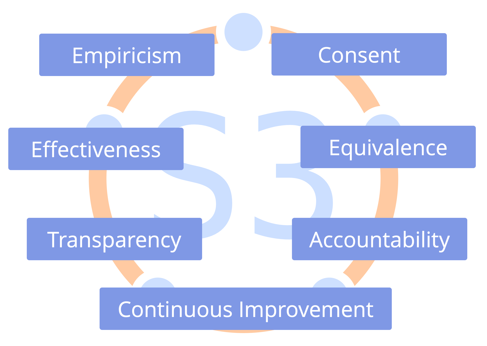
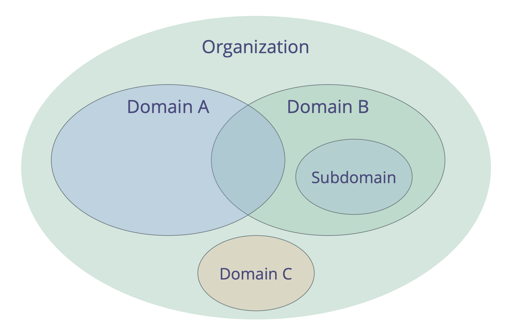
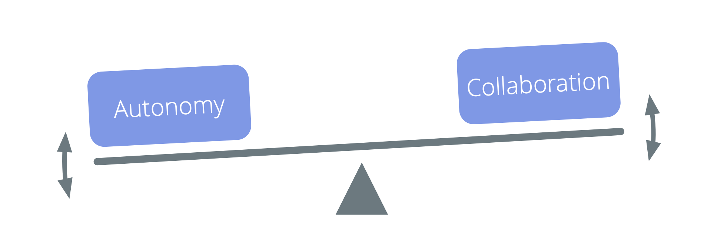

# Introduction

## Sociocracy 3.0 - A Practical Guide For Evolving Agile and Resilient Organizations 

### Effective Collaboration At Any Scale

-   **principles-based**: a coherent way for growing organizational integrity and developing a sociocractic and agile mindset
-   **flexible**: adaptable patterns, independent and mutually reinforcing, to help you with all aspects of collaboration
-   **free**: licensed under a Creative Commons Free Culture License

## What's in it for me?

Sociocracy 3.0 — **a.k.a. "S3"** — brings you an extensive collection of guidelines and practices (patterns) that have proven helpful for organizations to **improve performance, alignment, fulfillment and wellbeing**. 

S3 helps you discover how to best reach your objectives and navigate complexity, one step at a time, **without the need for sudden radical reorganization or planning a long-term change initiative**:

-   Simply start with your area of greatest need, select one or more patterns to try, **move at your own pace** and develop skills as you go. 

-   **Regardless of your position in the organization**, you will find patterns that are relevant and helpful for you.

## Contents

-   a brief overview of some basic concepts behind S3
-   a description of all the patterns in S3
-   an appendix 
    -   changelog
    -   info about authors and acknowledgments
    -   the license
    -   glossary and index

## Influences and History

## Driver for Creating Sociocracy 3.0

> _In 2014 we came together to co-create a body of Creative Commons licensed learning resources, synthesizing ideas from Sociocracy, Agile and Lean. We discovered that organizations of all sizes need a flexible menu of practices and structures – appropriate for their specific context – that enable the evolution of a sociocratic and agile mindset to achieve greater effectiveness, alignment, fulfillment and wellbeing._

## Basic Concepts

Before diving into the content, consider taking time to learn about some basic concepts behind S3: 

- what is a pattern?
- the seven principles
- drivers, value and waste
- domains, delegation and accountability
- governance, self-organization and semi-autonomy

For any terms you don't understand check out the glossary at the end.

## Patterns 

_A **pattern** is a template for successfully navigating a specific context._

-   S3 patterns are discovered through observing many organizations as they solve problems and respond to opportunities
-   S3 patterns can be evolved and adapted to suit differing contexts
-   the patterns are grouped by topic into ten categories

## All Patterns are based on The Seven Principles

## The Seven Principles

**The Principle of Effectiveness:** *Devote time only to what brings you closer toward achieving your objectives.*

**The Principle of Consent:** *Raise, seek out and resolve objections to decisions and actions.*

**The Principle of Empiricism:** *Test all assumptions through experimentation and continuous revision.*

**The Principle of Continuous Improvement:** *Change incrementally to accommodate steady empirical learning.*

**The Principle of Equivalence:** *Involve people in making and evolving decisions that affect them.*

**The Principle of Transparency:** *Make all information accessible to everyone in an organization, unless there is a reason for confidentiality.*

**The Principle of Accountability:** *Respond when something is needed, do what you agreed to do, and take ownership for the course of the organization.*

## The Principle of Accountability

*Respond when something is needed, do what you agreed to do, and take ownership for the course of the organization.*

Act within the constraints of any agreements governing domains you are accountable for, including the organization itself, groups you are part of, and roles you keep.

Everyone's primary accountability is for effective collaboration in response to organizational drivers.

Individuals are also accountable for their work, ongoing learning and development, and for supporting one another.

Everyone in an organization is accountable for aligning action with organizational values.
 

## Drivers

_A **driver** is a person’s or a group's motive for responding to a specific situation._

Drivers: 

-   can be used to derive goals, objectives, aims, mission, vision, purpose
-   can change over time

### Drivers: Value and Waste

_**Value** is the importance, worth or usefulness of something in relation to a driver._

_**Waste** is anything unnecessary for — or standing in the way of — a (more) effective response of a driver._

By adopting the concept of value and waste, many practices and ideas from **lean production** and **lean software development** can be utilized by organizations pulling in S3 patterns:

-   value stream mapping
-   various strategies for eliminating waste
-   the Kanban Method

## Domains

_A **domain** is a distinct area of influence, activity and decision making within an organization._

All domains are within the overall domain of an organization and may overlap and/or be fully contained within other domains.

Domains are delegated to people (e.g. to a unit, department, team or individuals), who take responsibility for the domain, and act within its defined constraints on influence and autonomy.

## Delegating Domains

Those delegating a domain (the _delegators_) still retain overall accountability for that domain, and often define:

-   **key responsibilities** (any essential work and decision making being delegated)
-   **constraints to the autonomy and influence** of those the domain is delegated to (the _delegatees_), usually related to the organization itself (e.g. budget, resources, level of delegation, reporting)

## Drivers and Domains

It's also possible to understand a domain in relation to organizational drivers:

-   the domain's **primary driver** - the main driver the people accounting for that domain (the _delegatees_) respond to
-   the set of subdrivers the organization may benefit from addressing when responding to the primary driver, which include:
    -   **key responsibilities** (any driver following directly from the domain's primary driver)
    -   drivers for **constraints of the domain** (which typically relate to the organization's wider context)

## Governance, Semi-Autonomy and  Self-Organization

**Governance**: Making and evolving decisions about what to do to achieve objectives, and setting constraints on how and when things will be done.

**Self-Governance**: People governing themselves within the constraints of a domain.

**Self-Organization**: People organizing work within constraints defined through governance.

**Operations** (Doing the Work): The work being done to create and deliver value, guided by governance.

**Semi-Autonomy**: The autonomy of people to create value, limited by the constraints of their domain (including the influence of the delegator and of representatives), and by objections from others.

## Governance or Operations?

_Does it require or benefit from an individual or group decision?_

-   yes: governance
    -   it's not covered by a previous agreement
    -   it needs to be agreed, decided or amended
-   no: operations
    -   it's covered by previous agreement (those accountable are free to act)
    -   it needs to be done

# The Patterns

## Co-Creation And Evolution 

###  Pattern 1.1: Respond to Organizational Drivers

**Clarify organizational drivers (i.e. what's happening and what's needed in relation to the organization), and respond as required.**

Responses to organizational drivers include:

- direct action (operations)
- organizing how work will be done 
- making governance decisions

The response to an organizational driver is typically treated as an experiment that is evaluated and evolved over time.

#### Qualify Organizational Drivers

A driver is considered an **organizational driver** if responding to it would help the organization generate value, eliminate waste or avoid harm.

A simple way to qualify whether or not a driver falls within an organization's domain is by checking:

_Would it help the organization if we respond to this driver? Or would it harm us if we don't?_

###  Pattern 1.2: Navigate Via Tension

**Pay attention to tension you experience in relation to the organization, investigate the cause and pass on any organizational drivers you discover to the people accountable for the appropriate domain.**

**Challenges and opportunities** for an organization are revealed by people bringing awareness to the reasons why they experience tension.

**Note:** In this context, a _tension_ is a personal experience: a symptom of dissonance between an individual's perception of a situation, and their expectations (or preferences).

To **discover drivers**, investigate what stimulates tension, and describe what's happening and what's needed. Sometimes an inquiry reveals misconceptions and the tension goes away.

###  Pattern 1.3: Describe Organizational Drivers

**Describe organizational drivers to understand, communicate and remember them.**

A simple way to describe a driver is with a **brief statement** explaining: 

-   **What’s happening...:**
    -   the **current situation**
    -   the **effect** of this situation on the organization
-   ...and **what’s needed:**
    -   the **need** of the organization in relation to this situation
    -   the **impact** of attending to that need

Depending on their perspective, a person or group may decide to describe a driver as a problem to solve or an opportunity to leverage. 

_A **driver statement** is a brief but comprehensive summary of the information required to understand a driver._

The driver statement contains just enough information to communicate the need for an action or a decision. Typically a driver statement can be summed up in one or two sentences.

In addition to the brief driver statement, more information about the scope and details of the driver may be recorded in the logbook.

### Example driver statement: 

> _“The kitchen is a mess: there are no clean cups, the sink is full of dishes and it’s not possible to quickly grab a coffee and get right back to work. We need the kitchen in a usable state so we can stay focused on our work.”_

### 1. Current Situation

> _“The kitchen is a mess: there are no clean cups, the sink is full of dishes...”_

Describe the current situation:

- Briefly capture the essentials of what is happening.
- Be objective - describe observations and avoid evaluation.

### 2. Effect

> _“...it’s not possible to quickly grab a coffee and get right back to work.”_

Explain the effect of this situation on the organization:

- Clarify **why** the situation needs attention: how does it affect the organization? 
- Be explicit about whether the effects are current or anticipated. 
- Explain challenges, losses, opportunities or gains. 

### 3. Need

> _“We need the kitchen in a usable state...”_

Explain the need of the organization in relation to this situation:

- A **need of an organization** is anything a group (or individual) requires to effectively account for a domain. 
- Be specific on whose need it is (“we need”, “they need”, “I need”).
- If there’s disagreement about the need, it helps to zoom out from specific solutions and focus on what the organization is lacking in this situation.

### 4. Impact

> _“...so we can stay focused on our work”._

Describe the impact of attending to that need:

- Explain the intended outcome, potential benefits or opportunities.
- The impact may be obvious or implicit, especially when the effects of the current situation are already described.

#### Review Driver Statements

Make sure to review driver statements on a regular basis, to deepen you understanding of what's happening and needed.

Helpful questions for a review include:

-   Is the description of the situation (still) correct?
-   Do we still associate the same needs with the situation?
-   Is the driver still within our domain?
-   Is the driver still relevant?

###  Pattern 1.4: Consent Decision Making

**A (facilitated) group process for decision making: invite objections, and consider information and knowledge revealed to further evolve proposals or existing agreements.**

Proposals become agreements when they are considered _good enough for now and safe enough to try_ until the next review.

Unresolved objections prevent proposals from becoming agreements.

Withholding objections can harm the objectives of a group or organization.

#### Implicit Contract of Consent

1.   In the absence of objections to an agreement, I intend to follow through on the agreement to the best of my ability.
2.   I agree to share objections as I become aware of them.

###  Pattern 1.5: Objection

_An **objection** is a reason why doing something stands in the way of (more) effective response to an organizational driver (i.e. an organizational requirement)._

Objections contain information that reveals **certain or likely consequence of harm** and/or **opportunities to immediately improve** proposals, decisions, existing agreements or actions. 

It's the accountability of individuals to raise potential objections. 

Withholding objections can harm the ability of individuals, groups or
the whole organization to respond to organizational drivers.

Being able to raise *potential* objections at any time means decisions only need *to be good enough for now and safe enough to try*.

Those accountable for the action or (proposed) agreement in question, are responsible for *considering arguments and addressing objections.*

When seeking out potential objections, consider:

- why the intended outcome would not be (fully) achieved: **effectiveness**
- why it would be wasteful to proceed as proposed (or previously agreed): **efficiency**
- the negative consequences something would have elsewhere (in the same domain, in the wider organization, or beyond): **side-effects**

The information revealed by objections can be used to improve:

-   current and planned action
-   how people execute on decisions
-   existing agreements
-   proposals
-   shared understanding of drivers

### Qualify Objections

Not all arguments raised are objections. Distinguish between objections, which always reveal useful information, and other arguments that are based only on opinion, preference or concern.

To discover if an argument qualifies as an objection, in a group context a facilitator might ask:

_“Do you think this argument qualifies as an objection?”_

If nobody disagrees with the argument, an objection typically qualifies.  Otherwise aim to discover the actual objection or reveal any misconceptions.

### Understanding Objections

Some helpful questions:

-   How does the argument relate to this specific proposal or agreement?
-   Does the argument reveal how a (proposed or current) **action or agreement**:
    -   harms response to any organizational driver?
    -   can be improved right now?
    -   prevents or diminishes someone's contribution towards responding to a driver?
    -   is in conflict with the organization's values?
    -   is considered not ‘safe enough’ to try?

### Concerns

_A **concern** is an opinion that doing something (even in the absence of objections) **might** stand in the way of (more) effective response to an organizational driver._

In _Consent Decision Making_, concerns can inform ways to further evolve agreements (including evaluation criteria and frequency of evaluation).  

Bring up concerns if you consider them important and at least record them along with evaluation criteria.

If you are in doubt whether you have an objection or a concern, check with others if they think it qualifies as an objection.

###  Pattern 1.6: Resolve Objections

###  Pattern 1.7: Evaluate And Evolve Agreements

**Continuously evolve the body of agreements, and eliminate waste.**

Regular review of agreements is an essential practice for a learning organization:

-   adapt agreements to suit changing context
-   integrate learning to make them more effective

Ensure all agreements have an appropriate review date.

Evaluating agreements can be as simple as checking that an agreement is still relevant, and there is no objection to keeping it as it is.

Agreements are often reviewed in _Governance Meetings_, however sometimes it's more effective to schedule a dedicated session.

Adjust review frequency as necessary, and review early if required.

Elements of this pattern can also be used by individuals to evaluate decisions they make.

### Short Format for Evaluating Agreements

-   _How has this agreement helped us?_
-   _Is there any reason to drop this agreement?_
-   _How can this agreement be improved?_
-   Agree on a next review date.

### Long Format For Evaluating Agreements

Preparation:

-   Schedule the review.
-   Ensure all necessary information is available.

Follow-up:

-   Agree on the next review date.
-   Document decisions and tasks, and share with relevant people.
-   Consider effects on any related agreements.

###  Pattern 1.8: Those Affected Decide

**Involve people in making decisions that affect them, to maintain equivalence and accountability, and to increase the amount of information available on the subject.**

For larger groups:

-   facilitate a process in several stages and create smaller groups who select delegates
-   use an online tool and conduct an asynchronous, time-boxed and staged process

Consider including those affected in reviewing and evolving decisions, too.

###  Pattern 1.9: Co-Create Proposal

**Bring people together to co-create proposals in response to organizational drivers: tap collective intelligence, build sense of ownership and increase engagement and accountability.**

There are many ways to co-create proposals. They typically follow a similar pattern:

1. Agree on the driver (or problem / opportunity / need)
2. Explore the topic and understand constraints
3. Generate ideas
4. Design a proposal (often done by a smaller group)

One way to co-create proposals is to use S3's _Proposal Forming_ pattern. 

For inspiration for steps 2 and 3, look to classic group facilitation techniques or design thinking activities.

Besides in a face-to-face workshop, you can adapt this process for online meetings. You can even use it asynchronously (and over an extended period of time) to include many people.

###  Pattern 1.10: Proposal Forming

**A (facilitated) group process for co-creating a response to a driver.**

-   draws on the collective intelligence and diversity of perspective within a group
-   involves people in co-creating agreements
-   fosters accountability and sense of ownership

_Proposal Forming_ may also be used by an individual.

  
#### Proposal Forming Steps

- **Consent to driver**: _Is this driver relevant for us to respond to? Is the driver statement an accurate description of what is happening and what is needed?_
- **Deepen shared understanding of driver**: invite essential questions to understand the driver in more detail.
- **Collect considerations** phrased as questions relating to possible solutions. Questions either reveal constraints (information gathering questions) or possibilities (generative questions).
- **Answer** any information gathering questions if possible.
- **Prioritize** considerations.
- **Gather ideas** as possible ingredients for a proposal.
- **Design a proposal** for addressing the driver considering the creative ideas and information gathered so far. This is usually done by a smaller group of "tuners".
  

#### Choosing Tuners

Consider: 

-   who should be there?
-   who wants to be there?
-   who else may have a valuable contribution to make?
-   consider expertise, outside view, and inspiration

Between two and three tuners is usually appropriate.

Check for any objections to the proposed tuner(s).

###  Pattern 1.11: Role Selection

**A group process for selecting a person for a role on the strength of the reason.**

Instead of simply assigning people for roles, or making a choice based only on majority, use the role selection process to:

- tap collective intelligence by hearing and deliberating on reasons for nominations
- increase ownership over the decision
- ensure support for the role keeper by those affected.

**1. Present Role Description:** If possible, send out the role’s domain description in advance.

**2. Record Nominations:** Participants write their nomination on a slip of paper. People can nominate themselves, another, or pass.

**3. Reasons for Nominations:**  Each person shares who they have nominated and why.

**4. Information Gathering:** Participants share or request any information that might support the group in making an appropriate selection.

**5. Nomination Changes:** Check if anyone wants to change their nomination in light of reasons and information shared so far, and hear the reasons for each change.

**6. Propose a Nominee** for the role: The facilitator guides the process to identify a suitable nominee on the strength of the reasons heard, e.g. by:

-   proposing a nominee themselves or asking a group member
-   inviting (some) nominees to agree who should be proposed
-   inviting group dialogue to help reveal the strongest nominee

**7. Check for Objections:** Ask participants (including the proposed nominee) to simultaneously signal whether or not they have an objection. 

**8. Address and Resolve Objections,** beginning with any from the proposed nominee. Objections may be resolved in many ways, including amending the role's domain description or by nominating someone else. When all objections are resolved, check with the (final) nominee again if they accept the role.

**9. Celebrate:** Acknowledge reaching agreement and thank the person who will now keep the role.

To avoid influencing others, abstain from expressing personal interest or opinions before a selection takes place.

Sometimes a role selection reveals a lack of capacity, relevant experience, qualities or skill. A group will then need to consider outside candidates, reconsider priorities or find an alternative way to account for the domain.

This pattern can also be used in any situation where there is a need to choose between a variety of options.

###  Pattern 1.12: Driver Mapping

A workshop format to identify an effective response to a complex situation: organize start-ups, kick-off projects, tackle major impediments or opportunities, develop organizational structure to better enable the flow of value.

Small or large groups identify and prioritize drivers, progressing quickly from concept to action in self-organizing groups.

#### Driver Mapping: Template for Domains 

## Peer Development 

###  Pattern 2.1: Ask For Help

**A simple protocol for learning, skill sharing, and building connections, with respect for people's agency.**

Ask someone, "_would you be willing to help me with ..._?" The person asked accepts or declines with a simple "_yes_" or "_no_".

-   if the request is declined, the person asking accepts the answer without negotiation or inquiry
-   if the request is unclear, inquire for more information
-   if you accept a request for help, support your peer in the best way you can

###  Pattern 2.2: Peer Feedback

Invite a peer to give you some constructive feedback on: 

-   your performance in a role
-   your general participation and contribution
-   any specific aspect you may be interested in

Considerations:

-   invite peers to take some time to prepare
-   invite both **appreciations** and **actionable improvement suggestions**
-   inquire to better understand the feedback, and avoid to discuss or judge it
-   decide for yourself what you will do with feedback you receive

###  Pattern 2.3: Peer Review

**Support each other to learn and grow in the roles and groups you serve in.**

The role keeper — or group — leads the peer review by setting up the process and speaking first in each step.

Ensure to invite people with complementing perspectives to contribute to the review, and a facilitator.

Improvement suggestions may relate to personal development, collaboration, updates to the domain description (including the driver statement) and strategy.

#### Continuous improvement of people's ability to effectively keep roles or collaborate together in groups.

###  Pattern 2.4: Development Plan

**A plan for how to develop more effective ways of accounting for a domain, agreed between delegator and delegatee.**

The development plan may be created for a person in a role, or for a group (e.g. a department, circle, team or open domain).

Development may happen in the form of refining the description of the driver and the domain, making amendments to strategy, or new or updated agreements and specific actions to be taken, either within the domain of the delegator, or the domain of the delegatee.

A development plan (and any accompanying recommendations for changes to the domain description and driver statement) requires consent from both the delegatee and the delegator.

## Enablers Of Co-Creation 

###  Pattern 3.1: Artful Participation

**Commit to doing your best to act and interact in ways that enable effective collaboration.**

Participating artfully may include interrupting, objecting or breaking  agreements.

_Artful Participation_ is an **individual commitment** to:

-   actively **consider and follow-up on all agreements** made, in the best way possible, given the circumstances
-   **develop awareness and understanding** of individual and collective needs
-   **grow the necessary skills**
-   **support others** to participate artfully
-   bring impediments and improvement suggestions to the attention of others if necessary

#### Benefits Of Artful Participation

Artful participation:

- enables co-creation and evolution of agreements
- helps to grow stronger teams
- builds self-accountability, integrity and trust
- generates a culture of mutual support and close collaboration
- is more powerful when embraced by many

#### Artful Participation: Self-Assessment

-   How can I support myself and others to participate more artfully? 
-   Where are my interactions with others unhelpful or ineffective?
-   Which agreements do I find hard to keep? What can I do to address this?
-   What skills can I develop, that would support me to participate more artfully?
-   What would artful participation mean in relation to:
    -   my daily activities?
    -   collaboration and interaction with others?
    -   the organization? ...our customers or clients?
    -   the wider environment?

###  Pattern 3.2: Adopt The Seven Principles

**Align collaboration with the Seven Principles.**

Adopting the Seven Principles reduces the number of explicit agreements required, and guides adaptation of S3 patterns to suit the organization's context.

An organization's values need to embrace the Seven Principles.

###  Pattern 3.3: Agree On Values

**Intentionally evolve the culture in your organization.**

_**Values** are valued principles that guide behavior. Values define scope for action and ethical constraints._

-   each member brings their own values to an organization based on personal experiences and beliefs
-   a group or organization may **choose to collectively adopt values** to guide their collaboration

Values offer guidance to determine appropriate action, even in the absence of explicit agreements.

Collectively adopting a set of values supports the effectiveness of an organization:

-   reduces potential for **misunderstanding**
-   helps to **align** decision making and action
-   **attracts new members, partners and customers** who are aligned with the organization

Chosen values are an agreement that benefits from **regular review**.

###  Pattern 3.4: Governance Facilitator (Role)

**Select someone to facilitate governance meetings.**

A governance facilitator:

-    ensures governance meetings stay on track and are evaluated
-   is (usually) selected by a group from among it members (and for a specific term)
-   familiarizes themselves with the _Governance Backlog_
-   often invites others to facilitate some agenda items

As a governance facilitator, consider learning about and using the following patterns from S3 to handle governance effectively:

-   _Rounds_
-   _Proposal Forming_
-   _Consent Decision Making_
-   _Role Selection_
-   _Evaluate Meetings_
-   _Resolve Objections_
-   _Peer Review_

###  Pattern 3.5: Breaking Agreements

Breaking agreements is sometimes **necessary** but may come at a **cost** to the community.

Be accountable:

-   **clean up** disturbances
-   **follow up** as soon as possible with those affected
-   **change the agreement** instead of repeatedly breaking it

###  Pattern 3.6: Contract For Successful Collaboration
 
**Support successful collaboration from the start and build trust between parties by co-creating mutually beneficial and legally robust contracts.**

A **contract** is a body of promises that two or more parties agree to make legally binding, i.e if those promises are violated, the injured party gains access to legal (or alternative) remedies. 

Developing shared understanding about needs and expectations is essential for successful collaboration.

While negotiating and agreeing on a contract, model the culture of collaboration you want to achieve, and build a positive relationship with the other parties involved. 

This pattern refers to contracts relating related to collaboration around any business transaction between an organization and other parties (e.g. employees, consultants, service providers, shareholders or customers). And particularly in matters concerning significant value and or obligations. e.g.: 

- employment contracts and contracts with external contractors or consultants in support roles (including any agreement that results in a change of remuneration or working hours)
- contracts governing collaboration with customers, vendors or service providers
- shareholder agreements

**Note:** Many agreements about collaboration within an organization do not require dedicated contracts, as they are already governed by or subject to existing contracts.

### Criteria for a successful alliance between contracting parties

When negotiating a contract, ensure:

- shared understanding of the reason for the collaboration, as well as the intended outcome and important constraints
- all parties understand what is expected of them
- all parties affected by a contract are involved in creating the contract and enter it voluntarily
- expectations are realistic
- the agreement is beneficial to all parties
- everyone intends to keep to the agreement made

If for any reason one or more of these criteria cannot be fulfilled, it is probably wise to not proceed.

### Co-creating the contract

The way a contract is negotiated can significantly contribute toward building trust between parties. Approach contracting from the point of view of making an agreement between partners, not adversaries: co-create the contract, tailor it to its specific context, and ensure it is legally robust.

- include all expectations to the parties involved, and explain each with adequate detail
- use clear and simple language that all parties can understand, and be unambiguous about legal consequences
- if you need to use specific technical or legal terms a party might be unfamiliar with, explain them in a glossary that is part of the contract
- consult a lawyer who supports the culture you aspire to and is competent in the field if business you are negotiating

------

### When Co-Creating A Contract:

- ensure all parties have a delegation that includes representation for all affected domains (e.g. not only sales, but also development / production / support, etc)
- explicitly describe the culture you want to develop, with consideration for common ground and any cultural differences between parties
- state the reasons for the proposed collaboration, and transparent about expectations and needs of all parties
- disclose all relevant information (if necessary under an NDA)
- agree first on terms of the relationship and expectations to all parties, and then consider how you can make them legally robust
- compile a list of specific laws and regulation the contract needs to comply to
- negotiate in several iterations, allowing time to consider implications and propose amendments
- keep minutes of each meeting to reduce the potential for misconceptions

#### Support The Full Lifecycle Of The Collaboration:

Any contract can be changed at any time, provided all signatories agree. However, it greatly reduces the potential for conflict later if you consider the full lifecycle of the collaboration in the contract:

- make provisions for successfully getting started by defining onboarding procedures
- have a probationary period — where all parties can try out the collaboration — and a clear protocol for how to end the contract in the probationary period
- define and build into the contract, regular review meetings where signatories come together to share learning and decide how the contract might be amended to adapt to changing context
- include procedures for breach of contract
- consider making available alternative means for dispute resolution, e.g. mediation, conciliation  or arbitration
- consider limiting the contract to a fixed term after which the contract expires and can be renewed if required

#### Culture

Every contract influences the culture of the collaboration it governs, even when it appears to only describe *what* needs to be delivered:

- intentionally create the culture of collaboration you want to see by including expectations on *how* things should be done 
- align the contract to the organizational culture (of all parties) and to legal requirements
- build contracts that enable and encourage accountability

if you find that standard contracts in your industry are misaligned  with the culture you want to create, build your own repository of templates for contracts and clauses and consider sharing it with others, so that you can leverage past experience when creating new contracts.

###  Pattern 3.7: Transparent Salary

**Create a fair salary formula and make it transparent.**

Transparent salary (also referred to as "open salary") is the practice of making the salary formula — and often individual compensation as well — transparent to all members of an organization, and sometimes to the public.

A transparent salary formula needs to suit an organization's context, and to be perceived as fair enough by all stakeholders.

Perception of fairness varies from person to person and according to context, so creating a salary formula requires developing a shared understanding of what is considered fair.

When deciding (or agreeing) on a salary formula for an organization or department, consider: 

- what would be a suitable fixed subsistence guarantee
- how to calculate compensation according to need, investment, productivity, or merit
- how to distribute the organization's profit and cover for losses in line with expectations and needs of the various stakeholders

Decide how to handle remuneration for changing roles and create strategy for how to transition towards new contracts and compensation agreements.

#### Two Ways of Opening Salaries

###  Pattern 3.8: Support Role

**Apply the role pattern to external contractors.**
    
-   clarify and describe the driver for the role
-   create a domain description
-   if valuable, implement a selection process
-   limit the term of the contract
-   build in regular peer reviews

External contractors consent to take on their role.

see also: [Contract For Successful Collaboration](contract-for-successful-collaboration)

###  Pattern 3.9: Bylaws

Secure S3 principles and patterns in your bylaws as needed to protect **legal integrity** and **organizational culture**

Consider:
    
-   consent and equivalence in decision making
-   selection process for leadership roles
-   organizational structure, values and principles
-   influence of owners or shareholders
-   sharing gains and costs

## Building Organizations 

###  Pattern 4.1: Delegate Influence

**Distribute the power to influence, to enable people to decide and act for themselves within defined constraints.**

A delegator can support delegatees to deliver value by:

-   Clearly defining domains of autonomy and accountability
-   Ensuring there are opportunities for learning and development
-   Providing support if required

Adjust constraints incrementally, considering capabilities, reliability and outcome.

Decentralize as much as possible, and retain as much influence as necessary.

###  Pattern 4.2: Circle

_A **circle** is a self-governing and semi-autonomous group of equivalent people who collaborate to account for a domain._

A circle:

-   may be permanent or temporary
-   may be self-organizing
-   is accountable for its own development and its body of agreements

-   **semi-autonomous**:
    -   A circle's members act within the constraints of their domain .
    -   Each circle can create value autonomously.
-   **self-governing**:
    -   A circle's members ongoingly continuously decides together what to do to account for their domain, and set constraints on how and when things will be done.
-  **equivalence of circle members**
    -   All members of a circle are equally accountable for governance of the circle's domain.

###  Pattern 4.3: Role

**Delegate accountability for a domain to individuals.**

A role is an area of accountability (a domain) that is delegated to an individual (the **role keeper**), who has autonomy to decide and act within the constraints of the role's domain.

The role keeper leads in creating a strategy for how they will account for their domain. They evolve their strategy in collaboration with the delegator.

A role is a simple way for an organization (or group) to delegate recurring tasks or a specific area of work and decision making to one of its members.

- people can take responsibility for more than one role
- instead of formally setting up a new group, it's sometimes simpler to just share one role between several people
- role keepers are selected by consent and for a limited term
- peers support one another to develop in the roles they keep

A role keeper may maintain a governance backlog, and a logbook to record and help them evolve their approach toward delivering value.

**Note**: In S3, guidelines, processes or protocols created by individuals in roles are treated as agreements.  

###  Pattern 4.4: Linking

**Enable the flow of information and influence between two groups.**

A group selects one of its members to represent their interests in the governance decisions of another group.

###  Pattern 4.5: Double Linking

**Enable the _two-way_ flow of information and influence between two groups.**

Two interdependent groups each select one of their members to represent their interests in the governance decisions of the other group.

Double linking enables equivalence between two groups and can be used to draw out valuable information in hierarchical structures.

###  Pattern 4.6: Representative (role)

**Select a group member to participate in the governance decision making of another group to enable the flow of information and influence.**

Representatives (a.k.a. links):

-   stand for the interests of one group in another group
-   are selected for a limited term
-   participate in the **governance decision making** of the group they link with, and can:
    -   raise items for the agenda
    -   participate in forming proposals
    -   raise objections to proposals and existing agreements

###  Pattern 4.7: Helping Team

**Bring together a group of equivalent people with the mandate to execute on a specific set of requirements defined by a delegator.**

A helping team: 

-   is a way for a delegator to expand their capacity
-   may be self-organizing, or guided by a coordinator chosen by the delegator
-   is governed by the delegator
-   benefits from a clearly defined domain

Members of the helping team:

-   can object to the delegator's decisions that affect them
-   can add items to the delegator's governance backlog
-   may be invited to select a representative to participate in the governance decision making of the delegator

###  Pattern 4.8: Open Domain

**Intentionally account for a domain by invitation rather than assignment and request that those invited contribute when they can.**

The delegator of the open domain clarifies:
 
- the primary driver, key responsibilities and constraints of the open domain
- who is invited to contribute to the open domain
- constraints relating to the delegator’s participation in the open domain’s governance

Depending on the constraints set by the delegator, contributors may only organize and do work, or take part in governance as well.

A delegator is accountable for conducting regular reviews to support effectiveness of work and any decision making done in an open domain. 

###  Pattern 4.9: Open Systems

**Intentionally communicate with and learn from others outside of your system.**

Individuals, groups and entire organizations can acknowledge interdependence and intentionally invite people from outside their system to bring in **knowledge, experience and influence** to assist with decision making and support collective learning.

-   **External experts** can offer an outside perspective and bring knowledge, understanding and skills
-   **Representatives of affected parties** can inform and influence decision making in ways that benefit overall objectives (see Those Affected Decide)

## Bringing In S3 

###  Pattern 5.1: Adapt Patterns To Context

**Adapt and evolve S3 patterns to suit your specific context.**

Ensure that everyone affected:

-   understands why changing the pattern is necessary (or helpful)
-   is present or represented when deciding how to change it
-   uses S3 principles as a guide for adaptation.

Run experiments with adaptations for long enough to learn about the benefits and any potential pitfalls.

Share valuable adaptations with the S3 community.

###  Pattern 5.2: Create a Pull-System For Organizational Change

**Create an environment that invites and enables members of the organization to drive change.**

Change things when there is value in doing so:

-   Bring in patterns that help to solve current and important problems.
-   Don't break what's already working!
-   Meet everyone where they are…
-   …and let them choose their own pace.

###  Pattern 5.3: Be The Change

**Lead by example.**

Behave and act in the ways you would like others to behave and act.

###  Pattern 5.4: Invite Change

**Clarify the reason for change and invite people to participate.**

Inviting rather than imposing change helps reduce resistance and enables people to choose for themselves.

When making the invitation:

-   be transparent about the reason for the change
-   clarify expectations and constraints
-   avoid coercion or manipulation
-   acknowledge any skepticism and doubts

Include the people involved and affected in regular evaluation of outcomes.

###  Pattern 5.5: Open-Space For Change

**Invite everyone to create and run experiments for evolving the organization.**

-   clarify the driver for change
-   schedule regular open space events:
    -   invite all members to create and run experiments
    -   define constraints for the experiments that enable development of a sociocratic and agile mindset (e.g. S3 principles)
    -   review and learn from experimentation in the next open space

###  Pattern 5.6: Continuous Improvement Of Work Process With S3

**Reveal drivers and establish a metrics-based pull-system for organizational change through continuously improving and refining the work process.**

-   introduce the principle of consent and _Navigate Via Tension_ to evolve work process in a group
-   consider selecting a facilitator to guide group processes, and choosing values to guide the group
-   initiate a process of continuous improvement, e.g. through Kanban or regular retrospectives
-   members of the group pull in S3 patterns as required
-   if valuable, iteratively expand the scope of the experiment to other groups
-   intentionally look out for impediments  

#### Waste And Continuous Improvement

_**Waste** is anything unnecessary for — or standing in the way of — a (more) effective response of a driver._

Waste exists in various forms and on different levels of abstraction (tasks, processes, organizational structure, mental models...)

Establishing a process for the ongoing elimination of waste enables natural evolution of an organization towards greater effectiveness and adaptation to changing context.

## Defining Agreements 

### Agreement Life-Cycle

###  Pattern 6.1: Agreement

_An **agreement** is an agreed upon guideline, process or protocol designed to guide the flow of value._

-   agreements are created in response to organizational drivers 
-   **overall accountability** for an agreement lies with the people that make them
-   an agreement can include **delegation of specific responsibilities** to individuals or groups
-   agreements are **regularly reviewed**, and evolved as necessary
-   record those agreements you might want to reference later

**Note**: In S3, guidelines, processes or protocols created by individuals in roles are also treated as agreements.  

#### Template for Agreements

###  Pattern 6.2: Develop Strategy

_A **strategy** is a high level approach for how people will create value to successfully account for a domain._

It is usually more effective if a group or role keeper lead in developing their own strategy.

A strategy often includes a description of the intended outcome.

As the delegator shares accountability for domains they delegate, it's valuable they review a delegatee's strategy, to check for potential impediments and suggest ways it could be improved.

A strategy is a shared agreement between delegator(s) and delegatee(s) that is regularly reviewed and updated as necessary (*pivot or persevere*)

Strategies are validated and refined through experimentation and learning.

###  Pattern 6.3: Clarify Domains

**A clear understanding of people's area of accountability and autonomy enables greater efficiency, effective collaboration and agility throughout an organization.**

A simple way to clarify domains is with a **domain description** that contains:

-   primary driver
-   key responsibilities
-   constraints
-   evaluation criteria for peer review
-   term (for a role)
-   (previous versions)

Domain descriptions can be created for a role, position, circle, team, open domain, department, unit, or the whole organization.

One way of clarifying a domain is by filling out an [S3 Delegation Canvas](http://s3canvas.sociocracy30.org/s3-delegation-canvas.html).

###  Pattern 6.4: Clarify Intended Outcome

**Be explicit about the expected results of agreements, actions, projects and strategies.**

Agree on and record a concise description of the intended outcome. 

The intended outcome can be used to define *Evaluation Criteria* and metrics for reviewing actual outcome.

###  Pattern 6.5: Describe Deliverables

**Clearly describe deliverables in the context of an agreement, to support shared understanding of expectations.**

_A **deliverable** is a product, service, raw material, experience or transformation, provided as a result of an agreement._

When describing deliverables:

-   include the necessary amount of detail
-   reference other documents when helpful or necessary

Explicitly describing deliverables can be useful for improving: 

-   organizational strategy
-   the strategy of groups or individuals
-   development plans
-   domain descriptions
-   any other agreement (e.g. business objectives, process policy, customer communication)

###  Pattern 6.6: Evaluation Criteria

**Develop well-defined evaluation criteria to determine if acting on an agreement had the desired effect.**

-   go for **simple and unambiguous** criteria and document them (to avoid discussion or unnecessary dialogue when reviewing your agreements)
-   define **actionable metrics** to continuously track effects and spot deviations from intended outcome
-   consider adding criteria which make it explicit when the outcome of an agreement would be considered **unsuccessful**
-   when reviewing an agreement, consider **evolving the evaluation criteria** based on what you have learned

###  Pattern 6.7: Logbook

**Maintain a coherent and accessible system that stores all information required for collaboration.**

A logbook is a (digital) system to store all information relevant for running an organization and its teams. The logbook is accessible to all members of an organization, and information is kept confidential only when there is good reason to do so.

Common platforms for logbooks are Wikis (e.g. [Dokuwiki](https://www.dokuwiki.org/), [MediaWiki](https://www.mediawiki.org/), [Confluence](https://www.atlassian.com/software/confluence)), Content Management Systems (e.g. [Wordpress](https://wordpress.org/)), [G Suite](https://gsuite.google.com), [Evernote](https://evernote.com/business) or even [Trello](https://trello.com/).

#### Logbook Contents

Content relating to the whole organization: 

-   primary driver, strategy and organizational values
-   organizational structure (domains and the connections between them)
-   agreements 

Content relating to a specific group or role: 

-   the domain description and strategy
-   agreements (including delegatees' domain descriptions, strategies and development plans)
-   backlogs and other information relating to work and governance

###  Pattern 6.8: Logbook Keeper (Role)

**Select a member of your group to be specifically accountable for keeping up to date records of all information the group requires.**

The logbook keeper is accountable for maintaining a group's logbook by: 

-   recording details of agreements, domain descriptions, selections, evaluation dates, minutes of meetings etc.
-   organizing relevant information and improving the system when valuable
-   keeping records up to date
-   ensuring accessibility to everyone in the group (and in the wider organization as agreed)
-   attending to all technical aspects of logbook keeping

## Focused Interactions 

###  Pattern 7.1: Governance Meeting

**Groups meet at regular intervals to decide what to do to achieve objectives, and to set constraints on how and when things will be done.**

A governance meeting is usually:

-   facilitated 
-   prepared in advance 
-   time-boxed for a duration of 90-120 minutes
-   scheduled every 2-4 weeks

A typical governance meeting includes: 

-   opening: opening: check in with each other and attune to the objective of the meeting
-   administrative matters 
    -   check for consent to the last meeting's minutes
    -   agree on a date for the next meeting
    -   check for any last-minute agenda items and for consent to the agenda
-   agenda items 
-   meeting evaluation: reflect on your interactions, celebrate successes and share suggestions for improvement
-   closing: check in with each other before you leave the meeting

Typical agenda items include:

-   any short reports 
-   evaluation of existing agreements due review
-   selecting people to roles 
-   new drivers requiring decisions to be made, including: 
    -   forming proposals
    -   making agreements 
    -   designing domains and deciding how to account for them (e.g. new roles, circles, teams or open domains)

###  Pattern 7.2: Retrospective

**Dedicate time to reflect on past experience, learn, and decide how to improve work process.**

-   output: changes to work process, new tasks, on-the-fly agreements, and drivers requiring an agreement
-   facilitated meeting (~1hr)
-   regular intervals (1-4 weeks)
-   adapt to situation and context

#### Output of a Retrospective 

#### Five Phases of a Retrospective Meeting

1. Set the stage 
2. Gather data
3. Generate insights
4. Decide what to do
5. Close the retrospective

Many different activities for each phase can be found at [plans-for-retrospectives.com](http://www.plans-for-retrospectives.com/)

###  Pattern 7.3: Daily Standup

**Meet daily to organize work, facilitate learning and improve your productivity and effectiveness.**

-   time-boxed (usually 15 minutes)
-   held daily at the same time
-   the group gathers around a visible project management board/tool to:
    -   organize daily work
    -   address impediments/blocks
    -   adapt existing agreements or create new agreements on the spot

###  Pattern 7.4: Planning And Review Meetings

**People meet at regular intervals (1-4 weeks) in time-boxed meetings to plan and review work.**

**Planning meeting**: select and estimate work items for the next iteration.

**Review meeting**: review completed work items and decide on re-work and changes for the next iteration.

###  Pattern 7.5: Coordination Meeting

**Meet on a regular basis (usually weekly) for reporting on and coordinating work across domains.**

-   facilitate the meeting (timebox dialogue and use rounds where valuable)
-   when useful, compile an agenda before the meeting and share it with attendees in advance
    -   include details of any prerequisites that can help attendees to prepare
    -   further agenda items may come up when hearing status reports

Agenda items: 

- cross domain synchronization and alignment
- prioritization and distribution of work  
- responding to impediments

## Meeting Practices 

###  Pattern 8.1: Rounds

**In a group meeting, go around the circle giving everyone the chance to speak in turn.**

Rounds are a group facilitation technique to maintain equivalence and support effective dialogue.

Be clear on the purpose and intended outcome of each round. 

Sit in a circle, begin each round with a different person, and change direction (clockwise or counterclockwise) to bring variation to who speaks first and last, and to the order of contributions.

###  Pattern 8.2: Facilitate Meetings

**Choose someone to facilitate a meeting to help the group maintain focus, keep the meeting on track and draw out the participant's creativity and wisdom.**

Before each meeting, prepare an agenda of topics, and select a facilitator to:

-   hold the space, keep the time and navigate the agenda during the meeting
-   facilitate a suitable activity for each topic
-   facilitate an evaluation at the end of the meeting

Consider selecting a facilitator for a specific term. Even an inexperienced facilitator can make a positive difference.

###  Pattern 8.3: Prepare For Meetings

**Prepare in advance to make meetings more effective.**

Some considerations for successfully preparing a meeting:

- clarify and communicate the driver for, and intended outcome of the meeting
- decide who to invite 
- create an agenda
- schedule the meeting enough in advance, so people have time to prepare
- choose an appropriate duration for the meeting 
- be clear who will facilitate the meeting, who will take minutes and who will take care of any follow-up

### Preparing an Agenda

Involve people in preparing and prioritizing an agenda and send it out in advance

For each agenda item agree on:

- the driver 
- the intended outcome
- the process
- the time you want to spend on it 
- what people need to do to prepare

### Support the Participants' Preparation

- consider what can be done in advance to prepare for the meeting
- notify people about any expectations and prerequisites
- make any resources available that people may need for preparation

### As a participant

- consider the pattern _Artful Participation_
- review the agenda and consider how you can contribute to each item
- bring up objections to an agenda, and if possible resolve them before the meeting
- review improvement suggestions from the last meeting's evaluation and consider how **you** might act on them

###  Pattern 8.4: Check In

**Help people to become aware of themselves and others, and to focus, be present and engage.**

To check in, briefly disclose something about what’s up for you and how you are, revealing thoughts, feelings, distractions or needs. 

Checking in may take the form of an opening or closing round in a group meeting, or just a brief exchange in a 1:1 meeting. 

You can also call for a group check-in during a meeting, or even choose to individually check in whenever you think this is valuable for the group.

In a group check-in, allow people to pass if they choose. 

When checking in, in a new setting, people can also say their name and where they are coming from, as a way to introduce themselves. (Tip: Avoid talking about function, rank etc unless there is a reason to do so.)

###  Pattern 8.5: Evaluate Meetings

**Take time for learning at the end of each meeting or workshop.**

Reflect on interactions, celebrate successes and share suggestions for improvement before closing the meeting.

-   reserve 5 minutes for 1 hour, and 15 minutes for a full-day workshop
-   record learning and review it before the next meeting

Short formats you can use: 

-   more of/less of/start/stop/keep
-   positive/critical/suggested improvements

#### Evaluate Meetings: Long Format

Ask everyone in a round to reflect on any or all of the following topics in a brief sharing, and report key points you'd like to remember for next time:

-   effectiveness and format
-   facilitation and participation
-   emotional tone
-   appreciations and achievements (I liked...)
-   growing edges and improvement suggestions (I wish...)
-   wild ideas and radical suggestions (What if...)

###  Pattern 8.6: Meeting Host (Role)

**Select someone to take responsibility for the preparation and follow-up of meetings, workshops or other events.**

A person may take on the role of Meeting Host for a specific event or for several events over a period of time.

#### Responsibilities Of A Meeting Host

Preparation:

-   identify goals and deliverables
-   prepare and distribute agenda
-   identify and invite the participants
-   estimate the time required and schedule the meeting/workshop
-   book the location (and transportation if required)
-   set up the space and provide required materials and information
-   ensure selection of a facilitator and a notetaker to record minutes, if appropriate

**After the meeting**: clean up location, return keys, tie up all the loose ends, and ensure minutes are distributed.

###  Pattern 8.7: Governance Backlog

_A **governance backlog** is a visible, prioritized list of items (drivers) that are related to governing a domain and require attention._

A governance backlog contains:

-   matters requiring a decision
-   proposals to create and consider
-   selecting people for roles

**Note:** Upcoming reports and agreements due review are usually added directly to the agenda (rather than the backlog).

## Organizing Work 

###  Pattern 9.1: Backlog

_A **backlog** (to-do-list) is a list of (often prioritized) uncompleted work items (deliverables), or (drivers) that need to be addressed._

Consider making backlogs visible, not only to other members of a group, but also to the wider organization.

Types of backlog include:

-   governance backlog
-   operations backlog
-   sprint backlog
-   product backlog
-   impediments backlog

**Implementation:**

-   **analog backlog**: sticky notes on a wall, or index cards, magnets and whiteboard
-   **digital backlog**: e.g. [Google Sheets](https://www.google.com/sheets/about/), [Trello](https://trello.com/), [Kanban Flow](https://kanbanflow.com/), [Jira](https://www.atlassian.com/software/jira), [Asana](https://asana.com/)

Each item on a (prioritized) backlog typically contains:

-   a **short description** or a driver statement
-   a **unique reference number** (or link) for each work item
-   (the **order of work items**)
-   **dependencies** to other work items or projects
-   **due date** (if necessary)
-   (optional) a measure for **value** 
-   (optional) a measure for **investment** (often an estimate of time or complexity)

###  Pattern 9.2: Prioritize Backlogs

**Order all uncompleted work items with the most important items first, then pull work items from the top whenever there is new capacity.**

No two items can be of equal importance, meaning it is necessary to agree on priorities and make tough choices.

A prioritized backlog helps to **maintain focus** on the most important items.

###  Pattern 9.3: Visualize Work

**Maintain a system that allows all stakeholders to review the state of all work items currently pending, in progress or complete.**

-   valuable for self-organization and pull-systems
-   system must be accessible to everyone affected
-   **analog**: post-its on a wall, or index cards, magnets and white board
-   **digital**: [Trello](https://trello.com/, [Kanbanery](https://kanbanery.com/), [Leankit](https://leankit.com/), [Jira](https://www.atlassian.com/software/jira), [Google Sheets](https://www.google.com/sheets/about/), etc.

#### Things to track: 

-   **types of work items** (e.g. customer request, project tasks, reporting tasks, rework)
-   **start date** (and **due date** if necessary)
-   **priorities**
-   **stages** of work (e.g. "to do", "in progress", "review" and "done")
-   impediments/blocks
-   who is working on which items
-   agreements and expectations guiding workflow (e.g. definition of done, policy, quality standards)
-   use colors, symbols, highlights etc.

###  Pattern 9.4: Pull-System For Work

**People pull in new work items when they have capacity (instead of having work pushed or assigned to them.**

Prioritize pending work items to ensure that important items are worked on first.

Pulling in work prevents overloading the system, especially when work in progress (WIP) per person is limited. 

###  Pattern 9.5: Limit Work in Progress

**Limit the number of work items in any stage of your work process.**

Work in Progress includes:

-   the number of items in a backlog
-   concurrent projects or tasks for groups or individuals
-   products in a portfolio

When an action would exceed an agreed upon limit of work items in progress, this needs to be brought up with the group before continuing.

###  Pattern 9.6: Timebox Activities

**Set a time constraint to stay focused, bring consciousness to the time you have and how you use it.**

A timebox is a fixed period of time spent focused on a specific activity (which is not necessarily finished by the end of the timebox):

- to get value out of the timebox, be clear what you want to achieve
- agree on the duration of the timebox and visualize time
- negotiate and agree to extend a timebox before the time is up
- break down longer activities into manageable timeboxes
- consider frequent review of progress
- consider choosing someone (the "time keeper") to help others stay conscious of time

You could timebox:

- meetings, calls, dialogue
- tasks
- experiments
- an attempt to solve a problem
- checking emails
- breaks
- a longer stretch of work (a sprint)

###  Pattern 9.7: Align Flow

**In support of continuous flow of value, move decision making close to where value is created, and align the flow of information accordingly.**

**Flow of value**: Deliverables traveling through an organization towards customers or other stakeholders.

Achieve and maintain alignment of flow through the continuous evolution of an organization's body of agreements:

-   ensure all decisions affecting the flow of value actually support the flow of value
-   enable people with relevant skills and knowledge to influence decisions
-   make available any helpful information
-   aim for shorter feedback loops to amplify learning.

When decision making is conducted close to where value is created, and the flow of information supports the continuous and steady flow of value, the potential for accumulation of waste is reduced.

###  Pattern 9.8: Coordinator (Role)

A person fulfilling the role of a coordinator is accountable for **coordinating a domain's operations** and is **selected for a limited term.**

The coordinator may be selected by the group itself, or by the delegator.

Several coordinators may collaborate to synchronize work across multiple domains.

Instead of selecting a coordinator, a group may choose to self-organize.

## Organizational Structure 

Organizational structure is the actual arrangement of domains and their connections. It reflects where power to influence is located, and the channels through which information and influence flow.

Continuously evolve your organization's structure to:

-   support the continuous flow of value
-   enable effective collaboration around dependencies
-   ensure information is available to those who need it
-   distribute power to influence as required

The basic building blocks for organizational structure are interdependent, connected domains.

Domains can be linked to form a hierarchy or a **heterarchy** (a.k.a. complex  adaptive system, or network, where multiple functional structures can co-exist).

## Structural Patterns

Sociocracy 3.0 describes a variety of patterns to grow organizational structure.

-   patterns apply to different layers of abstraction
-   different structural patterns serve different drivers
-   structural patterns can be adapted and combined as needed
-   more patterns are out there and will be discovered

###  Pattern 10.1: Service Circle

**Outsource services required by two or more domains.**

A service circle can be populated by members of the domains it serves, and/or by other people too.

###  Pattern 10.2: Delegate Circle

**Delegate decision making for how to respond to drivers affecting multiple domains, to representatives.**

To make governance decisions on their behalf, stakeholders send representatives to form a delegate circle.

Governance decisions made in a delegate circle are acted upon in the various domains it serves.

Delegate circles provide a way of steering organizations in alignment with the flow of value, and bring a diversity of perspectives to governance decision making.

A delegate circle may bring in other people (e.g. external experts) to help with specific decisions, or even as a  member of the circle.

###  Pattern 10.3: Peach Organization

**Deliver value in complex and competitive environments through _decentralization_ (of resources and influence) and _direct interaction_ between those creating value and the customers they serve.**

Groups in the periphery:

-   deliver value in direct exchange with the outside world (customers, partners, communities, municipalities etc.) 
-   steward the monetary resources and steer the organization

The center provides internal services to support the organization.

Domains are linked as required to flow information and influence, and to support collaboration around dependencies.

###  Pattern 10.4: Double-Linked Hierarchy

**Delegate all decision making to self-governing circles, double-linked across all levels of the hierarchy, to transition from an traditional hierarchy towards a structure more suitable for tapping collective intelligence and building engagement.**

1. Shift governance decision making from individuals to groups by forming self-governing circles on all levels of your organization.

2. Each circle's members select one of their group to represent their interests and participate in the governance decision making of the next higher circle, and vice versa.

A double-linked hierarchy:

- brings equivalence to governance
- maintains the potential for a functional hierarchy (if it enables the flow of value).

###  Pattern 10.5: Service Organization

**Multi-stakeholder collaboration and alignment towards a shared driver (or objective).** 

-   improves potential for equivalence between various entities
-   increases cross-departmental/organizational alignment
-   supports multi-agency collaboration between departments/organizations with different primary motives, or that are in conflict
-   suitable for one-off projects, or ongoing collaboration

**Note:** a service organization is sometimes referred to as a **backbone organization**.

###  Pattern 10.6: Fractal Organization

**Multiple constituents (organizations or projects) with a common (or similar) primary driver and structure can share learning across functional domains, align action and make high level governance decisions (e.g. overall strategy)**.

Creating a fractal organization can enable a large network to rapidly respond to changing contexts. 

If necessary, the pattern can be repeated to connect multiple fractal organizations into one. 

### Prerequisites

A fractal organization can be formed either by multiple in(ter-)dependent organizations which share a common (primary) driver, or by multiple branches, departments, or projects within a larger organization.

These constituents (i.e. organizations, branches, departments or projects) need to share at least some — and typically most — functional domains (e.g. accounting, product management, or development).

### Tiers

A fractal organization has at least three tiers: 

- first tier: the **constituents** (i.e. organizations, branches, departments or projects)
- second tier: **function-specific delegate circles** to share learning and to make and evolve agreements on behalf of function-specific domains
-  third tier: a **cross-functional delegate circle** to make and evolve agreements in response to drivers affecting the overall body of constituents

### Forming a Fractal Organization

1.  Forming the **second tier**: In each constituent, the members of each common (and significant) functional domain, decide who of them will represent them in a **function-specific delegate circle**, where they share knowledge and learning, and contribute toward making and evolving agreements. Representatives are selected for a limited term (after which a new selection is made).
2.  Forming the **third tier**: second-tier delegate circles each select a delegate to form the **cross-functional delegate circle**.

### Impact on the organization(s)

Each constituent:

- gains access to a wide array of experience, wisdom and skills to increase effectiveness and innovation.
- can share resources, infrastructure and experience with other constituents according to capacity and need

The second and third tier:

- can test decisions simultaneously across multiple instances of a function-specific domain, providing extensive feedback and rapid learning
- organize, align and steer the whole system while preserving autonomy and agency of the individual constituents

# Appendix

## Changelog

### Changes 2018-08-17

**General Changes**

- added and revised the brief summary for many of the patterns
- removed bullet points in favor of full sentences in many patterns
- lots of small improvements to grammar and language
- included the URL to the web version of the practical guide 

**Glossary**:

-   **updated**: account for (v.), concern, deliverable, governance, objection, operations, primary driver, principle, role, self-organization, semi-autonomy, subdriver, values
-   **added**: constituent, coordination, delegation, driver statement, evolve (v.), flow of value, helping team, open domain
-   **removed**: peer driver

**Changes to Introduction**

-   added the driver for creating Sociocracy 3.0
-   The Seven Principles:
    -   _The Principle of Empiricism_: removed reference to “falsification” 
    -   _The Principle of Consent_ is now explained more clearly as  “Raise, seek-out and resolve objections to decisions and actions” 
-   _Governance, Semi-Autonomy and Self-Organization_: we refined the definitions of Governance, Operations, and Self-Organization, removed any reference to “coordination”,  and clarified the distinction between governance and operations
-   _Drivers and Domains_ - we clarified how domains can be understood in relation to organizational drivers

- _Agree on Values_: improved description
- _Align Flow_: improved description and illustration
- _Adapt Patterns To Context_: improved description
- _Agreement_: improved description, updated template
- _Clarify Intended Outcome_ (renamed from _Intended Outcome_): improved description
- _Consent Decision Making_: improved description, updated illustration
- _Continuous Improvement Of Work Process_: improved description
- _Coordination Meeting_: clarified agenda items, updated illustration
- _Delegate Circle_: improved description
- _Delegate Influence_: improved description
- _Describe Deliverables_: improved description

- _Describe Organizational Drivers_: made explicit that a driver statement is typically only 1-2 sentences, revised section about explaining the need, moved the section about reviewing driver statements from _Respond to Organizational Drivers_ to this pattern, and added a new illustration that explains _how_ to describe organizational drivers
- _Double Linking_: aligned description to _Link_
- _Double-Linked Hierarchy_: explained in more detail what a double-linked hierarchy is, and how it is created
- _Evaluate and Evolve Agreements_: rearranged the text so it's clear there is a long and a short format
- _Evaluation Criteria_: suggested clarifying a threshold for success, and we explained about evolving evaluation criteria with agreements
- _Facilitate Meetings_: improved description
- _Fractal Organization_: extended and improved description
- _Governance Backlog_: improved description

- _Governance Meeting_: improved description, clarified agenda items
- _Invite Change_: description now focuses on _how_ to invite change
- _Linking_: aligned description to _Double Linking_
- _Logbook_: clarified that there is no difference between logbooks for groups and logbooks for roles
- _Navigate Via Tension_: improved description, added a new illustration to clarify the distinction between _Navigate Via Tension_, _Describe Organizational Drivers_ and _Respond to Organizational Drivers_
- _Objection_: clarified the difference between objection and concern, clarified what qualifies as an objection, and how to qualify objections in a group context
- _Open Domain_: improved description and updated illustration
- _Open Systems_: improved description
- _Open Space for Change_: renamed from _Open S3 Adoption_, improved description

- _Peach Organization_: clarified relationship between periphery and center
- _Proposal Forming_: revised text and illustration to make process of choosing tuners more clear, updated template for proposal to align with template for agreement
- _Representative_: improved description
- _Resolve Objections_: updated both illustrations
- _Respond to Organizational Drivers_: improved description, simplified qualification of organizational drivers
- _Role_: improved description
- _Role Selection_: improved description, added description of each step
- _Rounds_: improved description
- _Transparent Salary_: added more details about fairness, and on how to develop a salary formula

**Renamed Patterns:** 

- _Evaluate Agreements_ to _Evaluate and Evolve Agreements_
- _Intended Outcome_ to _Clarify Intended Outcome_ 
- _Open S3 Adoption_ to _Open Space for Change_

**Added Patterns:**

- _Check In_
- _Co-create Proposals_
- _Prepare for Meetings_
- _Timebox Activities_

### Changes 2018-03-21

* renamed pattern  _Describe Drivers_ to _Describe Organizational Drivers_
* _Describe Organizational Drivers_: explained four aspects of a driver: current situation, effect of the situation on the organization, need of the organization in relation to this situation, and impact of attending to need
* added _need_ to glossary

### Changes 2017-11-16

- small corrections
- aligned glossary entries for _Circle_ and _Role_ to pattern text
- _Development Plan_: clarification of responsibilities
- _Role_: clarified evolution of strategy

### Changes 2017-11-10

- various small clarifications and corrections
- _Circle_: clarified relationship between circle and domain
- _Role_: improved description
- _Rounds_: improved description
- moved _Open Domain_, _Helping Team_ and _Open Systems_ to category "Building Organizations"
- added several terms to the glossary

### Changes 2017-10-21

- added Liliana David to authors
- dropped the term "framework" (replaced with "practical guide")
- updated order of patterns
- added an index of all the patterns 
- added a glossary 
- added acknowledgments
- various small clarifications and corrections to text and illustrations
- updated templates for agreement and development plan

- Introduction:
    -   added "what's in it for me?"
    -   added definitions for governance, self-organization, semi-autonomy, operations to introduction
    -   clarified domains and their relationship to drivers
    -   fleshed out core concepts
    -   made all principles actionable

- _Artful Participation_: improved description
- _Agreement_: clarified that the concept of agreements is applicable to people in roles
- _Clarify Domains_: improved description
- _Circle_: updated definition of "circle", improved description
- _Driver_: updated definition of "driver"
- _Development Plan_: improved description, updated template
- _Develop Strategy_: updated definition of "strategy", improved description
- _Double-Linked Hierarchy_: new illustration

- _Evaluate Agreements_: aligned questions to peer review
- _Governance Backlog_: improved description
- _Logbook_: added details about governance to personal logbook
- _Objections_: clarified qualifying objections
- _Peer Review_: improved description
- _Respond to Organizational Driver_: integrated information about qualifying drivers
- _Role_: clarified role keeper may maintain a governance backlog, introduced the term "role keeper" for a person in a role
- _Proposal Forming_: added criteria for selecting tuners, added step for prioritizing considerations, small clarifications
- _Resolve Objections_: updated illustration to better reflect the process

**Renamed Patterns:** 

- _Backbone Organization_ to _Service Organization_
- _Effectiveness Review_ to _Peer Review_
- _Strategy_ to _Develop Strategy_
- _Domain Description_ to _Clarify Domains_
- _Describing Deliverables_ to _Describe Deliverables_

**Added Patterns:**

- _Delegate Influence_
- _Describe Drivers_
- _Open Domain_

**Removed Patterns**

- _Coordination Circle_
- _Nested Domains_
- _Qualify Driver_

## Links

**Latest version of the Practical Guide**:

- online version [http://patterns.sociocracy30.org](http://patterns.sociocracy30.org) (with a searchable [pattern index](http://patterns.sociocracy30.org/pattern-index.html))
- Various other formats and languages: [http://sociocracy30.org/guide/](http://sociocracy30.org/guide/)

**More S3 Resources**: [http://sociocracy30.org/resources/](http://sociocracy30.org/resources)

**Main S3 website**: [http://sociocracy30.org](http://sociocracy30.org)

Follow us on **twitter**: [@sociocracy30](http://twitter.com/@sociocracy30)

## License

This work by Bernhard Bockelbrink, James Priest and Liliana David is licensed under the Creative Commons Attribution-ShareAlike 4.0 International License. To view a copy of this license, visit 
[http://creativecommons.org/licenses/by-sa/4.0](http://creativecommons.org/licenses/by-sa/4.0).

## Acknowledgments 

The content of Sociocracy 3.0 reflects the accumulated experience and wisdom of contributors across generations. These people have shared a common quest: to evolve more effective, harmonious and conscious ways of collaborating together.

Particular recognition goes to Gerard Endenburg and others over the years who have committed significant time towards evolving and documenting the Sociocratic Circle Organization Method, which has contributed towards and inspired the evolution of Sociocracy 3.0.

We’d also like to recognize all those who have worked extensively to facilitate the emergence of a more agile and lean mindset, and those who have developed and shared various practices with the world.

Finally to acknowledge our numerous colleagues, customers, clients and attendees of Sociocracy 3.0 courses who have chosen to experiment with Sociocracy 3.0. Thank you for contributing your ongoing feedback to help evolve the patterns and enable us all to learn and grow.

By no means an exhaustive list, we’d like to offer our appreciation to the following people who directly contributed toward developing Sociocracy 3.0, or whose work influenced what it is today:

Gojko Adzic, Lysa Adkins, Christopher Alexander, David J. Anderson, Ruth Andrade, Jurgen Appelo, Kent Beck, Sue Bell, Angelina Bockelbrink, Jesper Boeg, Kees Boeke, Mary Boone, John Buck, Betty Cadbury, Diana Leafe Christian, Mike Cohn, Stephen Covey, Gigi Coyle, Jef Cumps, David Deida, Esther Derby, Kourosh Dini, Jutta Eckstein, Frands Frydendal, Gerard Endenburg, Andreas Hertel, Andrei Iuoraia,  François Knuchel, Diana Larsen, Helmut Leitner, Jim and Michele McCarthy, Pieter van der Meche, Daniel Mezick, Susanne Mühlbauer, Niels Pfläging, Mary and Tom Poppendieck, Karl Popper, Brian Robertson, Marshall Rosenberg, Dave Snowden, Hal and Sidra Stone, Ken Schwaber, Jeff Sutherland, Sharon Villines, Nathaniel Whitestone, Ken Wilber, Jack Zimmerman.

## James Priest

... serves internationally, providing organizational development consultancy, learning facilitation, and mentoring for people wishing to evolve collaborative, adaptive organizations at scale.

[thriveincollaboration.com](http://thriveincollaboration.com)

[james@thriveincollaboration.com](mailto:james@thriveincollaboration.com)

## Bernhard Bockelbrink 

... is an agile coach, trainer and consultant supporting individuals, teams and organizations in navigating complex challenges and developing a culture of effective, conscious and joyful collaboration.

[evolvingcollaboration.com](http://evolvingcollaboration.com)

[bernhard.bockelbrink@evolvingcollaboration.com](mailto:bernhard.bockelbrink@evolvingcollaboration.com)

## Liliana David

... serves internationally, providing training, facilitation and mentoring to groups and organizations wishing to develop greater effectiveness and equivalence in collaboration.

[thriveincollaboration.com](http://thriveincollaboration.com)

[lili@thriveincollaboration.com](mailto:lili@thriveincollaboration.com)

## Glossary 

**Account for (v.)**: to take the responsibility for something.

**Accountability (principle)**: Respond when something is needed, do what you agreed to do, and take ownership for the course of the organization.

**Agreement**: An agreed upon guideline, process or protocol designed to guide the flow of value.

**Alignment**: The process of bringing the actions of all parts of an organization in line with the organization's objectives.

**Backlog**: A list of (often prioritized) uncompleted work items (deliverables), or (drivers) that need to be addressed.

**Check-In**: A brief disclosure where you share something about what’s up for you and how you are, revealing thoughts, feelings, distractions or needs.

**Chosen Values**: A set of principles a group (or an organization) has chosen to collectively adopt to guide their behavior in the context of their collaboration.

**Circle**: A self-governing and semi-autonomous group of equivalent people who collaborate to account for a domain.

**Complexity**: An environment where unknowns are unknown, cause and effect can only be understood in retrospect, and actions lead to unpredictable changes. [Snowden and Boone]

**Concern**: An opinion why doing something (even in the absence of objections) might stand in the way of (more) effective response to an organizational driver.

**Consent (principle)**: Raise, seek out and resolve objections to decisions and actions.

**Constituent**: A group of people (e.g. a circle, team, department, branch, project or organization) who delegate authority to a representative to act on their behalf in other groups or organizations.

**Continuous Improvement (principle)**: Change incrementally to accommodate steady empirical learning.

**Coordination**: The process of enabling individuals or groups to collaborate effectively across different domains to achieve shared objectives.

**Delegatee**: An individual or group accepting accountability for a domain delegated to them.

**Delegation**: The grant of authority by one party (the delegator) to another (the delegatee) to account for a domain, (i.e. to do certain things and/or to make certain decisions) for which the delegator maintains overall accountability.

**Delegator**: An individual or group delegating a domain to other(s) to be accountable for.

**Deliverable**: A product, service, raw material, experience or transformation, provided as a result of an agreement.

**Domain**: A distinct area of influence, activity and decision making within an organization.

**Driver**: A person’s or a group's motive for responding to a specific situation.

**Driver Statement**: A brief but comprehensive summary of the information required to understand a driver.

**Effectiveness (principle)**: Devote time only to what brings you closer toward achieving your objectives.

**Empiricism (principle)**: Test all assumptions through experimentation and continuous revision.

**Equivalence (principle)**: Involve people in making and evolving decisions that affect them.

**Evolve (v.)**: to develop gradually.

**Flow of Value**: Deliverables traveling through an organization towards customers or other stakeholders.

**Governance**: Making and evolving decisions about what to do to achieve objectives, and setting constraints on how and when things will be done.

**Governance Backlog**: A visible, prioritized list of items (drivers) that are related to governing a domain and require attention.

**Helping Team**: An equivalent group of people with the mandate to execute on a specific set of requirements.

**Intended Outcome**: The expected result of an agreement, action, project or strategy.

**Key responsibilities**: Essential work and decision making required in the context of a domain.

**Logbook**: A (digital) system to store all information relevant for running an organization.

**Need**: The lack of something wanted or deemed necessary (a requirement).

**Objection**: A _reason_ why doing something stands in the way of (more) effective response to an organizational driver (i.e. an organizational requirement).

**Open Domain**: A domain that is accounted for by a set of people who are invited to contribute when they can.

**Operations**: The work being done to create and deliver value, guided by governance.

**Operations Backlog**: A visible list of (typically prioritized) uncompleted work items (deliverables).

**Organization**: A group of people collaborating toward a shared driver (or objective).

**Organizational Driver**: A driver is considered an **organizational driver** if responding to it would help the organization generate value, eliminate waste or avoid harm.

**Pattern**: A template for successfully navigating a specific context.

**Peer Domain**: Two peer domains are contained within the same immediate superdomain, and may be overlapping.

**Primary Driver**: The primary driver for a domain is the main driver that people who account for that domain respond to.

**Principle**: A basic idea or rule that guides behavior, or explains or controls how something happens or works.

**Role**: A domain that is delegated to an individual.

**Self-Governance**: People governing themselves within the constraints of a domain.

**Self-Organization**: People organizing work within constraints defined through governance.

**Semi-Autonomy**: The autonomy of people to create value, limited by the constraints of their domain (including the influence of the delegator and of representatives), and by objections from others.

**Sociocracy**: A mindset where people affected by decisions can influence them on the basis of reasons to do so.

**Sociocratic Circle-Organisation Method (SCM)**: An egalitarian governance method for organizations based on a sociocratic mindset, developed in the Netherlands by Gerard Endenburg.

**Strategy**: A high level approach for how people will create value to successfully account for a domain.

**Subdomain**: A domain that is fully contained within another domain.

**Subdriver**: A subdriver arises as a consequence of responding to another driver (the superdriver) and is essential for effectively responding to the superdriver.

**Superdomain**: A domain that fully contains another domain.

**Superdriver**: see subdriver.

**Tension**: A personal experience, a symptom of dissonance between an individual's perception of a situation, and their expectations or preferences.

**Transparency (principle)**: Make all information accessible to everyone in an organization, unless there is a reason for confidentiality.

**Value**: The importance, worth or usefulness of something in relation to a driver. Also "a principle of some significance that guides behavior" (mostly used as plural, "values", or "organizational values").

**Values**: Valued principles that guide behavior. Not to be confused with "value" (singular) in the context of a driver.

**Waste**: Anything unnecessary for — or standing in the way of — a (more) effective response of a driver.

