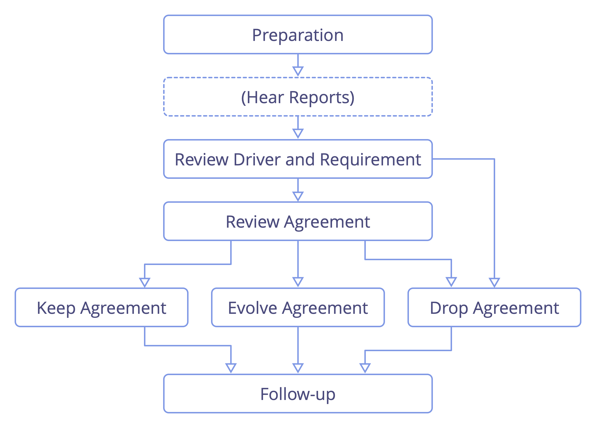
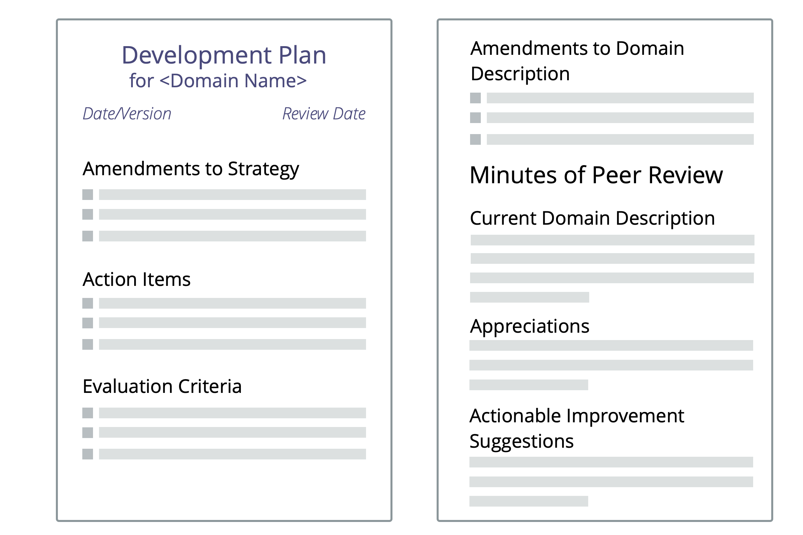
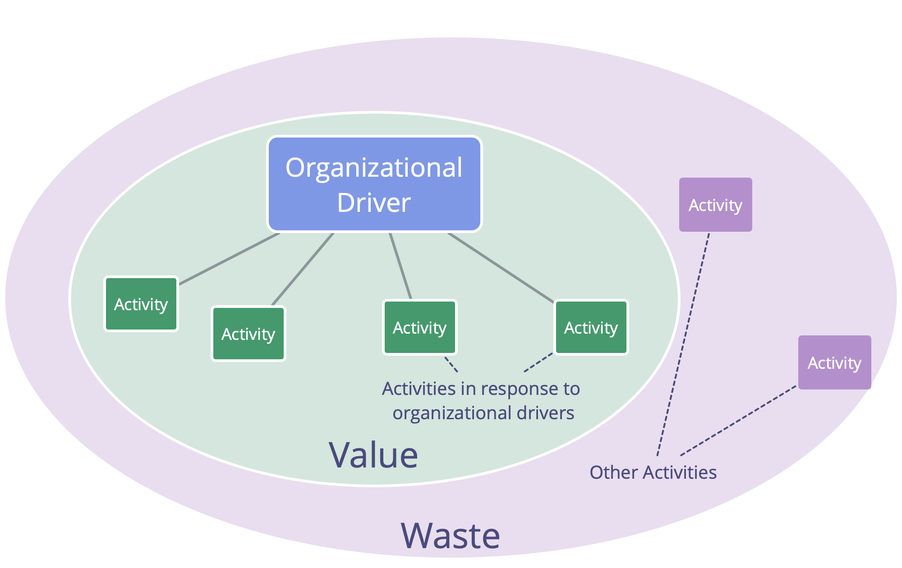

## Introduction

### What is Sociocracy 3.0?

Sociocracy 3.0 — a.k.a. "S3" — is <dfn data-info="Social Technology: Social technology is any process, technique, method, skill or any other approach that people can use to influence social systems — organizations, societies, communities etc. — to support achieving shared objectives and guide meaningful interaction and exchange.">social technology</dfn> for evolving agile and resilient organizations at any size, from small start-ups to large international networks and multi-agency collaboration.

Inside this practical guide you'll discover a comprehensive collection of tried and tested **concepts, principles and practices for improving performance, engagement and wellbeing** in organizations.

Since its launch in 2015, S3 patterns have been helping people across a diverse range of organizational contexts to get the best out of collaboration. From start-ups to small and medium businesses, large international organizations, investor-funded and nonprofit organizations, families and communities.

Using S3 can **help you to achieve your objectives** and successfully navigate complexity. You can make changes one step at a time, **without the need for sudden radical reorganization** or planning a long-term change initiative:

-   Simply start with identifying your areas of greatest need and select one or more practices or guidelines that help.
-   Proceed at your own pace, and develop  your skills and competences as you go.

**Regardless of your position in the organization**, you'll find many proven ideas that are relevant and helpful for you.

**Sociocracy 3.0 is free**, and licensed under a Creative Commons Free Culture License.

### How does Sociocracy 3.0 help?

S3 is a transformational technology for both individuals and the whole organization that will help you figure out how to meet your organization's biggest challenges, take advantage of the opportunities you face and resolve the most persistent problems.

Sociocracy 3.0 is designed to be flexible and supports experimentation and learning. You can take whatever you need, adapt things to suit your context and enrich your existing approach.

S3 integrates core concepts and practices found in agile methodologies, lean management, Kanban (and KMM), Design Thinking, Teal Organizations and the family of sociocracy-based governance methods (SCM/Dynamic Governance, Holacracy® etc.). It's complimentary and compatible with any agile or lean framework, including but not limited to Scrum and its various scaling frameworks.

**Inside this practical guide book you'll discover:**

-   Useful concepts that will help you **make more sense of your organization** and communicate effectively about where change is needed.
-   An **organic, iterative approach to change** that meets people where they are and helps them move forward at their own pace and according to their unique context and needs.
-   **Seven core principles** of agile and sociocratic collaboration
-   A coherent collection of **70+ practices and guidelines** to help you navigate complexity, and improve collaboration:
    -   **Simple, facilitated formats** that support teams in drawing on the collective intelligence of the group and incrementally processing available information into continuous improvement of work processes, products, services and skills.
    -   **Group-practices** to help organizations make the best use of talent they already have, through **people supporting each other** in building skills, accountability and engagement.
    -   Simple **tools for clarifying who does what**, freeing people up to decide and act for themselves as much as possible, within clearly defined constraints that enable experimentation and development.
    -   Patterns for **growing organizational structure beyond hierarchies** into flexible, decentralized networks where the flow of information and influence directly supports the creation of value.
-   A **glossary** with explanations for all the terms you might be unfamiliar with.

This practical guide to Sociocracy 3.0 is written and published by the three co-developers of Sociocracy 3.0.

True to the mindset behind S3, this book will always be a work in progress that grows and changes as we learn from people who are experimenting with S3 in organizations around the world. Since we started out 5 years ago, we have released several updates per year and we'll continue to do so in the years to come.

Even though several sections in this book are brief and may still be rough around the edges, the content and explanations have been sufficient for many people to get started with S3 and achieve positive change in their organizations. We hope you'll find it useful too.

### Influences and History of Sociocracy 3.0

The literal meaning of the term **sociocracy** is "rule of the companions": _socio_ — from Latin _socius_ — means "companion", or "friend", and the suffix _-cracy_ — from Ancient Greek κράτος (krátos) — means "power", or "rule".

The word sociocracy can be traced back to 1851, when **Auguste Comte** suggested applying a scientific approach to society: states would be governed by a body of scientists who are experts on society (which he termed "sociologists"). In his opinion, this future, although not yet achievable, would be inevitable.

A few decades later, **Lester Frank Ward**, used the word 'sociocracy' to describe the rule of people with relations with each other. Instead of having sociologists at the center, he wanted to give more power and responsibility to the individual, he imagined sociologists in a role as researchers and consultant.

In 1926, the Dutch reformist educator and Quaker **Kees Boeke**, established a residential school based on the principle of consent. Staff and students were treated as equal participants in the governance of the school, all decisions needed to be acceptable to everyone. He built this version of sociocracy on Quaker principles and practices, and described sociocracy as an evolution of democracy in his 1945 essay "Democracy as it might be".

**Gerard Endenburg**, also a Quaker and a student in Boeke's school, wanted to apply sociocracy in his family's business, Endenburg Elektrotechniek. He created and evolved the _Sociocratic Circle Organisation Method (SCM)_ (later becoming the "Sociocratic Method"), integrating Boeke's form of sociocracy with engineering and cybernetics. In 1978 Endenburg founded the Sociocratisch Centrum in Utrecht (which is now the Sociocratic Center in Rotterdam) as a means to promote sociocracy in and beyond the Netherlands. Since 1994 organizations in the Netherlands using SCM are exempt from the legal requirement to have a worker's council.

During the late 1990s and early 2000s, several non-Dutch speaking people came across sociocracy, but it wasn't until 2007 when **Sharon Villines and John Buck** launched their book, "We the People", that sociocracy became widely accessible to the English speaking world, and from there has began to migrate into several other languages.

Sociocracy has proven to be effective for many organizations and communities around the world, but it has yet to become viral.

In 2014 **James Priest and Bernhard Bockelbrink** came together to co-create a body of Creative Commons licensed learning resources, synthesizing ideas from Sociocracy, Agile and Lean. They discovered that organizations of all sizes need a flexible menu of practices and structures – appropriate for their specific context – that enable the evolution of a more sociocratic and agile approach to achieve greater effectiveness, coherence, fulfillment and wellbeing. The first version of **Sociocracy 3.0.** was launched in March 2015.

**Liliana David** joined the team soon after. Together they regularly collaborate to make S3 available and applicable to as many organizations as possible, and provide resources under a **Creative Commons Free Culture License** for people who want to learn, apply and tell others about Sociocracy_3.0.

#### The Sociocracy 3.0 Movement

As interest in Sociocracy 3.0 grows there is a fast growing community of people from a variety of backgrounds — pioneering consultants, coaches, learning facilitators, and people applying S3 into their various contexts — who share appreciation for the transformational potential of Sociocracy 3.0 to help organizations and their members thrive. Many kindly dedicate some of their time to experimenting with and sharing about S3, and who collaborate to learn from one another and document experiences to inform the ongoing development and evolution of the framework and its various applications.

### Why "3.0"?

Sociocracy as a form of governance has been referred to since 1851. Subsequently it has been developed and adapted by many different people and organizations, including Gerard Endenburg, The Sociocracy Group (TSG) and Brian Robertson (HolacracyOne).

Yet, outside the Netherlands sociocracy has until recently remained largely unknown.

We love sociocracy because we see organizations and their members thrive when they use elements of it to enrich or transform what they currently do.

We also love agile, lean, Kanban, the Core Protocols, NVC, and many other ideas too. We believe that the world will be a better place as more organizations learn to pull from this cornucopia of awesome practices that are emerging into the world today, and learn to synthesize them with what they already know.

Therefore we decided to devote some of our time to develop and evolve Sociocracy, integrating it with many of these other potent ideas, to make it available and applicable to as many organizations as possible.

To this end, we recognize the value of a strong identity, a radically different way of distribution, and of adapting the *Sociocratic Circle Organization Method* to improve its applicability.

#### The Name

The name "*Sociocracy 3.0*" demonstrates both respect to the lineage and a significant step forward.

It also helps avoid the perception of us misrepresenting the *Sociocratic Circle Organization Method* (SCM) as promoted by The Sociocracy Group.

#### The New Model of Distribution

*Sociocracy 3.0* employs a non-centralized model for distribution. This is a paradigm shift in the way sociocracy is brought to people and organizations, and one that many people can relate to.

We support "viral" distribution through two key strategies:

* **Sociocracy 3.0 is open:** We want to encourage growth of a vibrant ecosystem of applications and flavors of sociocracy, where people share and discuss their insights and the adaptations they are making for their specific context. To this end Sociocracy 3.0 puts emphasis on communicating the underlying principles and explicitly invites the creativity of everyone to remix, extend and adapt things to suit their needs.
* **Sociocracy 3.0 is free:** To eliminate the barrier of entry for people and organizations we provide free resources under a *Creative Commons Free Culture License* to learn, practice and teach *Sociocracy 3.0*. Everyone can use our resources without our explicit permission, even in a commercial context, or as a basis for building their own resources, as long as they share their new resources under the same license. We expect and support other organizations, consultants, coaches, learning facilitators and trainers to follow our example and release their resources too.

#### The Evolution of the Sociocratic Circle Organization Method

Maybe we need to make this explicit: Sociocracy 3.0 is not targeted specifically at the existing community of people exploring the *Sociocratic Circle Organization Method*, or at The Sociocracy Group (TSG). The *Sociocratic Circle Organization Method* (SCM) is already well developed and many people appear to be mostly happy with it.

Yet from our direct experience, even for those organizations that have heard about sociocracy, there are many obstacles to actually become invested. With *Sociocracy 3.0* we actively work on addressing and eliminating what stands in the way.

##### Reducing Risk and Resistance

*Sociocracy 3.0* meets organizations where they are and takes them on a journey of continuous improvement. There's no radical change or reorganization. *Sociocracy 3.0* provides a collection of independent and principle-based patterns that an organization can pull in one by one to become more effective. All patterns relate to a set of core principles, so they can easily be adapted to context.

##### Shifting Focus From Aim (or Purpose) to Need

*Sociocracy 3.0* moves primary focus from vision, mission, aims or purpose, towards the source of motivation, and aligns the organization towards discovering and addressing what it needs. Organizations which are already need-driven, value driven or customer-centric, find this immediately accessible.

##### Condensed to the Essentials

When looking at the norms, the *Sociocratic Circle Organization Method* may look big and scary. By focusing on the essentials only, *Sociocracy 3.0* offers a lightweight framework to adapt and build on as necessary.

This doesn't mean to say it's all easy: choosing to pull in *Sociocracy 3.0's* patterns requires an investment in learning and un-learning. This is why it's important to only pull in what you need, because there's no point to changing things if what you are doing is already good enough.

##### Integration With Agile and Lean Thinking

The *Sociocratic Circle Organization Method* is an "empty" method when it comes to operations and creating a culture of close collaboration. Many organizations already implement or show preference for lean and agile thinking for operations and collaboration. We believe this is a great idea, so *Sociocracy 3.0* is designed for easy adoption into lean and agile organizations.

##### A New Way to Evolve Organizational Structure

The organizational structure according to the *Sociocratic Circle Organization Method* is modeled on a hierarchy of domains. We see an increasing emergence of collaborative multi-stakeholder environments and the need for a wider variety of patterns for organizational structure.
Evolution of organizational structure happens naturally when the flow of information and influence in an organization is incrementally aligned to the flow of value. *Sociocracy 3.0* provides a variety of structural patterns that can be combined to evolve structure as required and in a flexible way.

### Patterns and the Seven Principles

#### Patterns

S3 offers a pattern-based approach to organizational change.

A **pattern** is a process, practice or guideline that serves as a template for successfully responding to a specific kind of challenge or opportunity. S3 patterns are discovered through observing people working together in organizations to solve problems and respond to opportunities they face. When you find that your habitual ways of doing things fail to bring about the outcomes you expected or hope for, you can look to S3 for patterns that might help.

Patterns are modular and adaptable, can be used independently, and are mutually reinforcing, complementing one another when used in combination. S3 patterns can be evolved and adapted to address your specific needs.

In this guide, the patterns are grouped by topic into ten categories to help you more easily identify those that are useful to you:

-   Co-Creation And Evolution
-   Peer Development
-   Enablers Of Collaboration
-   Building Organizations
-   Bringing In S3
-   Defining Agreements
-   Focused Interactions
-   Meeting Practices
-   Organizing Work
-   Organizational Structure

By providing a menu of patterns to choose from according to need, S3 encourages an organic, **iterative approach to change without a huge upfront investment**. It meets people where they are and helps them move forward pulling in patterns at their own pace and according to their unique context.

#### The Seven Principles

Sociocracy 3.0 is built on seven foundational principles which enable sococratic and agile collaboration. Since the seven principles are reflected in all of the patterns, understanding these principles is helpful for adopting and paramount to adapting Sociocracy 3.0 patterns.

Practicing Sociocracy 3.0 helps people appreciate the essential value that these core principles bring – both to individuals and to organizations – and supports their integration into organizational culture.

**The Principle of Effectiveness:** *Devote time only to what brings you closer toward achieving your objectives.*

**The Principle of Consent:** *Raise, seek out and resolve objections to decisions and actions.*

**The Principle of Empiricism:** *Test all assumptions you rely on, through experiments and continuous revision.*

**The Principle of Continuous Improvement:** *Change incrementally to accommodate steady empirical learning.*

**The Principle of Equivalence:** *Involve people in making and evolving decisions that affect them.*

**The Principle of Transparency:** *Record all information that is valuable for the organization, and make it accessible to everyone, unless there is a reason for confidentiality.*

**The Principle of Accountability:** *Respond when something is needed, do what you agreed to do, and take ownership for the course of the organization.*

### Key Concepts for Making Sense of Organizations

In this section you’ll learn about the following key concepts:

- Driver
- Domain
- Agreement
- Objection
- Governance and Operations

You will also discover how these concepts relate to value (and waste), delegation (and accountability), self-organization, self-governance and semi-autonomy.

When people understand these concepts, it gives them a common language for describing clearly what’s going on in the organization. This helps to increase shared understanding and enables constructive dialogue about what needs to be done.

For any terms you don’t understand, check out the glossary at the end.

#### Drivers

_A **driver** is a person’s or a group's motive for responding to a specific situation._

Drivers:

-   can be used to derive goals, objectives, aims, mission, vision, purpose
-   can change over time

##### Drivers, Value and Waste

_**Value** is the importance, worth or usefulness of something in relation to a driver._

_**Waste** is anything unnecessary for — or standing in the way of — a (more) effective response to a driver._

By adopting the concept of value and waste, many practices and ideas from **lean production** and **lean software development** can be utilized by organizations pulling in S3 patterns:

-   value stream mapping
-   various strategies for eliminating waste
-   the Kanban Method

#### Domains

_A **domain** is a distinct area of influence, activity and decision making within an organization._

To make better use of their limited time, energy, and resources, people in organizations distribute work between them by creating roles or forming teams, units, or departments. In the process they are explicitly or implicitly defining domains - distinct areas of responsibility and autonomy. All domains are within the overall domain of an organization and may overlap and/or be fully contained within other domains.

Any role or team's purpose is to contribute towards the overall purpose of the organization by taking care of a specific organizational need. Inadequately defined domains typically lead to stakeholders having different assumptions about areas of responsibility and autonomy. As a consequence, both collaboration and distribution of work suffers because of missed dependencies, double work, or work not done at all.

_Clarifying domains_ makes the contract between the _delegator_ (who delegate responsibility for a domain) and the _delegatee(s)_ (to whom the domain is delegated) explicit, which enables everyone to learn about what works and what doesn't, and to understand who is responsible for what. A clear domain description with a reasonable amount of detail is a necessary prerequisite for people to successfully evaluate and continuously improve their work.

##### Regularly evaluate and evolve domains

People's understanding of the organization is limited and the environment is always changing. Therefore it is essential that delegator, delegatee(s) and other relevant stakeholders regularly take the time to evaluate and evolve both the design of the domain and how people account for it as their understanding of the domain deepens. 

People might do a great job of accounting for a domain in the way it's designed, but the design of the domain might be primitive or flawed. On the other hand, even if the design of a domain is poor in the first iteration, through this process it will improve over time.

##### Delegating Responsibility for Domains

_Delegation is the grant of authority by one party (the _delegator_) to another (the _delegatee_) to account for a domain (i.e. to do certain things and/or to make certain decisions),for which the delegator maintains overall accountability._

Responsibility for domains is delegated to groups or individuals, who then act within its defined constraints on their autonomy and influence.

When a domain is delegated to a group of people, they become a <dfn data-info="Team: A group of people collaborating toward a shared driver (or objective). Typically a team is part of an organization, or it is formed as a collaboration of several organizations.">team</dfn>, when it's delegated to an individual, they become a <dfn data-info="Role Keeper: An individual taking responsibility for a role.">role keeper</dfn>.

The <dfn data-info="Delegatee: An individual or group accepting responsibility for a domain delegated to them, becoming a role keeper or a team.">delegatee(s)</dfn> may do whatever they think will help them achieve their purpose, unless it is outside the domain of the organization, explicitly forbidden, they violate somebody else's (explicit) domain, or impede other people's contribution to the organization in some other way. 

**Note:** _Things that are forbidden include explicit constraints laid out in the domain description, any other agreements the delegatee(s) need to keep, and legal and regulatory requirements._

The <dfn data-info="Delegator: An individual or group delegating responsibility for a domain to other(s).">delegator</dfn> still retains overall accountability for that domain, allocates **resources** and often defines:

-   the **organizational need** the domain is designed to respond to
-   **key responsibilities** (key deliverables, any critical risks to manage, other essential work and decision making being delegated)
-   **constraints to the autonomy and influence** of the delegatee(s), usually related to the organization itself (dependencies, involvement of the delegator, reporting etc.)

##### Drivers and Domains

It's also possible to understand a domain in relation to organizational drivers:

-   the domain's **primary driver** - the main driver the delegatee(s) respond to
-  the set of subdrivers the organization may benefit from addressing when responding to the domain's primary driver, which include:
    -   **key responsibilities** (any driver following directly from the domain's primary driver)
-  **dependencies** and **external constraints** (drivers relating to other domains or to the environment beyond the organization) that constrain the delegatees' autonomy

#### Objections

_An **objection** is an argument relating to a (proposed) agreement or activity that reveals unintended consequences you’d rather avoid, or that demonstrates worthwhile ways to improve._

Objections reveal information about (potential) **unintended consequences**, or about **worthwhile ways to improve**.

Be aware that withholding objections can harm the ability of individuals, teams or the whole organization to achieve their objectives.

It’s the responsibility of each individual in an organization to raise potential objections to proposals, decisions, existing <dfn data-info="Agreement: An agreed upon guideline, process, protocol or policy designed to guide the flow of value.">agreements</dfn> or activities.

Those accountable for an activity or (proposed) agreement in question, are responsible for *considering arguments and addressing objections* that are raised, when doing so will help to meet the organization’s objectives.

When seeking out potential objections, consider:

- why the <dfn data-info="Intended Outcome: The expected result of an agreement, action, project or strategy.">intended outcome</dfn> would not be (fully) achieved: **effectiveness**
- why it would be wasteful to proceed as proposed (or previously agreed): **efficiency**
- the negative consequences something would have elsewhere (in the same <dfn data-info="Domain: A distinct area of influence, activity and decision making within an organization.">domain</dfn>, in the wider organization, or beyond): **side-effects**

The information revealed by objections can be used to improve:

-   current and planned activity
-   how people execute on decisions
-   existing agreements
-   proposals
-   shared understanding of drivers

Create a culture where people feel comfortable to raise *potential* objections at any time, so that they can relax into making decisions that are *good enough for now and safe enough to try*. This encourages developing a preference for trying things out, instead of attempting to anticipate and account for all possibilities in advance.

Harness a diversity of perspectives and be open to challenge your own, to discover when and what to change, and enjoy iterating more rapidly, running experiments and learning from the outcomes as you proceed.

##### Concerns

**Not all arguments raised are objections. Distinguish between objections, which always reveal useful information, and other arguments that are based only on  assumptions, or a personal preference or opinion.**

_A **concern** is an assumption – or opinion – that doing something (even in the absence of objections) might stand in the way of (more) effective response to an organizational driver._

In _Consent Decision Making_, concerns can inform ways to further evolve agreements (including evaluation criteria and frequency of evaluation). Bring up concerns if you think it’s valuable to consider them, and at least record them along with the agreement, and monitor outcomes over time.

If in doubt about whether you have an objection or a concern, be proactive and check with others to see what they think too. (see _Test Arguments Qualify as Objections_).

#### Agreements

_An **agreement** is an agreed upon guideline, process, protocol or policy designed to guide the flow of value._

Shared guidelines about why, how and when to act, and what is specifically required, enable effective collaboration.

Agreements are created in response to <dfn data-info="Organizational Driver: A driver is a person’s or a group's motive for responding to a specific situation. A driver is considered an **organizational driver** if responding to it would help the organization generate value, eliminate waste or avoid unintended consequences.">organizational drivers</dfn>, are **regularly reviewed** and evolved as necessary.

**Overall accountability** for an agreement lies with the people that make them.

An agreement can include **delegation of specific responsibilities** to individuals or groups.

#### Governance and Operations

S3 seeks to enable productivity by freeing people up to do and decide as much as possible for themselves, while ensuring coherence in collaboration for a successful and effective organization.

Greater autonomy of individuals and teams necessitates clear agreements (i.e. guidelines and constraints) that enable smooth collaboration between those teams and individuals, and that support achievement of both long-term and short-term objectives. Regular iterative reviews and incremental evolution of agreements ensure they remain fit for purpose.

While a decision of short-term consequence can easily be amended on the spot, making more consequential agreements that constrain people's behavior and activity, often benefits from a more participatory and deliberate _decision making process_.

Such agreements need to be documented, both to remember them and to support effective _review_, and to be communicated to people affected (who are ideally also _involved in the creation and evolution_ of those agreements).

Therefore it's valuable to distinguish between two categories of activities in an organization, one of which we refer to as governance, and the other as operations:

_**Governance** in an organization (or a domain within it) is the process of setting objectives and making and evolving decisions that guide people towards achieving those objectives._

_**Operations** is doing the work and organizing day-to-day activities within the constraints defined through governance._

For each domain in an organization there is a _governing body_: people with a mandate to make and evolve agreements which govern how the people doing the work in that domain create value.

There are many ways to distribute work and governance. Sometimes the governing body is a single person, e.g. in the case of a team lead, and sometimes it's a group of people, e.g. in a circle where all circle members share responsibility for governance within the constraints of the domain.

**Governance decisions** set constraints on activity and guide future decisions.

This includes:

-   defining domains
-   delegating influence to people
-   allocating resources and capacity
-   specifying deliverables and prioritizing delivery.

Governance decisions can be made at any time and at any place, not just in a specific kind of meeting, although a _regular meeting for making and evolving agreements_ is often a good idea.

##### Related Concepts

**Self-Governance:** People governing themselves within the constraints of a domain.

**Semi-Autonomy:** The autonomy of people to create value within their domain, further limited by their own governance decisions, and objections (including those of the delegator and of representatives).

**Self-Organization:** Any activity or process through which people organize their day-to-day work without the influence of an external agent, and within constraints defined through governance. In any organization or team, self-organization and external influence co-exist.

Depending on the constraints set by the delegator, teams have more or less license to conduct governance and decide how they organize their operations, and are therefore more or less self-governing and self-organizing.

## The Patterns

### Co-Creation and Evolution

#### Respond to Organizational Drivers

**Clarify organizational drivers (i.e. what's happening and what's needed in relation to the organization), and respond as required.**

Responses to <dfn data-info="Organizational Driver: A driver is a person’s or a group's motive for responding to a specific situation. A driver is considered an **organizational driver** if responding to it would help the organization generate value, eliminate waste or avoid unintended consequences.">organizational drivers</dfn> include:

- direct action (<dfn data-info="Operations: Doing the work and organizing day-to-day activities within the constraints defined through governance.">operations</dfn>)
- organizing how work will be done
- making governance decisions

The response to an organizational driver is typically treated as an experiment that is evaluated and evolved over time.

##### Qualify Drivers as Organizational Drivers

A driver is a person’s or a group's motive for responding to a specific situation. A driver is considered an **organizational driver** if responding to it would help the organization generate value, eliminate waste or avoid unintended consequences.

A simple way to qualify whether or not a driver falls within an organization's <dfn data-info="Domain: A distinct area of influence, activity and decision making within an organization.">domain</dfn> is by checking:

_Would it help the organization if we respond to this driver? Or would it lead to unintended consequences if we don't?_

#### Navigate Via Tension

**Pay attention to tension you experience in relation to the organization, investigate the cause and pass on any organizational drivers you discover to the people accountable for the appropriate domain.**

**Challenges and opportunities** for an organization are revealed by people bringing awareness to the reasons why they experience tension.

**Note:** In this context, a _tension_ is a personal experience: a symptom of dissonance between an individual's perception of a situation, and their expectations (or preferences).

To **discover drivers**, investigate what stimulates tension, and describe what's happening and what's needed. Sometimes an inquiry reveals misconceptions and the tension goes away.

#### Describe Organizational Drivers

**Describe organizational drivers to understand, communicate and remember them.**

Describing <dfn data-info="Organizational Driver: A driver is a person’s or a group's motive for responding to a specific situation. A driver is considered an **organizational driver** if responding to it would help the organization generate value, eliminate waste or avoid unintended consequences.">drivers</dfn> may be done by a group or by an individual. Depending on their perspective, they may decide to explain a driver as a **problem** to solve or an **opportunity** to leverage.

A simple way to describe a driver is by explaining:

-   **What's happening...:**
    -   the **current situation**
    -   the **effect** of this situation on the organization
-   ...and **what's needed:**
    -   the **need** of the organization in relation to this situation
    -   the **impact** of attending to that need

Create a brief but comprehensive summary containing just enough information to clearly communicate the need for an action or a decision.

Aim for one or two sentences, so that the information is easy to remember and process.

Besides the summary, more details about the driver may be kept in the logbook.

##### Example:

> _"The kitchen is in disorder: there are no clean cups, the sink is full of dishes and it's not possible to quickly grab a coffee and get right back to work. We need the kitchen in a usable state so we can stay focused on our work."_

##### 1. Current Situation

> _"The kitchen is in disorder: there are no clean cups, the sink is full of dishes..."_

Describe the current situation:

- Briefly capture the essentials of what is happening, and, if necessary, the context in which it occurs.
- Be objective - describe observations and avoid evaluation.

##### 2. Effect

> _"...it's not possible to quickly grab a coffee and get right back to work."_

Explain the effect of this situation on the organization:

- Clarify **why** the situation needs attention: how does it affect the organization?
- Be explicit about whether the effects are current or anticipated.
- Explain challenges, losses, opportunities or gains.

##### 3. Need

> _"We need the kitchen in a usable state..."_

Explain the <dfn data-info="Need: The lack of something wanted or deemed necessary (a requirement).">need</dfn> of the organization in relation to this situation:

- A **need of an organization** is anything a team (or individual) requires to effectively account for a <dfn data-info="Domain: A distinct area of influence, activity and decision making within an organization.">domain</dfn>.
- Be specific on whose need it is ("we need", "they need", "I need").
- If there's disagreement about the need, it helps to zoom out from specific solutions and focus on what the organization is lacking in this situation.

##### 4. Impact

> _"...so we can stay focused on our work"._

Describe the impact of attending to that need:

- Explain the <dfn data-info="Intended Outcome: The expected result of an agreement, action, project or strategy.">intended outcome</dfn>, potential benefits or opportunities.
- The impact may be obvious or implicit, especially when the effects of the current situation are already described.

##### Review Drivers

Make sure to review drivers on a regular basis, to deepen you understanding of what's happening and needed.

Helpful questions for a review include:

-   Is the description of the situation (still) correct?
-   Do we still associate the same needs with the situation?
-   Is the driver still within our domain?
-   Is the driver still relevant?

#### Consent Decision Making

**A (facilitated) group process for decision making: invite objections, and consider information and knowledge revealed to further evolve proposals or existing agreements.**

Proposals become <dfn data-info="Agreement: An agreed upon guideline, process, protocol or policy designed to guide the flow of value.">agreements</dfn> when they are considered _good enough for now and safe enough to try_ until the next review.

Unresolved <dfn data-info="Objection: An argument relating to a (proposed) agreement or activity that reveals unintended consequences you’d rather avoid, or that demonstrates worthwhile ways to improve.">objections</dfn> prevent proposals from becoming agreements.

Withholding objections can harm the objectives of a team or organization.

##### Implicit Contract of Consent

1.   In the absence of objections to an agreement, I intend to follow through on the agreement to the best of my ability.
2.   I agree to share objections as I become aware of them.

#### Test Arguments Qualify as Objections

**Utilize your limited time and resources wisely by testing if arguments qualify as objections and only acting on those that do.**

When someone raises an argument for changing something, check that the argument reveals how leaving things unchanged will – or could — lead to consequences you want to avoid, or that it informs you of a worthwhile way to improve how to go about achieving your objectives.

Explore and refine each argument as necessary to identify any misconceptions or misunderstanding, and to eliminate aspects of the argument that are based merely on assumptions, or a personal preference or opinion. If you establish that what remains of the argument qualifies as an objection, then go on to _resolve the objection_.

To discover if an argument qualifies as an objection in a group context, a facilitator can invite reflection by asking:

_"Do you think this argument qualifies as an objection?"_

If no one disagrees, treat the argument as an objection. In case of disagreement, invite a dialogue to discover if an objection is revealed by the argument.

##### Understanding Objections

Some helpful questions:

-   How does the argument relate to this specific proposal or agreement?
-   Does the argument reveal how a (proposed or current) **activity or agreement**:
    -   harms response to any organizational driver?
    -   can be improved right now?
    -   prevents or diminishes someone's contribution towards responding to a driver?
    -   is in conflict with the organization's values?
    -   is considered not 'safe enough' to try?

#### Resolve Objections

**Resolve objections one at a time by using the information they contain to make and evolve amendments.**

Choose an option for resolving an <dfn data-info="Objection: An argument relating to a (proposed) agreement or activity that reveals unintended consequences you’d rather avoid, or that demonstrates worthwhile ways to improve.">objection</dfn> that looks most promising, and if that fails, simply pick another one. Each attempt will help you understand more of the information the objection contains, and bring the group closer to proposing an amendment that resolves the objection.

Often, asking the person who brings the objection to propose an amendment, is a productive place to start.

Typically it's most effective to **take one objection at a time**, resolve all objections to a proposed amendment, and then continue with the next main objection.

#### Evaluate And Evolve Agreements

**Continuously evolve the body of agreements, and eliminate waste.**

Regular review of agreements is an essential practice for a learning organization:

-   adapt agreements to suit changing context
-   integrate learning to make them more effective

Ensure all <dfn data-info="Agreement: An agreed upon guideline, process, protocol or policy designed to guide the flow of value.">agreements</dfn> have an appropriate review date.

Evaluating agreements can be as simple as checking that an agreement is still relevant, and there is no objection to keeping it as it is.

Agreements are often reviewed in _Governance Meetings_, however sometimes it's more effective to schedule a dedicated session.

Adjust review frequency as necessary, and review early if required.

Elements of this pattern can also be used by individuals to evaluate decisions they make.

##### Short Format

-   _How has this agreement helped us?_
-   _Is there any reason to drop this agreement?_
-   _How can this agreement be improved?_
-   Agree on a next review date.

##### Long Format

Preparation:

-   Schedule the review.
-   Ensure all necessary information is available.

Follow-up:

-   Agree on the next review date.
-   Document decisions and tasks, and share with relevant people.
-   Consider effects on any related agreements.

#### Those Affected Decide

**Involve people in making decisions that affect them, to maintain equivalence and accountability, and to increase the amount of information available on the subject.**

For larger groups:

-   facilitate a process in several stages and create smaller groups who select delegates
-   use an online tool and conduct an asynchronous, _timeboxed_ and staged process

Consider including those affected in reviewing and evolving decisions, too.

#### Co-Create Proposals

**Bring people together to co-create proposals in response to organizational drivers: tap collective intelligence, build sense of ownership and increase engagement and accountability.**

There are many ways to co-create proposals. They typically follow a similar pattern:

1. Agree on the <dfn data-info="Organizational Driver: A driver is a person’s or a group's motive for responding to a specific situation. A driver is considered an **organizational driver** if responding to it would help the organization generate value, eliminate waste or avoid unintended consequences.">driver</dfn> (or problem / opportunity / need)
2. Explore the topic and understand constraints
3. Generate ideas
4. Design a proposal (often done by a smaller group)

One way to co-create proposals is to use S3's _Proposal Forming_ pattern.

For inspiration for steps 2 and 3, look to classic group facilitation techniques or design thinking activities.

Besides in a face-to-face workshop, you can adapt this process for online meetings. You can even use it asynchronously (and over an extended period of time) to include many people.

#### Proposal Forming

**A (facilitated) group process for co-creating a response to a driver.**

-   draws on the collective intelligence and diversity of perspective within a group
-   involves people in co-creating agreements
-   fosters accountability and sense of ownership

_Proposal Forming_ may also be used by an individual.

##### Proposal Forming Steps

**Consent to driver:** Briefly present the <dfn data-info="Organizational Driver: A driver is a person’s or a group's motive for responding to a specific situation. A driver is considered an **organizational driver** if responding to it would help the organization generate value, eliminate waste or avoid unintended consequences.">driver</dfn>. _Is this driver relevant for us to respond to? Are there any essential amendments to what has been presented?_

**Deepen shared understanding of driver:** invite essential questions to understand the driver in more detail.

**Collect considerations** phrased as questions relating to possible solutions. Questions either reveal constraints (information gathering questions) or possibilities (generative questions).

**Answer** any information gathering questions if possible.

**Prioritize** considerations.

**Gather ideas** as possible ingredients for a proposal.

**Design a proposal** for addressing the driver considering the creative ideas and information gathered so far. This is usually done by a smaller group of "tuners".

##### Choosing Tuners

Consider:

-   who should be there?
-   who wants to be there?
-   who else may have a valuable contribution to make?
-   consider expertise, outside view, and inspiration

Between two and three tuners is usually appropriate. Check for any objections to the proposed tuner(s).

#### Role Selection

**A group process for selecting a person for a role on the strength of the reason.**

Instead of simply assigning people for _roles_, or making a choice based only on majority, use the role selection process to:

- tap collective intelligence by hearing and deliberating on reasons for nominations
- increase ownership over the decision
- ensure support for the role keeper by those affected.

A prerequisite to the selection process is a _clear description_ of the role's <dfn data-info="Domain: A distinct area of influence, activity and decision making within an organization.">domain</dfn>.

##### Role Selection - Steps

1. **Present Role Description:** If possible, send out the role's domain description in advance.
2. **Record Nominations:** Participants write their nomination on a slip of paper. People can nominate themselves, another, or pass.
3. **Reasons for Nominations:** Each person shares who they have nominated and why.
4. **Information Gathering:** Participants share or request any information that might support the group in making an appropriate selection.
5. **Nomination Changes:** Check if anyone wants to change their nomination in light of reasons and information shared so far, and hear the reasons for each change.
6. **Propose a nominee** for the role: The facilitator guides the process to identify a suitable nominee on the strength of the reasons heard, e.g. by:
    -   proposing a nominee themselves or asking a group member
    -   inviting (some) nominees to agree who should be proposed
    -   inviting group dialogue to help reveal the strongest nominee
7. **Check for Objections:** Ask participants (including the proposed nominee) to simultaneously signal whether or not they have an <dfn data-info="Objection: An argument relating to a (proposed) agreement or activity that reveals unintended consequences you’d rather avoid, or that demonstrates worthwhile ways to improve.">objection</dfn>.
8. **Address and Resolve Objections,** beginning with any from the proposed nominee. _Objections may be resolved_ in many ways, including amending the role's domain description or by nominating someone else. When all objections are resolved, check with the (final) nominee again if they accept the role.
9. **Celebrate:** Acknowledge reaching agreement and thank the person who will now keep the role.

To avoid influencing others, abstain from expressing personal interest or opinions before a selection takes place.

Sometimes a role selection reveals a lack of capacity, relevant experience, qualities or skill. A group will then need to consider outside candidates, reconsider priorities or find an alternative way to account for the domain.

This pattern can also be used in any situation where there is a need to choose between a variety of options.

#### Driver Mapping

A workshop format to identify an effective response to a complex situation: organize start-ups, kick-off projects, tackle major impediments or opportunities, develop organizational structure to better enable the <dfn data-info="Flow of Value: Deliverables traveling through an organization towards customers or other stakeholders.">flow of value</dfn>.

A (small or large) group identifies and clusters <dfn data-info="Driver: A person’s or a group's motive for responding to a specific situation.">drivers</dfn>, to then progress quickly from concept to action in smaller and self-organizing teams.

### Peer Development

#### Ask For Help

**A simple protocol for learning, skill sharing, and building connections, with respect for people's agency.**

Ask someone, "_would you be willing to help me with ..._?" The person asked accepts or declines with a simple "_yes_" or "_no_".

-   if the request is declined, the person asking accepts the answer without negotiation or inquiry
-   if the request is unclear, inquire for more information
-   if you accept a request for help, support your peer in the best way you can

#### Peer Feedback

**Invite any member of your organization to give you some constructive feedback on your performance in a role or in a team, about your general participation and contribution, or about any other area you wish to develop.**

Before the invitation, consider who might be able and willing to provide the feedback you seek, and decide on an appropriate duration – 15 or 30 minutes is usually enough.

Schedule the session in advance, so that your peer can prepare for your meeting, and schedule some time for yourself after the session to decide how you will act on the feedback you received.

In the invitation, clarify the topic you want feedback on, and explain that you are looking for both **appreciations** and **actionable improvement suggestions**.

During the session itself, consider:

-   taking notes to ensure you can remember the details
-   repeating back, feedback you receive in your own words to check for the accuracy of your understanding
-   asking clarifying question to better understand feedback if the intended meaning is unclear for you 

Avoid discussing or judging the feedback you receive and remember to thank your peer for taking the time to give you their feedback. 

After the session, review your notes and decide for yourself what you will do with the feedback you received. It’s your choice if you want to share your decision with your peer.

#### Peer Review

**Support each other to learn and grow in the roles and teams you serve in.**

The role keeper — or team — leads the peer review by setting up the process, and by speaking first in each step.

Ensure you invite people with complementary perspectives to contribute to the review, and a _facilitator_.

For both appreciations and improvement suggestions, ensure you consider the following aspects:

-   The **value** the delegatee brought to the organization by accounting for the <dfn data-info="Domain: A distinct area of influence, activity and decision making within an organization.">domain</dfn>.
-   The role keeper’s or team’s **work processes**, and their **collaboration** with the <dfn data-info="Delegator: An individual or group delegating responsibility for a domain to other(s).">delegator</dfn> and with other relevant stakeholders, and – in the case of a team - with each other.
-   How well the **delegator** takes care of their responsibilities.
-   The **design of the domain** itself (and potentially the design of other related domains).
-   The role keeper’s or team’s **competencies and skills** in relation to the domain.
-   The **<dfn data-info="Strategy: A high level approach for how people will create value to successfully account for a domain.">strategy</dfn>** the role keeper or team follows to account for this domain.

#### Development Plan

**A plan for how to develop more effective ways of accounting for a domain, agreed between delegator and delegatee.**

The development plan may be created for a person in a role, or for a team (e.g. a department, _circle_ or _open domain_).

Development may happen in the form of refining the description of the _driver_ and the <dfn data-info="Domain: A distinct area of influence, activity and decision making within an organization.">domain</dfn>, making amendments to <dfn data-info="Strategy: A high level approach for how people will create value to successfully account for a domain.">strategy</dfn>, or new or updated agreements and specific actions to be taken, either within the domain of the delegator, or the domain of the delegatee.

A development plan (and any accompanying recommendations for changes to the descriptions of the <dfn data-info="Domain: A distinct area of influence, activity and decision making within an organization.">domain</dfn> and the <dfn data-info="Organizational Driver: A driver is a person’s or a group's motive for responding to a specific situation. A driver is considered an **organizational driver** if responding to it would help the organization generate value, eliminate waste or avoid unintended consequences.">driver</dfn>) requires consent from both the <dfn data-info="Delegatee: An individual or group accepting responsibility for a domain delegated to them, becoming a role keeper or a team.">delegatee</dfn> and the <dfn data-info="Delegator: An individual or group delegating responsibility for a domain to other(s).">delegator</dfn>.

### Enablers of Collaboration

#### Artful Participation

**Commit to doing your best to act and interact in ways that enable effective collaboration.**

_"Is my behavior in this moment the greatest contribution I can make to the effectiveness of this collaboration?"_

Participating artfully may include interrupting, objecting or breaking  <dfn data-info="Agreement: An agreed upon guideline, process, protocol or policy designed to guide the flow of value.">agreements</dfn>.

_Artful Participation_ is an **individual commitment** to:

-   actively **consider and follow-up on all agreements** made, in the best way possible, given the circumstances
-   **develop awareness and understanding** of individual and collective needs
-   **grow the necessary skills**
-   **support others** to participate artfully
-   bring impediments and improvement suggestions to the attention of others if necessary

##### Benefits Of Artful Participation

Artful participation:

- enables co-creation and evolution of agreements
- helps to grow stronger teams
- builds self-accountability, integrity and trust
- generates a culture of mutual support and close collaboration
- is more powerful when embraced by many

##### Artful Participation: Self-Assessment

-   How can I support myself and others to participate more artfully?
-   Where are my interactions with others unhelpful or ineffective?
-   Which agreements do I find hard to keep? What can I do to address this?
-   What skills can I develop, that would support me to participate more artfully?
-   What would artful participation mean in relation to:
    -   my daily activities?
    -   collaboration and interaction with others?
    -   the organization? ...our customers or clients?
    -   the wider environment?

#### Adopt The Seven Principles

**Align collaboration with the Seven Principles.**

Adopting the Seven Principles reduces the number of explicit agreements required, and guides adaptation of S3 patterns to suit the organization's context.

An organization's values need to embrace the Seven Principles.

#### Agree On Values

**Intentionally evolve the culture in your organization.**

_**Values** are valued principles that guide behavior. Values define scope for action and ethical constraints._

-   each member brings their own values to an organization based on personal experiences and beliefs
-   a team or organization may **choose to collectively adopt values** to guide their collaboration

Values offer guidance to determine appropriate action, even in the absence of explicit <dfn data-info="Agreement: An agreed upon guideline, process, protocol or policy designed to guide the flow of value.">agreements</dfn>.

Collectively adopting a set of values supports the effectiveness of an organization:

-   reduces potential for **misunderstanding**
-   helps to **align** decision making and action
-   **attracts new members, partners and customers** who are aligned with the organization

Chosen values are an agreement that benefits from **regular review**.

#### Governance Facilitator

**Select someone to facilitate governance meetings.**

A <dfn data-info="Governance: The process of setting objectives and making and evolving decisions that guide people towards achieving those objectives.">governance</dfn> facilitator:

-   ensures _governance meetings_ stay on track and are evaluated
-   is (usually) selected by a <dfn data-info="Team: A group of people collaborating toward a shared driver (or objective). Typically a team is part of an organization, or it is formed as a collaboration of several organizations.">team</dfn> from among it members (and for a specific term)
-   familiarizes themselves with the _Governance Backlog_
-   often invites others to facilitate some agenda items

As a governance facilitator, consider learning about and using the following patterns from S3 to handle governance effectively:

-   _Rounds_
-   _Proposal Forming_
-   _Consent Decision Making_
-   _Role Selection_
-   _Evaluate Meetings_
-   _Resolve Objections_
-   _Peer Review_

#### Breaking Agreements

**Break agreements when you are certain the benefit for the organization outweighs the cost of waiting to amend that agreement first, and take responsibility for any consequences.**

Breaking <dfn data-info="Agreement: An agreed upon guideline, process, protocol or policy designed to guide the flow of value.">agreements</dfn> is sometimes **necessary** but may come at a **cost** to the community.

Be accountable:

-   **clean up** disturbances
-   **follow up** as soon as possible with those affected
-   **change the agreement** instead of repeatedly breaking it

#### Contract For Successful Collaboration

**Support successful collaboration from the start and build trust between parties by co-creating mutually beneficial and legally robust contracts.**

A **contract** is a body of promises that two or more parties agree to make legally binding, i.e if those promises are violated, the injured party gains access to legal (or alternative) remedies.

Developing shared understanding about needs and expectations is essential for successful collaboration.

While negotiating and agreeing on a contract, model the culture of collaboration you want to achieve, and build a positive relationship with the other parties involved.

This pattern refers to contracts relating related to collaboration around any business transaction between an organization and other parties (e.g. employees, consultants, service providers, shareholders or customers). It is especially relevant for contracts that have a significant influence on the future of an organization or one of its partners, such as:

- employment contracts and contracts with external contractors or consultants in _support roles_ (including any agreement that results in a change of remuneration or working hours)
- contracts governing collaboration with customers, vendors or service providers
- shareholder agreements

**Note:** Many agreements about collaboration within an organization do not require dedicated contracts, as they are already governed by or subject to existing contracts.

##### Success criteria for contract negotiation

When negotiating a contract, ensure:

- shared understanding of the reason for the collaboration, as well as the intended outcome and important constraints
- all parties understand what is expected of them
- all parties affected by a contract are involved in creating the contract and enter it voluntarily
- expectations are realistic
- the agreement is beneficial to all parties
- everyone intends to keep to the agreement made

If for any reason one or more of these criteria cannot be fulfilled, it is probably wise to not proceed.

##### Co-creating the contract

The way a contract is negotiated can significantly contribute toward building trust between parties. Approach contracting from the point of view of making an agreement between partners, not adversaries: co-create the contract, tailor it to its specific context, and ensure it is legally robust.

- the contract should include all expectations of the parties involved, each explained with adequate detail
- use clear and simple language that all parties can understand, and be unambiguous about legal consequences
- if you need to use specific technical or legal terms a party might be unfamiliar with, explain them in a glossary that is part of the contract
- consult a lawyer who supports the culture you aspire to and is competent in the field if business you are negotiating

##### When Co-Creating a Contract:

- ensure all parties have a delegation that includes representation for all affected <dfn data-info="Domain: A distinct area of influence, activity and decision making within an organization.">domains</dfn> (e.g. not only sales, but also development / production / support, etc)
- explicitly describe the culture you want to develop, with consideration for common ground and any cultural differences between parties
- state the reasons for the proposed collaboration, and transparent about expectations and needs of all parties
- disclose all relevant information (if necessary under an NDA)
- agree first on terms of the relationship and expectations to all parties, and then consider how you can make them legally robust
- compile a list of specific laws and regulation the contract needs to comply to
- negotiate in several iterations, allowing time to consider implications and propose amendments
- keep minutes of each meeting to reduce the potential for misconceptions

##### Support The Full Lifecycle Of The Collaboration:

Any contract can be changed at any time, provided all signatories agree. However, it greatly reduces the potential for conflict later if you consider the full lifecycle of the collaboration in the contract:

- make provisions for successfully getting started by defining onboarding procedures
- have a probationary period, where all parties can try out the collaboration, and a clear protocol for how each party can terminate the contract during the probationary period
- define and build into the contract regular review meetings where signatories come together to share learning and decide how the contract might be amended to adapt to changing context
- include procedures for breach of contract
- consider making available alternative means for dispute resolution, e.g. mediation, conciliation or arbitration
- consider limiting the contract to a fixed term after which the contract expires and can be renewed if required

##### Culture

Every contract influences the culture of the collaboration it governs, even when it appears to only describe *what* needs to be delivered:

- intentionally create the culture of collaboration you want to see by including expectations on *how* things should be done
- align the contract to the organizational culture (of all parties) and to legal requirements
- build contracts that enable and encourage accountability

If you find that standard contracts in your industry are misaligned with the culture you want to create, build your own repository of templates for contracts and clauses and consider sharing it with others, so that you can leverage past experience when creating new contracts.

#### Transparent Salary

**Create a fair salary formula and make it transparent.**

Transparent salary (also referred to as "open salary") is the practice of determining each employee's compensation according to a set of rules — the _salary formula_ — instead of making compensation subject to individual negotiation between employer and employee. The salary formula — and often individual compensation as well — is transparent to all members of an organization, and sometimes to the public.

A transparent salary formula needs to suit an organization's context, and to be perceived as fair enough by all stakeholders.

Perception of fairness varies from person to person and according to context, so creating a salary formula requires developing a shared understanding of what is considered fair.

When deciding (or agreeing) on a salary formula for an organization or department, consider:

- what would be a suitable fixed subsistence guarantee
- how to calculate compensation according to need, investment, productivity, or merit
- how to distribute the organization's profit and cover for losses in line with expectations and needs of the various stakeholders

Decide how to handle remuneration for changing roles and _develop a strategy_ for how to transition towards new contracts and compensation agreements.

#### Support Role

**Apply the role pattern to external contractors.**

-   clarify and describe the <dfn data-info="Organizational Driver: A driver is a person’s or a group's motive for responding to a specific situation. A driver is considered an **organizational driver** if responding to it would help the organization generate value, eliminate waste or avoid unintended consequences.">driver</dfn> for the _role_
-   create a _domain description_
-   if valuable, implement a selection process
-   limit the term of the contract
-   build in regular _peer reviews_

External contractors consent to take on their role.

**See also:** _Contract For Successful Collaboration_

#### Bylaws

Secure S3 principles and patterns in your bylaws as needed to protect **legal integrity** and **organizational culture**

Consider:
   
-   consent and equivalence in decision making
-   selection process for leadership roles
-   organizational structure, <dfn data-info="Values: Valued principles that guide behavior. Not to be confused with "value" (singular) in the context of a driver.">values</dfn> and <dfn data-info="Principle: A basic idea or rule that guides behavior, or explains or controls how something happens or works.">principles</dfn>
-   influence of owners or shareholders
-   sharing gains and costs

### Building Organizations

#### Delegate Influence

**Distribute the power to influence, to enable people to decide and act for themselves within defined constraints.**

A <dfn data-info="Delegator: An individual or group delegating responsibility for a domain to other(s).">delegator</dfn> can support <dfn data-info="Delegatee: An individual or group accepting responsibility for a domain delegated to them, becoming a role keeper or a team.">delegatees</dfn> to deliver value by:

-   Clearly defining <dfn data-info="Domain: A distinct area of influence, activity and decision making within an organization.">domains</dfn> of autonomy and responsibility
-   Ensuring there are opportunities for learning and development
-   Providing support if required

Adjust constraints incrementally, considering capabilities, reliability and outcome.

Decentralize as much as possible, and retain as much influence as necessary.

#### Circle

_A **circle** is a self-governing and semi-autonomous team of equivalent people who collaborate to account for a domain._

A circle:

-   may be permanent or temporary
-   may be <dfn data-info="Self-Organization: Any activity or process through which people organize their day-to-day work without the influence of an external agent, and within constraints defined through governance. In any organization or team, self-organization and external influence co-exist.">self-organizing</dfn>
-   is accountable for its own development and its body of <dfn data-info="Agreement: An agreed upon guideline, process, protocol or policy designed to guide the flow of value.">agreements</dfn>

-   **semi-autonomous:**
    -   A circle's members act within the constraints of their <dfn data-info="Domain: A distinct area of influence, activity and decision making within an organization.">domain</dfn>.
    -   Each circle can create <dfn data-info="Value: The importance, worth or usefulness of something in relation to a driver. Also "a principle of some significance that guides behavior" (mostly used as plural, "values", or "organizational values").">value</dfn> autonomously.
-   **self-governing:**
    -   A circle's members continuously decide together what to do to account for their domain, and set constraints on how and when things will be done.
-  **equivalence of circle members:**
    -   All members of a circle are equally accountable for <dfn data-info="Governance: The process of setting objectives and making and evolving decisions that guide people towards achieving those objectives.">governance</dfn> of the circle's domain.

#### Role

**Delegate responsibility for a domain to individuals.**

A role is an area of responsibility (a <dfn data-info="Domain: A distinct area of influence, activity and decision making within an organization.">domain</dfn>) that is <dfn data-info="Delegation: The grant of authority by one party (the delegator) to another (the delegatee) to account for a domain (i.e. to do certain things and/or to make certain decisions), for which the delegator maintains overall accountability.">delegated</dfn> to an individual (the **role keeper**), who has autonomy to decide and act within the constraints of the role's domain.

The role keeper leads in creating a <dfn data-info="Strategy: A high level approach for how people will create value to successfully account for a domain.">strategy</dfn> for how they will account for their domain. They evolve their strategy in collaboration with the <dfn data-info="Delegator: An individual or group delegating responsibility for a domain to other(s).">delegator</dfn>.

A role is a simple way for an organization (or <dfn data-info="Team: A group of people collaborating toward a shared driver (or objective). Typically a team is part of an organization, or it is formed as a collaboration of several organizations.">team</dfn>) to delegate recurring tasks or a specific area of work and decision making to one of its members.

- people can take responsibility for more than one role
- instead of formally setting up a new team, it's sometimes simpler to just share one role between several people
- role keepers are selected by consent and for a limited term
- peers support one another to develop in the roles they keep

A role keeper may maintain a governance <dfn data-info="Backlog: A list of (often prioritized) uncompleted work items (deliverables), or drivers that need to be addressed.">backlog</dfn>, and a <dfn data-info="Logbook: A (digital) system to store all information relevant for running an organization.">logbook</dfn> to record and help them evolve their approach toward delivering <dfn data-info="Value: The importance, worth or usefulness of something in relation to a driver. Also "a principle of some significance that guides behavior" (mostly used as plural, "values", or "organizational values").">value</dfn>.

**Note:** In S3, guidelines, processes or protocols created by individuals in roles are treated as agreements.

#### Linking

**Enable the flow of information and influence between two teams.**

A team selects one of its members to represent their interests in the <dfn data-info="Governance: The process of setting objectives and making and evolving decisions that guide people towards achieving those objectives.">governance</dfn> decisions of another team.

#### Double Linking

**Enable the _two-way_ flow of information and influence between two teams.**

Two interdependent teams each select one of their members to represent their interests in the <dfn data-info="Governance: The process of setting objectives and making and evolving decisions that guide people towards achieving those objectives.">governance</dfn> decisions of the other team.

Double linking enables equivalence between two teams and can be used to draw out valuable information in hierarchical structures.

#### Representative

**Select a team member to participate in the governance decision making of another team to enable the flow of information and influence.**

Representatives (a.k.a. links):

-   stand for the interests of one <dfn data-info="Team: A group of people collaborating toward a shared driver (or objective). Typically a team is part of an organization, or it is formed as a collaboration of several organizations.">team</dfn> in another team
-   are selected for a limited term
-   participate in the **governance decision making** of the team they link with, and can:
    -   raise items for the agenda
    -   participate in forming proposals
    -   raise <dfn data-info="Objection: An argument relating to a (proposed) agreement or activity that reveals unintended consequences you’d rather avoid, or that demonstrates worthwhile ways to improve.">objections</dfn> to proposals and existing <dfn data-info="Agreement: An agreed upon guideline, process, protocol or policy designed to guide the flow of value.">agreements</dfn>

#### Helping Team

**Bring together a team of equivalent people with the mandate to execute on a specific set of requirements defined by a delegator.**

A helping team:

-   is a way for a <dfn data-info="Delegator: An individual or group delegating responsibility for a domain to other(s).">delegator</dfn> to expand their capacity
-   may be self-organizing, or guided by a _coordinator_ chosen by the delegator
-   is governed by the delegator
-   benefits from a clearly defined <dfn data-info="Domain: A distinct area of influence, activity and decision making within an organization.">domain</dfn>

Members of the helping team:

-   can object to the delegator's decisions that affect them
-   can add items to the delegator's <dfn data-info="Governance Backlog: A visible, prioritized list of items (drivers) that are related to governing a domain and require attention.">governance backlog</dfn>
-   may be invited to select a _representative_ to participate in the governance decision making of the delegator

#### Open Domain

**Intentionally account for a domain by invitation rather than assignment and request that those invited contribute when they can.**

The <dfn data-info="Delegator: An individual or group delegating responsibility for a domain to other(s).">delegator</dfn> of the open domain clarifies:

- the <dfn data-info="Primary Driver: The primary driver for a domain is the main driver that people who account for that domain respond to.">primary driver</dfn>, key responsibilities and constraints of the open domain
- who is invited to contribute to the open domain
- constraints relating to the delegator's participation in the open domain's <dfn data-info="Governance: The process of setting objectives and making and evolving decisions that guide people towards achieving those objectives.">governance</dfn>

Depending on the constraints set by the delegator, contributors may only <dfn data-info="Operations: Doing the work and organizing day-to-day activities within the constraints defined through governance.">organize and do work</dfn>, or take part in governance as well.

A delegator is accountable for conducting regular reviews to support effectiveness of work and any decision making done in an open domain.

#### Open Systems

**Intentionally communicate with and learn from others outside of your system.**

Individuals, teams and entire organizations can acknowledge interdependence and intentionally invite people from outside their system to bring in **knowledge, experience and influence** to assist with decision making and support collective learning.

-   **External experts** can offer an outside perspective and bring knowledge, understanding and skills
-   **Representatives of affected parties** can inform and influence decision making in ways that benefit overall objectives (see _Those Affected Decide_)

### Bringing in S3

#### Adapt Patterns To Context

**Adapt and evolve S3 patterns to suit your specific context.**

Ensure that everyone affected:

-   understands why changing the pattern is necessary (or helpful)
-   is present or represented when deciding how to change it
-   uses S3 principles as a guide for adaptation.

Run experiments with adaptations for long enough to learn about the benefits and any potential pitfalls.

Share valuable adaptations with the S3 community.

#### Create a Pull-System For Organizational Change

**Create an environment that invites and enables members of the organization to drive change.**

Change things when there is value in doing so:

-   Bring in patterns that help to solve current and important problems.
-   Don't break what's already working!
-   Meet everyone where they are…
-   …and let them choose their own pace.

#### Be The Change

**Lead by example.**

Behave and act in the ways you would like others to behave and act.

#### Invite Change

**Clarify the reason for change and invite people to participate.**

Inviting rather than imposing change helps reduce resistance and enables people to choose for themselves.

When making the invitation:

-   be transparent about the reason for the change
-   clarify expectations and constraints
-   avoid coercion or manipulation
-   acknowledge any skepticism and doubts

Include the people involved and affected in regular evaluation of outcomes.

#### Open Space For Change

**Invite everyone to create and run experiments for evolving the organization.**

-   clarify the <dfn data-info="Organizational Driver: A driver is a person’s or a group's motive for responding to a specific situation. A driver is considered an **organizational driver** if responding to it would help the organization generate value, eliminate waste or avoid unintended consequences.">driver</dfn> for change
-   schedule regular open space events:
    -   invite all members to create and run experiments
    -   define constraints for the experiments that enable development of a <dfn data-info="Sociocracy: A mindset where people affected by decisions can influence them on the basis of reasons to do so.">sociocratic</dfn> and agile mindset (e.g. S3 principles)
    -   review and learn from experimentation in the next open space

#### Continuous Improvement Of Work Process

**Reveal drivers and establish a metrics-based pull-system for organizational change through continuously improving and refining the work process.**

-   introduce the principle of consent and _Navigate Via Tension_ to evolve work process in a team
-   consider selecting a facilitator to guide group processes, and choosing values to guide behavior
-   initiate a process of continuous improvement, e.g. through Kanban or regular _retrospectives_
-   members of the team pull in S3 patterns as required
-   if valuable, iteratively expand the scope of the experiment to other teams
-   intentionally look out for impediments

##### Waste And Continuous Improvement

_**Waste** is anything unnecessary for — or standing in the way of — a (more) effective response to a driver._

Waste exists in various forms and on different levels of abstraction (tasks, processes, organizational structure, mental models...)

Establishing a process for the ongoing elimination of waste enables natural evolution of an organization towards greater effectiveness and adaptation to changing context.

### Defining Agreements

#### S3 promotes a hypothesis-driven approach to decision making

#### Record Agreements

**Record the details of agreements you make, so you can recall them later, evaluate the outcome and evolve the agreement over time.**

_An **agreement** is an agreed upon guideline, process, protocol or policy designed to guide the flow of value._

**Note:** In S3, guidelines, processes or protocols created by individuals in roles are also treated as agreements.

Keep records of agreements up to date, e.g. in a <dfn data-info="Logbook: A (digital) system to store all information relevant for running an organization.">logbook</dfn>.

##### What to record?

Record agreements with adequate detail so that important information can be recalled later.

At the very least include a summary of the driver, a description of what’s been agreed, who is responsible for what, evaluation criteria and a review date.

Depending on the scope and significance of the agreement, consider including all of the following:

-   A title for the agreement
-   _Description of the driver_
-   Date of creation (and/or version)
-   Date of expiry or due date (if relevant)
-   Review date (or frequency)
-   Who is responsible for what?
-   A description of the agreement, including:
    -   Any relevant requirements and expectations
    -   Action items
    -   Resources
    -   Constraints
    -   _Intended outcomes_
    -   _Deliverables_
    -   Rationale
-   _Evaluation criteria_ (and potentially <dfn data-info="Concern: An assumption – or opinion – that doing something (even in the absence of objections) might stand in the way of (more) effective response to an organizational driver.">concerns</dfn>)
-   Appendix (if helpful)
    -   Background information
    -   Previous versions of the agreements
    -   References

#### Clarify and Develop Strategy

_A **strategy** is a high level approach for how people will create value to successfully account for a domain._

It is usually more effective if a team or role keeper lead in developing their own strategy.

A strategy often includes a description of the <dfn data-info="Intended Outcome: The expected result of an agreement, action, project or strategy.">intended outcome</dfn> of implementing that strategy.

As the <dfn data-info="Delegator: An individual or group delegating responsibility for a domain to other(s).">delegator</dfn> shares accountability for <dfn data-info="Domain: A distinct area of influence, activity and decision making within an organization.">domains</dfn> they delegate, it's valuable they review a <dfn data-info="Delegatee: An individual or group accepting responsibility for a domain delegated to them, becoming a role keeper or a team.">delegatee's</dfn> strategy, to check for potential impediments and suggest ways it could be improved.

A strategy is a shared agreement between delegator(s) and delegatee(s) that is regularly reviewed and updated as necessary (*pivot or persevere*)

Strategies are validated and refined through experimentation and learning.

#### Clarify and Develop Domains

**A clear understanding of people’s area of responsibility and autonomy enables greater efficiency, effective collaboration, and agility throughout an organization.**

To make better use of their limited time, energy, and resources, people in organizations distribute work between them by creating roles or forming teams, units, or departments. In the process they are explicitly or implicitly defining <dfn data-info="Domain: A distinct area of influence, activity and decision making within an organization.">domains</dfn> - distinct areas of responsibility and autonomy. 

Any role or team’s purpose is to contribute towards the overall purpose of the organization by taking care of a specific organizational need. Inadequately defined domains typically lead to stakeholders having different assumptions about areas of responsibility and autonomy. As a consequence, both collaboration and distribution of work suffers because of missed dependencies, double work, or work not done at all.

Clarifying domains makes the contract between <dfn data-info="Delegator: An individual or group delegating responsibility for a domain to other(s).">delegator</dfn> and <dfn data-info="Delegatee: An individual or group accepting responsibility for a domain delegated to them, becoming a role keeper or a team.">delegatee(s)</dfn> explicit, which enables everyone to learn about what works and what doesn’t, because everyone understands who is responsible for what. A clear domain description with a reasonable amount of detail is a necessary prerequisite for people to successfully evaluate and continuously improve their work.

A simple way for supporting stakeholders in developing shared understanding about the various aspects of a domain is by creating a **domain description** that contains information about:

-   Primary Driver (and/or Purpose)
-   Key Responsibilities
-   Dependencies
-   External Constraints
-   Key Challenges
-   Key Deliverables
-   Competencies, Qualities and Skills
-   Key Resources
-   Delegator Responsibilities
-   Key Metrics
-   Evaluation

Consider designing domains with the minimal constraints necessary and always choose constraints that enable people to maximally create value.

The delegatee(s) may do whatever they think will help them achieve their purpose, unless it is outside the domain of the organization, explicitly forbidden, they violate somebody else’s (explicit) domain, or impede other people's contribution to the organization in some other way. 
Things that are forbidden may include explicit constraints laid out in the domain description, any other agreements the delegatee(s) needs to keep, or legal and regulatory requirements.

##### When to clarify domains

Consider clarifying domains whenever you identify that stakeholders have differing assumptions about the domain of an existing _role_, position, team, department, or unit, or even about the domain of the organization as a whole.

As a delegator, clarify any new domains that you intend to delegate.

When retrospectively clarifying domains that have already been delegated to people, a delegator can gain valuable insights by inviting the delegatee(s) to describe the domain from their perspective first. 

##### Regularly evaluate and evolve domains

People’s understanding of the organization is limited and the environment is always changing. Therefore it is essential that delegator, delegatee(s) and other relevant stakeholders regularly take the time to evaluate and evolve both the design of the domain and how people account for it as their understanding of the domain deepens. 

People might do a great job of accounting for a domain in the way it’s designed, but the design of the domain might be primitive or flawed. On the other hand, even if the design of a domain is poor in the first iteration, through this process it will improve over time.

##### Clarify the domain of the whole organization

All domains in an organization are nested within the overall domain of the organization, which can be designed deliberately in the early stages of the organization, or clarified retrospectively. An organization’s domain needs to enable the members of the organization to effectively fulfil its purpose and typically needs to be evolved over time.

Consider explicitly clarifying the organization’s overall domain if you discover that key stakeholders have differing understanding about it, or when changes to that domain need to be made. In order to do this it’s necessary to identify the overall delegator of the organization. 

An organization’s domain should be designed with the customer and business model in mind, and needs to factor in environmental constraints (e.g. legal, economic, market, competition, etc.)

Regularly evaluate the organization’s domain to support those responsible for the organization to quickly learn and adapt.

One way of clarifying an organization’s domain is by filling out an [S3 Organization Canvas](http://s3canvas.sociocracy30.org/s3-organization-canvas.html).

##### Useful aspects to clarify in a Domain Description

###### Primary Driver

Explain how the delegatee(s) will contribute to the overall purpose of the organization, by clarifying the specific organizational need they (will) take care of. 

Describe the main organizational driver the delegatee(s) (will) respond to, for example using the pattern _Describe Organizational Drivers_.

Aim for one or two sentences, so that the information is easy to remember and process.

Besides the summary, more details about the driver may be kept in the _logbook_.

###### Key Responsibilities

List all essential work and decision making being delegated, in a way that enables measuring success. 

Key responsibilities are those responsibilities that stakeholders consider essential to take care of for the delegatee(s) to successfully account for the domain. 

Describe explicitly why each of these responsibilities matter for the organization and the value that taking care of them brings to the organization.

Responsibilities should be specific and measurable, so they can be reviewed and developed as required.

###### Dependencies

Make explicit the essential dependencies between this domain and other parts of the organization, so that the delegatee(s) can collaborate on managing those dependencies with the other stakeholders.

Consider:

-   Internal and external customers (those who consume the team’s output)
-   Providers of products or services essential to the work of the delegatee(s).
-   Shared resources

###### External Constraints

Describe important constraints to the autonomy and influence of the delegatee(s). 

External constraints might be fixed or negotiable. They may refer to customer requirements, to the outside world, to other essential stakeholders in the organization, to overarching responsibilities the delegatee(s) may have, or to the preference of the delegator. 

Some examples:

-   Specific decisions requiring authorization
-   Legal, time, or budget constraints
-   Audits and or expected reporting
-   Strategy of the delegator and the whole organization
-   Organizational values

###### Key Challenges

What are the known or anticipated challenges that the delegatee(s) might face when accounting for this domain: relating to the outside world, the rest of the organization and sometimes to a specific delegatee?

-   risks and vulnerabilities
-   variables (e.g. weather)
-   uncertainty and complexity
-   lack of skills or resources.

**Note:** there are always some risks that you need to manage. Try to list at least 3!

###### Key Deliverables

What does the team or role provide to respond to it’s primary driver, the key responsibilities and the key challenges faced?

As a delegator, consider carefully to what degree you will leave the design of deliverables to the delegatee(s), who can then define deliverables and add them to the domain description later. Letting the delegatee(s) lead on the design of deliverables often frees them up to deliver value according to their strengths and interest.
Describe each deliverable with a reasonable amount of detail and ensure that deliverables are valuable to the stakeholders that receive them. You can start with a sentence or two about each deliverable but eventually you might need to _describe them in more detail_.

 
###### Competencies, qualities and skills

What competencies, qualities and skills are required – or at least preferable – to successfully account for this domain?

###### Key Resources

Essential resources the delegatee(s) can make use of in accounting for their domain, e.g. time allocation, budget, privileges, facilities, hardware, software, etc.

###### Delegator Responsibilities

When delegating a domain to others, the delegator still retains overall accountability for the domain and often has a valuable contribution to make toward accounting for that domain. 

List the exact responsibilities the delegator takes on in support of the delegatee(s) accounting for this domain. 

Consider: 

-   Opportunities for learning and development and support offered to the delegatee(s). 
-   Things essential for successfully accounting for the domain that only the delegator can do.
-   Things that make the delegatees' life easier and are worthwhile including. 

Describe the delegator’s responsibilities in specific and measurable terms, so that they can be reviewed and developed as required.
 

###### Key Metrics

Key <dfn data-info="Metric: A quantifiable measure used to track and assess progress, evaluate outcomes and determine success">Metrics</dfn> are critical indicators of progress. They relate to the primary driver (and/or purpose), key responsibilities, challenges, deliverables, and delegator responsibilities defined for this domain. 

Key Metrics are monitored and assessed frequently. They are relevant criteria for evaluating outcomes and success in scheduled reviews (see “Evaluation” below).

For each metric, consider the actual numbers that are monitored, as well as the meaning of those numbers in relation to the domain (targets, acceptable range, or tolerance).

Aim to define simple and specific metrics that you can take regularly (preferably daily).

###### Evaluation

Regularly evaluate the outcome resulting from activity in this domain and use what you learn to improve creation of value.

Describe when and how evaluations take place and who should be involved. 

In the evaluation, ensure you consider the following aspects:

-   The value the delegatee(s) brought to the organization by accounting for the domain.
-   The delegatees' work processes, and their collaboration with each other, with the delegator, and with the rest of the organization.
-   How well the delegator takes care of their responsibilities.
-   The design of the domain itself (and potentially the design of other related domains).
-   The delegatees' competencies and skills in relation to the domain.
-   The <dfn data-info="Strategy: A high level approach for how people will create value to successfully account for a domain.">strategy</dfn> the delegatee(s) follows to account for this domain.

Define:

-   A schedule or frequency for reviews. 
-   Additional helpful evaluation criteria in addition the key metrics.
-   Any other relevant aspects to consider for the evaluation. 
-   Who should take part in the evaluation.
-   A process for evaluation (e.g. _Peer Review_).
-   Consider including a term (for a role).

Make sure to record and monitor when a domain is due review and add these dates to your _logbook_.

###### Additional Information

Consider also including the following information to the domain description

-   Domain Name
-   Delegator (name of the circle or role; e.g. R&D, Project Manager, CEO, etc)
-   Delegatee(s) (if they are known at the time)
-   Date of latest update to the domain description
-   Author’s Names
-   Term (for a role)

#### Clarify Intended Outcome

**Be explicit about the expected results of agreements, activities, projects and strategies.**

Agree on and record a concise description of the intended outcome.

The intended outcome can be used to define _Evaluation Criteria_ and <dfn data-info="Metric: A quantifiable measure used to track and assess progress, evaluate outcomes and determine success">metrics</dfn> for reviewing actual outcome.

#### Describe Deliverables

**Clearly describe any deliverables related to an agreement to support shared understanding of expectations.**

_A **deliverable** is a product, service, component or material provided in response to an organizational driver._

When describing deliverables:

-   include the necessary amount of detail
-   reference other documents when helpful or necessary

Explicitly describing deliverables can be useful for improving communication and collaboration within the organization, with customer and with external partners.

**Example:** A popular way to describe deliverables in software-engineering are so-called **user stories**, which focus on the need of users in relation to a software system. User stories are developed in dialogue between a customer (or their representative, the product manager or "product owner"), and the software developer(s). What is written down is usually one sentence to remind the team of the user need, and acceptance criteria, a list of requirements for the new feature, which the customer will then use in a review meeting to decide whether or not they accept the new feature as delivered.

#### Evaluation Criteria

**Develop well-defined evaluation criteria to determine if acting on an agreement had the desired effect.**

-   go for **simple and unambiguous** criteria and document them (to avoid discussion or unnecessary dialogue when reviewing your <dfn data-info="Agreement: An agreed upon guideline, process, protocol or policy designed to guide the flow of value.">agreements</dfn>)
-   define **actionable <dfn data-info="Metric: A quantifiable measure used to track and assess progress, evaluate outcomes and determine success">metrics</dfn>** to continuously track effects and spot deviations from <dfn data-info="Intended Outcome: The expected result of an agreement, action, project or strategy.">intended outcome</dfn>
-   consider adding criteria which make it explicit when the outcome of an agreement would be considered **unsuccessful**
-   when reviewing an agreement, consider **evolving the evaluation criteria** based on what you have learned

#### Logbook

**Maintain a coherent and accessible system that stores all information required for collaboration.**

A logbook is a (digital) system to store all information relevant for running an organization and its teams. The logbook is accessible to all members of an organization, and information is kept confidential only when there is good reason to do so.

Common platforms for logbooks are Wikis (e.g. [Dokuwiki](https://www.dokuwiki.org/), [MediaWiki](https://www.mediawiki.org/), [Confluence](https://www.atlassian.com/software/confluence)), Content Management Systems (e.g. [Wordpress](https://wordpress.org/)), [G Suite](https://gsuite.google.com), [Evernote](https://evernote.com/business) or even [Trello](https://trello.com/).

##### Logbook Contents

Content relating to the whole organization:

-   <dfn data-info="Primary Driver: The primary driver for a domain is the main driver that people who account for that domain respond to.">primary driver</dfn>, <dfn data-info="Strategy: A high level approach for how people will create value to successfully account for a domain.">strategy</dfn> and organizational <dfn data-info="Values: Valued principles that guide behavior. Not to be confused with "value" (singular) in the context of a driver.">values</dfn>
-   organizational structure (<dfn data-info="Domain: A distinct area of influence, activity and decision making within an organization.">domains</dfn> and the connections between them)
-   <dfn data-info="Agreement: An agreed upon guideline, process, protocol or policy designed to guide the flow of value.">agreements</dfn>

Content relating to a specific team or <dfn data-info="Role: A domain that is delegated to an individual, who then becomes the role keeper.">role</dfn>:

-   the domain description and strategy
-   agreements (including <dfn data-info="Delegatee: An individual or group accepting responsibility for a domain delegated to them, becoming a role keeper or a team.">delegatees'</dfn> domain descriptions, strategies and _development plans_)
-   <dfn data-info="Backlog: A list of (often prioritized) uncompleted work items (deliverables), or drivers that need to be addressed.">backlogs</dfn> and other information relating to work and <dfn data-info="Governance: The process of setting objectives and making and evolving decisions that guide people towards achieving those objectives.">governance</dfn>

#### Logbook Keeper

**Select a member of your team to be specifically accountable for keeping up to date records of all information the team requires.**

The logbook keeper is accountable for maintaining a team's <dfn data-info="Logbook: A (digital) system to store all information relevant for running an organization.">logbook</dfn> by:

-   recording details of <dfn data-info="Agreement: An agreed upon guideline, process, protocol or policy designed to guide the flow of value.">agreements</dfn>, <dfn data-info="Domain: A distinct area of influence, activity and decision making within an organization.">domain</dfn> descriptions, _selections_, evaluation dates, minutes of meetings etc.
-   organizing relevant information and improving the system when valuable
-   keeping records up to date
-   ensuring accessibility to everyone in the team (and in the wider organization as agreed)
-   attending to all technical aspects of logbook keeping

### Focused Interactions

#### Governance Meeting

**Teams meet at regular intervals to decide what to do to achieve objectives, and to set constraints on how and when things will be done.**

A governance meeting is usually:

-   facilitated
-   prepared in advance
-   _timeboxed_ for a duration of 90-120 minutes
-   scheduled every 2-4 weeks

A typical governance meeting includes:

-   opening: _check in_ with each other and attune to the objective of the meeting
-   administrative matters
    -   check for consent to the last meeting's minutes
    -   agree on a date for the next meeting
    -   check for any last-minute agenda items and for consent to the agenda
-   agenda items
-   _meeting evaluation_: reflect on your interactions, celebrate successes and share suggestions for improvement
-   closing: check in with each other before you leave the meeting

Typical agenda items include:

-   any short reports
-   evaluation of existing <dfn data-info="Agreement: An agreed upon guideline, process, protocol or policy designed to guide the flow of value.">agreements</dfn> due review
-   selecting people to roles
-   new drivers requiring decisions to be made, including:
    -   _forming proposals_
    -   _making agreements_
    -   _designing domains_ and deciding how to account for them (e.g. new _roles_, _circles_, teams or _open domains_)

#### Retrospective

**Dedicate time to reflect on past experience, learn, and decide how to improve work process.**

-   output: changes to work process, new tasks, on-the-fly <dfn data-info="Agreement: An agreed upon guideline, process, protocol or policy designed to guide the flow of value.">agreements</dfn>, and <dfn data-info="Organizational Driver: A driver is a person’s or a group's motive for responding to a specific situation. A driver is considered an **organizational driver** if responding to it would help the organization generate value, eliminate waste or avoid unintended consequences.">drivers</dfn> requiring an agreement
-   facilitated meeting (~1hr)
-   regular intervals (1-4 weeks)
-   adapt to situation and context

##### Five Phases of a Retrospective Meeting

1. Set the stage
2. Gather data
3. Generate insights
4. Decide what to do
5. Close the retrospective

Many different activities for each phase can be found at [plans-for-retrospectives.com](http://www.plans-for-retrospectives.com/)

#### Daily Standup

**Meet daily to organize work, facilitate learning and improve your productivity and effectiveness.**

-   <dfn data-info="Timebox: A fixed period of time spent focused on a specific activity (which is not necessarily finished by the end of the timebox).">timeboxed</dfn> (usually 15 minutes)
-   held daily at the same time
-   the team gathers around a visible project management board/tool to:
    -   organize daily work
    -   address impediments/blocks
    -   adapt existing <dfn data-info="Agreement: An agreed upon guideline, process, protocol or policy designed to guide the flow of value.">agreements</dfn> or create new agreements on the spot

#### Planning And Review Meetings

**People meet at regular intervals (1-4 weeks) in timeboxed meetings to plan and review work.**

**Planning meeting:** select and estimate work items for the next iteration.

**Review meeting:** review completed work items and decide on re-work and changes for the next iteration.

#### Coordination Meeting

**Meet on a regular basis (usually weekly) for reporting on and coordinating work across domains.**

-   facilitate the meeting (<dfn data-info="Timebox: A fixed period of time spent focused on a specific activity (which is not necessarily finished by the end of the timebox).">timebox</dfn> dialogue and use rounds where valuable)
-   when useful, compile an agenda before the meeting and share it with attendees in advance
    -   include details of any prerequisites that can help attendees to prepare
    -   further agenda items may come up when hearing status reports

Agenda items:

- cross domain synchronization and alignment
- prioritization and distribution of work
- responding to impediments

### Meeting Practices

#### Rounds

**In a group meeting, go around the circle giving everyone the chance to speak in turn.**

Rounds are a group facilitation technique to maintain equivalence and support effective dialogue.

Be clear on the purpose and intended outcome of each round.

Sit in a circle, begin each round with a different person, and change direction (clockwise or counterclockwise) to bring variation to who speaks first and last, and to the order of contributions.

#### Facilitate Meetings

**Choose someone to facilitate a meeting to help the group maintain focus, keep the meeting on track and draw out the participant's creativity and wisdom.**

Before each meeting, prepare an agenda of topics, and select a facilitator to:

-   hold the space, keep the time and navigate the agenda during the meeting
-   facilitate a suitable activity for each topic
-   facilitate an _evaluation_ at the end of the meeting

Consider selecting a facilitator for a specific term. Even an inexperienced facilitator can make a positive difference.

**See also:** _Prepare For Meetings_, _Role Selection_

#### Prepare For Meetings

**Prepare in advance to make meetings more effective.**

Some considerations for successfully preparing a meeting:

- clarify and communicate the <dfn data-info="Driver: A person’s or a group's motive for responding to a specific situation.">driver</dfn> for, and <dfn data-info="Intended Outcome: The expected result of an agreement, action, project or strategy.">intended outcome</dfn> of the meeting
- decide who to invite
- create an agenda
- schedule the meeting enough in advance, so people have time to prepare
- choose an appropriate duration for the meeting
- be clear who will _facilitate the meeting_, who will take minutes and who will take care of any follow-up

##### Preparing an Agenda

Involve people in preparing and prioritizing an agenda and send it out in advance

For each agenda item agree on:

- the driver
- the intended outcome
- the process
- the time you want to spend on it
- what people need to do to prepare

##### Support the Participants' Preparation

- consider what can be done in advance to prepare for the meeting
- notify people about any expectations and prerequisites
- make any resources available that people may need for preparation

##### As a participant

- consider the pattern _Artful Participation_
- review the agenda and consider how you can contribute to each item
- bring up objections to an agenda, and if possible resolve them before the meeting
- review improvement suggestions from the last meeting's evaluation and consider how **you** might act on them

#### Check In

**Help people to become aware of themselves and others, and to focus, be present and engage.**

To check in, briefly disclose something about what's up for you and how you are, revealing thoughts, feelings, distractions or needs.

Checking in may take the form of an opening or closing round in a group meeting, or just a brief exchange in a 1:1 meeting.

You can also call for a group check-in during a meeting, or even choose to individually check in whenever you think this is valuable for the group.

In a group check-in, allow people to pass if they choose.

When checking in, in a new setting, people can also say their name and where they are coming from, as a way to introduce themselves. (Tip: Avoid talking about function, rank etc unless there is a reason to do so.)

#### Evaluate Meetings

**Take time for learning at the end of each meeting or workshop.**

Reflect on interactions, celebrate successes and share suggestions for improvement before closing the meeting.

-   reserve 5 minutes for 1 hour, and 15 minutes for a full-day workshop
-   record learning and review it before the next meeting

Short formats you can use:

-   more of/less of/start/stop/keep
-   positive/critical/suggested improvements

##### Evaluate Meetings: Long Format

Ask everyone in a _round_ to reflect on any or all of the following topics in a brief sharing, and report key points you'd like to remember for next time:

-   effectiveness and format
-   facilitation and participation
-   emotional tone
-   appreciations and achievements (I liked...)
-   growing edges and improvement suggestions (I wish...)
-   wild ideas and radical suggestions (What if...)

#### Meeting Host

**Select someone to take responsibility for the preparation and follow-up of meetings, workshops or other events.**

A person may take on the role of meeting host for a specific event or for several events over a period of time.

##### Responsibilities Of A Meeting Host

Preparation:

-   identify goals and deliverables
-   prepare and distribute agenda
-   identify and invite the participants
-   estimate the time required and schedule the meeting/workshop
-   book the location (and transportation if required)
-   set up the space and provide required materials and information
-   ensure selection of a facilitator and a notetaker to record minutes, if appropriate

**After the meeting:** clean up location, return keys, tie up all the loose ends, and ensure minutes are distributed.

**See also:** _Facilitate Meetings_, _Prepare For Meetings_

#### Governance Backlog

_A **governance backlog** is a visible, prioritized list of items (drivers) that are related to governing a domain and require attention._

A governance backlog contains:

-   matters requiring a decision
-   proposals to create and consider
-   selecting people for roles

**Note:** Upcoming reports and agreements due review are usually added directly to the agenda (rather than the backlog).

### Organizing Work

#### Backlog

_A **backlog** (to-do-list) is a list of (often prioritized) uncompleted work items (deliverables), or (drivers) that need to be addressed._

Consider making backlogs visible, not only to other members of a team, but also to the wider organization.

Types of backlog include:

-   <dfn data-info="Governance: The process of setting objectives and making and evolving decisions that guide people towards achieving those objectives.">governance</dfn> backlog
-   <dfn data-info="Operations: Doing the work and organizing day-to-day activities within the constraints defined through governance.">operations</dfn> backlog
-   _sprint_ backlog
-   product backlog
-   impediments backlog

**Implementation:**

-   **analog backlog:** sticky notes on a wall, or index cards, magnets and whiteboard
-   **digital backlog:** e.g. [Google Sheets](https://www.google.com/sheets/about/), [Trello](https://trello.com/), [Kanban Flow](https://kanbanflow.com/), [Jira](https://www.atlassian.com/software/jira), [Asana](https://asana.com/)

Each item on a (prioritized) backlog typically contains:

-   a **short description** of a <dfn data-info="Deliverable: A product, service, component or material provided in response to an organizational driver.">deliverable</dfn> or a <dfn data-info="Organizational Driver: A driver is a person’s or a group's motive for responding to a specific situation. A driver is considered an **organizational driver** if responding to it would help the organization generate value, eliminate waste or avoid unintended consequences.">driver</dfn>
-   a **unique reference number** (or link) for each work item
-   (the **order of work items**)
-   **dependencies** to other work items or projects
-   **due date** (if necessary)
-   (optional) a measure for **value**
-   (optional) a measure for **investment** (often an estimate of time or complexity)

#### Prioritize Backlogs

**Order all uncompleted work items with the most important items first, then pull work items from the top whenever there is new capacity.**

No two items can be of equal importance, meaning it is necessary to agree on priorities and make tough choices.

A prioritized <dfn data-info="Backlog: A list of (often prioritized) uncompleted work items (deliverables), or drivers that need to be addressed.">backlog</dfn> helps to **maintain focus** on the most important items.

#### Visualize Work

**Maintain a system that allows all stakeholders to review the state of all work items currently pending, in progress or complete.**

-   valuable for <dfn data-info="Self-Organization: Any activity or process through which people organize their day-to-day work without the influence of an external agent, and within constraints defined through governance. In any organization or team, self-organization and external influence co-exist.">self-organization</dfn> and pull-systems
-   system must be accessible to everyone affected
-   **analog:** post-its on a wall, or index cards, magnets and white board
-   **digital:** [Trello](https://trello.com/), [Kanbanery](https://kanbanery.com/), [Leankit](https://leankit.com/), [Jira](https://www.atlassian.com/software/jira), [Google Sheets](https://www.google.com/sheets/about/), etc.

##### Things to track:

-   **types of work items** (e.g. customer request, project tasks, reporting tasks, rework)
-   **start date** (and **due date** if necessary)
-   **priorities**
-   **stages** of work (e.g. "to do", "in progress", "review" and "done")
-   impediments/blocks
-   who is working on which items
-   <dfn data-info="Agreement: An agreed upon guideline, process, protocol or policy designed to guide the flow of value.">agreements</dfn> and expectations guiding workflow (e.g. definition of done, policy, quality standards)
-   use colors, symbols, highlights etc.

#### Pull-System For Work

**People pull in new work items when they have capacity (instead of having work pushed or assigned to them.**

Prioritize pending work items to ensure that important items are worked on first.

Pulling in work prevents overloading the system, especially when _work in progress (WIP) per person or team is limited_.

#### Limit Work in Progress

**Limit the number of work items in any stage of your work process.**

Work in progress includes:

-   the number of items in a <dfn data-info="Backlog: A list of (often prioritized) uncompleted work items (deliverables), or drivers that need to be addressed.">backlog</dfn>
-   concurrent projects or tasks for teams or individuals
-   products in a portfolio

When an action would exceed an agreed upon limit of work items in progress, this needs to be brought up with the team before continuing.

#### Timebox Activities

**Set a time constraint to stay focused, bring consciousness to the time you have and how you use it.**

_A **timebox** is a fixed period of time spent focused on a specific activity (which is not necessarily finished by the end of the timebox)._

- to get value out of the timebox, be clear what you want to achieve
- agree on the duration of the timebox and visualize time
- negotiate and agree to extend a timebox before the time is up
- break down longer activities into manageable timeboxes
- consider frequent review of progress
- consider choosing someone (the "time keeper") to help others stay conscious of time

You could timebox:

- meetings, calls, dialogue
- tasks
- experiments
- an attempt to solve a problem
- checking emails
- breaks
- a longer stretch of work (a sprint)

#### Align Flow

**In support of continuous flow of value, move decision making close to where value is created, and align the flow of information accordingly.**

**Flow of value:** Deliverables traveling through an organization towards customers or other stakeholders.

Achieve and maintain alignment of flow through the continuous evolution of an organization's body of <dfn data-info="Agreement: An agreed upon guideline, process, protocol or policy designed to guide the flow of value.">agreements</dfn>:

-   ensure all decisions affecting the flow of value actually support the flow of value
-   enable people with relevant skills and knowledge to influence decisions
-   make available any helpful information
-   aim for shorter feedback loops to amplify learning.

When decision making is conducted close to where value is created, and the flow of information supports the continuous and steady flow of value, the potential for accumulation of waste is reduced.

#### Coordinator

A person fulfilling the role of a coordinator is accountable for **coordinating a domain's operations** and is **selected for a limited term.**

The coordinator may be selected by the team itself, or by the <dfn data-info="Delegator: An individual or group delegating responsibility for a domain to other(s).">delegator</dfn>.

Several coordinators may collaborate to synchronize work across multiple <dfn data-info="Domain: A distinct area of influence, activity and decision making within an organization.">domains</dfn>.

Instead of selecting a coordinator, a team may choose to self-organize.

### Organizational Structure

Organizational structure is the actual arrangement of <dfn data-info="Domain: A distinct area of influence, activity and decision making within an organization.">domains</dfn> and their connections. It reflects where power to influence is located, and the channels through which information and influence flow.

Continuously evolve your organization's structure to:

-   support the continuous <dfn data-info="Flow of Value: Deliverables traveling through an organization towards customers or other stakeholders.">flow of value</dfn>
-   enable effective collaboration around dependencies
-   ensure information is available to those who need it
-   distribute power to influence as required

The basic building blocks for organizational structure are interdependent, connected domains.

Domains can be linked to form a hierarchy or a **heterarchy** (a.k.a. complex adaptive system, or network, where multiple functional structures can co-exist).

Sociocracy 3.0 describes a variety of **structural patterns** to grow organizational structure.

-   S3's structural patterns apply to different layers of abstraction
-   different structural patterns serve different <dfn data-info="Driver: A person’s or a group's motive for responding to a specific situation.">drivers</dfn>
-   structural patterns can be adapted and combined as needed
-   more patterns are out there and will be discovered

#### Service Circle

**Outsource services required by two or more domains.**

A service circle can be populated by members of the <dfn data-info="Domain: A distinct area of influence, activity and decision making within an organization.">domains</dfn> it serves, and/or by other people too.

#### Delegate Circle

**Delegate making governance decisions affecting multiple domains to representatives selected by those domains.**

To make <dfn data-info="Governance: The process of setting objectives and making and evolving decisions that guide people towards achieving those objectives.">governance</dfn> decisions on their behalf, stakeholders send _representatives_ to form a delegate circle.

Governance decisions made in a delegate circle are acted upon in the various <dfn data-info="Domain: A distinct area of influence, activity and decision making within an organization.">domains</dfn> it serves.

Delegate circles provide a way of steering organizations in alignment with the <dfn data-info="Flow of Value: Deliverables traveling through an organization towards customers or other stakeholders.">flow of value</dfn>, and bring a diversity of perspectives to governance decision making.

A delegate circle may bring in other people (e.g. external experts) to help with specific decisions, or even as a member of the circle.

#### Peach Organization

**Deliver value in complex and competitive environments through _decentralization_ (of resources and influence) and _direct interaction_ between those creating value and the customers they serve.**

Teams in the periphery:

-   deliver value in direct exchange with the outside world (customers, partners, communities, municipalities etc.)
-   steward the monetary resources and steer the organization

The center provides internal services to support the organization.

<dfn data-info="Domain: A distinct area of influence, activity and decision making within an organization.">Domains</dfn> are linked as required to flow information and influence, and to support collaboration around dependencies.

#### Double-Linked Hierarchy

**Delegate all authority for making governance decisions to self-governing circles, double-linked across all levels of the hierarchy, to transition from an traditional hierarchy towards a structure more suitable for tapping collective intelligence, ensuring equivalence and building engagement.**

1. Shift governance decision making from individuals to teams by forming <dfn data-info="Self-Governance: People governing themselves within the constraints of a domain.">self-governing</dfn> <dfn data-info="Circle: A self-governing and semi-autonomous team of equivalent people who collaborate to account for a domain.">circles</dfn> on all levels of your organization.
2. Each circle's members select one of their group to represent their interests and participate in the <dfn data-info="Governance: The process of setting objectives and making and evolving decisions that guide people towards achieving those objectives.">governance</dfn> decision making of the next higher circle, and vice versa.

A double-linked hierarchy:

- brings equivalence to governance
- maintains the potential for a functional hierarchy (if it enables the flow of value).

**See also:** _Circle_, _Double Linking_, _Representative_

#### Service Organization

**Multi-stakeholder collaboration and alignment towards a shared driver (or objective).**

-   improves potential for equivalence between various entities
-   increases cross-departmental/organizational alignment
-   supports multi-agency collaboration between departments or organizations with different primary motives, or that are in conflict
-   suitable for one-off projects, or ongoing collaboration

**Note:** a service organization is sometimes referred to as a **backbone organization**.

#### Fractal Organization

**Multiple constituents (organizations or projects) with a common (or similar) primary driver and structure can share learning across functional domains, align action and make high level governance decisions (e.g. overall strategy).**

Creating a fractal organization can enable a large network to rapidly respond to changing contexts.

If necessary, the pattern can be repeated to connect multiple fractal organizations into one.

##### Prerequisites

A fractal organization can be formed either by multiple in(ter-)dependent organizations which share a common (primary) <dfn data-info="Driver: A person’s or a group's motive for responding to a specific situation.">driver</dfn>, or by multiple branches, departments, or projects within a larger organization.

These <dfn data-info="Constituent: A team (e.g. a circle, team, department, branch, project or organization) who delegate authority to a representative to act on their behalf in other team or organizations.">constituents</dfn> (i.e. organizations, branches, departments or projects) need to share at least some — and typically most — functional <dfn data-info="Domain: A distinct area of influence, activity and decision making within an organization.">domains</dfn> (e.g. accounting, product management, or development).

##### Tiers

A fractal organization has at least three tiers:

- first tier: the **constituents** (i.e. organizations, branches, departments or projects)
- second tier: **function-specific _delegate circles_** to share learning and to make and evolve agreements on behalf of function-specific domains
-  third tier: a **cross-functional delegate circle** to make and evolve agreements in response to drivers affecting the overall body of constituents

##### Forming a Fractal Organization

1.  Forming the **second tier:** In each constituent, the members of each common (and significant) functional domain, decide who of them will represent them in a **function-specific delegate circle**, where they share knowledge and learning, and contribute toward making and evolving agreements. Representatives are selected for a limited term (after which a new selection is made).
2.  Forming the **third tier:** second-tier delegate circles each select a delegate to form the **cross-functional delegate circle**.

##### Impact on the organization(s)

Each constituent:

- gains access to a wide array of experience, wisdom and skills to increase effectiveness and innovation.
- can share resources, infrastructure and experience with other constituents according to capacity and need

The second and third tier:

- can test decisions simultaneously across multiple instances of a function-specific domain, providing extensive feedback and rapid learning
- organize, align and steer the whole system while preserving autonomy and agency of the individual constituents

## Appendix

### Changelog

#### Changes 2021-01-12

-   **Renamed Patterns:**
    - renamed _Clarify Domains_ to _Clarify and Develop Domains_
    - renamed _Develop Strategy_ to _Clarify and Develop Strategy_
-   _Clarify and Develop Domains_: revised text, added more details and explanations about domain descriptions
-   _Peer Review_: added more details about what should be reviewed
-   _Peer Feedback_: revised the text and added more details
-   _Breaking Agreements_: added summary
-   added glossary entry for "metric"
-   revised glossary entry for "governance"
-   _Describe Organizational Drivers_: revised text
-   Introduction: 
    -   added more details to the section about Domains and delegation
    -   removed illustration in the section about patterns and listed the pattern groups in the text 
-   Appendix: 
    -   added a disclaimer 
    -   added more information about the authors

#### Changes 2020-05-08

-   revised all illustrations for a more consistent style and increased readability
-   revised introduction: more explanation about patterns and core concepts
-   updated glossary: revised explanation of <dfn data-info="Delegator: An individual or group delegating responsibility for a domain to other(s).">Delegator</dfn>, <dfn data-info="Delegatee: An individual or group accepting responsibility for a domain delegated to them, becoming a role keeper or a team.">Delegatee</dfn>, <dfn data-info="Role: A domain that is delegated to an individual, who then becomes the role keeper.">Role</dfn> and <dfn data-info="Pattern: A process, practice or guideline that serves as a template for successfully responding to a specific kind of challenge or opportunity.">Pattern</dfn>, added <dfn data-info="Role Keeper: An individual taking responsibility for a role.">Role Keeper</dfn>

#### Changes 2020-04-29

-   Introduction: Added _Objection_ and _Agreement_ to concepts
-   renamed pattern _Objection_ to _Test Arguments Qualify as Objections_
-   renamed pattern _Agreement_ to _Record Agreements_
-   _Test Arguments Qualify as Objections_: revised text and updated illustration
-   _Record Agreements_: revised text, added more details of agreements that might be recorded, updated illustration

#### Changes 2019-12-22

-   added new introduction text
-   added "social technology" to glossary
-   website now has separate pages for "Introduction" and "Concepts and Principles"
-   ePub now looks much better

#### Changes 2019-11-29

-   Principle of Transparency: revised description to clarify that valuable information needs to be recorded, and then shared with everyone in the organization
-   Principle of Empiricism: clarified that only those assumptions one relies on need to be tested

#### Changes 2019-06-27

-   _Objection_: further refined definition of objection, and updated the glossary term for <dfn data-info="Objection: An argument relating to a (proposed) agreement or activity that reveals unintended consequences you’d rather avoid, or that demonstrates worthwhile ways to improve.">objection</dfn> accordingly
-   replaced "action" with activity in a few places where it made more sense
-   fixed a few typos

#### Changes 2019-05-03

-   refined glossary terms for <dfn data-info="Agreement: An agreed upon guideline, process, protocol or policy designed to guide the flow of value.">agreement</dfn>, <dfn data-info="Organization: A group of people collaborating toward a shared driver (or objective). Often an organization subdivides into several teams.">organization</dfn> and <dfn data-info="Team: A group of people collaborating toward a shared driver (or objective). Typically a team is part of an organization, or it is formed as a collaboration of several organizations.">team</dfn>, added glossary term for <dfn data-info="Objective: A (specific) result that a person or team or organization wants to achieve; an aim or a goal.">objective</dfn>
-   Principle of Accountability: clarified individual accountability for work as well as for collaboration
-   _Contract For Successful Collaboration_: revised text
-   _Describe Deliverables_: added User Stories as an example for describing deliverables
-   _Double-Linked Hierarchy_: revised summary
-   _Delegate Circle_: refined summary
-   _Objection_: refined definition of objection and concern, added illustration for a process to qualify an objection
-   _Proposal Forming_: added missing process illustration
-   _Role Selection_: small amendment to illustration
-   _Transparent Salary_: explained what a salary formula is

#### Changes 2019-03-08

**General Changes**

-   expanded the introduction with more information about S3 and the history of sociocracy that was previously only available on the main S3 website
-   updated section about governance in the introduction
-   added captions to all illustrations
-   renamed pattern group "Enablers of Co-Creation" to "Enablers of Collaboration"
-   removed slide deck version and improved layout and formatting of pdf and ePub version
-   website version: added clickable pattern map for simpler navigation, added glossary overlays to many patterns

**Glossary:**

-   added <dfn data-info="Team: A group of people collaborating toward a shared driver (or objective). Typically a team is part of an organization, or it is formed as a collaboration of several organizations.">team</dfn> to glossary (and replaced group with team throughout the practical guide where applicable)
-   updated definition for <dfn data-info="Deliverable: A product, service, component or material provided in response to an organizational driver.">deliverable</dfn>
-   removed **driver statement** from text and glossary
-   updated definitions for <dfn data-info="Governance: The process of setting objectives and making and evolving decisions that guide people towards achieving those objectives.">governance</dfn>, <dfn data-info="Operations: Doing the work and organizing day-to-day activities within the constraints defined through governance.">operations</dfn>, and <dfn data-info="Self-Organization: Any activity or process through which people organize their day-to-day work without the influence of an external agent, and within constraints defined through governance. In any organization or team, self-organization and external influence co-exist.">self-organization</dfn>

**Illustrations:**

-   updated templates for domain description and role description
-   updated illustrations for _Linking_ and _Double-Linking_

**Changes to Patterns:**

-   _Agreement_: description now mentions that any expectations should be recorded
-   _Describe Deliverables_: updated summary
-   _Describe Organizational Drivers_: more information on summarizing drivers
-   _Resolve Objections_: added summary and description

#### Changes 2018-08-17

**General Changes**

-   added and revised the brief summary for many of the patterns
-   removed bullet points in favor of full sentences in many patterns
-   lots of small improvements to grammar and language
-   included the URL to the web version of the practical guide

**Glossary:**

-   **updated:** account for (v.), concern, deliverable, governance, objection, operations, primary driver, principle, role, self-organization, semi-autonomy, subdriver, values
-   **added:** constituent, coordination, delegation, driver statement, evolve (v.), flow of value, helping team, open domain
-   **removed:** peer driver

**Changes to Introduction**

-   added the driver for creating Sociocracy 3.0
-   The Seven Principles:
    -   _The Principle of Empiricism_: removed reference to "falsification"
    -   _The Principle of Consent_ is now explained more clearly as "Raise, seek-out and resolve objections to decisions and actions"
-   _Governance, Semi-Autonomy and Self-Organization_: we refined the definitions of Governance, Operations, and Self-Organization, removed any reference to "coordination", and clarified the distinction between governance and operations
-   _Drivers and Domains_ -   we clarified how domains can be understood in relation to organizational drivers

**Changes to Patterns:**

-   _Agree on Values_: improved description
-   _Align Flow_: improved description and illustration
-   _Adapt Patterns To Context_: improved description
-   _Agreement_: improved description, updated template
-   _Artful Participation_: improved summary
-   _Clarify Intended Outcome_ (renamed from _Intended Outcome_): improved description
-   _Consent Decision Making_: improved description, updated illustration
-   _Continuous Improvement Of Work Process_: improved description
-   _Contract For Successful Collaboration_: renamed the pattern to a more descriptive name, and explained process of creating contracts, and what needs to be in them
-   _Coordination Meeting_: clarified agenda items, updated illustration
-   _Delegate Circle_: improved description
-   _Delegate Influence_: improved description
-   _Describe Deliverables_: improved description
-   _Describe Organizational Drivers_: made explicit that a driver statement is typically only 1-2 sentences, revised section about explaining the need, moved the section about reviewing driver statements from _Respond to Organizational Drivers_ to this pattern, and added a new illustration that explains _how_ to describe organizational drivers
-   _Double Linking_: aligned description to _Link_
-   _Double-Linked Hierarchy_: explained in more detail what a double-linked hierarchy is, and how it is created
-   _Evaluate and Evolve Agreements_: rearranged the text so it's clear there is a long and a short format
-   _Evaluation Criteria_: suggested clarifying a threshold for success, and we explained about also evolving evaluation criteria when evolving agreements
-   _Facilitate Meetings_: improved description
-   _Fractal Organization_: extended and improved description
-   _Governance Backlog_: improved description
-   _Governance Meeting_: improved description, clarified agenda items
-   _Invite Change_: description now focuses on _how_ to invite change
-   _Linking_: aligned description to _Double Linking_
-   _Logbook_: clarified that there is no difference between logbooks for groups and logbooks for roles
-   _Navigate Via Tension_: improved description, added a new illustration to clarify the distinction between _Navigate Via Tension_, _Describe Organizational Drivers_ and _Respond to Organizational Drivers_
-   _Objection_: clarified the difference between objection and concern, clarified what qualifies as an objection, and how to qualify objections in a group context
-   _Open Domain_: improved description and updated illustration
-   _Open Systems_: improved description
-   _Open Space for Change_: renamed from _Open S3 Adoption_, improved description
-   _Peach Organization_: clarified relationship between periphery and center
-   _Proposal Forming_: revised text and illustration to make process of choosing tuners more clear, updated template for proposal to align with template for agreement
-   _Representative_: improved description
-   _Resolve Objections_: updated both illustrations
-   _Respond to Organizational Drivers_: improved description, simplified qualification of organizational drivers
-   _Role_: improved description
-   _Role Selection_: improved description, added description of each step
-   _Rounds_: improved description
-   _Transparent Salary_: added more details about fairness, and on how to develop a salary formula

**Renamed Patterns:**

-   _Evaluate Agreements_ to _Evaluate and Evolve Agreements_
-   _Intended Outcome_ to _Clarify Intended Outcome_
-   _Open S3 Adoption_ to _Open Space for Change_
-   _Contracting and Accountability_ to _Contract For Successful Collaboration_

**Added Patterns:**

-   _Check In_
-   _Co-create Proposals_
-   _Prepare for Meetings_
-   _Timebox Activities_

#### Changes 2018-03-21

-   renamed pattern _Describe Drivers_ to _Describe Organizational Drivers_
-   _Describe Organizational Drivers_: explained four aspects of a driver: current situation, effect of the situation on the organization, need of the organization in relation to this situation, and impact of attending to need
-   added _need_ to glossary

#### Changes 2017-11-16

-   small corrections
-   aligned glossary entries for _Circle_ and _Role_ to pattern text
-   _Development Plan_: clarification of responsibilities
-   _Role_: clarified evolution of strategy

#### Changes 2017-11-10

-   various small clarifications and corrections
-   _Circle_: clarified relationship between circle and domain
-   _Role_: improved description
-   _Rounds_: improved description
-   moved _Open Domain_, _Helping Team_ and _Open Systems_ to category "Building Organizations"
-   added several terms to the glossary

#### Changes 2017-10-21

-   added Liliana David to authors
-   dropped the term "framework" (replaced with "practical guide")
-   updated order of patterns
-   added an index of all the patterns
-   added a glossary
-   added acknowledgments
-   various small clarifications and corrections to text and illustrations
-   updated templates for agreement and development plan

**Changes to Introduction**

-   added "what's in it for me?"
-   added definitions for governance, self-organization, semi-autonomy, operations to introduction
-   clarified domains and their relationship to drivers
-   fleshed out core concepts
-   made all principles actionable

**Changes to Patterns:**

-   _Artful Participation_: improved description
-   _Agreement_: clarified that the concept of agreements is applicable to people in roles
-   _Clarify Domains_: improved description
-   _Circle_: updated definition of "circle", improved description
-   _Driver_: updated definition of "driver"
-   _Development Plan_: improved description, updated template
-   _Develop Strategy_: updated definition of "strategy", improved description
-   _Double-Linked Hierarchy_: new illustration
-   _Evaluate Agreements_: aligned questions to peer review
-   _Governance Backlog_: improved description
-   _Logbook_: added details about governance to personal logbook
-   _Objections_: clarified qualifying objections
-   _Peer Review_: improved description
-   _Respond to Organizational Driver_: integrated information about qualifying drivers
-   _Role_: clarified role keeper may maintain a governance backlog, introduced the term "role keeper" for a person in a role
-   _Proposal Forming_: added criteria for selecting tuners, added step for prioritizing considerations, small clarifications
-   _Resolve Objections_: updated illustration to better reflect the process

**Renamed Patterns:**

-   _Backbone Organization_ to _Service Organization_
-   _Effectiveness Review_ to _Peer Review_
-   _Strategy_ to _Develop Strategy_
-   _Domain Description_ to _Clarify Domains_
-   _Describing Deliverables_ to _Describe Deliverables_

**Added Patterns:**

-   _Delegate Influence_
-   _Describe Drivers_
-   _Open Domain_

**Removed Patterns**

-   _Coordination Circle_
-   _Nested Domains_
-   _Qualify Driver_

### Alphabetical List Of All Patterns

<dl>

  <dt><a href="adapt-patterns-to-context.html">Adapt Patterns To Context</a></dt>
  <dd>
Adapt and evolve S3 patterns to suit your specific context.
</dd>

  <dt><a href="adopt-the-seven-principles.html">Adopt The Seven Principles</a></dt>
  <dd>
Align collaboration with the Seven Principles.
</dd>

  <dt><a href="agree-on-values.html">Agree On Values</a></dt>
  <dd>
Intentionally evolve the culture in your organization.
</dd>

  <dt><a href="align-flow.html">Align Flow</a></dt>
  <dd>
In support of continuous flow of value, move decision making close to where value is created, and align the flow of information accordingly.
</dd>

  <dt><a href="artful-participation.html">Artful Participation</a></dt>
  <dd>
Commit to doing your best to act and interact in ways that enable effective collaboration.
</dd>

  <dt><a href="ask-for-help.html">Ask For Help</a></dt>
  <dd>
A simple protocol for learning, skill sharing, and building connections, with respect for people's agency.
</dd>

  <dt><a href="backlog.html">Backlog</a></dt>
  <dd>
<em>A <strong>backlog</strong> (to-do-list) is a list of (often prioritized) uncompleted work items (deliverables), or (drivers) that need to be addressed.</em>
</dd>

  <dt><a href="be-the-change.html">Be The Change</a></dt>
  <dd>
Lead by example.
</dd>

  <dt><a href="breaking-agreements.html">Breaking Agreements</a></dt>
  <dd>
Break agreements when you are certain the benefit for the organization outweighs the cost of waiting to amend that agreement first, and take responsibility for any consequences.
</dd>

  <dt><a href="bylaws.html">Bylaws</a></dt>
  <dd>
Secure S3 principles and patterns in your bylaws as needed to protect <strong>legal integrity</strong> and <strong>organizational culture</strong>
</dd>

  <dt><a href="check-in.html">Check In</a></dt>
  <dd>
Help people to become aware of themselves and others, and to focus, be present and engage.
</dd>

  <dt><a href="circle.html">Circle</a></dt>
  <dd>
<em>A <strong>circle</strong> is a self-governing and semi-autonomous team of equivalent people who collaborate to account for a domain.</em>
</dd>

  <dt><a href="clarify-intended-outcome.html">Clarify Intended Outcome</a></dt>
  <dd>
Be explicit about the expected results of agreements, activities, projects and strategies.
</dd>

  <dt><a href="clarify-and-develop-domains.html">Clarify and Develop Domains</a></dt>
  <dd>
A clear understanding of people’s area of responsibility and autonomy enables greater efficiency, effective collaboration, and agility throughout an organization.
</dd>

  <dt><a href="clarify-and-develop-strategy.html">Clarify and Develop Strategy</a></dt>
  <dd>
<em>A <strong>strategy</strong> is a high level approach for how people will create value to successfully account for a domain.</em>
</dd>

  <dt><a href="co-create-proposals.html">Co-Create Proposals</a></dt>
  <dd>
Bring people together to co-create proposals in response to organizational drivers: tap collective intelligence, build sense of ownership and increase engagement and accountability.
</dd>

  <dt><a href="consent-decision-making.html">Consent Decision Making</a></dt>
  <dd>
A (facilitated) group process for decision making: invite objections, and consider information and knowledge revealed to further evolve proposals or existing agreements.
</dd>

  <dt><a href="continuous-improvement-of-work-process.html">Continuous Improvement Of Work Process</a></dt>
  <dd>
Reveal drivers and establish a metrics-based pull-system for organizational change through continuously improving and refining the work process.
</dd>

  <dt><a href="contract-for-successful-collaboration.html">Contract For Successful Collaboration</a></dt>
  <dd>
Support successful collaboration from the start and build trust between parties by co-creating mutually beneficial and legally robust contracts.
</dd>

  <dt><a href="coordination-meeting.html">Coordination Meeting</a></dt>
  <dd>
Meet on a regular basis (usually weekly) for reporting on and coordinating work across domains.
</dd>

  <dt><a href="coordinator.html">Coordinator</a></dt>
  <dd>
A person fulfilling the role of a coordinator is accountable for <strong>coordinating a domain's operations</strong> and is <strong>selected for a limited term.</strong>
</dd>

  <dt><a href="create-a-pull-system-for-organizational-change.html">Create a Pull-System For Organizational Change</a></dt>
  <dd>
Create an environment that invites and enables members of the organization to drive change.
</dd>

  <dt><a href="daily-standup.html">Daily Standup</a></dt>
  <dd>
Meet daily to organize work, facilitate learning and improve your productivity and effectiveness.
</dd>

  <dt><a href="delegate-circle.html">Delegate Circle</a></dt>
  <dd>
Delegate making governance decisions affecting multiple domains to representatives selected by those domains.
</dd>

  <dt><a href="delegate-influence.html">Delegate Influence</a></dt>
  <dd>
Distribute the power to influence, to enable people to decide and act for themselves within defined constraints.
</dd>

  <dt><a href="describe-deliverables.html">Describe Deliverables</a></dt>
  <dd>
Clearly describe any deliverables related to an agreement to support shared understanding of expectations.
</dd>

  <dt><a href="describe-organizational-drivers.html">Describe Organizational Drivers</a></dt>
  <dd>
Describe organizational drivers to understand, communicate and remember them.
</dd>

  <dt><a href="development-plan.html">Development Plan</a></dt>
  <dd>
A plan for how to develop more effective ways of accounting for a domain, agreed between delegator and delegatee.
</dd>

  <dt><a href="double-linking.html">Double Linking</a></dt>
  <dd>
Enable the <em>two-way</em> flow of information and influence between two teams.
</dd>

  <dt><a href="double-linked-hierarchy.html">Double-Linked Hierarchy</a></dt>
  <dd>
Delegate all authority for making governance decisions to self-governing circles, double-linked across all levels of the hierarchy, to transition from an traditional hierarchy towards a structure more suitable for tapping collective intelligence, ensuring equivalence and building engagement.
</dd>

  <dt><a href="driver-mapping.html">Driver Mapping</a></dt>
  <dd></dd>

  <dt><a href="evaluate-and-evolve-agreements.html">Evaluate And Evolve Agreements</a></dt>
  <dd>
Continuously evolve the body of agreements, and eliminate waste.
</dd>

  <dt><a href="evaluate-meetings.html">Evaluate Meetings</a></dt>
  <dd>
Take time for learning at the end of each meeting or workshop.
</dd>

  <dt><a href="evaluation-criteria.html">Evaluation Criteria</a></dt>
  <dd>
Develop well-defined evaluation criteria to determine if acting on an agreement had the desired effect.
</dd>

  <dt><a href="facilitate-meetings.html">Facilitate Meetings</a></dt>
  <dd>
Choose someone to facilitate a meeting to help the group maintain focus, keep the meeting on track and draw out the participant's creativity and wisdom.
</dd>

  <dt><a href="fractal-organization.html">Fractal Organization</a></dt>
  <dd>
Multiple constituents (organizations or projects) with a common (or similar) primary driver and structure can share learning across functional domains, align action and make high level governance decisions (e.g. overall strategy).
</dd>

  <dt><a href="governance-backlog.html">Governance Backlog</a></dt>
  <dd>
<em>A <strong>governance backlog</strong> is a visible, prioritized list of items (drivers) that are related to governing a domain and require attention.</em>
</dd>

  <dt><a href="governance-facilitator.html">Governance Facilitator</a></dt>
  <dd>
Select someone to facilitate governance meetings.
</dd>

  <dt><a href="governance-meeting.html">Governance Meeting</a></dt>
  <dd>
Teams meet at regular intervals to decide what to do to achieve objectives, and to set constraints on how and when things will be done.
</dd>

  <dt><a href="helping-team.html">Helping Team</a></dt>
  <dd>
Bring together a team of equivalent people with the mandate to execute on a specific set of requirements defined by a delegator.
</dd>

  <dt><a href="invite-change.html">Invite Change</a></dt>
  <dd>
Clarify the reason for change and invite people to participate.
</dd>

  <dt><a href="limit-work-in-progress.html">Limit Work in Progress</a></dt>
  <dd>
Limit the number of work items in any stage of your work process.
</dd>

  <dt><a href="linking.html">Linking</a></dt>
  <dd>
Enable the flow of information and influence between two teams.
</dd>

  <dt><a href="logbook.html">Logbook</a></dt>
  <dd>
Maintain a coherent and accessible system that stores all information required for collaboration.
</dd>

  <dt><a href="logbook-keeper.html">Logbook Keeper</a></dt>
  <dd>
Select a member of your team to be specifically accountable for keeping up to date records of all information the team requires.
</dd>

  <dt><a href="meeting-host.html">Meeting Host</a></dt>
  <dd>
Select someone to take responsibility for the preparation and follow-up of meetings, workshops or other events.
</dd>

  <dt><a href="navigate-via-tension.html">Navigate Via Tension</a></dt>
  <dd>
Pay attention to tension you experience in relation to the organization, investigate the cause and pass on any organizational drivers you discover to the people accountable for the appropriate domain.
</dd>

  <dt><a href="open-domain.html">Open Domain</a></dt>
  <dd>
Intentionally account for a domain by invitation rather than assignment and request that those invited contribute when they can.
</dd>

  <dt><a href="open-space-for-change.html">Open Space For Change</a></dt>
  <dd>
Invite everyone to create and run experiments for evolving the organization.
</dd>

  <dt><a href="open-systems.html">Open Systems</a></dt>
  <dd>
Intentionally communicate with and learn from others outside of your system.
</dd>

  <dt><a href="peach-organization.html">Peach Organization</a></dt>
  <dd>
Deliver value in complex and competitive environments through <em>decentralization</em> (of resources and influence) and <em>direct interaction</em> between those creating value and the customers they serve.
</dd>

  <dt><a href="peer-feedback.html">Peer Feedback</a></dt>
  <dd>
Invite any member of your organization to give you some constructive feedback on your performance in a role or in a team, about your general participation and contribution, or about any other area you wish to develop.
</dd>

  <dt><a href="peer-review.html">Peer Review</a></dt>
  <dd>
Support each other to learn and grow in the roles and teams you serve in.
</dd>

  <dt><a href="planning-and-review-meetings.html">Planning And Review Meetings</a></dt>
  <dd>
People meet at regular intervals (1-4 weeks) in timeboxed meetings to plan and review work.
</dd>

  <dt><a href="prepare-for-meetings.html">Prepare For Meetings</a></dt>
  <dd>
Prepare in advance to make meetings more effective.
</dd>

  <dt><a href="prioritize-backlogs.html">Prioritize Backlogs</a></dt>
  <dd>
Order all uncompleted work items with the most important items first, then pull work items from the top whenever there is new capacity.
</dd>

  <dt><a href="proposal-forming.html">Proposal Forming</a></dt>
  <dd>
A (facilitated) group process for co-creating a response to a driver.
</dd>

  <dt><a href="pull-system-for-work.html">Pull-System For Work</a></dt>
  <dd>
People pull in new work items when they have capacity (instead of having work pushed or assigned to them.
</dd>

  <dt><a href="record-agreements.html">Record Agreements</a></dt>
  <dd>
Record the details of agreements you make, so you can recall them later, evaluate the outcome and evolve the agreement over time.
</dd>

  <dt><a href="representative.html">Representative</a></dt>
  <dd>
Select a team member to participate in the governance decision making of another team to enable the flow of information and influence.
</dd>

  <dt><a href="resolve-objections.html">Resolve Objections</a></dt>
  <dd>
Resolve objections one at a time by using the information they contain to make and evolve amendments.
</dd>

  <dt><a href="respond-to-organizational-drivers.html">Respond to Organizational Drivers</a></dt>
  <dd>
Clarify organizational drivers (i.e. what's happening and what's needed in relation to the organization), and respond as required.
</dd>

  <dt><a href="retrospective.html">Retrospective</a></dt>
  <dd>
Dedicate time to reflect on past experience, learn, and decide how to improve work process.
</dd>

  <dt><a href="role.html">Role</a></dt>
  <dd>
Delegate responsibility for a domain to individuals.
</dd>

  <dt><a href="role-selection.html">Role Selection</a></dt>
  <dd>
A group process for selecting a person for a role on the strength of the reason.
</dd>

  <dt><a href="rounds.html">Rounds</a></dt>
  <dd>
In a group meeting, go around the circle giving everyone the chance to speak in turn.
</dd>

  <dt><a href="service-circle.html">Service Circle</a></dt>
  <dd>
Outsource services required by two or more domains.
</dd>

  <dt><a href="service-organization.html">Service Organization</a></dt>
  <dd>
Multi-stakeholder collaboration and alignment towards a shared driver (or objective).
</dd>

  <dt><a href="support-role.html">Support Role</a></dt>
  <dd>
Apply the role pattern to external contractors.
</dd>

  <dt><a href="test-arguments-qualify-as-objections.html">Test Arguments Qualify as Objections</a></dt>
  <dd>
Utilize your limited time and resources wisely by testing if arguments qualify as objections and only acting on those that do.
</dd>

  <dt><a href="those-affected-decide.html">Those Affected Decide</a></dt>
  <dd>
Involve people in making decisions that affect them, to maintain equivalence and accountability, and to increase the amount of information available on the subject.
</dd>

  <dt><a href="timebox-activities.html">Timebox Activities</a></dt>
  <dd>
Set a time constraint to stay focused, bring consciousness to the time you have and how you use it.
</dd>

  <dt><a href="transparent-salary.html">Transparent Salary</a></dt>
  <dd>
Create a fair salary formula and make it transparent.
</dd>

  <dt><a href="visualize-work.html">Visualize Work</a></dt>
  <dd>
Maintain a system that allows all stakeholders to review the state of all work items currently pending, in progress or complete.
</dd>
</dl>

### Links

The **latest online version** of the Practical Guide at <http://patterns.sociocracy30.org> can be annotated via hypothes.is and comes with an alphabetical index and a pattern map for easy navigation.

Various other formats and languages of the practical guide can be found at <http://sociocracy30.org/guide/>

**More S3 Resources:** <http://sociocracy30.org/resources/>

**Main S3 website:** <http://sociocracy30.org>

**Follow us on twitter:** _@sociocracy30_

### License

"A Practical Guide for Evolving Agile and Resilient Organizations with Sociocracy 3.0" by Bernhard Bockelbrink, James Priest and Liliana David is licensed under a **Creative Commons Attribution-ShareAlike 4.0 International License**, which is a **Free Culture License**.

Basically this license grants you:

1. Freedom to use the work itself.
2. Freedom to use the information in the work for any purpose, even commercially.
3. Freedom to share copies of the work for any purpose, even commercially.
4. Freedom to make and share remixes and other derivatives for any purpose.

You need to **attribute the original creator of the materials**, and **all derivatives need to be shared under the same license**.

To view the the full text of this license, visit <https://creativecommons.org/licenses/by-sa/4.0/legalcode>

There's more on the topic of free culture on the [Creative Commons website](https://creativecommons.org/freeworks).

#### Attribution of derivative works

If you create a derivative work, you must give appropriate credit, and indicate which changes you made. A good attribution contains title, author, source and license, like this:

> This work, "[name of your work]", is a derivative of "A Practical Guide for Evolving Agile and Resilient Organizations with Sociocracy 3.0" by James Priest, Bernhard Bockelbrink and Liliana David used under CC BY SA. "[name of your work]" is licensed under CC BY SA by [your name].

You can find out more about attribution on the [Creative Commons page about best practices for attribution](https://wiki.creativecommons.org/wiki/best_practices_for_attribution).

### Disclaimer

The information available in this guide may be used by any entity/organisation. Consequently, any entity/organisation may use, from the information and suggestions made available, those it finds useful, depending on the particularities of the activity carried out by that entity/organisation. For the avoidance of doubt, the authors of said information shall not be held liable, in any form whatsoever, in respect of the achievement of certain objectives and/or attainment of certain results by such entities/organisations further to the use of the information or any one or several of the suggestions made available in this guide.

### The Intentional Commitment for Practitioners and Teachers of Sociocracy 3.0 (ICPT)

This commitment supports:

**Practitioners and teachers** with clear guidance on how to continually develop their experience and skills in sharing about and applying S3 patterns, and improve their knowledge and understanding of S3 as it evolves.

**Clients and students** in selecting the people they wish to work with and learn from, according to their level of experience and the quality and integrity of their work.

If you follow the voluntary Commitment you can add our banners to your website, or to other materials that promote you as a practitioner or teacher of Sociocracy 3.0. Please consider signing the commitment so that we can notify you of proposed changes to the ICPT and seek any objections or concerns you may have. Thank you.

You can find out more about the ICPT at <https://sociocracy30.org/s3-intentional-commitment/>

#### Full Text of the ICPT

**Intentional Commitment for Practitioners and Teachers of Sociocracy 3.0**

I commit to developing a sociocratic and agile mindset, and I hold myself accountable to practice and teach Sociocracy 3.0 with integrity, by following these guidelines:

I strive to follow the seven principles in my daily life. I commit to participating artfully in my collaboration with others.

I practice and facilitate S3 patterns.

I maintain appropriate confidentiality about issues relating to my clients.

I will work in accordance with my level of competence and the client's needs, and disclose when I am out of my depth.

I stay up to date with the ongoing developments of the S3 and the way it's presented. (e.g. by following the changelog in the latest version of the practical guide)

I will continue learning about S3, deepen my understanding and explore related topics.

I am transparent about my level of experience, my understanding of S3, the feedback I receive and my development plan.

I conduct regular peer reviews, and I integrate feedback from clients and peers into evolving what I'm doing.

I will give all clients/peers the chance to publicly share feedback.

I am part of an organized intervision group (of at least 3 people, e.g. a triad or a circle) for collaborative learning to support my development, where I share about my practice and offer and receive help from peers, including relating to resources any one of us creates.

I dedicate some time to actively support others from the S3 community to learn and grow.

I will make any S3 resources I adapt or create available under a Creative Commons Attribution-ShareAlike license.

I will discuss possible objections relating to S3 patterns in my intervision group, and pass to S3 developers if I believe they qualify.

### Acknowledgments

The content of Sociocracy 3.0 reflects the accumulated experience and wisdom of contributors across generations. These people have shared a common quest: to evolve more effective, harmonious and conscious ways of collaborating together.

Particular recognition goes to Gerard Endenburg and others over the years who have committed significant time towards evolving and documenting the Sociocratic Circle Organization Method, which has contributed towards and inspired the evolution of Sociocracy 3.0.

We'd also like to recognize all those who have worked extensively to facilitate the emergence of a more agile and lean mindset, and those who have developed and shared various practices with the world.

Finally to acknowledge our numerous colleagues, customers, clients and attendees of Sociocracy 3.0 courses who have chosen to experiment with Sociocracy 3.0. Thank you for contributing your ongoing feedback to help evolve the patterns and enable us all to learn and grow.

By no means an exhaustive list, we'd like to offer our appreciation to the following people who directly contributed toward developing Sociocracy 3.0, or whose work influenced what it is today:

Gojko Adzic, Lyssa Adkins, Christopher Alexander, David J. Anderson, Ruth Andrade, Jurgen Appelo, Kent Beck, Sue Bell, Sonja Blignaut, Angelina Bockelbrink, Jesper Boeg, Kees Boeke, Mary Boone, John Buck, Betty Cadbury, Diana Leafe Christian, Mike Cohn, Stephen Covey, Gigi Coyle, Jef Cumps, David Deida, Esther Derby, Kourosh Dini, Jutta Eckstein, Frands Frydendal, Gerard Endenburg, Andreas Hertel, Andrei Iuoraia, François Knuchel, Diana Larsen, Helmut Leitner, Jim and Michele McCarthy, Pieter van der Meche, Daniel Mezick, Susanne Mühlbauer, Niels Pfläging, Mary and Tom Poppendieck, Karl Popper, Brian Robertson, Marshall Rosenberg, Dave Snowden, Hal and Sidra Stone, Ken Schwaber, Jeff Sutherland, Sharon Villines, Nathaniel Whitestone, Ken Wilber, Jack Zimmerman.

### Authors

We sell consulting, learning facilitation, coaching and mentoring, including but not limited to *Sociocracy 3.0*. We dedicate a part of our time and money to create free resources about *Sociocracy 3.0* as part of our ongoing commitment to make sociocracy and related ideas more accessible to the wider world.

**James Priest** serves internationally, providing organizational development consultancy, learning facilitation, and mentoring for people wishing to evolve collaborative, adaptive organizations at scale.

<https://thriveincollaboration.com>

<james@thriveincollaboration.com>

**Bernhard Bockelbrink** is an agile coach, trainer and consultant supporting individuals, teams and organizations in navigating complex challenges and developing a culture of effective, conscious and joyful collaboration.

<https://evolvingcollaboration.com>

<bernhard.bockelbrink@evolvingcollaboration.com>

**Liliana David** serves internationally, providing training, facilitation and mentoring to teams and organizations wishing to develop greater effectiveness and equivalence in collaboration.

<https://thriveincollaboration.com>

<lili@thriveincollaboration.com>

#### Our Commitment to You

We dedicate a part of our time and money to create free resources about Sociocracy 3.0 as part of our ongoing commitment to make sociocracy and related ideas more accessible to the wider world. 

There’s an overlap between what we give away for free and how we make a living. Besides our work co-developing Sociocracy 3.0, we also sell consulting, facilitation, coaching and mentoring services, and design and delivery courses and events about, but not limited to Sociocracy 3.0. 

You can always rely on the the Practical Guide as being the current and authoritative description of Sociocracy 3.0, which will always be available under a Creative Commons Attribution-ShareAlike 4.0 International License.

On top of that, we make all the content of this website and all the materials on the Resources page available under the same license. 

We share new documentation we create, describing and explaining about S3 patterns and how they can be applied, in the Practical Guide and on the Sociocracy 3.0 website, when those documents are in a state of readiness that we are happy with. 

To find out how you can contribute to the development of S3, go to <https://sociocracy30.org/contribute/>

### Glossary

**Account for (v.):** to take the responsibility for something.

**Accountability (principle):** Respond when something is needed, do what you agreed to do, and take ownership for the course of the organization.

**Agreement:** An agreed upon guideline, process, protocol or policy designed to guide the flow of value.

**Alignment:** The process of bringing the actions of all parts of an organization in line with the organization's objectives.

**Backlog:** A list of (often prioritized) uncompleted work items (deliverables), or drivers that need to be addressed.

**Check-In:** A brief disclosure where you share something about what’s up for you and how you are, revealing thoughts, feelings, distractions or needs.

**Chosen Values:** A set of principles a team (or an organization) has chosen to collectively adopt to guide their behavior in the context of their collaboration.

**Circle:** A self-governing and semi-autonomous team of equivalent people who collaborate to account for a domain.

**Complexity:** An environment where unknowns are unknown, cause and effect can only be understood in retrospect, and actions lead to unpredictable changes. [Snowden and Boone]

**Concern:** An assumption – or opinion – that doing something (even in the absence of objections) might stand in the way of (more) effective response to an organizational driver.

**Consent (principle):** Raise, seek out and resolve objections to decisions and actions.

**Constituent:** A team (e.g. a circle, team, department, branch, project or organization) who delegate authority to a representative to act on their behalf in other team or organizations.

**Continuous Improvement (principle):** Change incrementally to accommodate steady empirical learning.

**Coordination:** The process of enabling individuals or teams to collaborate effectively across different domains to achieve shared objectives.

**Delegatee:** An individual or group accepting responsibility for a domain delegated to them, becoming a role keeper or a team.

**Delegation:** The grant of authority by one party (the delegator) to another (the delegatee) to account for a domain (i.e. to do certain things and/or to make certain decisions), for which the delegator maintains overall accountability.

**Delegator:** An individual or group delegating responsibility for a domain to other(s).

**Deliverable:** A product, service, component or material provided in response to an organizational driver.

**Domain:** A distinct area of influence, activity and decision making within an organization.

**Driver:** A person’s or a group's motive for responding to a specific situation.

**Effectiveness (principle):** Devote time only to what brings you closer toward achieving your objectives.

**Empiricism (principle):** Test all assumptions you rely on, through experiments and continuous revision.

**Equivalence (principle):** Involve people in making and evolving decisions that affect them.

**Evolve (v.):** to develop gradually.

**Flow of Value:** Deliverables traveling through an organization towards customers or other stakeholders.

**Governance:** The process of setting objectives and making and evolving decisions that guide people towards achieving those objectives.

**Governance Backlog:** A visible, prioritized list of items (drivers) that are related to governing a domain and require attention.

**Helping Team:** A team of equivalent people with the mandate to execute on a specific set of requirements.

**Intended Outcome:** The expected result of an agreement, action, project or strategy.

**Key responsibilities:** Essential work and decision making required in the context of a domain.

**Logbook:** A (digital) system to store all information relevant for running an organization.

**Metric:** A quantifiable measure used to track and assess progress, evaluate outcomes and determine success

**Need:** The lack of something wanted or deemed necessary (a requirement).

**Objection:** An argument relating to a (proposed) agreement or activity that reveals unintended consequences you’d rather avoid, or that demonstrates worthwhile ways to improve.

**Objective:** A (specific) result that a person or team or organization wants to achieve; an aim or a goal.

**Open Domain:** A domain that is accounted for by a set of people who are invited to contribute when they can.

**Operations:** Doing the work and organizing day-to-day activities within the constraints defined through governance.

**Operations Backlog:** A visible list of (typically prioritized) uncompleted work items (deliverables).

**Organization:** A group of people collaborating toward a shared driver (or objective). Often an organization subdivides into several teams.

**Organizational Driver:** A driver is a person’s or a group's motive for responding to a specific situation. A driver is considered an **organizational driver** if responding to it would help the organization generate value, eliminate waste or avoid unintended consequences.

**Pattern:** A process, practice or guideline that serves as a template for successfully responding to a specific kind of challenge or opportunity.

**Peer Domain:** Two peer domains are contained within the same immediate superdomain, and may be overlapping.

**Primary Driver:** The primary driver for a domain is the main driver that people who account for that domain respond to.

**Principle:** A basic idea or rule that guides behavior, or explains or controls how something happens or works.

**Role:** A domain that is delegated to an individual, who then becomes the role keeper.

**Role Keeper:** An individual taking responsibility for a role.

**Self-Governance:** People governing themselves within the constraints of a domain.

**Self-Organization:** Any activity or process through which people organize their day-to-day work without the influence of an external agent, and within constraints defined through governance. In any organization or team, self-organization and external influence co-exist.

**Semi-Autonomy:** The autonomy of people to create value within their domain, further limited by their own governance decisions, and objections (including those of the delegator and of representatives).

**Social Technology:** Social technology is any process, technique, method, skill or any other approach that people can use to influence social systems — organizations, societies, communities etc. — to support achieving shared objectives and guide meaningful interaction and exchange.

**Sociocracy:** A mindset where people affected by decisions can influence them on the basis of reasons to do so.

**Sociocratic Circle-Organisation Method (SCM):** An egalitarian governance method for organizations based on a sociocratic mindset, developed in the Netherlands by Gerard Endenburg.

**Strategy:** A high level approach for how people will create value to successfully account for a domain.

**Subdomain:** A domain that is fully contained within another domain.

**Subdriver:** A subdriver arises as a consequence of responding to another driver (the superdriver) and is essential for effectively responding to the superdriver.

**Superdomain:** A domain that fully contains another domain.

**Superdriver:** see subdriver.

**Team:** A group of people collaborating toward a shared driver (or objective). Typically a team is part of an organization, or it is formed as a collaboration of several organizations.

**Tension:** A personal experience, a symptom of dissonance between an individual's perception of a situation, and their expectations or preferences.

**Timebox:** A fixed period of time spent focused on a specific activity (which is not necessarily finished by the end of the timebox).

**Transparency (principle):** Record all information that is valuable for the organization, and make it accessible to everyone, unless there is a reason for confidentiality.

**Value:** The importance, worth or usefulness of something in relation to a driver. Also "a principle of some significance that guides behavior" (mostly used as plural, "values", or "organizational values").

**Values:** Valued principles that guide behavior. Not to be confused with "value" (singular) in the context of a driver.

**Waste:** Anything unnecessary for — or standing in the way of — a (more) effective response to a driver.

