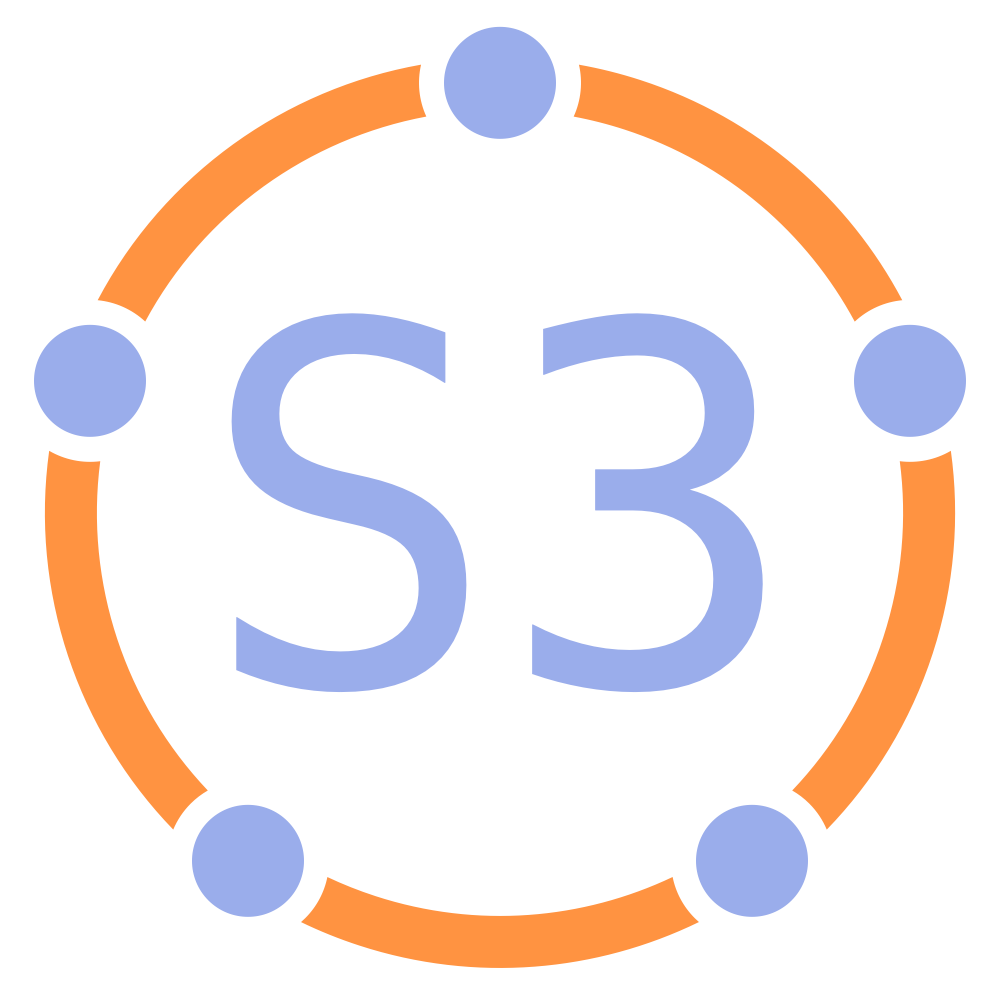

## Changelog 2017-11-16

- small corrections
- aligned glossary entries for _Circle_ and _Role_ to pattern text
- _Development Plan_: clarification of responsibilities
- _Role_: clarified evolution of strategy

## Changelog 2017-11-10

- various small clarifications and corrections
- _Circle_: clarified relationship between circle and domain
- _Role_: clarified description
- _Rounds_: updated description
- moved _Open Domain_, _Helping Team_ and _Open Systems_ to category "Building Organizations"
- added several terms to the glossary

## Changelog 2017-10-21

- added Liliana David to authors
- dropped the term "framework" (replaced with "practical guide")
- updated order of patterns
- added an index of all the patterns 
- added a glossary 
- added acknowledgments
- various small clarifications and corrections to text and illustrations
- updated templates for agreement and development plan

- Introduction:
    -   added "what's in it for me?"
    -   added definitions for governance, self-organization, semi-autonomy, operations to introduction
    -   clarified domains and their relationship to drivers
    -   fleshed out core concepts
    -   made all principles actionable

- _Artful Participation_: refined description
- _Agreement_: clarified that the concept of agreements is applicable to people in roles
- _Clarify Domains_: refined description
- _Circle_: updated definition, refined description
- _Driver_: updated definition
- _Development Plan_: refined template and description
- _Develop Strategy_: clarified definition of strategy, refined description
- _Double-Linked Hierarchy_: new illustration

## Changelog (2017-10-21 cont.)

- _Evaluate Agreements_: aligned questions to peer review
- _Governance Backlog_: updated definition
- _Logbook_: added details about governance to personal logbook
- _Objections_: clarified qualifying objections
- _Peer Review_: refined description
- _Respond to Organizational Driver_: integrated information about qualifying drivers
- _Role_: clarified role keeper may maintain a governance backlog, introduced the term "role keeper" for a person in a role
- _Proposal Forming_: added criteria for selecting tuners, added step for prioritizing considerations, small clarifications
- _Resolve Objections_: updated illustration to better reflect the process

## Changelog (2017-10-21 cont.)

**Renamed Patterns:** 

- _Backbone Organization_ to _Service Organization_
- _Effectiveness Review_ to _Peer Review_
- _Strategy_ to _Develop Strategy_
- _Domain Description_ to _Clarify Domains_
- _Describing Deliverables_ to _Describe Deliverables_

added | removed
--- | --- 
_Describe Drivers_ _Open Domain_ _Delegate Influence_  |_Coordination Circle_ _Nested Domains_ _Qualify Driver_ 

## Links

**Latest version of this guide**: [http://sociocracy30.org/guide/](http://sociocracy30.org/guide/)

**S3 website**: [http://sociocracy30.org](http://sociocracy30.org)

Follow us on **twitter**: [@sociocracy30](http://twitter.com/@sociocracy30)

## License

This work by Bernhard Bockelbrink, James Priest and Liliana David is licensed under the Creative Commons Attribution-ShareAlike 4.0 International License. To view a copy of this license, visit 
[http://creativecommons.org/licenses/by-sa/4.0/](http://creativecommons.org/licenses/by-sa/4.0/).

The latest version of this document is available at 
<http://sociocracy30.org>

## Acknowledgments 

The content of Sociocracy 3.0 reflects the accumulated experience and wisdom of contributors across generations. These people have shared a common quest to evolve more effective, harmonious and conscious ways of collaborating together.

Particular recognition goes to Gerard Endenburg and others over the years who have committed significant time towards evolving and documenting the Sociocratic Circle Organization Method, which has contributed towards and inspired the evolution of Sociocracy 3.0.

We’d also like to recognize all those who have worked extensively to facilitate the emergence of a more agile and lean mindset, and those who have evolved and shared various practices with the world.

Finally to acknowledge our numerous colleagues, customers, clients and attendees of Sociocracy 3.0 courses who have chosen to experiment with Sociocracy 3.0. Thank you for contributing your ongoing feedback to help evolve the patterns and enable us all to learn and grow.

By no means an exhaustive list, we’d like to offer our appreciation to the following people who directly contributed towards developing Sociocracy 3.0, or whose work influenced what it is today:

Gojko Adzic, Lysa Adkins, Christopher Alexander, David J. Anderson, Ruth Andrade, Jurgen Appelo, Kent Beck, Sue Bell, Jesper Boeg, Kees Boeke, Mary Boone, John Buck, Betty Cadbury, Diana Leafe Christian, Mike Cohn, Stephen Covey, Gigi Coyle, Jef Cumps, David Deida, Esther Derby, Kourosh Dini, Jutta Eckstein, Frands Frydendal, Gerard Endenburg, Andreas Hertel, Andrei Iuoraia, Francois Knuckel, Diana Larsen, Helmut Leitner, Jim and Michele McCarthy, Pieter van der Meche, Daniel Mezick, Susanne Mühlbauer, Niels Pfläging, Mary and Tom Poppendieck, Karl Popper, Brian Robertson, Marshall Rosenberg, Dave Snowden, Hal and Sidra Stone, Ken Schwaber, Jeff Sutherland, Sharon Villines, Nathaniel Whitestone, Ken Wilber, Jack Zimmerman.

## James Priest
... serves internationally, providing organizational development consultancy, learning facilitation, and mentoring for people wishing to evolve collaborative, adaptive organizations at scale.

[thriveincollaboration.com](http://thriveincollaboration.com)

[james@thriveincollaboration.com](mailto:james@thriveincollaboration.com)

## Bernhard Bockelbrink 

... is an agile coach, trainer and consultant supporting individuals, teams and organizations in navigating complex challenges and developing a culture of effective, conscious and joyful collaboration.

[evolvingcollaboration.com](http://evolvingcollaboration.com)

[bernhard.bockelbrink@gmail.com](mailto:bernhard.bockelbrink@gmail.com)

## Liliana David

... serves internationally, providing training, facilitation and mentoring to groups and organizations wishing to develop greater effectiveness and equivalence in collaboration.

[thriveincollaboration.com](http://thriveincollaboration.com)

[lili@thriveincollaboration.com](mailto:lili@thriveincollaboration.com)

