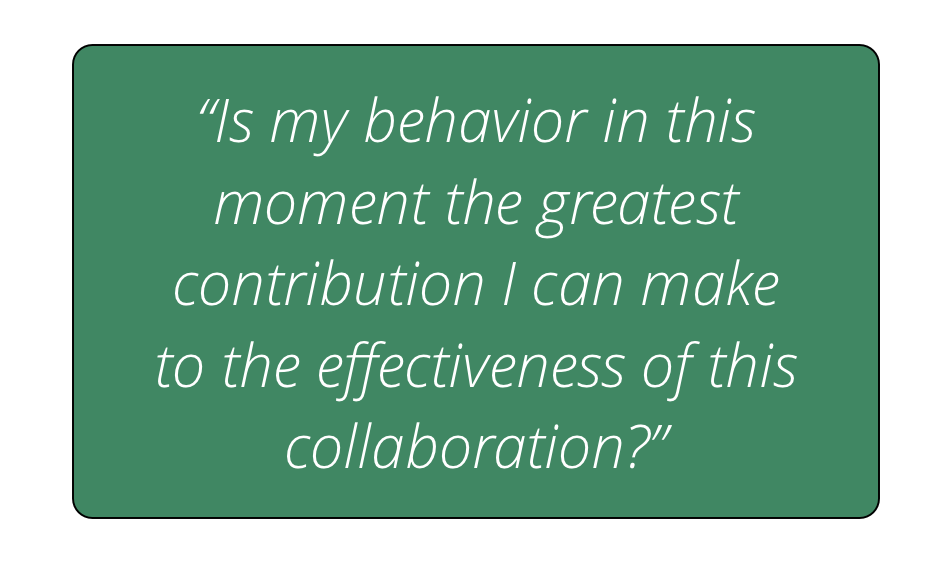
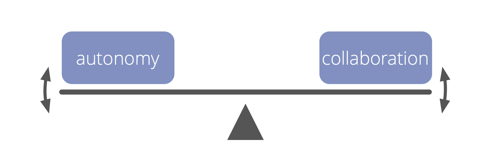

An **individual commitment** to developing helpful interactions and effective collaboration:

-   actively **consider and follow-up on all agreements** made, in the best way possible, given the circumstances
-   **develop awareness and understanding** of individual and collective needs
-   **grow the necessary skills** to do so
-   **support others** in doing the same 
-   bring impediments to the attention of others if necessary

Participating artfully may include interrupting, objecting or breaking  agreements.

### Benefits Of Artful Participation

- enables co-creation and evolution of agreements
- helps to grow stronger teams
- builds self-accountability, integrity and trust
- generates a culture of mutual support and close collaboration
- even more powerful when embraced by many

### Artful Participation: Self-Assessment

-   How will I support myself and others in participating more artfully? 
-   Where are my interactions with others unhelpful or ineffective?
-   Which agreements do I find hard to keep or contribute to? What can I do to address this?
-   What skills could I develop, that would support me to participate more artfully?
-   What would artful participation mean in relation to:
    -   my daily activities?
    -   collaboration and interaction with others?
    -   the organization? ...our customers or clients?
    -   the wider environment?
