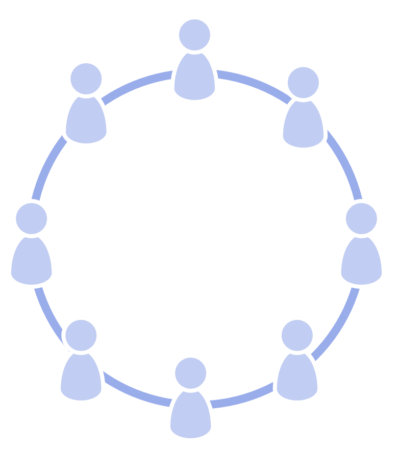

  

_A **circle** is an equivalent, self-governing, and semi-autonomous group of people collaborating to account for a domain._

A circle:

-   may be permanent or temporary
-   may be self-organizing
-   is accountable for its own development and its body of agreements

-   **semi-autonomous**
    -   a circle acts within the constraints of their domain
    -   each circle can create value autonomously
-   **self-governing**:
    -   a circle continuously decides what to do to account for their domain, and sets constraints on how and when things will be done.
