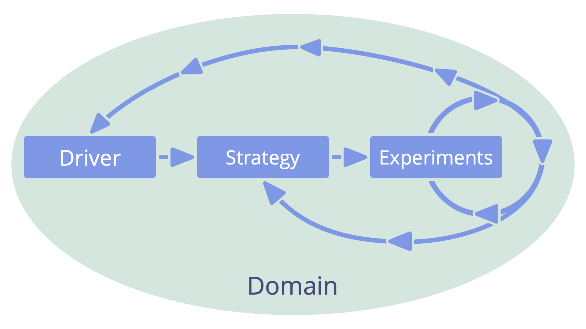

_A **strategy** is a high level approach for how people will create value to successfully account for a domain._

It is usually more effective if a team or role keeper lead in developing their own strategy.

A strategy often includes a description of the <a href="glossary.html#entry-intended-outcome" class="glossary-tooltip" data-toggle="tooltip" title="Intended Outcome: The expected result of an agreement, action, project or strategy.">intended outcome</a> of implementing that strategy.

As the <a href="glossary.html#entry-delegator" class="glossary-tooltip" data-toggle="tooltip" title="Delegator: An individual or group delegating responsibility for a domain to other(s).">delegator</a> shares accountability for <a href="glossary.html#entry-domain" class="glossary-tooltip" data-toggle="tooltip" title="Domain: A distinct area of influence, activity and decision-making within an organization.">domains</a> they delegate, it's valuable they review a <a href="glossary.html#entry-delegatee" class="glossary-tooltip" data-toggle="tooltip" title="Delegatee: An individual or group accepting responsibility for a domain delegated to them, becoming a role keeper or a team.">delegatee's</a> strategy, to check for potential impediments and suggest ways it could be improved.

A strategy is a shared agreement between delegator(s) and delegatee(s) that is regularly reviewed and updated as necessary (*pivot or persevere*)

Strategies are validated and refined through experimentation and learning.
