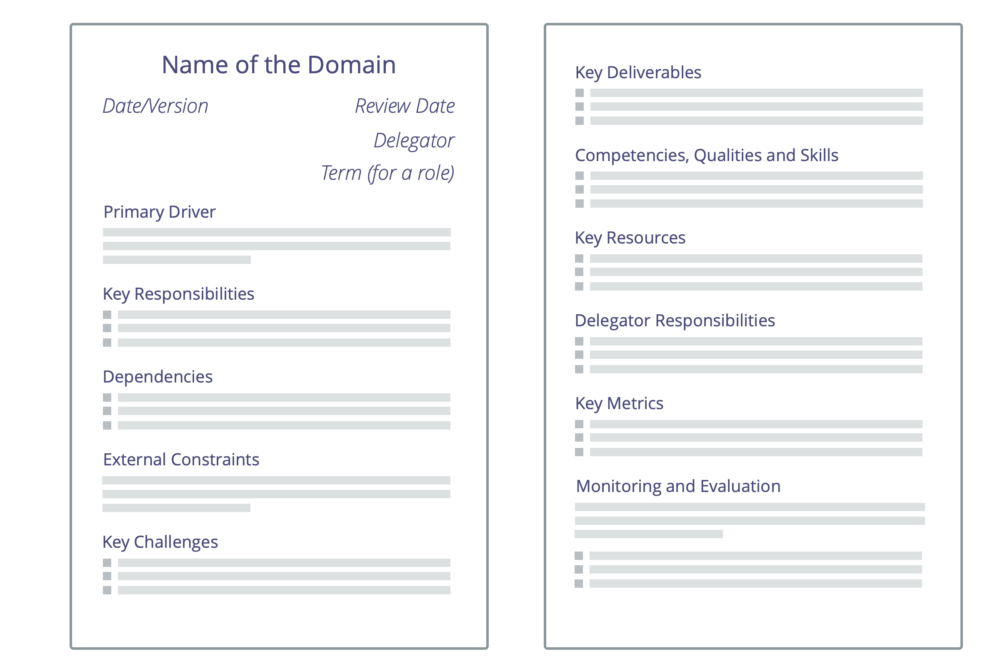

A clear understanding of people's area of accountability and autonomy enables greater efficiency, effective collaboration and agility throughout the organization.

A simple way to clarify domains is with a **domain description** that contains:

-   primary driver
-   key responsibilities
-   constraints
-   evaluation criteria for peer review
-   term (for a role)
-   (previous versions)

Domain descriptions can be created for a role, position, circle, team, open domain, department, unit, or the whole organization.

You can either start by clarifying existing domains, or at least clarify new ones.
