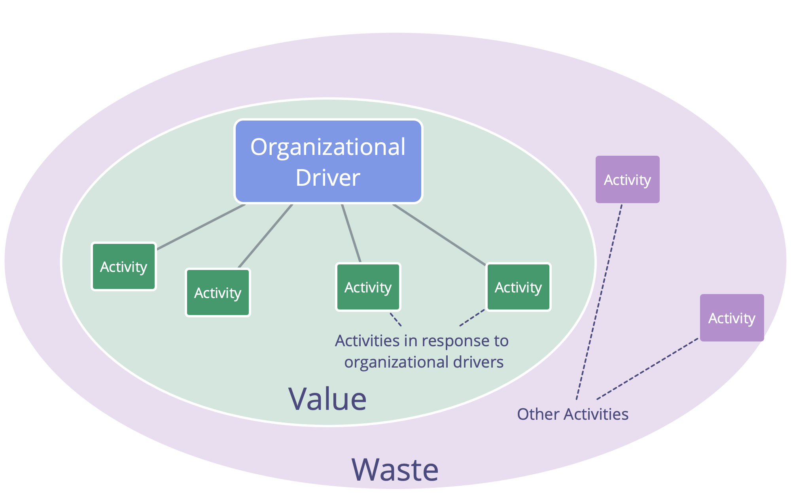

Reveal drivers and establish a metrics-based pull system for organizational change through continuously improving and refining the work process.

-   introduce the principle of consent and [Navigate via Tension](navigate-via-tension.html) to evolve work process in a team
-   consider selecting a facilitator to guide group processes, and choosing values to guide behavior
-   initiate a process of continuous improvement, e.g. through Kanban or regular [retrospectives](retrospective.html)
-   members of the team pull in S3 patterns as required
-   if valuable, iteratively expand the scope of the experiment to other teams
-   intentionally look out for impediments

## Waste and Continuous Improvement

_**Waste**, in relation to purpose, is any activity, output, or use of resources that does not contribute — directly or indirectly — to fulfilling that purpose._

Waste exists in various forms and on different levels of abstraction (tasks, processes, organizational structure, mental models etc.)

Establishing a process for the ongoing elimination of waste enables natural evolution of an organization towards greater effectiveness and adaptation to changing context.

<figure class="fig fig--limit-both fig--scale-normal">
    

        
        

    

    <figcaption>Drivers, Value and Waste</figcaption>
</figure>
