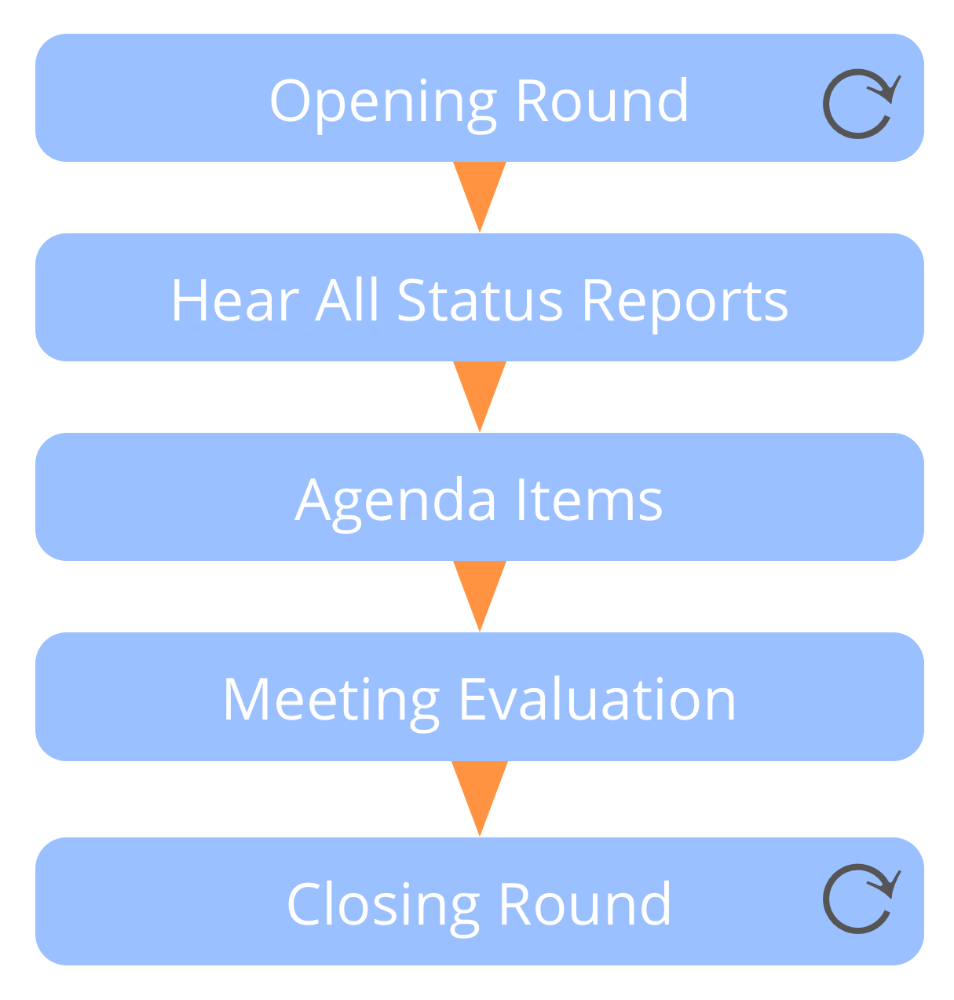

**Meet on a regular basis (usually weekly) for reporting on and coordinating work.**

-   facilitate the meeting and use rounds instead of discussions where valuable
-   if possible, compile the agenda before the meeting
    -   include any prerequisites for attendees to prepare
    -   further items may come up when hearing status reports

-   status reports: 
    -   circle metrics (if any)
    -   projects and tasks
-   agenda items: 
    -   sharing of information
    -   add or update tasks or projects
    -   propose new or updated agreements
