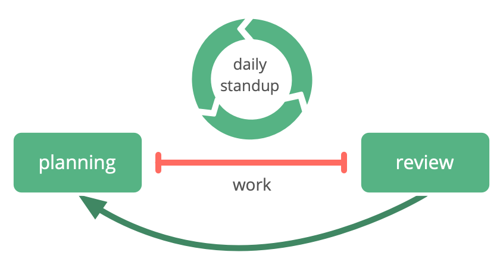

**A meeting to coordinate work, facilitate learning, improve productivity and effectiveness.**

-   time-boxed (usually 15 minutes)
-   held daily at the same time
-   the group gathers around a visible project management board/tool for:
    -   coordination of daily work
    -   addressing impediments/blocks
    -   adaptation of existing agreements or creation of new agreements on the spot
