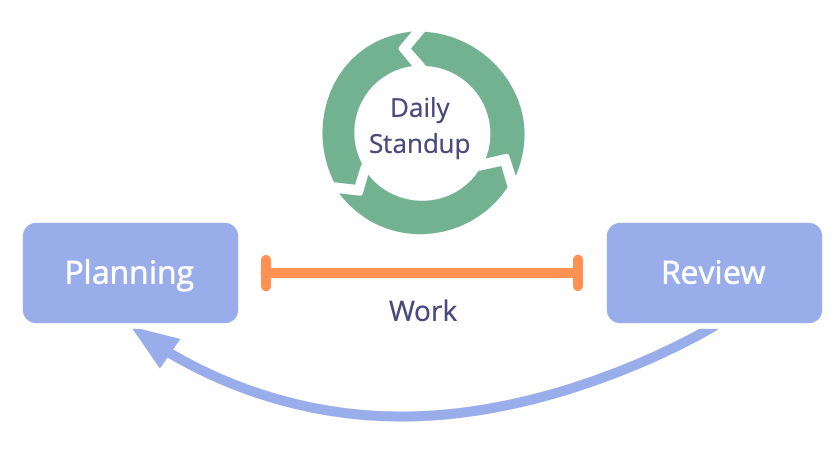

**Meet daily to organize work, facilitate learning and improve your productivity and effectiveness.**

-   time-boxed (usually 15 minutes)
-   held daily at the same time
-   the group gathers around a visible project management board/tool to:
    -   organize daily work
    -   address impediments/blocks
    -   adapt existing agreements or create new agreements on the spot

[&#9654; Planning And Review Meetings](planning-and-review-meetings.html) [&#9664; Retrospective](retrospective.html) [&#9650; Focused Interactions](focused-interactions.html)

