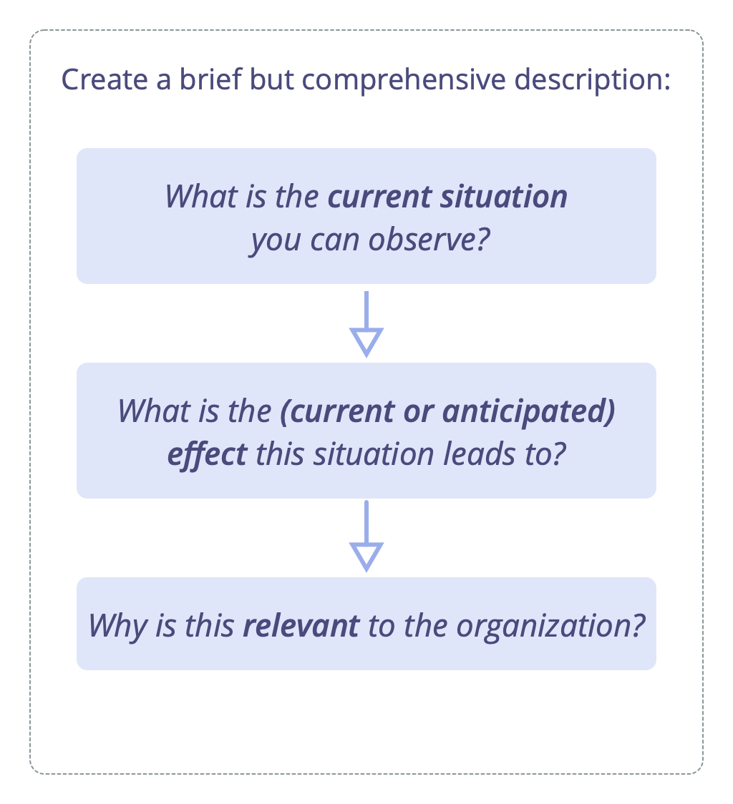

Describe organizational drivers to understand, communicate and remember them.

Describing <a href="glossary.html#entry-organizational-driver" class="glossary-tooltip" data-toggle="tooltip" title="Organizational Driver: A driver is a person’s or a group&#x27;s motive for responding to a specific situation. A driver is considered an **organizational driver** if responding to it would help the organization generate value, eliminate waste or avoid unintended consequences.">drivers</a> may be done by a group or by an individual. Depending on their perspective, they may decide to explain a driver as a **problem** to solve or an **opportunity** to leverage.

A simple way to describe a driver is by explaining:

-   **What's happening …:**
    -   the **current situation**
    -   the **effect** of this situation on the organization
-   … and **what's needed:**
    -   the **need** of the organization in relation to this situation
    -   the **impact** of attending to that need

Create a brief but comprehensive summary containing just enough information to clearly communicate the need for an action or a decision.

Aim for one or two sentences, so that the information is easy to remember and process.

Besides the summary, more details about the driver may be kept in the logbook.

## Example:

> _"The kitchen is in disorder: there are no clean cups, the sink is full of dishes and it's not possible to quickly grab a coffee and get right back to work. We need the kitchen in a usable state so we can stay focused on our work."_

## 1. Current Situation

> _"The kitchen is in disorder: there are no clean cups, the sink is full of dishes …"_

Describe the current situation:

- Briefly capture the essentials of what is happening, and, if necessary, the context in which it occurs.
- Be objective - describe observations and avoid evaluation.

## 2. Effect

> _"… it's not possible to quickly grab a coffee and get right back to work."_

Explain the effect of this situation on the organization:

- Clarify **why** the situation needs attention: how does it affect the organization?
- Be explicit about whether the effects are current or anticipated.
- Explain challenges, losses, opportunities or gains.

## 3. Need

> _"We need the kitchen in a usable state …"_

Explain the <a href="glossary.html#entry-need" class="glossary-tooltip" data-toggle="tooltip" title="Need: The lack of something wanted or deemed necessary (a requirement).">need</a> of the organization in relation to this situation:

- A **need of an organization** is anything a team (or individual) requires to effectively account for a <a href="glossary.html#entry-domain" class="glossary-tooltip" data-toggle="tooltip" title="Domain: A distinct area of influence, activity and decision-making within an organization.">domain</a>.
- Be specific on whose need it is ("we need", "they need", "I need").
- If there's disagreement about the need, it helps to zoom out from specific solutions and focus on what the organization is lacking in this situation.

## 4. Impact

> _"… so we can stay focused on our work"._

Describe the anticipated impact of attending to that need:

- Explain potential benefits, opportunities, or even the <a href="glossary.html#entry-intended-outcome" class="glossary-tooltip" data-toggle="tooltip" title="Intended Outcome: The expected result of an agreement, action, project or strategy.">intended outcome</a> of responding to that need.
- The impact may be obvious or implicit, especially when the effects of the current situation are already described.

## Review Drivers

Make sure to review drivers on a regular basis, to deepen you understanding of what's happening and needed.

Helpful questions for a review include:

-   Is the description of the situation (still) correct?
-   Do we still associate the same needs with the situation?
-   Is the driver still within our domain?
-   Is the driver still relevant?

