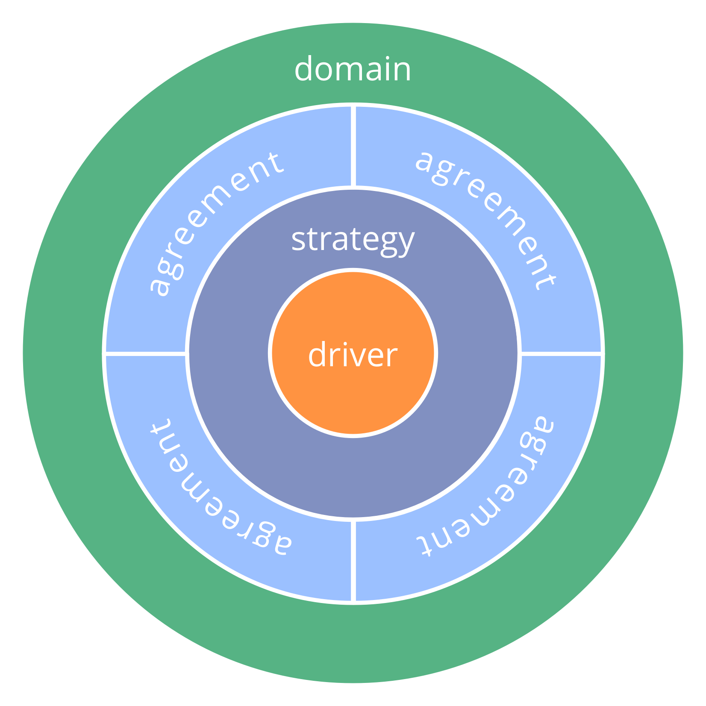
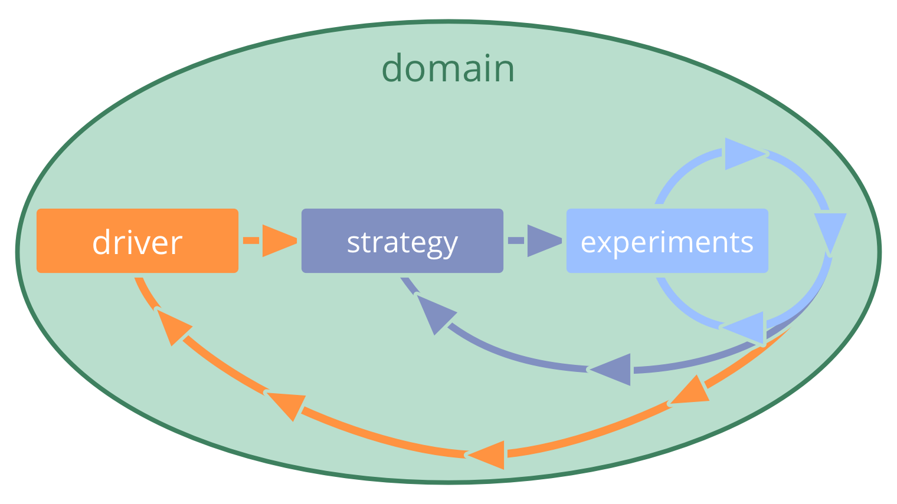

_A **strategy** is a high level approach how people will create value to successfully account for a domain._

-   an organization, group or role keeper develop their own strategy
-   a strategy often includes a description of the intended outcome
-   as the delegator shares accountability for the domain, it's valuable they review the strategy, identify potential impediments and suggest improvements 
-   strategy is a shared agreement between delegator(s) and delegatee(s) that is regularly reviewed and updated as necessary (*pivot or persevere*)

### Strategies are implemented and refined through experimentation and learning. 

