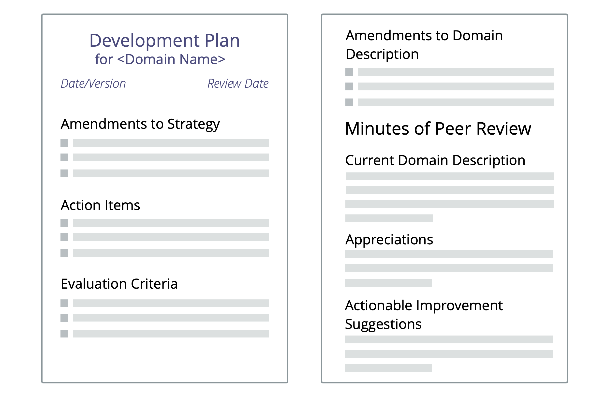

**A plan for how to develop more effective ways of accounting for a domain, agreed between delegator and delegatee.**

The development plan may be created for a person in a role, or for a group (e.g. a department, circle, team or open domain).

Development may happen in the form of refining description of driver and domain, amendments to strategy, new or updated agreements and specific actions to be taken, either within the domain of the delegator, or the domain of the delegatee.

A development plan (and any accompanying recommendations for changes to the domain description and driver statement) requires consent from both the delegatee and the delegator.

