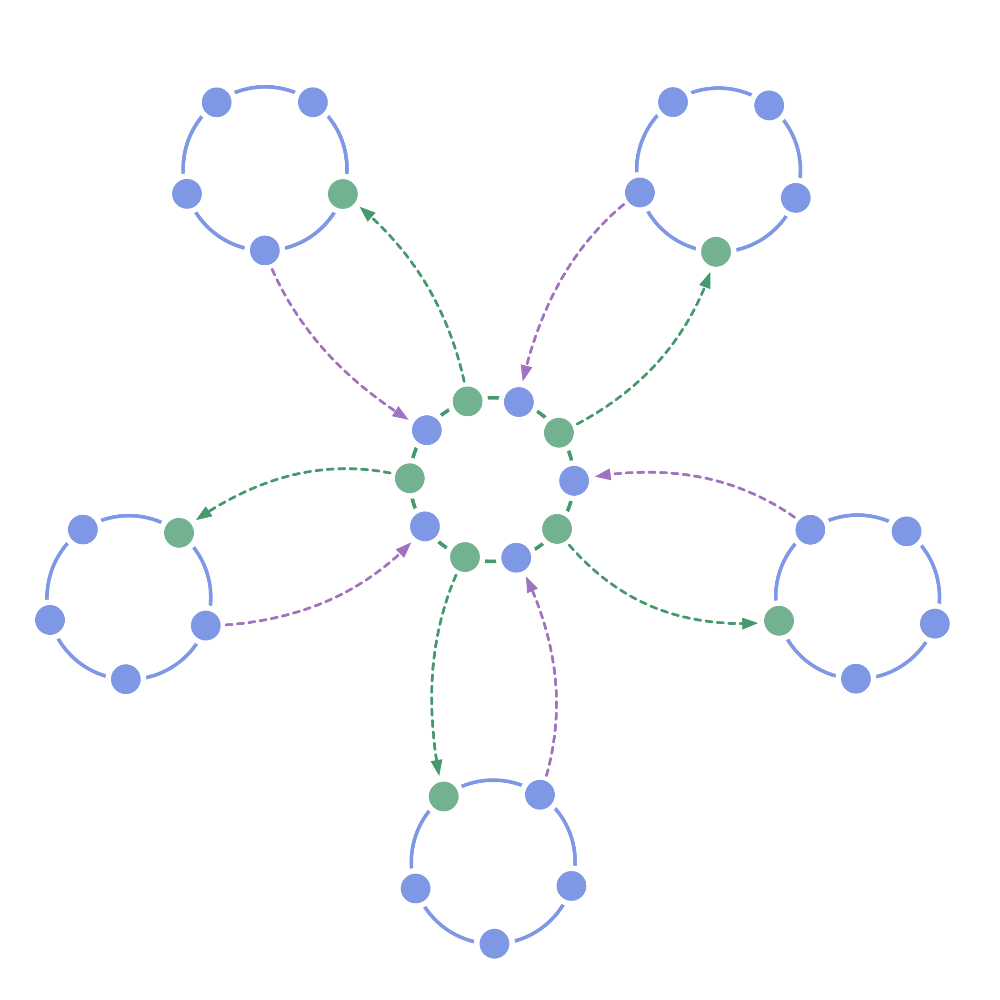

**Bring equivalence to governance in a typical organizational hierarchy.**

-   the organization is built from of self-governing circles
-   circles select a member to represent their interests in governance decisions of the next higher circle, and vice versa
-   functional hierarchy is still possible if valuable
