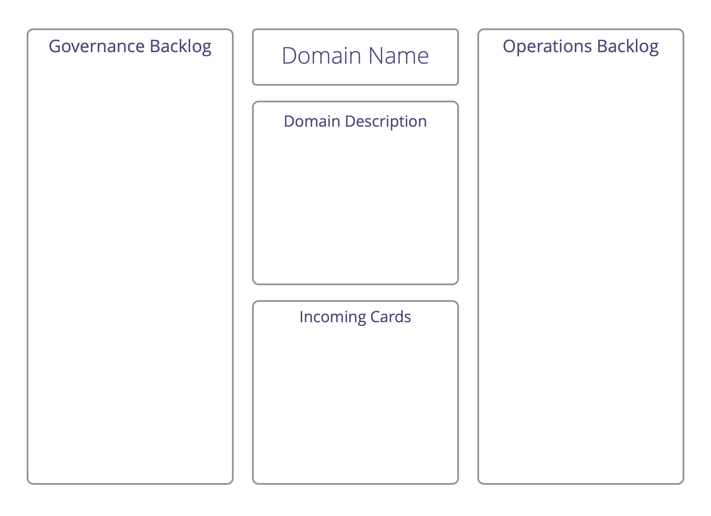

A workshop format to identify an effective response to a complex situation: organize start-ups, kick-off projects, tackle major impediments or opportunities, develop organizational structure to better enable the <dfn data-info="Flow of Value: Deliverables traveling through an organization towards customers or other stakeholders.">flow of value</dfn>.

A (small or large) group identifies and clusters <dfn data-info="Driver: A person’s or a group&apos;s motive for responding to a specific situation.">drivers</dfn>, to then progress quickly from concept to action in smaller and self-organizing teams.

[&#9654; Peer Development](peer-development.html) [&#9664; Role Selection](role-selection.html) [&#9650; Co-Creation And Evolution](co-creation-and-evolution.html)

