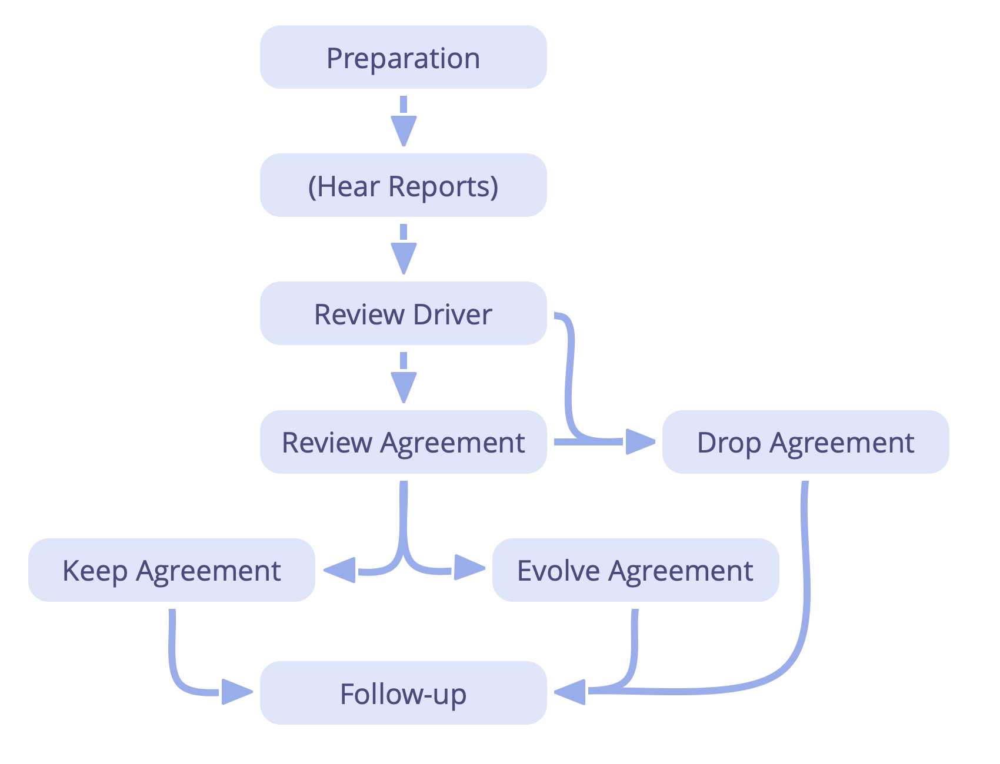

Regular review of agreements is an essential practice for a learning organization; continuously evolving the body of agreements, and eliminating waste:

-   adapt to changing context
-   integrate learning:
    -   _How has this agreement helped us?_
    -   _How can this agreement be improved?_
    -   _Is there any reason why not to continue with this agreement?_

-   preparation
    -   schedule review
    -   ensure necessary information is available

-   follow-up
    -   agree on next review date
    -   documentation / notification
    -   tracking tasks and decisions
    -   effects on related agreements

-   evaluating agreements can be as simple as checking that it is still relevant, and there is no objection to keeping the agreement as it is 
-   agreements are often reviewed in *Governance Meetings* 
-   sometimes it's effective to schedule a dedicated session for reviewing an agreement 
-   adjust review frequency as necessary
-   review earlier if required
-   elements of this process can also be used by individuals to evaluate decisions they make

