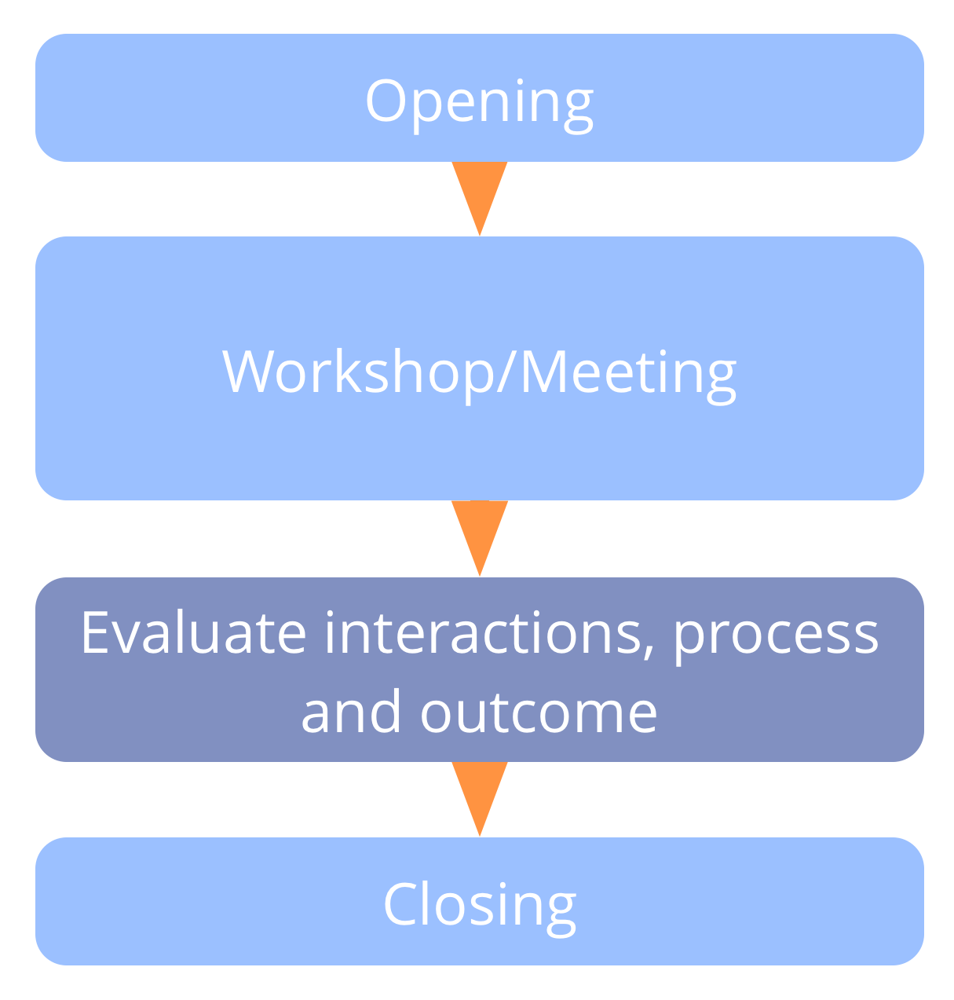

**Take time for learning at the end of each meeting or workshop.**

Reflect on interactions, celebrate successes and share suggestions for improvement.

-   before the closing round
-   reserve 5 minutes for 1 hour, and 15 minutes for a full-day workshop
-   record learning and review before the next meeting
-   short formats: 
    -   more of/less of/start/stop/keep
    -   positive/critical/suggested improvements

### Evaluate Meetings: Long Format

Ask everyone in a round to reflect on any or all of the following topics in a brief sharing: 

-   effectiveness and format
-   facilitation and participation
-   emotional tone
-   appreciations and achievements (I liked...)
-   growing edges and improvement suggestions (I wish...)
-   wild ideas and radical suggestions (What if...)
