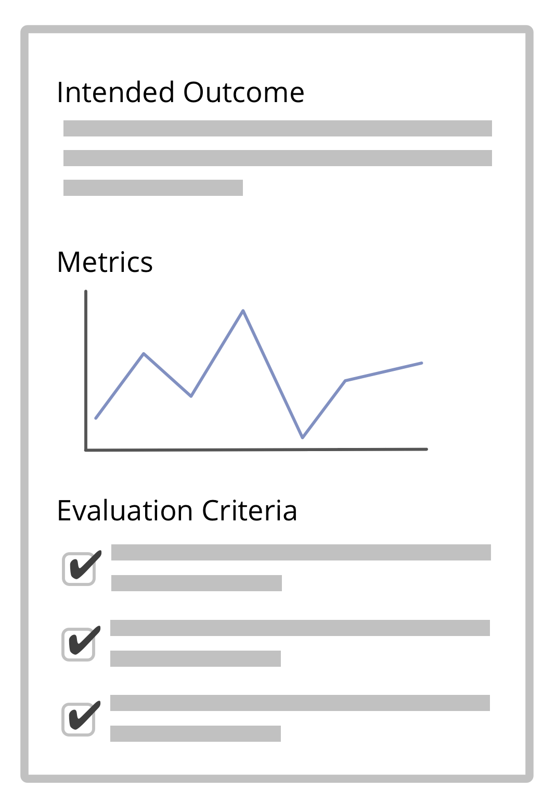

Well-defined evaluation criteria can help to understand whether or not an agreement has had the desired effect.

-   go for **simple and unambiguous** criteria and document them (to avoid discussion when reviewing your agreements)
-   define **actionable metrics** to continuously track effects and spot deviations from intended outcomes
