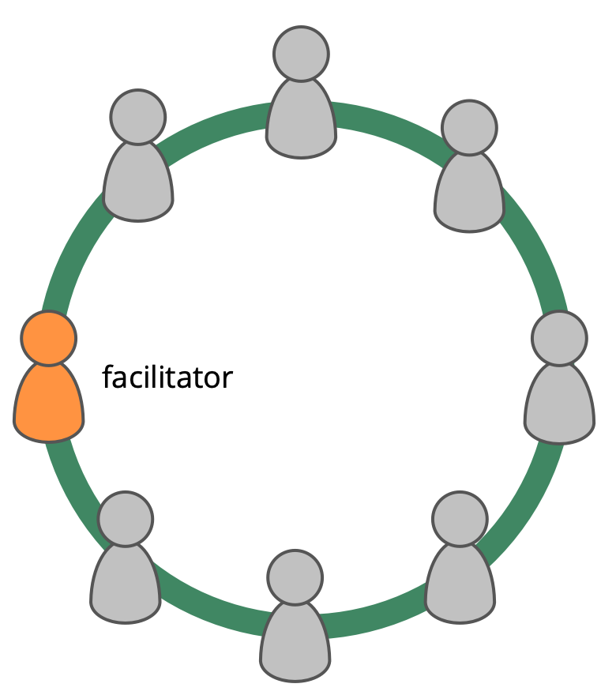

A governance facilitator:

-   is accountable for ensuring governance meetings are facilitated, stay on track and are evaluated
-   is (usually) selected by a group from among it members
-   familiarizes themselves with the governance backlog
-   often invites others to facilitate some agenda items

When using S3 for governance, the facilitator familiarizes themselves with the following patterns:

-   rounds
-   proposal forming
-   consent decision making
-   role selection
-   evaluate meetings
-   resolve objections
-   peer reviews
