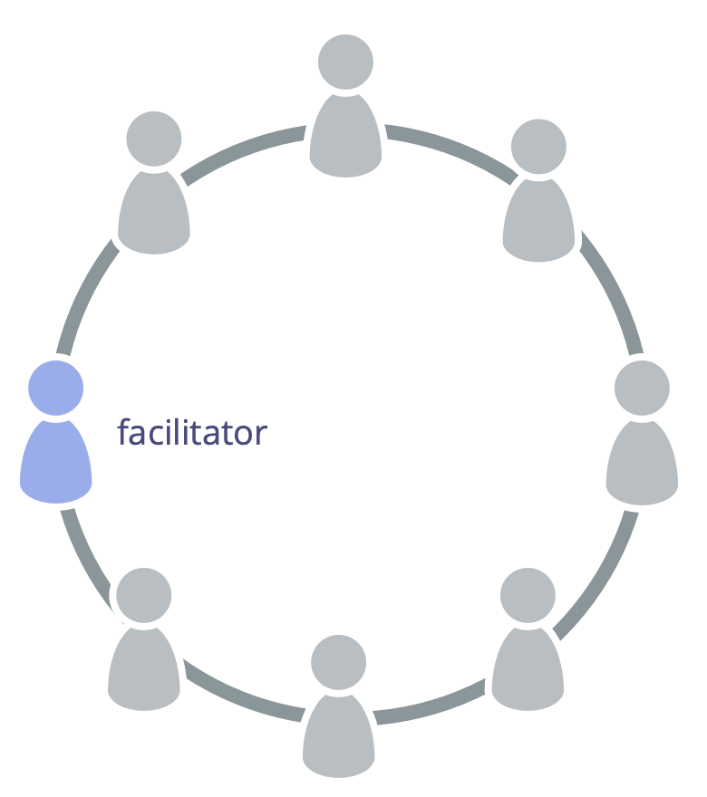

**Select someone to facilitate governance meetings.**

A <a href="#" class="tooltip" title="Governance: The process of setting objectives and making and evolving decisions that guide people towards achieving those objectives.">governance</a> facilitator:

-   ensures [governance meetings](governance-meeting.html) stay on track and are evaluated
-   is (usually) selected by a <a href="#" class="tooltip" title="Team: A group of people collaborating toward a shared driver (or objective). Typically a team is part of an organization, or it is formed as a collaboration of several organizations.">team</a> from among it members (and for a specific term)
-   familiarizes themselves with the [Governance Backlog](governance-backlog.html)
-   often invites others to facilitate some agenda items

As a governance facilitator, consider learning about and using the following patterns from S3 to handle governance effectively:

-   [Rounds](rounds.html)
-   [Proposal Forming](proposal-forming.html)
-   [Consent Decision Making](consent-decision-making.html)
-   [Role Selection](role-selection.html)
-   [Evaluate Meetings](evaluate-meetings.html)
-   [Resolve Objections](resolve-objections.html)
-   [Peer Review](peer-review.html)

<a href="agree-on-values.html" title="Back to: Agree On Values">◀</a> <a href="enablers-of-collaboration.html" title="Up: Enablers of Collaboration">▲</a> <a href="breaking-agreements.html" title="Read next: Breaking Agreements">▶ Read next: Breaking Agreements</a>

