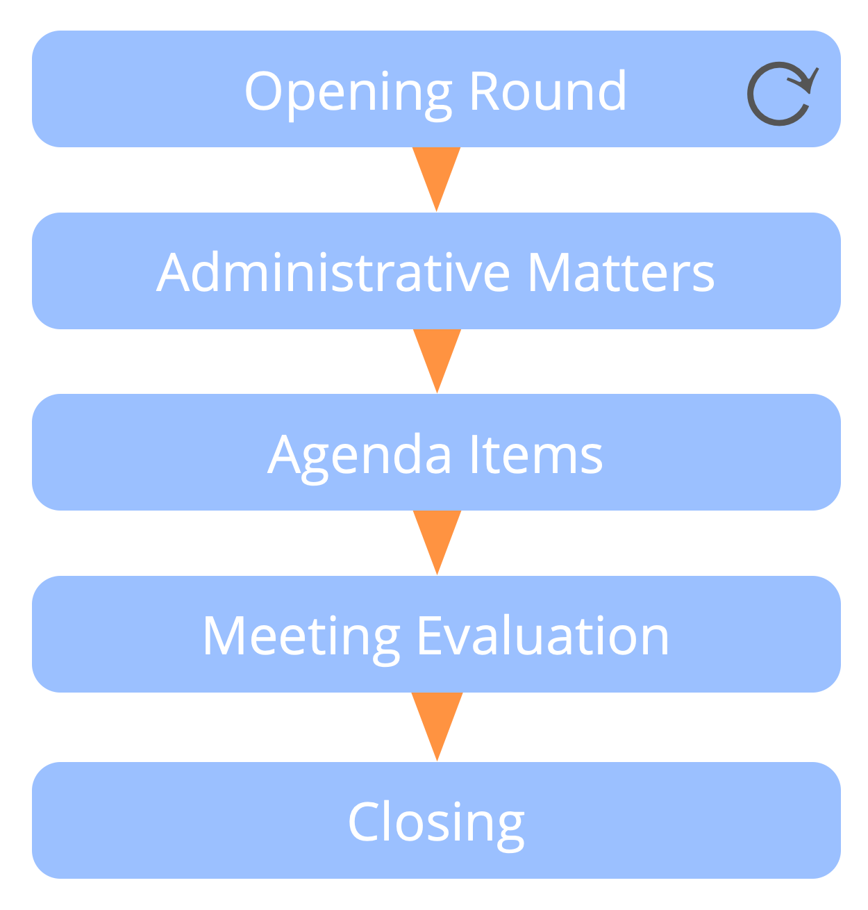

Groups meet at regular intervals to decide what to do to achieve objectives, and to set constraints on how and when things will be done.

A governance meeting is usually:

-   facilitated 
-   prepared in advance 
-   time-boxed for a duration of 90-120 minutes
-   scheduled every 4 weeks

A typical governance meeting includes: 

-   opening round: attune with each other and to the objectives (or driver) of the group
-   administrative matters 
    -   consent to last minutes, date for next meeting, etc.
    -   check for last-minute agenda items and consent to agenda
-   agenda items 
-   meeting evaluation: reflect on your interactions, celebrate successes and share suggestions for improvement
-   closing

Typical agenda items include:

-   any short reports 
-   evaluation of existing agreements due review
-   new drivers requiring decisions to be made, including: 
    -   understanding and agreeing on situations that require attention 
    -   forming proposals and making agreements 
    -   creating and defining new roles and groups 
    -   reviewing existing roles or groups
    -   selecting people to roles 

