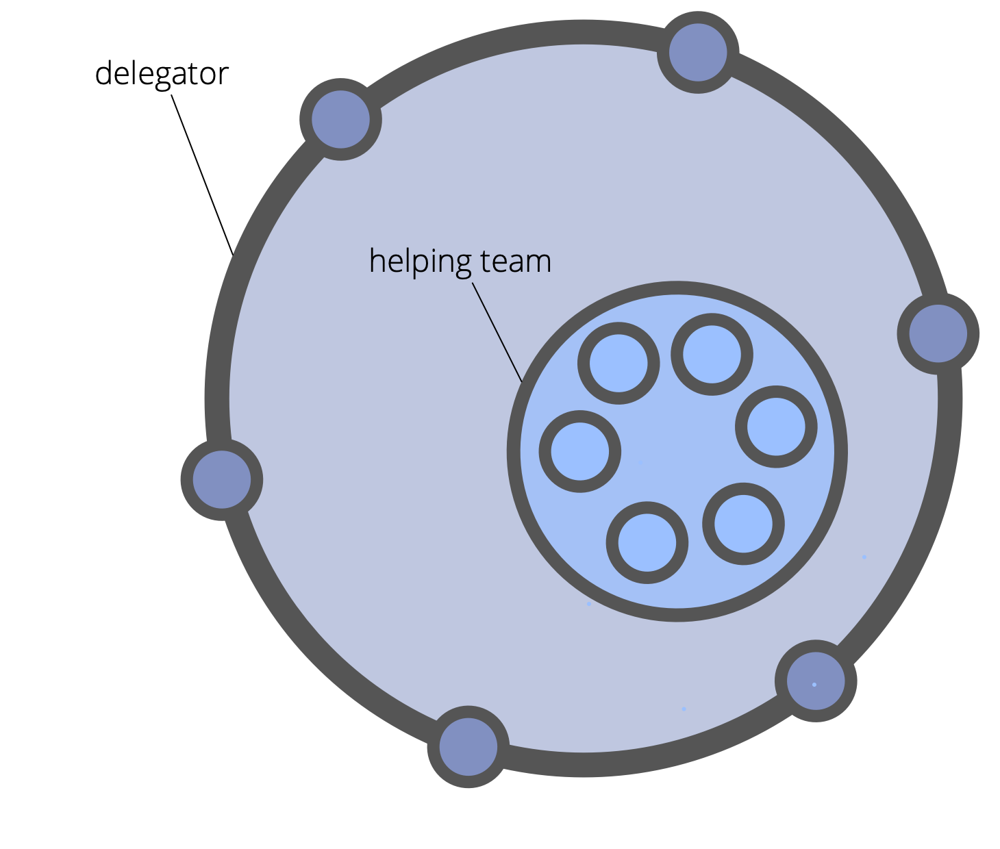

A group of people with the mandate to execute on a specific set of requirements defined by a delegator.

A helping team: 

-   is a way for a delegator to expand their capacity
-   may be self-organizing, or guided by a coordinator chosen by the delegator
-   is governed by the delegator
-   benefits from a clearly defined domain

Members of the helping team:

-   can object to the delegator's decisions that affect them
-   can add items to the delegator's governance backlog
-   may be invited to select a representative to participate in the governance decisions of the delegator