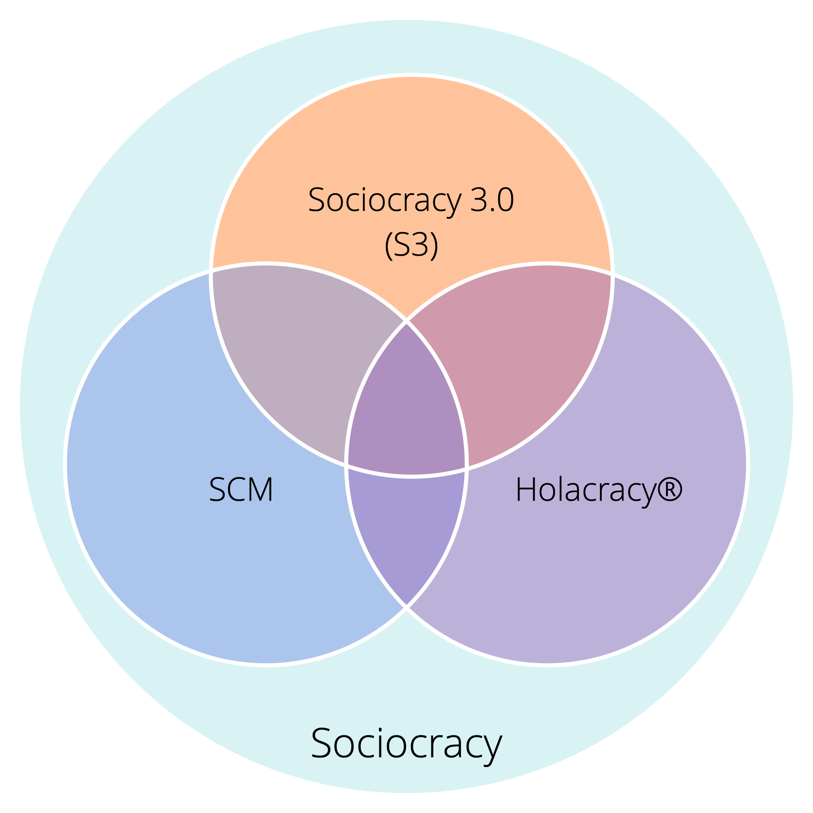

## Sociocracy 3.0 - A Practical Guide For Evolving Agile and Resilient Organizations 

### Effective Collaboration At Any Scale

Sociocracy 3.0 — **a.k.a. “S3”** — is a practical guide for evolving agile and resilient organizations of any size, from small start-ups to large international networks and nationwide, multi-agency collaboration. It provides for a coherent way for growing organizational integrity and **developing a sociocratic and agile mindset**. 

S3 brings you an extensive collection of guidelines and practices (so-called “patterns”) that have proven helpful for organizations to **improve performance, alignment, fulfillment and wellbeing**.

These patterns help you discover how to best reach your objectives and navigate complexity, one step at a time, **without the need for sudden radical reorganization or planning a long-term change initiative**:

 Simply start with your area of greatest need, select one or more patterns to try, **move at your own pace** and develop skills as you go. 

**Regardless of your position in the organization**, you will find patterns that are relevant and helpful for you.

Sociocracy 3.0 is:

-   **flexible:** adaptable patterns, independent and mutually reinforcing, to help you with all aspects of collaboration
-   **principles-based:** seven core principles of agile and sociocratic collaboration are reflected in every pattern
-   **free:** licensed under a Creative Commons Free Culture License

### What's in it for me?

**Sociocracy 3.0:**

* provides a coherent collection of principles based patterns for collaboration, to navigate complexity, adapt and evolve.
* supports people to incrementally process available information into continuous improvement of work processes, products, services and skills.
* helps organizations to make the best use of the talent already present, and to grow flexible organizational structures to align the flow of information and influence to the flow of value.
* provides an organic, iterative approach to change that meets organizations where they are and helps them move forward at their own pace and according to their unique context and needs.
* draws on the collective intelligence of the group.
* facilitates the development of strategies that are “good enough for now” and “safe enough to try”.
* fosters accountability and a sense of engagement.
* is a transformational mechanism for both individuals and the whole organization.

**Sociocracy 3.0 may be applied within:**

* startups
* small and medium businesses
* large international, networked organizations
* families
* investor-funded organizations
* communities
* and more…

### Contents of this guide

-   a bit of history and a brief overview of some basic concepts behind S3
-   a description of all the patterns in S3
-   an appendix 
    -   changelog
    -   info about authors and acknowledgments
    -   the license
    -   the intentional commitment for practitioners and teachers of Sociocracy 3.0
    -   glossary and index

## Influences and History of Sociocracy 3.0

The literal meaning of the term **sociocracy**  is "rule of the companions": _socio_ — from Latin _socius_ — means "companion", or "friend", and the suffix _-cracy_ — from Ancient Greek κράτος (krátos) — means “power", or "rule”.

The word sociocracy can be traced back to 1851, when **Auguste Comte** suggested applying a scientific approach to society: states would be governed by a body of scientists who are experts on society (which he termed "sociologists"). In his opinion, this future, although not yet achievable, would be inevitable.

A few decades later, **Lester Frank Ward**, used the word 'sociocracy' to describe the rule of people with relations with each other. Instead of having sociologists at the center, he wanted to give more power and responsibility to the individual, he imagined sociologists in a role as researchers and consultant.

In 1926, the Dutch reformist educator and Quaker **Kees Boeke**, established a residential school based on the principle of consent. Staff and students were treated as equal participants in the governance of the school, all decisions needed to be acceptable to everyone. He built this version of sociocracy on Quaker principles and practices, and described sociocracy as an evolution of democracy in his 1945 essay "Democracy as it might be".

**Gerard Endenburg**, also a Quaker and a student in Boeke's school, wanted to apply sociocracy in his family's business, Endenburg Elektrotechniek. He created and evolved the _Sociocratic Circle Organisation Method (SCM)_ (later becoming the "Sociocratic Method"), integrating Boeke's form of sociocracy with engineering and cybernetics. In 1978 Endenburg founded the Sociocratisch Centrum in Utrecht (which is now the Sociocratic Center in Rotterdam) as a means to promote sociocracy in and beyond the Netherlands. Since 1994 organizations in the Netherlands using SCM are exempt from the legal requirement to have a worker's council.

During the late 1990s and early 2000s, several non-Dutch speaking people came across sociocracy, but it wasn't until 2007 when **Sharon Villines and John Buck** launched their book, "We the People", that sociocracy became widely accessible to the English speaking world, and from there has began to migrate into several other languages.

Sociocracy has proven to be effective for many organizations and communities around the world, but it has yet to become viral. 

In 2014 **James Priest and Bernhard Bockelbrink** came together to co-create a body of Creative Commons licensed learning resources, synthesizing ideas from Sociocracy, Agile and Lean. They discovered that organizations of all sizes need a flexible menu of practices and structures – appropriate for their specific context – that enable the evolution of a sociocratic and agile mindset to achieve greater effectiveness, alignment, fulfillment and wellbeing. The first version of **Sociocracy 3.0.** was launched in March 2015. 

**Liliana David** joined the team soon after and together they regularly collaborate to develop both the framework and the website.

Together, they seek to make S3 available and applicable to as many organizations as possible and provide resources under a **Creative Commons Free Culture License** for people who want to learn, apply and tell others about Sociocracy 3.0.

### The Sociocracy 3.0 Movement

As interest in Sociocracy 3.0 grows there is a fast growing community of people from a variety of backgrounds — pioneering consultants, coaches, learning facilitators, and people applying S3 into their various contexts — who share appreciation for the transformational potential of Sociocracy 3.0 to help organizations and their members thrive. Many kindly dedicate some of their time to experimenting with and sharing about S3, and who collaborate to learn from one another and document experiences to inform the ongoing development and evolution of the framework and it’s various applications.

## Why Sociocracy 3.0?

Sociocracy as a form of governance has been referred to since 1851. Subsequently it has been developed and adapted by many different people and organizations, including Gerard Endenburg, The Sociocracy Group (TSG) and Brian Robertson (HolacracyOne).

Yet, outside the Netherlands sociocracy has until recently remained largely unknown.

We love sociocracy because we see organizations and their members thrive when they use elements of it to enrich or transform what they currently do.

We also love agile, lean, Kanban, the Core Protocols, NVC, and many other ideas too. We believe that the world will be a better place as more organizations learn to pull from this cornucopia of awesome practices that are emerging into the world today, and learn to synthesize them with what they already know.

Therefore we decided to devote some of our time to develop and evolve Sociocracy, integrating it with many of these other potent ideas, to make it available and applicable to as many organizations as possible.

To this end, we recognize the value of a strong identity, a radically different way of distribution, and of adapting the *Sociocratic Circle Organization Method* to improve its applicability. 

### The Name

The name “*Sociocracy 3.0*” demonstrates both respect to the lineage and a significant step forward.

It also helps avoid the perception of us misrepresenting the *Sociocratic Circle Organization Method* (SCM) as promoted by The Sociocracy Group.

### The New Model of Distribution

*Sociocracy 3.0* employs a non-centralized model for distribution. This is a paradigm shift in the way sociocracy is brought to people and organizations, and one that many people can relate to.

We support “viral” distribution through two key strategies:

* **Sociocracy 3.0 is open:** We want to encourage growth of a vibrant ecosystem of applications and flavors of sociocracy, where people share and discuss their insights and the adaptations they are making for their specific context. To this end Sociocracy 3.0 puts emphasis on communicating the underlying principles and explicitly invites the creativity of everyone to remix, extend and adapt things to suit their needs.
* **Sociocracy 3.0 is free:** To eliminate the barrier of entry for people and organizations we provide free resources under a *Creative Commons Free Culture License* to learn, practice and teach *Sociocracy 3.0*. Everyone can use our resources without our explicit permission, even in a commercial context, or as a basis for building their own resources [^as long as they share their new resources under the same license]. We encourage other organizations, consultants, coaches, learning facilitators and trainers to follow our example and release their resources too.

### The Evolution of the Sociocratic Circle Organization Method

Maybe we need to make this explicit: Sociocracy 3.0 is not targeted specifically at the existing community of people exploring the *Sociocratic Circle Organization Method*, or at The Sociocracy Group (TSG). The *Sociocratic Circle Organization Method* (SCM) is already well developed and many people appear to be mostly happy with it.

Yet from our direct experience, even for those organizations that have heard about sociocracy, there are many obstacles to actually become invested. With *Sociocracy 3.0* we actively work on addressing and eliminating what stands in the way.

#### Reducing Risk and Resistance

*Sociocracy 3.0* meets organizations where they are and takes them on a journey of continuous improvement. There’s no radical change or reorganization. *Sociocracy 3.0* provides a collection of independent and principle-based patterns that an organization can pull in one by one to become more effective. All patterns relate to a set of core principles, so they can easily be adapted to context.

#### Shifting Focus From Aim (or Purpose) to Need

*Sociocracy 3.0* moves primary focus from vision, mission, aims or purpose, towards the source of motivation, and aligns the organization towards discovering and addressing what it needs. Organizations which are already need-driven, value driven or customer-centric, find this immediately accessible.

In *Sociocracy 3.0*, purpose is implicit in all cases – to flow value to the organization's drivers.

#### Condensed to the Essentials

When looking at the norms, the *Sociocratic Circle Organization Method* may look big and scary. By focusing on the essentials only, *Sociocracy 3.0* offers a lightweight framework to adapt and build on as necessary.

This doesn’t mean to say it’s all easy: choosing to pull in *Sociocracy 3.0's* patterns requires an investment in learning and un-learning. This is why it’s important to only pull in what you need, because there’s no point to changing things if what you are doing is already good enough.

#### Integration With Agile and Lean Thinking

The *Sociocratic Circle Organization Method* is an “empty” method when it comes to operations and creating a culture of close collaboration. Many organizations already implement or show preference for lean and agile thinking for operations and collaboration. We believe this is a great idea, so *Sociocracy 3.0* is designed for easy adoption into lean and agile organizations.

#### A New Way to Evolve Organizational Structure

The organizational structure according to the *Sociocratic Circle Organization Method* is modeled on a hierarchy of domains. We see an increasing emergence of collaborative multi-stakeholder environments and the need for a wider variety of patterns for organizational structure.
Evolution of organizational structure happens naturally when the flow of information and influence in an organization is incrementally aligned to the flow of value. *Sociocracy 3.0* provides a variety of structural patterns that can be combined to evolve structure as required and in a flexible way.

_James Priest, Bernhard Bockelbrink and Liliana David_

## Basic Concepts

Before diving into the content, consider taking time to learn about some basic concepts behind S3: 

-   What is a pattern?
-   The Seven Principles
-   Making Sense of Organizations:
    -   Drivers, Value and Waste
    -   Domains, Delegation and Accountability
    -   Governance and Operations

For any terms you don't understand check out the glossary at the end.

### Patterns 

_A **pattern** is a template for successfully navigating a specific context._

-   S3 patterns are discovered through observing many organizations as they solve problems and respond to opportunities
-   S3 patterns can be evolved and adapted to suit differing contexts
-   the patterns are grouped by topic into ten categories

### The Seven Principles 

Sociocracy is built on seven principles that shape organizational culture. Since the seven principles are reflected in all of the patterns, understanding these principles is helpful for adopting and paramount to adapting Sociocracy 3.0 patterns.

Practicing Sociocracy 3.0 helps people appreciate the essential value that these core principles bring, both to individuals and to organizations.

**The Principle of Effectiveness:** *Devote time only to what brings you closer toward achieving your objectives.*

**The Principle of Consent:** *Raise, seek out and resolve objections to decisions and actions.*

**The Principle of Empiricism:** *Test all assumptions through experimentation and continuous revision.*

**The Principle of Continuous Improvement:** *Change incrementally to accommodate steady empirical learning.*

**The Principle of Equivalence:** *Involve people in making and evolving decisions that affect them.*

**The Principle of Transparency:** *Make all information accessible to everyone in an organization, unless there is a reason for confidentiality.*

**The Principle of Accountability:** *Respond when something is needed, do what you agreed to do, and take ownership for the course of the organization.*

#### The Principle of Accountability

*Respond when something is needed, do what you agreed to do, and take ownership for the course of the organization.*

Act within the constraints of any agreements governing domains you are accountable for, including the organization itself, teams you are part of, and roles you keep.

Every member of the organization is accountable for effectively responding to organizational drivers, both in doing the work and in ensuring (supporting) effective collaboration.

Individuals are also accountable for their work, ongoing learning and development, and for supporting one another.

Everyone in an organization is accountable for aligning activity with organizational values.
 
### Making Sense of Organizations

#### Drivers

_A **driver** is a person’s or a group's motive for responding to a specific situation._

Drivers: 

-   can be used to derive goals, objectives, aims, mission, vision, purpose
-   can change over time

##### Drivers, Value and Waste

_**Value** is the importance, worth or usefulness of something in relation to a driver._

_**Waste** is anything unnecessary for — or standing in the way of — a (more) effective response of a driver._

By adopting the concept of value and waste, many practices and ideas from **lean production** and **lean software development** can be utilized by organizations pulling in S3 patterns:

-   value stream mapping
-   various strategies for eliminating waste
-   the Kanban Method

#### Domains

_A **domain** is a distinct area of influence, activity and decision making within an organization._

All domains are within the overall domain of an organization and may overlap and/or be fully contained within other domains.

Domains are delegated to people (e.g. to a unit, department, team or individuals), who take responsibility for the domain, and act within its defined constraints on influence and autonomy.

##### Delegating Domains

Those delegating a domain (the _delegators_) still retain overall accountability for that domain, allocate **resources** and often define:

-   the **organizational need** the domain is designed to respond to
-   **key responsibilities** (key deliverables, any critical risks to manage, other essential work and decision making being delegated)
-   **constraints to the autonomy and influence** of those the domain is delegated to (the _delegatees_), usually related to the organization itself (dependencies, involvement of the delegator, reporting etc.)

##### Drivers and Domains

It's also possible to understand a domain in relation to organizational drivers:

-   the domain's **primary driver** - the main driver the people accounting for that domain (the _delegatees_) respond to
-   the set of subdrivers the organization may benefit from addressing when responding to the primary driver, which include:
    -   **key responsibilities** (any driver following directly from the domain's primary driver)
    -   drivers for **constraints of the domain** (which typically relate to the organization's wider context)

### Governance and Operations

S3 seeks to enable productivity by freeing people up to do and decide as much as possible for themselves, while ensuring coherence in collaboration for a successful and effective organization.

Greater autonomy of individuals and teams necessitates clear agreements (i.e. guidelines and constraints) that enable smooth collaboration between those teams and individuals, and that support achievement of both long-term and short-term objectives. Regular iterative reviews and incremental evolution of agreements ensure they remain fit for purpose.

While a decision of short-term consequence can easily be amended on the spot, making more consequential agreements that constrain people’s behavior and activity, often benefits from a more participatory and deliberate [decision making process](consent-decision-making.html).

Such agreements need to be documented, both to remember them and to support effective [review](evaluate-and-evolve-agreements.html), and to be communicated to people affected (who are ideally also [involved in the creation and evolution](those-affected-decide.html) of those agreements).

Therefore it’s valuable to distinguish between two categories of activities in an organization, one of which we refer to as governance, and the other as operations: 

_**Governance** in an organization (or a domain within it) is the act of setting objectives, and making and evolving decisions that guide people towards achieving them._

_**Operations** is doing the work and organizing day to day activities within the constraints defined through governance._

For each domain in an organization there is a _governing body_: people with a mandate to make and evolve agreements which govern how the people doing the work in that domain create value. 

There are many ways to distribute work and governance. Sometimes the governing body is a single person, e.g. in the case of a team lead, and sometimes it’s a group of people, e.g. in a circle where all circle members share responsibility for governance within the constraints of the domain.

**Governance decisions** set constraints on activity and guide future decisions.

This includes: 

-   defining domains
-   delegating influence to people
-   allocating resources and capacity
-   specifying deliverables and prioritizing delivery.

Governance decisions can be made at any time and at any place, not just in a specific kind of meeting, although a [regular meeting for making and evolving agreements](governance-meeting.html) is often a good idea.

#### Related Concepts

**Self-Governance:** People governing themselves within the constraints of a domain.

**Semi-Autonomy:** The autonomy of people to create value within their domain, further limited by their own governance decisions, and objections (including those of the delegator and of representatives).

**Self-Organization:** Any activity or process through which people organize their day-to-day work without the influence of an external agent, and within constraints defined through governance. In any organization or team, self-organization and external influence co-exist.

Depending on the constraints set by the delegator, teams have more or less license to conduct governance and decide how they organize their operations, and are therefore more or less self-governing and self-organizing.

[&#9654; Co-Creation And Evolution](co-creation-and-evolution.html)

