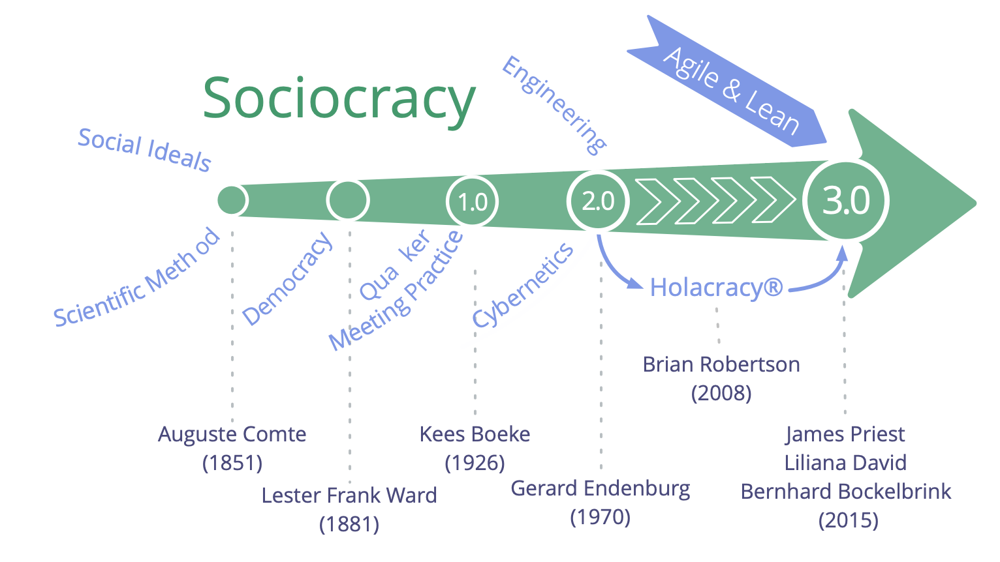

## What is Sociocracy 3.0?

Sociocracy 3.0 — a.k.a. "S3" — is <dfn data-info="Social Technology: Social technology is any process, technique, method, skill or any other approach that people can use to influence social systems — organizations, societies, communities etc. — to support achieving shared objectives and guide meaningful interaction and exchange.">social technology</dfn> for evolving agile and resilient organizations at any size, from small start-ups to large international networks and multi-agency collaboration.

Inside this practical guide you'll discover a comprehensive collection of tried and tested **concepts, principles and practices for improving performance, engagement and wellbeing** in organizations.

Since its launch in 2015, S3 patterns have been helping people across a diverse range of organizational contexts to get the best out of collaboration. From start-ups to small and medium businesses, large international organizations, investor-funded and nonprofit organizations, families and communities.

Using S3 can **help you to achieve your objectives** and successfully navigate complexity. You can make changes one step at a time, **without the need for sudden radical reorganization** or planning a long-term change initiative:

-   Simply start with identifying your areas of greatest need and select one or more practices or guidelines that help.
-   Proceed at your own pace, and develop  your skills and competences as you go.

**Regardless of your position in the organization**, you'll find many proven ideas that are relevant and helpful for you.

**Sociocracy 3.0 is free**, and licensed under a Creative Commons Free Culture License.

## How does Sociocracy 3.0 help?

S3 is a transformational technology for both individuals and the whole organization that will help you figure out how to meet your organization's biggest challenges, take advantage of the opportunities you face and resolve the most persistent problems.

Sociocracy 3.0 is designed to be flexible and supports experimentation and learning. You can take whatever you need, adapt things to suit your context and enrich your existing approach.

S3 integrates core concepts and practices found in agile methodologies, lean management, Kanban (and KMM), Design Thinking, Teal Organizations and the family of sociocracy-based governance methods (SCM/Dynamic Governance, Holacracy® etc.). It's complimentary and compatible with any agile or lean framework, including but not limited to Scrum and its various scaling frameworks.

**Inside this practical guide book you'll discover:**

-   Useful concepts that will help you **make more sense of your organization** and communicate effectively about where change is needed.
-   An **organic, iterative approach to change** that meets people where they are and helps them move forward at their own pace and according to their unique context and needs.
-   **Seven core principles** of agile and sociocratic collaboration
-   A coherent collection of **70+ practices and guidelines** to help you navigate complexity, and improve collaboration:
    -   **Simple, facilitated formats** that support teams in drawing on the collective intelligence of the group and incrementally processing available information into continuous improvement of work processes, products, services and skills.
    -   **Group-practices** to help organizations make the best use of talent they already have, through **people supporting each other** in building skills, accountability and engagement.
    -   Simple **tools for clarifying who does what**, freeing people up to decide and act for themselves as much as possible, within clearly defined constraints that enable experimentation and development.
    -   Patterns for **growing organizational structure beyond hierarchies** into flexible, decentralized networks where the flow of information and influence directly supports the creation of value.
-   A **glossary** with explanations for all the terms you might be unfamiliar with.

This practical guide to Sociocracy 3.0 is written and published by the three co-developers of Sociocracy 3.0.

True to the mindset behind S3, this book will always be a work in progress that grows and changes as we learn from people who are experimenting with S3 in organizations around the world. Since we started out 5 years ago, we have released several updates per year and we'll continue to do so in the years to come.

Even though several sections in this book are brief and may still be rough around the edges, the content and explanations have been sufficient for many people to get started with S3 and achieve positive change in their organizations. We hope you'll find it useful too.

## Influences and History of Sociocracy 3.0

The literal meaning of the term **sociocracy** is "rule of the companions": _socio_ — from Latin _socius_ — means "companion", or "friend", and the suffix _-cracy_ — from Ancient Greek κράτος (krátos) — means "power", or "rule".

The word sociocracy can be traced back to 1851, when **Auguste Comte** suggested applying a scientific approach to society: states would be governed by a body of scientists who are experts on society (which he termed "sociologists"). In his opinion, this future, although not yet achievable, would be inevitable.

A few decades later, **Lester Frank Ward**, used the word 'sociocracy' to describe the rule of people with relations with each other. Instead of having sociologists at the center, he wanted to give more power and responsibility to the individual, he imagined sociologists in a role as researchers and consultant.

In 1926, the Dutch reformist educator and Quaker **Kees Boeke**, established a residential school based on the principle of consent. Staff and students were treated as equal participants in the governance of the school, all decisions needed to be acceptable to everyone. He built this version of sociocracy on Quaker principles and practices, and described sociocracy as an evolution of democracy in his 1945 essay "Democracy as it might be".

**Gerard Endenburg**, also a Quaker and a student in Boeke's school, wanted to apply sociocracy in his family's business, Endenburg Elektrotechniek. He created and evolved the _Sociocratic Circle Organisation Method (SCM)_ (later becoming the "Sociocratic Method"), integrating Boeke's form of sociocracy with engineering and cybernetics. In 1978 Endenburg founded the Sociocratisch Centrum in Utrecht (which is now the Sociocratic Center in Rotterdam) as a means to promote sociocracy in and beyond the Netherlands. Since 1994 organizations in the Netherlands using SCM are exempt from the legal requirement to have a worker's council.

During the late 1990s and early 2000s, several non-Dutch speaking people came across sociocracy, but it wasn't until 2007 when **Sharon Villines and John Buck** launched their book, "We the People", that sociocracy became widely accessible to the English speaking world, and from there has began to migrate into several other languages.

Sociocracy has proven to be effective for many organizations and communities around the world, but it has yet to become viral.

In 2014 **James Priest and Bernhard Bockelbrink** came together to co-create a body of Creative Commons licensed learning resources, synthesizing ideas from Sociocracy, Agile and Lean. They discovered that organizations of all sizes need a flexible menu of practices and structures – appropriate for their specific context – that enable the evolution of a more sociocratic and agile approach to achieve greater effectiveness, coherence, fulfillment and wellbeing. The first version of **Sociocracy 3.0.** was launched in March 2015.

**Liliana David** joined the team soon after. Together they regularly collaborate to make S3 available and applicable to as many organizations as possible, and provide resources under a **Creative Commons Free Culture License** for people who want to learn, apply and tell others about Sociocracy_3.0.

### The Sociocracy 3.0 Movement

As interest in Sociocracy 3.0 grows there is a fast growing community of people from a variety of backgrounds — pioneering consultants, coaches, learning facilitators, and people applying S3 into their various contexts — who share appreciation for the transformational potential of Sociocracy 3.0 to help organizations and their members thrive. Many kindly dedicate some of their time to experimenting with and sharing about S3, and who collaborate to learn from one another and document experiences to inform the ongoing development and evolution of the framework and its various applications.

## Why "3.0"?

Sociocracy as a form of governance has been referred to since 1851. Subsequently it has been developed and adapted by many different people and organizations, including Gerard Endenburg, The Sociocracy Group (TSG) and Brian Robertson (HolacracyOne).

Yet, outside the Netherlands sociocracy has until recently remained largely unknown.

We love sociocracy because we see organizations and their members thrive when they use elements of it to enrich or transform what they currently do.

We also love agile, lean, Kanban, the Core Protocols, NVC, and many other ideas too. We believe that the world will be a better place as more organizations learn to pull from this cornucopia of awesome practices that are emerging into the world today, and learn to synthesize them with what they already know.

Therefore we decided to devote some of our time to develop and evolve Sociocracy, integrating it with many of these other potent ideas, to make it available and applicable to as many organizations as possible.

To this end, we recognize the value of a strong identity, a radically different way of distribution, and of adapting the *Sociocratic Circle Organization Method* to improve its applicability.

### The Name

The name "*Sociocracy 3.0*" demonstrates both respect to the lineage and a significant step forward.

It also helps avoid the perception of us misrepresenting the *Sociocratic Circle Organization Method* (SCM) as promoted by The Sociocracy Group.

### The New Model of Distribution

*Sociocracy 3.0* employs a non-centralized model for distribution. This is a paradigm shift in the way sociocracy is brought to people and organizations, and one that many people can relate to.

We support "viral" distribution through two key strategies:

* **Sociocracy 3.0 is open:** We want to encourage growth of a vibrant ecosystem of applications and flavors of sociocracy, where people share and discuss their insights and the adaptations they are making for their specific context. To this end Sociocracy 3.0 puts emphasis on communicating the underlying principles and explicitly invites the creativity of everyone to remix, extend and adapt things to suit their needs.
* **Sociocracy 3.0 is free:** To eliminate the barrier of entry for people and organizations we provide free resources under a *Creative Commons Free Culture License* to learn, practice and teach *Sociocracy 3.0*. Everyone can use our resources without our explicit permission, even in a commercial context, or as a basis for building their own resources, as long as they share their new resources under the same license. We expect and support other organizations, consultants, coaches, learning facilitators and trainers to follow our example and release their resources too.

### The Evolution of the Sociocratic Circle Organization Method

Maybe we need to make this explicit: Sociocracy 3.0 is not targeted specifically at the existing community of people exploring the *Sociocratic Circle Organization Method*, or at The Sociocracy Group (TSG). The *Sociocratic Circle Organization Method* (SCM) is already well developed and many people appear to be mostly happy with it.

Yet from our direct experience, even for those organizations that have heard about sociocracy, there are many obstacles to actually become invested. With *Sociocracy 3.0* we actively work on addressing and eliminating what stands in the way.

#### Reducing Risk and Resistance

*Sociocracy 3.0* meets organizations where they are and takes them on a journey of continuous improvement. There's no radical change or reorganization. *Sociocracy 3.0* provides a collection of independent and principle-based patterns that an organization can pull in one by one to become more effective. All patterns relate to a set of core principles, so they can easily be adapted to context.

#### Shifting Focus From Aim (or Purpose) to Need

*Sociocracy 3.0* moves primary focus from vision, mission, aims or purpose, towards the source of motivation, and aligns the organization towards discovering and addressing what it needs. Organizations which are already need-driven, value driven or customer-centric, find this immediately accessible.

#### Condensed to the Essentials

When looking at the norms, the *Sociocratic Circle Organization Method* may look big and scary. By focusing on the essentials only, *Sociocracy 3.0* offers a lightweight framework to adapt and build on as necessary.

This doesn't mean to say it's all easy: choosing to pull in *Sociocracy 3.0's* patterns requires an investment in learning and un-learning. This is why it's important to only pull in what you need, because there's no point to changing things if what you are doing is already good enough.

#### Integration With Agile and Lean Thinking

The *Sociocratic Circle Organization Method* is an "empty" method when it comes to operations and creating a culture of close collaboration. Many organizations already implement or show preference for lean and agile thinking for operations and collaboration. We believe this is a great idea, so *Sociocracy 3.0* is designed for easy adoption into lean and agile organizations.

#### A New Way to Evolve Organizational Structure

The organizational structure according to the *Sociocratic Circle Organization Method* is modeled on a hierarchy of domains. We see an increasing emergence of collaborative multi-stakeholder environments and the need for a wider variety of patterns for organizational structure.
Evolution of organizational structure happens naturally when the flow of information and influence in an organization is incrementally aligned to the flow of value. *Sociocracy 3.0* provides a variety of structural patterns that can be combined to evolve structure as required and in a flexible way.

<!-- split here -->

[&#9654; Concepts and Principles](concepts-and-principles.html)

