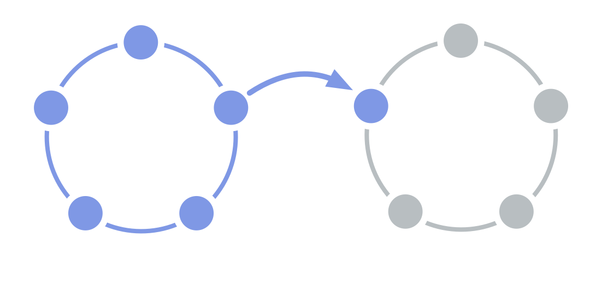

Enable the flow of information and influence between two teams.

A team selects one of its members to represent their interests in the <a href="glossary.html#entry-governance" class="glossary-tooltip" data-toggle="tooltip" title="Governance: The process of setting objectives and making and evolving decisions that guide people towards achieving those objectives.">governance</a> decisions of another team.

