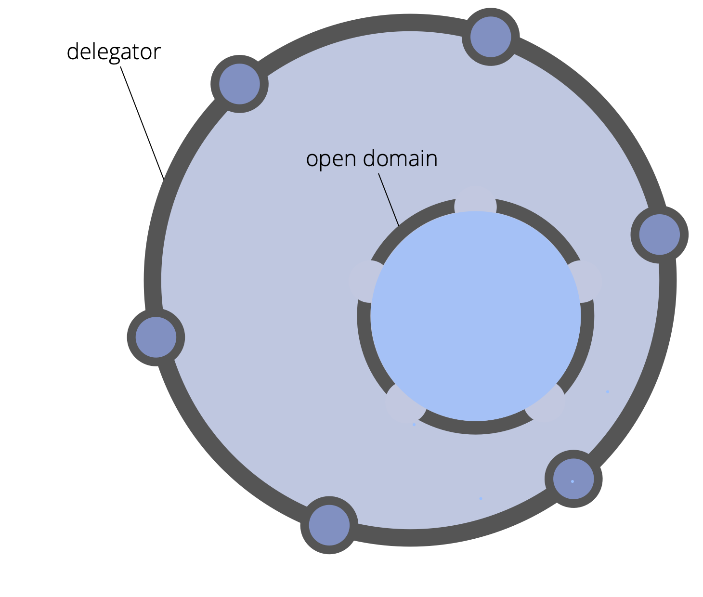

**A way to intentionally account for a domain by invitation rather than assignment.**
 
The delegator of the open domain clarifies:
 
- primary driver, key responsibilities and constraints of the open domain
- who is invited to contribute to the open domain
- constraints relating to the delegator’s participation in the open domain’s governance
 
The delegator of the open domain is accountable for ensuring regular review of the open domain.

Depending on the constraints set by delegators, contributors may account for work and/or governance of the open domain.
