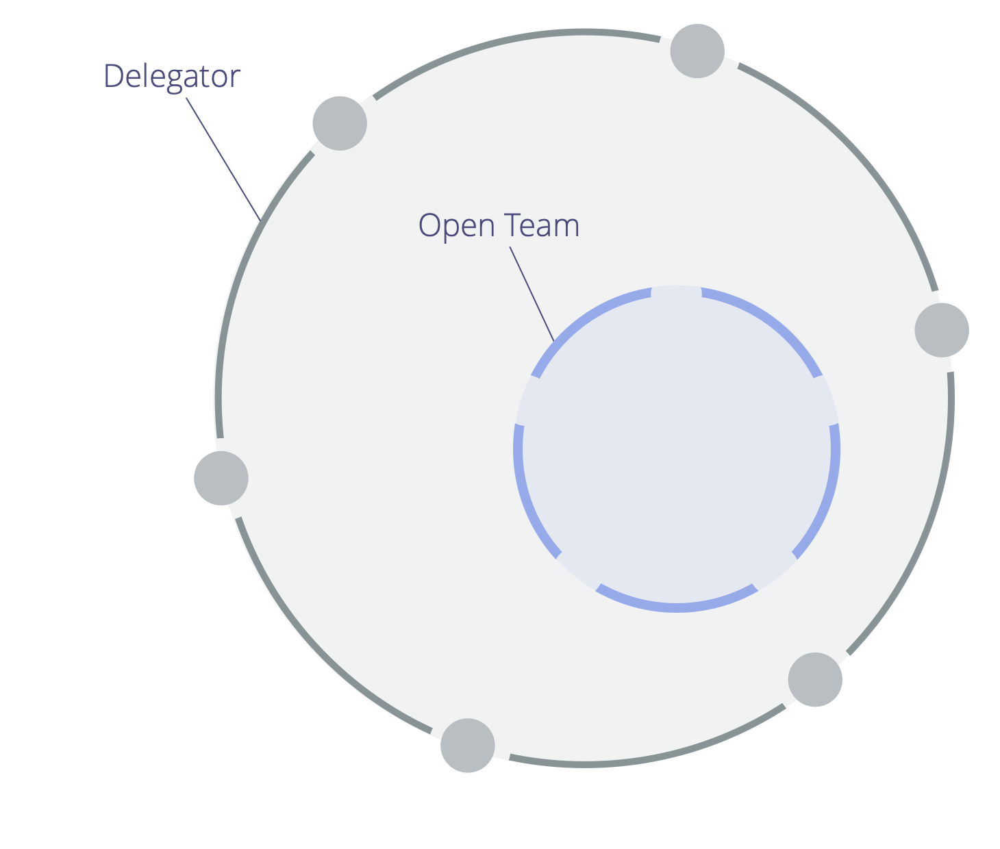

**Intentionally account for a domain by invitation rather than assignment, and request that those invited contribute when they can.**

_An **open team** is a group of people who are invited to contribute to the work and governance done in a domain when they can._

The <a href="#" class="tooltip" title="Delegator: An individual or group delegating responsibility for a domain to other(s).">delegator</a> of the domain creates an invitation that clarifies:

- the <a href="#" class="tooltip" title="Primary Driver: The primary driver for a domain is the main driver that people who account for that domain respond to.">primary driver</a>, key responsibilities and constraints of the open team's domain
- who is invited to contribute (the members of the open team)
- constraints relating to the delegator's participation in the open team's <a href="#" class="tooltip" title="Governance: The process of setting objectives and making and evolving decisions that guide people towards achieving those objectives.">governance</a>

Depending on the constraints set by the delegator, contributors may only <a href="#" class="tooltip" title="Operations: Doing the work and organizing day-to-day activities within the constraints defined through governance.">organize and do work</a>, or take part in governance as well.

The delegator is accountable for conducting regular reviews to support effectiveness of work and any decision making in the open team.

<a href="helping-team.html" title="Back to: Helping Team">◀</a> <a href="building-organizations.html" title="Up: Building Organizations">▲</a> <a href="open-systems.html" title="Read next: Open Systems">▶ Read next: Open Systems</a>

