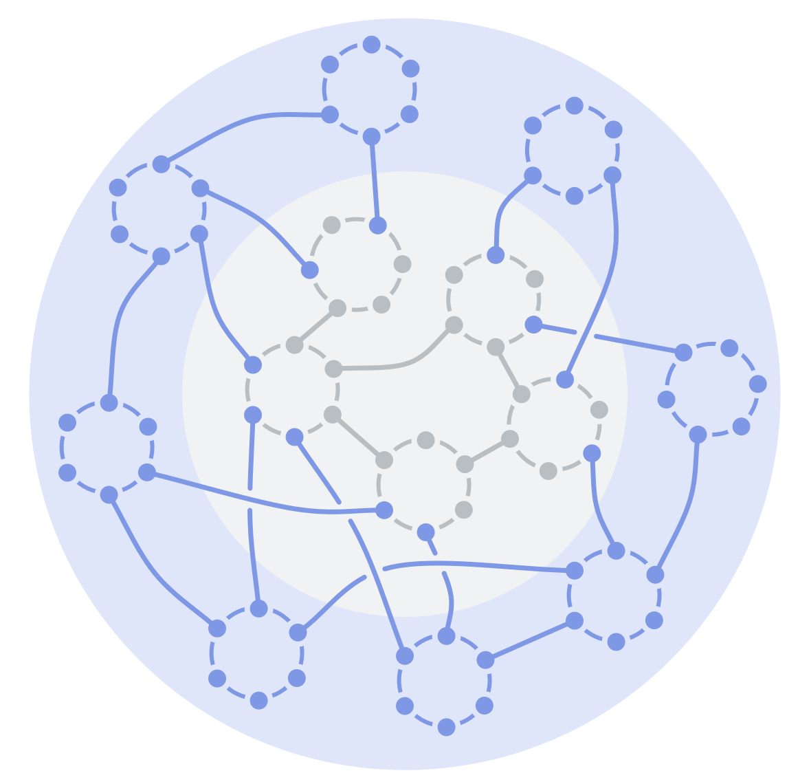

Deliver value in complex and competitive environments through <em>decentralization</em> (of resources and influence) and <em>direct interaction</em> between those creating value and the customers they serve.

Teams in the periphery:

-   deliver value in direct exchange with the outside world (customers, partners, communities, municipalities etc.)
-   steward the monetary resources and steer the organization

The center provides internal services to support the organization.

<a href="glossary.html#entry-domain" class="glossary-tooltip" data-toggle="tooltip" title="Domain: A distinct area of responsibility and authority within an organization.">Domains</a> are linked as required to flow information and influence, and to support collaboration around dependencies.

