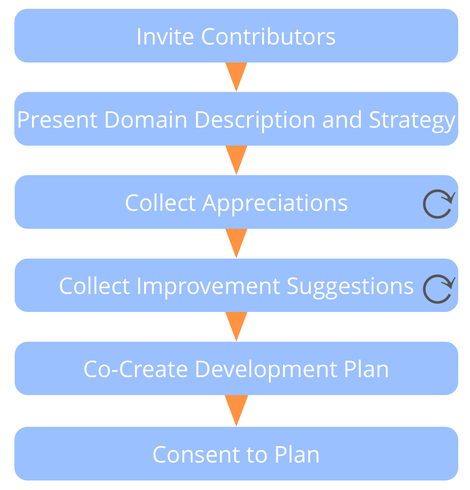
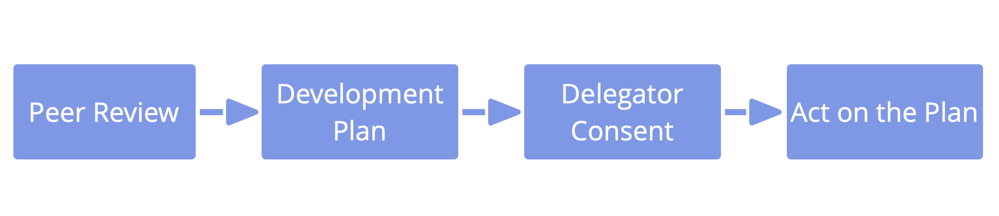

**People support each other to learn and grow in the roles and groups they serve.**

The role keeper - or group - leads the peer review by setting up the process and speaking first in each step.

Ensure to invite people with complementing perspectives to contribute to the review, and a facilitator.

Improvement suggestions apply to personal development, collaboration, updates to domain description (including driver statement) and strategy.

### Continuous improvement of people's ability to effectively fulfill roles or collaborate together in groups.

