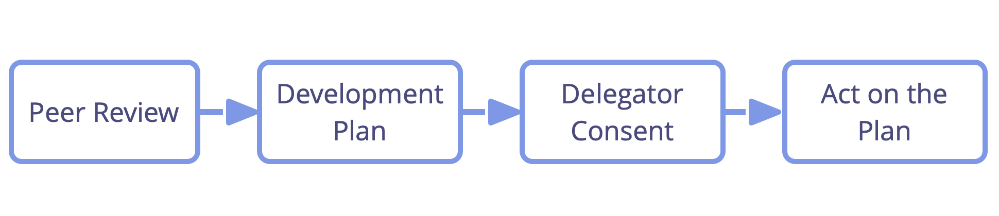

**Support each other to learn and grow in the roles and teams you serve in.**

The role keeper — or team — leads the peer review by setting up the process and speaking first in each step.

Ensure to invite people with complementing perspectives to contribute to the review, and a [facilitator](facilitate-meetings.html).

Improvement suggestions may relate to personal development, collaboration, updates to the <dfn data-info="Domain: A distinct area of influence, activity and decision making within an organization.">domain</dfn> description (including the <dfn data-info="Organizational Driver: A driver is a person’s or a group&apos;s motive for responding to a specific situation. A driver is considered an **organizational driver** if responding to it would help the organization generate value, eliminate waste or avoid harm.">driver</dfn>) and <dfn data-info="Strategy: A high level approach for how people will create value to successfully account for a domain.">strategy</dfn>.

[&#9654; Development Plan](development-plan.html) [&#9664; Peer Feedback](peer-feedback.html) [&#9650; Peer Development](peer-development.html)

