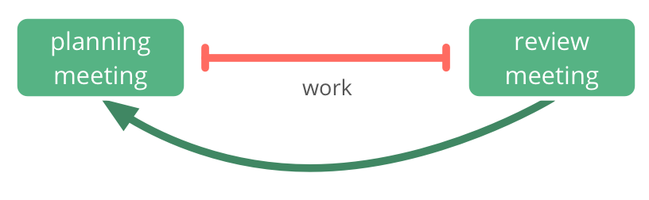

People meet at regular intervals (1-4 weeks) in time-boxed meetings to plan and review work.

-   select and estimate work items for the next iteration in a planning meeting
-   review completed work items and decide on re-work and changes for the next iteration in a review meeting
