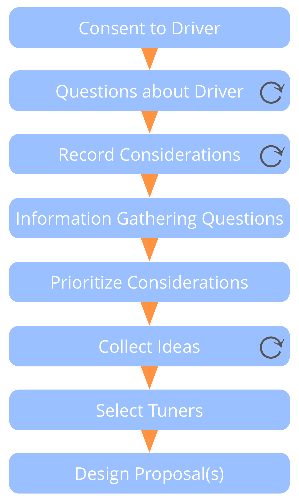
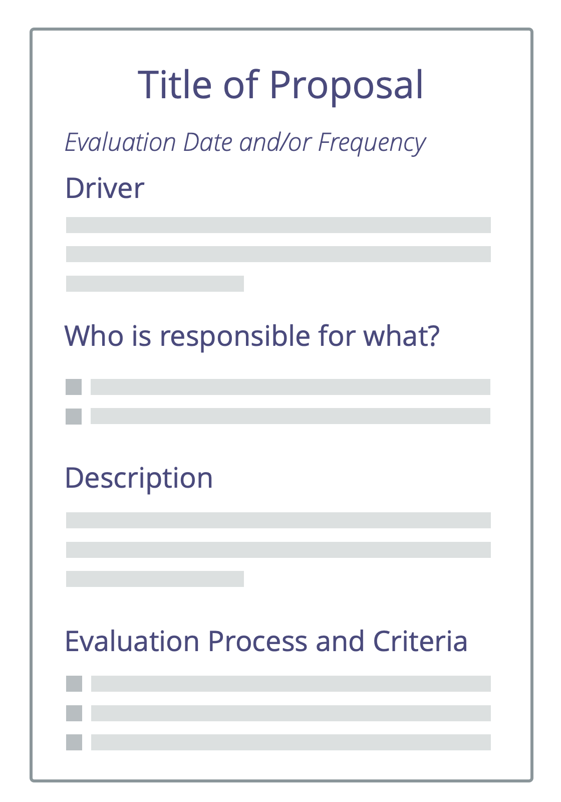

**A (facilitated) group process for co-creating a response to a driver.**

-   draws on the collective intelligence and diversity of perspective within a group
-   involves people in co-creating agreements
-   fosters accountability and sense of ownership

Proposal forming may be also be used by an individual.

  
### Proposal Forming Steps

- **Consent to driver**: _Is this driver relevant for us to respond to? Is the driver statement an accurate description of what is happening and what is needed?_
- **Deepen shared understanding of driver**: invite essential questions to understand more detail about the driver.
- **Collect considerations** phrased as questions relating to possible solutions. Questions either reveal constraints (information gathering questions) or possibilities (generative questions).
- **Answer** any information gathering questions if possible.
- **Prioritize** considerations.
- **Gather ideas** as possible ingredients for a proposal.
- **Design a proposal** for addressing the driver considering the creative ideas and information gathered so far. This is usually done by a smaller group (tuners).
  

### Selecting Tuners

-   who should be there?
-   who wants to be there?
-   who else may have a valuable contribution to make?
-   consider expertise, outside view, and inspiration
-   any objections to this group?
