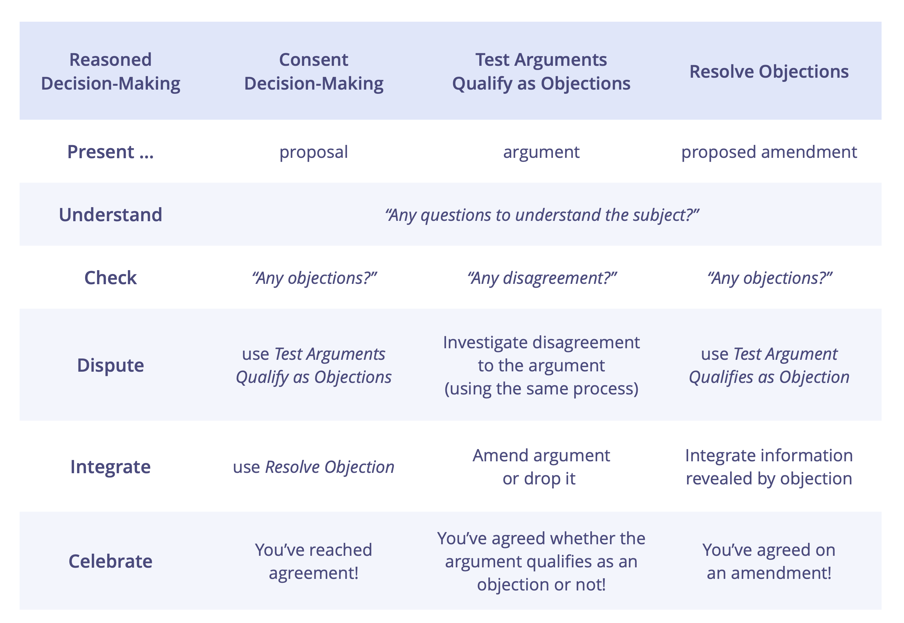

Engage in productive dialogue by investigating different perspectives and the knowledge of participants, to reach agreement on what is considered viable, relevant, valid or empirically true.

There are many paths people can follow to arrive at a decision with others (majority, consensus, authoritative, etc), but for any approach that uses reason as a basis for that agreement, they typically follow a similar pattern of _Reasoned Decision-Making_.

Reasoned Decision-Making lays out the process that groups take when applying reason to check whether a proposal, existing agreement or amendment is good enough, or if a particular argument is relevant, valid or empirically true.

## The steps of the process

**Step 1: Present** the subject for investigation (this could be an argument, or a proposal for how to proceed).

**Step 2: Understand** the subject (e.g. through clarifying questions).

**Step 3: Check** if anyone disagrees with the subject (meaning they question the viability of the proposal or the validity of the argument), e.g. by using hand signs. Any disagreements are explained in Step 4. If there are no disagreements, **proceed to step 6** (Celebrate), otherwise take one disagreement at a time and: 

**Step 4: Dispute:** Hear the reasoning for the disagreement and determine if the argument put forward has any validity.

**Step 5: Integrate** any information revealed in the previous step to improve the subject, then go back to step 3.

**Step 6: Celebrate** reaching agreement.

How people undergo each of these steps varies and depends a lot on culture, context, preference, the number of people involved, and on whether they are communicating asynchronously or meeting face-to-face. 

## Mapping Reasoned Decision-Making to other patterns in S3

Reasoned Decision-Making is reflected in all of the S3 process patterns that support groups to reach agreement. Understanding this meta-pattern helps people to more effectively apply them:

-   [Consent Decision-Making](consent-decision-making.html), for testing if a proposal or existing agreement is good enough and safe enough. And, within this, two nested patterns:
-   [Test Arguments Qualify as Objections](test-arguments-qualify-as-objections.html), for testing if arguments qualify as objections and only acting on those that do.
-   [Resolve Objections](resolve-objections.html), for using the information revealed by objections to make and evolve agreements. 

Each of the three processes focuses on the investigation of a different subject: 

-    In _Consent Decision-Making_ the subject is a **proposal**.
-    In _Test Argument Qualifies as Objection_ the subject is an **argument** that indicates a possible objection.
-    In _Resolving Objections_ - the subject is a **proposed amendment**. 

