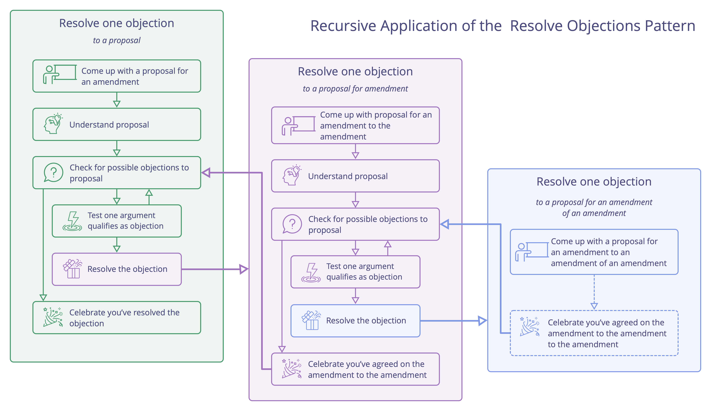

**Resolve objections one at a time by using the information they contain to make and evolve agreements.**

Choose an option for resolving an <a href="#" class="tooltip" title="Objection: An argument – relating to a proposal, agreement, activity or the existing state of affairs – that reveals consequences or risks you&#x27;d rather avoid, or demonstrates worthwhile ways to improve.">objection</a> that looks most promising, and if that fails, simply pick another one. Each attempt will help you understand more of the information the objection contains, and bring the group closer to proposing an amendment that resolves the objection.

Often, asking the person who brings the objection to propose an amendment, is a productive place to start.

Typically it's most effective to **take one objection at a time**, resolve all objections to a proposed amendment, and then continue with the next main objection.

<a href="test-arguments-qualify-as-objections.html" title="Back to: Test Arguments Qualify as Objections">◀</a> <a href="sense-making-and-decision-making.html" title="Up: Sense-Making and Decision-Making">▲</a> <a href="evaluate-and-evolve-agreements.html" title="Read next: Evaluate And Evolve Agreements">▶ Read next: Evaluate And Evolve Agreements</a>

