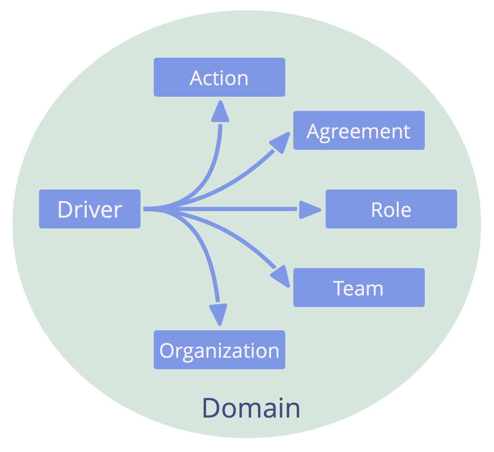
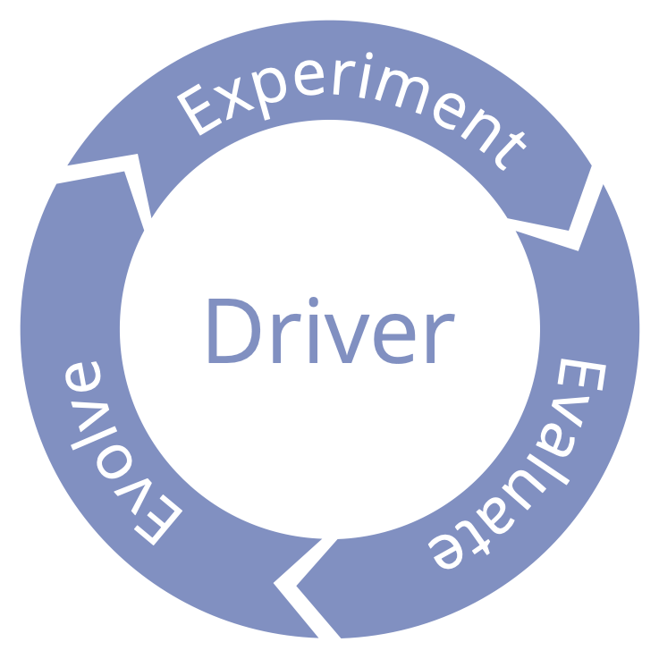

_Clarify what's happening and what's needed in relation to the organization, and respond as required._

Responses to drivers:

-   action
-   decision (including creating a role, circle, helping team or open domain)

### Qualify Organizational Drivers

Some drivers are (directly or indirectly) related to an organization's primary driver, these are considered **organizational drivers**. Other drivers do not fall within the organization's domain.

A simple way to qualify organizational drivers is by checking:

_Would responding to this driver improve - or avoid impeding - flow of value to an existing organizational driver? a.k.a. can it help or harm us?_

### Review of Drivers

The response to a driver is usually an experiment that is evolved over time, based on learning.

-   Is the description of the situation still correct?
-   Do we still associate the same needs with the situation?
-   Is the driver still within our domain?
-   Is the driver still relevant?
