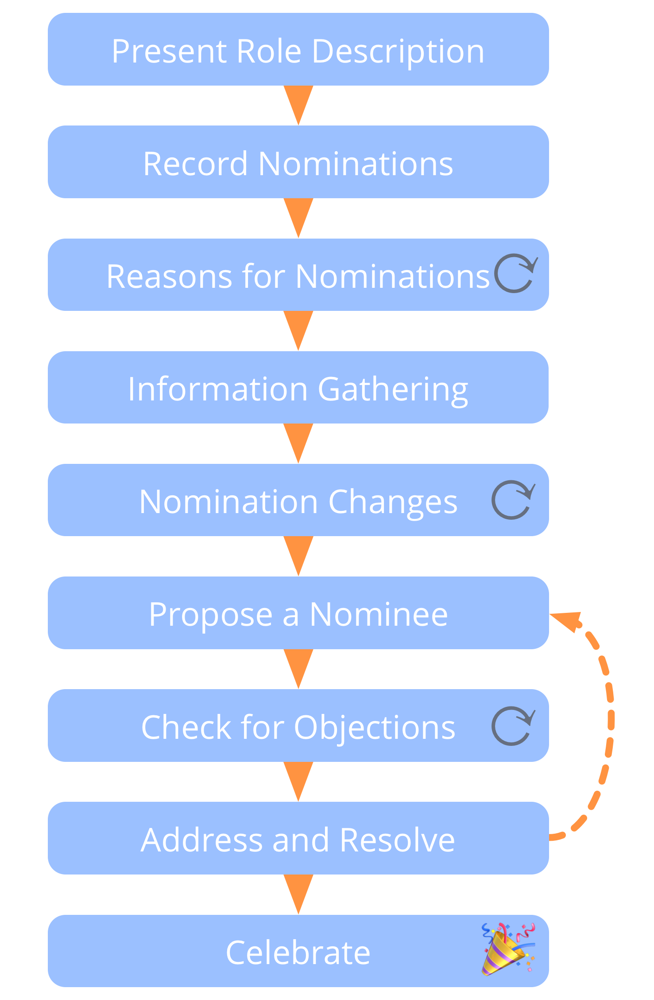

**A group process for selecting people for roles.**

-   People avoid expressing interest before the selection
-   Nominations are made on the strength of the reason, not according to the majority
-   You can nominate yourself or pass
-   When checking for objections, ask the person nominated last

Objections to a nominee may be resolved in many ways, including amending the role's domain description or by nominating someone else.

**Note:** This pattern can also be used for selection between a variety of options in other circumstances.