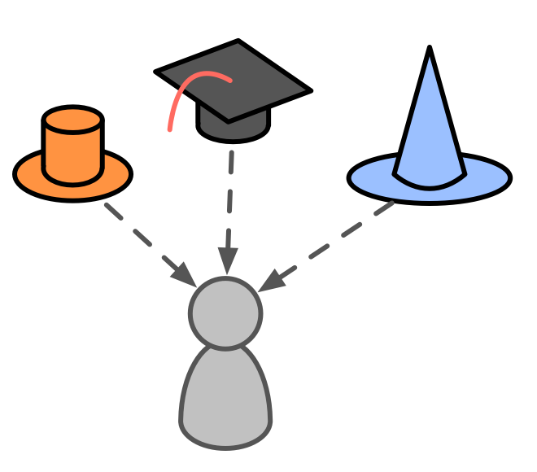
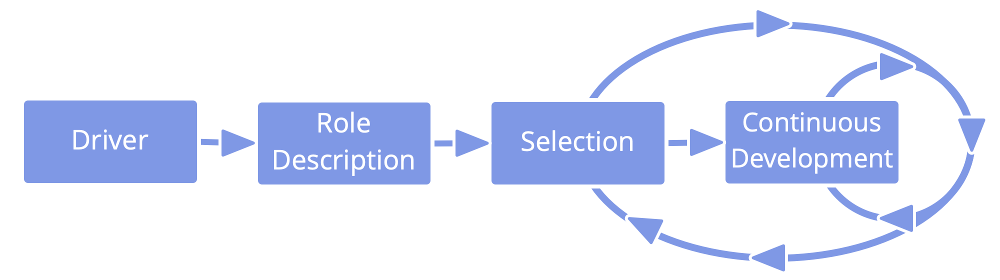

**Delegate accountability for a domain to individuals.**

A role is an area of accountability defined by a domain and assigned to an individual (the **role keeper**), who has autonomy to decide and act within the constraints of the role's domain.

The role keeper leads in creating a strategy for how to account for their domain, and evolves their strategy in collaboration with the delegator.

A role is a simple way for a group to delegate recurring tasks or a specific area of work to one of its members.

- people can be in more than one role, and roles can be fulfilled by more than one person
- role keepers are selected by consent and for a limited term
- peers support one another to develop in the roles they fulfill

A role keeper may maintain a logbook and a governance backlog to evolve their approach towards delivering value.

**Note**: In S3, guidelines, processes or protocols created by individuals in roles are treated as agreements.  

### Role: one way to account for a domain

