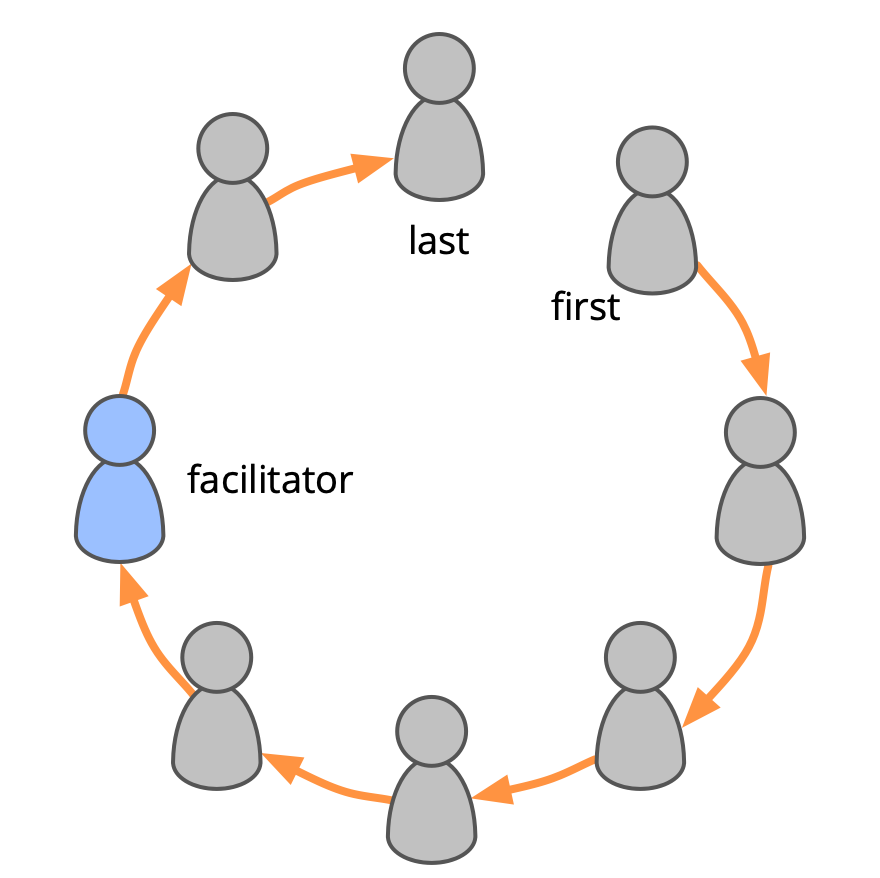

 

**A group facilitation technique to maintain equivalence.**

-   go around the circle giving everyone the chance to speak
-   begin each round with a different person, and change direction (clockwise or ccw) to bring variation to who speaks first and last, and to the order of people's contributions.

Experienced groups might sometimes choose to fast-track certain rounds in S3 group processes.
